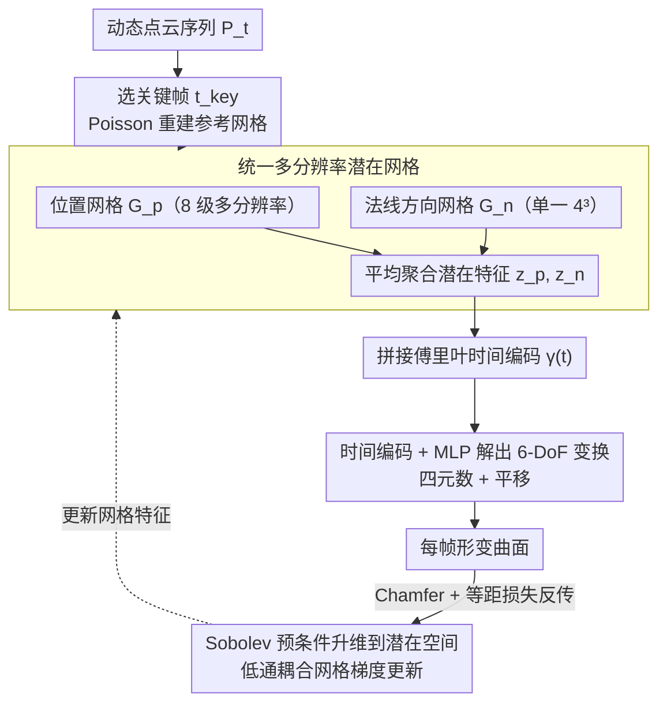

# Neu-PiG: Neural Preconditioned Grids for Fast Dynamic Surface Reconstruction on Long Sequences

**会议**: CVPR 2026  
**arXiv**: [2602.22212](https://arxiv.org/abs/2602.22212)  
**领域**: 3D视觉  
**关键词**: 动态曲面重建, 预条件潜在网格, Sobolev预条件, 多分辨率体素, 形变估计  

## 一句话总结

Neu-PiG 提出一种基于预条件多分辨率潜在网格的快速优化方法，将关键帧参考网格的位置和法线方向编码为统一潜在空间，通过轻量级 MLP 解码为每帧 6-DoF 形变，在无需类别先验或显式对应关系的前提下，实现了比现有无训练方法快 60 倍以上的高保真动态曲面重建。

## 研究背景与动机

动态3D物体的时间一致性曲面重建是计算机视觉中一个核心但极具挑战性的问题。现有方法可以分为两大类：

**基于优化的方法**（如 DynoSurf、PDG）：直接对每个序列优化形变，精度高但运行时间长（通常需要 30 分钟以上），且在长序列上容易出现漂移和退化

**基于学习的方法**（如 CaDeX、M2V）：通过类别特定先验实现快速推理，但泛化能力受限于训练域，且需要预定义的对应关系

这两类方法各有优劣但互补。然而，一种**通用、高效、类别无关**的动态形状建模方法仍是开放挑战。核心困难在于：

- 长序列中误差容易累积导致对应关系漂移
- 哈希编码虽然紧凑但碰撞和非光滑特性不适合连贯的非刚性运动
- 逐帧优化形变场无法在长序列上保持全局时间一致性

Neu-PiG 的关键洞察是：通过将**所有时间步的完整形变**编码到一个**统一的、由参考曲面参数化的潜在空间**中，并配合 Sobolev 预条件来保证优化稳定性，可以同时兼顾速度和质量。

## 方法详解

### 整体框架

这篇论文要解决的是：长序列动态 3D 物体的时间一致曲面重建，既要像优化类方法那样高精度、又要像学习类方法那样快，还得类别无关、不需要预定义对应关系。已有优化方法逐帧优化形变场，长序列上容易漂移退化、动辄半小时；学习方法快但泛化受限于训练域。

Neu-PiG 的关键洞察是把所有时间步的完整形变编码进一个由参考曲面参数化的统一潜在空间，再配 Sobolev 预条件稳住优化。流程是：从序列选一个关键帧 $t_{\text{key}}$，Poisson 重建出参考网格 $\mathcal{X}_{t_{\text{key}}}$；在位置网格 $\mathcal{G}_p$ 和法线方向网格 $\mathcal{G}_n$ 里存可学习特征；把潜在特征与傅里叶时间编码拼接送进轻量 MLP，解出每帧的 6-DoF 变换；潜在网格的梯度更新则套一层 Sobolev 滤波保持空间连贯。

### 关键设计

**1. 统一多分辨率潜在网格：让所有时间步共享一套潜在空间，从根上避免长序列漂移**

逐帧独立优化形变场是漂移的根源——不同帧各学各的、误差越攒越多。Neu-PiG 把全序列形变压进同一套潜在网格。位置网格 $\mathcal{G}_p$ 用 8 级多分辨率（最粗 $2^3$、最细 $32^3$、每级分辨率递增 3 个元素、每单元存 30 维特征），各级输出不是独立处理而是平均聚合成统一表示

$$\boldsymbol{z}_p(\boldsymbol{x}_{i,t_{\text{key}}}) = \frac{1}{L} \sum_{l=1}^{L} \boldsymbol{z}_p^l(\boldsymbol{x}_{i,t_{\text{key}}})$$

平均（而非拼接）让网络学的是绝对形变而非分解形变，优化显著更稳。法线方向网格 $\mathcal{G}_n$ 只需单一 $4^3$ 分辨率、每单元存 2 维特征，作用是让空间相邻但法线不同的区域能各自独立形变。

**2. 时间编码 + MLP 解出 6-DoF 变换：用轻量网络把潜在特征翻译成逐帧刚性变换**

每个表面点的运动要随时间连续变化。归一化时间步 $\tilde{t} = (t-1)/(T-1)$ 先经傅里叶编码

$$\boldsymbol{\gamma}(t) = [\sin(\pi \nu_j \tilde{t}), \cos(\pi \nu_j \tilde{t})]_{j=1}^{M}$$

其中 $\nu_j = 2^{j-1}$、$M=4$ 产生 8 维时间嵌入。MLP 输入 $\boldsymbol{y}_i = (\boldsymbol{z}_n, \boldsymbol{z}_p, \boldsymbol{\gamma}(t))^T \in \mathbb{R}^{40}$，由 3 层全连接（512 隐藏单元 + LeakyReLU）输出 7 维变换（4 维四元数 + 3 维平移）。旋转通过偏移四元数标量分量 $\hat{\boldsymbol{q}} = \frac{(1+q_w, q_x, q_y, q_z)^T}{\|(1+q_w, q_x, q_y, q_z)^T\|}$ 保证零输出对应恒等旋转，平移用 $\hat{\boldsymbol{d}} = \tanh(0.1 \cdot \boldsymbol{d})$ 约束范围，最终 $\hat{\boldsymbol{x}}_{i,t} = \boldsymbol{R}(\hat{\boldsymbol{q}}_i) \boldsymbol{x}_{i,t_{\text{key}}} + \hat{\boldsymbol{d}}_i$。

**3. Sobolev 预条件升维到潜在空间：在高维潜在向量上做低通耦合，兼顾局部丰富与全局平滑**

哈希编码虽紧凑但碰撞、非光滑，不适合连贯的非刚性运动。本文把 PDG 里只作用于原始形变场的 Sobolev 预条件升维到高维潜在向量，网格参数按预条件梯度更新

$$\boldsymbol{z}^l \leftarrow \boldsymbol{z}^l - \eta (\mathbf{I} + \lambda^l \boldsymbol{L}^l)^{-2} \frac{\partial \mathcal{L}}{\partial \boldsymbol{z}^l}$$

$\boldsymbol{L}^l$ 是拉普拉斯矩阵，$(\mathbf{I}+\lambda^l\boldsymbol{L}^l)^{-2}$ 充当低通滤波器耦合相邻单元格，让潜在更新空间连贯——允许更丰富的局部变化同时保持全局平滑。

### 损失函数 / 训练策略

总损失由形变损失和等距损失组成 $\mathcal{L} = \mathcal{L}_{\text{def}} + w_{\text{iso}} \mathcal{L}_{\text{iso}}$。形变损失用鲁棒 Chamfer 距离加时间自适应置信权重

$$\mathcal{L}_{\text{def}} = \frac{1}{T} \sum_{t=1}^{T} w_{\text{conf}}(t) \cdot L_{\text{CD}}(\hat{\mathcal{X}}_t, \mathcal{P}_t)$$

等距损失惩罚边长变化以保持局部结构

$$\mathcal{L}_{\text{iso}} = \frac{1}{T|\mathcal{E}|} \sum_{t=1}^{T} \sum_{(i,j) \in \mathcal{E}} |\|\hat{\boldsymbol{e}}_{ij,t}\| - \text{sg}(\|\hat{\boldsymbol{e}}_{ij,t_{\text{key}}}\|)|$$

非逐帧而是全序列联合优化 + 轻量 MLP + 预条件加速收敛，三者结合实现比现有无训练方法快 60 倍以上的秒级重建。

## 实验关键数据

### 主实验结果（Tab. 1: DFAUST / DT4D / AMA）

| 数据集 | 方法 | CD (×10⁻⁵) ↓ | NC ↑ | F-0.5% ↑ | Corr. ↓ | 时间 ↓ |
|--------|------|-------------|------|----------|---------|--------|
| DFAUST | DynoSurf | 2.13 | 0.953 | 0.980 | 0.010 | 30 min |
| DFAUST | PDG | 0.52 | 0.957 | 0.988 | 0.018 | 7 min |
| DFAUST | **Ours†** | **0.40** | **0.967** | **0.989** | **0.008** | **8 s** |
| DT4D | DynoSurf | 15.18 | 0.919 | 0.773 | 0.032 | 30 min |
| DT4D | PDG | 1.53 | 0.960 | 0.961 | 0.058 | 7 min |
| DT4D | **Ours†** | **0.96** | **0.969** | **0.962** | **0.034** | **8 s** |
| AMA | DynoSurf | 1.01 | 0.918 | 0.921 | 0.044 | 30 min |
| AMA | PDG | 0.47 | 0.939 | 0.985 | 0.030 | 7 min |
| AMA | **Ours** | **0.44** | **0.951** | **0.988** | **0.018** | **32 s** |

### 长序列可扩展性（AMA，Tab. 2）

| 帧数 T | 方法 | CD (×10⁻⁵) ↓ | NC ↑ | Corr. ↓ | 时间 ↓ |
|--------|------|-------------|------|---------|--------|
| 40 | PDG | 0.66 | 0.923 | 0.042 | 28 min |
| 40 | **Ours** | **0.53** | **0.947** | **0.019** | **47 s** |
| 80 | PDG | 1.35 | 0.906 | 0.089 | 93 min |
| 80 | **Ours** | **1.04** | **0.940** | **0.023** | **84 s** |
| 120 | PDG | 30.20 | 0.788 | 0.118 | 158 min |
| 120 | **Ours** | **1.31** | **0.926** | **0.028** | **110 s** |

PDG 在 120 帧时 CD 暴增至 30.20，而 Neu-PiG 仅为 1.31，展现出极强的长序列稳定性。

### 消融实验（Tab. 3: 组件消融）

| 配置 | CD (×10⁻⁵) ↓ | NC ↑ | Corr. ↓ |
|------|-------------|------|---------|
| Hash Encoding 替换 | 1.23 | 0.903 | 0.045 |
| 无预条件 | 0.98 | 0.955 | 0.036 |
| 无法线编码 $\boldsymbol{z}_n$ | 0.91 | 0.968 | 0.036 |
| 单分辨率 L=1 | 0.98 | 0.965 | 0.036 |
| **完整模型** | **0.87** | **0.969** | **0.034** |

关键发现：Hash Encoding 替换导致最大退化（CD 从 0.87→1.23），验证了多分辨率平均聚合设计的优越性。

## 亮点与洞察

1. **统一潜在空间设计**：所有时间步共享一个潜在网格（而非 PDG 的逐帧独立形变场），这是实现长序列稳定性的关键——不同时间步通过统一空间共享信息，自然避免漂移
2. **平均聚合 vs 拼接**：多分辨率特征使用平均而非拼接，使每一级学到的是绝对形变而非形变的分解，优化更稳定
3. **Sobolev 预条件的升维应用**：将 Sobolev 预条件从 PDG 中的原始形变场扩展到高维潜在向量，允许更丰富的局部变化同时保持全局平滑
4. **60× 加速的根源**：非逐帧优化而是全序列联合优化 + 轻量 MLP + 预条件加速收敛，三者结合实现秒级重建
5. **无需任何先验或对应关系**：完全类别无关，适用于人体和动物等多种类型

## 局限性

1. **固定拓扑假设**：依赖关键帧网格提供正确拓扑，无法处理拓扑变化（如物体分裂或合并）
2. **潜在网格容量有限**：当序列极长或运动极复杂时，固定大小的网格可能无法充分编码所有变形信息
3. **大运动和遮挡敏感**：对应关系通过 Chamfer 距离隐式推断，极大运动或严重遮挡可能导致重建精度下降
4. **仅处理点云输入**：未涉及从 RGB 图像或深度图的端到端重建

## 评分

⭐⭐⭐⭐ (4/5)

方法设计精巧，将 Sobolev 预条件引入潜在空间的思路新颖且有效。60× 加速且精度提升的实验结果极为亮眼，长序列的可扩展性令人印象深刻。但方法仍假设固定拓扑且仅针对点云输入，适用范围有一定限制。

<!-- RELATED:START -->

## 相关论文

- [\[CVPR 2026\] Neural Gabor Splatting: Enhanced Gaussian Splatting with Neural Gabor for High-frequency Surface Reconstruction](neural_gabor_splatting.md)
- [\[CVPR 2026\] ManifoldNeuS: Manifold-aware View Optimizability for Pose-Free Neural Surface Reconstruction](manifoldneus_manifold-aware_view_optimizability_for_pose-free_neural_surface_rec.md)
- [\[CVPR 2026\] Long-Tail Internet Photo Reconstruction](long-tail_internet_photo_reconstruction.md)
- [\[CVPR 2026\] Neural Field-Based 3D Surface Reconstruction of Microstructures from Multi-Detector Signals in Scanning Electron Microscopy](neural_field-based_3d_surface_reconstruction_of_microstructures_from_multi-detec.md)
- [\[CVPR 2026\] Neural Dynamic GI: Random-Access Neural Compression for Temporal Lightmaps in Dynamic Lighting Environments](neural_dynamic_gi_random-access_neural_compression_for_temporal_lightmaps_in_dyn.md)

<!-- RELATED:END -->
