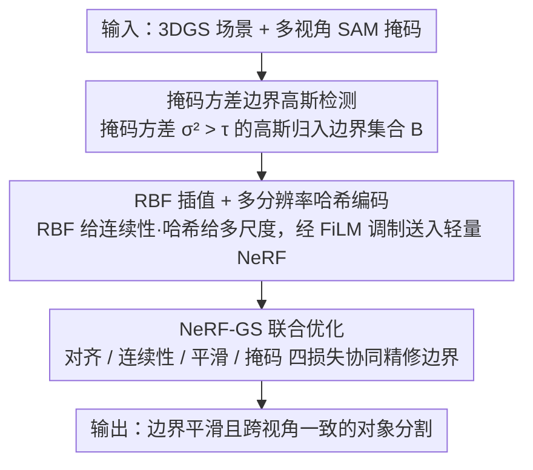

# NG-GS: NeRF-Guided 3D Gaussian Splatting Segmentation

**会议**: CVPR 2026 Highlight  
**arXiv**: [2604.14706](https://arxiv.org/abs/2604.14706)  
**代码**: [github.com/BJTU-KD3D/NG-GS](https://github.com/BJTU-KD3D/NG-GS)  
**领域**: 三维视觉  
**关键词**: 3D Gaussian Splatting, segmentation, NeRF, boundary refinement, hash encoding

## 一句话总结

提出 NG-GS 框架，利用 NeRF 的连续建模能力解决 3DGS 分割中的边界离散化问题，通过 RBF 插值构建连续特征场结合多分辨率哈希编码和 NeRF-GS 联合优化实现高质量对象分割。

## 研究背景与动机

3DGS 已实现高效逼真的新视角合成，但其离散高斯表示导致对象边界处的分割具有锯齿和伪影。现有 3DGS 分割方法（特征蒸馏、前馈推理、掩码提升）大多忽略了高斯元素在边界的离散性问题。直接移除边界突变的高斯分布虽可改善分割但会干扰视觉质量。核心思路是利用 NeRF 的连续表示能力来调整 3DGS 在边界处的坐标和属性。

## 方法详解

### 整体框架

这篇论文要解决的是：3DGS 的离散高斯表示在对象边界处会产生锯齿和伪影，直接删掉边界突变的高斯虽能改善分割却会破坏视觉质量。核心思路是借 NeRF 的连续建模能力去调整 3DGS 在边界处的坐标和属性，让边界既分得准又看得好。

整体是两阶段流程：先做边缘高斯连续化——用掩码方差分析揪出模糊边界高斯，再用 RBF 插值和多分辨率哈希编码生成连续特征场；再做 NeRF-GS 联合优化——用对齐损失和空间连续性损失协调两个模型的输出，保证分割边界平滑过渡、跨视角一致。

### 关键设计

**1. 掩码方差边界高斯检测：自动定位需要精修的那批模糊边界高斯**

要精修边界先得找到边界。本文对每个高斯点收集多视角 SAM 生成的掩码信号集，计算掩码值的方差 $\sigma_i^2$——同一个高斯如果在不同视角里时而被判前景、时而判背景，方差就大、说明它正卡在边界上。方差大于阈值 $\tau$ 的点归入边界集合 $\mathcal{B}$，并在图像平面上沿边界框扩展采样查询点，无需任何人工标注。

**2. RBF 插值 + 多分辨率哈希编码：为边界查询点造一个连续且多尺度的特征场**

离散高斯之间是"空"的，边界精修需要连续表达。本文对查询点先用 K-NN 找邻居高斯、RBF 核加权插值出连续特征 $\mathbf{f}^{inter}$ 提供连续性，同时用多分辨率哈希编码提取从粗到细的空间特征 $\mathbf{f}^{hash}$ 提供多尺度表达，两者组合送入轻量 NeRF 模块——其中插值特征作为条件向量通过 FiLM 调制 NeRF 隐层。二者互补：RBF 给连续性，哈希给多尺度。

**3. NeRF-GS 联合优化：让 NeRF 当连续精修网络而非替代品，把边界对齐到一致**

把 NeRF 和 3DGS 各自训各自的不行，边界对不上。本文用四个损失把两者绑在一起协同优化：对齐损失约束边界区域 3DGS 和 NeRF 的 RGB 颜色与透明度一致；连续性损失约束相邻边界高斯点颜色一致；梯度平滑损失惩罚突变；掩码损失以 NeRF 密度加权做监督。NeRF 在这里是把离散边界"抹连续"的精修器，而不是另起炉灶替换 3DGS。

### 损失函数 / 训练策略

总损失 $\mathcal{L}_{total} = \mathcal{L}_{align} + \lambda_m \mathcal{L}_{mask} + \lambda_c \mathcal{L}_{cont} + \lambda_s \mathcal{L}_{smth}$。NeRF 和 3DGS 均使用 Adam 优化器联合训练，边界区域的局部 7×7 方差项用于促进对齐损失中的空间平滑。

## 实验关键数据

### 主实验

| 数据集 | 指标 | COB-GS | NG-GS | 提升 |
|--------|------|--------|-------|------|
| NVOS | B-mIoU | 79.1% | **84.7%** | +5.6pp |
| NVOS | mIoU | 92.1% | **92.6%** | +0.5pp |
| LERF-OVS | B-mIoU | 基线前 | **+4.4pp** | 显著 |
| ScanNet | B-mIoU | 基线前 | **+6.8pp** | 显著 |

在所有三个基准的所有指标上一致超越所有基线，边界 mIoU 提升最显著。

### 消融实验

- RBF 插值和哈希编码各自贡献互补：前者提供连续性，后者提供多尺度表达
- NeRF-GS 联合优化比单独优化任何一方效果更好
- 掩码方差阈值 $\tau=0.6$ 在精度和召回间达到最佳平衡

### 关键发现

- 边界 mIoU 的大幅提升（5-7pp）证实了连续化处理的有效性
- NeRF 作为连续精修网络而非替代方案的定位正确
- 方法可直接扩展到多对象分割场景

## 亮点与洞察

- NeRF 的连续性与 3DGS 的高效性互补的思路新颖
- 掩码方差自动检测边界高斯无需人工标注
- FiLM 调制将 RBF 插值特征融入 NeRF 的设计简洁有效

## 局限与展望

- NeRF 模块带来额外训练和推理开销
- 边界高斯检测依赖 2D 分割模型（SAM）的质量
- 在大规模场景中 K-NN 查询和 RBF 插值的计算效率需优化

## 相关工作与启发

- NeRF-GS 互补的思路可推广到编辑、生成等其他 3DGS 任务
- 多分辨率哈希编码在边界精修中的应用可借鉴到其他精细化任务
- 掩码方差分析为自动边界检测提供了简单有效的基线

## 评分

7/10 — 方法设计巧妙，边界 mIoU 提升显著，但额外计算开销需权衡。

<!-- RELATED:START -->

## 相关论文

- [\[CVPR 2026\] LangRef3DGS: Natural Language-Guided 3D Referential Segmentation from Partial Observations via 3D Gaussian Splatting](langref3dgs_natural_language-guided_3d_referential_segmentation_from_partial_obs.md)
- [\[CVPR 2026\] Exact-GS: Mathematically Rigorous and Accurate 3D Gaussian Splatting for 3D X-ray Reconstruction](exact-gs_mathematically_rigorous_and_accurate_3d_gaussian_splatting_for_3d_x-ray.md)
- [\[CVPR 2026\] Energy-GS: Image Energy-guided Pose Alignment Gaussian Splatting with redesigned pose gradient flow](energy-gs_image_energy-guided_pose_alignment_gaussian_splatting_with_redesigned_.md)
- [\[CVPR 2026\] DropAnSH-GS: Dropping Anchor and Spherical Harmonics for Sparse-view Gaussian Splatting](dropping_anchor_and_spherical_harmonics_for_sparse-view_gaussian_splatting.md)
- [\[ICLR 2026\] PD²GS: Part-Level Decoupling and Continuous Deformation of Articulated Objects via Gaussian Splatting](../../ICLR2026/3d_vision/pd2gs_part-level_decoupling_and_continuous_deformation_of_articulated_objects_vi.md)

<!-- RELATED:END -->
