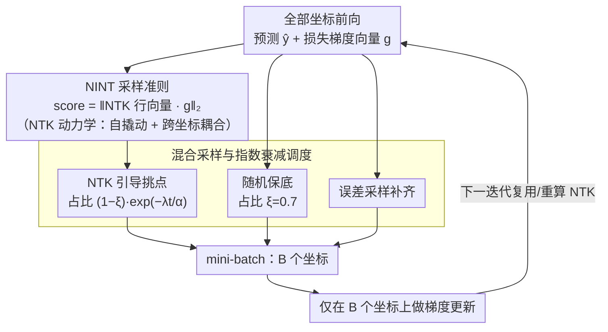

# NTK-Guided Implicit Neural Teaching

**会议**: CVPR 2026  
**arXiv**: [2511.15487](https://arxiv.org/abs/2511.15487)  
**代码**: 有 (Project page)  
**领域**: 3D视觉  
**关键词**: Implicit Neural Representations, Neural Tangent Kernel, 训练加速, 坐标采样, INR  

## 一句话总结
提出 NINT，利用 Neural Tangent Kernel (NTK) 的行向量来度量每个坐标对全局函数更新的影响力，从而动态选择既有高拟合误差又有高全局影响力的坐标进行训练，将 INR 训练时间减少近一半且不损失重建质量。

## 研究背景与动机
Implicit Neural Representations (INR) 用 MLP 将坐标映射为信号值（如像素颜色），实现分辨率无关的连续信号建模。然而高分辨率信号（如 $1024 \times 1024$ 图像有 100 万个像素坐标）导致训练代价极高。

现有加速方案各有局限：
- **分区方法**（多个小 MLP 分管不同区域）：增加架构复杂度和推理开销
- **混合显隐式方法**（hash grid、张量等）：提高内存消耗
- **元学习方法**（预训练初始化）：需要大量同质数据集，缺乏灵活性
- **采样方法**（每步只选部分坐标训练）：轻量但多数仅依据静态误差启发式，忽略 MLP 训练过程中参数更新的动态特性

核心洞察：现有基于误差的采样方法（如 INT、EGRA、EVOS）隐式地假设 NTK 矩阵是对角且各向同性的（即 $K_{\theta^t} \approx cI$），这意味着 (1) 没有跨坐标影响、(2) 所有坐标的 self-leverage 相同。但实际中 MLP 因权重共享而产生强烈的非对角耦合，对角值也因坐标所在区域（边缘 vs 平滑区域）而相差数个数量级。因此单纯选高误差点可能浪费梯度步骤在"高误差但低影响力"的点上。

## 方法详解

### 整体框架
INR 训练慢的根源在于每一步都要对全图上百万个坐标做梯度下降，而其中绝大多数坐标早已拟合得很好、对网络几乎没有信息增量。NINT 想做的就是在每个迭代里只挑出"最值得训"的 $B$ 个坐标组成 mini-batch，把算力压到刀刃上。它和已有采样法的关键差别在于"值得训"的判据：别人按拟合误差大小挑点，NINT 则用 Neural Tangent Kernel（NTK）来衡量一个坐标的损失被反传后会在多大范围内推动整个函数演化，再把误差和这种"全局影响力"乘到一起排序。

落到一次迭代上，流程是这样：先前向算出所有坐标的预测 $\hat{\mathbf{y}}_i = f_{\theta_t}(\mathbf{x}_i)$ 和损失梯度向量 $\mathbf{g}^t = [\nabla_f \mathcal{L}(f_{\theta^t}(\mathbf{x}_i), \mathbf{y}_i)]_{i=1}^N$；再对每个坐标 $\mathbf{x}_i$ 取出它在 NTK 矩阵中的那一行 $K_{\theta^t}(\mathbf{x}_i, :)$；用这一行去加权全局梯度，得到每个坐标的分数，挑分数最高的 $B$ 个坐标 $\mathcal{B}_t = \arg\max_{|\mathcal{B}|=B} \|[K_{\theta^t}(\mathbf{x}_i,:) \cdot \mathbf{g}^t]_{i \in \mathcal{B}}\|_2$，只在这批坐标上更新参数。

### 关键设计

**1. NTK 驱动的训练动力学：把"采样该选谁"翻译成一个可计算的物理量**

要回答"训哪个坐标最划算"，先得知道训一个坐标到底会改变什么。NINT 从连续时间视角看 INR 的函数演化：对参数更新做一阶 Taylor 展开、代入梯度下降的参数演化方程，整张函数的瞬时变化率就写成了 NTK 与损失梯度的乘积

$$\frac{\partial f_{\theta^t}(\mathbf{x})}{\partial t} \simeq -\frac{\eta}{N} [K_{\theta^t}(\mathbf{x}_i, \mathbf{x})]_{i=1}^{N \top} \cdot [\nabla_f \mathcal{L}(f_{\theta^t}(\mathbf{x}_i), \mathbf{y}_i)]_{i=1}^N$$

其中 NTK 是两个坐标各自参数梯度的内积 $K_{\theta^t}(\mathbf{x}_i, \mathbf{x}) = \langle \frac{\partial f_{\theta^t}(\mathbf{x}_i)}{\partial \theta^t}, \frac{\partial f_{\theta^t}(\mathbf{x})}{\partial \theta^t} \rangle$。这个公式把抽象的"影响力"变成了能算的东西，而且分成两层来看：对角元素 $K_{\theta^t}(\mathbf{x}_i, \mathbf{x}_i) = \|\frac{\partial f_{\theta^t}(\mathbf{x}_i)}{\partial \theta^t}\|_2^2$ 是 self-leverage，刻画训一个坐标对它自身输出的撬动有多大；非对角元素 $K_{\theta^t}(\mathbf{x}_i, \mathbf{x}_j)$ 则是 cross-coordinate coupling，刻画训坐标 $\mathbf{x}_i$ 会"连带"把 $\mathbf{x}_j$ 处的输出改变多少。正是这两项揭穿了 error-only 方法的盲区——只看误差等价于把 NTK 当成 $cI$，假设各坐标自撬动相同、彼此互不影响；但真实 MLP 里边缘/高频区域的对角值比平滑区域大上几个数量级，权重共享又制造了强烈的非对角耦合，所以高误差的点未必是高影响力的点。

**2. NINT 采样准则：用 NTK 行向量给误差重新加权，同时吃进自撬动和耦合**

有了上面的动力学，挑坐标的目标自然就是"让这一步带来的整体函数变化最大"。NINT 把每个坐标的分数定义为它的 NTK 行向量与全局损失梯度向量的乘积范数

$$\text{score}(\mathbf{x}_i) = \|K_{\theta^t}(\mathbf{x}_i, :) \cdot \mathbf{g}^t\|_2$$

这一个范数里同时压进了两件事：$\mathbf{g}^t$ 各分量带来的拟合误差信息，以及 NTK 行向量带来的全局影响力（self-leverage 加 cross-coupling）。和 error-only 法摆在一起对比就很清楚——后者选的是 $\arg\max \|\nabla_f \mathcal{L}\|_2$，相当于默认 $K = cI$ 把影响力那一维抹平了；NINT 选的是 $\arg\max \|K_{\theta^t}(\mathbf{x}_i,:) \cdot \mathbf{g}^t\|_2$，把完整 NTK 信息显式用了起来，于是会优先训那些"既没拟合好、又能牵动一大片"的坐标。

**3. 混合采样与指数衰减调度：把算得起的 NTK 用在最该用的时候**

完整 NTK 是 $N\times N$ 的，逐步全算并不现实，所以 NINT 在工程上把一个 batch 拆成三股：比例 $\xi$（默认 0.7）的坐标纯随机采样保底覆盖，比例 $(1-\xi)\exp(-\lambda t/\alpha)$ 的坐标由 NTK 引导挑选（$\lambda=1.0,\alpha=10$），剩下的用传统误差采样补齐。NTK 那一股的占比随训练步数 $t$ 指数衰减，背后有两层考虑：一是训练后期误差分布趋于均匀，NTK 引导的边际收益本就递减；二是 NTK 计算有实打实的开销，越往后越不值得多花。参数 $\alpha$ 还兼了一个活——控制 NTK 的重算频率，非重算的迭代直接复用上一次的结果，进一步摊薄成本。

### 损失函数/训练策略
- **损失函数**：标准 $\ell_2$ 回归损失 $\mathcal{L}(f_\theta(\mathbf{x}_i), \mathbf{y}_i) = \|f_\theta(\mathbf{x}_i) - \mathbf{y}_i\|_2^2$
- **优化器/学习率**：学习率 $\eta = 1 \times 10^{-4}$
- **Batch 大小**：全样本集的 20%（Stand. 为 100%）
- **网络结构**：默认 5 层 x256 的 SIREN MLP

## 实验关键数据

### 主实验：固定迭代次数下的重建质量

| 方法 | 250 iter PSNR | 1000 iter PSNR | 5000 iter PSNR | 5000 iter SSIM | 5000 iter LPIPS |
|------|---------------|----------------|----------------|----------------|-----------------|
| Stand. (全量) | 27.90 | 31.67 | 39.76 | 0.962 | 0.022 |
| Uniform | 27.66 | 31.14 | 37.14 | 0.943 | 0.069 |
| EGRA | 27.67 | 31.24 | 37.39 | 0.945 | 0.068 |
| INT | 27.57 | 31.19 | 39.02 | 0.943 | 0.035 |
| EVOS | 28.02 | 31.72 | 37.56 | 0.940 | 0.054 |
| Expan. | 27.99 | 32.15 | 38.22 | 0.947 | 0.056 |
| **NINT** | **28.96** | **32.64** | **39.09** | **0.958** | **0.029** |

### 主实验：达到目标 PSNR 所需时间

| 方法 | PSNR=30 时间(s) | PSNR=35 时间(s) | 相比 Stand. 加速 |
|------|-----------------|-----------------|-----------------|
| Stand. (全量) | 49.11 | 184.78 | - |
| INT | 33.01 | 111.80 | 32.8% / 39.5% |
| EVOS | 31.20 | 143.20 | 36.5% / 22.5% |
| Expan. | 29.16 | 123.60 | 40.6% / 33.1% |
| **NINT** | **25.05** | **102.88** | **49.0% / 44.3%** |

### 消融实验：不同网络规模

| 网络规模 | 500 iter PSNR | 1000 iter PSNR | 2500 iter PSNR | 3000 iter 时间(s) |
|---------|-------------|--------------|--------------|---------------------|
| 3x128 Stand. | 23.17 | 24.17 | 26.14 | 92.16 |
| 3x128 + NINT | 23.20 | 24.51 | 26.52 | 72.14 (21.7%) |
| 5x256 Stand. | 25.61 | 28.69 | 33.69 | 35.42 |
| 5x256 + NINT | 26.85 | 31.27 | 35.10 | 22.16 (37.4%) |

### 消融实验：不同网络架构

| 架构 | 60s PSNR | 120s PSNR | PSNR=25 时间(s) | 加速比 |
|------|---------|---------|-------------------|--------|
| SIREN | 30.51 | 32.44 | 8.25 | - |
| SIREN + NINT | 32.40 | 35.47 | 5.81 | 29.6% |
| FFN | 26.90 | 31.44 | 54.19 | - |
| FFN + NINT | 27.39 | 31.48 | 48.75 | 10.0% |
| WIRE | 23.86 | 27.17 | 83.30 | - |
| WIRE + NINT | 26.62 | 29.13 | 47.23 | 43.3% |

### 关键发现
1. **训练时间减半**：相比全量训练，NINT 将达到目标 PSNR 的时间减少最高 49%，迭代次数减少 27%
2. **网络越大加速越明显**：从 3x64 到 5x256，时间节省从约 11% 增长到 37.4%
3. **架构无关**：在 MLP、FFN、FINER、GAUSS、PEMLP、SIREN、WIRE 七种架构上均有效，最高加速 43.3%（WIRE）
4. **超参鲁棒**：默认设置 $(\xi=0.7, \alpha=10, \lambda=1.0)$ 已接近最优，偏离默认值时性能下降很小
5. **早期优势显著**：在训练前期（250 iter / 20s），NINT 的 PSNR 领先优势最为明显

## 亮点与洞察
1. **NTK 视角的深度分析**：将"为什么 error-only 采样不够好"这个问题用 NTK 理论精确刻画——等价于用 $cI$ 近似 NTK，忽略了 self-leverage 异质性和跨坐标耦合。这是一个优雅且有说服力的理论洞察
2. **即插即用**：NINT 是模型无关的采样策略，不修改网络架构，可直接叠加到任何 INR 训练流程上
3. **混合采样设计的工程智慧**：NTK 计算开销大，通过三部分混合 + 指数衰减 + 间隔重用巧妙控制计算成本，使方法在实践中可行
4. **可视化增强理解**：Figure 2 中 9x9 NTK 矩阵块的可视化直观展示了非对角耦合和对角异质性，大大增强了方法动机的说服力

## 局限性
1. **NTK 计算开销**：完整 NTK 矩阵是 $N \times N$，对于百万级坐标不可行；虽然通过衰减和间隔重用缓解，但仍是额外开销
2. **仅测试 2D 图像为主**：主实验集中在 Kodak 和 DIV2K 图像数据集，1D/3D 实验放在了补充材料中，大规模 3D 场景（如 NeRF）的验证不足
3. **缺少与非采样类加速方法的对比**：没有与 hash grid（Instant-NGP）、TensoRF 等显-隐混合方法做端到端比较
4. **理论与实践的 gap**：NTK 分析基于无限宽极限或缓慢变化假设，有限宽度 MLP 中 NTK 是变化的，论文对这个近似误差缺乏定量分析
5. **未讨论内存开销**：NTK 行向量的存储和计算对 GPU 内存的具体需求未明确说明

## 评分
- **新颖性**: 4/5 - 将 NTK 引入 INR 采样策略是新颖的视角，理论分析精炼地揭示了 error-only 方法的本质缺陷
- **实验**: 4/5 - 实验充分覆盖了多种基线、网络规模、网络架构、超参敏感性，但主要限于 2D 图像
- **写作**: 5/5 - 从 NTK 理论到现有方法缺陷到新方法设计，逻辑链条清晰流畅，图表设计精良
- **价值**: 4/5 - 即插即用的训练加速方法有较高实用价值，但受限于 NTK 计算开销，对超大规模场景适用性待验证

<!-- RELATED:START -->

## 相关论文

- [\[CVPR 2026\] InfiniDepth: Arbitrary-Resolution and Fine-Grained Depth Estimation with Neural Implicit Fields](infinidepth_arbitrary-resolution_and_fine-grained_depth_estimation_with_neural_i.md)
- [\[CVPR 2026\] Content-Aware Frequency Encoding for Implicit Neural Representations with Fourier-Chebyshev Features](content-aware_frequency_encoding_for_implicit_neural_representations_with_fourie.md)
- [\[ECCV 2024\] A Probability-guided Sampler for Neural Implicit Surface Rendering](../../ECCV2024/3d_vision/a_probabilityguided_sampler_for_neural_implicit_surface_rend.md)
- [\[CVPR 2026\] 3DrawAgent: Teaching LLM to Draw in 3D with Early Contrastive Experience](3drawagent_teaching_llm_to_draw_in_3d_with_early_contrastive_experience.md)
- [\[CVPR 2026\] 3D-IDE: 3D Implicit Depth Emergent](3d-ide_3d_implicit_depth_emergent.md)

<!-- RELATED:END -->
