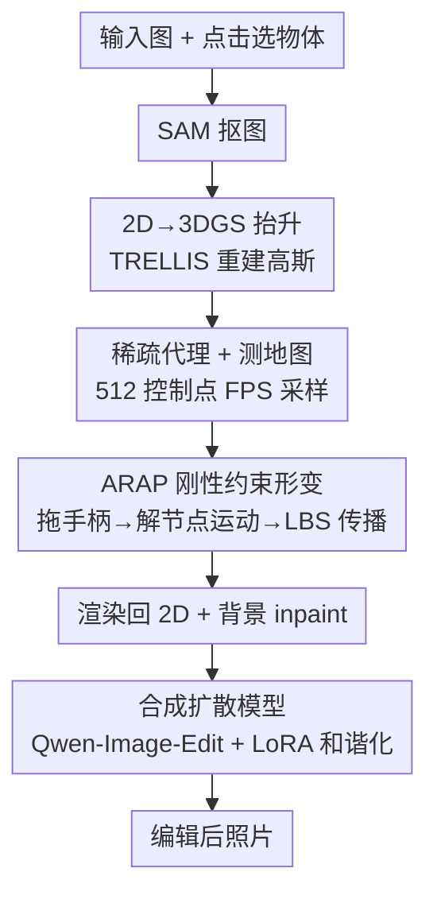

# ObjectMorpher: 3D-Aware Image Editing via Deformable 3DGS

**会议**: CVPR 2026  
**论文**: [CVF Open Access](https://openaccess.thecvf.com/content/CVPR2026/html/Xie_ObjectMorpher_3D-Aware_Image_Editing_via_Deformable_3DGS_CVPR_2026_paper.html)  
**代码**: 无  
**领域**: 3D视觉  
**关键词**: 3D感知图像编辑, 3D高斯泼溅, ARAP非刚性形变, 拖拽编辑, 生成式合成

## 一句话总结
ObjectMorpher 把图里的目标物体用 image-to-3D 生成器抬升成可编辑的 3D 高斯泼溅（3DGS），让用户拖拽稀疏控制点、配合 ARAP 刚性约束做物理合理的非刚性形变，再用一个 LoRA 微调的合成扩散模型把改完的物体无缝贴回原图，从而在 KID / LPIPS / SIFID 和用户主观偏好上同时拿到高可控性、高真实感和近实时（<10s 交互）的效果。

## 研究背景与动机
**领域现状**：图像编辑正在被 Qwen-Image、Nano-Banana、PixArt-α 这类基础编辑大模型主导，它们靠强 2D 先验在 prompt/指令驱动下能生成高保真、风格一致的结果。另一条线是拖拽式编辑（DragGAN、DragDiffusion），让用户指定点对应关系来交互式地形变图像内容。

**现有痛点**：这些方法绝大多数都活在 2D 像素空间里。当用户的意图是"旋转一把椅子""调整一个人的姿态""把花茎掰弯"这种本质上的 3D 操作时，2D 方法无法消歧——它得去猜缺失的 3D 结构，结果往往是纹理被拉伸、透视错误、阴影/光照不一致。已有的 3D-aware 扩展也各有硬伤：OBJECT-3DIT、Neural Assets 只能做姿态条件下的刚性 6-DoF 控制；Image Sculpting 依赖逐图的 SDS / textual inversion，慢到每张图要半小时；BlenderFusion 依赖单目重建出的网格（mesh），通常残缺，撑不住大幅度姿态变化和形变。

**核心矛盾**：编辑要同时满足五个互相牵扯的目标——精确 3D 控制、高保真渲染、物理合理、实时交互、合成自然。2D 方法没有 3D 表征所以做不到前两点；3D 方法要么算力沉重、要么对非刚性编辑很脆弱、要么贴回去时出现接缝/光照伪影。没有一个方法能在"几何控制 + 物理真实 + 视觉和谐"这三件事上一起达标。

**本文目标**：把"在纯 2D 里病态（ill-posed）"的编辑操作，转化成"在 3D 里良定义（well-defined）"的几何操作，并且让整个流程快到可以实时交互。

**切入角度**：与其在 2D 里猜 3D，不如直接把目标物体抬升到一个**显式、可编辑、可微、渲染快**的 3D 代理上——3DGS 正好满足这些条件（比 mesh 保真、比 NeRF 快、参数可局部编辑）。在这个代理上做带物理约束的形变，天然就消除了姿态/旋转/深度的歧义。

**核心 idea**：lift（抬升到 3DGS）→ deform（ARAP 约束下的非刚性拖拽）→ composite（扩散模型把物体和谐地贴回原图）三段式，用一个显式 3D 中介把模糊的 2D 拖拽变成几何上确定的操作。

## 方法详解

### 整体框架
ObjectMorpher 的输入是一张图加上用户对某个物体的编辑意图，输出是一张编辑后的照片级图像。整条流水线分三个阶段串行：**先把 2D 物体抬升成 3DGS**（用 SAM 抠出物体、TRELLIS 重建成高斯表示），**再在 3DGS 上做物理合理的交互式形变**（采样稀疏控制点构成可形变图、用户拖拽手柄点、ARAP 求解器算出每个节点的刚性运动、再通过线性混合蒙皮把运动传播到上百万个稠密高斯），**最后把改完的物体渲染回 2D 并和谐地合成回原图**（背景 inpainting 补洞 + 一个 LoRA 微调的合成扩散模型统一光照/颜色/边界）。三个阶段分别对应论文的 Sec 3.1 / 3.2 / 3.3，也对应下面三个关键设计。

### 关键设计

**1. 把 2D 物体抬升成可编辑的 3DGS 而非 mesh：用显式 3D 代理消除编辑歧义**

这一步直接针对"纯 2D 方法无法消歧几何变换"的痛点。用户先点击选中目标，SAM 把物体抠出来，再交给现成的 image-to-3D 生成模型 TRELLIS 重建。关键的取舍在于：TRELLIS 同时有 mesh 解码器和 3DGS 解码器，作者**刻意选 3DGS 而不是 mesh**。原因是 mesh 解码器是在冻结编码器上后训练的，主要为几何法线一致性优化、颜色分辨率有限；而 3DGS 解码器通过体渲染损失**联合优化外观和几何**，渲染更真实、梯度更平滑、对后续操作更友好（消融 Fig 7 的 b/c 列证实 3DGS 渲染质量更高）。3DGS 把每个高斯写成 $G_i:(\mu_i, o_i, s_i, q_i, c_i)$——位置 $\mu_i\in\mathbb{R}^3$、不透明度 $o_i$、三轴缩放 $s_i$、SO(3) 旋转四元数 $q_i$、颜色 $c_i$，渲染时用 EWA 投影把 3D 高斯投到像平面再按深度做 α-合成。有了这个显式可微表征，"旋转/姿态/深度"这些在 2D 里说不清的操作就变成了对高斯参数的确定性变换。

**2. 稀疏代理 + 测地邻接图 + ARAP 刚性约束：让非刚性拖拽既实时又物理合理**

这是论文最核心的技术贡献，针对"物理合理性"和"实时交互"两个痛点。高保真 3DGS 动辄上百万个高斯，直接在全部高斯上做 ARAP 优化在实时场景下不可行。作者引入一个**稀疏编辑代理**：在高斯点云上用最远点采样（FPS）选 512 个控制点，构成一个轻量但能捕捉全局几何的可形变图，用户只编辑这个代理，再把运动传播回稠密高斯。

可形变图的构造有个关键细节——**用测地距离而非欧氏距离连边**。要保证局部光滑和稳定形变，每个节点得有足够多邻居，连接半径正比于物体尺度（连接 $0.3 D_{scene}$ 内的点，$D_{scene}$ 是控制点最大两两距离即场景直径）。但直接按欧氏距离在这个半径内连边会忽略表面流形，把身体不同部位"抄近路"错连起来（Fig 3）。解法是两阶段：先用更短半径 $2\bar{d}_{NN}$（$\bar{d}_{NN}$ 是平均最近邻距离）连出辅助局部图，在其上用 Floyd 算法估测地最短路，最后只连测地距离 $<0.3 D_{scene}$ 的点对。这样既保住局部连续性又避免跨部位短路。

形变本身用 ARAP（As-Rigid-As-Possible）能量。用户拖拽把 $H$ 个手柄点钉到目标位置 $\tilde{p}_{h_i}$，作为硬约束 $p'_{h_i}=\tilde{p}_{h_i}$；其余点优化下面这个只惩罚非刚性畸变、对全局平移旋转不变的能量：

$$E(p'_i, R_i)=\sum_i\sum_{j\in N_i} w_{ij}\,|(p'_i-p'_j)-R_i(p_i-p_j)|^2$$

其中 $R_i$ 是 $p_i$ 处的局部旋转、$w_{ij}$ 是距离衰减权重。求解在两步间交替：固定 $R_i$ 时对 $p'_i$ 求导得线性系统 $Lp'=b$（$L$ 是前面测地图的拉普拉斯矩阵，去掉手柄约束对应的行列后求逆/伪逆得到无约束点位置）；固定位置时由 $S_i=\sum_{j\in N_i} w_{ij}(p_j-p_i)^T(p'_j-p'_i)$ 做 SVD 分解 $S_i=U_i\Sigma_i V_i^T$，取 $R_i=V_i U_i^T$ 更新旋转。实测三次迭代即可视觉稳定。最后通过线性混合蒙皮（LBS）把稀疏图的形变传到每个稠密高斯：每个高斯取 $\tilde{K}=4$ 个最近控制点，位置 $\mu'_i=\sum_{j}\tilde{w}_{i,j}(R_j(\mu_i-p_j)+p'_j)$，旋转四元数和缩放也同步更新；这 4 个邻居同样用"先欧氏找最近、再沿测地找其余"的混合策略选取，保住拓扑连续性。这一整套让核心拖拽阶段的延迟低到 10ms，做到真正的实时。

**3. 合成扩散模型把改完的物体无缝贴回原图：解决"贴回去"的接缝与光照不一致**

形变完成后物体要重新渲染成 2D 并融回原图，直接贴会出现边界接缝和光照不一致（针对"合成连贯性"痛点）。流程是：先用 PixelHacker 对被遮挡的背景区域做 inpainting 得到干净背景板，把渲染好的物体合成进去得到一张粗糙编辑图，再用合成扩散模型精修。这个模型基于预训练的 Qwen-Image-Edit（MMDiT 骨干），**同时条件于两张图**——原图提供稳健语义来保住身份和光照，粗糙编辑图规定 3D 编辑后的几何布局；为了在不破坏基础模型强生成先验的前提下高效和谐化，作者只在注意力层里微调一个任务专用的 LoRA。训练数据是同一物体不同姿态/形变的配对图（来自 Subjects200K 和 KlingAI 生成视频），用 TRELLIS 重建 3DGS、多视角渲染、π³ 预测姿态来合成粗编辑对，让模型学会"把粗合成翻译成与真值一致的照片级结果"，从而保证光照一致和物体-场景平滑融合。

### 损失函数 / 训练策略
ObjectMorpher 大部分模块是免训练的（SAM、TRELLIS、ARAP 求解、PixelHacker 都是现成或求解器）。唯一需要训练的是合成扩散模块：在 Qwen-Image-Edit 基座上用 AdamW 微调一个 rank=16 的 LoRA，1024×1024 分辨率、bf16，用 LoRA+ 框架，基学习率 0.0001、倍率 3；生成由一段强制"保轮廓 + 按参考图做光照和谐"的任务指令引导。

## 实验关键数据

### 主实验
benchmark 是作者自建的 50 个有挑战性的物体，涵盖动物（蝴蝶/狗/鹰）、人形（骑士/宇航员）、无生命物体（椅子）和卡通角色（卡通狗/Walle）。对比 2D 拖拽（DragDiffusion、DragAnything）、2D mask 编辑（Anydoor）、3D-aware 编辑（ImageSculpting）等一众 SOTA。量化指标用以原图为参考的感知指标：KID、LPIPS、SIFID，并报告实时交互（RI）和模型推理时间（MT）。

| 方法 | LPIPS ↓ | SIFID ↓ | KID ↓ | 实时交互 RI | 推理时间 MT ↓ |
|------|---------|---------|-------|-------------|----------------|
| DragGAN | 0.550 | 16.091 | -0.056 | ✓ | < 10s |
| ImageSculpting | 0.178 | 14.372 | -0.055 | ✓ | ~30m |
| DragDiffusion* | 0.117 | 6.573 | -0.075 | ✗ | ~2m |
| DragAnything | 0.655 | 22.476 | -0.047 | ✗ | ~70s |
| Anydoor | 0.173 | 9.512 | -0.049 | ✗ | ~10s |
| InstantDrag | 0.218 | 13.744 | -0.042 | ✗ | ~10s |
| DiffEditor | 0.142 | 12.589 | -0.051 | ✗ | ~10s |
| **ObjectMorpher** | 0.127 | 10.896 | -0.059 | ✓ | ~20s |

作者特别强调：**自动指标（LPIPS/SIFID）在可控编辑里是误导性的**——它们会"反常地"奖励那些根本没执行用户编辑的方法。DragDiffusion 之所以 LPIPS 最低（0.117），恰恰是因为它几乎没改图（表里标了 \*）。所以论文把**人类主观评测当作主要评价**：20 名参与者对 8 个编辑任务在三个 1-5 分维度上打分。

| 方法 | Guidance Following ↑ | Style Consistency ↑ | Identity Preservation ↑ |
|------|----------------------|---------------------|--------------------------|
| **Ours** | **4.71** | **4.55** | **4.60** |
| Image Sculpting | 3.77 | 3.45 | 3.60 |
| Anydoor | 1.83 | 2.54 | 2.32 |
| DragDiffusion | 1.68 | 3.24 | 3.16 |
| DragAnything | 1.34 | 2.54 | 2.67 |
| DiffEditor | 1.55 | 2.63 | 2.56 |
| InstantDrag | 1.63 | 2.51 | 2.24 |

ObjectMorpher 在三个主观维度上全面碾压：Guidance Following 4.71 vs 次优 3.77，而那些自动指标好看的基线（DragDiffusion 1.68、Anydoor 1.83）在"是否真的执行了编辑"上得到灾难性低分。时间上，ObjectMorpher 的 ~20s 主要花在物体抬升（~10s）和扩散精修（~10s），核心拖拽阶段只要 10ms，远快于 ImageSculpting 的 ~30 分钟。

### 消融实验

| 配置 | 对比 | 结论 |
|------|------|------|
| 3DGS vs Mesh 表征 | Fig 7 b/c 列 | 3DGS 渲染质量明显高于 mesh，外观-几何联合优化更真实 |
| w/o 生成式合成（GC） | Fig 7 b/c 列 | 直接贴回有可见接缝、前景-背景光照不一致 |
| w/ 生成式合成（GC） | Fig 7 e 列 | 物体无缝融入环境、保持结构完整 |
| 仅 Laplacian 形变 | Fig 8 | 固定单位旋转只优化位置，大旋转下局部几何畸变 |
| ARAP 形变 | Fig 8 | 旋转不变约束保住局部刚性和几何细节，形变更自然 |

### 关键发现
- **3DGS 优于 mesh 是整套方案成立的前提**：mesh 在转换中丢高频细节、颜色受限，而 3DGS 的可微性和高保真渲染让实时拖拽 + 大幅形变成为可能。
- **生成式合成模块是"能不能用"的分水岭**：没有它，再好的 3D 编辑贴回去也是一眼假（接缝 + 光照割裂）；它把"几何对了"补成"看着真"。
- **ARAP 相对纯 Laplacian 的优势在大旋转下最明显**：Laplacian 因为没有旋转不变性，大角度操作会撕裂局部几何，ARAP 的局部旋转估计把刚性保住了。
- **自动指标会系统性误导可控编辑评测**：这是全文反复强调的一条 meta 发现——LPIPS/SIFID 奖励"少改图"，所以在这类任务里必须以人评为准。

## 亮点与洞察
- **用 3DGS 当"可编辑中介"而非最终产物**：很多 3D 编辑把 3D 表征当目标，这篇把它当成一个临时的、可微的操作台——抬升上去只为了在几何上确定地形变，最后还是输出 2D 图。这个"借 3D 之手解 2D 之困"的定位很清爽。
- **测地图避免跨部位短路这个细节很实用**：FPS + 测地距离两阶段建图，解决了"按欧氏距离连边会把胳膊和躯干错连"的真实问题，是任何基于点图的形变方法都能借鉴的 trick。
- **稀疏代理 + LBS 传播是实时的关键**：在 512 个点上解 ARAP、再蒙皮到上百万高斯，把核心交互压到 10ms——这套"稀疏求解 + 稠密传播"范式可以迁移到任何需要实时操控大规模点/高斯的场景（动态 3DGS、虚拟试穿等）。
- **指出并实证"自动指标误导可控编辑"**：作者没有回避自己 LPIPS 不是最低这件事，反而把它变成论点——并用人评把这个评测陷阱讲透，对整个可控编辑评测方法论有警示价值。

## 局限与展望
- **依赖现成 image-to-3D 生成器的重建质量**：整条流水线建立在 TRELLIS 重建的 3DGS 上，如果物体重建失败或细节缺失（透明/反光/极薄结构），后续编辑和合成都会受限。
- **物体抬升 + 扩散精修各占 ~10s**：虽然核心拖拽是 10ms，但总耗时仍由两端的重建和扩散主导，~20s 还称不上端到端实时；对批量编辑或视频场景是瓶颈。
- **benchmark 只有 50 个物体、人评只用 8 个任务 / 20 人**：评测规模偏小，且高度依赖主观打分，跨类目的稳健性和统计置信度有进一步验证空间。
- **场景级编辑、物体间交互、阴影投射未涉及**：方法聚焦单个物体的非刚性形变，编辑后物体对场景的二次影响（如新投影阴影、遮挡其他物体）没有显式建模。
- **改进方向**：把抬升和精修换成更快的前馈模型以逼近真·实时；引入物理/光照显式建模让合成阶段不只靠扩散先验"猜"；扩展到多物体协同编辑。

## 相关工作与启发
- **vs DragDiffusion / DragAnything（2D 拖拽）**: 它们在像素空间指定点对应做形变，本文保留了拖拽的交互味道但把目标抬到显式 3D 再形变。区别在于 3D 意图的操作（旋转/深度平移）在 2D 里是病态的、容易破坏刚性和语义，本文把它变成良定义的几何操作；代价是要多一步 3D 重建。
- **vs ImageSculpting（3D-aware）**: 同样用 3D 代理做实时交互，但 ImageSculpting 依赖逐图的 SDS + DreamBooth 微调，每张图要 ~30 分钟且不稳定；本文用现成 3DGS 重建 + ARAP 求解，把核心编辑降到 10ms、总耗时 ~20s，并在所有人评维度上领先。
- **vs BlenderFusion / NeRF-Editing / NeuMesh（mesh/proxy 形变）**: 它们走 mesh 或 NeRF-to-mesh 路线，转换中丢高频细节、且通常只支持刚性或小形变；本文用 3DGS 保住外观细节、ARAP 支持大幅非刚性形变，并额外解决了"贴回原图"的合成一致性（这是这些方法普遍忽略的）。
- **vs DragGaussian / SC-GS（高斯形变）**: 同样在高斯上做拖拽/稀疏约束形变，但它们主要操作孤立物体、不处理与周围环境的无缝整合；本文的生成式合成模块正是补上"物体 ↔ 场景和谐"这一环，做成了完整的图像编辑框架而非孤立物体编辑。

## 评分
- 新颖性: ⭐⭐⭐⭐ "lift-deform-composite"三段式本身是已有思路的组合，但用 3DGS 当可编辑中介 + 测地图 ARAP + 合成扩散的整合很扎实，工程完整度高。
- 实验充分度: ⭐⭐⭐ 对比基线丰富、消融到位，但 benchmark（50 物体）和人评（8 任务/20 人）规模偏小，缺乏更大尺度的统计验证。
- 写作质量: ⭐⭐⭐⭐ 痛点-方法-实验逻辑清晰，对"自动指标误导可控编辑"这一点的论证尤其透彻。
- 价值: ⭐⭐⭐⭐ 把 3D-aware 非刚性图像编辑做到近实时 + 高人评偏好，对交互式编辑工具链有实际参考价值。

<!-- RELATED:START -->

## 相关论文

- [\[CVPR 2026\] VDFE: Difference-Aware 3D Scene Editing with Non-Intrusive Video Diffusion Priors for Multi-View Consistency and Efficiency](vdfe_difference-aware_3d_scene_editing_with_non-intrusive_video_diffusion_priors.md)
- [\[CVPR 2026\] 3D-LATTE: Latent Space 3D Editing from Textual Instructions](3d-latte_latent_space_3d_editing_from_textual_instructions.md)
- [\[CVPR 2026\] PercHead: Perceptual Head Model for Single-Image 3D Head Reconstruction & Editing](perchead_perceptual_head_model_for_single-image_3d_head_reconstruction_editing.md)
- [\[CVPR 2026\] EDGS: Eliminating Densification for Efficient Convergence of 3DGS](edgs_eliminating_densification_for_efficient_convergence_of_3dgs.md)
- [\[CVPR 2026\] Edit2Perceive: Image Editing Diffusion Models Are Strong Dense Perceivers](edit2perceive_image_editing_diffusion_models_are_strong_dense_perceivers.md)

<!-- RELATED:END -->
