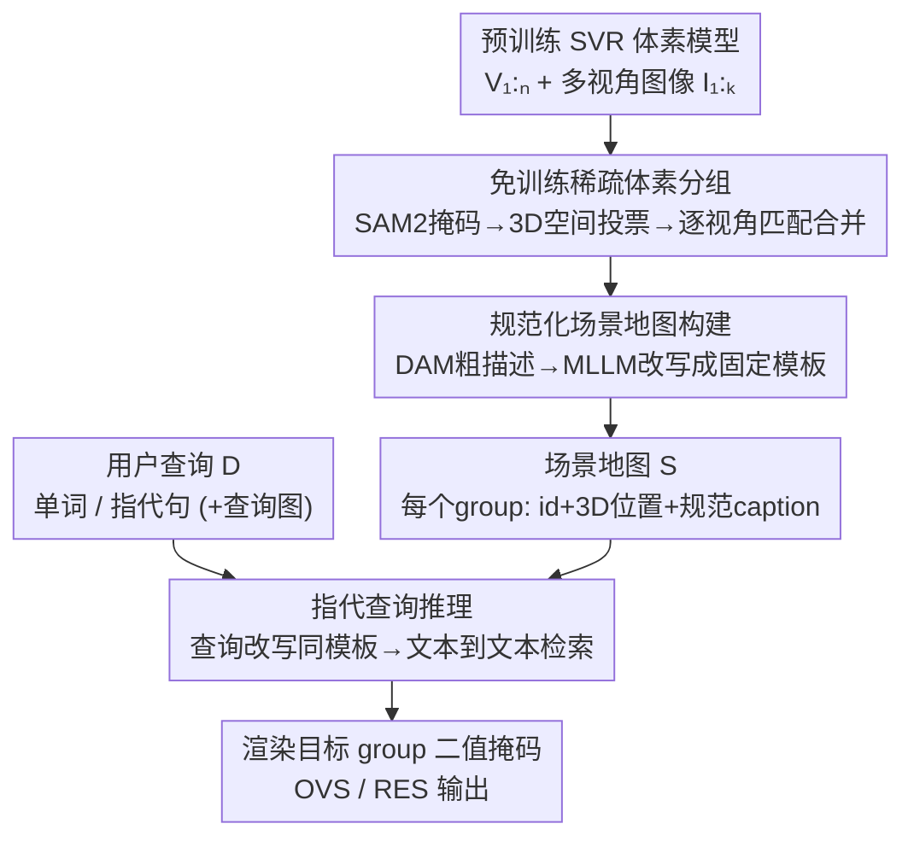

# OpenVoxel: Training-Free Grouping and Captioning Voxels for Open-Vocabulary 3D Scene Understanding

**会议**: CVPR 2026  
**论文**: [CVF Open Access](https://openaccess.thecvf.com/content/CVPR2026/html/Huang_OpenVoxel_Training-Free_Grouping_and_Captioning_Voxels_for_Open-Vocabulary_3D_Scene_CVPR_2026_paper.html)  
**代码**: 无（论文称将开源，"The code will be open"）  
**领域**: 3D视觉 / 开放词汇3D场景理解  
**关键词**: 稀疏体素、免训练、开放词汇分割、指代表达分割、MLLM

## 一句话总结
OpenVoxel 提出一个**完全免训练**的开放词汇 3D 场景理解流程：对预训练好的稀疏体素（SVR）模型，用 SAM2 的 2D 掩码通过空间投票把体素聚成物体级 group，再用 MLLM 给每个 group 生成结构化文字描述构成"场景地图"，最后把用户查询也改写成同样格式做**文本到文本检索**——彻底绕开 CLIP/BERT 嵌入对齐，在指代表达分割（RES）上比需要标注训练的 ReferSplat 高出 13 个点，且单场景只需约 3 分钟（快 10 倍以上）。

## 研究背景与动机

**领域现状**：开放词汇 3D 场景理解的主流做法，是给 3D 表示（NeRF / 3DGS / 稀疏体素）"装上"语言能力。LangSplat 一类工作把 CLIP 嵌入蒸馏进 3D 高斯，让每个基元携带一个语言特征，从而支持开放词汇分割（OVS）；ReferSplat 进一步针对更难的**指代表达分割（RES）**——查询不再是"椅子"这种单词，而是"放在桌子旁边椅子上那只白色毛绒羊"这种带属性、空间关系的完整句子。

**现有痛点**：这些方法都把语言信息编码成**学习得到的嵌入向量**，绑死在 CLIP/BERT 的固定嵌入流形上，带来两个硬伤。其一，嵌入空间擅长短词/标签，面对任意措辞、含推理（"什么东西可以用来剪纸？"）的复杂句子就力不从心；ReferSplat 为了支持长句，必须为每个场景提供**人工标注的"句子–物体掩码"对**来训练句级嵌入，预处理极其费人力。其二，训练一个 3D 语言场本身**非常慢**——ReferSplat 官方说 58 分钟，但作者复现发现按官方配置实际要 2 小时以上/场景。

**核心矛盾**：把语言"塞进"一个固定维度的嵌入流形，本质上是用一个**有损、需要训练对齐**的中间表示去逼近自然语言，既限制了表达灵活度，又把成本压在逐场景训练上。

**本文目标**：去掉"训练语言场"这一步，同时还要能处理任意复杂的句子查询。

**切入角度**：作者的关键观察是——既然现在的 MLLM 已经能直接看图说出丰富、人类可读的描述，那为什么还要把语言压成嵌入向量？不如**直接给 3D 场景填上文字**，让检索变成"文字比文字"，把语义匹配的活全部交给 LLM 的推理能力。

**核心 idea**：用"为每个 3D 物体生成可读文字描述 + 文本到文本检索"替代"训练 3D 语言嵌入 + 嵌入空间最近邻"，整条流程免训练、免标注。

## 方法详解

### 整体框架

给定从 $K$ 张多视角图像 $\{I_i\}_{i=1}^K$（及位姿 $\xi_{1:K}$）重建出的、含 $N$ 个稀疏体素 $\{V_i\}_{i=1}^N$ 的 SVR 模型，OpenVoxel 的目标是给这些体素赋上语言信息、构造一张场景地图 $S$，从而对自然语言描述 $D$（单词或指代句）做开放词汇推理。整条流程分三段串行：**(1) 免训练稀疏体素分组**把体素聚成物体级实例；**(2) 规范化场景地图构建**给每个 group 生成固定格式的文字描述、连同 3D 位置存进 $S$；**(3) 指代查询推理**把用户查询改写成同格式，在 $S$ 上做文本检索并渲染出目标掩码。三段都不含任何梯度训练。

### 关键设计

**1. 免训练稀疏体素分组：用空间投票把 2D 掩码"抬"成 view-consistent 的 3D 实例**

要从逐体素表示走向物体级理解，必须把同一物体的体素聚到一起，且跨视角一致。已有方法（如 Gaussian Grouping）靠**梯度下降**逐基元学一个高维特征，慢且需要顺序训练。作者的洞察借鉴 deep Hough voting 与 spatial embedding：**属于同一实例的体素，应当指向一个共同的 3D 中心**。于是给每个体素扩一个 3 维的 group feature $F_i\in\mathbb{R}^3$（它"投票"的实例质心）和一个置信权重 $W_i$，外加一个记录各实例质心的 Group Dictionary $G$。对单帧的 SAM2 掩码 $M$，先在渲染出的点图上对每个实例 $k$ 做掩码平均得到质心：

$$f^{center}_k = \frac{\sum_{j\in HW}\mathbb{1}(M_j=k)\cdot f^{pts}_j}{\sum_{j\in HW}\mathbb{1}(M_j=k)}$$

再把质心信息按"体素 $i$ 对像素 $j$ 的渲染贡献权重 $w_{ij}$"（即体积渲染里的 blending weight，公式 1）累加进体素：$F^{t+1}_i = F^t_i + \sum_j w_{ij}f^{center}_{M_j}$，$W^{t+1}_i = W^t_i + \sum_j w_{ij}$。这一步沿用 Dr.Splat 的更新式，但因 group feature 只有 3 维，无需 top-k 采样、一次渲染 pass 就能更新完。妙处在于：即使某一帧把体素错分了，**累计的 $F$、$W$ 仍会强迫体素"投票"给它最自信的那个 group**，天然抑制误分组。

**2. 跨视角逐帧匹配与合并：让独立的 2D 掩码 ID 在 3D 里统一身份**

每帧 SAM2 输出的实例 ID 互不相干，需要把新帧 $M^{t+1}$ 的 ID 跟已有的 3D 分组对齐。作者的做法是：先用当前 group field 反算每个体素的实例 ID——$ID^t_i = \arg\min_j \lVert \frac{F^t_i}{W^t_i} - G^t_j \rVert_2$（归一化的体素投票去匹配最近的字典质心），把它渲染成投影掩码 $M^{proj}$；再对 $M^{proj}$ 里每个实例，在 $M^{t+1}$ 中找 **IoU 最高**的掩码做匹配，匹配上的就替换成已有 ID。同时用 $M^{proj}$ 再去 prompt 一次 SAM2，把高度重叠的掩码合并，**防止同一物体被错切成两个 ID**；既没匹配也没重叠的新掩码则分配新 ID 入字典。处理完全部 $K$ 帧后，用最终的 $ID^K$ 作为体素的实例分组。整个过程一遍走完、无梯度。

**3. 规范化场景地图构建：DAM 描述 + MLLM 改写成统一模板，把"物体"变"苹果"**

光有分组还不能检索，得给每个 group 配文字。作者先把某 group 在各视角下的二值掩码连同原图喂给 Describe Anything Model（DAM）拿一段细粒度描述。但 DAM 输出是自由句，主语有时是泛泛的"object"（如"一个绿色圆形物体，可能是苹果……"），跨 group 不可比。于是再用一个 MLLM（Qwen3-VL-8B）把自由句**规范化成固定模板** `<类别名词>, <外观细节> <功能/部件> <位置/关系>`。关键工程点是**视觉提示策略**：把掩码外区域调暗、在物体上点一个小红点，逼模型把注意力集中到目标区域，再让它按模板改写。规范化显著消歧（把"object"换成"apple"），并产出跨视角稳定可比的描述。每个 group 在 $S$ 里存 {ID, 3D 中心位置, 规范 caption}。

**4. 指代查询推理：查询同样改写成模板，做文本到文本检索**

检索阶段不把查询和 caption 映射到学习嵌入空间，而是直接在 $S$ 上让 MLLM 做文字匹配。为了让匹配确定、稳定，先把用户查询 $D$（不管单词还是长句）用**同一套模板**改写——例如"一个有着细长腿、在阳光下看起来很有趣的搞笑玩具"被规范成"Toy, yellow, slim legs"，格式立刻对齐 $S$ 中条目。然后把**整张 $S$**（含所有 group 的位置和 caption）输入 MLLM，让它选出最满足查询的 caption 并返回 ID；因为位置也在 $S$ 里，即便查询含"苹果左边"这类空间关系，MLLM 也能用存的质心去核验。最后按选中 ID 在目标视角只光栅化对应 group，渲染出二值掩码。这套推理对 OVS（纯类别查询）和 RES（属性/功能/关系查询）统一适用、可解释（选择依据就是可读的 caption），单次查询不到 1 秒。

### 一个完整示例

以"绿苹果"这个 group 为例走一遍：分组阶段，多帧 SAM2 把苹果区域的体素投票到同一 3D 质心，跨帧用 IoU 匹配统一 ID；建图阶段，DAM 看着掩码+原图说出"绿色圆形物体，可能是苹果……"，Qwen3-VL 配上红点视觉提示改写成"Apple, light green with fluffy material, a dark green leaf, placed on table"，连同位置 `[-0.399, 2.06, -1.34]` 存进 $S$；查询阶段，用户问"放在桌上、带绿叶的浅绿色水果"，先被改写成同模板，MLLM 在 $S$ 里文本匹配命中 id=1，最后只渲染该 group 得到苹果掩码。

## 实验关键数据

数据集主要基于 iPhone Polycam 采集的 LeRF 系列：RES 用 Ref-LeRF（ramen/figurines/teatime/kitchen 四场景，带句级指代表达），OVS 用 LeRF-OVS 与 LeRF-Mask。基础模型用 SAM2（分组+合并）、DAM（描述）、Qwen3-VL-8B-Instruct（改写+检索）。

### 主实验

**Ref-LeRF（RES，mIoU）——最能体现优势的任务**：

| 方法 | 需GT标注 | ramen | figurines | teatime | kitchen | avg. |
|------|--------|-------|-----------|---------|---------|------|
| Grounded SAM | - | 14.1 | 16.0 | 16.9 | 16.2 | 15.8 |
| LangSplat | - | 12.0 | 17.9 | 7.6 | 17.9 | 13.9 |
| GS-Grouping | - | 27.9 | 8.6 | 14.8 | 6.3 | 14.4 |
| GOI | - | 27.1 | 16.5 | 22.9 | 15.7 | 20.5 |
| ReferSplat*（复现） | ✓ | 31.0 | 20.0 | 25.4 | 21.4 | 24.5 |
| ReferSplat（原文） | ✓ | 35.2 | 25.7 | 31.3 | 24.4 | 29.2 |
| **OpenVoxel（Ours）** | - | **52.5** | **43.5** | **48.4** | 25.1 | **42.4** |

OpenVoxel 在**不需要任何描述–掩码标注**的前提下，平均 mIoU 比 ReferSplat 原文高 13.2%、比复现版高 17.9%。作者复现时发现 ReferSplat 学句级嵌入容易**过拟合已见描述**，评测不稳定。

**LeRF-OVS（mIoU）**：OpenVoxel 平均 66.2，优于 3DVLGS（64.3）、CCL-LGS（65.1）等。**LeRF-Mask（mIoU/mBIoU）**：平均 89.7/86.8，超过 ObjectGS（88.3/84.4）。OVS 查询更简单、各方法普遍 >70%，但 OpenVoxel 只需把 prompt 略改成强调类名+外观的版本即可领先，体现了对不同查询复杂度的灵活性。

### 消融实验

Ref-LeRF 上逐组件消融（mIoU）：

| 配置 | 掩码合并 | 规范caption | 规范query | mIoU | 说明 |
|------|---------|-----------|----------|------|------|
| A | - | - | - | 24.3 | 仅显式描述+文本检索 |
| B | ✓ | - | - | 28.0 | 加掩码合并，+3.7 |
| C | ✓ | ✓ | - | 36.4 | 加规范captioning，+8.4 |
| Ours | ✓ | ✓ | ✓ | 42.4 | 再规范化查询，+6.0 |

### 关键发现
- **规范化 captioning 贡献最大**（+8.4 mIoU）：把自由句统一成固定模板、消除"object"这类泛主语，是检索准确的核心；说明问题瓶颈不在"有没有文字"，而在"文字够不够标准、可比"。
- **查询规范化同样关键**（+6.0）：只有让查询和 caption 长成同一格式，文本到文本匹配才能稳定对齐，验证了"双向规范化"这一设计的必要性。
- **掩码合并**带来 +3.7，主要靠减少噪声小 group、避免同一物体被切成两份。
- **运行时**：单 RTX 5090 上 OpenVoxel 约 3 分钟/场景（分组+建图），比 ReferSplat（>1 小时）、ObjectGS（约 40 分钟）快 10 倍以上，单次查询 <1 秒。

## 亮点与洞察
- **"训练嵌入"→"填文字+查文字"的范式切换**：把开放词汇 3D 理解从"对齐固定嵌入流形"彻底翻成"在可读 caption 上做 LLM 检索"，免训练、免标注，还顺带获得可解释性——选哪个物体的依据就是那段人能看懂的描述。
- **3 维空间投票替代高维特征训练**：group feature 只有 3 维（实例质心），靠累计投票一遍渲染就收敛，巧妙绕开 Gaussian Grouping 那种需要梯度下降学高维特征的慢流程，且对单帧误分组天然鲁棒。
- **双向规范化是检索成败手脉**：caption 和 query 都改写到同一 `<类别>,<外观>,<功能>,<位置>` 模板，消融显示这两步合计贡献 14+ mIoU——把语义匹配难题转化成格式对齐问题，是很值得迁移的工程思路。
- **红点视觉提示**：用调暗背景+小红点引导通用 MLLM 关注目标区域，是低成本让非掩码专用模型做区域描述的实用 trick。

## 局限与展望
- **强依赖基础模型质量**：分组依赖 SAM2 的掩码、描述依赖 DAM、检索依赖 Qwen3-VL，任一环节出错（如 SAM2 漏分、DAM 描述偏差）都会传导到最终结果；论文未系统分析对基础模型的敏感性。
- **kitchen 场景几乎无提升**（25.1，与 ReferSplat 复现 21.4 接近、低于其余场景）：说明在某些复杂/歧义场景下文本检索仍有瓶颈，方法并非对所有场景均匀有效。
- **评测规模偏小**：仅在 LeRF 系列三到四个场景上验证，物体数量也有限（每场景 6–17 个），泛化到大规模、室外或物体密集场景的能力待验证。
- **依赖预训练好的 SVR 模型**：方法本身不重建场景，整条流程的前提是已有高质量稀疏体素重建。

## 相关工作与启发
- **vs ReferSplat**：ReferSplat 学句级 CLIP/BERT 嵌入、需人工标注"句子–掩码"对训练 3DGS；OpenVoxel 不训练不标注，直接 caption+文本检索。结果上 RES 平均高 13–18 个点，且训练时间从 >1 小时降到 3 分钟，代价是推理阶段依赖较强的 MLLM。
- **vs LangSplat / OpenGaussian / Dr.Splat**：这一系把 CLIP 特征蒸馏进 3D 基元、靠 codebook 提质，受限于嵌入流形、擅长短词标签；OpenVoxel 用可读文字+LLM 推理，对任意措辞和含推理的复杂查询更灵活。
- **vs Gaussian Grouping**：GS-Grouping 靠梯度下降学逐基元高维特征做分组；OpenVoxel 用 3 维空间投票一遍 pass 完成，省去顺序训练且对误分组鲁棒。

## 评分
- 新颖性: ⭐⭐⭐⭐⭐ 把开放词汇 3D 理解从"嵌入对齐"翻成"免训练文本检索"，范式干净且有效
- 实验充分度: ⭐⭐⭐⭐ RES/OVS 多基准 + 完整消融 + 运行时对比，但场景规模偏小、未做基础模型敏感性分析
- 写作质量: ⭐⭐⭐⭐ 三段式流程叙述清晰、图示充分，公式记号略密
- 价值: ⭐⭐⭐⭐⭐ 免训练免标注 + 10× 提速 + 大幅领先 SOTA，对落地非常友好

<!-- RELATED:START -->

## 相关论文

- [\[CVPR 2026\] LightSplat: Fast and Memory-Efficient Open-Vocabulary 3D Scene Understanding in Five Seconds](lightsplat_fast_and_memory-efficient_open-vocabulary_3d_scene_understanding_in_f.md)
- [\[CVPR 2026\] EmbodiedSplat: Online Feed-Forward Semantic 3DGS for Open-Vocabulary 3D Scene Understanding](embodiedsplat_online_feed-forward_semantic_3dgs_for_open-vocabulary_3d_scene_und.md)
- [\[CVPR 2026\] Curvature-Aware Captioning: Leveraging Geodesic Attention for 3D Scene Understanding](curvature-aware_captioning_leveraging_geodesic_attention_for_3d_scene_understand.md)
- [\[CVPR 2026\] ExtrinSplat: Decoupling Geometry and Semantics for Open-Vocabulary Understanding in 3D Gaussian Splatting](extrinsplat_decoupling_geometry_and_semantics_for_open-vocabulary_understanding_.md)
- [\[AAAI 2026\] OpenScan: A Benchmark for Generalized Open-Vocabulary 3D Scene Understanding](../../AAAI2026/3d_vision/openscan_a_benchmark_for_generalized_open-vocabulary_3d_scene_understanding.md)

<!-- RELATED:END -->
