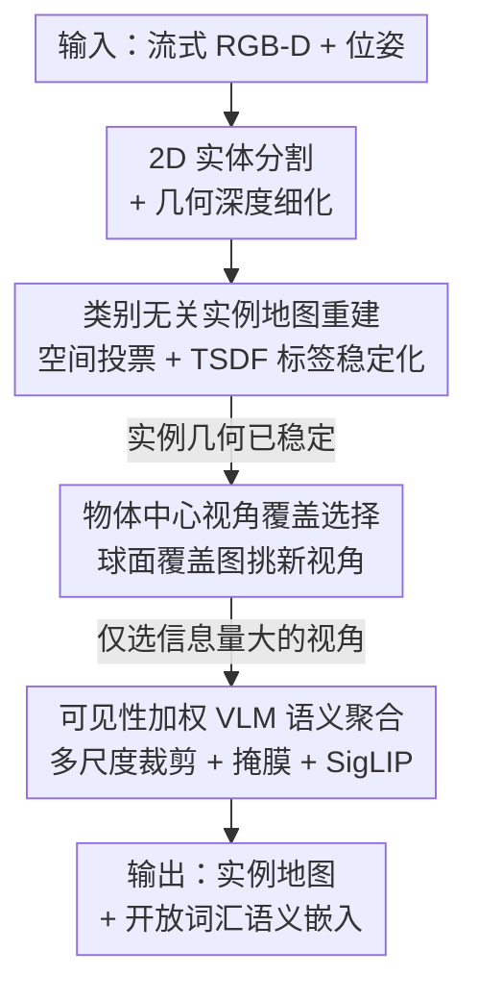

# OVI-MAP: Open-Vocabulary Instance-Semantic Mapping

**会议**: CVPR 2026  
**论文**: [CVF Open Access](https://openaccess.thecvf.com/content/CVPR2026/html/Deng_OVI-MAP_Open-Vocabulary_Instance-Semantic_Mapping_CVPR_2026_paper.html)  
**代码**: https://ovi-map.github.io  
**领域**: 3D视觉 / 开放词汇语义建图 / 具身感知  
**关键词**: 开放词汇、实例-语义建图、TSDF、视角选择、VLM

## 一句话总结
OVI-MAP 把"建实例地图"和"贴语义标签"两件事彻底拆开：先只靠几何从 RGB-D 流里增量重建一张**类别无关**的 3D 实例地图，再用一个**物体中心的视角覆盖**策略挑出少量信息量大的视角喂给 VLM 提语义，从而在实时帧率下做到开放词汇的实例级语义理解，并在 ScanNet / Replica 上超过现有在线建图方法。

## 研究背景与动机

**领域现状**：室内 3D 语义/实例建图是具身感知的基础能力，支撑语言导航、操作、AR/VR 场景理解。主流做法是用体素表示（最常见是截断符号距离场 TSDF），因为它能实时融合、抗位姿漂移、几何稠密一致；近年的全景建图系统进一步把体积重建和语义耦合起来，得到时间一致、可查询的全景地图。

**现有痛点**：这些 pipeline 几乎都是**闭集**的——它们假设一个固定的语义本体，学类别相关的预测器，每个体素/点上只存一个整数类别标签。把它们扩展到开放集识别非常困难：① VLM 提出来的开放集特征是高维连续向量，直接按体素分辨率存储会带来巨大的算力和显存开销；② 现有体积建图系统靠语义标签来引导实例分割与关联，一旦没有语义，物体实例分组就变得不稳定、容易碎裂；③ 没有一致的 3D 实例，跨时间聚合逐像素开放集特征会因遮挡、视角变化、背景噪声、2D 分割不一致而噪声很大。虽然 SAM 这类分割模型能给高质量物体 proposal，但每帧都跑它对实时在线建图来说太贵。

**核心矛盾**：闭集语义标签既是现有方法做实例关联的"拐杖"，又是它无法开放词汇化的"枷锁"——实例分组依赖语义，而语义又要求闭集。同时"逐像素稠密融合 VLM 特征"和"实时在线运行"之间存在尖锐的算力/显存 trade-off。

**本文目标**：在线、实时地同时构建（i）一张类别无关的 3D 实例地图，和（ii）每个实例的零样本（zero-shot）开放词汇语义嵌入。

**切入角度**：作者的关键观察是——**实例的形成本不需要语义**。物体的"是一个独立个体"这件事可以纯靠几何和区域一致性证据来判定；语义只需要在观察到"信息量足够大的视角"时再赋予即可。

**核心 idea**：**解耦实例重建与语义推理**（decouple instance reconstruction from semantic inference）。先用几何把实例地图稳稳建好，再用极少量精选视角的 VLM 特征做开放词汇语义，从根本上绕开"按体素存高维特征"和"靠语义引导实例分组"两个坑。

## 方法详解

### 整体框架
输入是带相机位姿的流式 RGB-D 序列 $\{(I_t, D_t), T_t\}_{t=1}^{\infty}$，$T_t \in SE(3)$ 是位姿。整条 pipeline 分两条逻辑上解耦的支路串起来：

**几何支路（A→B）** 只看几何，不碰语义：每帧 RGB-D 先做类别无关的 2D 实体分割并用深度做几何细化，再把分割块 3D 提升（lift）成点云，通过"空间投票"判定它属于已有实例还是新实例，最后增量融合进一个全局 TSDF 体素网格并稳定化实例标签——产出一张随观测增多而逐渐变好的、**类别无关**的 3D 实例地图。

**语义支路（C→D）** 等几何稳定后再上：对每个 3D 实例，用深度引导的射线投射把它重投影到新帧，由"物体中心视角覆盖"模块判断这个视角是否带来新的表面观测；只有带来新信息的视角才被选中，做多尺度裁剪 + 背景掩膜后送进 VLM 提特征，并按可见性加权聚合成每个实例一个稳定的开放集语义嵌入。

下面的框架图自上而下就是数据流向，节点名与「关键设计」一一对应：

整张图的"上半段纯几何、下半段才贴语义"这个分层，本身就是**设计 1·解耦**在结构上的体现。

### 关键设计

**1. 解耦实例重建与语义推理：让实例分组不再依赖闭集标签**

这是全文的统领思想，针对的是上面那个"实例分组依赖语义、语义又要求闭集"的死循环。作者的做法是把两件事在时间和数据流上彻底分开：实例地图**只**从几何和区域一致性证据增量构建，完全不需要任何类别标签；语义**只**在某个视角提供了强而新的证据时才计算。这样做的好处是双向的——实例侧因为只依赖几何，在开放世界里保持稳定高效、不会因为见到没见过的类别而崩；语义侧因为只在"证据强且信息新"时才触发，天然抑制了跨帧累积的噪声，并把昂贵的 VLM 调用次数**可控地**大幅压低。这与那些"逐体素存稠密语义场"或"靠语义引导实例关联"的方案形成根本区别。

**2. 类别无关实例地图重建：纯几何的空间投票 + TSDF 标签稳定化**

针对痛点②（无语义则实例分组不稳）。场景维护在一个 TSDF 体素网格 $\mathcal{V}$ 中，每个体素 $v$ 存 $(v_\text{tsdf}, v_\text{weight}, v_\ell)$，其中 $v_\ell \in \mathbb{N}$ 是实例身份（0 表示未分配）；实例由一组动态 3D 超点 $S = \{S_1,\dots,S_K\}$ 表示。每帧先用 CropFormer 做类别无关实体分割得到 $\{M_{t,j}\}$，再用基于深度不连续的几何分割 $G_t$ 做 MaskFusion 细化：$\hat{M}_{t,j} = \text{MaskFusion}(M_{t,j}, G_t)$——它用几何边界把外观上看不出的相邻物体（同色/同纹理）切开，缓解欠分割。每个细化分割块按位姿和深度投影成全局点云 $P_{t,j}$。

关联是**空间投票**而非语义相似：统计 $P_{t,j}$ 的点落进的体素里哪个实例标签出现最多，$\Omega_{j,k} = |\{\mathbf{x}\in P_{t,j} : V(\mathbf{x})_\ell = k\}|$，取 $k^* = \arg\max_k \Omega_{j,k}$，若 $\Omega_{j,k^*} > \theta_\text{assoc}$ 就归入超点 $S_{k^*}$，否则新建一个超点。归入后该实例的表面点按标准加权融合进 TSDF，并用逐体素的"标签支持计数"做稳定化：$O_v(k^*) \leftarrow O_v(k^*) + 1$，帧末每个体素更新为 $v_\ell = \arg\max_k O_v(k)$。这种基于多帧投票的标签更新让实例身份随观测越来越稳，且不需要闭集标签或层级类别先验；空间相近的超点还会被合并以处理过分割（细节在补充材料）。

**3. 物体中心视角覆盖选择：按"看到多少新表面"挑视角，而非挑大块掩膜**

针对的是"逐像素稠密融合 VLM 特征又贵又噪"的问题，目标是**最小化冗余 VLM 查询**。每个实例 $S_k$ 维护一张单位球面上的视角覆盖图 $\text{Cov}_k \in \{0,1\}^{180\times240}$，记录它已经从哪些方向被观测过。对帧 $t$ 中每个可见点 $\mathbf{x}\in P_{t,k}$，算出它相对实例包围盒中心 $c_k$ 的观测方向 $\mathbf{d}_{t,\mathbf{x}} = \frac{\mathbf{x}-\mathbf{c}_k}{\|\mathbf{x}-\mathbf{c}_k\|}$，转成球坐标 $(\theta,\phi)$ 落到对应 bin。当前视角的"新颖度"用比例衡量：$\eta_{t,k} = \frac{|\text{BinsNewOccupied}(P_{t,k})|}{|\text{BinsOccupied}(P_{t,k})|}$，即这次观测里有多少 bin 是首次被占用。只有 $\eta_{t,k} > \theta_\text{novel}$ 的视角才被选中提语义，选中后把对应 bin 置 1。这与 OpenMask3D 那种"挑可见像素最多的视角"启发式有本质区别：后者总是反复选大块、正面的视角，拍不全物体形状；而覆盖法显式偏好"扩大已探索表面"的新视角，给出更多样、更有信息量的观测——实测下把 VLM 查询量压到 pixel-counting 的约 47%（见消融）。

**4. 可见性加权的 VLM 语义聚合：稳定、视角不变的实例级开放集嵌入**

实例几何稳定后才提语义。对每个选中视角，从两种裁剪里各提一次 VLM 特征：包含物体范围的裁剪图 $\mathbf{f}_{t,k}^{(1)} = F_\text{VLM}(I_t, P_{t,k})$，以及去掉背景像素的掩膜版 $\mathbf{f}_{t,k}^{(2)} = F_\text{VLM}(I_t \odot M_{t,k})$（多尺度裁剪 + 背景掩膜，减少背景偏置）。每个实例维护一个 running 特征 $\mathbf{f}_k$，按可见性加权增量更新：

$$\mathbf{f}_k \leftarrow \frac{w_\text{sum}}{w_k + w_\text{sum}} \mathbf{f}_k + \frac{w_k}{2(w_k + w_\text{sum})} \cdot (\mathbf{f}_{t,k}^{(1)} + \mathbf{f}_{t,k}^{(2)})$$

其中 $w_k$ 是当前帧该物体的可见像素数，$w_\text{sum}$ 是此前所有观测的累计像素数。⚠️ 公式中两个权重项的具体配比以原文为准。这个可见性加权让"看得更清楚、框得更好"的观测贡献更大，产出稳定、视角不变的嵌入；推理时用 SigLIP 把文本标签也编码到同一空间，按余弦相似度匹配，即可做零样本识别和语言检索（包括 "where to sleep" 这类抽象查询）。

### 损失函数 / 训练策略
本方法是**免训练**的在线系统，不涉及网络训练或新的损失函数——2D 分割用现成的 CropFormer + 基于深度的几何分割器，语义骨干用现成的 SigLIP，几何融合基于 Voxblox++ 的 TSDF（体素 0.1m）。文本标签用同一 SigLIP 编码后按余弦相似度匹配实例特征即可，无需微调。

## 实验关键数据

数据集：Replica 与 ScanNet，每序列均匀采 200 帧，用相同输入轨迹与重建几何做公平对比；Replica 用 51 类标签集、ScanNet 用 ScanNet200。硬件：RTX 3090 + i7-12700K。

### 主实验

**实例分割（表 2）**：把重建实例图投影到 GT mesh 做逐顶点比对，报告 mIoU 与 AP@{25,50,75}。

| 数据集 | 方法 | 在线 | mIoU | AP75 | AP50 | AP25 |
|--------|------|------|------|------|------|------|
| Replica | Mask3D（离线） | ✘ | 23.1 | 14.3 | 31.2 | 56.2 |
| Replica | OVO-SLAM（在线） | ✔ | 42.7 | 11.1 | 23.6 | 32.8 |
| Replica | **Ours** | ✔ | 36.3 | **22.0** | **50.8** | **76.7** |
| ScanNet | Mask3D（在该集上训练） | ✘ | 47.6 | 16.9 | 36.1 | 47.8 |
| ScanNet | OVO-SLAM（在线） | ✔ | 39.8 | 2.0 | 7.4 | 14.4 |
| ScanNet | **Ours** | ✔ | 41.2 | 9.8 | 24.0 | 37.4 |

在高 IoU 阈值（AP75/AP50）上全面、大幅超过同为在线的 OVO-SLAM；在 ScanNet 上 Mask3D 最好但它就是在 ScanNet 上训练的（有数据偏向）。

**开放词汇语义分割（表 3）**：报告 mIoU、mAcc 及实例级 AP；并在 30 FPS 实时约束下对比（仅每 n 帧处理语义）。

| 数据集 | 方法 | 在线 | mIoU | mAcc | AP25 | AP50 |
|--------|------|------|------|------|------|------|
| Replica | OpenScene（离线） | ✘ | 19.8 | 33.9 | – | – |
| Replica | OVO-SLAM | ✔ | 24.9 | **34.0** | 28.1 | 17.5 |
| Replica | **Ours** | ✔ | **26.5** | 32.2 | **34.5** | **21.2** |
| Replica | OVO-SLAM (30 fps) | ✔ | 21.8 | 27.5 | 21.5 | 15.2 |
| Replica | **Ours (30 fps)** | ✔ | **27.0** | 32.5 | 31.8 | 17.7 |
| ScanNet | OVO-SLAM | ✔ | 14.6 | **27.8** | 19.4 | 12.6 |
| ScanNet | **Ours** | ✔ | **17.5** | 27.6 | **23.4** | **15.7** |

在线系统里实例级语义精度最高，甚至优于 OpenScene/OpenNeRF 等离线方案。值得注意的是在 30 FPS 实时约束下，OVI-MAP 几乎不掉点（Replica mIoU 反而 26.5→27.0），而 OVO-SLAM 在 Replica 上明显退化（24.9→21.8）——因为本文的视角选择式语义提取很轻，能在不超时的前提下更频繁地更新语义。

### 消融实验

**视角选择策略（表 4，Replica）**：AQ = 每实例平均 VLM 查询次数（越低越好）。

| 配置 | mIoU | AP25 | AP50 | AQ↓ |
|------|------|------|------|------|
| Random 8 Views | 23.8 | 31.4 | 18.6 | 50.3 |
| Pixel Counting [46] | 26.5 | 33.2 | 19.8 | 18.7 |
| **View Coverage (Ours)** | 26.5 | **34.5** | **21.2** | **8.6** |
| GT Inst. + View Cov.（上界） | 37.6 | 36.2 | 36.2 | 10.4 |

随机选最差；本文覆盖法在精度与 pixel-counting 持平/略优的同时，把 VLM 查询从 18.7 压到 8.6（约 47%），印证"显式建模视角新颖度"能砍掉冗余观测又不丢语义一致性。

**2D 实例分割质量的影响（表 5，Replica）**：

| 2D 分割来源 | 实例 AP50 | 语义 mIoU | 语义 AP50 |
|-------------|-----------|-----------|-----------|
| SAM2（高召回但过分割） | 27.8 | 20.2 | 18.6 |
| **CropFormer (Ours)** | **50.8** | **26.9** | **22.0** |
| GT 2D 实例掩膜（oracle） | 65.7 | 26.6 | 27.3 |

CropFormer 给出更紧凑一致的实体边界，比 SAM2 在实例与语义两端都更好（语义 mIoU +6.7），说明更干净的实例边界 → 更有判别力的 VLM 嵌入。

**特征融合方式（表 6，Replica）**：

| 融合方式 | mIoU | AP25 | AP50 |
|----------|------|------|------|
| 简单平均 | 26.5 | 33.2 | 19.8 |
| **可见性像素加权 (Ours)** | **26.9** | **36.4** | **22.0** |
| 聚类·最大余弦相似 | 25.1 | 33.1 | 19.7 |
| 聚类·最小 L1 距离 | 24.8 | 32.8 | 19.5 |

可见性加权全面最好；基于聚类的复杂融合反而因过度强调冗余特征而掉点——简单但带可见性意识的融合就足够。

### 关键发现
- **贡献最大的是视角选择**：覆盖式选择在几乎不损精度的前提下把 VLM 查询砍掉一半（47%），是"实时 + 开放词汇"能同时成立的关键。
- **实例边界质量直接决定语义质量**：换更干净的 2D 分割（CropFormer vs SAM2）带来语义 mIoU +6.7、实例 AP50 +23，证明"先把实例做对"的解耦路线是对的。
- **简单胜过复杂**：可见性加权平均优于各种聚类融合，说明多视角聚合本身已能抑噪，不必上复杂的特征聚类。
- **实时鲁棒性**：30 FPS 约束下本文几乎不掉点而 OVO-SLAM 大幅退化，体现轻量语义提取的工程价值。

## 亮点与洞察
- **"实例不需要语义"这个观察很关键**：把实例形成纯粹交给几何/区域一致性，一举解开了"分组依赖语义、语义要求闭集"的死结，是整篇方法成立的支点。
- **视角选择从"挑大掩膜"换成"挑新表面"**：用球面覆盖图度量视角新颖度，直觉清晰、实现轻量，是一个可以迁移到任何"多视角特征聚合"任务（如 NeRF/3DGS 关键帧选择、主动重建）的通用 trick。
- **可见性加权的增量特征更新**：用可见像素数当权重，让"看得清"的观测说话更多，简单却比聚类更稳——这种"用观测质量当权重"的思路可复用到任何跨帧特征融合。
- **全程免训练**：拼装现成的 CropFormer + 深度分割 + SigLIP + TSDF 就实现了 SOTA 在线开放词汇建图，工程落地友好。

## 局限与展望
- 作者承认：方法仍依赖 2D 分割质量，对小物体或视觉复杂物体表现受限；从掩膜 RGB 裁剪提的语义嵌入也会被分割误差和背景偏置影响；当前 VLM 的图文对齐较弱，导致标签分配有歧义。
- 自己观察：评测时把开放词汇特征投影到数据集闭集标签上做量化（受限于 GT 是闭集），可能低估了真正的开放词汇能力；定性图里"pillow→cushion""table→dining table"这类失配其实是标签映射问题而非识别错误。
- 实验仅在室内 RGB-D（Replica/ScanNet）上验证，且每序列只采 200 帧，更大规模、长时程、户外/动态场景下的稳定性与漂移仍待验证。
- 改进方向：作者提出探索更紧的图文耦合与更自适应的特征融合；也可考虑用更轻的实时分割替代 CropFormer 进一步提帧率。

## 相关工作与启发
- **vs OVO-SLAM [29]**：同为在线开放词汇建图，但 OVO-SLAM 依赖耗时且过分割的 SAM 输出、不考虑视角选择效率；本文用类别无关实例重建 + 物体中心视角选择，在高 IoU 阈值与实时约束下都明显更优。
- **vs OpenMask3D [46]**：都做实例级语义聚合（比逐像素融合更稳），但 OpenMask3D 假设实例掩膜已给定、且是离线；其视角选择用"可见像素计数"启发式，本文用覆盖式选择把查询量砍半。
- **vs OpenScene / OpenNeRF / ConceptFusion**：这些把逐像素 VLM 特征蒸馏/融合进点云或神经场，需要全局优化或稠密 3D 语义场，不适合在线增量；本文只按实例、按选定视角算语义，可实时可扩展。
- **vs OpenFusion [53] / TSDF 全景融合 [31,61]**：传统 TSDF 全景融合把实例关联和闭集语义预测耦合，无法开放集；本文的空间投票关联完全不需要闭集标签或类别先验。

## 评分
- 新颖性: ⭐⭐⭐⭐ "解耦实例与语义 + 物体中心视角覆盖"的组合切中开放词汇在线建图的核心痛点，思路干净。
- 实验充分度: ⭐⭐⭐⭐ 两数据集、实例/语义双任务、4 组消融、30 FPS 实时对比都齐，唯室内 RGB-D 与 200 帧设定略窄。
- 写作质量: ⭐⭐⭐⭐ 动机—方法—实验逻辑顺，图 2/3 把 pipeline 和视角选择讲得清楚。
- 价值: ⭐⭐⭐⭐ 免训练、实时、SOTA，对具身导航/操作与 AR/VR 的可查询场景理解有直接工程价值。

<!-- RELATED:START -->

## 相关论文

- [\[CVPR 2026\] OnlinePG: Online Open-Vocabulary Panoptic Mapping with 3D Gaussian Splatting](onlinepg_online_open-vocabulary_panoptic_mapping_with_3d_gaussian_splatting.md)
- [\[CVPR 2026\] Ov3R: Open-Vocabulary Semantic 3D Reconstruction from RGB Videos](ov3r_open-vocabulary_semantic_3d_reconstruction_from_rgb_videos.md)
- [\[CVPR 2026\] EmbodiedSplat: Online Feed-Forward Semantic 3DGS for Open-Vocabulary 3D Scene Understanding](embodiedsplat_online_feed-forward_semantic_3dgs_for_open-vocabulary_3d_scene_und.md)
- [\[CVPR 2026\] ExtrinSplat: Decoupling Geometry and Semantics for Open-Vocabulary Understanding in 3D Gaussian Splatting](extrinsplat_decoupling_geometry_and_semantics_for_open-vocabulary_understanding_.md)
- [\[AAAI 2026\] Retrieving Objects from 3D Scenes with Box-Guided Open-Vocabulary Instance Segmentation](../../AAAI2026/3d_vision/retrieving_objects_from_3d_scenes_with_box-guided_open-vocabulary_instance_segme.md)

<!-- RELATED:END -->
