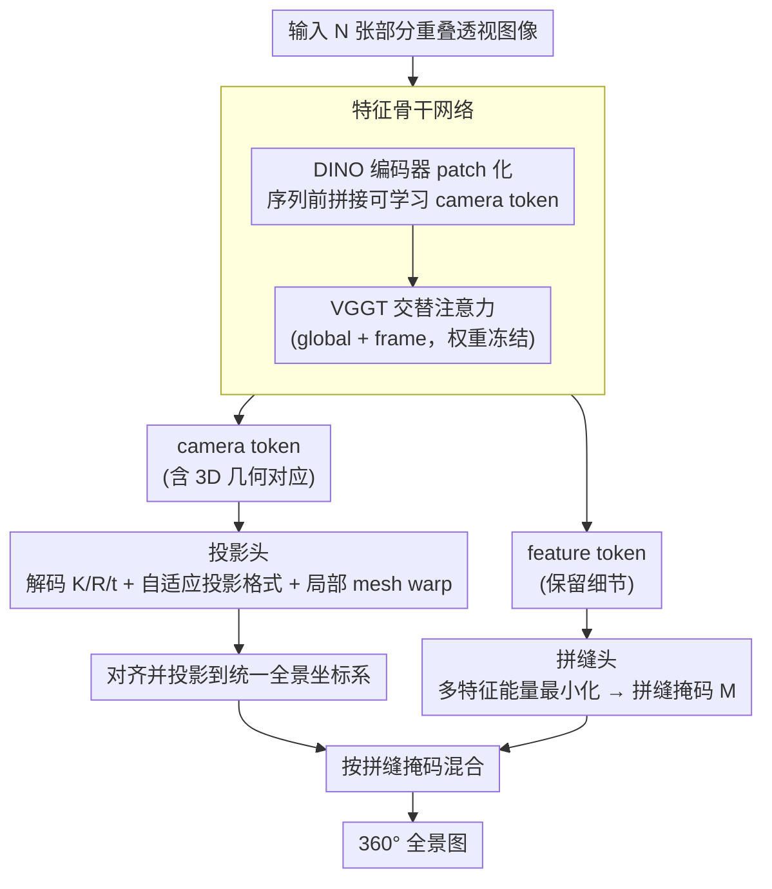

# Pano360: Perspective to Panoramic Vision with Geometric Consistency

**会议**: CVPR2026  
**arXiv**: [2603.12013](https://arxiv.org/abs/2603.12013)  
**代码**: [KiMomota/Pano360](https://github.com/KiMomota/Pano360)  
**领域**: 3D视觉  
**关键词**: panorama stitching, 3D geometric consistency, transformer, multi-view alignment, seam detection

## 一句话总结

提出 Pano360，将全景拼接从传统的 2D 逐对匹配扩展到 3D 摄影测量空间，利用 Transformer 架构实现多视图全局几何一致性对齐，在弱纹理、大视差、重复纹理等挑战场景下达到 97.8% 成功率。

## 研究背景与动机

全景图像拼接在自动驾驶、VR、3D Gaussian Splatting 等下游任务中有广泛需求。现有方法面临的核心问题是：

**逐对匹配的误差累积**：传统方法（SIFT/ORB/LoFTR + RANSAC）和学习方法（UDIS/UDIS2）都局限于逐对建立 2D 特征对应关系，多图拼接时投影误差会逐步累积，导致严重畸变

**挑战场景下的特征匹配失败**：弱纹理、大视差、重复纹理等场景中，可靠特征匹配稀少，单应矩阵估计容易失败

**忽略 3D 投影几何**：现有方法只追求视觉无缝但忽略了全局 3D 投影一致性，导致几何失真

**后处理代价高**：CNN 方法（如 UDIS2）需要复杂的后处理才能完成多图对齐，实用性受限

**核心洞察**：多视图几何对应关系可以直接在 3D 空间中构建，比 2D 空间的对应关系更准确、更具全局一致性。因此作者将 2D 对齐任务扩展到 3D 摄影测量空间，从根本上解决误差累积问题。

## 方法详解

### 整体框架

Pano360 采用双分支 Transformer 架构，输入 N 张部分重叠图像，一次前向推理联合预测所有拼接所需参数：

$$f(\{I_i\}_{i=1}^N) = \{P_i, W_i, M_i\}_{i=1}^N$$

其中 $P_i$ 为全局投影变换，$W_i$ 为局部形变场（处理视差），$M_i$ 为拼缝掩码。完整的像素变换为：

$$\mathcal{W}_i(\mathbf{u}) = P_i(\mathbf{u}) + W_i(\mathbf{u})$$

框架流程：(a) 利用相机参数将透视图像投影到统一全景坐标系 → (b) 提取重叠区域 → (c) 拼缝解码器生成各图像的拼缝掩码 → (d) 利用掩码和对齐图像混合生成最终全景图。

### 关键设计

**1. 特征骨干网络**

- 每张图像先经过预训练 DINO 编码器进行 patch 化处理
- 在所有图像 embedding 序列前添加可学习的 camera token，用于学习跨图像的全局几何关系
- 用预训练 VGGT 的 L 层交替注意力（global attention + frame attention）处理拼接序列
- 输出两路：camera token（包含 3D 几何对应信息，送入投影头）和 feature token（保留细节，送入拼缝头）

**2. 投影头 (Projection Head)**

- 从预测的 camera token 解码出每张图像的内参 $\mathbf{K}_i$ 和外参 $\{\mathbf{R}_i, \mathbf{t}_i\}$
- 假设所有相机共享焦距，主点在图像中心；第一张图像固定为参考坐标系（$\mathbf{R}_1=\mathbf{I}, \mathbf{t}_1=\mathbf{0}$）
- 支持自适应选择投影格式：平面投影、等距柱状投影、球面投影等
- 对于大视差场景额外计算局部 mesh warp $W_i$ 修正残余错位

**3. 拼缝头 (Seam Head) — 多特征联合优化**

核心是将拼缝检测建模为能量最小化问题：

$$E(\mathcal{I}) = E_l(\mathcal{I}) + E_c(\mathcal{I})$$

- $E_l$：标签代价，硬约束确保像素仅来自有效图像区域
- $E_c$：连续性代价，惩罚相邻像素标签不同，鼓励拼缝连续且不显眼

像素级代价函数融合三类信息：

$$C(p) = F_{color}(p) + F_{gradient}(p) \times F_{ratio}(p)$$

| 代价项 | 定义 | 作用 |
|--------|------|------|
| $F_{color}$ | 重叠图像间颜色差异 $\|I_i(p) - I_j(p)\|$ | 引导拼缝避开颜色不连续处 |
| $F_{gradient}$ | 梯度幅值 $|\nabla I_i(p)| + |\nabla I_j(p)|$ | 引导拼缝避开尖锐物体边缘 |
| $F_{ratio}$ | 纹理复杂度图 | 重罚视觉复杂区域（含视差/深度变化），将拼缝导向均匀区域 |

关键优势：**同时考虑所有重叠图像**的颜色差异和梯度，不再局限于逐对计算，避免陷入局部最优。计算得到的 seam mask 作为伪标签监督 seam decoder 训练。

### 损失函数与训练策略

多任务损失包含三项：

| 损失项 | 公式 | 说明 |
|--------|------|------|
| $\mathcal{L}_{cam}$ | $\sum_{i=1}^N \|\hat{\mathbf{g}}_i - \mathbf{g}_i\|_\epsilon$ (Huber loss) | 监督相机参数预测 |
| $\mathcal{L}_{seam}$ | $\sum_{i=1}^N \|\hat{M}_i - M_i\|$ (L1 loss) | 监督拼缝掩码预测 |
| $\mathcal{L}_{proj}$ | 预定义投影格式损失 | 使网络适配不同投影格式，训练初始即启用以保证梯度连续 |

训练细节：
- VGGT 交替注意力模块权重从预训练初始化并**冻结**
- 去除不确定性项以加速收敛
- 数据归一化：所有量表示在第一帧坐标系中，保证输入置换不变性
- 数据增强：对 yaw/pitch/roll 施加最多 2° 的随机旋转抖动

**Pano360 数据集**：200 个真实场景（旅游 50%、极限运动 30%、极端光照 20%），每场景 3 个焦距 × 24 帧 = 72 张图像（2048×2048），总计 14,400 帧，标注 GT 相机参数、覆盖完整 360° FoV。

## 实验关键数据

### 主实验：Pano360 数据集全景质量对比

| 方法 | QA_q ↑ | QA_a ↑ | BRIS ↓ | NIQE ↓ | 备注 |
|------|--------|--------|--------|--------|------|
| AutoStitch | 3.28 | 2.81 | 49.84 | 5.01 | 传统特征 |
| APAP | 3.53 | 3.66 | 45.66 | 3.77 | 传统特征 |
| GES-GSP | 3.74 | 3.72 | 44.22 | 3.95 | 传统特征 |
| UDIS2‡ | 2.87 | 2.34 | 58.62 | 4.91 | 仅支持逐对 |
| **Pano360 (Ours)** | **4.09** | **3.94** | **37.96** | **3.37** | — |

（以 Scene (c) 为例，包含重复纹理、异常光照和大 FoV 等挑战）

### 成功率与速度对比

| 方法 | 是否依赖几何特征 | 成功率 (%) | 运行时间 |
|------|------------------|-----------|---------|
| LoFTR+RANSAC | ✓ | 63.4 | ~13s |
| LightGlue+RANSAC | ✓ | 66.7 | ~11s |
| ELA | ✓ | 80.1 | ~90s |
| GES-GSP | ✓ | 83.3 | ~20s |
| APAP | ✓ | 30.0 | >300s |
| **Pano360 (Ours)** | ✗ | **97.8** | **~5s** |

### UDIS-D 数据集泛化性验证

| 方法 | PSNR ↑ | SSIM ↑ | PIQE ↓ | NIQE ↓ |
|------|--------|--------|--------|--------|
| UDIS2‡ | 25.43 | 0.838 | 48.09 | 6.11 |
| DHS‡ | 25.88 | 0.845 | 45.73 | 6.18 |
| **Pano360 (Ours)** | **25.97** | **0.852** | **42.12** | **5.78** |

（Pano360 未在 UDIS-D 上训练，泛化到逐对场景仍超越专门微调的方法）

### 消融实验

| $\mathcal{L}_{cam}$ | $\mathcal{L}_{proj}$ | $\mathcal{L}_{seam}$ | QA_q ↑ | BRIS ↓ | NIQE ↓ |
|:---:|:---:|:---:|--------|--------|--------|
| ✗ | ✗ | ✗ | 2.76 | 62.47 | 5.31 |
| ✓ | ✗ | ✗ | 3.45 | 47.43 | 4.65 |
| ✓ | ✓ | ✗ | 3.68 | 43.71 | 3.97 |
| ✗ | ✗ | ✓ | 3.01 | 51.12 | 4.83 |
| ✓ | ✓ | ✓ | **4.09** | **37.96** | **3.37** |

**关键发现**：
- 位姿引导对齐（$\mathcal{L}_{cam}$）贡献最大，QA_q 从 2.76 提升到 3.45
- 投影函数进一步消除非透视畸变，BRIS 降低约 4 点
- 三项联合最优；仅有拼缝而无对齐时效果有限（精确对齐是好拼缝的前提）
- 拼缝消融中：去除颜色项导致明显色差，去除纹理图导致鬼影（拼缝穿过人物），传统 graph-cut 结构畸变最严重

## 亮点与洞察

1. **范式转变**：从 2D 逐对匹配到 3D 全局对齐，是全景拼接领域的重要突破。利用 3D 空间中的多视图几何一致性直接过滤不可靠匹配
2. **巧妙的架构复用**：利用预训练 VGGT（本身具有 3D 感知能力）的交替注意力模块并冻结权重，以极低训练代价获得强大的跨视图特征聚合能力
3. **扩展性**：支持从几张到数百张图像的输入，且在大规模场景中比逐对方法快 10 倍以上
4. **多特征联合拼缝优化**：同时考虑所有重叠图像的颜色/梯度/纹理，避免逐对计算的局部最优问题
5. **高质量数据集**：14,400 帧真实场景数据，涵盖极端运动/夜景等挑战条件，填补了领域数据空白

## 局限性与可改进方向

1. **不支持畸变输入**：当前模型假设输入图像无固有畸变（如鱼眼镜头），限制了对更多相机类型的适用性
2. **极端大视差的局限**：当同一物体从极不同角度拍摄时，仍需 3D 重建才能正确拼接，纯图像级 warp 不足
3. **VGGT 冻结的权衡**：冻结预训练注意力模块虽降低训练成本，但可能限制了对全景拼接任务的进一步适配
4. 可探索的方向：(a) 引入深度估计模块处理更复杂视差；(b) 扩展到视频全景拼接/实时场景；(c) 支持异构镜头（鱼眼+透视混合输入）

## 相关工作与启发

- **VGGT** [Wang et al.]：提供 3D 感知的 Transformer 特征，被本文用作骨干架构的基础
- **UDIS/UDIS2** [Nie et al.]：CNN 学习方法的代表，但局限于逐对拼接
- **GES-GSP** [Du et al.]：几何结构保持的传统方法，在重复纹理下仍会失败
- **LoFTR/LightGlue**：现代特征匹配方法，配合 RANSAC 使用但成功率仅 60-67%
- 本文的启发：**将 2D 任务提升到 3D 空间解决的思路值得在其他几何视觉任务中借鉴**，如图像配准、光流估计等

## 评分

| 维度 | 分数 (1-10) | 说明 |
|------|:-----------:|------|
| 创新性 | 8 | 2D→3D 的范式迁移思路新颖，架构设计巧妙复用 VGGT |
| 技术深度 | 8 | 投影头+拼缝头+多任务损失设计完整，理论推导清晰 |
| 实验完备性 | 8 | 多数据集验证+充分消融+泛化实验+定性对比 |
| 实用价值 | 8 | 97.8% 成功率+5s 运行时间，大规模场景适用 |
| 写作质量 | 7 | 整体清晰，部分公式排版略显拥挤 |
| **总分** | **8.0** | 全景拼接领域的扎实工作，范式创新+强实验 |

<!-- RELATED:START -->

## 相关论文

- [\[CVPR 2026\] SwiftTailor: Efficient 3D Garment Generation with Geometry Image Representation](swifttailor_efficient_3d_garment_generation_with_geometry_image_representation.md)
- [\[CVPR 2026\] VGGT-Det: Mining VGGT Internal Priors for Sensor-Geometry-Free Multi-View Indoor 3D Object Detection](vggt-det_mining_vggt_internal_priors_for_sensor-geometry-free_multi-view_indoor_.md)
- [\[CVPR 2026\] Complet4R: Geometric Complete 4D Reconstruction](complet4r_geometric_complete_4d_reconstruction.md)
- [\[CVPR 2026\] Random Wins All: Rethinking Grouping Strategies for Vision Tokens](random_wins_all_rethinking_grouping_strategies_for_vision_tokens.md)
- [\[CVPR 2026\] GAP: Action-Geometry Prediction with 3D Geometric Prior for Bimanual Manipulation](action-geometry_prediction_with_3d_geometric_prior_for_bimanual_manipulation.md)

<!-- RELATED:END -->
