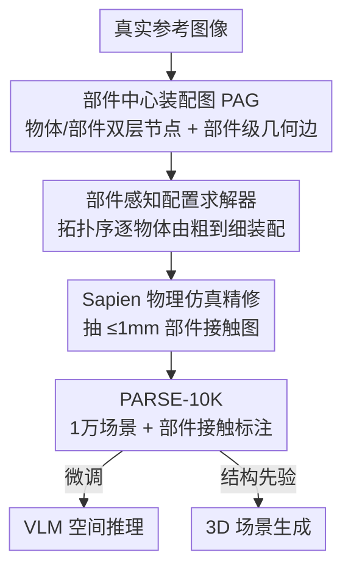

# PARSE: Part-Aware Relational Spatial Modeling

**会议**: CVPR 2026  
**论文**: [CVF Open Access](https://openaccess.thecvf.com/content/CVPR2026/html/Bai_PARSE_Part-Aware_Relational_Spatial_Modeling_CVPR_2026_paper.html)  
**代码**: 无  
**领域**: 3D视觉  
**关键词**: 部件级场景图, 3D室内场景生成, 物理合理布局, 空间推理, 数据集

## 一句话总结
PARSE 把"物体之间的关系"从粗糙的语言介词/物体级场景图下沉到**部件级几何约束**，用一张"部件中心装配图(PAG)"描述场景，再用一个由粗到细的求解器把图实例化成无碰撞、物理合理的 3D 室内场景，并据此造出含部件级接触标注的大规模数据集 PARSE-10K，显著提升 VLM 空间推理与可控 3D 场景生成。

## 研究背景与动机
**领域现状**：要让机器"理解 / 生成"一个室内场景，关键不在于单个物体长什么样，而在于物体彼此**怎么关联**——谁支撑谁、谁装在谁里、谁靠着谁。主流刻画关系的工具有两类：一是用语言介词（on / in / against），二是用物体级场景图（scene graph），二者都把物体当成一个不可分的整体。

**现有痛点**：这种"整体级"粒度太粗，根本说不清**到底是哪块区域在接触**。"书放在桌上"——是书脊还是封面贴着桌面？"吉他靠在书柜上"——是琴头还是琴身？语言介词天然欠定，物体级场景图同样无法指定接触点和支撑面。结果是布局歧义、物理不一致：求解器只能在巨大的可行解空间里盲目搜索，生成的场景经常穿模、悬浮、东倒西歪。

**核心矛盾**：关系的"语义描述"（介词/物体级边）和场景的"几何配置"（每个物体的精确位姿）之间隔着一道鸿沟——前者太抽象，无法直接翻译成几何约束。中间缺一层能把"靠着"落实成"哪个面贴哪个面"的表示。

**本文目标**：(1) 设计一种能精确表达部件间几何关系的场景表示；(2) 给定这种表示，能高效求解出无碰撞、物理稳定的 3D 场景；(3) 用它批量生产带细粒度接触标注的数据，喂给下游的 VLM 空间推理和 3D 生成任务。

**切入角度**：作者观察到，部件级关系恰好是连接"高层语言"和"低层几何"的桥梁——椅子靠**脚**站在地上，杯子靠**底**放在桌上，扫帚靠**尖**抵着墙。把关系锚定到具体部件的具体表面，歧义的介词就变成了确定的几何约束，可行解空间被大幅剪枝。

**核心 idea**：用**部件级几何边**替代物体级关系，把每条"关系"编码成"物体 A 的某部件的某表面 ↔ 物体 B 的某部件的某表面"，再用约束求解器把这张图增量装配成场景。

## 方法详解

### 整体框架
PARSE 由两块构成：一个**表示**——部件中心装配图(Part-centric Assembly Graph, PAG)，它把场景写成一张有向无环图(DAG)，节点是物体/部件、边是关系；一个**求解器**——部件感知空间配置求解器(Part-Aware Spatial Configuration Solver)，它按 DAG 的拓扑序逐个物体地把抽象 PAG 实例化成具体 3D 位姿。整条流水线接着被当作"引擎"，批量生成 10,000 个室内场景，构成数据集 PARSE-10K；最后这些带部件级接触标注的数据被用于两个下游：微调 Qwen3-VL 做空间推理、给扩散式 3D 场景生成网络注入 PAG 作为结构先验。

整体数据流是清晰的多阶段串行 pipeline：真实图像 → 抽出 PAG → 求解器逐物体装配 → 物理仿真精修 → 带接触图的 3D 场景 → 下游任务。

### 关键设计

**1. 部件中心装配图 PAG：把场景写成"哪个面贴哪个面"的有向无环图**

这是全文的表示核心，专治物体级关系"说不清接触在哪"的痛点。PAG 的节点是**两层结构**：上层是物体节点 $V_O$，每个节点只存一个"语义查询"（一个类别或一组候选类别），而不绑定具体 3D 实例——把"选哪个模型"推迟到合成阶段，从而极大提升组合多样性；下层是部件节点 $V_P$，每个物体节点是它若干几何部件的父节点（"椅子"连到"腿/座面/靠背"），每个部件再由一组**带标签的表面**（top/bottom/front/back/left/right，相对资产规范位姿定义）刻画，这些表面就是定义对齐与接触的几何接口。

边 $E$ 分两种粒度：**物体级空间边** $E_{obj}$ 编码 left of / behind / near 这类粗略宏观布局，是可选的高层约束；**部件级几何边** $E_{part}$ 才是 PAG 表达力的核心——每条边带一个空间介词(on / in / against / aligned with)，连接的是分属不同物体的两个**部件节点**。例如"一本书向前翻倒在桌上"就是一条 on 边，连书的"封面"部件（front 表面）到桌的"桌面"部件（top 表面）。正是这种部件—表面级的锚定，把欠定的介词变成了可计算的几何约束。

**2. 层级装配结构(DAG + 唯一支撑者)：把全场景约束拆成可解的子问题序列**

一个静态 3D 场景是一堆稠密、相互依赖的几何关系，直接当一个大约束满足问题求解会爆炸。PARSE 采用"装配视角"——把稳定场景看成一个**顺序搭建**的结果，并施加两条结构约束：(a) 整张 PAG 必须是**有向无环图(DAG)**，这是"无循环依赖的顺序过程"的必要数学结构，直接保证物理可实现性（存在合法的逐步搭建顺序）；(b) 每个物体有**唯一的物理支撑者**，这条规则天然把场景组织成清晰的层级树。两者合在一起，把"全场景约束满足"分解成一串**局部子问题**——按装配序，每个物体一个，从而让原本不可解的整场景问题变得可计算。

**3. 由粗到细的部件感知配置求解器：增量收缩可行位姿空间，几乎不靠盲采样拒绝**

给定 PAG，求解器按拓扑序（即 DAG 支撑关系诱导的装配序）逐个实例化物体，每个物体走一遍"由粗到细的渐进细化"，三步依次收紧可行位姿空间：

- **粗定位**：每个物体有唯一支撑者，求解从支撑面上的 2D 候选区开始，先排除所有已占用区域，再施加物体级空间边——如"left of"会用一个平面把可行平移范围限制到目标物体的一侧，把可行区收缩成更小的子空间。
- **部件级对齐**：此时才从资产库按节点的语义查询实例化一个带部件分割与标签的具体 3D 资产，然后求解部件级几何约束。若边显式给了表面标签就直接用；若没给，求解器做一步**几何推理**——例如 on 关系会动态找被支撑部件的最低底面、并在目标部件上搜一个朝上的支撑平面，把推断/给定的表面用来构造新约束（典型是令两面平行并接触）。每条新约束与已有约束联立，进一步把位姿空间收缩到最小可行子空间。
- **末位姿采样与验证**：从这个子空间随机采一个位姿，验证 3D 碰撞与物理—语义合理性（如 in 关系用多方向射线检测包裹程度）。因为整个求解是约束的**确定性累积**，从最终子空间采到的任意位姿都先验地满足所有非碰撞类几何/空间关系——这保证了验证步的高成功率，避开了代价高昂的"盲采样—拒绝"循环。最后整场景在 Sapien 里做一次短暂动态仿真精修，再从稳定构型里抽出 ≤1mm 邻近部件对，生成部件级接触图。

### 一个完整示例
以装配"书翻倒在桌上"为例走一遍：PAG 里桌子先被装配（拓扑序靠前，作为支撑者），求解器在地面候选区里给桌子定好位姿；轮到书时，先由物体级边把书的可行区粗定位到桌面上方某子区域；进入部件级对齐，求解器实例化一个带分割的具体书模型，读到 on 边连"书的封面(front)→桌的桌面(top)"，于是构造"两面平行且接触"的约束，把书的位姿空间收缩到几乎唯一；最后在该子空间采一个位姿，多方向验证无穿模，物理仿真微调到稳定，再抽出书封面与桌面在 ≤1mm 内的接触对写进接触图。整个过程里可行解空间从"桌面上方一大片"被一步步剪到"贴着桌面、封面朝下的窄子集"，无需反复盲试。

## 实验关键数据

### 数据集对比（PARSE-10K vs 现有室内场景数据集）

| 数据集 | #场景 | 平均物体/场景 | 布局生成方式 | 物理优化 | 部件标注 | 部件接触标注 |
|--------|-------|--------------|--------------|---------|---------|-------------|
| 3D-FRONT | 18,968 | 6.9 | 人工设计 | ✗ | ✗ | ✗ |
| FurniScene | 111,698 | 14.4 | 人工设计 | ✗ | ✗ | ✗ |
| METASCENES | 706 | - | 真实扫描 | ✓ | ✗ | ✗ |
| **PARSE-10K (本文)** | 10,000 | **49.9** | 真实图像引导 | ✓ | **✓** | **✓** |

PARSE-10K 用 132 类、17,372 个部件分割资产，覆盖 17 种房型，是唯一同时具备**物理优化 + 部件标注 + 部件接触标注**且平均物体数远超他人(49.9)的数据集。

### VLM 空间推理（在 PARSE-10K 上微调 Qwen3-VL）

三个任务：视觉关系 MCQ、部件级接触 MCQ、场景图生成(SGG)。

| 模型 | 视觉关系↑ | 部件接触↑ | SGG-F1(有/无 bbox 匹配) |
|------|----------|----------|------------------------|
| GPT-5 | 82.1 | 75.2 | 13.8 / 41.1 |
| Gemini-2.5-Pro | 85.0 | 75.6 | 44.2 / 47.3 |
| Claude-Opus-4 | 80.3 | 73.2 | 9.8 / 41.4 |
| Qwen3-VL（基座） | 86.2 | 60.4 | 33.2 / 37.9 |
| **Ours（微调）** | **97.4** | **86.2** | **76.6 / 78.2** |

微调后在三项上全面领先：视觉关系 MCQ 97.4%、部件接触 MCQ 86.2%、SGG F1（有 bbox 匹配）从 Qwen3-VL 的 33.2 跃到 76.6。"有 / 无 bbox 匹配"两套指标的对照说明：GPT-5/Claude 这类通用大模型**关系推理强但视觉定位弱**，一到 bbox 匹配阶段就掉分；而本文增益既来自定位也来自更强的关系理解（grounding-agnostic 指标同样领先）。

### 3D 场景生成（用户研究，20 人投票）

| 方法 | 复杂度↑ | 真实感↑ | 接触保真度↑ |
|------|--------|--------|------------|
| InstructScene（3D-FRONT 训练） | 7.5% | 33.8% | 28.8% |
| Ours(无 PAG 条件) | 45.0% | 27.5% | 26.3% |
| **Ours(有 PAG 条件)** | **47.5%** | **38.8%** | **45.0%** |

生成网络是受 InstructScene 启发的图 Transformer 扩散模型：用 Michelangelo 编码每个 mesh 的几何、用 CLIP 编码 PAG 转成关系嵌入矩阵、以 FiLM 方式把场景图控制注入注意力层。结果显示：仅在 PARSE-10K 上训练就能生成物体更多、接触更丰富的场景；但**不加 PAG 条件**时，由于数据本身复杂度高、接触密集，模型学到的分布常出现不合理物理——用户偏好低；**加 PAG 条件**后，复杂度/真实感/接触保真度三项全面胜出。

### 关键发现
- PAG 条件化是 3D 生成质量的胜负手：无条件版本接触保真度仅 26.3%，加条件后翻到 45.0%——说明部件级关系作为结构先验确实把"物理合理性"喂进了生成网络。
- 通用 VLM 的瓶颈在视觉定位而非关系推理：bbox 匹配前后分数差距巨大（如 Claude 9.8→41.4），PARSE-10K 的密集部件监督同时补齐了定位与关系两端。
- 求解器的"确定性约束累积"设计让末位姿采样几乎一次成功，避免了传统过程化系统在大解空间里反复拒绝采样的低效。

## 亮点与洞察
- **把关系下沉到"部件—表面"是真正的洞察**：椅子靠脚、杯子靠底、扫帚靠尖——这个朴素观察直接把欠定介词翻译成确定几何约束，是连接语言与几何的关键一层，可迁移到任何需要精确接触的任务（抓取、堆叠、装箱）。
- **DAG + 唯一支撑者 = 把 NP 难的全场景约束拆成线性子问题序列**：这个结构性约束既保证物理可实现，又把求解复杂度压下来，是"用表示结构换求解效率"的漂亮设计。
- **由粗到细 + 确定性约束累积**：可行位姿空间被逐步剪枝到最小子集，任意采样都先验满足约束，从根上避免盲采样拒绝——比 LLM 当中介生成约束程序的路线精度更可控。
- **数据闭环**：表示(PAG) + 求解器一起当生成引擎造数据(PARSE-10K)，再反哺 VLM 和生成网络，是一套自洽的"表示→数据→下游"管线。

## 局限与展望
- **PAG 构建半手工**：关系定义复杂、需要部件级坐标推理，对规范位姿敏感，目前装配图的搭建无法完全自动化。
- **求解器是过程化/规则式**：依赖资产库的部件分割与表面标签质量，对没有干净部件标注的资产难以直接处理。
- **生成网络仍是 InstructScene 式架构的改造**，没有探索更原生的部件级生成范式；无 PAG 条件时物理合理性明显下降，说明模型本身并未学会部件约束。
- 作者展望：直接从几何学习部件—部件关系、发展更灵活的接触表示、扩大 PARSE-10K 多样性、把 PARSE 接入具身任务做部件级规划与物理操作。

## 相关工作与启发
- **vs 物体级场景图(scene graph / 3D scene graph)**：他们把物体当不可分单元，能做 captioning/VQA/检索，但说不清部件级接触与支撑；PARSE 用部件—部件边显式建模 contact/support/attachment，粒度更细，物理一致性更强。
- **vs 过程化生成(ProcTHOR / Infinigen)**：ProcTHOR 用刚性放置规则只能控房型等粗因素，Infinigen 用人可读规则提升可控性，但都**物体中心**、无法刻画部件交互，在大解空间里搜索低效；PARSE 的 PAG 求解器编码显式部件—部件约束，剪枝更狠、几何保真度与物理一致性更高。
- **vs LLM 中介式布局(用 LLM 把语言映射到放置/约束程序)**：LLM 当中介会引入语义歧义、削弱几何约束精度；PARSE 直接在部件—表面级定义确定约束，绕开了语言歧义。
- **vs InstructScene（3D 生成 baseline）**：同为图 Transformer 扩散，但 PARSE 用 PAG 作结构先验 + PARSE-10K 的密集部件监督，生成场景的物体数、接触丰富度、物理合理性都更优。

## 评分
- 新颖性: ⭐⭐⭐⭐⭐ 把关系表示从物体级下沉到部件—表面级，并配 DAG 装配 + 确定性约束求解器，是一条清晰且少见的新路线
- 实验充分度: ⭐⭐⭐⭐ 数据集对比 + VLM 三任务 + 生成用户研究三线证据齐全，但生成侧仅用户研究、缺更客观的物理/碰撞定量指标
- 写作质量: ⭐⭐⭐⭐⭐ 动机—表示—求解—数据—下游层层递进，PAG 与求解器讲得具体可复述
- 价值: ⭐⭐⭐⭐⭐ 同时产出新表示、新求解器和带部件接触标注的大规模数据集，对空间推理与可控 3D 生成都有直接价值

<!-- RELATED:START -->

## 相关论文

- [\[CVPR 2026\] Part$^{2}$GS: Part-aware Modeling of Articulated Objects using 3D Gaussian Splatting](part2gs_part-aware_modeling_of_articulated_objects_using_3d_gaussian_splatting.md)
- [\[CVPR 2026\] Context-Nav: Context-Driven Exploration and Viewpoint-Aware 3D Spatial Reasoning for Instance Navigation](context-nav_context-driven_exploration_and_viewpoint-aware_3d_spatial_reasoning_.md)
- [\[CVPR 2026\] Learning Hierarchical Hyperbolic Mixture Model for Part-aware 3D Generation](learning_hierarchical_hyperbolic_mixture_model_for_part-aware_3d_generation.md)
- [\[CVPR 2026\] Fresco: Frequency-Spatial Consistent Optimization for Fine-Grained Head Avatar Modeling](fresco_frequency-spatial_consistent_optimization_for_fine-grained_head_avatar_mo.md)
- [\[CVPR 2026\] ReLaGS: Relational Language Gaussian Splatting](relags_relational_language_gaussian_splatting.md)

<!-- RELATED:END -->
