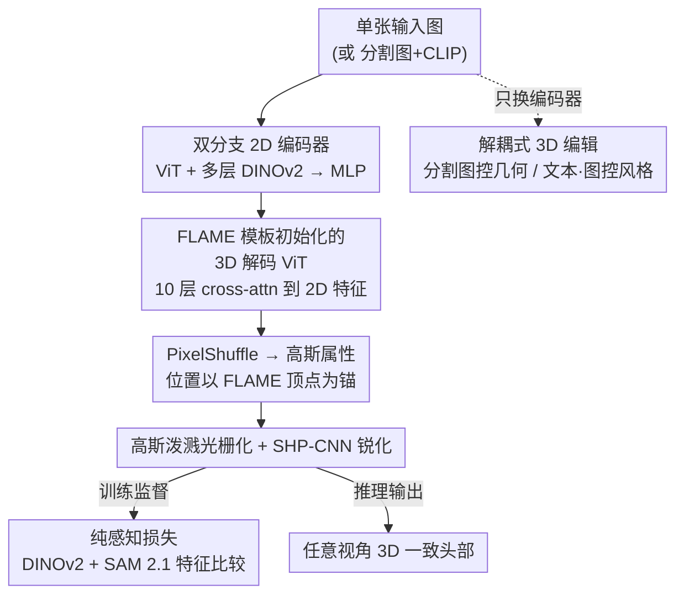

# PercHead: Perceptual Head Model for Single-Image 3D Head Reconstruction & Editing

**会议**: CVPR 2026  
**论文**: [CVF Open Access](https://openaccess.thecvf.com/content/CVPR2026/html/Oroz_PercHead_Perceptual_Head_Model_for_Single-Image_3D_Head_Reconstruction__CVPR_2026_paper.html)  
**代码**: https://antoniooroz.github.io/PercHead/ （项目页，含训练/推理代码与交互式 GUI）  
**领域**: 3D视觉  
**关键词**: 单图 3D 头部重建, 感知损失, DINOv2, Gaussian Splatting, 解耦式 3D 编辑

## 一句话总结
PercHead 用一张图重建出对极端视角都鲁棒的 3D 一致头部：核心是抛弃 L1/LPIPS 这类像素级监督，改用 DINOv2 + SAM 2.1 基础模型的中间特征构造"纯感知损失"，配合 ViT 架构（2D 编码器 + FLAME 模板初始化的 3D 解码器 + 高斯泼溅），在 Ava-256 极端视角上 LPIPS、DreamSim、ArcFace 全面领先，并只需换掉编码器就扩展成"分割图控几何 + 文本/参考图控风格"的解耦式 3D 编辑。

## 研究背景与动机

**领域现状**：从单张图重建 3D 头部是数字人、虚拟会议、可控肖像等应用的入口。主流路线分几派：基于 3DMM 网格（ROME）几何一致但发型等复杂区域realism差；GAN 派（EG3D、PanoHead、SphereHead）借大规模 2D 数据 + 对抗损失做出高realism，但训练难、重建要先做 latent inversion 损失身份；高斯泼溅派（GAGAvatar、LAM）效率高、正脸效果好；多视角扩散派（LGM）通用但达不到头部所需的高保真。

**现有痛点**：现有方法几乎都"近输入视角好、相机一动就崩"。原因有二——一是训练数据：头部域真实多视角数据集要么很小（NeRSemble）、要么是合成的（Cafca），能规模化的只有 in-the-wild 单视角数据（FFHQ），缺乏视角多样性；二是监督信号：人对脸部结构和外观极度敏感，但头发等高频区域从单图根本无法做到像素级准确，L1/SSIM/LPIPS 这类低层损失会把"合理但非逐像素对齐"的重建当成错误打压，在高频区给出噪声监督，越训越糊。

**核心矛盾**：要 3D 一致就需要大规模多视角先验，但头部域大规模多视角数据稀缺；要高保真就要强监督，但像素级损失在不可见区域 / 高频区域恰恰是有害的。两个约束互相打架。

**本文目标**：(1) 从任意视角输入重建出对极端目标视角都 3D 一致的高realism头部；(2) 让这套通用重建模型能低成本扩展到解耦式 3D 编辑。

**切入角度**：作者赌的是——既然 DINOv2、SAM 2.1 这类视觉基础模型已经对图像有"深层理解"（不专门训练就能解多种任务），那它们的中间特征就能在"感知/语义层面"而非像素层面比较渲染图与真值，从而在头发这种高频区给出更鲁棒的监督。

**核心 idea**：用"基础模型特征空间的感知损失"替代像素级损失来监督 3D 重建，配 ViT 架构把 3D 表示与 2D 输入解耦，并通过"多视角 + in-the-wild"混合训练同时拿到 3D 一致性与身份多样性。

## 方法详解

### 整体框架
PercHead 是一条"单图 → 2D 编码 → 3D 高斯 → 渲染 → 锐化"的前馈管线，但训练时用的不是渲染图和真值的像素差，而是把两者都喂进冻结的 DINOv2 / SAM 2.1，比较它们的深层特征。具体地：输入图先经**双分支 2D 编码器**（一个可训练 ViT + 多层 DINOv2 特征，拼接后过 MLP，只保留前景 patch）得到 2D 特征 $F_{2D}$；解码端从一个 FLAME 模板（上采样到 65k 顶点、每 16 个邻接顶点成一组 patch）初始化 3D 隐表示 $F^0_{3D}$，经 10 层解码 ViT 反复 cross-attend 到 $F_{2D}$ 来"补全" 3D 信息（注意全程**不用 self-attention**）；再用 PixelShuffle 把每个 3D patch 展成 16 个高斯隐变量，分别线性映射出位置/尺度/旋转/不透明度/颜色，位置以 FLAME 顶点为锚点做受限偏移；高斯泼溅光栅化出图后，再过一个 **SHP-CNN** 锐化模块。整条管线由 **DINOv2 + SAM 2.1 感知损失**监督。编辑时只需把编码器换成"分割图 + CLIP 嵌入"，其余权重沿用重建模型微调即可。

### 关键设计

**1. 双分支 2D 编码 + 无自注意力的 3D 解码：把 3D 表示和 2D 输入解耦**

痛点是高斯泼溅派（GAGAvatar/LAM）把高斯直接从 2D 特征图"抬升"上来，3D 表示和输入视角绑得太死，换视角就崩。PercHead 改成 ViT 架构让 3D 隐表示独立存在、只去"查询" 2D 特征。编码端在 LAM 已验证的"多层 DINOv2 特征"之外，额外加一条可训练 ViT 分支提供任务专用的重建特征，两路 patch 数相同，拼接后过 MLP：$F_{2D}=\mathrm{MLP}\big(\{F^i_{ViT},F^i_{DINOv2}\}_{i=1}^{|P|}\big)$，只保留前景 patch。解码端从 FLAME 模板初始化 $F^0_{3D}$，第 $i$ 层按 $F^i_{3D}=F^{i-1}_{3D}+\mathrm{MLP}_i\big(F^{i-1}_{3D}+\mathrm{ATTN}_i(F^{i-1}_{3D},F_{2D})\big)$ 逐层更新。关键观察是：每个 3D 隐变量代表一个局部顶点组，配上 2D 特征里的全局上下文，**仅靠 cross-attention 就足以重建出连贯的 3D 头**，不需要 3D patch 之间互相 self-attention——这既省算力，也强化了"3D 结构由模板+局部组装而来"的归纳偏置。位置预测则锚在 FLAME 顶点上：$X=X_{FLAME}+\mathrm{Tanh}(\mathrm{Linear}(F_{Gaussian})\cdot s_{init})\cdot s_{max}$，$s_{init}$ 控制早期移动幅度、$s_{max}$ 限制高斯偏离锚点的最大距离，避免训练初期高斯乱飞。

**2. 纯感知损失：只用 DINOv2 + SAM 2.1 的深层特征监督，丢掉所有像素级损失**

这是全文的"心脏"。模型必须重建大量从未直接观测的区域，在头发等高频区追求逐像素准确是不现实的，L1/SSIM/LPIPS 在这里只会给出噪声监督、最终把细节磨平。PercHead 因此完全用基础模型特征空间的余弦距离当损失。DINOv2 项取中间层 $L=\{8,11\}$ 的 class token 和 patch token，对渲染图 $I_r$ 与真值 $I_{gt}$ 比较 L2 归一化后的特征余弦相似度：$L_D=\frac{1}{|L||T_D|}\sum_{l\in L}\sum_{t\in T_D}\big(1-CD_{l,t}(I_r)\cdot CD_{l,t}(I_{gt})\big)$，其中 $CD_{l,t}(I)=\mathrm{DINOv2}_l(I)_t/\lVert\mathrm{DINOv2}_l(I)_t\rVert_2$。不同层作用不同：中层提升锐度，晚层更关注眼镜、头发这类语义概念。SAM 2.1 项则用其**中间图像编码**（而非分割图本身）比较：$L_S=\frac{1}{|T_S|}\sum_{t\in T_S}\big(1-\frac{\mathrm{SAM2.1}(I_r)_t\cdot\mathrm{SAM2.1}(I_{gt})_t}{\lVert\mathrm{SAM2.1}(I_r)_t\rVert_2\lVert\mathrm{SAM2.1}(I_{gt})_t\rVert_2}\big)$，让模型把细节"分割对"。总损失就这两项：$L=\lambda_D L_D+\lambda_S L_S$，$\lambda_D=\lambda_S=1.0$，重建与编辑两条管线共用。唯一例外是 SHP-CNN 用 DINOv2 第 8 层 class token 监督（实测最锐）。两个基础模型都用蒸馏小版，合计仅 67M 参数。这条损失可作为标准损失的即插即用替换，挑战了"训练 3D 重建必须用 L1/LPIPS"的惯例。

**3. 3D 一致性训练任务：多视角数据保一致、in-the-wild 数据保多样**

作者要模型对三件事鲁棒：(1) 3D 表示自洽、(2) 对侧脸输入鲁棒、(3) 对多样身份鲁棒。前两点靠多视角数据：NeRSemble 提供 270 个真实身份 × 16 视角，Cafca 提供 1500 个合成人物 × 30 视角（含纯后脑勺视角，用 GAGAvatar Track 的人脸检测剔除）；训练时输入视角的多样性逼模型处理侧脸，而对额外三个视角的比较则提升对未见区域的补全。第三点靠 in-the-wild 的 FFHQ——但只取 3k 张（而非全部 70k，并剔除有遮挡的样本），就足以让模型对极端 OOD 输入鲁棒，同时不破坏 3D 一致性。这种"少量真实野外数据点睛"的配比是消融里被验证的关键：纯 2D 数据根本重建不出 3D 头，纯多视角数据又因受控环境光照单一而难保留输入光照，两者混合才最优。

**4. 解耦式 3D 编辑：只换编码器，几何与风格的解耦自动涌现**

通用重建模型要扩展到编辑，PercHead 只改编码器：把单图输入换成两路——19 通道的 FaRL 分割图（控几何）+ 单个 CLIP 嵌入（控风格），$F_{Geom+Style}=\mathrm{MLP}\big(\{F^i_{ViT\text{-}Geom},F_{CLIP}\}_{i=1}^{|P|}\big)$，其余管线用重建权重初始化后微调。值得注意的是几何与风格的**解耦无需任何额外约束就自然涌现**。数据复用训练图（但排除 Cafca 以免生成合成脸），训练时把同一张图同时喂给 CLIP 与 FFHQ。推理时分割图控几何（支持 GUI 里手绘编辑），风格既可用参考图、也可借 CLIP 文本编码器**零样本**用文本 prompt 控制——尽管训练时只用图像做风格条件，靠 CLIP 视觉-文本对齐的潜空间就能解读文本编辑，既能改低层属性（发色、卷发）也能改高层属性（年龄）。这与 LAM"在 2D 编辑再抬升到 3D"不同，PercHead 直接在 3D 空间 attend 分割图与 CLIP 特征，控制更直接、算力更省。

### 损失函数 / 训练策略
最终目标即 $L=\lambda_D L_D+\lambda_S L_S$（$\lambda_D=\lambda_S=1.0$），无对抗损失、无扩散、无任何像素级损失。SHP-CNN 单独由 DINOv2 第 8 层 class token 监督。重建与编辑共用同一损失，编辑模型从重建权重微调而来。

## 实验关键数据

### 主实验
在完全未见的 Ava-256 上评测，分 novel-view 与 extreme-view（渲染水平对侧视角，考验对大片未见区域的合理推断）两个任务，指标含 PSNR/SSIM（重建）、LPIPS/DreamSim（感知）、ArcFace 距离（身份保持，越小越好）。

| 任务 | 方法 | PSNR↑ | SSIM↑ | LPIPS↓ | DSim↓ | ArcFace↓ |
|------|------|-------|-------|--------|-------|----------|
| Novel | PanoHead | 14.8 | 0.687 | 0.314 | 0.106 | 0.358 |
| Novel | GAGAvatar | 15.9 | **0.743** | 0.274 | 0.114 | 0.348 |
| Novel | LAM | 13.8 | 0.695 | 0.353 | 0.143 | 0.406 |
| Novel | **Ours** | **16.4** | 0.691 | **0.269** | **0.092** | **0.292** |
| Extreme | PanoHead | 14.2 | 0.658 | 0.349 | 0.131 | 0.416 |
| Extreme | GAGAvatar | 13.5 | 0.694 | 0.364 | 0.183 | 0.523 |
| Extreme | LAM | 11.4 | 0.634 | 0.455 | 0.219 | 0.568 |
| Extreme | **Ours** | **15.9** | 0.678 | **0.291** | **0.106** | **0.282** |

PercHead 在 PSNR、LPIPS、DreamSim、ArcFace 上全面领先；仅 SSIM 略输 GAGAvatar，但其余更贴近人类感知与身份保持的指标全胜。极端视角下差距更明显：最强 baseline PanoHead 从 novel 到 extreme，LPIPS、DreamSim、ArcFace 显著退化，而 PercHead 的 ArcFace 反而保持在 0.282（极端视角甚至略优于自己的 novel-view 0.292），稳健性突出。定性上 PanoHead 有镜像伪影、SphereHead 眼镜/头发/脸型跨视角错乱、GAGAvatar 正转侧丢细节、LAM 高斯 3D 不一致、LGM 幻觉几何并偏蓝，PercHead 在大视角变化下仍保持细节与一致性。

### 消融实验
在 Ava-256 极端视角上消融数据、损失、锐化三组：

| 组 | 配置 | PSNR↑ | LPIPS↓ | DreamSim↓ | ArcFace↓ |
|----|------|-------|--------|-----------|----------|
| Data | 2D Data | 6.5 | 0.643 | 0.436 | 0.752 |
| Data | Multi-View | 15.6 | 0.299 | 0.111 | 0.308 |
| Data | 2D + MV (Ours) | 15.9 | 0.291 | 0.106 | 0.282 |
| Loss | LPIPS+L1 | 15.9 | **0.285** | 0.115 | 0.300 |
| Loss | DINOv2 | 15.4 | 0.383 | 0.149 | 0.340 |
| Loss | SAM2.1 | 15.9 | 0.309 | 0.107 | 0.311 |
| Loss | DINOv2+SAM2.1 (Ours) | 15.9 | 0.291 | 0.106 | 0.282 |
| SHP | w/o SHP-CNN | 15.9 | 0.301 | 0.116 | 0.282 |
| SHP | with SHP-CNN (Ours) | 15.9 | 0.291 | 0.106 | 0.282 |

### 关键发现
- **数据混合不可或缺**：纯 2D 数据 PSNR 仅 6.5、根本重建不出 3D 头；纯多视角数据虽细节好但难保留输入光照；2D+MV 混合在所有指标上最优。
- **损失是 trade-off 而非单点最优**：LPIPS+L1 的 LPIPS 反而最低（0.285，因它直接优化该指标），但 DreamSim、ArcFace 明显更差，定性上过度平滑、头发脸部丢细节；纯 DINOv2 偏糊但发型保真好；纯 SAM2.1 脸好但头发被切断（分割导向编码对噪声大的头发监督不力）。两者结合在感知质量与身份保持上拿到最佳平衡。
- **SHP-CNN 只管锐度**：它改善 LPIPS、DreamSim，但对 PSNR、ArcFace（身份）无影响——定位清晰的轻量锐化器。
- **额外泛化**：虽只在单帧图训练，逐帧应用到 VFHQ 视频能保持跨时间的几何/外观一致（仅未观测区域有轻微闪烁）。

## 亮点与洞察
- **"感知损失"被推到极致**：不是给标准损失加一项感知正则，而是**完全用基础模型特征替代所有像素级损失**，且只用蒸馏小模型（合计 67M）。这个"少即是多"的结论挑战了 3D 重建必须用 L1/LPIPS 的惯例，可迁移到任何高频/不可见区域监督困难的重建任务。
- **用 SAM 的中间编码而非分割图本身当监督**很巧：绕过了"分割掩膜不可微/太粗"的问题，直接借 SAM 对细节的判别力，且配 DINOv2 互补（一个管语义保真、一个管细节边界）。
- **架构层面"3D 不做 self-attention"**反直觉但有效：3D 隐变量只 cross-attend 2D 特征 + 局部组装，既省算力又强化了模板归纳偏置，是 3D 一致性的来源之一。
- **编辑能力几乎零成本**：只换编码器、解耦自动涌现、还能借 CLIP 文本编码器零样本支持文本编辑——把"通用重建模型"当 foundation 复用的范式很有启发。

## 局限与展望
- 作者承认三点：(1) 不支持表情迁移，难做 avatar 动画；(2) 无时序理解，视频逐帧会有未观测区域闪烁；(3) 光照被"烘焙"进重建，难迁移到新环境光照（无 relighting）。
- 编辑受限于 CLIP 单个嵌入，身份保持有限（虽然编辑过程中重建身份保持一致）；几何编辑在大尺度改动上优于 NeRFFaceEditing，但小范围局部编辑不如 NFE。
- 自己看：评测主要在 Ava-256 单一未见数据集上做主表，泛化广度的证据偏少（NeRSemble 留出身份、VFHQ 视频在补充材料）；纯感知损失对头发的优势主要靠定性图说明，缺一个直接量化高频区质量的指标。改进方向：引入轻量时序模块或显式光照分解，或把风格条件从单个 CLIP 嵌入换成更高容量的表示以改善身份保持。

## 相关工作与启发
- **vs GAGAvatar / LAM（高斯泼溅派）**：它们把高斯从 2D 特征图直接抬升，3D 与输入视角强绑定，侧脸/极端视角崩；PercHead 用 ViT 解耦 3D 表示 + cross-attention，极端视角 ArcFace 大幅领先（0.282 vs 0.523 / 0.568）。
- **vs PanoHead / SphereHead（3D GAN 派）**：它们用三平面/球面三平面做 360° 头部生成，但重建要做昂贵的 latent inversion 且常有镜像伪影；PercHead 前馈重建、无 inversion、身份保持更好。
- **vs LGM（多视角扩散派）**：LGM 通用但达不到头部高保真；PercHead 专注头部域、靠感知损失拿到高realism。
- **vs LAM 编辑**：LAM 在 2D 编辑再抬升到 3D，算力大、对 3D 结构控制弱；PercHead 直接在 3D 空间 attend 分割图 + CLIP，控制更直接。
- **vs 既有 DINOv2-based 损失工作**：以往多聚焦 2D 任务或忽略中间表示；PercHead 用多层 DINOv2 中间特征 + SAM2.1 编码专门改善 3D 头部的高频一致性。

## 评分
- 新颖性: ⭐⭐⭐⭐⭐ 把"纯基础模型感知损失"做成 3D 重建的唯一监督，并验证可替代全部像素级损失，观点鲜明
- 实验充分度: ⭐⭐⭐⭐ 主表 + 三组消融扎实、结论自洽，但主量化只在单一未见数据集，泛化广度证据偏补充材料
- 写作质量: ⭐⭐⭐⭐ 动机—方法—消融逻辑清晰，损失与架构公式完整；部分细节（GUI、视频）依赖补充材料
- 价值: ⭐⭐⭐⭐⭐ 单图 3D 头部重建 SOTA + 低成本解耦编辑，且"感知损失替代像素损失"的洞察可迁移到更广的重建任务

<!-- RELATED:START -->

## 相关论文

- [\[CVPR 2026\] RelightAnyone: A Generalized Relightable 3D Gaussian Head Model](relightanyone_a_generalized_relightable_3d_gaussian_head_model.md)
- [\[CVPR 2026\] Feed-forward Gaussian Registration for Head Avatar Creation and Editing](feed-forward_gaussian_registration_for_head_avatar_creation_and_editing.md)
- [\[CVPR 2026\] FlexAvatar: Flexible Large Reconstruction Model for Animatable Gaussian Head Avatars with Detailed Deformation](flexavatar_flexible_large_reconstruction_model_for_animatable_gaussian_head_avat.md)
- [\[CVPR 2026\] GeoDiff4D: Geometry-Aware Diffusion for 4D Head Avatar Reconstruction](geodiff4d_geometry-aware_diffusion_for_4d_head_avatar_reconstruction.md)
- [\[CVPR 2026\] Skullptor: High Fidelity 3D Head Reconstruction in Seconds with Multi-View Normal Prediction](skullptor_high_fidelity_3d_head_reconstruction_in_seconds_with_multi-view_normal.md)

<!-- RELATED:END -->
