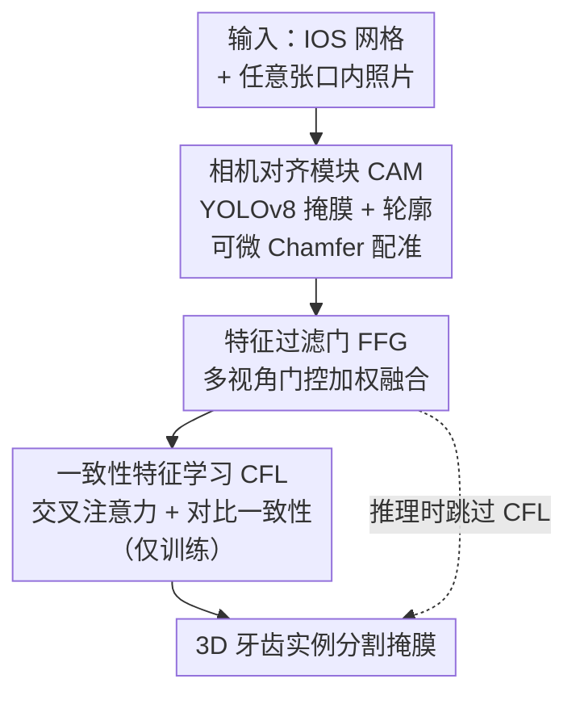

# Photo-Guided Tooth Segmentation on 3D Oral Scan Model

**会议**: CVPR 2026  
**论文**: [CVF Open Access](https://openaccess.thecvf.com/content/CVPR2026/html/Zhuang_Photo-Guided_Tooth_Segmentation_on_3D_Oral_Scan_Model_CVPR_2026_paper.html)  
**代码**: 待确认（论文称数据集将公开）  
**领域**: 3D视觉 / 分割 / 跨模态  
**关键词**: 牙齿分割, 口内扫描, 跨模态融合, 多视角, 对比学习

## 一句话总结
PMTSeg 第一次把口内照片当作"纹理外挂"喂给 3D 口内扫描（IOS）模型的牙齿分割网络——用可微相机对齐把照片对到 3D 网格上、用门控自适应融合任意张数照片、再用对比一致性把可见区域的语义"搬运"到不可见区域，在牙缝和牙龈交界这些纯几何最难啃的地方拿到 96.17 mIoU / 92.53 B-IoU 的新 SOTA。

## 研究背景与动机
**领域现状**：口内扫描（Intraoral Scan, IOS）模型上的牙齿分割已经相对成熟，主流是基于点云（PointNet++ 系）和基于网格（mesh-based）两类方法，它们都精心设计来榨干牙齿和牙弓的**几何特征**，做牙齿识别和实例分割。

**现有痛点**：问题出在 IOS 模型几乎都是"没颜色"的。一是很多诊所走"取模—石膏—3D 扫描"流程，扫出来本就是单色无纹理的表面；二是即使扫描仪带纹理，导出或格式转换时纹理也经常丢失。结果就是现有方法只能学几何信息，从来不考虑外观信息。可一旦碰到**牙缝紧贴的邻接触点（interproximal contacts）和牙龈交界（tooth-gingiva interface）**，局部形状线索很弱，几何上根本分不开——而这些边界在照片里其实一眼可辨。

**核心矛盾**：纯几何方法天生缺了"视觉提示"这一维信息；而口内照片恰恰高分辨率、富含颜色与阴影、临床上拿手机就能拍、还容易标注。两种模态信息是互补的，但此前没人把照片纹理真正"注入"3D 分割网络的学习过程里——已有的跨模态牙科工作（如把 IOS 牙冠和 CBCT 拼接、或用照片做正畸位移监测）都只做**几何层面的对齐**，没让不同模态的特征在学习中互相帮忙。

**本文目标**：把口内照片当外部引导，注入 IOS 分割骨干，且要支持**任意张数、任意视角**的照片输入。这要解决三个子问题：(1) 照片怎么准确对到 3D 模型上（无标定、视角光照不可控）；(2) 多张照片质量参差，怎么自适应挑有用的、压噪声的；(3) 照片只能拍到可见牙面，被遮挡/无纹理区域怎么也受益。

**核心 idea**：用"对齐 → 选择性融合 → 一致性迁移"三步，把 2D 照片的语义先验从可见点搬到不可见点，专治几何模糊处的分割。

## 方法详解

### 整体框架
PMTSeg 输入一个 IOS 网格模型 + 任意张数的口内照片，输出 IOS 上的牙齿实例分割掩膜。整条流水线分三步且层层依赖：先用**相机对齐模块 CAM** 估计每张照片的相机内外参，把 3D 点投影到 2D 像平面、建立"点—像素"对应；再用**特征过滤门 FFG** 把多视角 2D 特征自适应加权、融进 3D 表征；训练时再套上**一致性特征学习 CFL**，让网络学会纹理与几何之间的隐式对应，并把这种语义补偿能力泛化到照片拍不到的区域。3D 骨干用 PointNet++，2D 骨干用 UNet，照片侧的牙齿掩膜由预训练 YOLOv8 给出。

### 关键设计

**1. 相机对齐模块 CAM：用轮廓 Chamfer 损失把没标定的照片可微地对到 3D 网格上**

照片在不可控视角和光照下随手拍，直接和 3D 几何对齐很难，又没有显式 landmark。CAM 的巧思是**借双方的分割先验**来对齐：对每张照片 $I_i$ 先用预训练 YOLOv8 分出精确牙齿掩膜 $M_i^{2D}$，再提取掩膜边界和牙尖等尖角形成轮廓点集 $C_i$（语义上有意义的牙缘）；3D 模型 $M$ 也预处理出一个粗糙的牙—龈二值分割 $M_{3D}$，只让牙面顶点参与对齐，避开牙龈造成的歧义。给定 $N$ 张图和 3D 顶点 $\{P_j\}$，CAM 为每个视角估计内参 $K_i$ 和外参 $\{R_i, t_i\}$，用标准透视投影把 3D 点投到像平面 $\pi(K_i, R_i, t_i, P_j)$。对齐靠一个**可微 Chamfer 距离损失**，约束投影后的牙面点集 $P_i=\{(u_j^i, v_j^i)\}$ 与轮廓像素 $C_i$ 形状级对齐：

$$\mathcal{L}_{cam}^i = \frac{1}{|P_i|}\sum_{p\in P_i}\min_{c\in C_i}\|p-c\|_2^2 + \frac{1}{|C_i|}\sum_{c\in C_i}\min_{p\in P_i}\|c-p\|_2^2.$$

对 $\{K_i, R_i, t_i\}$ 优化这个损失，就能在没有显式标志点的情况下拿到稳定的几何信号，实现可微配准——这一步建立的"像素↔点"映射是后面所有特征传播的地基。

**2. 特征过滤门 FFG：用 sigmoid 门控自适应挑视角、按几何上下文加权融合任意张照片**

照片来自任意视角、光照和遮挡各不相同，把所有 2D 特征不加区分地堆进来会引入冗余甚至冲突信息。FFG 的做法是给每个 3D 点学一个**门控权重**：每张配准后的图过共享 2D 骨干得到稠密特征图 $f_{2d}^i$，借 CAM 的相机参数把 3D 点投到各图建立像素级对应；权重模块对每个可见点 $p$ 算

$$w_i(p) = \sigma\big(\text{MLP}([f_{2d}^i(p), f_{3d}(p)])\big),$$

$\sigma$ 是 sigmoid 把权重压到 $[0,1]$，反映该视角相对此处局部几何 $f_{3d}(p)$ 的置信度/相关性。最终融合特征是几何特征与归一化加权 2D 特征的拼接：

$$f'_{3d}(p) = \text{concat}\Big\{f_{3d}(p),\ \frac{w_i(p)}{\sum_{j=1}^N w_j(p)} f_{2d}^i(p)\Big\},$$

对于照片里看不到的不可见点 $\bar p$，对应的加权 2D 特征一律置 0。这个可学习的加权机制本质是一道注意力门，让网络动态强调最有用的视角、压住没对齐好的噪声，既支持任意张数输入，又只把"一致且有意义"的外观信息放进 3D 管线，专门改善邻牙区分和牙龈细边界。

**3. 一致性特征学习 CFL：用对比一致性把可见点的纹理语义"搬运"到不可见点**

FFG 只能增强照片拍得到的可见点，被遮挡/无纹理的不可见点 $\bar p$ 仍然吃不到照片的语义红利。CFL（仅训练时启用）用一套**师生对比**机制解决这个迁移问题。**教师分支**对每个可见点做交叉注意力，用图像语义增强几何特征：

$$f^t_{3d} = f_{3d} + \text{softmax}\Big(\frac{(W_q f_{3d})(W_k f_{2d})^\top}{\sqrt{d}}\Big)(W_v f_{2d}),$$

得到融合了几何与外观的纹理增强特征 $f^t_{3d}$。**学生分支**是一个可学习子网络 $S$，**只用 3D 信息**预测语义感知的几何特征 $f^s_{3d}=S(f'_{3d})$；训练时用对比损失把学生的 $f^s_{3d}$ 在可见点上对齐到教师的 $f^t_{3d}$：

$$\mathcal{L}_{con} = -\log\frac{\exp(\text{sim}(f^s_{3d}, f^t_{3d})/\tau)}{\sum_k \exp(\text{sim}(f^s_{3d}, f^t_{3d,k})/\tau)},$$

$\text{sim}$ 是余弦相似度，温度 $\tau=0.1$。这等于逼着子网络 $S$ 学会"在没有纹理输入时也把 2D 语义嵌进 3D 几何空间"。于是推理时 $S$ 能给被遮挡或无纹理的区域产出语义丰富的特征，让 3D 骨干间接享受 2D 监督——把照片引导从"局部可见增强"升级成"全局连贯的分割"，这正是 CFL 相比单纯 RPVNet 式融合的关键区别。

### 损失函数 / 训练策略
分割损失用交叉熵 + Dice：$\mathcal{L}_{seg}=\mathcal{L}_{ce}+\mathcal{L}_{dice}$。总目标在分割损失上加一致性项：$\mathcal{L}_{total}=\mathcal{L}_{seg}+\lambda_{con}\mathcal{L}_{con}$，其中 $\lambda_{con}=0.5$。训练用 Adam，学习率 $1\text{e}{-3}$，batch size 16，在 4×RTX 3090 上端到端训练约 2.5 天；CAM 里的 YOLOv8 在自建数据集上预训练。

## 实验关键数据

### 数据集与指标
作者自建了一个多模态牙科数据集（公开缺口所致）：620 名患者、上下颌共 1240 个样本，每名患者含正面、上颌、下颌三视角照片 + 上下颌网格，覆盖儿童到成人、男女各半，且含缺牙、拥挤、牙损、错位、过小牙、带正畸附件等大量异常情况，照片混用专业相机和手机拍摄。按患者级 8:2 划分训练/测试防泄漏。指标三件套：mIoU、DSC（Dice 相似系数）、B-IoU（边界 IoU，顶点 2mm 邻域内标签跨多类即判为边界点）。

### 主实验
与几何法（MeshSegNet、TSGCNet）、质心两阶段法（ATSL、DBGANet）、通用强骨干 PTv3、多视角渲染法 CrossTooth、以及自动驾驶跨模态法 RPVNet 对比，PMTSeg 三项指标全面最优：

| 方法 | mIoU | DSC | B-IoU |
|------|------|------|-------|
| MeshSegNet | 81.41 ± 7.7 | 89.48 ± 6.6 | 67.90 ± 7.5 |
| TSGCNet | 74.20 ± 4.8 | 85.09 ± 3.3 | 59.78 ± 5.4 |
| DBGANet | 92.81 ± 2.0 | 96.26 ± 1.1 | 86.12 ± 2.9 |
| PTv3 | 90.30 ± 3.8 | 94.86 ± 2.2 | 82.76 ± 4.5 |
| CrossTooth | 86.73 ± 10.1 | 92.49 ± 7.3 | 77.61 ± 9.7 |
| RPVNet | 92.99 ± 2.6 | 96.35 ± 1.4 | 86.87 ± 3.7 |
| ATSL（次优） | 95.28 ± 1.7 | 97.57 ± 0.9 | 90.53 ± 2.9 |
| **PMTSeg（本文）** | **96.17 ± 1.8** | **98.04 ± 1.0** | **92.53 ± 2.5** |

相比次优的 ATSL，整体提升约 +0.89 mIoU / +0.47 DSC，而**边界 B-IoU 领先 ATSL 超过 +2**，说明牙—牙、牙—龈边界刻画明显更锐更稳。值得注意的是 RPVNet 同样融合了图像，但缺 CFL 这类一致性机制，照片覆盖不到的附件/小牙区域仍然偏弱。

### 消融实验
两组消融（视角组合 + 模块）共表，"arch"=咬合面/上下牙弓照片，"front"=正面照，首行为纯几何无照片：

| FFG 照片输入 | CFL | mIoU | DSC | B-IoU |
|------|------|------|------|-------|
| 无（纯几何） | - | 81.94 | 89.92 | 78.45 |
| arch | - | 92.58 | 96.13 | 86.33 |
| arch + front | - | 93.82 | 96.78 | 88.81 |
| arch + front | ✓ | 96.17 | 98.04 | 92.53 |

### 关键发现
- **照片本身贡献最大**：仅加一张咬合面照片，mIoU/DSC/B-IoU 就分别跳升 10.64% / 6.21% / 7.88%（81.94→92.58 mIoU），证明照片语义在牙龈边界和紧贴触点这些几何弱对比区直接消歧。
- **多视角互补**：再加正面照，分割质量进一步提升（尤其前牙和牙龈缘），说明 FFG 确实在挑并融多视角互补信息，覆盖比任何单视角都更全。
- **CFL 专攻边界与不可见区**：在双视角融合基础上开启 CFL，mIoU/B-IoU 再涨 2.35% / 3.72%（边界增益最大），把可见区语义传到被遮挡/无纹理表面，牙齿轮廓更平滑连续——验证了"把照片引导变成全局一致分割"这一目标。
- **几何法在异常牙上崩**：MeshSegNet/TSGCNet 在拥挤、错位牙上方差大（标准差 7.7、9.7 量级），质心法 ATSL/DBGANet 一旦种子点放错就级联出错，PMTSeg 靠照片引导减少了对质心种子的依赖、也降低了对渲染质量的敏感。

## 亮点与洞察
- **把"丢失的纹理"当成可外挂的模态**：抓住了 IOS 临床落地的真实痛点——模型常是无色的，但照片手机就能拍。与其在几何上死磕，不如把易得的 2D 外观当外部引导，思路接地气且解决真问题。
- **CAM 用分割掩膜的轮廓做可微对齐**：不依赖人工 landmark，而是用 YOLOv8 牙掩膜的轮廓点 + Chamfer 损失做形状级配准，把"无标定 2D-3D 配准"这一难题变成可端到端优化的子模块，且只让牙面点参与、避开牙龈歧义，这个工程取舍很实用。
- **CFL 的师生对比是点睛之笔**：教师用照片增强可见点，学生只看几何却被逼着对齐教师特征，于是推理时不需要照片也能给不可见区造出语义特征。这种"用对比一致性把跨模态知识蒸馏进单模态分支"的范式可迁移到任何"训练有多模态、推理只有一模态"的场景（如 RGB-D 训练、深度缺失推理）。
- **支持任意张数/视角照片**：FFG 的归一化加权融合天然对输入张数不敏感，临床上有几张照片就用几张，部署灵活。

## 局限与展望
- **作者承认的局限**：照片的运动模糊或光学畸变若不做去模糊/标定，会同时损害 CAM 对齐和融合特征质量。
- **自建数据集尚未公开验证**：所有对比都在自采单一来源数据上做，缺公开 benchmark（如 Teeth3DS+）上的交叉验证，泛化性有待外部确认；YOLOv8 也在同一数据集预训练，存在分布耦合。
- **CFL 仅训练期生效，收益依赖照片覆盖**：不可见区的语义全靠训练时从可见区学到的先验外推，若某类结构（如埋伏牙、特殊附件）在照片里从未出现，迁移可能失效。
- **展望**：作者计划把 IOS 分割与 CBCT 等其他成像模态融合，引入牙根级上下文和体素先验。一个直接的改进是把 CAM 的相机估计与去模糊联合优化，提升真实手机照片下的鲁棒性。

## 相关工作与启发
- **vs 几何法（MeshSegNet / TSGCNet / PTv3）**：它们只吃网格几何，在牙缝和牙龈交界等弱形状对比处崩盘；本文额外注入照片外观，专补这些区域，边界 B-IoU 大幅领先。
- **vs 质心两阶段法（ATSL / DBGANet）**：先预测牙齿质心再精修边界，一旦拥挤/遮挡/扫描缺陷让种子点放错就级联出错；PMTSeg 靠照片语义降低对质心种子的依赖。
- **vs 多视角渲染法 CrossTooth**：同样想引入语义，但性能紧耦合渲染质量和网格保真度，拥挤错位的拓扑会污染渲染视角；本文直接对齐真实照片、且有 CFL 兜底不可见区。
- **vs 跨模态融合 RPVNet**：把图像和点云融在一起确实受益于互补外观，但缺一致性机制，照片覆盖不到的区域仍弱；CFL 正是补上这一环的关键差异。

## 评分
- 新颖性: ⭐⭐⭐⭐ 首次把口内照片纹理注入 3D IOS 牙齿分割的学习过程，CFL 的师生对比迁移是实打实的新设计。
- 实验充分度: ⭐⭐⭐⭐ 对比 7 个代表性方法 + 完整视角/模块消融，三指标自洽；扣分在仅自建单源数据、缺公开 benchmark 交叉验证。
- 写作质量: ⭐⭐⭐⭐ 动机—方法—实验逻辑清晰，公式与图表完整，三模块职责分明。
- 价值: ⭐⭐⭐⭐ 直击数字牙科 IOS 无纹理这一真实痛点，方法接地气、数据集承诺公开，对正畸/修复体设计有实际意义。

<!-- RELATED:START -->

## 相关论文

- [\[CVPR 2026\] Long-Tail Internet Photo Reconstruction](long-tail_internet_photo_reconstruction.md)
- [\[CVPR 2026\] Spatial Matters: Position-Guided 3D Referring Expression Segmentation](spatial_matters_position-guided_3d_referring_expression_segmentation.md)
- [\[CVPR 2026\] LangRef3DGS: Natural Language-Guided 3D Referential Segmentation from Partial Observations via 3D Gaussian Splatting](langref3dgs_natural_language-guided_3d_referential_segmentation_from_partial_obs.md)
- [\[CVPR 2026\] Unsupervised Multi-Scale Segmentation of 3D Subcellular World with Stable Diffusion Foundation Model](unsupervised_multi-scale_segmentation_of_3d_subcellular_world_with_stable_diffus.md)
- [\[CVPR 2026\] NG-GS: NeRF-Guided 3D Gaussian Splatting Segmentation](ng_gs_nerf_guided_3d_gaussian_splatting_segmentation.md)

<!-- RELATED:END -->
