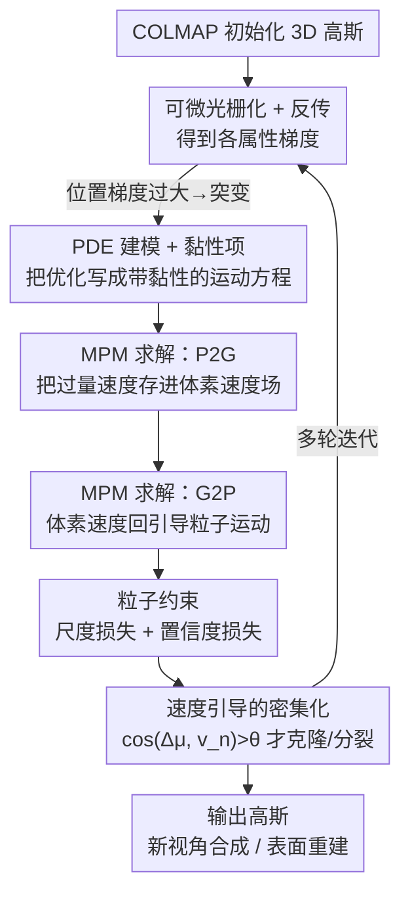

# Plug-and-Play PDE Optimization for 3D Gaussian Splatting: Toward High-Quality Rendering and Reconstruction

**会议**: CVPR 2026  
**论文**: [CVF Open Access](https://openaccess.thecvf.com/content/CVPR2026/html/Mo_Plug-and-Play_PDE_Optimization_for_3D_Gaussian_Splatting_Toward_High-Quality_Rendering_CVPR_2026_paper.html)  
**代码**: 无  
**领域**: 3D视觉  
**关键词**: 3D Gaussian Splatting, 偏微分方程优化, 物质点法(MPM), 新视角合成, 表面重建

## 一句话总结
作者把 3DGS 的优化过程在理论上重写成一个偏微分方程(PDE)，往里加一个"黏性项"压住小高斯的位置突变，再用物质点法(MPM)的 P2G/G2P 在体素速度场上数值求解，配合尺度/置信度约束和速度引导的密集化，做成一个即插即用组件 PDEO，挂在各种 3DGS 方法上就能同时提升渲染和表面重建质量、还更省显存。

## 研究背景与动机
**领域现状**：3DGS 用一堆各向异性的 3D 高斯显式表示场景，靠快速 splatting 实现实时高质量新视角合成，是 NeRF 之后最强的辐射场重建方案，也被 2DGS、RaDeGS、SuGaR 等扩展到表面重建。

**现有痛点**：在复杂场景里 3DGS 会出现模糊和漂浮物(floaters)。作者观察到：大高斯擅长填补空洞但表达不了高频细节，导致"过重建"和可见模糊；小高斯虽能抓高频细节，却容易在训练视角对不上的区域产生大量漂浮物。已有工作(AbsGS、Fregs)的对策是用更激进的密集化把大高斯拆成更多小高斯，但这等于用海量高斯去硬拟合场景，既不省存储也不利于渲染。

**核心矛盾**：作者通过梯度分析(Sec.3.2)找到了根因——当高斯尺度很小时，**位置梯度的量级显著大于其它属性(颜色/不透明度/尺度/旋转)的梯度**，即 $\frac{\partial L}{\partial \boldsymbol{\mu}_i}\gg\frac{\partial L}{\partial \mathbf{c}_i}\sim\frac{\partial L}{\partial o_i}\sim\frac{\partial L}{\partial \mathbf{s}_i}$。于是优化器倾向于猛挪小高斯的位置去拟合场景，反而压制了其它属性的优化，这种位置的突变最终堆出冗余、含糊的几何结构。已有的梯度稳定手段(梯度裁剪、归一化、权重衰减)都是启发式的，会不可避免地损失梯度信息。

**本文目标**：不靠裁剪/归一化这类有损手段，而是从优化过程的"动力学"层面让小高斯稳下来，同时保留原始梯度信息的完整性。

**切入角度**：作者把 3DGS 的逐步迭代优化类比成流体仿真——流体里粒子位置之所以稳定可控，是因为运动方程里有"黏性项"。如果能把 3DGS 优化写成 PDE，就能像改流体方程一样显式地往里加黏性项来抑制位置突变。

**核心 idea**：把 3DGS 优化过程建模成带黏性项的 PDE，用物质点法(MPM)数值求解，让小高斯的位置更新被邻域平均速度"拉平"，从而稳定优化、消除漂浮物。

## 方法详解

### 整体框架
PDEO(PDE-based Optimization)是一个挂在已有 3DGS 管线上的即插即用优化组件。输入是 COLMAP 初始化的 3D 高斯，输出是优化后的高斯集合(可直接用于新视角合成或抽 mesh 做表面重建)。整条管线在原有"可微光栅化 → 反传得到属性梯度"的基础上，把对高斯**位置**的更新拦下来重新处理：先把 3DGS 优化在理论上写成一个带黏性项的 PDE(4.1)，再用 MPM 的 P2G/G2P 在体素速度场上对这个 PDE 做数值求解(4.2)——P2G 把粒子的"过量速度"存进体素、G2P 再把体素速度释放回粒子去引导其运动；同时用尺度损失和置信度损失把高斯约束成"小尺度、高置信"的类粒子形态(4.3)，并用速度场指导密集化的克隆/分裂。

### 关键设计

**1. 把 3DGS 优化建模成带黏性项的 PDE：用流体黏性压住小高斯的位置突变**

痛点是小高斯位置梯度过大、一步挪太猛。作者先把高斯属性看成时间 $t$ 的函数，原始 3DGS 的位置更新 $\boldsymbol{\mu}_i^{t+1}=\boldsymbol{\mu}_i^{t}+\sigma\frac{\partial L^t}{\partial \boldsymbol{\mu}_i^t}$ 就定义出离散速度 $\boldsymbol{v}_i^t=\boldsymbol{\mu}_i^{t+1}-\boldsymbol{\mu}_i^t$；对时间再求导，得到 3DGS 优化的"运动方程"

$$\frac{d\boldsymbol{v}_i^t}{dt}=\frac{\partial \boldsymbol{v}_i^t}{\partial t}+\boldsymbol{v}_i^t\cdot\triangledown\boldsymbol{v}_i^t=\frac{\sigma^2}{2}\sum_{\gamma_i^t\in\Gamma_i^t}\triangledown\left(\frac{\partial L^t}{\partial \gamma_i^t}\right)^2$$

对比流体的 Navier-Stokes 方程，流体之所以稳定是因为多了黏性项 $\upsilon\triangledown\cdot\triangledown\boldsymbol{v}$，它给粒子一个朝"邻域平均速度"靠拢的加速度，相当于把单个粒子的速度和周围粒子的平均速度"混合"。作者照搬这一项，把运动方程改写成带 $(1-\lambda_g)\triangledown\cdot\triangledown\boldsymbol{v}_i^t$ 的形式，对应的离散位置更新变成

$$\boldsymbol{\mu}_i^{t+1}=\boldsymbol{\mu}_i^{t}+\sigma\frac{\partial L^t}{\partial \boldsymbol{\mu}_i^t}+\frac{1-\lambda_g}{|N_i|}\sum_{j\in N_i}(\boldsymbol{v}_j^t-\boldsymbol{v}_i^t)$$

即在原始梯度步之外，再加一个把自己速度往邻域 $N_i$ 平均速度拉的修正项。它为什么有效：黏性项不是去裁剪或截断梯度(那样会丢信息)，而是改"控制方程"本身——理论上当损失 $L\to0$ 时速度能量随 $t$ 平缓衰减到零，黏性不改变 $t\to\infty$ 的最终解，所以它只压住了过程中的抖动，保留了原始梯度信息的完整性。

**2. 用 MPM 的 P2G/G2P 在体素速度场上数值求解：把昂贵的邻域计算换成网格中转**

直接按上式对每个高斯算邻域 $N_i$ 的速度差，计算量很大。作者把 3D 高斯当作 MPM 里的"物质粒子"，把场景空间切成体素网格构建一个**速度场**，用 Particle-to-Grid(P2G)和 Grid-to-Particle(G2P)两步来近似黏性项。

P2G：把粒子的"过量速度"$\triangle\boldsymbol{\mu}_i^t$(就是位置梯度)按体素聚合存进体素 $V_n$ 的速度里，

$$\boldsymbol{v}_n^{t+1}=\lambda_g\boldsymbol{v}_n^t+\frac{1-\lambda_g}{|R_n^t|}\sum_{g_i\in R_n^t}\triangle\boldsymbol{\mu}_i^t$$

其中 $R_n^t$ 是落在体素 $V_n$ 内的粒子集合。这一步相当于"先把粒子想冲出去的速度收一部分存到网格里"，衰减掉容易引发突变的过量位移。

G2P：再把体素速度作为该格内粒子运动的平均趋势，反过来指导每个粒子，

$$\triangle\hat{\boldsymbol{\mu}}_i^t=\lambda_p\triangle\boldsymbol{\mu}_i^t+(1-\lambda_p)\boldsymbol{v}_n^t,\quad \boldsymbol{\mu}_i^{t+1}=\boldsymbol{\mu}_i^t+\triangle\hat{\boldsymbol{\mu}}_i^t$$

$\lambda_p$ 抑制粒子自身的瞬时速度、$(1-\lambda_p)$ 引入网格速度引导。一存一放之后，同一体素内不同方向的突变会相互抵消，粒子又拿到了一致的运动指引，黏性项就被等效地实现进了优化过程。作者还在补充材料中说明 $\lambda_g$ 的取值不改变总梯度，所以这套做法是在不损失梯度信息的前提下稳住位置更新。

**3. 粒子约束：尺度损失 + 置信度损失，把高斯逼成"小而实"的真粒子**

PDE/MPM 的前提是粒子无尺度、且是实心的，而高斯既有尺度又可能半透明，与粒子假设冲突，所以要加两个约束把高斯往"粒子"上靠。

尺度损失惩罚过大的高斯尺度：$L_s=\frac{1}{|G_k|}\sum_{g_i\in G_k}\max(s^*-\beta,0)$，其中 $s^*$ 是高斯 $g_i$ 的最大尺度、$\beta$ 是裕度、$G_k$ 是视角 $k$ 下可见的高斯集合。把大尺度压下去，逼出小尺度高斯来抓高频细节。置信度损失则把不透明度往"非半透明"两端推：$L_t=\frac{1}{|G_k|}\sum |o_i-\lfloor 1.99\,o_i\rfloor|_2^2$(⚠️ 原文该式写法略乱，以原文为准)，$\lfloor 1.99\,o_i\rfloor$ 在 $o_i$ 偏大时取 1、偏小时取 0，等于把不透明度往 0/1 拉，逼出"高置信、不半透明"的实心粒子。两者合起来满足粒子假设：小尺度保证细节、高置信去掉模糊半透明体。

**4. 速度引导的高斯密集化：用粒子速度和体素速度的夹角决定克隆/分裂**

原始 3DGS 靠视空间位置梯度的平均值判断是否密集化，但在 PDE 视角下这个信号不一定对。作者改用速度场来指导密集化：计算粒子速度 $\triangle\boldsymbol{\mu}_i$ 与所在体素速度 $\boldsymbol{v}_n$ 的余弦相似度，只有当 $\cos(\triangle\boldsymbol{\mu}_i,\boldsymbol{v}_n)>\theta_p$ 时才对高斯 $g_i$ 执行克隆/分裂。直觉是：当一个粒子的运动方向和它周围的平均运动趋势一致时，说明这里确实需要更多高斯去覆盖、密集化才靠谱；方向打架的地方多半是抖动，不该盲目加高斯。这让密集化更精准，也是它能在显著省显存的同时还提质量的原因之一。

### 损失函数 / 训练策略
总损失在原方法渲染损失基础上加上两个粒子约束项，形式约为 $L=L_{\text{render}}+\omega_s L_s+\omega_t L_t$(⚠️ 组合权重由超参 $\omega_s,\omega_t$ 给出，具体写法以原文为准)。关键超参：$\lambda_g=0.8$、$\lambda_p=0.8$、$\psi=0.2$、$\theta_p=120^\circ$、$\beta=0.6$、$\omega_t=\omega_s=0.04$，$\tau$ 随迭代从 1 渐增到 2.5。MPM 用自研 CUDA 后端，初始 $64\times64\times64$ 体素网格、训练中自适应合并网格单元；所有实验在单张 V100 上完成。评估时各 baseline 用其默认参数以保证一致比较。

## 实验关键数据

### 主实验
新视角合成在 Mip-NeRF360(6 场景)、Tanks&Temples(7 场景)、ScanNet++(4 场景)上评测；表面重建在 DTU(15 场景)和 Tanks&Temples(7 场景)上评测。PDEO 以即插即用方式挂到多种 3DGS 方法上，几乎一致地提升质量并降低显存(Mem)、提高 FPS。

| 数据集 | 指标 | 基础方法 | +PDEO | 说明 |
|--------|------|---------|-------|------|
| Mip-NeRF360 | PSNR↑ | SpecGS 27.96 | SpecGS+PDEO **28.81** | 最佳组合，且 Mem 1147→99.6 |
| Tanks&Temples | PSNR↑ | MCMC 21.03 | MCMC+PDEO **22.77** | +1.74，Mem 691→210 |
| Mip-NeRF360 | FPS↑ | 3DGS 163.1 | 3DGS+PDEO 225.5 | 渲染更快、Mem 295→186 |
| Tanks&Temples | FPS↑ | GES 64.1 | GES+PDEO 176.0 | 显存近乎减半 |

表面重建(DTU，Chamfer Distance↓，越小越好；括号为相对原方法变化)：

| 方法 | CD Mean↓ |
|------|----------|
| RaDeGS | 0.70 |
| 3DGS+PDEO | 1.34 (-0.22) |
| 2DGS+PDEO | 0.82 (-0.08) |
| RaDeGS+PDEO | **0.68** (-0.02) |

Tanks&Temples 表面重建(F1↑)：RaDeGS 0.316 → RaDeGS+PDEO **0.445**，MILO 0.397 → MILO+PDEO **0.475**，均为各自最优。

### 消融实验
在 Mip-NeRF360、以 GES 为 baseline：

| 配置 | PSNR↑ | SSIM↑ | LPIPS↓ | Mem↓ | 说明 |
|------|-------|-------|--------|------|------|
| Baseline (GES) | 27.71 | 0.844 | 0.224 | 369 | 原方法 |
| w/o P2G and G2P | 27.51 | 0.830 | 0.227 | 240 | 去掉黏性求解，质量明显下降 |
| w/o Our Densification | 27.96 | 0.834 | 0.230 | 136 | 去掉速度引导密集化 |
| w/o Scale Loss | 27.75 | 0.831 | 0.236 | 132 | 去掉尺度约束 |
| w/o Confidence Loss | 27.87 | 0.845 | 0.219 | 177 | 去掉置信度约束 |
| Full | 27.99 | 0.834 | 0.232 | 133 | 完整模型，显存 369→133 |

超参敏感性：$\lambda_g$ 从 0.5/0.9、$\lambda_p$ 从 0.5/0.9 偏离 0.8 后 PSNR 都有下降(如 Full(λp=0.9) 27.56)，说明黏性/抑制系数取 0.8 附近是较优平衡。

### 关键发现
- **P2G/G2P(黏性项)是稳定性的核心**：去掉后 PSNR 从 27.99 掉到 27.51、SSIM 也明显下降，图 6 显示漂浮物和伪影重新出现——它就是把"小高斯位置突变"压下去的那一步。
- **省显存是显著副产物**：完整模型显存只有 baseline 的约 1/3(369→133)，且 FPS 普遍提升，说明它不是靠堆更多高斯换质量，而是优化更稳→几何更干净→高斯更少。
- **置信度损失对 PSNR 帮助相对小**(去掉后 27.87，仍接近 Full)，但配合尺度损失能把高斯逼成符合粒子假设的形态，对去半透明模糊有作用。

## 亮点与洞察
- **把优化器当成动力学系统来改**：不是在梯度数值上做裁剪/归一化(有损)，而是把整个 3DGS 优化重写成 PDE，再像改流体方程一样加黏性项——这是个很漂亮的视角转换，理论上还证明了黏性不改变最终收敛解。
- **借 MPM 把"邻域平均"做成 O(网格)的体素中转**：P2G 存、G2P 放，用一个速度场把昂贵的逐高斯邻域计算摊到网格上，工程上让黏性项可落地。
- **梯度分析直击根因**：先用 $\frac{\partial L}{\partial\boldsymbol{\mu}}\gg$ 其它梯度这个观察把"漂浮物/模糊"归因到"小高斯位置梯度过大"，整套方法都顺着这个根因长出来，逻辑闭环。
- **真·即插即用**：在 3DGS/GES/MipGS/2DGS/RaDeGS/MCMC/SpecGS/PGSR/MILO 等一票方法上都能挂、都涨点，迁移性强；这套"把迭代优化建模成 PDE 加黏性"的思路也可能迁到别的点云/粒子式表示的训练里。

## 局限与展望
- 引入 MPM 体素网格和 P2G/G2P 中转会带来额外的实现复杂度和自研 CUDA 后端依赖，对复现不太友好；论文也未公开代码。
- 多个超参($\lambda_g,\lambda_p,\theta_p,\beta,\omega_s,\omega_t,\tau$)需要设定，消融显示对 $\lambda_g/\lambda_p$ 有一定敏感性，跨数据集是否仍用同一组默认值能稳住质量值得观察。
- 表面重建上某些组合(如 3DGS+PDEO 在 DTU 的 CD 仍达 1.34)绝对精度并不突出，PDEO 更像是"普涨"而非把弱 baseline 拉到 SOTA；最好的几何仍来自本就强的 RaDeGS/MILO 打底。
- 黏性项把粒子往邻域平均拉，理论上可能在真实存在尖锐不连续几何的地方过度平滑，论文未深入讨论这种 trade-off。

## 相关工作与启发
- **vs AbsGS / Fregs(密集化路线)**：它们靠更激进的密集化把大高斯拆成海量小高斯来抗模糊，代价是存储和渲染开销大；本文不增反减(显存降到 1/3)，从优化稳定性入手而非用数量硬堆。
- **vs 梯度裁剪 / BN / 权重衰减(梯度稳定路线)**：这些都是启发式、会损失原始梯度信息；本文改的是控制方程(PDE)本身，黏性项只压抖动、保留梯度完整性，理论上不改变最终解。
- **vs 2DGS / RaDeGS / SuGaR(几何约束路线)**：它们靠显式几何/形状约束抽 mesh；PDEO 不加显式几何约束，而是通过更稳的优化消除冗余含糊结构，且能直接挂在这些方法之上进一步提质。

## 评分
- 新颖性: ⭐⭐⭐⭐⭐ 把 3DGS 优化建模成带黏性项的 PDE 并用 MPM 求解，是相当原创且自洽的视角。
- 实验充分度: ⭐⭐⭐⭐ 覆盖新视角合成+表面重建、多 baseline、多数据集、含超参敏感性，但代码未放、个别重建绝对精度一般。
- 写作质量: ⭐⭐⭐⭐ 动机—理论—方法链条清楚，公式 OCR 有少量瑕疵但可读。
- 价值: ⭐⭐⭐⭐⭐ 即插即用、普遍涨点且大幅省显存，对 3DGS 社区实用价值高。

<!-- RELATED:START -->

## 相关论文

- [\[CVPR 2026\] 3D Gaussian Splatting with Self-Constrained Priors for High Fidelity Surface Reconstruction](3d_gaussian_splatting_with_self-constrained_priors_for_high_fidelity_surface_rec.md)
- [\[CVPR 2026\] STAC: Plug-and-Play Spatio-Temporal Aware Cache Compression for Streaming 3D Reconstruction](stac_plug-and-play_spatio-temporal_aware_cache_compression_for_streaming_3d_reco.md)
- [\[CVPR 2026\] Depth Peeling for High-Fidelity Gaussian-Enhanced Surfel Rendering](depth_peeling_for_high-fidelity_gaussian-enhanced_surfel_rendering.md)
- [\[CVPR 2025\] Evolving High-Quality Rendering and Reconstruction in a Unified Framework with Contribution-Adaptive Regularization](../../CVPR2025/3d_vision/evolving_high-quality_rendering_and_reconstruction_in_a_unified_framework_with_c.md)
- [\[CVPR 2026\] Prune Wisely, Reconstruct Sharply: Compact 3D Gaussian Splatting via Adaptive Pruning and Difference-of-Gaussian Primitives](prune_wisely_reconstruct_sharply_compact_3d_gaussian_splatting_via_adaptive_prun.md)

<!-- RELATED:END -->
