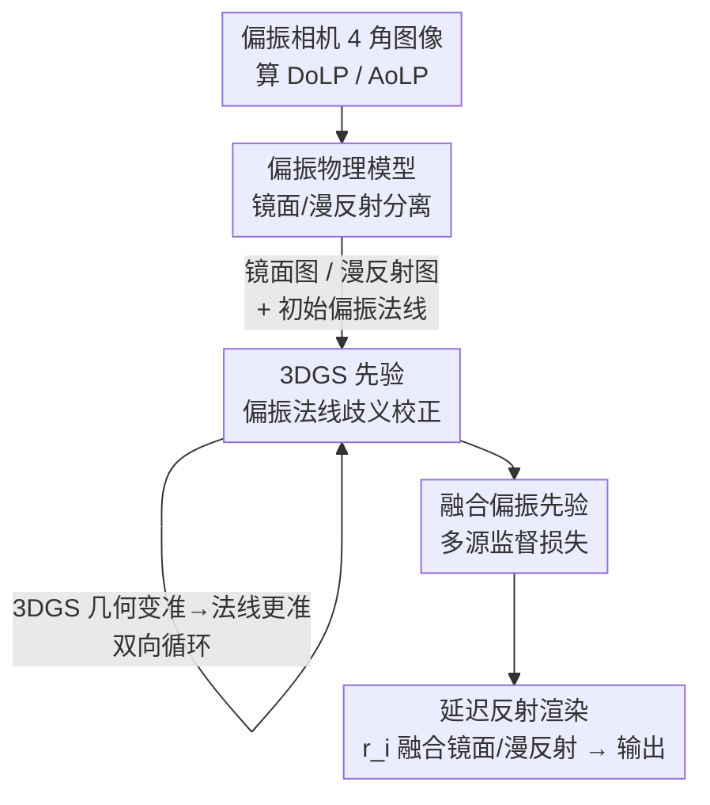

# PolarGuide-GSDR: 3D Gaussian Splatting Driven by Polarization Priors and Deferred Reflection for Real-World Reflective Scenes

**会议**: CVPR 2026  
**论文**: [CVF Open Access](https://openaccess.thecvf.com/content/CVPR2026/html/Shan_PolarGuide-GSDR_3D_Gaussian_Splatting_Driven_by_Polarization_Priors_and_Deferred_CVPR_2026_paper.html)  
**代码**: 待确认  
**领域**: 3D视觉  
**关键词**: 3D高斯泼溅、偏振成像、镜面反射重建、延迟着色、法线估计

## 一句话总结
PolarGuide-GSDR 把偏振成像的物理先验首次嵌入到 3D 高斯泼溅（3DGS）的延迟反射优化中：先用偏振物理模型把镜面/漫反射分离开，再用 3DGS 的几何先验去纠正偏振法线固有的方向歧义，最后用「分离后的镜面图 + 漫反射图 + 去歧义法线 + RGB」多源监督高斯渲染，在真实复杂反射场景下同时拿到更高的重建质量、更准的法线和实时帧率。

## 研究背景与动机
**领域现状**：多视图三维重建里，NeRF 用隐式辐射场带来了高质量新视角合成，3DGS 则用稀疏的 3D 高斯基元显式建模场景，在保持高质量渲染的同时大幅加速训练、做到实时新视角合成，缓解了 NeRF 训练慢、渲染低效的瓶颈。但在镜面反射场景上，两类方法都不好用。

**现有痛点**：偏振辅助的 NeRF（如 PANDORA、NeRSP、GNeRP、NeISF）通过逆渲染估计法线与材质，但普遍依赖物体掩膜、训练成本高、只能在理想室内环境验证，难以扩展到大场景或真实复杂场景；而 3DGS 虽然用球谐函数（SH）建模视角相关颜色，但低阶 SH 的方向频率不足以表达镜面高光的高频细节，训练时模型倾向用「虚构的高斯基元」去拟合高光，反而破坏几何，尤其在非平面表面上。即使是 3DGS-DR（延迟着色）、Ref-GS（方向编码）这类改进，仅靠 RGB 监督仍然受困于镜面反射的方向敏感性和反射-几何纠缠。

**核心矛盾**：镜面反射与几何/光照高度纠缠，只用 RGB 像素监督无法把「这是反射」和「这是真实表面结构」解耦，导致几何被高光污染。而偏振图像天然携带与表面法线、材质反射率强相关的物理线索，理应能帮上忙——问题在于现有偏振方案要么走 NeRF 逆渲染（成本高、依赖掩膜），要么走纯偏振静态几何去歧义（精度有限、误差会累积传播）。

**本文目标**：在不依赖强材质/视角假设、不要掩膜的前提下，把偏振先验注入 3DGS，让它既能实时渲染，又能在镜面和漫反射区域都拿到高保真的几何与反射细节。

**切入角度**：偏振成像可同时捕获强度、颜色和偏振方向，作者据此把「反射分离」「法线先验」这两件偏振最擅长的事拿出来作为监督信号；同时利用 3DGS 收敛过程中逐渐变好的几何，去反向修正偏振法线本身的方向歧义——两者互为先验、循环迭代。

**核心 idea**：用偏振物理模型分离镜面/漫反射并给出初始法线，再用 3DGS 几何先验消解偏振法线的 $\pi$ 与 $\pi/2$ 歧义，构成「偏振 ↔ 3DGS」双向耦合的循环优化，最终多源监督延迟反射渲染。

## 方法详解

### 整体框架
PolarGuide-GSDR 由三个紧耦合模块组成，输入是偏振相机在 4 个偏振角 $(0, \pi/4, \pi/2, 3\pi/4)$ 下拍的图像，输出是一个能实时渲染、且在反射区域几何与外观都更准的高斯场景。

整条流水线是这样转的：先从四通道偏振图算出 DoLP（线偏振度）和 AoLP（线偏振角）；第一个模块用偏振物理模型把图像级的镜面反射图 $I_{sp}$、漫反射图 $I_{dp}$ 分离出来，并由 DoLP/AoLP 估出初始偏振法线 $n_{pol}$；但这个初始法线带有固有的 $\pi$、$\pi/2$ 方向歧义，于是第二个模块用一个预训练 3DGS 的粗几何先验去构造候选法线集、按余弦相似度挑出最一致的方向，并用 DoLP 阈值只在偏振可靠的区域做监督——更关键的是，随着 3DGS 几何在训练中变好，去歧义会越来越准，反过来又把更准的法线喂回 3DGS，形成双向循环；第三个模块在 3DGS-DR 的延迟反射框架上，把「镜面图 + 漫反射图 + 去歧义法线 + RGB」组合成四项联合损失，去监督高斯渲染，最后由每个高斯的镜面反射强度标量 $r_i$ 融合镜面/漫反射两路输出，合成最终图像。注意偏振线索只在训练时作监督，推理阶段不需要偏振输入。

### 关键设计

**1. 偏振物理模型分离镜面与漫反射：用 Stokes 向量在图像级把反射拆开，给 3DGS 提供物理一致的监督先验**

3DGS 缺少光照建模和反射分离机制，无法准确还原镜面/漫反射在真实场景里的空间分布；而偏振辅助 NeRF 靠视角相关查询做逆渲染，3DGS 又没有显式的视角查询机制。作者绕开逆渲染，直接在图像级用偏振物理模型做分离。表面反射光由偏振 BRDF 支配，可分解为偏振镜面反射、偏振漫反射、非偏振漫反射三部分；后者在真实场景里基本可忽略，故只建模镜面分量 $S_{sp}$ 和漫反射分量 $S_{dp}$（分别对应 Fresnel 反射与次表面散射）。由四个偏振角图像 $I_{0^\circ}, I_{45^\circ}, I_{90^\circ}, I_{135^\circ}$ 算出 Stokes 向量分量 $S_0 = 0.5\,(I_{0^\circ}+I_{45^\circ}+I_{90^\circ}+I_{135^\circ})$、$S_1 = I_{0^\circ}-I_{90^\circ}$、$S_2 = I_{45^\circ}-I_{135^\circ}$，进而得到线偏振度

$$\text{DoLP} = \frac{\sqrt{S_1^2 + S_2^2}}{S_0}.$$

镜面反射图按偏振角随 $\cos(2\theta)$ 调制：$I_{sp}(\phi_{pol}) = \frac{I_{sp}^{\max}+I_{sp}^{\min}}{2} + \frac{I_{sp}^{\max}-I_{sp}^{\min}}{2}\cos(2\theta)$，漫反射图则相位相差 $\pi/2$。为了高效，作者假设 $S_d \approx S_i - S_{sp}$ 作为分离初值，近似误差留到后续强度图融合阶段补偿。这一步的价值在于：它把「哪里是反射、哪里是真实表面色」用物理量直接分开，而不是让 3DGS 在 RGB 上瞎猜，从源头上减少了用虚构高斯拟合高光的倾向（公式推导细节作者放在补充材料，⚠️ 以原文为准）。

**2. 基于 3DGS 先验的偏振法线歧义校正：用几何先验 + DoLP 阈值筛选，把偏振 ↔ 3DGS 拧成双向循环**

偏振法线有个绕不开的固有问题：AoLP 与法线方位角之间存在周期关系，必然带来 $\pi$ 和 $\pi/2$ 两类方向歧义；而且 DoLP 低的区域偏振特性弱、法线估计很不可靠，加上镜面分量本身没被剔除，Eq.(6) 算出的法线还会被高光污染。作者的解法分两手：一是用 AoLP 得方位角 $\sigma = \frac{1}{2}\,\text{atan2}(S_2, S_1)$、由 DoLP 与折射率得入射角 $i$，组装出偏振法线 $n_{pol} = (\sin i\cos\sigma,\ \sin i\sin\sigma,\ \cos i)$，再构造候选集 $C = \{n_{pol}, -n_{pol}, R_{\pi/2}(n_{pol}), -R_{\pi/2}(n_{pol})\}$（$R_{\pi/2}$ 是绕 $z$ 轴转 $90^\circ$），用 3DGS 的粗几何先验按余弦相似度从中挑出方向最一致的那个，从而消歧；二是引入阈值 $\tau$，只在 DoLP $> \tau$ 的高可靠区域才用偏振法线做监督，避免低 DoLP 区拖累训练。

真正的巧思在于「双向循环」：只用一个粗几何先验（如 3k 次迭代的 3DGS）去校正，在挡风玻璃这类区域仍有明显错误；但随着训练推进，3DGS 几何越来越准，去歧义随之更准，更准的法线又反过来监督 3DGS——即使初始校正是错的，这个循环也能逐步把 $\pi$、$\pi/2$ 歧义纠正过来，避免了纯静态去歧义的误差累积与传播。这就把偏振和 3DGS 从「单向喂先验」变成了「互相纠错」。

**3. 融合偏振先验的多源监督损失：在延迟反射框架上用四项损失约束镜面、漫反射与法线**

渲染管线建在 3DGS-DR 之上：延迟着色把渲染拆成两路——高斯泼溅路负责基础空间分布和粗颜色，延迟反射路负责镜面反射效果，两路通过每个高斯的镜面反射强度标量 $r_i$ 融合成最终图。但 3DGS-DR 缺少对镜面、漫反射、法线的物理先验约束，建模反射场时容易长出虚假结构、产生不真实的反射。作者用模块 1、2 得到的偏振先验，给这三者都加上物理一致的监督，构造四项损失：图像重建损失 $L_{rgb}$（$L_1$ + D-SSIM，监督融合后最终图与 GT）、镜面监督损失 $L_{refl}$（渲染镜面图对齐 $I_{sp}$）、漫反射监督损失 $L_{base}$（渲染漫反射图对齐 $I_{dp}$）、法线监督损失 $L_{normal}$。

法线损失是带 DoLP 掩膜和候选集的：$L_{normal} = \frac{1}{N}\sum 1_{\text{DoLP}>\tau}\cdot \min_{c\in C}\,[1 - \cos(n_{pred}, c)]$，即只在高 DoLP 区、且对候选集 $C$ 取「与预测法线最接近的那个候选」的余弦距离作监督——这样既绕开了歧义（让网络往最近的合理方向收敛），又屏蔽了不可靠区域。总损失 $L_{total} = \eta_{rgb}L_{rgb} + \eta_{refl}L_{refl} + \eta_{base}L_{base} + \eta_{normal}L_{normal}$，各权重 $\lambda, \eta$ 由实验调出以平衡画质、镜面/漫反射精度与几何一致性。消融显示镜面图监督能压住高光导致的法线误差、法线监督又帮忙定位和重建高光结构，二者强互补、缺一不可。

## 实验关键数据

### 主实验
在 5 个真实室内/外场景上，与偏振+NeRF 的 GNeRP、以及高斯系的 3DGS、3DGS-DR、Ref-GS 在相同数据和训练设置下对比。下表为 PSNR↑（粗体场景为本文自采集数据集，富含反射内容）：

| 场景 | GNeRP | 3DGS | 3DGS-DR | Ref-GS | 本文 |
|------|-------|------|---------|--------|------|
| Gnome（室内） | 17.65 | 19.37 | 21.13 | 21.65 | **22.54** |
| Gundam（室内） | 15.42 | 22.78 | 22.93 | 22.85 | **23.32** |
| Automotive&Glass（室外） | 13.20 | 18.21 | 18.31 | 17.78 | **19.29** |
| Black ceramic cup（室内） | 15.77 | 25.18 | 25.57 | 26.48 | **26.67** |
| Stagnant water（室外） | 17.55 | 22.65 | 23.00 | 23.01 | **23.51** |

本文在全部 5 个场景的 PSNR 上均最优：在反射内容丰富的 Gnome、Automotive&Glass、Black ceramic cup 上提升约 1 dB，在视角稀疏/反射弱的 Gundam 和反射区有限的 Stagnant water 上提升约 0.5 dB。SSIM/LPIPS 大多也领先（如 Gnome SSIM 0.890、LPIPS 0.216 均为最佳）。作者强调由于方法专攻反射区，整体 PSNR 不是唯一指标，恢复反射细节更关键。

渲染效率方面（FPS↑），本文虽因延迟反射比裸 3DGS（约 180–280 FPS）慢，但仍保持实时：

| 场景 | 3DGS-DR | Ref-GS | 本文 |
|------|---------|--------|------|
| Gnome | 53.73 | 50.21 | 43.57 |
| Gundam | 71.69 | 24.48 | 64.86 |
| Automotive&Glass | 118.30 | 43.23 | 104.63 |
| Black ceramic cup | 108.83 | 36.70 | 81.52 |
| Stagnant water | 102.02 | 23.43 | 95.30 |

本文帧率与 3DGS-DR 相当，且普遍显著高于 Ref-GS，保住了实时渲染能力。

### 消融实验
表 2 验证「镜面图监督」与「偏振法线监督」的互补性（PSNR↑）。`Ours only PolarNormal` 只留法线监督、`Ours w/o PolarNormal` 去掉法线监督，二者都只有单支监督：

| 场景 | 3DGS-DR（基线） | only PolarNormal | w/o PolarNormal | PolarGuide-GSDR |
|------|----------------|------------------|-----------------|-----------------|
| Gnome | 21.13 | 19.687 | 19.26 | **22.54** |
| Gundam | 22.93 | 22.97 | 22.93 | **23.32** |
| Automotive&Glass | 18.31 | 17.84 | 18.74 | **19.27** |
| Black ceramic cup | 25.57 | 24.98 | 25.20 | **26.67** |
| Stagnant water | 23.00 | 22.61 | 22.67 | **23.32** |

### 关键发现
- **双支监督缺一不可**：只保留单支监督时整体性能下降，某些场景（如 Gnome、Automotive&Glass 的单支配置）甚至跌破无偏振信息的 3DGS-DR 基线；只有镜面图 + 法线联合监督才能拿到全场景最优，印证两者强互补。
- **提升幅度与反射丰富度正相关**：反射内容多的场景（Automotive&Glass、Black ceramic cup）增益最大（约 1 dB），而 Gnome（稀疏视角、弱光、少反射）的 PSNR 提升主要来自伪影减少，Gundam/Stagnant water 因反射区有限增益约 0.5 dB。
- **法线质量优势明显**：3DGS-DR 缺显式法线监督，表面噪声大、结构混乱；Ref-GS 尚可但平滑性不足；本文靠偏振法线先验 + 镜面监督 + DoLP 掩膜，得到更平滑准确的法线。
- ⚠️ 消融表（表 2）中 Automotive&Glass 的完整模型 PSNR 为 19.27、Stagnant water 为 23.32，与主表（表 1）的 19.29、23.51 略有出入，以原文为准。

## 亮点与洞察
- **首次把偏振先验嵌入 3DGS 优化**：之前偏振只在 NeRF 里被用，本文是第一个在 3DGS 延迟反射里用偏振做反射分离 + 法线监督的工作，兼顾了可解释性和实时性。
- **「双向循环」化解了去歧义的鸡生蛋问题**：偏振法线需要好几何来去歧义，而好几何又需要好法线监督——作者让两者在训练中互相纠错、逐步收敛，绕开了纯静态去歧义的误差累积，这个思路可迁移到任何「先验有歧义、但下游优化能反哺校正」的场景。
- **图像级物理分离当监督，而非逆渲染**：不走 NeRF 那套昂贵的逆渲染、也不要掩膜，直接用 Stokes 物理模型在图像级分镜面/漫反射当先验，工程上更轻、更易扩展到真实大场景。
- **构建首个全场景多视图偏振数据集**：针对现有偏振数据集视角稀疏、反射信息有限的问题，作者采集了覆盖复杂室内外（强镜面汽车玻璃、黑陶瓷杯、室外积水）的多视图偏振数据集，是有价值的社区资产。

## 局限与展望
- **固定折射率假设**：对非导电材料假设折射率固定为 1.5，虽然作者称多源约束让方法对导电材料（如汽车表面）也有不错泛化，但折射率失配在更广材质上可能引入偏差。
- **依赖偏振相机采集**：训练需要四角偏振图像，虽然推理不需偏振、且偏振相机日益普及，但相比纯 RGB 方案仍多了采集门槛。
- **弱反射/稀疏视角场景增益有限**：在 Gnome、Gundam、Stagnant water 这类反射弱或视角稀疏的场景，PSNR 提升只有约 0.5 dB，方法的优势高度集中在富反射场景。
- **依赖预训练 3DGS 几何作为先验起点**：去歧义循环以一个粗几何（如 3k 迭代 3DGS）为引子，若初始几何在大面积区域就严重失败（如 COLMAP 初始化差），循环能否拉回值得进一步验证。

## 相关工作与启发
- **vs 偏振+NeRF（PANDORA / NeRSP / GNeRP / NeISF）**：它们走神经逆渲染估法线与材质，依赖掩膜、训练慢、多在理想室内验证；本文用 3DGS 显式表示 + 图像级物理分离，不要掩膜、保实时、能上真实复杂场景。
- **vs 3DGS-DR**：本文以 3DGS-DR 的延迟反射框架为底座，但 3DGS-DR 只靠 RGB 监督、缺物理先验，容易长虚假反射结构；本文加了镜面/漫反射/法线三路偏振监督，反射分离与几何都更准。
- **vs Ref-GS**：Ref-GS 在 3DGS-DR 上加方向编码和光照分解来增强反射，但仍只有 RGB 监督、帧率掉得厉害；本文用物理偏振先验当监督，质量更高且帧率显著优于 Ref-GS。
- **vs 纯偏振静态去歧义方案**：纯偏振静态几何去歧义精度有限、误差会累积传播；本文用 3DGS 几何动态、循环地修正偏振法线歧义，从根上缓解了累积误差。

## 评分
- 新颖性: ⭐⭐⭐⭐⭐ 首次将偏振先验嵌入 3DGS 延迟反射，并设计偏振↔3DGS 双向循环去歧义，切入角度新。
- 实验充分度: ⭐⭐⭐⭐ 5 个真实场景 + 消融较扎实，但主要靠 PSNR/SSIM/LPIPS，且实现细节与部分推导推到补充材料。
- 写作质量: ⭐⭐⭐⭐ 动机和三模块逻辑清晰，公式完整；个别表内数字有小出入。
- 价值: ⭐⭐⭐⭐ 实时 + 高保真反射重建对真实场景实用，且贡献了首个全场景多视图偏振数据集。

<!-- RELATED:START -->

## 相关论文

- [\[CVPR 2026\] ICTPolarReal: A Polarized Reflection and Material Dataset of Real World Objects](ictpolarreal_a_polarized_reflection_and_material_dataset_of_real_world_objects.md)
- [\[CVPR 2026\] RT-Splatting: Joint Reflection-Transmission Modeling with Gaussian Splatting](rt-splatting_joint_reflection-transmission_modeling_with_gaussian_splatting.md)
- [\[CVPR 2026\] SketchFaceGS: Real-Time Sketch-Driven Face Editing and Generation with Gaussian Splatting](sketchfacegs_real-time_sketch-driven_face_editing_and_generation_with_gaussian_s.md)
- [\[CVPR 2026\] Iris: Bringing Real-World Priors into Diffusion Model for Monocular Depth Estimation](iris_bringing_realworld_priors_into_diffusion_model_for_monocular_depth_estimation.md)
- [\[CVPR 2026\] Uncertainty-driven 3D Gaussian Splatting Active Mapping via Anisotropic Visibility Field](uncertainty-driven_3d_gaussian_splatting_active_mapping_via_anisotropic_visibili.md)

<!-- RELATED:END -->
