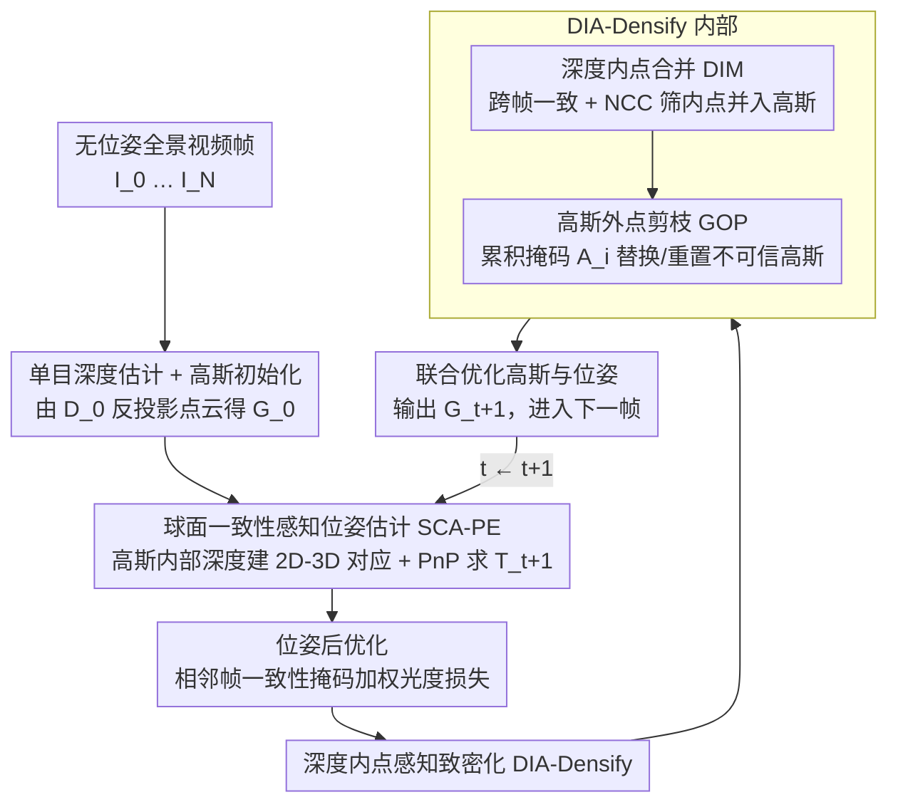

# Pose-Free Omnidirectional Gaussian Splatting for 360-Degree Videos with Consistent Depth Priors

**会议**: CVPR 2026  
**论文**: [CVF Open Access](https://openaccess.thecvf.com/content/CVPR2026/html/Zhuang_Pose-Free_Omnidirectional_Gaussian_Splatting_for_360-Degree_Videos_with_Consistent_Depth_CVPR_2026_paper.html)  
**代码**: https://github.com/zcq15/PFGS360  
**领域**: 3D视觉  
**关键词**: 全景3DGS, 无位姿重建, 球面一致性, 单目深度先验, 新视角合成  

## 一句话总结
PFGS360 提出一套**无需 SfM 位姿先验**的全景 3D Gaussian Splatting 框架：用「球面一致性感知位姿求解器」直接在重建高斯和未定位全景帧之间建立 2D–3D 对应、用 PnP 稳定地恢复相机位姿，再用「深度内点感知致密化」融合多帧一致的单目深度内点、剔除高斯外点，从而在 OB3D / Ricoh360 上的新视角合成和位姿估计同时大幅超越已有 pose-free 甚至 pose-aware 方法（NVS 最高 +4.42 dB PSNR，位姿误差降一个数量级）。

## 研究背景与动机

**领域现状**：用全景图（panorama）做全向 3D Gaussian Splatting 是 VR 漫游、室内可视化的关键技术。但现有的全景 3DGS 方法（ODGS、OmniGS 等）几乎都要先跑一遍慢且不稳的 SfM，去拿相机位姿和稀疏种子点。

**现有痛点**：透视图领域早就有成熟的 pose-free 3DGS（不用 SfM、靠渲染回传梯度优化位姿），但**直接搬到全景上会崩**。原因有两层：一是全景的球面投影让 3DGS 的雅可比在两极附近极度放大高斯误差，位姿梯度变得不稳；二是全景 3DGS 用的球面仿射近似在不同区域投影误差不一致，进一步污染位姿梯度，尤其在视角变化大的帧之间。结果就是位姿和渲染质量双双退化。

**核心矛盾**：pose-free 透视方法的成功靠两根支柱——① 靠光度损失回传梯度优化位姿，② 靠单目深度/3D 视觉基础模型（VFM）提供稠密几何先验当种子点。可这两根支柱在全景上都断了：球面光栅化的梯度不稳让 ① 失效；而 VFM 是为透视图训练的、给不出全景上可靠的 2D–3D 对应，让 ② 失效。同时单目深度（MDE）在多帧间本就不一致、不准确，硬塞进高斯会留下一堆外点。

**本文目标**：拆成两个子问题——(a) 在全景上**绕开不稳的光栅化梯度**做出稳定准确的位姿估计；(b) 在多帧深度先验**不一致**的前提下，挑出可信的几何信息做高保真致密化。

**切入角度**：作者放弃「靠球面光栅化梯度优化位姿」这条路，回到经典的 **PnP（Perspective-n-Point）位姿求解器**——它不依赖渲染梯度，天然更稳；同时不借助任何外部 VFM，而是直接拿**已经重建好的高斯本身的内部深度先验**去和新帧建立 2D–3D 对应。深度先验的不一致问题，则用跨帧球面重投影一致性来过滤。

**核心 idea**：用「重建高斯的内部深度 + 球面重投影一致性掩码 + PnP 求解」替代「球面光栅化梯度回传」来恢复位姿，再用「跨帧一致 + NCC 相似度筛出的深度内点」替代「无差别塞入单目深度」来致密化，从而无 SfM 地做出高保真全景重建。

## 方法详解

### 整体框架
给定一段无位姿的全景视频帧 $I_0, I_1, \dots, I_N$，PFGS360 是一个**逐帧增量**的重建流程：先用单目深度模型估计首帧 $I_0$ 的深度图 $D_0$，把它反投影成 3D 点来初始化全向高斯 $G_0$。之后对每一个新帧 $I_{t+1}$，依次做两件事——先用**球面一致性感知位姿估计（SCA-PE）**估出它的相机位姿 $T_{t+1}$，再用**深度内点感知致密化（DIA-Densify）**把当前高斯 $G_t$ 加密；最后对高斯 $G_t$ 和已访问的全部相机位姿做联合优化，得到的高斯当作 $G_{t+1}$ 进入下一帧循环。两个模块一前一后、靠同一套「球面重投影一致性」串起来：位姿模块用一致性掩码筛对应点，致密化模块用一致性掩码筛深度内点。

### 关键设计

**1. 球面一致性感知位姿求解器：用高斯自身深度建 2D–3D 对应，绕开不稳的渲染梯度**

针对「球面光栅化梯度在两极放大误差、对大视角变化不稳」这个痛点，作者不再回传梯度优化位姿，而是回到 PnP 求解器。要做 PnP 就得有 2D–3D 对应，作者的来源是**已重建高斯 $G_t$ 的内部深度**：对每个已访问视图 $I_k$ 渲染出深度图 $D^k_r$，它提供了跨帧尺度一致的几何先验。但 3DGS 是靠光度优化的，常常过拟合外观、在局部产生几何误差，所以要先把不可信的深度筛掉。

筛选方法是**球面重投影一致性**：把源图 $I_{src}$ 的像素 $m_i$ 用位姿和深度投到参考图 $I_{ref}$ 得 $m_j$，再投回源图得 $m_i'$，同时检验球面切向角误差和深度误差是否都在阈值内：

$$C_{src,ref}(\mathbf{x}) = \mathcal{I}\big(\mathcal{L}_{tan}(\mathbf{m}_i,\mathbf{m}'_i) \le \epsilon_{tan}\big) \cap \mathcal{I}\big(\text{abs}(\|\mathbf{x}_i\|-\|\mathbf{x}'_i\|)/\|\mathbf{x}_i\| \le \epsilon_{dep}\big)$$

其中 $\mathcal{I}(\cdot)$ 是指示函数，$\epsilon_{tan}=0.008$、$\epsilon_{dep}=0.05$。对每个已访问帧 $I_k$ 计算跨帧一致性图 $M^k_{con}=C_{k,t}\times C_{k,k-1}$，既抓相邻帧的局部一致、又抓多帧的全局一致。接着用 **SIFT**（在全景匹配上比深度网络更鲁棒）在已访问帧和新帧 $I_{t+1}$ 之间提特征对应，结合渲染深度得到一组 2D–3D 对应 $(\mathbf{x}_k, \mathbf{m}_{t+1})$。最后位姿 $T_{t+1}$ 通过最小化**球面一致性加权的重投影误差**求得：

$$T = \arg\min \sum \lambda\, \mathcal{L}_{tan}(\mathbf{x}_k,\mathbf{m}_{t+1}),\quad \lambda = \sin(\mathbf{m}'_k)\sin(\mathbf{m}_{t+1}) M^k_{con}(\mathbf{x}_k)$$

切向角误差 $\mathcal{L}_{tan}(\mathbf{x}_k,\mathbf{m}_{t+1}) = 2\sqrt{\frac{1-\mathbf{m}'_k\mathbf{m}_{t+1}}{1+\mathbf{m}'_k\mathbf{m}_{t+1}}}$。系数 $\lambda$ 里的 $\sin$ 项做球面平衡（补偿两极/赤道的不均匀采样），$M^k_{con}$ 则把一致性低的对应点权重压下去。这样既保留了 PnP 不依赖渲染梯度的稳定性，又用一致性显式抑制了高斯几何误差对位姿的污染——这是它能在大视角变化下仍稳的关键。

**2. 位姿后优化：用相邻帧一致性掩码给光度损失加权，避免噪声把位姿带偏**

PnP 给出的是粗位姿，还需 refine。作者发现「固定高斯参数、纯用光度损失优化位姿」效果不好：重建高斯的几何不准、加上新帧里有未观测的缺失区域，都会往光度损失里灌噪声，把位姿优化带偏。修法是引入**相邻帧一致性掩码** $M^k_{adj}=C_{k,k-1}\times C_{k,k+1}$ 作为损失权重，只让前后帧都一致的可靠区域参与优化：

$$\mathcal{L}_{photo} = (1-\lambda_{dssim}) M_{adj}\,\mathcal{L}_{l1}(I',I) + \lambda_{dssim} M_{adj}\,\mathcal{L}_{dssim}(I',I)$$

其中 $\lambda_{dssim}=0.2$。掩码把不可信区域（几何错误、缺失观测）从损失里屏蔽掉，让位姿 refine 更鲁棒。

**3. 深度内点合并（DIM）：跨帧一致 + NCC 双重筛选，只把可信的单目深度并进高斯**

致密化的痛点是单目深度（MDE）多帧间不一致、还常把细节抹平成过度光滑的表面。DIM 用三道筛子挑「深度内点」：先对渲染深度 $D^k_r$ 算出一致/不一致区域 $M^k_{con}$、$M^k_{inc}$；再把单目深度 $D^k_m$ 用一致性掩码对齐到当前 3DGS 的尺度——线性对齐 $D^k_a=\lambda_s D^k_m+\lambda_t$，参数由 $\lambda_s,\lambda_t=\arg\min\sum M^k_{con}\cdot(\lambda_s D^k_m+\lambda_t-D^k_r)^2$ 拟合，得到满足相邻帧一致的区域 $M^k_{con,a}$。但光靠几何一致仍不够（过度光滑的错误深度可能跨帧"一致地错"），所以再借鉴 patch-based MVS，用**归一化互相关（NCC）相似度**做第三道筛：

$$M^k_{ncc} = \mathcal{I}\big(\mathcal{F}(I_k,\mathcal{W}(I_{k-1},D^k_a)) > \mathcal{F}(I_k,\mathcal{W}(I_{k-1},D^k_r))\big)$$

其中 $\mathcal{W}(I_{ref},D_{src})$ 是用深度把参考图 warp 到源视角，$\mathcal{F}$ 是 NCC 函数——即只有当对齐后单目深度 warp 出来的图像比渲染深度 warp 的更贴合真实图像时，才认这个深度更可信。最终内点区域 $M^k_{inlier}=M^k_{inc}\cap M^k_{con,a}\cap M^k_{ncc}$ 把所有访问帧的可信 3D 点合并进高斯，专门补在「渲染深度不一致（$M^k_{inc}$）但单目深度可信」的地方——也就是高斯缺/错的地方。

**4. 高斯外点剪枝（GOP）：把被深度内点替代的高斯删掉、剩下外点重置不透明度**

DIM 补进了好点，但原高斯里仍残留外点。GOP 用累积掩码量化每个高斯有多"该被替换"：

$$A_i = \frac{\sum_{j\in \mathcal{I}^{max}_i} \omega_{i,j} M_j}{\sum_{j\in \mathcal{I}^{max}_i} \omega_{i,j}}$$

其中 $M_j$ 取像素 $j$ 处的 $M^k_{con}$ 或 $M^k_{inc}$（或内点掩码）值，$\mathcal{I}^{max}_i$ 是第 $i$ 个高斯在所有访问图中渲染权重 $\omega$ 最大的像素索引集。规则很直接：$A^{inlier}_i>0.8$ 的高斯已被深度内点替代，直接剪掉；满足 $A^{inlier}_i\le 0.8 \cap A^{inc}_i>0.8$ 的外点则把不透明度重置回初值（给它一次被重新优化的机会而非粗暴删除）。DIM 负责"补对的"、GOP 负责"删错的"，二者配合才把致密化做干净——消融里 GOP 让 PSNR 再涨 1.11 dB 就是证据。

### 损失函数 / 训练策略
位姿后优化用一致性掩码加权的光度损失（L1 + DSSIM，$\lambda_{dssim}=0.2$）。每帧最后对高斯参数和所有已访问相机位姿做联合优化。实现基于 PyTorch + Nerfstudio，全景 3DGS 光栅化用 gsplat 改造，单目深度默认用 UniK3D（输出绝对深度、相邻帧一致性最好），全部实验在单张 RTX 4090 上完成。

## 实验关键数据

### 主实验
数据集：OB3D（合成，含室内外、Egocentric/NonEgocentric 两种轨迹，有 GT 位姿）和 Ricoh360（真实拍摄，含畸变/运动模糊/过曝/人物遮挡）。对比 pose-free（CF-3DGS、HT-3DGS、3R-GS）和 pose-aware（ODGS、OmniGS）方法。

OB3D 新视角合成（PSNR，越高越好）：

| 子集 | 指标 | CF-3DGS | HT-3DGS | 3R-GS | ODGS(pose-aware) | OmniGS(pose-aware) | 本文 |
|------|------|---------|---------|-------|------|--------|------|
| Egocentric-mean | PSNR | 25.14 | 25.39 | 31.15 | 27.76 | 31.35 | **35.77** |
| Egocentric-mean | LPIPS | 0.253 | 0.242 | 0.086 | 0.204 | 0.137 | **0.057** |
| NonEgo-mean | PSNR | 22.31 | 22.56 | 23.39 | 25.79 | 26.75 | **30.81** |
| NonEgo-mean | LPIPS | 0.330 | 0.314 | 0.238 | 0.249 | 0.253 | **0.113** |

本文在 Egocentric 上比次优高 4.42 dB、NonEgocentric 上高 4.06 dB，且**超过了用 GT 位姿先验的 pose-aware 方法**。

OB3D 位姿估计（RPE_t，越低越好）：

| 子集 | CF-3DGS | HT-3DGS | 3R-GS | 本文 |
|------|---------|---------|-------|------|
| Egocentric-all | 3.181 | 3.375 | 0.380 | **0.018** |
| NonEgo-all | 1.813 | 2.199 | 1.303 | **0.040** |

位姿误差比次优低一个数量级。3R-GS 靠 MASt3R-SfM 在小运动的 Egocentric 上还行，但在大运动的 NonEgocentric 户外场景（可靠对应点稀少）几乎完全失败，本文则全轨迹稳定。

Ricoh360 真实数据 NVS：本文 PSNR 28.05，比次优 ODGS（26.27）高 1.78 dB，SSIM 0.867 / LPIPS 0.134 均最佳。

### 消融实验
OB3D NonEgocentric 子集，从 CF-3DGS 改的 baseline 逐步加模块：

| 配置 | PSNR | RPE_t | 说明 |
|------|------|-------|------|
| B (baseline) | 20.17 | 3.684 | 全局高斯 + 联合优化 |
| B+PnP | 27.50 | 0.229 | 朴素 PnP 位姿 |
| B+SCA-PE | 28.99 | 0.077 | 换成球面一致性求解器 |
| B+SCA-PE+DIM | 29.70 | 0.057 | 加深度内点合并 |
| B+SCA-PE+DIM+GOP | 30.81 | 0.040 | 完整模型（再加外点剪枝） |

深度模型消融：

| 深度模型 | PSNR | RPE_t | 说明 |
|----------|------|-------|------|
| DepthAnywhere | 29.22 | 0.389 | 仿射不变损失，相邻帧尺度难一致 |
| DA2 | 30.61 | 0.441 | 尺度不变损失，仍有跨帧不一致 |
| UniK3D | **30.81** | **0.040** | 绝对深度，相邻帧一致性最好 |

### 关键发现
- **SCA-PE 比朴素 PnP 还要好一大截**：B+PnP→B+SCA-PE，RPE_t 从 0.229 降到 0.077（降约 66%），PSNR 涨 1.49 dB——说明球面一致性加权对过滤高斯几何误差至关重要，不是"换个 PnP 就行"。
- **DIM 补点、GOP 删点缺一不可**：DIM 让 PSNR +0.71 dB 但仍残留外点导致 classroom/lone-monk 有畸变；再加 GOP 后 PSNR 再 +1.11 dB、伪影才彻底消除。
- **深度模型的"相邻帧一致性"决定成败**：输出绝对深度的 UniK3D 让位姿 RPE_t（0.040）远好于仿射/尺度不变的 DepthAnywhere（0.389）和 DA2（0.441）——即便 DIM 做了尺度对齐，源头深度跨帧不一致仍会拖垮位姿。

## 亮点与洞察
- **"绕开梯度"而非"修好梯度"**：面对球面光栅化梯度不稳，作者没去硬修雅可比，而是退回经典 PnP + 一致性加权，用工程上更稳的路径解决问题——这种"换赛道"的思路在很多梯度病态的任务里都可复用。
- **一致性掩码一物多用**：同一套球面重投影一致性 $M_{con}$，既给位姿求解器筛 2D–3D 对应、又给光度损失加权、还给致密化筛深度内点——一个核心机制贯穿三个子模块，设计非常经济。
- **NCC 作为几何一致性的"补刀"**：意识到"跨帧几何一致"会被"一致地错的过度光滑深度"骗过，再加一道图像级 NCC 相似度筛，这个 patch-MVS 的老 trick 在 3DGS 致密化里用得很巧。
- **无 SfM 还能反超 pose-aware**：直接拿重建高斯的内部深度建对应、不依赖任何外部 VFM，却能超过用 GT 位姿的 ODGS/OmniGS，说明"自洽的内部几何先验"有时比"外部但不匹配的先验"更可靠。

## 局限与展望
- **强依赖逐帧增量 + 视频连续性**：方法是 frame-by-frame 顺序融合的，需要相邻帧有足够重叠来算一致性掩码和 SIFT 对应；对稀疏拍摄、帧间跳变大或非视频的全景图集，跨帧一致性会失效。
- **位姿对单目深度的相邻帧一致性高度敏感**：消融显示用仿射/尺度不变深度模型时 RPE_t 退化近 10 倍，说明系统鲁棒性部分外包给了 MDE 模型的尺度一致性，换数据域时需谨慎选深度模型。
- **多处依赖手调阈值**：$\epsilon_{tan}=0.008$、$\epsilon_{dep}=0.05$、剪枝阈值 0.8 等都是固定超参，论文未给敏感性分析，跨场景/不同分辨率下是否稳健存疑。
- **改进方向**：可探索把一致性掩码做成可学习/自适应阈值，或引入全局 BA 缓解逐帧误差累积，让方法对非连续全景输入也成立。

## 相关工作与启发
- **vs CF-3DGS / HT-3DGS**：它们用相邻帧单目高斯渲染对齐来估位姿，误差随序列累积、且球面投影下小深度误差被放大成大畸变，导致光度优化位姿很难；本文用 PnP + 一致性掩码避开了误差累积和梯度不稳，位姿误差低一个数量级。
- **vs 3R-GS**：3R-GS 把全景重投影成多个重叠透视块、再用 MASt3R-SfM 恢复位姿和稀疏点，在小运动 Egocentric 上有竞争力，但在大运动/可靠对应稀少的户外场景几乎失败；本文直接在全景域用高斯内部深度建对应，全轨迹都稳。
- **vs 透视 pose-free + VFM 方法（如基于 MASt3R 的）**：那些方法靠为透视图训练的 3D VFM 提供 2D–3D 对应，但 VFM 给不出全景上的稳定对应、且高分辨率全景计算开销大；本文不用任何外部 VFM，自给自足。
- **vs ODGS / OmniGS（pose-aware）**：它们需要 SfM/GT 位姿先验；本文无位姿却在 NVS 上反超它们，证明逐帧融合的深度内点致密化能给出比稀疏 SfM 初始化更丰富的种子点。

## 评分
- 新颖性: ⭐⭐⭐⭐⭐ 首个无 SfM 的全景 3DGS，"高斯内部深度建对应 + 球面一致性加权 PnP"的组合切入很巧
- 实验充分度: ⭐⭐⭐⭐ 合成+真实双数据集、NVS+位姿双任务、模块与深度模型双消融齐全，但缺超参敏感性和效率/速度对比
- 写作质量: ⭐⭐⭐⭐ 动机层层递进、模块图清晰；部分公式在 PDF 提取中有损需对照原文
- 价值: ⭐⭐⭐⭐⭐ 直击全景 VR 重建去 SfM 的真实痛点，性能大幅领先且超过 pose-aware，已开源

<!-- RELATED:START -->

## 相关论文

- [\[CVPR 2026\] E2EGS: Event-to-Edge Gaussian Splatting for Pose-Free 3D Reconstruction](e2egs_event-to-edge_gaussian_splatting_for_pose-free_3d_reconstruction.md)
- [\[CVPR 2026\] VGGT-360: Geometry-Consistent Zero-Shot Panoramic Depth Estimation](vggt-360_geometry-consistent_zero-shot_panoramic_depth_estimation.md)
- [\[CVPR 2026\] ODGS-SLAM: Omnidirectional Gaussian Splatting SLAM](odgs-slam_omnidirectional_gaussian_splatting_slam.md)
- [\[CVPR 2026\] AeroGS: Scale-Aware Gaussian Splatting for Pose-Free Dynamic UAV Scene Reconstruction](aerogs_scale-aware_gaussian_splatting_for_pose-free_dynamic_uav_scene_reconstruc.md)
- [\[CVPR 2026\] TokenSplat: Token-aligned 3D Gaussian Splatting for Feed-forward Pose-free Reconstruction](tokensplat_token-aligned_3d_gaussian_splatting_for_feed-forward_pose-free_recons.md)

<!-- RELATED:END -->
