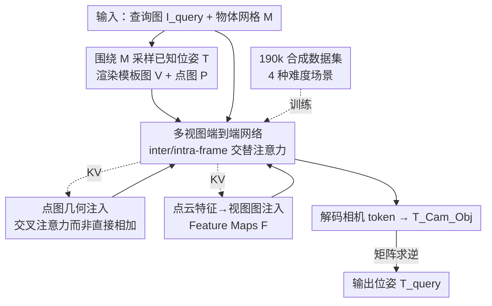

# PoseGAM: Robust Unseen Object Pose Estimation via Geometry-Aware Multi-View Reasoning

**会议**: CVPR 2026  
**论文**: [CVF Open Access](https://openaccess.thecvf.com/content/CVPR2026/html/Chen_PoseGAM_Robust_Unseen_Object_Pose_Estimation_via_Geometry-Aware_Multi-View_Reasoning_CVPR_2026_paper.html)  
**代码**: https://windvchen.github.io/PoseGAM （项目页）  
**领域**: 3D视觉  
**关键词**: 6D位姿估计, 未见物体, 多视图基础模型, 几何注入, 合成数据集

## 一句话总结
PoseGAM 把 VGGT 这类多视图几何基础模型搬到 6D 物体位姿估计上，让网络直接吃「查询图 + 一组已知位姿的模板渲染图」端到端回归位姿，彻底甩掉传统 match-then-localize 的显式特征匹配，再通过交叉注意力把物体的点图和点云几何特征以「视图图」形式注入，在 5 个 BOP 数据集上平均 AR 提升 5.1%（TUD-L 上 +17.6%）。

## 研究背景与动机
**领域现状**：6D 物体位姿估计要预测物体相对相机的旋转+平移。对未见物体（unseen object），主流做法是 match-then-localize 或 match-then-refine：先在查询图与物体 3D 模型 / 一组已知位姿的模板图之间显式建立特征对应，再用 PnP、最小二乘等几何求解器把位姿解出来。

**现有痛点**：整条 pipeline 的精度被「匹配」这一步死死卡住——一旦特征匹配不可靠（纹理弱、遮挡、外观差异大），后面再好的几何求解器也救不回来，位姿就崩。匹配质量成了系统的天花板。

**核心矛盾**：显式匹配既是这类方法的核心也是它的软肋。它强依赖「查询图和参考之间外观一致」这个假设，但 CAD 模型渲染图和真实拍摄图之间存在天然的 domain gap（光照、材质、反射都不一样），匹配在这种情况下最容易失准。

**本文目标**：能不能跳过显式匹配，用一个端到端网络直接从图像推出位姿，同时尽量少依赖相机成像先验？

**切入角度**：作者注意到 DUSt3R、VGGT、π³ 这类多视图几何基础模型已经能不走传统 SfM、直接从多张 RGB 图推 3D 几何和相机位姿。位姿估计本质也是一种「相机—物体相对几何」推理，如果把查询图和物体的多视图模板图一起喂进这种架构，网络应该能直接 reason 出物体位姿，还能白嫖它们的大规模预训练权重。

**核心 idea**：用「多视图基础模型 + 显式几何注入」替代「显式特征匹配 + 几何求解器」——把物体的点图（point map）和点云特征以视图图形式交叉注意力注入网络，再配一个 19 万物体的合成数据集解决 domain gap。

## 方法详解

### 整体框架
给定物体网格 $\mathcal{M}$ 和包含该物体的查询图 $I_{\text{query}}$，目标是估计物体到相机的变换 $T_{\text{query}}$。流程是：先围绕 $\mathcal{M}$ 采样一组已知相机位姿 $\mathcal{T}$，渲染出多视图 RGB 模板图 $\mathcal{V}$ 和对应的点图 $\mathcal{P}$；查询图（前景已分割）和模板图都编码成图像 token，每张图配一个相机 token——模板图的相机 token 由已知内外参算出，查询图的相机 token 是一个可学习 embedding（因为它正是要求解的未知量）。同时一个几何特征提取器把物体编码成全局表征，再分发到各视图形成视图特异的特征图 $\mathcal{F}$。点图 $\mathcal{P}$ 和特征图 $\mathcal{F}$ 一起作为 key-value，通过交叉注意力注入主干。网络主干交替做 inter-frame / intra-frame 自注意力（继承 VGGT），最后把查询图的相机 token 解码成「相机到物体」变换 $T^{\text{Cam}}_{\text{Obj}}$，矩阵求逆得到最终的 $T_{\text{query}}$。

### 关键设计

**1. 多视图端到端位姿网络：用「联合推理」干掉显式匹配**

传统方法卡在匹配质量上，PoseGAM 干脆不匹配。它把查询图和 $N$ 张已知位姿的模板渲染图一起送进一个继承自 VGGT 的前馈多视图网络：每张图先用预训练 DINOv2 抽出图像 token $X_i = (x_i^{(1)}, \dots, x_i^{(L)})$，再为每张图配一个相机 token $c_i$；模板图的 $c_i$ 由已知内外参编码而来，而查询图额外接一个**可学习的查询相机 token** $c_{\text{query}}$——这一步是关键，把「未知位姿」显式建模成一个待网络填充的 token。网络处理的总 token 数是 $\underbrace{(L+1)}_{\text{帧内}} \times (N+1)$（帧间），主干交替做 inter-frame 和 intra-frame 自注意力，让查询视角和所有模板视角充分交互。最后只用真值相机位姿监督查询相机 token 的解码输出。这样位姿不再是「先匹配后求解」两段式，而是网络在多视图上下文里一次推理出来，从根上绕开了匹配不可靠的问题。

**2. 点图几何的交叉注意力注入：补上基础模型缺失的「物体已知 3D 模型」**

现成多视图基础模型只吃图像、不知道物体真实 3D 模型，而位姿估计里这个模型是已知的，白白浪费可惜。但直接把几何信息塞进去会出事。作者先把物体 $\mathcal{M}$ 按位姿 $\mathcal{T}$ 渲染成深度图，再用相机内参反投影回世界坐标得到点图 $\mathcal{P}=\{P_i\}$（$\text{Object } \mathcal{M} \overset{\mathcal{T}}{\to} \text{Depth Maps} \to \text{Point Maps } \mathcal{P}$），每张点图过一个轻量卷积变成 point map token。最朴素的做法是把这些 token 直接加到 RGB 图像 token 上，但这会让输入分布严重偏离预训练模型熟悉的「自然图像」分布，破坏知识迁移（消融里 PTv3 + View Format 直接相加 AUC@3 直接崩到 2.4）。所以作者改用交叉注意力 $\mathrm{CA}(Q \leftarrow \text{multiview tokens}, KV \leftarrow \text{geometry tokens})$——在每个自注意力层之前插一个交叉注意力，让多视图 token 主动去「查询」几何 token，而不是粗暴叠加。这样既注入了 3D 先验，又不污染预训练分布。

**3. 点云特征「视图图化」：让序列几何 token 对齐多视图推理范式**

光有点图还不够，作者还想注入更高层的几何语义，于是用现成点云网络（PointTransformer v3）抽全局表征。输入是带逐点颜色和法向的点云，输出逐点特征。难点在于：直接把这些原始序列格式的逐点特征 $\mathbb{R}^{L\times C}$ 喂进网络，模型很难高效利用（消融里 raw format 明显更差）。作者的观察是——把逐点特征**按空间重组成视图图格式** $\mathbb{R}^{N\times H\times W\times C}$ 效果就好很多，因为这跟视觉输入的组织方式天然对齐。具体做法是把点图里的坐标通道替换成提取出的特征向量，形成特征图 $\mathcal{F}$（$\text{Point Clouds} \overset{\text{PCNet}}{\to} \text{Per-Point Features} \overset{\text{Disperse}}{\to} \text{Feature Maps } \mathcal{F}$），同样过轻量卷积成 token，再加到 point map token 上一起构成交叉注意力的 KV。「视图图」这个表征选择是本文一个很务实的洞察：序列几何 token 和视图推理范式不搭，转成视图图就顺了。

**4. 19 万物体合成数据集：用「四级难度场景」逼网络抗 domain gap**

要让方法对真实场景鲁棒，必须解决 CAD 渲染图与真实图的外观鸿沟，作者为此造了个超 19 万物体的大规模合成数据集（聚合 Toys4K、3D-FUTURE、ABO、HSSD、Objaverse 并按几何质量过滤，再做纹理 re-baking 消除跨平台渲染不一致）。每个物体用球面 Hammersley 序列采 50 个相机位姿渲染纹理图和几何图（深度/法向/mask）。最关键的是查询图按**四种递进难度**渲染：① 居中物体（光照固定、物体居中，最简单）；② 非居中物体（随机扰动相机位置和 look-at，物体偏离画面中心、带部分遮挡，要求 >30% 顶点投影进画面才算有效）；③ 非居中 + 变光照（引入 800+ 张 HDR 环境图、用 Cycles 物理渲染，制造剧烈 shading / 色温 / 高光变化）；④ 外观编辑（用 DDIM inversion 注噪后由 FLUX 文本条件扩散重绘纹理，保几何变外观，专门模拟「结构对齐但外观不一致」这一最难情形，并限制 pitch 15°–60°、yaw ±60° 避免生成失败）。这套渐进难度直接对准多视图基础模型「假设外观一致」的软肋。

## 实验关键数据

### 主实验
在 5 个 BOP 核心数据集（LM-O、T-LESS、TUD-L、IC-BIN、YCB-V，训练时全未见）上用 BOP 标准 AR 指标评测。所有方法不用 refinement 网络、不用多假设策略，统一用 CAD 模型 + 检测分割 mask、仅 RGB 查询图。

| 方法 | LM-O | T-LESS | TUD-L | IC-BIN | YCB-V | 平均 |
|------|------|--------|-------|--------|-------|------|
| GigaPose | 29.9 | 27.3 | 30.2 | 23.1 | 29.0 | 27.9 |
| FoundPose | 39.6 | 33.8 | 46.7 | 23.9 | 45.2 | 37.8 |
| RayPose | 42.1 | **36.9** | 48.3 | 21.8 | 46.2 | 39.1 |
| VGGT（直接迁移） | 10.6 | 12.8 | 30.0 | 14.5 | 13.5 | 16.3 |
| **PoseGAM（本文）** | **43.0** | 34.1 | **56.8** | **24.3** | **47.4** | **41.1** |

平均 AR 较此前最佳（RayPose 39.1）提升 5.1%；TUD-L 上 48.3→56.8 提升 17.6%，作者归因于 TUD-L 是单物体、少遮挡，最贴合其合成训练数据的分布。原始 VGGT 直接迁移只有 16.3，印证「不注入几何 + 对外观不一致敏感」让基础模型在位姿任务上水土不服。

### 消融实验
消融用子采样数据集 + AUC@N（结合旋转精度 ARA 和平移精度 ATA）。

| 配置 | AUC@3↑ | AUC@5↑ | AUC@10↑ | AUC@30↑ | 说明 |
|------|--------|--------|---------|---------|------|
| V+T（仅 RGB+相机位姿） | 15.07 | 29.72 | 53.62 | 77.77 | 无几何，最弱 |
| V+T+P（加点图） | 25.94 | 41.63 | 61.24 | 80.26 | 点图大幅提升低阈值精度 |
| V+T+P+F（完整） | 28.18 | 45.51 | 65.31 | 84.30 | 再加特征图最优 |
| V+T+{D,P}+F（再加深度图） | 28.75 | 45.60 | 65.16 | 84.30 | 收益有限（信息冗余） |

| 几何注入策略 | AUC@3↑ | AUC@30↑ | 说明 |
|------|--------|---------|------|
| PTv3 + 原始序列格式 | 23.88 | 79.52 | 序列格式难利用 |
| PTv3 + 视图图（直接相加） | 2.419 | 41.81 | 破坏预训练分布，近乎崩溃 |
| PTv3 + 视图图（交叉注意力） | 28.18 | 84.30 | 本文方案，最优 |

### 关键发现
- **几何注入方式比注入什么更重要**：同样是 PTv3 视图图特征，「直接相加」AUC@3 仅 2.4、近乎训练崩溃，换成交叉注意力直接飙到 28.2——因为直接相加会把预训练模型的输入分布打乱，这是全文最戏剧化的对照。
- **视图图 > 原始序列**：把逐点特征重组成视图图格式（28.18）明显优于原始序列格式（23.88），证明几何表征要跟视觉输入的组织方式对齐。
- **视角覆盖要全**：FPS 采样（28.18）远胜随机采样（14.23），因为随机采样常漏掉物体某些朝向；视角数从 5→10→20，AUC@3 从 11.46→28.18→33.59 单调上升。
- **预训练权重是命脉**：从头训只有 AUC@3=5.10，从 VGGT 初始化直接到 28.18；几何网络 PTv3 微调（28.18）也优于冻结（25.00）。
- **颜色信息有用**：给 VecSet 几何特征加纹理颜色，精度涨约 3 点，因为带色几何特征更易和 RGB 特征在注意力里对齐。

## 亮点与洞察
- **「位姿即未知 token」的建模很优雅**：把待求位姿表示成查询图的一个可学习相机 token，让网络在多视图上下文里自己填，天然把位姿估计变成基础模型已擅长的「相机推理」子问题，复用预训练权重的逻辑非常顺。
- **「视图图化」是可迁移的 trick**：当你想把序列形式的几何/点云特征注入一个视觉 transformer 时，先 disperse 成 $N\times H\times W\times C$ 视图图再融合，比直接喂序列 token 好很多——这个对齐思路可迁移到任何「点云特征 + 多视图视觉骨干」的融合场景。
- **交叉注意力 vs 直接相加的教训很贵但很值**：注入外部模态时，别粗暴加到预训练 token 上（会破坏输入分布导致崩溃），用交叉注意力让原模态主动查询新模态，这是保护预训练知识的通用原则。
- **数据集的「四级难度」对准基础模型软肋**：尤其第四级用扩散模型重绘外观、保几何变纹理，直接造出「结构对齐但外观不一致」样本去打多视图模型「假设外观一致」的假设，这种针对性造数据的思路很值得学。

## 局限与展望
- 作者承认假设物体在查询图和参考模型之间**保持刚性静止**，遇到非刚性/铰接运动位姿会失准；展望是引入可变形组件建模，把刚性运动和局部形变解耦。
- 训练主要用实心不透明物体，对**透明/反光物体**会失效——背景语义和反射会误导几何推理；可加背景抑制/反射去除预处理或扩充此类训练数据。
- 自己看：方法重度依赖大规模合成数据 + 多视图基础模型预训练权重，复现成本高（190k 物体渲染 + VGGT/PTv3 双预训练）；且需要已知 CAD 模型和检测 mask 作为输入，并非纯 RGB 零先验。
- 视角数从 10→20 还在涨点（AUC@3 28.18→33.59），说明默认配置可能尚未饱和，但更多视角意味着更高推理成本，精度-效率权衡未充分展开。

## 相关工作与启发
- **vs match-then-localize / match-then-refine（MegaPose、GigaPose、GenFlow、FoundPose）**：它们显式建立查询图与模型/模板的特征对应再用 PnP 等求解，精度受匹配质量天花板限制；本文端到端回归、无显式匹配，匹配不可靠时更鲁棒，平均 AR 也更高。
- **vs RayPose（前馈 + 多视图扩散）**：同为前馈、不依赖显式匹配，但 RayPose 走多视图扩散；本文走 VGGT 式确定性多视图注意力 + 显式几何注入，平均 41.1 vs 39.1，TUD-L 等单物体场景优势更明显。
- **vs VGGT / π³ / DUSt3R（多视图基础模型）**：它们只吃图像、只能估相机相对位姿、且假设外观一致；本文在其架构上注入物体已知 3D 几何（点图 + 点云特征视图图）并用合成数据消 domain gap，把它们从「场景几何重建」迁到「物体 6D 位姿」，VGGT 直接迁移仅 16.3、本文 41.1。

## 评分
- 新颖性: ⭐⭐⭐⭐ 把多视图几何基础模型迁到 6D 位姿并设计「视图图化几何注入」，方向新但建立在 VGGT 等成熟架构上。
- 实验充分度: ⭐⭐⭐⭐⭐ 5 个 BOP 数据集 + 输入模态/注入方式/视角策略/微调策略多维消融，PTv3 直接相加崩溃这类对照很有说服力。
- 写作质量: ⭐⭐⭐⭐ 动机—方法—消融逻辑清晰，几何注入的取舍讲得透；部分公式排版（原文 LaTeX）较乱。
- 价值: ⭐⭐⭐⭐ SOTA + 一个 19 万物体数据集，对未见物体位姿估计和「基础模型迁移 + 几何注入」范式都有实用参考价值。

<!-- RELATED:START -->

## 相关论文

- [\[CVPR 2026\] PoseGaussian: 6D Pose Estimation for Unseen Objects via Sparse-View Object-Level 3D Gaussian Splatting](posegaussian_6d_pose_estimation_for_unseen_objects_via_sparse-view_object-level_.md)
- [\[CVPR 2026\] OrienPose: Orientation-Guided Novel View Synthesis for Single-Image Unseen Object Pose Estimation](orienpose_orientation-guided_novel_view_synthesis_for_single-image_unseen_object.md)
- [\[CVPR 2026\] ConceptPose: Training-Free Zero-Shot Object Pose Estimation using Concept Vectors](conceptpose_training-free_zero-shot_object_pose_estimation_using_concept_vectors.md)
- [\[CVPR 2026\] WildPose: A Unified Framework for Robust Pose Estimation in the Wild](wildpose_a_unified_framework_for_robust_pose_estimation_in_the_wild.md)
- [\[CVPR 2026\] ComPose: A Unified Completion-Pose Framework for Robust Category-Level Object Pose Estimation](compose_a_unified_completion-pose_framework_for_robust_category-level_object_pos.md)

<!-- RELATED:END -->
