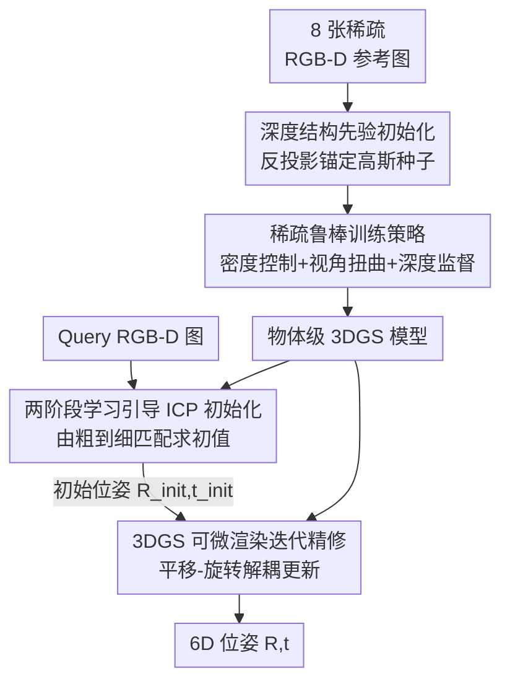

# PoseGaussian: 6D Pose Estimation for Unseen Objects via Sparse-View Object-Level 3D Gaussian Splatting

**会议**: CVPR 2026  
**论文**: [CVF Open Access](https://openaccess.thecvf.com/content/CVPR2026/html/Shi_PoseGaussian_6D_Pose_Estimation_for_Unseen_Objects_via_Sparse-View_Object-Level_CVPR_2026_paper.html)  
**代码**: 待确认  
**领域**: 3D视觉  
**关键词**: 6D位姿估计, 未见物体, 3D高斯泼溅, 稀疏视角, 可微渲染

## 一句话总结
PoseGaussian 只用 8 张稀疏 RGB-D 参考图、无需 CAD 模型，先靠深度先验初始化一个物体级 3DGS 并用稀疏鲁棒训练策略压住浮点和过拟合，再用「两阶段学习引导 ICP 给初始位姿 + 3DGS 可微渲染迭代精修」估计未见物体的 6D 位姿，在 LINEMOD / GenMOP 上稀疏视角下反超用 16 视角的基线。

## 研究背景与动机

**领域现状**：6D 位姿估计（预测物体在相机坐标系下的 3D 平移 $t$ 和 3D 旋转 $R$）是机器人抓取、AR/VR、自动驾驶的关键技术。实例级方法精度高，但每个物体都要标注和高质量 CAD 模型，无法泛化到未见物体；类别级方法靠共享形状先验提升类内泛化，可一旦测试物体超出训练类别或类内差异大就明显掉点。

**现有痛点**：近年的「model-free」路线只用参考图像作先验，重建出物体的几何与外观，再靠渲染一致性或几何配准求位姿。但其中两条子路线各有硬伤——基于 NeRF 的隐式重建质量高却训练/渲染都慢，缺乏实时性；基于 3DGS 的显式重建虽然训练和渲染都快，却几乎都依赖**密集多视角输入 + SfM 初始化**。一旦参考视角稀疏、纹理又弱，SfM 初始化就容易失败，重建出现浮点（floaters）和外观过拟合，直接拖垮下游位姿估计的稳定性。

**核心矛盾**：3DGS 的效率优势诱人，但它对视角数量和质量极其敏感——既想要「少到 8 张图」的实用性，又要「重建稳、位姿准」的可靠性，二者在稀疏低纹理条件下天然冲突。而且即便勉强重建出 3DGS，怎么对这个粗糙模型算出准确位姿仍是核心难题。

**本文目标**：在 model-free + 稀疏视角设定下，对未见物体既要重建出稳定的物体级 3DGS，又要估出高精度 6D 位姿，拆成「稳重建 → 给好初值 → 精修位姿」三个子问题。

**切入角度**：作者观察到稀疏视角 NeRF 的成功经验——引入**深度结构先验**做监督能显著降低初始化失败和过拟合（如 DS-NeRF 把 SfM 深度嵌入射线终止分布）。于是把这套思路搬到 3DGS：用 RGB-D 的深度反投影直接锚定高斯种子到物体表面，从源头绕开 SfM。

**核心 idea**：用「深度先验初始化 + 稀疏鲁棒训练」换掉脆弱的 SfM 重建，再用「学习引导 ICP 给初值 + 3DGS 可微渲染做免训练精修」串成一条不依赖任务专用网络、能泛化到未见物体的三阶段流水线。

## 方法详解

### 整体框架
PoseGaussian 是一个三阶段框架。输入是某未见物体的 8 张稀疏 RGB-D 参考图和一张待求位姿的 query RGB-D 图，输出是 query 图中物体的 6D 位姿 $\{R, t\}$。

- **阶段一·稀疏视角 3DGS 重建（Sec 3.2）**：把 RGB-D 深度反投影成点云作为结构先验，初始化物体级 3DGS，再用自适应密度控制 + 视角扭曲增广 + 光度-深度联合监督训练，得到一个稳健、少浮点的物体模型 $G_\text{target}$。
- **阶段二·两阶段学习引导 ICP 初始化（Sec 3.3）**：从 3DGS 模型和 query 图各构造一个点云，喂进 KPConv-FPN 提多尺度特征，由粗到细做对应匹配，最后 ICP 解出一个稳健的初始位姿 $\{s, R_\text{init}, t_\text{init}\}$。
- **阶段三·3DGS 可微渲染迭代精修（Sec 3.4）**：把 3DGS 渲染器当成可微精修器，以「渲染-比较-反传」迭代更新位姿，外观一致性为主、尺度归一化深度对齐为辅，且平移和旋转解耦更新，最终得到高精度 6D 位姿。

### 关键设计

**1. 深度结构先验初始化：用 RGB-D 反投影点云锚定高斯种子，从源头绕开 SfM 失败**

传统 3DGS 用 SfM 初始化，在稀疏低纹理时频繁失败，导致几何歧义和浮点。本文改用深度结构先验：对第 $i$ 个参考视角，把其掩码 $M_i$ 内像素用深度反投影到世界系，得到点集 $P_i = \{T_i^{-1}(D_i(u,v)\,K^{-1}[u,v,1]^\top)\mid (u,v)\in M_i\}$，再聚合成总点云 $P_t = \bigcup_{i=1}^{N} P_i$，其中 $K$ 是内参、$D_i(u,v)$ 是深度、$T_i\in SE(3)$ 是参考图位姿。为了对付 RGB-深度边界处的像素错位和混合深度，先对掩码边界做轻微腐蚀去掉边缘伪影，再用 KNN 做鲁棒离群点剔除：对每个点算到 $k$ 近邻的平均距离 $\bar d_i$，由全局均值 $\mu_d$ 和标准差 $\sigma_d$ 构造自适应阈值 $\tau$，$\bar d_i > \tau$ 的点判为离群删除。清洗后的点云每个点充当一个高斯中心 $\mu$，RGB 映射成球谐颜色 $c$，局部邻域平均间距设各向同性初始尺度。这样种子直接贴在物体表面，后续优化只需精调而非「从零长几何」，稀疏视角下重建因此稳定得多。

**2. 稀疏鲁棒训练策略：自适应密度控制 + 视角扭曲增广 + 光度-深度联合监督，三招压住浮点与过拟合**

只靠初始化还不够，稀疏视角下训练阶段照样会冗余和过拟合。本文用三招协同应对。**自适应密度控制**不像普通 3DGS 用固定不透明度阈值粗暴删点，而是先累积体渲染权重得到每个高斯的长期平均贡献，**只在某个 splat 的不透明度落在最低 5%、且贡献也在最低档时才剪枝**，既减冗余又保住高质量 splat；同时把全局致密化换成**方向性致密化**——周期性算位置梯度范数，超阈值才沿主轴方向分裂高斯，更好覆盖细结构和边界。**视角扭曲增广**对每张真实 RGB-D 参考图施加小位姿扰动 $\delta T$（旋转 $1$–$3°$、平移为物体尺度的 $0.5\%$–$1.5\%$），用深度前向投影合成伪视角和原图一起训练，在相机位姿空间扩充数据，逼模型学「视角一致的几何外观」而非死记几张输入。**联合监督**则把光度项 $L_\text{rgb}=\lambda_1\|\hat I - I\|_1 + \lambda_2 L_\text{D-SSIM}(\hat I, I)$ 和深度项 $L_\text{depth}=\|\hat D - D\|_1$ 合成总损失 $L_\text{total}=\lambda_1\|\hat I - I\|_1 + \lambda_2 L_\text{D-SSIM} + \lambda_d L_\text{depth}$。训练用「前高后低」退火：前 30% 迭代加大 $\lambda_d$ 稳住几何、并把球谐阶限制在 0–1 抑制高频过拟合，后期再逐步抬高光度权重、把球谐阶升到 2–3 精修纹理边界。

**3. 两阶段学习引导 ICP 初始化器：由粗到细的几何匹配给出稳健初值，替代脆弱的相似度检索**

可微渲染精修对初值敏感，初值差就陷局部最优。拿到 $G_\text{target}$ 后，本文先从 3DGS 模型抽出点云 $P_G=\{\mu_i\mid i\in G_\text{target}\ \&\ \alpha_i\ge 0.7\}$（不透明度阈值 0.7，因为低不透明度点对渲染贡献小、多为离群），从 query 图反投影出 $P_Q=\{d_i\cdot K^{-1}\cdot(u_i,v_i,1)^\top\mid (u_i,v_i)\in M_\text{tar}\}$。两个点云喂进 KPConv-FPN 提多尺度特征：低分辨率特征做全局粗匹配（Coarsepoint Matching Module 保证全局几何一致），高分辨率特征做密集局部匹配（Local Superpoint Matching，并用最优传输层 optimal transport 提升局部 patch 匹配质量）。最后对所有保留对应跑 ICP 求相似变换 $\{s, R_\text{init}, t_\text{init}\}=\arg\min_{s,R,t}\sum_{(p,q)\in\hat C_p}\|sRp + t - q\|^2$。相比 Gen6D/Cas6D 那种相似度检索式选择器，这种几何驱动的由粗到细配准初始化偏差更小（消融里替换成它们的选择器掉点最严重）。

**4. 3DGS 可微渲染迭代精修器：把渲染器当免训练精修器，平移-旋转解耦更新避免耦合漂移**

拿到稳健初值后，本文把 3DGS 泼溅渲染器直接当成可微精修器，做「渲染-比较-反传」迭代——与需要额外 CNN/Transformer 精修头的方法不同，它不依赖任务专用可训练参数，因此对未见实例泛化更好。每步更新 $T_{k+1}=\Delta T_k T_k$，$\Delta T_k=(\Delta R_k, \Delta t_k)$；仿 FoundationPose 把增量拆成平移 $\Delta t_k$ 和旋转 $\Delta R_k$，且**旋转绕物体质心施加**，避免平移-旋转耦合带来的漂移。给定内参，位姿 $T$ 下渲染图为 $C(T)=R_\text{gs}(G_\text{object}, K, T)$。损失 $L_\text{pose}=L_t + L_R$ 以外观一致性为主，用 SSIM 和 MS-SSIM 比对渲染图与 query；但外观对沿 $z$ 轴的纯平移不敏感，故额外加**尺度归一化深度对齐项** $L_\text{SNDA}=\frac{1}{|\Omega|}\sum_{u\in\Omega}\sqrt{(\hat D(u;T)/\hat s - D(u)/s_z)^2 + \varepsilon^2}$，其中 $\hat D$ 是渲染深度、$D$ 是传感器深度，$\hat s, s_z$ 是用各自中位深度算的归一化尺度，$\varepsilon$ 是 Charbonnier 常数提升鲁棒性。更新采用「先平移后旋转」解耦：$t_{k+1}=t_k+\arg\min_{\Delta t} L_t([R_k\mid t_k+\Delta t])$，再 $R_{k+1}=\arg\min_{\Delta R} L_R(\Delta R\,R_k\mid t_{k+1})\cdot R_k$，靠 3DGS 的快速可微渲染高效迭代到高精度位姿。

### 损失函数 / 训练策略
重建阶段总损失为光度 + 深度联合监督 $L_\text{total}=\lambda_1\|\hat I-I\|_1+\lambda_2 L_\text{D-SSIM}+\lambda_d L_\text{depth}$，配「前高后低」深度权重退火 + 球谐阶 0–1→2–3 渐进。位姿精修阶段损失 $L_\text{pose}=L_t+L_R$，平移项含 SSIM + SNDA、旋转项含 SSIM + MS-SSIM。训练用 Adam 跑 10,000 次迭代、余弦学习率退火；自适应密度控制从第 500 步开始到 6k 步结束（致密化每 500 步一次、概率线性衰减到 0，剪枝每 100 步一次）。每个物体选 8 个 RGB-D 参考视角，每个真实视角做 2 次小扰动视角扭曲。

## 实验关键数据

数据集：在合成数据 MegaPose 和 Google Scanned Objects 上训练，在 **LINEMOD（13 个物体）** 和 **GenMOP（10 个物体）** 上评测，外加 RealSense D435i 采的真实场景做定性评估。指标：LINEMOD 用 ADD(S)-0.1d 召回率，GenMOP 还报 Prj-5（投影误差 5 像素召回）；消融用 BOP 的 VSD/MSSD/MSPD 的 AR。深度图由 ZoeDepth 估计，掩码由 CNOS 生成。

### 主实验

LINEMOD（ADD(S)-0.1d，均值）：充足视角（>200）下本文 87.2 比最新基线 IG-6DoF（85.1）高约 2.1%；更关键的是**只用 8 视角的本文（54.30）反超用 16 视角的所有基线**（Gen6D 44.62 / Cas6D 47.83 / OnePose++ 40.30），说明对视角稀疏更鲁棒——而 Gen6D、OnePose++ 因为拿不到密集模板和完整 SfM 重建，匹配和初始化都不稳，掉得很厉害。

| 数据集 | 设定 | 本文 | IG-6DoF | Gen6D | Cas6D | OnePose++ |
|--------|------|------|---------|-------|-------|-----------|
| LINEMOD | >200 视角 | **87.2** | 85.1 | 73.3 | – | 76.9 |
| LINEMOD | 稀疏（本文 8 vs 基线 16） | **54.30** | – | 44.62 | 47.83 | 40.30 |

GenMOP（充足 200 视角，两指标均值）：完整 PoseGaussian 在 ADD-0.1d 和 Prj-5 上都取得最佳均值；8 视角稀疏设定下也几乎追平基线用 16 视角的表现。

| 指标 | 设定 | 本文 | IG-6DoF | Cas6D | Gen6D | OnePose++ |
|------|------|------|---------|-------|-------|-----------|
| ADD-0.1d | 200 视角 | **59.53** | 56.10 | 53.52 | 49.54 | 44.60 |
| Prj-5 | 200 视角 | **88.42** | 86.34 | 87.52 | 82.77 | 79.87 |
| ADD-0.1d | 稀疏（本文 8 vs 基线 16） | 27.56 | – | 37.01 | 34.00 | 24.19 |
| Prj-5 | 稀疏（本文 8 vs 基线 16） | 71.69 | – | 77.28 | 72.11 | 35.75 |

⚠️ 注：GenMOP 8 视角下本文 ADD-0.1d（27.56）低于 Cas6D 16 视角（37.01），属于「用更少视角接近而非全面超过」，原文也只称「nearly matches」，横向比大小需注意视角预算不同。

### 消融实验

位姿估计组件消融（LINEMOD，Pose ACC + 三项 AR）：每去掉一个组件都明显掉点，其中**把本文初始化器换成 Gen6D/Cas6D 的相似度选择器掉得最狠**（Pose ACC 87.5 → 68.7 / 71.4），说明几何驱动的两阶段 ICP 初始化是精度命门。

| 配置 | Pose ACC | AR_MSPD | AR_MSSD | AR_VSD | 说明 |
|------|----------|---------|---------|--------|------|
| A: 完整模型 | **87.5** | **71.4** | **55.4** | **71.4** | Full |
| A0: w/o 自适应密度控制 | 85.0 | 67.3 | 48.9 | 67.1 | 掉 2.5 |
| A1: w/o 视角扭曲增广 | 85.9 | 68.9 | 50.6 | 68.5 | 掉 1.6 |
| A2: 改进 3DGS→原版 3DGS | 82.1 | 64.2 | 45.2 | 63.8 | 掉 5.4，证结构先验+稀疏训练重要 |
| A3: 初始化器→Gen6D 选择器 | 68.7 | 53.7 | 44.8 | 55.7 | 掉 18.8，最致命 |
| A4: 初始化器→Cas6D 选择器 | 71.4 | 55.6 | 45.3 | 57.4 | 掉 16.1 |
| A5: 3DGS 精修器→Gen6D 精修器 | 79.2 | 67.4 | 52.1 | 66.2 | 掉 8.3，证免训练精修泛化更好 |

### 关键发现
- **初始化器贡献最大**：A3/A4 把两阶段 ICP 换成相似度选择器后 Pose ACC 暴跌 16–19 个点，远超去掉密度控制/视角扭曲的 1–3 点，说明好初值对可微渲染精修是决定性的。
- **结构先验 + 稀疏训练显著抗稀疏**：重建图数量消融（Figure 8）显示在 8–32 视角区间，本文比原版 3DGS 稳得多；8 视角下原版 3DGS 外观模糊、点云稀疏破碎，本文则几何更密、边界更干净、浮点大幅抑制。
- **免训练精修泛化更好**：A5 换成 Gen6D 的可学习精修头反而掉 8.3 点，印证「3DGS 可微优化不依赖任务专用参数 → 跨实例泛化更强」。
- **效率**：单张 RTX 3090 Ti 上位姿估计约 0.67s/帧（ICP 初始化 0.25s + 迭代精修 0.42s）；每物体 8 图重建训 10k 次迭代平均 2.21 分钟。

## 亮点与洞察
- **「深度先验初始化 + 免训练渲染精修」两头解耦**：前者用 RGB-D 把高斯种子直接钉在物体表面，把 SfM 失败问题从源头消掉；后者把 3DGS 渲染器复用成可微精修器，省掉任务专用网络——两个设计都直击「稀疏 + 未见物体」的痛点，且互不依赖，思路干净。
- **自适应密度控制的「贡献度剪枝」很巧**：不靠固定不透明度阈值，而是累积长期渲染贡献、双低（不透明度+贡献都垫底）才删，避免误删稀疏视角下本就稀少的有效高斯——这个 trick 可迁移到任何稀疏视角 3DGS 重建。
- **尺度归一化深度对齐补外观盲区**：作者敏锐发现外观损失对沿 $z$ 轴纯平移不敏感，专门加 SNDA 项把渲染深度和传感器深度按中位数归一后对齐，是对可微渲染位姿优化几何盲点的精准补丁。
- **平移-旋转解耦 + 绕质心旋转**：避免耦合漂移，这个工程化细节对位姿迭代收敛稳定性很实用。

## 局限与展望
- **依赖 RGB-D 与可靠掩码**：整套先验初始化和点云构造都建立在深度（ZoeDepth 估计或传感器）和 CNOS 掩码之上，深度噪声大或掩码差时反投影点云会脏，纯 RGB 场景不适用。
- **稀疏极限下仍弱于密集**：GenMOP 8 视角的 ADD-0.1d 仍低于部分 16 视角基线，说明「8 视角追平 16 视角」更多体现在 LINEMOD，跨数据集稀疏鲁棒性并非处处占优。
- **每物体仍需 2.21 分钟重建**：虽比 NeRF 快，但每个未见物体都要单独训一个 3DGS，离「即插即用、零训练」的实用目标还有距离。
- **可改进方向**：把深度先验换成单目深度 + 多视一致性自监督以去掉 RGB-D 依赖；或探索跨物体共享的 3DGS 先验以摊薄每物体重建成本。

## 相关工作与启发
- **vs GS-Pose / IG-6DoF**：同样先重建 3DGS 再用渲染比对精修位姿，但它们重依赖密集参考视角和 SfM 初始化；本文用深度先验初始化 + 稀疏训练策略，把视角需求压到 8 张，稀疏鲁棒性是核心优势。
- **vs Gen6D / Cas6D / OnePose++（model-free 基线）**：它们靠密集模板匹配或 SfM 点云重建 + 匹配网络求位姿，稀疏低纹理下匹配和初始化都不稳；本文用几何驱动的两阶段学习引导 ICP 给初值，消融显示替换成它们的选择器会暴跌 16–19 点。
- **vs NeRF 类隐式重建（DS-NeRF / RegNeRF 等）**：本文借鉴了它们「用深度结构先验做监督」的思想，但落到显式、高效的 3DGS 上，训练/渲染都更快，并把深度先验同时用于初始化、训练监督和精修对齐。

## 评分
- 新颖性: ⭐⭐⭐⭐ 把深度先验初始化、稀疏鲁棒训练、几何 ICP 初值、免训练渲染精修系统串成稀疏视角 6D 位姿管线，组合创新扎实
- 实验充分度: ⭐⭐⭐⭐ 两个标准 benchmark + 真实场景 + 组件消融 + 视角数量消融 + 运行时分析，较完整；但稀疏设定下个别指标弱于密集基线，且缺更大规模未见物体评测
- 写作质量: ⭐⭐⭐⭐ 三阶段叙述清晰、公式和图配套，部分指标横向比较的视角预算差异可更明确标注
- 价值: ⭐⭐⭐⭐ 无 CAD、8 视角、未见物体三大实用约束下给出可落地方案，对机器人抓取等场景有直接参考价值

<!-- RELATED:START -->

## 相关论文

- [\[CVPR 2026\] PoseGAM: Robust Unseen Object Pose Estimation via Geometry-Aware Multi-View Reasoning](posegam_robust_unseen_object_pose_estimation_via_geometry-aware_multi-view_reaso.md)
- [\[CVPR 2026\] OrienPose: Orientation-Guided Novel View Synthesis for Single-Image Unseen Object Pose Estimation](orienpose_orientation-guided_novel_view_synthesis_for_single-image_unseen_object.md)
- [\[CVPR 2026\] Exploring 6D Object Pose Estimation with Deformation](exploring_6d_object_pose_estimation_with_deformation.md)
- [\[CVPR 2026\] TWINGS: Thin Plate Splines Warp-aligned Initialization for Sparse-View Gaussian Splatting](twings_thin_plate_splines_warp-aligned_initialization_for_sparse-view_gaussian_s.md)
- [\[ECCV 2024\] 6DGS: 6D Pose Estimation from a Single Image and a 3D Gaussian Splatting Model](../../ECCV2024/3d_vision/6dgs_6d_pose_estimation_from_a_single_image_and_a_3d_gaussia.md)

<!-- RELATED:END -->
