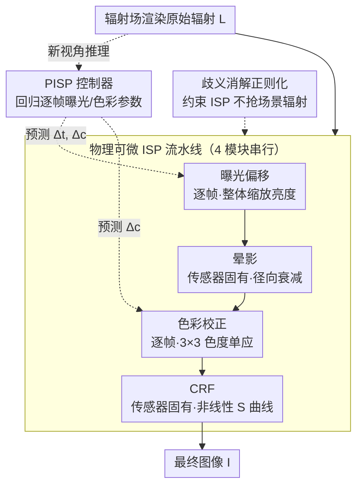

# PPISP: Physically-Plausible Compensation and Control of Photometric Variations in Radiance Field Reconstruction

**会议**: CVPR 2026  
**论文**: [CVF Open Access](https://openaccess.thecvf.com/content/CVPR2026/html/Deutsch_PPISP_Physically-Plausible_Compensation_and_Control_of_Photometric_Variations_in_Radiance_CVPR_2026_paper.html)  
**代码**: https://github.com/nv-tlabs/pisp  
**领域**: 3D视觉 / 辐射场重建 / 新视角合成  
**关键词**: 辐射场重建, 光度一致性, 可微 ISP, 新视角合成, 相机成像建模

## 一句话总结
PPISP 在辐射场重建后接一条**物理可微的 ISP 后处理流水线**（曝光偏移→晕影→色彩校正→相机响应函数），把多视角间的光度不一致拆成"传感器固有"和"逐帧可变"两类显式建模，并训练一个**控制器**像真实相机的自动曝光/自动白平衡那样为新视角预测逐帧参数，从而在没有 GT 目标图的情况下也能公平评测，在多个基准上达到 SOTA。

## 研究背景与动机
**领域现状**：3DGS / NeRF 等多视角重建方法已经能合成高保真新视角，但它们的核心假设是**光度一致性**——同一个 3D 点在不同视角下颜色应该一致。现实拍摄里，相机的光学特性（晕影、镜头）和 ISP 设置（曝光时间、白平衡）会随时间变化，导致同一场景的多张输入图在色调、亮度、对比度上互相矛盾，直接破坏这个假设。

**现有痛点**：主流补救做法是给每帧/每相机加可优化参数去吸收这些光度残差——典型如 NeRF-W 的 GLO 隐向量、URF 的仿射色彩变换、BilaRF 的双边网格。但这些方法有三个系统性问题：(1) **容量太大反而有害**——高容量、弱约束的模块虽然能拉高训练视角的 PSNR，却会"越权"建模本不属于光度变化的东西，反而劣化新视角质量；(2) **不可解释、不可控**——GLO/BilaRF 学到的参数是黑箱隐变量，想手动调亮度或白平衡无从下手；(3) **新视角参数无解**——参数是逐帧独立优化的，合成一个全新视角时根本不知道该填什么值。

**核心矛盾**：根子在于现有模块**把"传感器固有属性"和"逐帧拍摄设置"搅在了一起**。晕影、相机响应函数（CRF）是相机本身的固定特性，整段视频都一样；而曝光、白平衡是随帧变化、由 ISP 自动调节的。两者纠缠在一起，既无法泛化到新视角，又逼得评测协议必须**偷看 GT 目标图**（用仿射/二次多项式对齐后再算指标）——这既脱离真实场景（实际部署没有 GT 新视角），又掩盖了不同方法之间的真实差异。

**本文目标**：(1) 用物理可解释的方式解耦这两类效应；(2) 让新视角无需 GT 也能自动确定正确的曝光和色彩；(3) 提供直观可控的手动调节接口。

**切入角度**：既然问题源于"乱建模相机成像过程"，那就**老老实实按真实相机的图像形成流程（image formation）来建模**——曝光、晕影、色彩、CRF 各司其职，每个模块的作用域被物理约束死（如曝光模块只能整体缩放亮度），自然就解耦了。

**核心 idea**：用一条**物理接地的可微 ISP 流水线**取代黑箱外观模块，再用一个**控制器**模仿相机的自动曝光/白平衡为新视角回归逐帧参数。

## 方法详解

### 整体框架
PPISP 是一个**与重建方法无关的后处理算子**：辐射场（3DGUT / GSplat / Zip-NeRF）渲染出"原始辐射" $\mathbf{L}$ 后，再依次过四个物理模块得到最终图像 $\mathbf{I}$。训练分两阶段——第一阶段把场景表示和四个 ISP 模块**联合优化** 30k 步（每帧/每相机各自的 ISP 参数随重建一起学）；第二阶段冻结一切，只训练**控制器** 5k 步，让它学会从渲染辐射直接预测逐帧参数，这样推理新视角时就不再依赖那些"只对训练帧有效"的逐帧参数。

四个模块严格按相机成像物理顺序排列：前三个（曝光、晕影、色彩）对辐射做**线性**操作，最后 CRF 做**非线性**映射，对应 Debevec & Malik 的成像模型。其中晕影、CRF 是**传感器固有**（per-sensor，整段共享），曝光偏移、色彩校正是**逐帧可变**（per-frame）——这个 per-sensor / per-frame 的划分正是"解耦"的落点。

### 关键设计

**1. 解耦的物理 ISP 流水线：把多视角外观变化拆成"传感器固有"和"逐帧可变"两类显式建模**

针对"现有模块把相机固有属性和逐帧设置搅在一起、容量过大越权建模"的痛点，PPISP 用四个**各有物理含义且作用域被约束死**的模块替代黑箱。**曝光偏移**用一个以 2 为底的指数对辐射做整体逐帧缩放，$\mathbf{I}^{\mathrm{exp}} = \mathbf{L}\,2^{\Delta t}$，模仿摄影里的曝光值（EV），$\Delta t$ 每帧一个——它只能改整体亮度，碰不了颜色。**晕影**按 Goldman 的模型，对每个颜色通道用一个关于到光心平方距离的多项式建模径向衰减：$v(r)=\mathrm{clip}_{(0,1)}(1+\alpha_1 r^2+\alpha_2 r^4+\alpha_3 r^6)$，且光心 $\boldsymbol{\mu}$ 和系数 $\boldsymbol{\alpha}$ 都可优化（初始化为图像中心、$\boldsymbol{\alpha}=0$）；因为是逐通道的，所以能建模带色彩的晕影。**色彩校正**为了和曝光解耦，把一个 $3\times3$ 单应 $\mathbf{H}$ 作用在 RG 色度+强度上（Finlayson 表示），并对强度做归一化 $n(\mathbf{x};\mathbf{H})$ 保证变换后强度不变——这就把"调白平衡/色域"和"调亮度"彻底分开；$\mathbf{H}$ 由四个色度偏移 $\Delta\mathbf{c}_k\ (k\in\{R,G,B,W\})$ 通过定好的源/目标色度对叉积构造而成（受 DeTone 等启发）。**CRF**用分段幂曲线建模传感器辐照度到颜色的非线性映射，有四个学习参数 $(\tau,\eta,\xi,\gamma)$，S 形曲线在拐点 $\xi$ 处通过设定 $a,b$ 保证 $C^1$ 连续，再叠一个 gamma 校正 $[\cdot]^\gamma$。每个模块都"只能干自己份内的事"，物理约束天然防止它越权吸收场景信息——这正是它在新视角上不劣化的根本原因。

**2. PISP 控制器：让新视角像真实相机一样自动曝光/白平衡，摆脱对 GT 目标图的依赖**

前面的曝光偏移 $\Delta t$ 和色彩偏移 $\{\Delta\mathbf{c}_k\}$ 都是**逐帧优化**的，只对某个训练相机位姿有效，渲染一个全新视角时根本没有对应的值——这正是现有方法被迫"偷看 GT"的原因。PPISP 的解法是训一个控制器 $\mathcal{T}(\cdot)$，直接从渲染出的辐射图回归这些参数：$(\Delta t,\{\Delta\mathbf{c}_k\}) = \mathcal{T}(\mathbf{L})$，其角色就对应真实相机里的自动曝光（AE）和自动白平衡（AWB）——根据画面内容决定该曝多少、怎么调白平衡。结构上它是一个粗特征提取器（$1\times1$ 卷积 + 池化到 $5\times5$ 网格）后接一个带多个输出头的 MLP 回归器。训练放在第二阶段：场景重建和所有 per-camera ISP 参数全部冻结，让控制器预测的参数过一遍 ISP 流水线，用和第一阶段相同的光度损失训练它。这样推理时新视角无需任何 GT 像素就能自洽地确定外观，使"无 GT 的公平评测"第一次成为可能；而且可选地把曝光补偿、EXIF 偏置等标量控制 concat 进回归器输入，就能接入元数据或做手动控制。

**3. 歧义消解正则化：防止 ISP 参数"抢走"本属于场景辐射的亮度与色彩**

联合优化场景辐射和 ISP 参数时存在天然歧义——同样一张图，可以是"场景更亮+曝光更低"，也可以是"场景更暗+曝光更高"，亮度/色彩可以在两边任意搬运。不约束的话 ISP 模块会乱抢，破坏物理含义。PPISP 用 Huber 损失 $\mathcal{L}_\delta$ 加四项正则把参数钉在物理合理的范围：**亮度项**惩罚跨帧平均曝光偏移 $\frac{1}{F}\sum_f \Delta t^{(f)}$（让平均曝光趋于 0，不整体偏移）；**色彩项**惩罚跨帧平均色度偏移 $\frac{1}{F}\sum_f \Delta\mathbf{c}_k^{(f)}$；**跨通道方差项** $\mathrm{Var}_k(\boldsymbol{\theta}_{m,k})$ 收缩晕影/CRF 模块的逐通道参数方差，避免引入局部色偏；**物理晕影项**惩罚光心偏移 $\lVert\boldsymbol{\mu}_k\rVert_2^2$ 并用 $[\alpha_j]_+^2$ 软约束 $\alpha_j\le0$（保证是衰减而非增强）。总正则 $\mathcal{L}_{\mathrm{reg}}=\mathcal{L}_b+\mathcal{L}_c+\mathcal{L}_{\mathrm{var}}+\mathcal{L}_{\mathrm{vig}}$ 把"谁负责亮度、谁负责颜色"的边界守住，是物理解耦能真正成立的关键保障。

### 损失函数 / 训练策略
两阶段训练：**阶段一**联合优化辐射场 + 四个 ISP 模块共 30k 步（3DGS/3DGUT 启用 MCMC 采样），监督用光度损失 + 上述 $\mathcal{L}_{\mathrm{reg}}$；**阶段二**冻结重建和所有 per-camera ISP 参数，单独训练控制器 5k 步，用同一光度损失。整体作为后处理算子，可即插即用到 3DGUT、GSplat、Zip-NeRF 等不同辐射场方法。

## 实验关键数据

### 主实验
在 Mip-NeRF 360、Tanks & Temples、BilaRF、HDR-NeRF、Waymo（9 个静态序列）及作者自采的 PPISP 数据集（4 个场景 × 3 台相机 iPhone 13 Pro / Nikon Z7 / OM-1）上评测，指标含 PSNR、SSIM、LPIPS，以及 RawNeRF 式仿射对齐后的 **PSNR-C**（注意 PSNR-C 假定可访问 GT 目标图、会掩盖方法差异，作者明确这只是参考）。

以 3DGUT 为基座的新视角合成对比（节选 Table 1，↑越高越好 / LPIPS↓越低越好）：

| 数据集 | 方法 | PSNR↑ | PSNR-C↑ | SSIM↑ | LPIPS↓ |
|--------|------|------|------|------|------|
| BilaRF | + BilaRF | 21.41 | 25.63 | 0.764 | 0.371 |
| BilaRF | + ADOP | 22.95 | 25.73 | 0.802 | 0.376 |
| BilaRF | + PPISP (w/ ctrl.) | **24.12** | 25.92 | **0.820** | **0.349** |
| Mip-NeRF 360 | 基座 3DGUT | 27.74 | 27.65 | 0.821 | 0.262 |
| Mip-NeRF 360 | + BilaRF | 24.97 | 26.64 | 0.801 | 0.260 |
| Mip-NeRF 360 | + PPISP (w/ ctrl.) | **28.15** | **28.06** | 0.821 | 0.264 |
| Tanks & Temples | + BilaRF | 19.78 | 23.46 | 0.770 | 0.298 |
| Tanks & Temples | + ADOP | 20.28 | 24.20 | 0.769 | 0.323 |
| Tanks & Temples | + PPISP (w/ ctrl.) | **24.62** | **25.25** | **0.809** | **0.285** |

关键观察：在 Tanks & Temples 上 PPISP 的 PSNR（24.62）甚至高出 BilaRF 偷看 GT 后的 PSNR-C（23.46）将近 1.2 dB；在 Mip-NeRF 360 这种本就光度变化小的数据集上，BilaRF/ADOP 这类高容量模块反而把基座的 27.74 拖到 24.97/26.42，而 PPISP 不降反升到 28.15——印证了"容量越权"的痛点。这些增益从 3DGUT 同样迁移到 3DGS、Zip-NeRF 基座。

### 消融实验
核心消融是控制器的有无（w/o ctrl. 表示新视角用零逐帧校正），以及 PSNR 与 PSNR-C 的差距：

| 配置 | 关键现象 | 说明 |
|------|---------|------|
| PPISP w/o ctrl. | 新视角只能用零校正 | 作为不预测逐帧参数的下限 |
| PPISP w/ ctrl. | PSNR 接近 PSNR-C | 控制器学到的 AE/AWB 几乎等价于事后偷看 GT 做仿射对齐 |

以 Tanks & Temples / 3DGUT 为例：w/o ctrl. PSNR 21.52 → w/ ctrl. 24.62，控制器带来约 3.1 dB 提升；多数数据集上 w/ ctrl. 的 PSNR 已逼近其 PSNR-C，说明控制器**忠实预测了每帧所需的外观校正**，BilaRF 数据集是唯一明显例外。论文另有容量-过拟合分析（Sec. 5.4）佐证"高容量外观模块在训练视角刷高 PSNR 却劣化新视角"的结论。

### 关键发现
- 控制器是新视角质量的最大贡献者：去掉后新视角只能零校正，掉点最多（Tanks & Temples 上约 3 dB）。
- 物理约束 + 正则化让 PPISP 在"光度变化小"的数据集上也不拖累基座，而黑箱方法在这类数据集上普遍掉点——容量越权是真实存在的陷阱。
- PSNR 与 PSNR-C 的接近程度，可直接当作"控制器是否学会了真实相机 AE/AWB 行为"的量度。

## 亮点与洞察
- **把评测协议的"作弊"摆上台面**：作者明确指出现有协议偷看 GT 做仿射对齐既不现实又掩盖方法差异，用 PSNR vs PSNR-C 的对比把这件事量化出来，再用控制器让"无 GT 评测"真正可行——这是方法论层面的贡献，不只是刷点。
- **物理约束即正则**：四个模块"各管一段、互不越权"本身就是最强的归纳偏置，比"加正则压容量"更治本——这解释了为什么在光度变化小的数据集上它不降反升。
- **控制器=可学习的 AE/AWB**：把相机里成熟的自动曝光/白平衡机制搬进辐射场后处理，思路可迁移到任何需要"为新视角决定外观"的渲染任务（重光照、HDR 合成、跨相机重建）。
- 可即插即用到 3DGUT/GSplat/Zip-NeRF，且支持把 EXIF 等元数据 concat 进控制器，工程落地友好。

## 局限与展望
- 控制器在 BilaRF 数据集上出现明显偏差（PSNR 与 PSNR-C 差距最大），说明对某些复杂逐像素光度变化，纯逐帧全局参数的控制器表达力不足。
- 流水线建模的是相对"规整"的 ISP 效应（曝光/晕影/白平衡/CRF），对局部色彩漂移、强非线性 tone mapping 仍可能力有不逮（论文专门加了跨通道方差正则来压局部色偏，侧面说明这是隐患）。
- 自采 PPISP 数据集仅 4 场景 × 3 相机，规模有限；ADOP 基线为稳定性把 CRF 正则强度调高了约 100×，跨方法比较存在实现层面的 caveat。
- 改进方向：把控制器从全局参数扩展到空间自适应（但需谨慎，否则又落回"高容量越权"的老问题）；引入更丰富的相机元数据先验。

## 相关工作与启发
- **vs GLO（NeRF-W）/ GS-W**：它们用逐图隐向量吸收外观差异，平滑但黑箱、易把几何/反射率纠缠进去，且新视角参数无解；PPISP 用物理模块解耦、控制器解决新视角参数问题。
- **vs URF / BilaRF**：URF 用逐图仿射色彩、BilaRF 用双边网格逐像素仿射，容量大但不可解释、新视角需偷看 GT；PPISP 容量受物理约束、可控、无需 GT。
- **vs ADOP**：最接近本文，同样显式建模曝光/白平衡/CRF/晕影，但 PPISP 更好地解耦曝光偏移与白平衡、用更紧凑的 CRF 模型，且新增控制器预测新视角参数。
- **vs HDR-NeRF / Huang et al. / Niemeyer et al.**：后者从多曝光恢复 CRF 或学习 3D 曝光神经场（逐 3D 点预测曝光）；PPISP 走逐帧+控制器路线，更贴近真实相机 AE/AWB 的语义。

## 评分
- 新颖性: ⭐⭐⭐⭐ 物理解耦 ISP + 控制器解决新视角参数与无 GT 评测，思路扎实且切中现有协议的痛点。
- 实验充分度: ⭐⭐⭐⭐⭐ 5+ 公开数据集 + 自采多相机数据集，覆盖 3DGUT/3DGS/Zip-NeRF 三种基座，PSNR/PSNR-C 对比设计巧妙。
- 写作质量: ⭐⭐⭐⭐ 物理建模交代清楚、公式完整，模块众多但逻辑顺畅。
- 价值: ⭐⭐⭐⭐⭐ 即插即用、可控、推动无 GT 公平评测，对真实场景重建落地价值高。

<!-- RELATED:START -->

## 相关论文

- [\[CVPR 2026\] Recovering Physically Plausible Human-Object Interactions from Monocular Videos](recovering_physically_plausible_human-object_interactions_from_monocular_videos.md)
- [\[CVPR 2026\] Geometric-Photometric Event-based 3D Gaussian Ray Tracing](geometric-photometric_event-based_3d_gaussian_ray_tracing.md)
- [\[CVPR 2026\] Radiance Meshes for Volumetric Reconstruction](radiance_meshes_for_volumetric_reconstruction.md)
- [\[CVPR 2026\] DiffSoup: Direct Differentiable Rasterization of Triangle Soup for Extreme Radiance Field Simplification](diffsoup_direct_differentiable_rasterization_of_triangle_soup_for_extreme_radian.md)
- [\[CVPR 2026\] OLATverse: A Large-scale Real-world Object Dataset with Precise Lighting Control](olatverse_a_large-scale_real-world_object_dataset_with_precise_lighting_control.md)

<!-- RELATED:END -->
