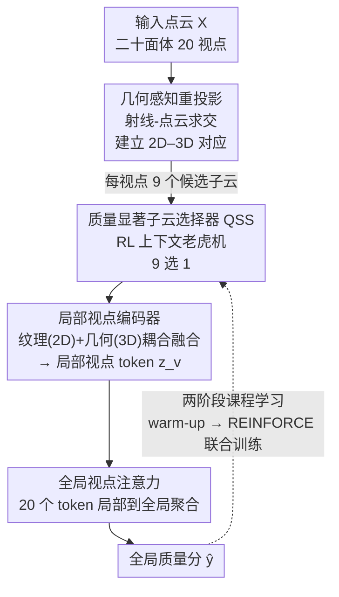

# R3-PCQA: Ray-Reprojection-Reinforcement for No-Reference 3D Point Cloud Quality Assessment

**会议**: CVPR 2026  
**论文**: [CVF Open Access](https://openaccess.thecvf.com/content/CVPR2026/html/Seo_R3-PCQA_Ray-Reprojection-Reinforcement_for_No-Reference_3D_Point_Cloud_Quality_Assessment_CVPR_2026_paper.html)  
**代码**: 无  
**领域**: 3D视觉  
**关键词**: 点云质量评估, 无参考质量评估, 强化学习, 多视角融合, 人类视觉系统  

## 一句话总结
R3-PCQA 把人类视觉感知 3D 物体的三个机制（视点依赖、选择性注意、多视角整合）显式编码进无参考点云质量评估流程：用射线-点云求交建立精确的 2D–3D 对应、用强化学习的上下文老虎机自适应挑选最关键的局部子云、再用全局视点注意力做局部到全局聚合，在 SJTU-PCQA / WPC / WPC2.0 三个基准上全面达到 SOTA。

## 研究背景与动机
**领域现状**：点云在自动驾驶、LiDAR 感知、AR/VR 中越来越常见，但从采集、压缩到传输、渲染都会引入失真。无参考点云质量评估（NR-PCQA）要在没有原始无损点云的情况下预测人眼主观分（MOS）。近期主流是多模态方法：同时吃 2D 投影图和 3D 点云，如 MM-PCQA（后期融合）、MFT-PCQA（Transformer 融合）。

**现有痛点**：这些方法几乎都把 2D 投影和 3D 点云当成两个**独立模态**，再用简单粗暴的特征拼接来融合。这样做有两个根本缺陷：其一，没有在 2D 和 3D 之间建立**几何对应**，无法刻画"3D 空间里的失真如何在 2D 投影上显现、反之亦然"，等于丢掉了视点依赖（viewpoint-dependent）的感知机制；其二，对全局做均匀平均，忽略了人眼的**选择性注意**——人不会对一个物体的所有区域平均打分，而是被局部退化、细节缺失的区域主导整体判断。

**核心矛盾**：人类视觉系统（HVS）整体性地处理 3D 刺激，把表面几何和纹理当成**感知上不可分**的一体；但现有方法在工程上把它们解耦了，导致建出来的"多视角"流程并不是真正认知意义上的多视角整合。

**本文目标**：设计一个显式建模 HVS 三大机制的评估框架——(1) 视点依赖处理，(2) 选择性注意，(3) 多视角整合。

**切入角度**：作者的关键观察是"2D 像素和 3D 子云之间本该有精确的空间对应"。只要从规则二十面体的视点投射射线，求射线与点云的交点，就能把每个 2D 关键像素锚定到它对应的、该视点可见的 3D 局部子云，从而把纹理失真（2D 细粒度）和几何失真（3D 粗粒度）耦合到同一个视点上。

**核心 idea**：用"射线重投影建立 2D–3D 对应 + 强化学习挑选质量显著子云 + 全局视点注意力聚合"替代"把 2D/3D 当独立模态做朴素拼接"，让质量评估流程真正模拟人眼感知 3D 的方式。

## 方法详解

### 整体框架
R3-PCQA 是一个端到端的 NR-PCQA 框架。给定一个点云 $X$，先从二十面体的 $V=20$ 个均匀视点做投影得到 2D 图像 $I_v$，并通过**几何感知重投影**在每个视点上建立 2D 像素 → 3D 子云的精确对应（每视点得到 $N=9$ 个候选子云）。这些候选送进**局部视点编码器**，其中内嵌的 **QSS（质量显著子云选择器）** 用强化学习的策略网络，根据该视点的 2D 上下文从 9 个候选里只挑出**一个**最可能决定质量的子云；选中子云的几何特征与 2D 纹理特征融合，生成该视点的"局部视点 token" $z_v$。最后**全局视点注意力**把所有视点的 token 自适应聚合，预测全局质量分 $\hat{y}$。整个模型用**两阶段课程学习**训练：先 warm-up（关掉 QSS、随机选子云）让编码器学到通用表征，再激活 QSS 用 REINFORCE 联合训练策略。

### 关键设计

**1. 几何感知重投影：用射线-点云求交建立精确的 2D–3D 对应**

朴素融合的根子在于 2D 和 3D 没对齐——你不知道投影图上某个像素到底对应 3D 里哪块点。本文用两步解决。**投影**：把点云放进二十面体，相机摆在每个面的中心，得到 $V=20$ 个均匀分布的视点；每个视点把 $X$ 投成一张 2D RGB 图 $I_v$，并存下相机内参 $K_v$、外参 $[R_v|t_v]$，记世界到相机矩阵 $c_v = K_v[R_v|t_v]$。**重投影**：在 $I_v$ 上对有效深度像素跑 K-means，取 $N=9$ 个簇中心 $\{p_{v,n}\}$ 作为候选像素（既高效又保证视点内空间覆盖）。对每个 $p_{v,n}$，用 $K_v^{-1}$ 反投影、$R_v^{\top}$ 旋转得到单位方向 $d_{v,n}$，从相机中心 $o_v$ 射出射线 $r_{v,n}(s)=o_v+s\,d_{v,n}$；在距射线阈值 $\rho$ 内、离相机最近的种子点为

$$x_{v,n}=\underset{x\in X}{\arg\min}\left(\|x-o_v\|_2 : \min_{s\ge 0}\|x-r_{v,n}(s)\|_2\le\rho\right).$$

再以种子点做 KNN 取 $M=8192$ 个点的子云 $X_{v,n}=\mathrm{KNN}(x_{v,n};X,M)$。这样每个视点都得到 $N$ 组 $(p_{v,n}, X_{v,n})$ 把 2D 像素和它视点可见的 3D 子云硬绑在一起——后面的纹理失真（来自 2D）和几何失真（来自 3D）就能在同一个空间位置上耦合，而不是各算各的再拼。

**2. 质量显著子云选择器 QSS：用强化学习只挑那一块最该看的区域**

人眼不会平均打量整个物体，而是盯着退化最明显的局部；可现有方法要么全局均匀平均、要么用和感知质量无关的准则评估局部。QSS 把"在每个视点从 9 个候选子云里挑 1 个最关键的"建模成**上下文老虎机**（contextual bandit，这也是首次把 RL 引入 PCQA）。三要素：**上下文** $H_v$ 是从 2D 编码器 $\mathcal{E}^{\text{rgb}}$ 的中间特征图上、以各候选像素 $p_{v,n}$ 为中心裁出的 $11\times11$ 局部 patch 集合；**动作空间** $A_v$ 中每个动作 $a_{v,n}$ 对应选第 $n$ 个子云；**策略** $\pi_\theta(a_{v,n}|H_v)$ 给出选择概率。策略网络先用 CNN 把每个 patch 嵌入，再用多头自注意力 MSA 捕捉候选间关系，policy head 输出 logits $s_v$，经温度软化的 softmax 得到分布 $\pi_\theta(a_{v,n}|H_v)=\mathrm{Softmax}(s_v/\tau)$。训练时从分布采样动作做探索，推理时取 $\arg\max$ 做利用。只选 1 个而非评估全部 9 个，既省算力又聚焦于真正与质量相关的区域、还能抑制无关区域的噪声——消融里 RL 选择比"用全部子云"的两个 baseline 都更准且更省 FLOPs。

**3. 耦合几何-纹理的局部视点编码器：把粗几何失真和细纹理失真融在一个 token 里**

选中子云 $X_{v,n^*}$ 后，3D 几何编码器 $\mathcal{E}^{\text{pc}}$ 提其几何特征 $F^{\text{pc}}_v$（强调粗粒度几何失真），2D 视觉编码器 $\mathcal{E}^{\text{rgb}}$ 提投影图 $I_v$ 的纹理特征 $F^{\text{rgb}}_v$（强调细粒度纹理失真），二者互补。拼接后过 MLP 融合层得 $F_v=\text{Fusion}(F^{\text{rgb}}_v\oplus F^{\text{pc}}_v)$；同时一个局部回归器预测该视点的局部质量分 $\hat{y}^{\text{local}}_v$ 作辅助任务，把它和 $F_v$ 拼成局部视点 token $z_v=\hat{y}^{\text{local}}_v\oplus F_v$。编码器参数在所有视点间共享，学到视点无关、可泛化的表征，也提升参数效率。这一步是"视点依赖处理"的落地：每个 token 都耦合了同一空间位置上的几何+纹理证据。

**4. 全局视点注意力：局部到全局的自适应聚合，自动学出"该重点看哪个视点"**

有了 20 个局部 token，怎么合成一个全局分？把它们堆成矩阵 $Z=[z_1,\dots,z_V]^{\top}\in\mathbb{R}^{V\times(D+1)}$，先均值池化得到初始全局上下文 token $g=\frac{1}{V}\sum_v z_v$，再以 $g$ 为 query、$Z$ 为 key/value 做多头注意力，得到精炼上下文 $\tilde{g}$ 和注意力权重 $\{\alpha_v\}$，最后 $\hat{y}=\text{GlobalRegressor}(\tilde{g}\oplus g)$。由于每个 token 同时含 $\hat{y}^{\text{local}}_v$ 和 $F_v$，这是真正的"局部到全局聚合"——模型自动学到哪些视点对质量判断更重要并加权。可视化显示这套注意力还会随物体质量自适应：中高质量物体（MOS > 40）呈负相关（给低质量视点更高权重，类似"木桶理论"，被最差视角主导）；低质量物体（MOS < 40）呈正相关或弱负相关（失真全方位时综合多视角而非只信单个最差视角）。

**5. 两阶段课程学习 + REINFORCE 的信用分配奖励**

从一开始就同时训策略网络和编码器会因初始随机策略导致梯度不稳、方差高、难收敛，所以用课程学习。**Warm-up 阶段**关掉 QSS，每视点从 9 个候选里随机选一个，让局部编码器先学到稳定通用的表征，损失为 $\mathcal{L}_{\text{warm-up}}=\mathcal{L}_{\text{global}}+\mathcal{L}_{\text{local}}$，其中 $\mathcal{L}_{\text{global}}=\frac{1}{B}\sum_b(\hat{y}_b-y_b)^2$ 是主目标，$\mathcal{L}_{\text{local}}=\frac{1}{BV}\sum_{b,v}(\hat{y}^{\text{local}}_{b,v}-y_b)^2$ 用整体 MOS 当各视点的粗标签做弱监督正则、防过拟合并带来可解释性。**联合训练阶段**激活 QSS，加上策略梯度损失 $\mathcal{L}_{\text{joint}}=\mathcal{L}_{\text{global}}+\mathcal{L}_{\text{local}}+\mathcal{L}_{\text{policy}}$。奖励基于全局预测精度：

$$r_b=\exp\left(-\frac{s\cdot|\hat{y}_b-y_b|}{\sigma}\right)\in[0,1],$$

其中 $\sigma=15$ 是归一化预测误差的内在误差尺度、$s=100$ 是考虑 MOS 量程的缩放因子。关键的**信用分配**：把奖励按全局注意力权重分到每个视点 $r_{b,v}=r_b\cdot\alpha_{b,v}$——某视点若被注意力赋予高权重（对全局贡献大），它的策略就得到更强的学习信号，被训练去选那块能捕捉到失真的子云。最终策略损失为

$$\mathcal{L}_{\text{policy}}=-\frac{1}{BV}\sum_{b,v}\log\pi_\theta(a_{b,v,n^*}|H_{b,v})\cdot r_{b,v},$$

其中 $r_{b,v}$ 从计算图分离、当常数处理（标准 REINFORCE 做法）。

### 损失函数 / 训练策略
- Warm-up：$\mathcal{L}_{\text{warm-up}}=\mathcal{L}_{\text{global}}+\mathcal{L}_{\text{local}}$，QSS 关闭、随机选子云。
- 联合训练：$\mathcal{L}_{\text{joint}}=\mathcal{L}_{\text{global}}+\mathcal{L}_{\text{local}}+\mathcal{L}_{\text{policy}}$，QSS 激活、REINFORCE 训策略。
- 关键超参：$V=20$ 视点、$N=9$ 候选、$M=8192$ 子云点数、$\sigma=15$、$s=100$、softmax 温度 $\tau$。

## 实验关键数据

### 主实验
在 SJTU-PCQA（9 参考 / 378 失真样本）、WPC（20 参考 / 740）、WPC2.0（16 参考 / 400，V-PCC 压缩）三库做交叉验证（分别 9/5/4 折，约 8:2），指标用 SRCC↑、PLCC↑、RMSE↓。对比 14 个方法（7 个全参考 FR + 7 个无参考 NR），R3-PCQA 三库全面 SOTA。

| 数据集 | 指标 | R3-PCQA | 之前最好 NR（MM-PCQA / GMS-3DQA） | 提升 |
|--------|------|---------|-----------------------------------|------|
| SJTU-PCQA | SRCC | **0.9401** | 0.9108 (GMS-3DQA) | +0.029 |
| SJTU-PCQA | PLCC | **0.9606** | 0.9226 (MM-PCQA) | +0.038 |
| WPC | SRCC | **0.9017** | 0.8414 (MM-PCQA) | +0.060 |
| WPC | PLCC | **0.8882** | 0.8556 (MM-PCQA) | +0.033 |
| WPC2.0 | SRCC | **0.8693** | 0.8272 (GMS-3DQA) | +0.042 |
| WPC2.0 | PLCC | **0.8650** | 0.8218 (GMS-3DQA) | +0.043 |

**跨库泛化**（PLCC，整库训整库测）：4 个跨库场景里 3 个最优。WPC→WPC2.0 达 0.920、WPC→SJTU 达 0.721，均超 MM-PCQA；只有 SJTU→WPC 略低（0.273 vs MM-PCQA 0.351），作者归因于 SJTU 最小、物体类别与失真生成方式和 WPC 差异大、域差距显著。

### 消融实验
均在最大基准 WPC 上、5 折交叉验证。

| 配置 | SRCC | PLCC | 说明 |
|------|------|------|------|
| 仅 3D 点云 | 0.7334 | 0.7405 | 只有粗几何失真 |
| 仅 2D 投影 | 0.8868 | 0.8746 | 只有细纹理失真（已超多数 baseline） |
| 2D + 3D 融合（Full） | **0.9017** | **0.8882** | 两模态互补 |

| 损失组合 | SRCC | PLCC | 说明 |
|----------|------|------|------|
| 仅 $\mathcal{L}_{\text{global}}$ | 0.8644 | 0.8716 | 基线 |
| $+\mathcal{L}_{\text{local}}$ | 0.8806 | 0.8666 | 加各视点弱监督 |
| $+\mathcal{L}_{\text{policy}}$ | 0.8880 | 0.8853 | 加策略学习 |
| 三者全用（Full） | **0.9017** | **0.8882** | 各组件均有贡献 |

| 子云选择方式 | SRCC | PLCC | GFLOPs↓ | 说明 |
|--------------|------|------|---------|------|
| Fusion-910（拼全部 910×9） | 0.8846 | 0.8694 | 182.93 | 严格同输入量对照 |
| Fusion-8192（全部子云均值池化） | 0.8816 | 0.8731 | 479.32 | 保留全部点 |
| Ours（RL 选 1 个） | **0.9017** | **0.8882** | 232.36 | 选质量显著区域 |

### 关键发现
- **模态互补但 2D 更强**：单 2D（0.8868）已远超单 3D（0.7334），说明细纹理失真信息量更大；但融合两者才到最优，验证粗几何+细纹理互补。
- **RL 选择既准又省**：只选 1 个子云比把 9 个全拼/全池化都更准，FLOPs 也介于两者之间，证明"挑关键区域"优于"看全部"。
- **注意力随质量自适应**：中高质量物体被最差视角主导（木桶理论），低质量物体综合多视角——无显式监督就学出了符合直觉的策略。
- **策略可分性**：训练前选中/未选中子云的上下文 $H'_v$ 在 PCA 里混在一起，训练后清晰可分，说明策略确实学会了辨认质量显著区域。

## 亮点与洞察
- **把 HVS 三机制逐条工程化**：视点依赖→几何感知重投影、选择性注意→RL 子云选择、多视角整合→全局视点注意力，动机到设计一一对应，不是空喊"对齐人类感知"。
- **射线-点云求交建立 2D–3D 对应**：用渲染/几何里成熟的 ray casting 把 2D 关键像素硬锚到 3D 子云，干净地解决了多模态没对齐的老问题，这套对应思路可迁移到其他需要 2D–3D 关联的点云任务（如点云分割质量、压缩失真定位）。
- **首次把 RL 引入 PCQA，且用上下文老虎机而非完整 MDP**：质量评估里"选哪块看"本就是单步决策，老虎机建模轻量又贴切；按全局注意力权重做信用分配（$r_{b,v}=r_b\cdot\alpha_{b,v}$）是很巧的"哪个视点更重要就给它更强训练信号"的设计。
- **课程学习治 RL 不稳**：先 warm-up 稳住表征再激活策略，是把 RL 嵌进监督回归框架的实用配方，可复用到其他"主任务监督 + 子模块 RL 选择"的结构。

## 局限与展望
- **依赖固定的二十面体 20 视点 + 每视点 9 候选**：视点数、候选数、子云大小 $M=8192$ 都是固定超参，对不同尺度/稀疏度的点云是否最优未讨论。
- **奖励里 $\sigma=15$、$s=100$ 是按 MOS 量程手调的常数**，换数据集/标注尺度可能需要重调，缺少对其敏感性的分析。
- **SJTU 上训练时所有方法都差**：跨库 SJTU→WPC 反而不如 MM-PCQA，说明小数据集上该框架的优势会被域差距吃掉，泛化到全新物体类别仍受限。
- **计算开销**：20 视点 × 投影 + 射线求交 + KNN 的预处理流水线偏重，论文给了推理 FLOPs 但没报实际预处理耗时，落地实时性存疑。
- 可改进方向：让视点/候选数自适应物体复杂度；把上下文老虎机扩成多步选择（先粗选视点再选子云）；在奖励里显式建模感知不确定性。

## 相关工作与启发
- **vs MM-PCQA**：MM-PCQA 把 2D 投影和 3D 点云做后期（late）拼接融合，没有几何对应；R3-PCQA 用射线重投影先建立精确 2D–3D 对应再融合，且只在质量显著子云上融合。三库 SRCC/PLCC 全面领先（WPC SRCC 0.9017 vs 0.8414）。
- **vs GMS-3DQA / MFT-PCQA**：同为多模态/多视角，但它们多用均匀采样或 Transformer 朴素整合，缺"选择性注意"；R3-PCQA 用 RL 显式挑选关键子云，消融证明优于把全部子云拼接/池化。
- **vs PointNet++ 系下采样**：传统 FPS/KNN 层次采样是为了高效处理稠密点云、保留几何；本文的 KNN 子云提取是为了在射线锚定的种子点周围取局部、服务于质量评估，目的不同。
- 启发：质量评估类任务（图像/视频/3D）普遍面临"看全部太贵、平均又丢掉关键退化区"的矛盾，R3-PCQA 的"上下文老虎机 + 注意力信用分配"提供了一个可迁移的"自适应挑关键区域"范式。

## 评分
- 新颖性: ⭐⭐⭐⭐⭐ 首次把 RL（上下文老虎机）引入 PCQA，且射线重投影建立 2D–3D 对应的思路干净。
- 实验充分度: ⭐⭐⭐⭐ 三库 + 跨库 + 三组消融 + 两类可视化，扎实；但缺少对关键超参（视点数、$\sigma$/$s$、$M$）的敏感性分析。
- 写作质量: ⭐⭐⭐⭐⭐ 动机—机制—设计逐条对应，HVS 三机制贯穿全文，逻辑清晰。
- 价值: ⭐⭐⭐⭐ NR-PCQA 三库刷到 SOTA 且泛化好，"自适应挑关键区域"范式对质量评估类任务有借鉴价值，但预处理偏重、落地实时性待验证。

<!-- RELATED:START -->

## 相关论文

- [\[CVPR 2026\] QD-PCQA: Quality-Aware Domain Adaptation for Point Cloud Quality Assessment](qd-pcqa_quality-aware_domain_adaptation_for_point_cloud_quality_assessment.md)
- [\[CVPR 2026\] PR-IQA: Partial-Reference Image Quality Assessment for Diffusion-Based Novel View Synthesis](pr-iqa_partial-reference_image_quality_assessment_for_diffusion-based_novel_view.md)
- [\[CVPR 2026\] No Calibration, No Depth, No Problem: Cross-Sensor View Synthesis with 3D Consistency](no_calibration_no_depth_no_problem_cross-sensor_view_synthesis_with_3d_consisten.md)
- [\[CVPR 2026\] Underground Plant Exploration: Non-Destructive 3D Root Assessment with GPR Based on Point Graph Neural Network](underground_plant_exploration_non-destructive_3d_root_assessment_with_gpr_based_.md)
- [\[CVPR 2026\] SuP: Sub-cloud Driven Point Cloud Registration](sup_sub-cloud_driven_point_cloud_registration.md)

<!-- RELATED:END -->
