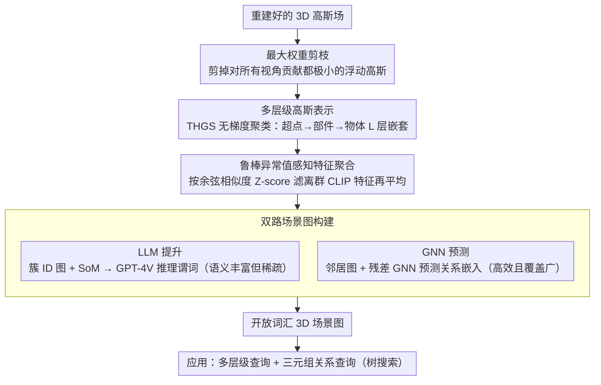

# ReLaGS: Relational Language Gaussian Splatting

**会议**: CVPR2026  
**arXiv**: [2603.17605](https://arxiv.org/abs/2603.17605)  
**代码**: [项目主页](https://dfki-av.github.io/ReLaGS/)  
**领域**: 3D视觉  
**关键词**: 3D高斯溅射, 开放词汇, 3D场景图, 层级语义, 关系推理, 无训练

## 一句话总结

提出首个统一多层级语言高斯场与开放词汇3D场景图的无训练框架 ReLaGS，通过最大权重剪枝和鲁棒异常值感知特征聚合改进场景表示，结合GNN关系预测实现高效的结构化3D场景理解。

## 研究背景与动机

**辐射场缺乏语义**：NeRF/3DGS 虽然在几何和光度重建上表现优异，但缺乏场景语义信息，无法支持高层推理任务（导航、编辑、问答）。

**语言场蒸馏的局限**：现有语言场方法（LangSplat、LERF等）仅编码"有什么物体"，无法处理涉及空间关系的查询如"选择笔记本电脑旁边的杯子"，因为它们是**单层级、孤立的**——缺乏层级语义和实体间关系。

**缺乏层级粒度**：用户可能描述整体物体（"拉面"）或其部件（"面条"），单一语义粒度无法区分部件级与物体级查询，难以适应自然语言的模糊性。

**关系建模代价高**：RelationField 通过射线对学习关系但需要数小时逐场景训练、渲染低于10fps；SplatTalk 需要 LLM 分词和 LoRA 微调，成本高昂。

**多视角特征不一致**：SAM 掩码在不同视角间存在不一致性，CLIP 特征噪声大，直接平均聚合会导致物体嵌入被离群值污染。

**场景图方法受限**：ConceptGraphs 依赖昂贵的 LLM 推理且输出文本图；GaussianGraph 需要逐场景训练；Open3DSG 受限于预分割点云——缺乏统一高效的开放词汇3D场景图方案。

## 方法详解

### 整体框架

ReLaGS 要在一个已经重建好的高斯场上，既给出多粒度的开放词汇语义、又显式建出物体间的关系图，而且全程不做逐场景训练。它分三步走：先用最大权重剪枝净化几何，去掉那些对任何训练视角都几乎没贡献的浮动高斯；再沿"超点→子部件→部件→物体"做无梯度分层聚类（基于 THGS），配合一套异常值感知的特征聚合得到可靠的语言嵌入；最后在这套层级表示上搭开放词汇 3D 场景图，关系既可由 LLM 标注、也可由 GNN 预测。

### 关键设计

**1. 最大权重剪枝：先把污染几何的浮动高斯清掉**

边界处和遮挡区域常残留一批对任何视角都几乎没贡献的浮动高斯，它们既扰乱几何、又会带歪后续聚类。ReLaGS 为每个高斯 $G_i$ 算出它在所有视角、所有像素上的最大贡献权重 $\omega_i^{\max} = \max_{c,p} w_{i,p}^{(c)}$，把 $\omega_i^{\max} < \tau_{contrib}$ 的直接剪掉。这一步看似简单，却是消融里贡献最大的单项（+6.16 mIoU），因为干净的几何是后面所有语义和关系推理的地基。

**2. 多层级高斯表示：用一棵层级树同时回答物体级和部件级查询**

用户既可能说"拉面"也可能说"面条"，单一语义粒度根本分不清部件级和物体级的查询。ReLaGS 沿用 THGS 的无梯度聚类搭这棵层级树：先用 Cut Pursuit 把高斯切成几何一致的超点，再按 SAM 掩码先验逐级合并，得到 $L$ 层嵌套层级 $\mathcal{S}^{(1)}, \dots, \mathcal{S}^{(L)}$——低层是细粒度部件、高层是完整物体，并借像素→主导高斯映射 $G^*_{(u,v)} = \arg\max_i w_i$ 建立一致的 2D-3D 对应。查询时走一套树搜索：从根节点出发，若某子节点与查询的相似度更高就向下走，从而自动判断该用哪个粒度回答。

**3. 鲁棒异常值感知特征聚合：让物体语言嵌入不被离群 CLIP 特征带偏**

层级聚类定好了每个物体由哪些高斯组成，但要给它配一个可靠的语言嵌入并不容易：SAM 掩码在不同视角间本就不一致、CLIP 特征又噪声大，直接平均聚合很容易让物体嵌入被几个离群视角污染。ROFA 的做法是：对一个物体在 $\mathcal{C}_{obj}$ 个视角中的 CLIP 特征 $\{f_i\}$，先算每个特征与其余特征的平均余弦相似度 $s_i$，再做 Z-score 标准化 $z_i = (s_i - \mu_s)/\sigma_s$，把 $z_i < -\tau_{lang}$ 的离群特征滤掉，只对剩下一致的那批取平均。阈值取 $\tau_{lang}=3$ 时最稳，在密集遮挡场景里提升尤其明显。

**4. 双路场景图构建：LLM 提升管语义、GNN 预测管覆盖**

关系获取分两条互补路径。**LLM 提升路径**渲染视角一致的簇 ID 图、做 SoM 标记后交给 GPT-4V 推理关系谓词，取 top-$k_p$ 频率谓词、Jina 编码后平均作为边嵌入——语义丰富但稀疏。**GNN 预测路径**则在距离阈值内的邻居图上用残差图神经网络预测关系嵌入 $\hat{f}_{ij} = f'_{ij} + \mathcal{F}_\theta(f_v^{src}, f_v^{dst}, f'_{ij})$，在 3RScan 上用对比学习预训练后直接泛化到新场景——高效且可扩展。两条路一稀疏一密集，正好互补。

### 损失函数

GNN 用**对比学习损失**预训练，目标是把预测的关系嵌入与真实关系嵌入在 Jina 嵌入空间里对齐；除此之外整个框架无需逐场景的梯度优化损失。

## 实验

### 3D场景图预测 (3DSSG/RIO10)

| 方法 | Object R@5 | Object R@10 | Predicate R@3 | Predicate R@5 | 场景无关 |
|------|-----------|------------|--------------|--------------|---------|
| ConceptGraphs | 0.37 | 0.46 | 0.74 | 0.79 | ✗ |
| RelationField | 0.69 | 0.80 | 0.76 | 0.82 | ✗ |
| Open3DSG | 0.56 | 0.61 | 0.58 | 0.65 | ✓ |
| **ReLaGS (GNN)** | **0.68** | **0.79** | **0.79** | **0.87** | **✓** |

- ReLaGS 的关系预测超越 RelationField +0.3 R@3 / +0.5 R@5，且无需逐场景训练
- 比 RelationField **快4.7倍、省7.6倍GPU显存**（7.5GB vs 32GB）

### 关系引导的3D实例分割 (ScanNet++)

| 方法 | mIoU | 场景无关 |
|------|------|---------|
| LERF | 0.25 | ✗ |
| OpenNeRF | 0.45 | ✗ |
| LangSplat | 0.49 | ✗ |
| RelationField | 0.53 | ✗ |
| THGS | 0.29 | ✓ |
| **ReLaGS** | **0.56** | **✓** |

### 开放词汇分割 (LERF-OVS)

| 方法 | Figurines | Ramen | Teatime | Waldo | Mean | 无训练 |
|------|-----------|-------|---------|-------|------|-------|
| LAGA | 64.1 | 55.6 | 70.9 | 65.6 | 64.0 | ✗ |
| THGS | 57.3 | 43.5 | 68.3 | 50.7 | 54.9 | ✓ |
| VALA | 59.9 | 51.5 | 70.2 | 65.1 | 61.7 | ✓ |
| **ReLaGS** | **64.7** | 51.2 | **81.0** | 60.6 | **64.4** | **✓** |

### 消融实验

| 配置 | Figurines | Ramen | Teatime | Kitchen | Mean |
|------|-----------|-------|---------|---------|------|
| Baseline | 52.05 | 47.19 | 76.77 | 47.50 | 55.88 |
| +MWP | 59.16 | 47.41 | 80.98 | 60.59 | 62.04 |
| +MWP+ROFA (完整) | 64.69 | 51.15 | 80.98 | 60.60 | 64.36 |

### 关键发现

- MWP 贡献最大（+6.16 mIoU），去除浮动高斯对几何和下游聚类至关重要
- ROFA 在密集遮挡场景（Figurines +5.53, Ramen +3.74）效果显著
- $\tau_{lang}=3$ 是最优阈值，过低过高均损害性能
- GNN跨数据集泛化良好（3RScan → ScanNet++），语言高斯与点云特征的模态差距小
- 全流程约12.6分钟完成（场景重建11min + 语言蒸馏1.5min + 场景图0.1min），渲染200+ fps

## 亮点

- **首个统一框架**：同时实现多层级语义层次和开放词汇关系推理，兼顾"有什么"、"怎么组成"、"如何关联"
- **完全无需逐场景训练**：比 RelationField 快4.7倍、省7.6倍显存，实现真正可扩展的3D理解
- **MWP + ROFA 组合巧妙**：分别净化几何和语义，简单有效，消融验证充分
- **双路场景图设计**：LLM提升提供语义丰富边，GNN预测提供高效覆盖，互补性强
- **树搜索查询**：自动适配查询粒度，统一物体级和部件级发现

## 局限性

- ROFA 依赖 Z-score 阈值 $\tau_{lang}$，需对每个数据集调参；在极端视角稀疏场景中可能不够鲁棒
- GNN 预训练在 3RScan 的27类关系上，开放词汇关系的真正泛化能力（如罕见谓词）未被充分验证
- ScanNet 3D语义分割提升有限（因评估协议要求固定高斯数量，MWP 被禁用）
- LLM提升路径依赖 GPT-4V，成本高且可复现性受限
- 未涉及动态场景或大规模室外场景的测试

## 相关工作

- **语言场蒸馏（训练式）**: LangSplat、LERF、LangSplatV2 — 在渲染循环中加入视觉语言监督，但逐场景训练低效
- **语言场蒸馏（无训练式）**: Occam's LGS (MAP闭式解)、Dr.Splat (top-k截断)、VALA (可见性门控)、Splat Feature Solver (稀疏线性逆问题)、THGS (层级聚类+注册) — 本文的基础框架
- **3D场景图**: ConceptGraphs (LLM推理+文本图)、GaussianGraph (逐场景训练+隐式关系)、RelationField (射线对+逐场景优化) — 均有效率或显式性不足的问题
- **开放词汇场景图**: Open3DSG (预分割点云+图Transformer) — 本文GNN设计的参考

## 评分

- 新颖性: ⭐⭐⭐⭐ — 首次统一层级高斯表示与显式场景图，MWP/ROFA设计简洁有效
- 实验充分度: ⭐⭐⭐⭐ — 四个数据集/三类任务，消融完整，但ScanNet提升有限的解释略显牵强
- 写作质量: ⭐⭐⭐⭐ — 结构清晰，动机论证充分，图示信息量大
- 价值: ⭐⭐⭐⭐ — 无训练+高效+多任务统一是3DGS语义理解的重要方向，场景图构建有实用价值

<!-- RELATED:START -->

## 相关论文

- [\[CVPR 2026\] PARSE: Part-Aware Relational Spatial Modeling](parse_part-aware_relational_spatial_modeling.md)
- [\[ICCV 2025\] Online Language Splatting](../../ICCV2025/3d_vision/online_language_splatting.md)
- [\[CVPR 2026\] LangRef3DGS: Natural Language-Guided 3D Referential Segmentation from Partial Observations via 3D Gaussian Splatting](langref3dgs_natural_language-guided_3d_referential_segmentation_from_partial_obs.md)
- [\[CVPR 2026\] Multi-Scale Gaussian-Language Map for Zero-shot Embodied Navigation and Reasoning](multi-scale_gaussian-language_map_for_zero-shot_embodied_navigation_and_reasonin.md)
- [\[CVPR 2026\] OnlinePG: Online Open-Vocabulary Panoptic Mapping with 3D Gaussian Splatting](onlinepg_online_open-vocabulary_panoptic_mapping_with_3d_gaussian_splatting.md)

<!-- RELATED:END -->
