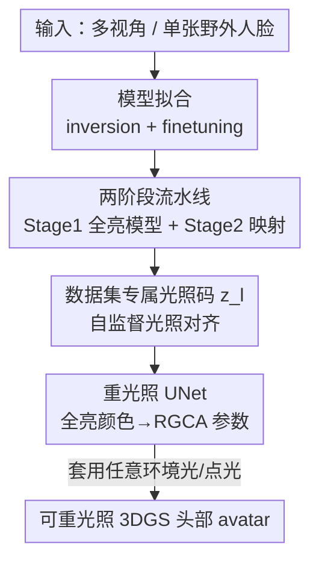

# RelightAnyone: A Generalized Relightable 3D Gaussian Head Model

**会议**: CVPR 2026  
**论文**: [CVF Open Access](https://openaccess.thecvf.com/content/CVPR2026/html/Xu_RelightAnyone_A_Generalized_Relightable_3D_Gaussian_Head_Model_CVPR_2026_paper.html)  
**代码**: 待确认  
**领域**: 3D视觉  
**关键词**: 3D高斯泼溅, 头部avatar, 可重光照, OLAT, 自监督光照对齐

## 一句话总结
RelightAnyone 提出一个"两阶段"可重光照 3D 高斯头部模型：先用大量易获取的"平光（flat-lit）多视角人脸数据"学一个跨身份的全亮 3DGS avatar，再用少量昂贵的 OLAT 数据训练一个映射网络，把全亮高斯参数翻译成可重光照的 RGCA 物理反射参数，从而无需为每个新人采集 OLAT 数据，甚至单张野外照片就能重建并任意打光。

## 研究背景与动机
**领域现状**：3D Gaussian Splatting（3DGS）已成为重建逼真头部 avatar 的标准做法，能从多视角图像高效重建、实时新视角渲染。要让这些 avatar 在任意虚拟环境里"换光"，主流高质量方案（如 Relightable Gaussian Codec Avatars，RGCA）依赖 OLAT（one-light-at-a-time，逐光源时分复用）采集——在 light stage 里把人脸在数百个点光源下逐一拍摄，从而把外观解耦成 albedo、漫反射/镜面反射等物理可重光照参数。

**现有痛点**：RGCA 这类方法是 **person-specific（人人专属）** 的——每来一个新人就要重新进 light stage 采一遍 OLAT、再重训一个模型，既费人力又费算力。后续工作 URAvatar 想做"泛化重光照"，但它依赖**大量不同身份的 OLAT 采集**来训练先验，而建一个大规模 OLAT 数据集极其昂贵耗时；URAvatar 还需要展开（unwrap）好的 albedo 纹理做身份条件，单张野外图根本拿不到、展开还容易失败。

**核心矛盾**：高质量重光照需要 OLAT 数据，但 OLAT 数据稀缺且贵；而身份泛化需要大量多样身份，这类多样身份恰恰大量存在于**平光固定光照数据集**（Ava-256、Nersemble 等）里——两种需求要的数据正好对不上。

**本文目标**：(1) 在没有逐主体 OLAT 数据的前提下重光照任意人；(2) 跨多个相机/光照配置各异的现有数据集统一训练以保证身份泛化；(3) 支持从单张野外照片拟合出可重光照 avatar。

**切入角度**：作者观察到，"身份多样性"和"重光照能力"可以**解耦到两个数据来源**——用海量平光数据学身份先验，用少量公开 OLAT 数据学重光照映射。

**核心 idea**：学一个从"平光 3DGS avatar"到"对应 RGCA 可重光照高斯参数"的**映射**，用两阶段流水线把"身份泛化"和"物理重光照"拆开训练。

## 方法详解

### 整体框架
RelightAnyone 的目标是：输入一个人的多视角或单张图像，输出一个能在任意环境光下渲染的可重光照 3DGS 头部。它的关键不是一个端到端网络，而是把问题拆成两段，让两段各自吃最合适的数据。

**Stage 1（多身份全亮模型）** 给定一个可学的身份码 $z_{id}\in\mathbb{R}^{256}$ 和一个低维、数据集专属的光照码 $z_l\in\mathbb{R}^4$，预测一个**全亮（full-on lighting）** 下的 3DGS avatar：网格解码器 $\mathcal{D}_{mesh}$（MLP）出粗网格顶点，几何解码器 $\mathcal{D}_g$ 和颜色解码器 $\mathcal{D}_c$（都是 2D CNN，在粗模板网格的共享 UV 纹理图上解码高斯参数）出每个高斯的几何与全亮颜色 $c_k^f$。Stage 1 在**多个平光数据集**上训练，保证对新身份的泛化。

**Stage 2（重光照网络）** 是一个 UNet，把 Stage 1 输出的全亮高斯颜色纹理 $c_k^f$ 翻译成 RGCA 的可重光照参数 $\{\rho_k,d_k,\sigma_k,v_k,n_k\}$（albedo、漫反射辐射传输、镜面粗糙度、可见性、法线）。它**只需在小得多的 OLAT 数据集**上训练，因为身份多样性已经被 Stage 1 的先验承接了。

两段串起来后，对未见主体做**拟合**（inversion + finetuning），就能从单张或多视角图重建出可任意打光的 avatar。整个流程如下：

### 关键设计

**1. 两阶段流水线：把身份泛化与物理重光照拆到两个数据来源**

这是全文的命门，直接对应"OLAT 贵 vs 身份多样性在平光数据里"的核心矛盾。如果像 RGCA/URAvatar 那样单阶段直接预测可重光照参数，就**只能用 OLAT 数据训练**（Table 1 的 single-stage 基线就是这么干的），身份多样性被 OLAT 数据规模死死卡住。RelightAnyone 的做法是先训 Stage 1：用一堆平光数据集（Ava-256、SDFM、Nersemble 共数百个身份）学一个跨身份的全亮 3DGS 模型，高斯参数编码在 $1024\times1024$ 的 UV 纹理里，位置由 $t_k=\hat{t}_k+\delta t_k$（重心插值基点 + 偏移）给出。再单独训 Stage 2：在小规模 OLAT 数据（3DPR，116 训练身份）上学"全亮→可重光照"的映射。两段**顺序训练而非端到端**，这样既能同时吃平光和 OLAT 两类数据，又能在训 Stage 2 时**保住 Stage 1 学到的身份先验**不被小数据集污染。Table 1 显示两阶段相比单阶段把 PSNR 从 25.49 抬到 30.06，尤其在硬阴影区域优势明显。

**2. 数据集专属光照码 $z_l$：自监督地把各数据集"洗"到同一中性色彩空间**

跨数据集训练的隐患是：每个平光数据集的相机参数和"平光"的确切分布都不一样（有的 360° 打光、有的只有正面闪光、有的背景反光），直接混训学不出统一的中性颜色空间。作者引入一个 4 维、**每个数据集一份**的可学光照码 $z_l$，把它和身份码拼接后喂给颜色解码器 $\mathcal{D}_c$（即 $\{c_k^f\}=\mathcal{D}_c(z_{id},z_l)$），让网络把"数据集级别的光照差异"从"主体本身的中性外观"里**解耦**出去。这是自监督的——没有光照标注，仅靠重建目标驱动 $z_l$ 去吸收各数据集的系统性光照偏差，从而得到更干净、更结构化的身份隐空间（Fig. 7）。它还带来一个关键能力：**换 $z_l$ 就能在数据集间迁移光照**。因为 Stage 2 是在某一个数据集（D1/3DPR）的特定全亮条件下训练的，要用它重光照来自其它数据集的主体，必须先把这些主体的全亮颜色"对齐"到 D1 的全亮条件——做法就是把它们的 $z_l$ 换成 D1 的 $z_l$。消融显示去掉 $z_l$ 后跨数据集重光照会出现斑驳（blotchy）伪影。

**3. 重光照 UNet：视角无关/视角相关双分支 + 位置条件 + albedo 正则**

Stage 2 这个 UNet 用一个共享编码器 $\mathcal{E}$ 加跳连，分出两个解码分支：视角无关分支 $\mathcal{D}_{ci}$ 出 $\{\rho_k,d_k,\sigma_k\}$（albedo、漫反射 SH 系数、粗糙度），视角相关分支 $\mathcal{D}_{cv}$ 出 $\{v_k,\delta n_k\}$（可见性、法线残差），其中观察方向 $\omega_o$ 在瓶颈层拼到每个像素上。一个关键细节是：编码器输入除了全亮颜色 $c_k^f$ 还**额外拼上 3D 高斯位置 $t_k$**（多 3 个通道）——因为两个人即便全亮下基础色一样，几何不同会导致同一点光下自阴影不同，必须让网络看到几何才能学到形状相关的明暗。另一个难点是 albedo：RGCA 里 albedo 是逐主体联合优化出来的，但泛化场景要为**未见主体**直接预测 albedo，放任网络无约束预测会得到无意义的 albedo/shading 分解。作者加两个正则：$\mathcal{L}_\rho$（L2，把预测 albedo 拉近全亮均值纹理）和单色约束 $\mathcal{L}_{mono}=\frac{1}{3}\sum_{i\in\{r,g,b\}}(d_{ki}-\frac{d_{kr}+d_{kg}+d_{kb}}{3})^2$，鼓励漫反射 SH 系数趋于单色，避免颜色被错误塞进辐射传输项。法线由 $n_k=(\hat{n}_k+\delta n_k)/\|\hat{n}_k+\delta n_k\|$ 得到，解出参数后用 RGCA 的漫反射/镜面公式即可在任意光下算颜色。

**4. 模型拟合：inversion + finetuning，单图就能上未见主体**

训练好后，要把模型套到未见主体上靠两步优化。拟合时**始终跑完整 Stage1+Stage2 管线**，并把 $z_l$ 固定为训 Stage 2 所用 OLAT 数据集（D1）的那份，最终图像由 Stage 2 的可重光照高斯渲染（而不是 Stage 1 的中性全亮高斯）——这一点很关键，因为场景光照未知、必须作为待优化量一起估计。**Inversion** 步冻结网络，优化身份码 $z_{id}$（初始化为训练主体码均值）和场景光照（参数化为训练时那组固定位置点光的 RGB 强度），损失为 $\mathcal{L}_{fit}^1=\lambda_{l1}\mathcal{L}_{l1}+\lambda_{ssim}\mathcal{L}_{ssim}+\lambda_{geo}\mathcal{L}_{geo}+\lambda_{id}\|z_{id}\|^2$。**Finetuning** 步进一步微调 Stage 1 网络权重以补人脸细节，但**冻结 Stage 2** 以保住重光照先验，并加一个局部性正则 $\mathcal{L}_{lr}$ 防过拟合：$\mathcal{L}_{fit}^2=\mathcal{L}_{fit}^1+\lambda_{lr}\mathcal{L}_{lr}$。正因为如此，模型可以从极少输入（甚至一张野外肖像）拟合出可任意打光的 3DGS 头像。

### 损失函数 / 训练策略
Stage 1 损失：$\mathcal{L}_{Stage1}=\lambda_{l1}\mathcal{L}_{l1}+\lambda_{ssim}\mathcal{L}_{ssim}+\lambda_{geo}\mathcal{L}_{geo}+\lambda_s\mathcal{L}_s+\lambda_t\mathcal{L}_t$，其中 $\mathcal{L}_s$ 是高斯尺度正则，$\mathcal{L}_t$ 约束位置偏移 $\delta t_k$ 较小。Stage 2 损失：$\mathcal{L}_{Stage2}=\lambda_{l1}\mathcal{L}_{l1}+\lambda_{ssim}\mathcal{L}_{ssim}+\lambda_{c\_}\mathcal{L}_{c\_}+\lambda_n\mathcal{L}_n+\lambda_\rho\mathcal{L}_\rho+\lambda_{mono}\mathcal{L}_{mono}$，其中 $\mathcal{L}_{c\_}$ 惩罚漫反射项里 SH 可能产生的负颜色，$\mathcal{L}_n$ 是法线残差的 L2 正则。对没有色彩校准的 Ava-256（D2），先做 2000 次迭代的 warmup（不带 $z_l$）优化一个 $3\times3$ 色彩矩阵做色校准，再开启 $z_l$ 重训。

## 实验关键数据

### 主实验
与 3D GAN 类泛化重光照方法在 D1（3DPR）测试主体上的环境贴图重光照对比（baseline 数字复用 3DPR 原文，重光照统一用低分辨率 $10\times20$ 环境图、GT 由 image-based relighting 生成）：

| 方法 | PSNR ↑ | RMSE ↓ | SSIM ↑ | LPIPS ↓ |
|------|--------|--------|--------|---------|
| NFL [25] | 16.97 | 0.2926 | 0.77 | 0.2385 |
| Lite2Relight [59] | 16.72 | 0.2619 | 0.79 | 0.2506 |
| 3DPR [60] | 21.02 | 0.1801 | 0.83 | 0.1996 |
| Ours（单图） | 26.57 | 0.0996 | 0.86 | 0.1671 |
| Ours（多视角） | **29.07** | **0.0746** | **0.91** | **0.1649** |

本文即便只用单张输入图，PSNR（26.57）也大幅超过此前 SOTA 3DPR（21.02）；多视角进一步到 29.07。作者还指出 3D GAN 类方法两个共性短板：非正面姿态头部会扭曲（因为只在 2D 肖像集上训、没强制多视角一致），且无法拟合多视角输入。与 2D diffusion 方法（IC-Light、DiffusionRenderer）对比为定性：IC-Light 抓不住主光源、跨帧不连贯且皮肤泛金属光，DiffusionRenderer 估计的皮肤材质过于漫反射、阴影不真实，且二者本质是 2D 方法无法生成新视角。

### 消融实验
两阶段 vs. 单阶段（在 D1 测试主体上，单阶段把 $\mathcal{D}_c$ 换成直接出可重光照参数的两个解码器、只能用 OLAT 数据训）：

| 配置 | PSNR ↑ | RMSE ↓ | SSIM ↑ | LPIPS ↓ |
|------|--------|--------|--------|---------|
| Single-Stage | 25.49 | 0.1092 | 0.76 | 0.2732 |
| Two-Stage（Ours） | **30.06** | **0.0655** | **0.87** | **0.2358** |

光照码 $z_l$ 消融为定性（D2/D3/D4 主体无重光照 GT，只能给点光定性结果）：去掉 $z_l$ 后各数据集光照差异与主体外观纠缠，跨数据集重光照出现斑驳伪影；带 $z_l$ 时换码对齐到 D1 即可得平滑逼真结果（Fig. 7）。

### 关键发现
- **两阶段设计贡献最大**：去掉它退回单阶段，PSNR 直接掉 4.57（30.06→25.49），且单阶段在硬阴影区域明显崩坏；光照未知需优化时单阶段几乎完全丢掉重光照先验、产生明显伪影。
- **数据集专属光照码是跨数据集统一训练的前提**：没有 $z_l$ 无法把异构平光数据集对齐到 OLAT 数据集的全亮条件，重光照会斑驳。
- **数据策略奏效**：用 1 个小 OLAT 数据集（116 训练身份）+ 3 个平光数据集（共数百身份）就能泛化重光照任意人，验证了"身份泛化与重光照解耦到两个数据源"的可行性。

## 亮点与洞察
- **把"数据稀缺"问题转成"映射学习"问题**：核心洞察是高质量重光照所缺的不是身份多样性，而是 OLAT 标注；于是只需学一个"全亮→可重光照"的映射，就能让海量易得的平光数据"借用"少量 OLAT 数据的重光照能力。这个解耦思路可迁移到任何"昂贵标注 + 廉价无标注数据"并存的重建任务。
- **数据集专属光照码当作"可交换的光照插头"**：用一个 4 维码吸收每个数据集的系统性光照偏差，推理时换码即可把不同数据集的样本对齐到目标全亮条件——既是自监督对齐手段，又顺手获得跨数据集光照迁移能力，设计很经济。
- **拟合时用 Stage 2 输出而非 Stage 1 中性高斯来渲染**，因为场景光未知必须联合优化，这个看似细节的选择是单图野外拟合能成立的关键。
- **albedo 单色正则 $\mathcal{L}_{mono}$** 是个可复用 trick：在泛化（而非逐主体优化）场景下，用单色先验约束漫反射 SH，避免颜色被错误吸进辐射传输项导致 albedo/shading 分解失真。

## 局限与展望
- **头发是短板**：作者承认对头发的重建与重光照较差，根因是头发几何 tracking 不准、发丝难建立可靠 UV 对应；未来可像相关工作那样给头发和脸分别建模。
- **只训了中性表情**：当前模型只覆盖 neutral expression，要扩到动态表情、捕捉表情相关外观，需要更大的、同时含 OLAT 与全亮的多表情数据集。
- **依赖人脸 tracker 与统一拓扑**：所有数据集都跑 VHAP tracker 对齐到同一拓扑/规范空间，tracking 误差（尤其头发）会直接传到重建质量。
- **重光照网络只在单一全亮条件下训**：所有跨数据集主体都必须先通过 $z_l$ 对齐到 D1 的全亮条件，本质上把重光照能力锚在了 3DPR 这一个 OLAT 数据集上，其覆盖的反射多样性是否足够泛化到差异极大的肤质/材质，论文未充分量化（⚠️ 以原文为准）。

## 相关工作与启发
- **vs RGCA [64]**：RGCA 用可学辐射传输让 3D 高斯可重光照、质量极高，但是 person-specific，每个新人都要 OLAT 采集 + 重训；本文复用 RGCA 的可重光照参数化，但通过两阶段把它泛化到任意人，且把 RGCA 中逐主体优化的 albedo 改成网络预测 + 正则。
- **vs URAvatar [35]**：URAvatar 同样基于 RGCA 做泛化，但需要为每个主体做大规模多视角 OLAT 采集，还需展开好的 albedo 纹理做条件（单图难获取）；本文的两阶段绕过了 OLAT 采集瓶颈，主要吃常见平光数据集 + 一个小 OLAT 集，不需要 albedo 纹理条件。
- **vs 3D GAN 类（NFL [25] / Lite2Relight [59] / 3DPR [60]）**：它们用 EG3D 等 3D-aware GAN 当先验，但多在 2D 肖像集上训，3D 几何不完整、头后无纹理、非正面姿态会扭曲，且无法拟合多视角；本文从多视角数据学，几何一致、可同时吃单图与多视角，定量大幅领先。
- **vs 2D diffusion 类（IC-Light [89] / DiffusionRenderer [36]）**：纯 2D 方法无法生成新视角；IC-Light 缺 HDRI 级细粒度控光、抓不住主光，DiffusionRenderer 的皮肤材质过度漫反射；本文是 3D 一致、支持任意环境光的物理重光照。

## 评分
- 新颖性: ⭐⭐⭐⭐⭐ 把"OLAT 数据稀缺"重构成"全亮→可重光照映射学习"，用数据集专属光照码自监督对齐异构数据集，思路清晰且实用
- 实验充分度: ⭐⭐⭐⭐ 主对比 + 关键消融齐全、数字自洽，但 $z_l$ 与跨数据集主体多为定性（缺 GT），表情/头发等维度未覆盖
- 写作质量: ⭐⭐⭐⭐⭐ 动机—矛盾—方案逻辑顺，pipeline 与公式交代清楚，限制坦诚
- 价值: ⭐⭐⭐⭐⭐ 单图即可重建可重光照头部 avatar，且能把平光数据集"升级"为合成 OLAT，对数字人产线很有实用价值

<!-- RELATED:START -->

## 相关论文

- [\[CVPR 2026\] PercHead: Perceptual Head Model for Single-Image 3D Head Reconstruction & Editing](perchead_perceptual_head_model_for_single-image_3d_head_reconstruction_editing.md)
- [\[CVPR 2026\] EmoDiffTalk: Emotion-aware Diffusion for Editable 3D Gaussian Talking Head](emodifftalk_emotion-aware_diffusion_for_editable_3d_gaussian_talking_head.md)
- [\[CVPR 2026\] FlexAvatar: Flexible Large Reconstruction Model for Animatable Gaussian Head Avatars with Detailed Deformation](flexavatar_flexible_large_reconstruction_model_for_animatable_gaussian_head_avat.md)
- [\[CVPR 2025\] HRAvatar: High-Quality and Relightable Gaussian Head Avatar](../../CVPR2025/3d_vision/hravatar_high-quality_and_relightable_gaussian_head_avatar.md)
- [\[ICLR 2026\] FastGHA: Generalized Few-Shot 3D Gaussian Head Avatars with Real-Time Animation](../../ICLR2026/3d_vision/fastgha_generalized_few-shot_3d_gaussian_head_avatars_with_real-time_animation.md)

<!-- RELATED:END -->
