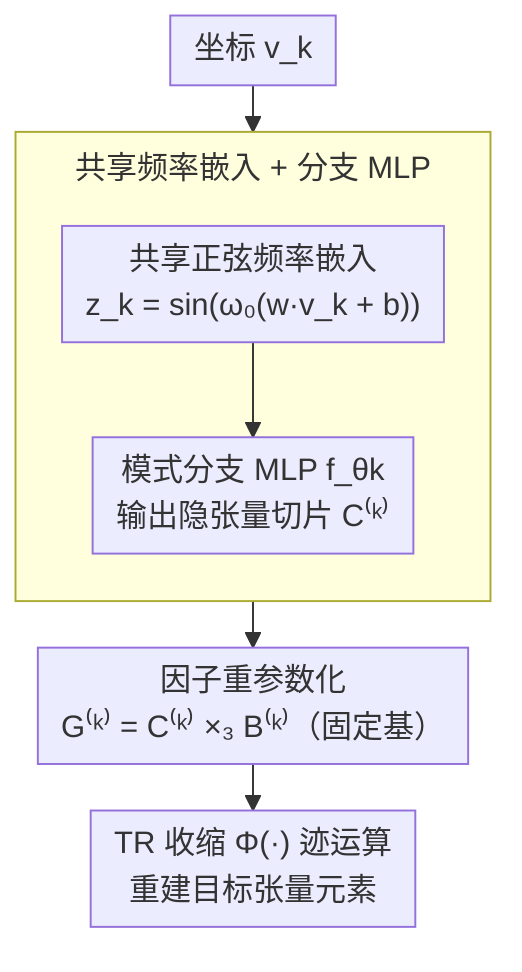

# Reparameterized Tensor Ring Functional Decomposition for Multi-Dimensional Data Recovery

**会议**: CVPR2026  
**arXiv**: [2603.01034](https://arxiv.org/abs/2603.01034)  
**代码**: [YangyangXu2002/RepTRFD](https://github.com/YangyangXu2002/RepTRFD)  
**领域**: 3D视觉 / 低级视觉 / 张量分解  
**关键词**: Tensor Ring分解, 隐式神经表示, 重参数化, 图像修复, 点云恢复, 频率分析

## 一句话总结

提出 RepTRFD：通过将 Tensor Ring 因子重参数化为"可学习隐张量 × 固定基"的形式，解决 INR 参数化 TR 因子的频谱偏置问题，在图像修复/去噪/超分/点云恢复等任务上全面超越 SOTA。

## 研究背景与动机

**低秩张量分解广泛应用**：CP、Tucker、TT、TR 等分解为图像/视频/遥感/医学影像等多维数据提供了紧凑表示，其中 TR 分解因环形结构在高阶张量建模中尤为高效。

**离散 TR 局限于固定网格**：传统 TR 分解本质是离散的，仅定义在固定 meshgrid 上，无法处理连续信号和分辨率无关的建模场景（如稀疏点云）。

**INR 为张量函数化提供可能**：已有工作将 Tucker/CP/TT 分解推广到连续域（如 LRTFR、DRO-TFF），但 TR 分解的连续化扩展尚属空白。

**直接 INR 化 TR 因子效果差**：将 INR 直接用于参数化 TR 因子时，重建结果被低频分量主导，高频细节丢失严重。

**频域分析揭示根因**：作者从频域视角证明，TR 因子的频谱特性会直接传递到重建张量——若因子缺乏高频成分，重建结果在对应维度也将缺失高频。

**INR 固有频谱偏置是瓶颈**：标准 INR（如 SIREN）倾向学习低频分量，难以捕获 TR 因子中所需的高频成分，需要新策略打破这一瓶颈。

## 方法详解

### 整体框架

这篇论文要解决的核心问题是：传统 Tensor Ring（TR）分解只定义在离散网格上，无法处理连续信号与分辨率无关的建模；而把隐式神经表示（INR）直接拿来参数化 TR 因子又会被低频主导、丢掉高频细节。RepTRFD 的思路是让 INR 来「生成」TR 因子，但在因子和网络之间插一层重参数化——网络只输出一个可学习的隐张量，再乘上一个固定基，组合出真正用于 TR 收缩的因子。

整条 pipeline 是这样转的：每个维度的坐标 $v_k$ 先过一个所有模式共享的正弦频率嵌入层 $\mathbf{z}_k = \sin(\omega_0(\mathbf{w}v_k + \mathbf{b}))$ 得到嵌入；每个模式各自有一个分支 MLP $f_{\theta_k}$，把嵌入映射成隐张量切片 $\mathcal{C}^{(k)}_{:v_k:} \in \mathbb{R}^{r_k \times R_{k+1}}$（其中 $R_{k+1} = \beta r_{k+1}$，$\beta \geq 1$ 为扩展因子）；隐张量再通过 $\mathcal{G}^{(k)} = \mathcal{C}^{(k)} \times_3 \mathbf{B}^{(k)}$ 与固定基 $\mathbf{B}^{(k)}$ 收缩成真正的 TR 因子；最后用 TR 收缩算子 $\Phi(\cdot)$ 的迹运算重建出目标张量的每个元素。

### 关键设计

**1. 共享频率嵌入 + 分支 MLP：让同一套坐标编码服务所有模式**

直接给每个模式配一套独立 INR 容易让各模式学到不一致的频率响应、也更易过拟合。RepTRFD 让所有模式共享同一个正弦嵌入层 $\mathbf{z}_k = \sin(\omega_0(\mathbf{w}v_k + \mathbf{b}))$，只在后面用各自的分支 MLP $f_{\theta_k}$ 分化出模式相关的隐张量切片。共享嵌入把跨模式的一致性约束进了参数层面，消融显示它比独立嵌入训练更稳、抗过拟合更强。

**2. 因子重参数化：把「难学的高频」搬到对优化更敏感的空间**

这是全文要害。前面说过，INR 有固有的频谱偏置（SIREN 这类天然偏向低频），而作者从频域证明 TR 因子的频谱会直接传导到重建张量——因子里没有的高频，重建结果对应维度也补不回来。RepTRFD 不去改网络结构，而是把每个 TR 因子拆成「可学习隐张量 $\mathcal{C}^{(k)}$（由 INR 生成）× 固定基 $\mathbf{B}^{(k)}$」的结构化组合。Theorem 2 证明存在特定基 $\mathbf{B}$，使重参数化后梯度对高频分量的响应比率不低于原始参数空间，也就是优化过程对高频细节更敏感，训练动态被显著改善。

固定基的取值不能乱设。Theorem 3 给出 Xavier 风格初始化 $\mathbf{B}^{(k)}_{ij} \sim \mathcal{U}(-\sqrt{6/(r_{k+1}+R_{k+1})}, \sqrt{6/(r_{k+1}+R_{k+1})})$，保证前向与反向传播的方差一致；Theorem 4 进一步证明整个 RepTRFD 映射全局 Lipschitz 连续，使模型对输入扰动不过度敏感。因为 $\mathbf{B}^{(k)}$ 初始化后冻结、不参与梯度更新，这套重参数化带来的额外计算开销极小（实测约 +1 秒）。

### 损失函数

采用通用的「数据保真项 + 可选正则项」框架：$\min_\phi \mathsf{L}_{\text{data}}(g_\phi; \mathcal{O}) + \mathsf{L}_{\text{reg}}(g_\phi)$，根据具体任务（修复 / 去噪 / 超分 / 点云恢复）选择不同的数据项和正则化。

## 实验

### 主要结果

**图像/视频修复（Inpainting）**：在彩色图像、多光谱图像（MSI）、高光谱图像（HSI）和视频上全面超越 TRLRF、FCTN、HLRTF、LRTFR、DRO-TFF、NeurTV。

| 数据集 | 方法 | SR=0.1 PSNR | SR=0.2 PSNR | SR=0.3 PSNR |
|--------|------|-------------|-------------|-------------|
| 彩色图像 (256²×3) | DRO-TFF | 23.22 | 27.52 | 30.04 |
| | NeurTV | 24.16 | 27.81 | 30.28 |
| | **RepTRFD** | **25.70** | **29.37** | **32.01** |
| MSI (256²×31) | DRO-TFF | 38.45 | 42.28 | 45.00 |
| | **RepTRFD** | **39.34** | **44.66** | **47.74** |

**点云恢复（SR=0.2，NRMSE↓）**：

| 方法 | Doll | Duck | Frog | Mario |
|------|------|------|------|-------|
| WIRE | 0.106 | 0.060 | 0.053 | 0.086 |
| FINER | 0.110 | 0.059 | 0.054 | 0.088 |
| **RepTRFD** | **0.093** | **0.053** | **0.050** | **0.080** |

### 消融实验

1. **重参数化的效果**：无重参数化 vs 有重参数化在 SR=0.2 下，彩色图像 PSNR 从 27.41→30.45（+3.04 dB），MSI 从 29.41→48.67（+19.26 dB），时间仅增加约 1 秒。
2. **扩展因子 β 的影响**：β 从 1 增大到 10 时 PSNR 持续提高且收敛更快，但收益递减。
3. **基初始化敏感性**：对 HSI Botswana，初始化尺度 $a$ 从 0.01 到 1 变化，理论推导值 $a \approx 0.165$ 取得最优 PSNR（45.27），过小或过大均导致显著退化。
4. **共享频率嵌入**：相比独立嵌入，共享嵌入训练更稳定、抗过拟合更强。
5. **模型复杂度对比**：在参数量和 FLOPs 匹配条件下，RepTRFD 一致优于 LRTFR。

### 关键发现

- 重参数化带来的增益在高阶数据（HSI、视频）上尤为显著，MSI 修复提升可达 **19 dB**。
- 计算开销增加极少（~1s），主要因为固定基 $\mathbf{B}$ 不参与梯度更新。
- 超分任务中比纯 INR 方法（SIREN/WIRE/FINER）速度快 10-30 倍，PSNR 高约 1 dB。

## 亮点

1. **首次将 TR 分解推广到连续域**，填补了张量函数表示领域在 TR 格式上的空白。
2. **频域分析视角新颖**：从理论上揭示 TR 因子频谱→重建张量频谱的传导机制，为理解张量功能表示的频率瓶颈提供了理论基础。
3. **重参数化策略简洁有效**：仅引入一个固定基矩阵，无需改变网络架构或训练策略，即可显著提升高频学习能力。
4. **理论保障完整**：覆盖梯度动态（Theorem 2）、初始化（Theorem 3）和 Lipschitz 连续性（Theorem 4），实用且有指导意义。
5. **四个任务统一框架**：修复/去噪/超分/点云恢复共用同一架构，通用性强。

## 局限性

1. **仍需手动设置超参**：TR 秩 $r_k$、扩展因子 $\beta$、频率 $\omega_0$ 需逐任务调优，缺乏自适应秩选择机制。
2. **仅验证 3-4 阶张量**：虽然理论上可扩展到任意阶，但实验仅涉及 3 阶（图像/MSI/HSI）和 4 阶（视频），更高阶数据（如光场、时空光谱）未验证。
3. **无与深度学习端到端方法对比**：所有 baseline 均为传统优化或 INR 方法，未涉及 U-Net/Transformer 等监督方法。
4. **点云恢复仅测试小型模型**：SHOT 数据集规模有限，未在大规模场景（如 ShapeNet、真实 LiDAR 点云）上验证可扩展性。
5. **固定基不参与学习**：$\mathbf{B}^{(k)}$ 初始化后冻结，可能限制表达力上限，可探索可学习或自适应基。

## 相关工作

- **INR 系列**：SIREN（正弦激活）、WIRE（小波）、FINER（可变频率）—— 本文方法从张量分解角度互补，速度快但精度更高。
- **张量函数表示**：LRTFR（Tucker 连续化）、DRO-TFF（深度秩一分解）—— 本文首次将 TR 格式引入该框架，且通过重参数化解决了频谱偏置。
- **重参数化技术**：Weight Normalization、RepVGG 结构重参数化、Shi et al. 的 INR 权重分解—— 本文将重参数化从网络权重层面提升到张量因子层面。
- **张量补全**：TRLRF、FCTN、HLRTF—— 离散方法无法处理非网格数据，本文方法在两种数据类型上均优。

## 评分

- 新颖性: ⭐⭐⭐⭐ — TR 连续化 + 频域分析 + 因子重参数化，三个贡献递进且互补
- 实验充分度: ⭐⭐⭐⭐ — 四种任务、多种数据类型、充分消融，但缺少与深度方法对比
- 写作质量: ⭐⭐⭐⭐⭐ — 理论推导严谨，图表清晰，逻辑线从问题→分析→解决方案→验证一气呵成
- 价值: ⭐⭐⭐⭐ — 为张量函数表示提供了新的 TR 格式和重参数化范式，有后续扩展空间

<!-- RELATED:START -->

## 相关论文

- [\[CVPR 2026\] QuadSync: Quadrifocal Tensor Synchronization via Tucker Decomposition](quadsync_quadrifocal_tensor_synchronization_via_tucker_decomposition.md)
- [\[CVPR 2026\] Volumetric Functional Maps](volumetric_functional_maps.md)
- [\[CVPR 2026\] Multi-modal Frequency Decomposition Network for Semantic Scene Completion](multi-modal_frequency_decomposition_network_for_semantic_scene_completion.md)
- [\[CVPR 2026\] Learning Convex Decomposition via Feature Fields](learning_convex_decomposition_via_feature_fields.md)
- [\[CVPR 2026\] FunREC: Reconstructing Functional 3D Scenes from Egocentric Interaction Videos](funrec_reconstructing_functional_3d_scenes_from_egocentric_interaction_videos.md)

<!-- RELATED:END -->
