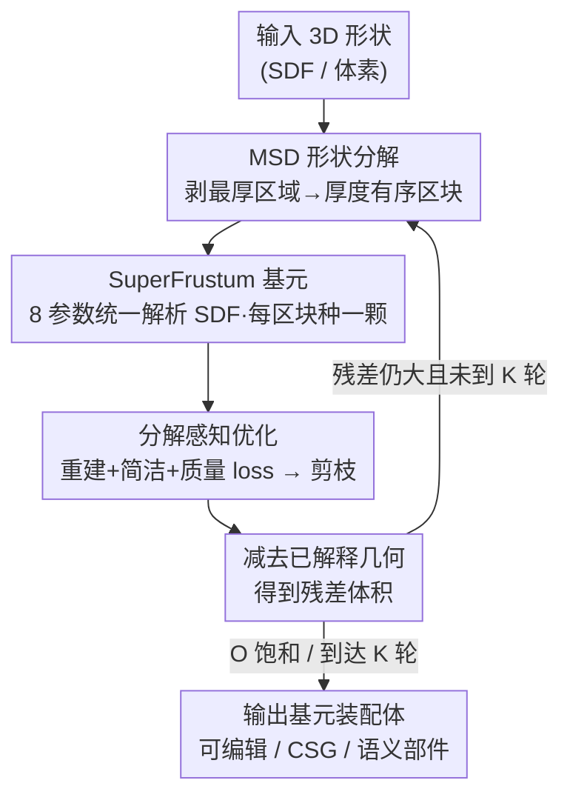

# Residual Primitive Fitting of 3D Shapes with SuperFrusta

**会议**: CVPR 2026  
**论文**: [CVF Open Access](https://openaccess.thecvf.com/content/CVPR2026/html/Ganeshan_Residual_Primitive_Fitting_of_3D_Shapes_with_SuperFrusta_CVPR_2026_paper.html)  
**代码**: 待开源（论文称 "Code will be open-sourced upon acceptance"）  
**领域**: 3D视觉  
**关键词**: 基元拟合, 形状分解, 解析SDF, 可编辑3D资产, 残差拟合

## 一句话总结
本文把一个 3D 形状转成"少而准"的解析基元装配体：提出一种 8 参数、可表达/可编辑/可优化三者兼得的统一解析基元 **SuperFrustum**，再用 **ResFit** 这种"分析—优化交替、每轮拟合残差"的无监督流程把基元一颗颗补上去，在多个 3D 基准上 IoU 提升 9 个点的同时基元数量只用了前作的约一半。

## 研究背景与动机
**领域现状**：把复杂 3D 形状蒸馏成一组可解释的解析基元（cuboid、圆柱、superquadric 等），能得到结构清晰、可编辑的资产，符合"人把物体看成简单形状组合"的认知，是 dense 3D 数据通往可控设计的桥梁。现有做法分三类：形状分析驱动（先按曲率/厚度/凸性切区域再拟合）、优化驱动（直接调基元参数最小化重建误差）、学习驱动（神经网络预测基元参数）。

**现有痛点**：所有方法都卡在**重建保真度 vs 程序简洁度（parsimony）**的权衡上。追求保真的方法产出一大堆相互重叠、冗余的基元；强行简洁的方法又抓不住曲面、细节。既表达力强、又紧凑、又可编辑，至今是开放难题。

**核心矛盾**：作者把这个权衡归因到两个根上。其一是**基元家族本身不够表达**——cuboid/superquadric/椭球要拼出 3D 资产里丰富的形状变化就得堆很多个；而且 superquadric 这类还牺牲了可编辑性、连立方体/圆锥这种常见规则体都无法精确复现。其二是**推理流程各有死穴**：先承诺一个完整分割的方法，初始分割一旦错就会一路传染到最终装配；从零拟合一大锅"基元汤"的优化方法又要在高度非凸的损失面里硬找。

**本文目标**：① 造一个同时满足表达力（expressive）、可编辑（editable）、可优化（optimizable）三项 desiderata 的基元；② 配一个能稳健导航非凸损失面、产出既紧凑又高保真装配的推理算法。

**切入角度**：作者发现 Shadertoy / Demoscene 社区为了"用最短描述渲染丰富形状"早就探索出一类能在基本形状间平滑形变的统一解析函数——这些式子原本是为实时渲染/压缩场景描述而生，不是为反向建模设计的，但稍加改造后**出奇地适合可微拟合**。同时把"自顶向下的形状分析"和"自底向上的基元优化"绑在一起交替，让两个信号互相纠正，而不是各干各的。

**核心 idea**：用一个 8 参数的统一解析 SDF 基元（SuperFrustum）替代僵硬的基元家族，再用"分析提全局结构 → 优化拟局部几何 → 减去已解释部分 → 在残差上重复"的迭代流程（ResFit）来逼近 Occam 式的"少而准"装配。

## 方法详解

### 整体框架
任务定义为：给定 3D 形状 $x$，推断一个由解析基元组成的程序 $z$，其执行 $E(z)$ 重建出 $x$。每个程序是基元序列 $\{f_{\theta_i}\}_{i=1}^{|z|}$ 经组合算子得到的闭合曲面。按 Occam 剃刀，目标是同时准确且紧凑：

$$z^* = \arg\max_z\ O(x, z),\qquad O(x, z) = R(x, E(z)) - \alpha|z|$$

其中 $R$ 是重建精度、$|z|$ 是程序长度（基元数）、$\alpha$ 控制保真与简洁的权衡。

整体是一个**迭代回环**：ResFit 在「形状分析」与「基元优化」之间交替。每一轮先用 **MSD 形状分解** 把当前残差体积切成厚度有序的区域、并为每块种一颗 SuperFrustum 当初始；再用 **分解感知优化** 把整套基元的参数往最大化 $O$ 的方向调（含可微 loss + 离散剪枝）；优化后把"已解释"的几何从目标里减掉，剩下的**残差**进入下一轮继续被新基元解释。如此重复直到 $O$ 饱和或到达固定轮数 $K$（默认最多 10 轮，每轮 7 次 MSD 迭代）。这个交替让"全局结构"和"局部参数"互相喂信息：既能给欠参数化的区域补基元，也能靠软正则+硬剪枝纠正过参数化。

### 关键设计

**1. SuperFrustum：8 参数同时拿下表达力、可编辑、可优化的统一解析基元**

痛点很直接——既有基元家族（superquadric 可编辑可优化但表达不够、代数曲面表达够但不可编辑、多类型基元表达可编辑但难优化）总在三项 desiderata 里只占一两项。SuperFrustum 是一个有符号距离函数的零等值面 $SF(p)=f(p;\theta)$，参数 $\theta=(s,r,d,t,b,o)$ 共 8 个标量，分别直观控制各向异性缩放 $s$、轮廓圆度 $r$、膨胀 $d$、锥化 taper $t$、鼓起 bulge $b$、洋葱式壳厚 $o$。靠这 8 个旋钮，单一公式就能在 cuboid、圆柱、圆锥、球、环面（torus）及其锥化/弯曲/中空变体之间平滑形变。关键在于它的 SDF 是分段 $C^1$、几乎处处对所有参数可微，所以能稳定地做梯度拟合——这正是从 Demoscene 那类"最短描述、实时渲染"解析形式改造而来、却恰好契合反向建模的地方。整套装配体由变换后的多颗 SuperFrustum 经**平滑并集算子** $\mathcal{U}$ 递归合成：每颗有位姿 $(R_i,t_i)$ 与形状参数 $\theta_i$，给出 $g_i(p)=f(R_i^\top(p-t_i);\theta_i)$，最终隐式场

$$F_1(p)=g_1(p),\qquad F_{k+1}(p)=\mathcal{U}\big(F_k(p),\,g_{k+1}(p);\,\beta_k\big)$$

其中 $\beta_k$ 控制混合锐度，零等值面即最终曲面。

**2. ResFit：拟合残差的迭代回环，让全局分析与局部优化互相纠正**

纯优化方法容易产出相互纠缠的重建，纯分析方法切形状时又不管基元家族能不能表达——这是"自顶向下分析"与"自底向上表示"之间的脱节。ResFit 用交替来弥合：每轮的分析阶段把当前残差体积分解成区域来种新基元，优化阶段调参数最大化 $O$、把已解释几何和残差分离，循环到 $O$ 饱和或到 $K$ 轮。它专门设计了几处让回环能自我纠错：为防过参数化，每轮只种少量基元，并用"软正则惩罚冗余 + 硬剪枝删除拖累 $O$ 的基元"；为治欠参数化，基元基于其局部支撑来优化，且**每轮都重优化整套装配**——这样新部件加入时系统能自我校正，逐步收敛到紧凑而连贯的结构。相比"一次性把所有基元一起优化"的单发方案，多轮渐进地把容量重新分配到残差误差上，实测保真更高、基元更少、重叠更低。

**3. MSD 初始化：用"先剥最厚部分"的形态学分解，给曲面/中空/分叉结构更对路的种子**

ResFit 用形状分解的体积区域来初始化基元，分解策略越贴合基元家族的表达力，效果越好。近期工作多用近似凸分解（ACD/CoACD），但作者发现改造版的**形态学形状分解（MSD）** 更适合 SuperFrusta。MSD 是一种"先剥最厚部分"的迭代术：每步在当前 SDF $f(p)$ 里找最厚的内部连通区域 $\Gamma_k$——即在腐蚀半径 $|\tau|$ 下仍存活的连通分量

$$\Gamma_k \subseteq \{p\in\Omega \mid f(p)\le \tau\},\quad \Gamma_k\ \text{is a cc}$$

阈值 $\tau\le 0$ 取使 $\mathrm{Vol}(\Gamma_k)$ 满足体积分数 $\kappa$ 的最小值；再把它按同半径膨胀回完整范围 $R_k=\Gamma_k\oplus B_{|\tau|}$，记录后从形状里减掉、更新残差场 $f_{k+1}(p)=f_k(p)\setminus R_k$，在残差上重复，得到一串按厚度递减排序的候选区域。相比 ACD 的两大好处：① ACD 的凸性约束会把"单颗 SuperFrustum 本可建模的非凸结构"（弯曲、中空，如自行车轮胎、猫的弯尾、碗沿）过度切碎成许多凸碎片；② MSD 对 ResFit 迭代回环中产生的带噪残差体积更鲁棒。每块体积内再用 PCA + 柱度（cylindricity）评分选规范轴，推断位姿与尺度来初始化基元参数。

**4. 分解感知优化：重建 + 简洁 + 质量三路损失，再加贪心剪枝**

把装配参数往最大化 $O$ 调，分可微与离散两段。**重建项**是 $R$ 的可微替身：用当前装配的占据场 $\hat o(p)=\sigma(-\beta\tanh(\beta F(p)))$ 监督真值占据 $o(p)$，采样点在体内均匀、在表面附近加密，并按目标网格主曲率 $\kappa(p)$ 加权以更好重建薄而高曲率结构，且只在掩码 $M=\{p\mid F(p)<\tau\}$ 内评估、聚焦装配附近：

$$w(p)=1+\sigma(\kappa(p)),\qquad L_{rec}=\frac{1}{|M|}\sum_{p\in M} w(p)\big(\hat o(p)-o(p)\big)^2$$

**简洁项**给每颗基元一个 Gumbel-Softmax 采样的随机存在变量 $q_i\in(0,1)$，把其 SDF 调制成 $f_i^*(p)=q_i f_i(p)+(1-q_i)$，从而平滑"侵蚀"掉低存在概率的基元，惩罚期望活跃基元数 $L_{count}=\sum_i q_i$。**质量项**是结构正则 $L_{qual}=L_{overlap}+L_{union}$：$L_{overlap}$ 惩罚多颗基元同时活跃的重叠区（压冗余覆盖），$L_{union}$ 惩罚"平滑并集占据但单颗基元都不占据"的区域（压过度混合），二者一起让装配既不重叠纠缠又不过度 blend，更可编辑。总损失

$$L_{total}=L_{rec}+\lambda_{count}L_{count}+\lambda_{qual}L_{qual}$$

可微优化收敛后做一步**离散剪枝**：体积或贡献可忽略的基元逐个试删，贪心地接受那些能提升主目标 $O$ 的删除。

### 损失函数 / 训练策略
这是无监督的逐形状优化（非训练一个网络），全程用一套固定超参：高层目标 $O$ 用曲率加权表面 IoU 加程序长度惩罚 $\alpha=10^{-3}$；优化损失权重 $\lambda_{count}=10^{-3}$、$\lambda_{qual}=10^{-2}$；ResFit 最多 10 轮或收敛即止，每轮 7 次 MSD 迭代。

## 实验关键数据

### 主实验
数据集：① 3DGen-Prim 的复现版（原版未公开，用 3DGen-Bench 的 510 个 prompt 经 Hunyuan3D-2.1 生成）；② Toys4K 经最远点采样选出的 500 个几何多样形状。指标含重建侧 IoU(128³)/CD/EMD/BiSurfIoU，与程序质量侧 #Prims / Overlap / IntraPrim(↓) / InterPrim(↑)（后两者基于 PartField 特征衡量语义纯度与部件区分度）。Baseline 为学习驱动的 Primitive Anything（PA，含测试时优化变体 TTO）与优化驱动强基线 Marching Primitives（MPS）。

| 数据集 | 指标 | 本文 | 前 SOTA(MPS) | 改善 |
|--------|------|------|--------------|------|
| 3DGen-Prim | IoU ↑ | **88.74** | 82.67 | +6.1 |
| 3DGen-Prim | BiSurfIoU ↑ | **80.19** | 71.53 | +8.7 |
| 3DGen-Prim | CD ↓ | **0.168** | 0.884 | 大幅降低 |
| 3DGen-Prim | #Prims ↓ | **23.98** | 42.96 | ≈ 一半 |
| 3DGen-Prim | Overlap ↓ | **0.210** | 0.684 | >3× 降低 |
| Toys4K | IoU ↑ | **89.92** | 80.60 | +9.3 |
| Toys4K | #Prims ↓ | **23.67** | 30.62 | 更少 |
| Toys4K | Overlap ↓ | **0.208** | 0.588 | >2.8× 降低 |

本文在重建与程序质量两侧同时拿到最好：IoU 升 6–9 点、基元数约减半、重叠降 3× 以上，IntraPrim 最低（语义纯度高）、InterPrim 居前（部件区分明确）。

### 消融实验

| 配置 | IoU | #Prims | Overlap | 说明 |
|------|-----|--------|---------|------|
| SuperFrustum + 平滑并集 | **88.37** | 21.46 | **0.199** | 完整基元设计 |
| SuperFrustum 无平滑并集 | 87.15 | 18.68 | 0.257 | 去平滑并集，重叠升、精度降 |
| SuperPrimitive(无 taper/bend) | 86.66 | 21.36 | 0.291 | 去锥化/弯曲自由度，精度降 |
| Superquadric | 76.50 | 18.17 | 0.286 | 轴向不齐时易陷局部极小 |
| Cuboid | 82.33 | 20.49 | 0.298 | 表达力最弱 |
| ResFit + MSD | **89.86** | **23.46** | **0.207** | 完整流程 |
| ResFit + CoACD | 88.02 | 24.18 | 0.214 | 换分解策略，略降 |
| Single-shot + MSD | 87.95 | 28.17 | 0.236 | 单发拟合，基元更多更乱 |
| Single-shot + CoACD | 86.56 | 26.67 | 0.226 | 对初始分割敏感 |

### 关键发现
- **基元表达力是大头**：taper/bend 自由度和平滑并集都实打实贡献精度；换成 superquadric 因轴向不齐易陷坏的局部极小（MPS 靠非可微的周期性轴翻转启发式缓解，本文受控对比中不用这类 trick）。
- **迭代 > 单发，MSD > CoACD**：ResFit 多轮把容量重新分配到残差误差上，比一次性联合优化所有基元更准更省更不重叠；MSD 的非凸分区对曲面/中空/分叉几何给出更好初始化。
- **速度—质量可调**：Toys4K 上完整 10 轮约 652.6s/形状；但仅 2 轮变体 184.1s 就达 86.54 IoU、15.54 基元，匹配甚至略超 256³ 分辨率的 MPS（86.30 IoU）而基元少 5×。作者坦言 ResFit 尚未为速度优化，专用 CUDA 核可加速。

## 亮点与洞察
- **跨界取经**：把 Shadertoy/Demoscene 为压缩场景描述和实时渲染而生的统一解析形式，改造成适合可微反向建模的基元——"为渲染设计的式子原来很适合拟合"是很漂亮的洞察。
- **三项 desiderata 一次满足**：用 8 个有语义的参数同时兼顾表达/可编辑/可优化，且能精确复现 cuboid/cone 这种制造业常见规则体，避免了 superquadric 牺牲可编辑性的老问题。
- **"拟合残差"是可迁移范式**：不从零优化一大锅基元，而是分析—优化交替、每轮只解释残差并允许整体重优化与剪枝自我纠错，这套思路可迁移到任何"需要在非凸损失面上渐进装配"的结构化推理任务。
- **质量正则双向约束**：overlap 压冗余、union 压过度混合，让最终装配既紧凑又"不糊在一起"，直接换来更好的可编辑性与语义连贯。

## 局限与展望
- **慢**：完整 10 轮逐形状优化数百秒，作者自承未为速度优化，需要专用 CUDA 核才能实用化。
- **依赖分解质量**：初始化吃 MSD 的分区质量，极端薄壳/高度交错结构上 MSD 是否仍稳健、阈值 $\kappa$/$\tau$ 的敏感性正文未充分展开（在补充材料）。
- **8 参数的天花板**：SuperFrustum 虽表达力强，但本质仍是规则解析体的形变族，面对完全有机/自由曲面的复杂细节，单颗能覆盖的范围有限，仍要靠多颗 + 平滑并集堆。
- **评测数据集自建**：3DGen-Prim 原版未公开只能复现，与原工作的可比性存在一定不确定性。

## 相关工作与启发
- **vs Marching Primitives (MPS)**：MPS 直接从 SDF 网格优化 superquadric 装配拿到强保真，但要很多基元且重叠高，还依赖轴翻转等非可微启发式。本文用更表达的 SuperFrustum + 残差迭代，IoU 高 6–9 点、基元约一半、重叠降 3×。
- **vs Primitive Anything (PA)**：PA 是监督学习预测 cuboid/圆柱/椭球装配，在训练域内准但泛化到新颖/复杂物体差；本文是无监督逐形状优化，不吃训练分布、对多样形状更稳。
- **vs 形状分析驱动（ACD/CoACD 等）**：它们先承诺一个固定分割、分割错就传染到底，且凸性约束会过切非凸结构；本文让分析与优化双向交替，使分解适配基元的表达能力。

## 评分
- 新颖性: ⭐⭐⭐⭐⭐ 新基元 + 残差迭代范式 + 跨界取经，思路完整且有体系
- 实验充分度: ⭐⭐⭐⭐ 两数据集、双侧指标、基元家族与流程双消融齐全；自建数据集与速度是小遗憾
- 写作质量: ⭐⭐⭐⭐⭐ 动机—矛盾—方法—消融逻辑闭环，图文对照清晰
- 价值: ⭐⭐⭐⭐⭐ 高保真又可编辑的解析装配，直接打通 dense 3D 与可控设计，下游可做可编辑资产/CSG/语义部件

<!-- RELATED:START -->

## 相关论文

- [\[CVPR 2026\] LoST: Level of Semantics Tokenization for 3D Shapes](lost_level_of_semantics_tokenization_for_3d_shapes.md)
- [\[CVPR 2026\] UniTEX: Universal High Fidelity Generative Texturing for 3D Shapes](unitex_universal_high_fidelity_generative_texturing_for_3d_shapes.md)
- [\[CVPR 2026\] Unified Primitive Proxies for Structured Shape Completion](unified_primitive_proxies_for_structured_shape_completion.md)
- [\[CVPR 2026\] PrITTI: Primitive-based Generation of Controllable and Editable 3D Semantic Urban Scenes](pritti_primitive-based_generation_of_controllable_and_editable_3d_semantic_urban.md)
- [\[CVPR 2026\] Radar-Guided Polynomial Fitting for Metric Depth Estimation](radar-guided_polynomial_fitting_for_metric_depth_estimation.md)

<!-- RELATED:END -->
