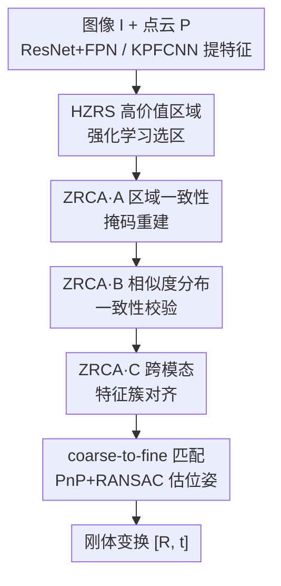

# Rethinking 2D-3D Registration: A Novel Network for High-Value Zone Selection and Representation Consistency Alignment

**会议**: CVPR 2026  
**论文**: [CVF Open Access](https://openaccess.thecvf.com/content/CVPR2026/html/Cheng_Rethinking_2D-3D_Registration_A_Novel_Network_for_High-Value_Zone_Selection_CVPR_2026_paper.html)  
**代码**: 待确认  
**领域**: 3D视觉  
**关键词**: 图像-点云配准, 跨模态匹配, 强化学习选区, 表示一致性, 簇对齐

## 一句话总结
R23Net 用强化学习先在图像和点云上挑出"既能产生高质量匹配、又便于稠密匹配"的高价值区域（HZRS 模块），再用三组一致性约束把这些区域的跨模态表示对齐（ZRCA 模块），在 RGB-D Scenes v2 上把配准召回率（RR）从 68.4 提到 77.0，刷新 image-to-point cloud 配准的 SOTA。

## 研究背景与动机
**领域现状**：图像到点云配准（I2P）的目标是给定同一场景的一张图像和一片点云，估计把点云对齐到相机坐标系的刚体变换 $[R, t]$，它是三维重建、SLAM、视觉定位的关键一步。现有方法分两大流派：一是 **detect-then-match**（先检测后匹配），分别在图像和点云上检测关键点再按特征匹配，追求"少而精"的高质量对应；二是 **detection-free**（如 2D3D-MATR），走 coarse-to-fine（粗到细）的稠密匹配路线，用 PnP-RANSAC 估计位姿，追求"多"的对应来稀释错误。

**现有痛点**：detect-then-match 受限于可重复关键点的稀缺——图像和点云域差异大，跨模态难以得到一致的关键点和描述子，高质量对应数量少且容易被错配带偏；detection-free 虽然对应多，但图像和点云之间存在非重叠区域、粗匹配的偏移又会传到细匹配，会产生大量低质量的错误匹配。更深一层的问题是：图像特征来自纹理、点云特征来自结构，即便框到了同一块区域，两者的表示本身就不一致，这种不一致直接拉低跨模态匹配精度。

**核心矛盾**："质量"和"数量"是两条互不兼容的路：高质量匹配精但少，稠密匹配多但脏；而且无论走哪条路，跨模态表示不一致这个底层矛盾都没被解决。

**本文目标**：拆成两个子问题——(1) 怎么找出既有价值、又适合做稠密匹配的关键区域？(2) 怎么为这些跨模态关键区域建立一致的表示？

**切入角度**：作者的观察是两条路的缺点恰好互补——先用"高质量"思路圈出可靠区域，再在区域内用"稠密"思路稀释误差，就能同时拿到"更好"和"更多"的对应。再用区域边界、相似度结构等已有信息施加一致性约束，把两个模态的表示拉到一起。

**核心 idea**：用强化学习解决"选区是离散不可导"这一障碍，先选高价值区域（HZRS）；再从理解、协调、加速三个角度施加表示一致性约束（ZRCA），把跨模态表示对齐后再做 coarse-to-fine 匹配。

## 方法详解

### 整体框架
R23Net 的输入是同一场景的图像 $I \in \mathbb{R}^{H\times W\times 3}$ 和点云 $P \in \mathbb{R}^{N\times 3}$，输出是刚体变换 $[R, t]$。整条管线是：用 ResNet+FPN 提图像特征、KPFCNN 提点云特征（均带位置编码），经自注意力/交叉注意力 transformer 做初步跨模态对齐后，先进 **HZRS** 用强化学习挑出高价值区域、丢掉低质量区域得到 $F_i^s, F_p^s$；再进 **ZRCA**，它由三个单元串行施加一致性约束（掩码重建、相似度分布校验、簇对齐）；最后在对齐后的特征上做 coarse-to-fine 匹配（先粗匹配集 $M_c$、再细化稠密匹配集 $M_f$），用 PnP+RANSAC 估计位姿。

四个贡献模块自上而下分别对应下面四个关键设计：HZRS 负责"选对地方"，ZRCA 的三个单元分别从"理解、协调、加速"三个角度负责"对齐表示"。

### 关键设计

**1. HZRS 高价值区域强化学习选区：用奖励驱动解决"选区不可导"**

针对"非重叠区域和低纹理区域会让粗匹配出错并传播到细匹配"这个痛点，HZRS 的任务是在做稠密匹配前先圈出真正能产生高质量对应的区域。难点在于"选不选某个区域"是离散的二值决策，天然不可导，没法直接用梯度训练。作者把它建模成强化学习：候选集 $C=(C_i, C_p)$ 分别是图像 $h\times w$ 个位置和点云 $n$ 个点的索引，策略网络对每个候选输出选择概率 $p_t = \pi_\theta(a_t=1\,|\,s_t)$（$a_t\in\{0,1\}$ 是选/不选），用 REINFORCE 优化期望奖励，并引入基线 $z$（历史奖励的滑动平均 $z=\frac{1}{T}\sum_t R_t$）来降低梯度方差：

$$L_R = -\mathbb{E}_{(s_t,a_t)\sim\pi_\theta}\left[(R-z)\sum_{t=1}^{T}\log\pi_\theta(a_t|s_t)\right].$$

奖励函数的设计是这个模块的灵魂。作者用 circle loss $L_x$（衡量匹配质量，惩罚正负样本对的特征距离）的倒数作主项，再加上"投影正确性"项防止选出的图像区域和点云区域对不上：

$$R = \frac{1}{L_x} + \lambda_1\cdot \mathrm{Pro}_i + \lambda_2\cdot \mathrm{Pro}_p,$$

其中 $\mathrm{Pro}_i, \mathrm{Pro}_p$ 把选中的图像区域 $I_s$ 投到点云、点云区域 $P_s$ 投到图像，投对了奖励为正、投错为负，从而约束两个模态选中的是同一块物理区域。这样既保证了选中区域能产生高质量匹配（$1/L_x$ 项），又保证了跨模态对齐（投影项）。训练时直接丢掉低概率（低质量）的特征 patch，顺带加速了训练，最终得到高价值区域特征 $F_i^s, F_p^s$。

**2. ZRCA·A 区域一致性掩码重建：从"理解"角度对齐表示**

即使框到了高价值区域，图像（纹理）和点云（结构）的表示仍然不一致。这个单元从"理解"角度切入——不直接对齐内部特征，而是借助可观测的区域边界来间接约束。具体地：用选中的图像特征 $F_i^s$ 定位图像里的高价值区域掩码 $M_o$；再算选中的点云特征 $F_p^s$ 与完整图像特征 $F_i$ 的余弦相似度，取 top-k 最相似的图像区域得到 $M_A$（这张相似度图本来就是后续 coarse-to-fine 阶段要算的，几乎零额外开销）。如果两模态表示一致，$M_o$ 和 $M_A$ 就该高度重叠。作者用 Dice + KL 的联合损失强制这种一致：

$$L_M^{\text{Dice}} = 1 - \frac{2\langle M_o, M_A\rangle + \varepsilon}{\langle M_o, \mathbf{1}\rangle + \langle M_A, \mathbf{1}\rangle + \varepsilon},\qquad L_M^{\text{KL}} = \mathrm{KL}(\tilde{M}_o\,\|\,\tilde{M}_A),$$

总掩码损失 $L_M = L_M^{\text{Dice}} + L_M^{\text{KL}}$（$\tilde{M}$ 是按和归一化后的分布）。一个有意思的设计抉择：作者只约束"点云投到图像"而不反过来，原因是点云稀疏、局部不连续，结构边界不清晰；而图像区域边界连续清晰，更适合用来评估区域一致性——而且反向投影的正确性已被 HZRS 的奖励项保证，不必重复。

**3. ZRCA·B 相似度分布一致性校验：从"协调"角度抑制误差传播**

coarse-to-fine 匹配里，粗匹配阶段的错误会传到细匹配，造成错位。这个单元从"协调"角度补一刀：核心观察是——如果匹配上的区域语义一致，它们各自 patch 内部的相似度结构也应该一致；反之错配会暴露出结构差异，可以放大成可靠的约束信号。给定归一化后的图像/点云 patch 特征 $f_i, f_p\in\mathbb{R}^{m\times c}$（$m$ 是匹配对数），分别算自相似矩阵 $S_i = f_i f_i^\top$、$S_p = f_p f_p^\top$，用两者差的 Frobenius 范数作损失：

$$L_S = \|S_i - S_p\|_F^2.$$

由于训练早期对应本身就不可靠，这个约束被延后到训练稳定后才加入（实现里 epoch 10 开始 warm-up、epoch 20 完成），避免一开始就被噪声带偏。

**4. ZRCA·C 跨模态特征簇对齐：从"加速"角度对齐分布并加快收敛**

作者用 t-SNE 观察到训练中图像和点云特征会先形成簇级对齐、最终才逼近点级对齐。为加速收敛、增强跨域对齐，这个单元从"加速"角度引入簇对齐：把图像/点云的高维局部特征分别聚成最多 $K_{\max}$ 个簇，用可学习原型 $u_k$（图像）和 $v_\ell$（点云）参数化；每个原型带一个可学习门控（经 sigmoid 得激活概率 $\pi_k, \rho_\ell$，训练时用 Gumbel-Softmax 松弛得到连续门值）。局部特征对原型做带门控、带温度 $\tau_a$ 的软分配：

$$A^{\text{img}}_{jk} = \frac{\exp(s^{\text{img}}_{jk})}{\sum_{k'}\exp(s^{\text{img}}_{jk'})},\quad s^{\text{img}}_{jk} = \frac{\langle \tilde{F}^j_I, \tilde{u}_k\rangle}{\tau_a} + \log(\pi_k + \delta),$$

再据此聚合出簇级特征 $\hat{u}_k, \hat{v}_\ell$，行归一化后算簇间余弦相似度 $S_c$，用 Sinkhorn 归一化得到软对应矩阵（带 dustbin 行列吸收低相关特征）。最后用基于互最近邻正样本对的对比损失 $L_{\text{NCE}}$ 拉近高置信簇对应，再加门控稀疏正则 $Z_{\text{gate}}$ 和质量正则 $Z_{\text{mass}}$（惩罚低质量簇）自适应调节活跃簇数，总损失 $L_C = L_{\text{NCE}} + Z_{\text{gate}} + Z_{\text{mass}}$。消融显示它把收敛从 19 epoch 加速到 16 epoch。

### 损失函数 / 训练策略
粗、细匹配网络都用通用的 circle loss $L_x$（式 17，对锚点描述子 $d_x$ 按正负对的 L2 距离施加加权 log-sum-exp 惩罚）。总损失把各模块加权相加：

$$L = L_x + \beta_1 L_R + \beta_2 L_M + \beta_3 L_S + \beta_4 L_C.$$

实现细节：单卡 RTX 3090 + PyTorch 1.13.1，解码器输出特征维度 512，transformer 3 层；超参 $\tau_g=0.5,\ \tau_a=0.3,\ \tau_s=0.35,\ \beta_1=\beta_2=1.0,\ \beta_3=0.5,\ \beta_4=0.2,\ \lambda_1=\lambda_2=0.5,\ K_{\max}=6$。$L_C$ 只在 epoch 5–15 之间施加，$L_S$ 从 epoch 10 warm-up 到 epoch 20——这种"分阶段开启约束"的策略避免早期不可靠对应破坏训练。

## 实验关键数据

### 主实验
在 2D3D-MATR 基准的 RGB-D Scenes v2 和 7-Scenes 两个数据集上评测，指标为 Inlier Ratio（IR，5cm 内的像素-点匹配占比）、Feature Matching Recall（FMR，IR>10% 的配对占比）、Registration Recall（RR，RMSE<10cm 的配对占比）。下表为两数据集的 Mean 结果：

| 数据集 | 指标 | R23Net | 之前最好 | 提升 |
|--------|------|--------|----------|------|
| RGB-D Scenes v2 | IR ↑ | 43.4 | 40.1 (Flow-I2P) | +3.3 |
| RGB-D Scenes v2 | FMR ↑ | 93.6 | 94.4 (B2-3Dnet) | -0.8 |
| RGB-D Scenes v2 | RR ↑ | **77.0** | 68.4 (Flow-I2P) | **+8.6** |
| 7-Scenes | IR ↑ | 54.9 | 53.2 (Diff2I2P) | +1.7 |
| 7-Scenes | FMR ↑ | 93.2 | 93.1 (B2-3Dnet) | +0.1 |
| 7-Scenes | RR ↑ | **83.8** | 83.0 (Diff2I2P) | +0.8 |

最能说明问题的是 RR：RGB-D Scenes v2 上比之前最好的 Flow-I2P 高 8.6 pp，比 underlined 的 baseline（2D3D-MATR 75.8）在 7-Scenes 上高 8 pp。位姿误差（Table 2）上 R23Net 在 RGB-D Scenes v2 的 Mean RRE 1.918° / Mean RTE 0.055m，均显著优于 CA-I2P（2.559° / 0.061m）。跨域泛化上，虽然为室内设计，在户外 KITTI（Table 3）上 R23Net 取得 RTE 0.17m / RRE 1.15°，也优于 ICL-I2P（0.20m / 1.24°）。值得注意的是 FMR 在 RGB-D Scenes v2 上略低于 B2-3Dnet——作者解释为选高价值区域会排除掉一些边缘匹配，是选区策略的预期代价。

### 消融实验
在 RGB-D Scenes v2 上逐一拆解 HZRS 和 ZRCA 的三个单元（A/B/C）：

| 配置 | HZRS | A | B | C | IR | FMR | RR |
|------|------|---|---|---|------|------|------|
| M1（baseline） | | | | | 32.5 | 91.0 | 56.4 |
| M2 | ✓ | | | | 41.8 | 92.4 | 70.2 |
| M7 | | ✓ | | | 34.1 | 91.5 | 68.6 |
| M8 | | | ✓ | | 34.3 | 92.7 | 59.2 |
| M5 | ✓ | ✓ | ✓ | | 42.0 | 93.4 | 76.1 |
| M9（Full） | ✓ | ✓ | ✓ | ✓ | **43.4** | **93.6** | **77.0** |

### 关键发现
- **HZRS 贡献最大**：单加 HZRS（M2）就把 RR 从 56.4 拉到 70.2（+13.8 pp）、IR 从 32.5 升到 41.8，说明"先选对地方"是最关键的一步。
- **ZRCA 三个单元各有侧重且可叠加**：A 单元（掩码重建）单独就能把 RR 提到 68.6，B 单元（相似度校验）更偏向稳住 FMR，C 单元（簇对齐）主打加速——Table 5 显示它把收敛从 19 epoch 缩到 16 epoch，全配置加上后 RR 再涨到 77.0。
- **代价是推理开销**：R23Net 推理时间 0.311s、显存 6358MB，比 2D3D-MATR（0.281s / 6240MB）略高，作者认为精度提升值得；HZRS 丢弃低价值 patch 反而加速了训练。
- **难场景收益明显**：在相机贴近表面、小误差被放大的 "Heads" 场景和重复纹理的 "Stairs" 场景，配准精度提升尤其显著，印证了选高价值区域 + 表示对齐对付域差异的有效性。

## 亮点与洞察
- **把"选区不可导"转成强化学习问题**：区域选择天然离散，作者没有用可微近似硬凑，而是直接用 REINFORCE + 精心设计的奖励（匹配质量 $1/L_x$ + 投影正确性），思路干净，奖励项把"质量"和"跨模态对齐"两个目标同时编码进去，很可借鉴。
- **"几乎零开销"的一致性约束**：ZRCA·A 复用了 coarse-to-fine 阶段本就要算的相似度图来构造 $M_A$，B 单元复用 patch 特征算自相似矩阵——两个约束都没引入额外重计算，是工程上很务实的设计。
- **"理解-协调-加速"三视角拆解表示对齐**：把一个笼统的"跨模态表示不一致"问题拆成三个正交单元，分别管掩码级、相似度结构级、簇分布级，层次清楚，这种拆法可迁移到其他跨模态对齐任务。
- **分阶段开启约束**：$L_S$ 和 $L_C$ 都延后到训练稳定后才加入，避免早期噪声对应破坏训练——这是处理"依赖中间结果质量的损失"的通用 trick。

## 局限与展望
- **推理开销增加**：HZRS 的强化学习选区和 ZRCA 的多重约束让推理时间和显存都比 2D3D-MATR 高，对实时 SLAM/定位场景可能是负担。
- **FMR 略降**：选高价值区域会排除边缘匹配，导致 FMR 在部分数据集上不如稠密匹配方法，说明"选区"和"召回所有可匹配区域"之间存在 trade-off。
- **训练调度复杂**：多个损失项各有开启时机（$L_C$ epoch 5–15、$L_S$ epoch 10–20），超参较多（$\beta_{1\sim4}$、各温度、簇质量阈值），复现和迁移到新数据集时调参成本不低。⚠️ 部分奖励/损失公式（如式 4 投影项的 indicator 形式）以原文为准。
- **强化学习方差**：虽用滑动平均基线降方差，REINFORCE 训练的稳定性和对奖励权重 $\lambda_1,\lambda_2$ 的敏感性，论文未做充分的敏感性分析。

## 相关工作与启发
- **vs 2D3D-MATR**：2D3D-MATR 是 detection-free 的 coarse-to-fine 稠密匹配代表，但对非重叠/低质量区域无差别匹配；R23Net 在它前面加了 HZRS 先选高价值区域，再在区域内做稠密匹配，RR 从 56.4（baseline）提到 77.0。
- **vs CA-I2P / Diff2I2P / Flow-I2P**：这些方法分别从通道对齐、深度条件扩散、Beltrami 流形对齐角度弥合模态差异；R23Net 的差异在于既显式"选区"（HZRS）又多层次"对齐表示"（ZRCA 三单元），在 RR 上全面超过它们。
- **vs detect-then-match（2D3DMatch-Net / P2-Net）**：传统先检测后匹配受限于跨模态关键点可重复性差，高质量对应少；R23Net 用 RL 学习选区策略替代手工关键点检测，规避了关键点稀缺问题。

## 评分
- 新颖性: ⭐⭐⭐⭐ 用强化学习解决选区不可导、并把"质量+稠密"两条路融合，跨模态一致性拆成三视角，思路新颖
- 实验充分度: ⭐⭐⭐⭐ 两室内数据集 + KITTI 泛化 + 完整的 4 模块消融 + 时间/显存对比，较充分
- 写作质量: ⭐⭐⭐⭐ 动机推导清晰，公式完整；个别奖励/掩码公式记号略需对照原文
- 价值: ⭐⭐⭐⭐ 刷新 I2P 配准 SOTA（RR +8.6 pp），HZRS 选区思路对其他跨模态匹配任务有借鉴价值

<!-- RELATED:START -->

## 相关论文

- [\[ICCV 2025\] CA-I2P: Channel-Adaptive Registration Network with Global Optimal Selection](../../ICCV2025/3d_vision/ca-i2p_channel-adaptive_registration_network_with_global_optimal_selection.md)
- [\[CVPR 2026\] GM-R²: Generative Matching Learning for Unsupervised Geometric Representation and Registration](gm-r2_generative_matching_learning_for_unsupervised_geometric_representation_and.md)
- [\[CVPR 2026\] Cross-Instance Gaussian Splatting Registration via Geometry-Aware Feature-Guided Alignment](cross-instance_gaussian_splatting_registration_via_geometry-aware_feature-guided.md)
- [\[CVPR 2026\] EV-CGNet: Co-visible Focused 3D-guided 2D Event Keypoint Detection Network](ev-cgnet_co-visible_focused_3d-guided_2d_event_keypoint_detection_network.md)
- [\[CVPR 2026\] SGI: Structured 2D Gaussians for Efficient and Compact Large Image Representation](sgi_structured_2d_gaussians_for_efficient_and_compact_large_image_representation.md)

<!-- RELATED:END -->
