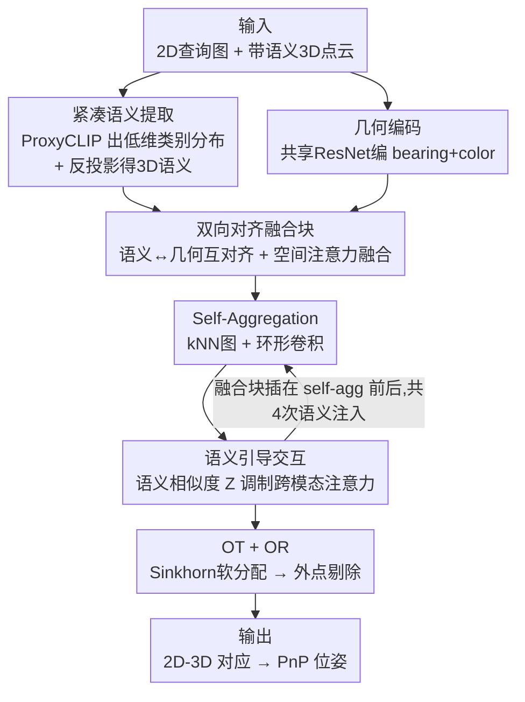

# SAG-GNN: Semantic-Aware Guided GNN for Descriptor-Free 2D-3D Matching

**会议**: CVPR 2026  
**论文**: [CVF Open Access](https://openaccess.thecvf.com/content/CVPR2026/html/Zhang_SAG-GNN_Semantic-Aware_Guided_GNN_for_Descriptor-Free_2D-3D_Matching_CVPR_2026_paper.html)  
**代码**: https://github.com/tinxu0203/SAG-GNN  
**领域**: 3D视觉  
**关键词**: 2D-3D匹配, 视觉定位, 描述子无关匹配, 语义先验, 图神经网络

## 一句话总结
SAG-GNN 把开放词表语义分割得到的「低维语义概率分布」作为额外先验注入到 descriptor-free 的 2D-3D 匹配中，用一个双向对齐融合块把语义与几何特征互相校准、再用语义相似度调制跨模态注意力，在几乎不增加存储的前提下把 MegaDepth / Cambridge 上的匹配与定位精度大幅提升（位姿误差较 A2-GNN 约降 50%）。

## 研究背景与动机
**领域现状**：2D-3D 匹配是给查询图像的关键点和场景 3D 点云之间建立对应，从而做 6-DoF 相机位姿估计，是视觉定位、SLAM、AR、机器人导航的核心一环。目前主流有两条路线：一是**场景坐标回归**（scene coordinate regression），直接从像素回归 3D 坐标，精度高但需要逐场景重训，泛化极差；二是**基于描述子的匹配**，给每个 3D 点存一组 2D 描述子再到特征空间做最近邻，精度强但存储和维护成本高，难以大规模部署。

**现有痛点**：为绕开存储负担，**descriptor-free**（描述子无关）方法兴起——它只用颜色、坐标这类低层几何线索抽特征当图节点，用 GNN + 注意力捕捉上下文，再经最优传输和外点剔除细化匹配。但正因为只依赖低层几何，它在跨模态 2D-3D 交互时很吃力：在含动态物体（行人、车辆，这些在点云里根本不存在）、弱纹理、对称结构的复杂场景里，几何相似但语义不同的区域很容易被错配，性能明显下降。论文图 1 展示 A2-GNN 在这类场景几乎完全失效。

**核心矛盾**：低层几何线索本身**信息不足且有歧义**——几何相似 ≠ 语义一致。而要补的「语义」这种高层信息，又不能像描述子那样存高维向量（否则就违背了 descriptor-free 省存储的初衷）。

**本文目标**：把高层语义引入 descriptor-free 2D-3D 匹配，且需同时解决三个子问题：(1) 怎么从 2D 图像和稀疏 SfM 点云中稳定地抽语义、还要省存储；(2) 语义和几何如何互补融合而不互相压制；(3) 怎么让语义在跨模态信息交互时真正起到引导作用。

**切入角度**：语义是图像和点云之间**天然共享的高层表示**，能消解低层歧义、缩小模态差、在弱纹理区提供上下文。作者据此把语义当作匹配的「向导」，但坚持用紧凑的**类别概率分布**而非高维 CLIP 嵌入来承载它。

**核心 idea**：用「低维语义概率分布 + 双向对齐融合 + 语义调制注意力」把语义先验注入 descriptor-free 匹配，在几乎不增加存储的同时换取大幅精度与鲁棒性提升。

## 方法详解

### 整体框架
输入是一张 2D 查询图像（关键点集 $A$）和一份带语义标签的 3D 点云（$B$）。每个 2D 点表示为 bearing vector + 颜色 + 语义分布 $a_i=[v_i,c_i,s_i]$，3D 点同理 $b_j=[v_j,c_j,s_j]$（用 bearing vector 替代原始坐标以消除相机内参与模态差）。整条 pipeline 分四步：① **双分支编码**——语义分支用冻结的 ProxyCLIP 抽紧凑类别分布，几何分支用共享的 ResNet 编码器把 bearing+color 编成几何特征；② **双向对齐融合块**——让语义和几何互相对齐再自适应融合，得到平衡的 fusion 特征；③ **语义-结构交互**——在 fusion 特征上建 GNN，交替做模态内的 self-aggregation（kNN 图 + 环形卷积）和跨模态的 semantic-guided interaction（用语义相似度调制注意力）；④ **匹配输出**——用 Sinkhorn 最优传输（OT）得软分配再取互最近邻，最后过轻量外点剔除网络（OR）输出最终匹配 $M_{\text{final}}$。其中融合块被插在每个 self-aggregation 前后，共 4 次语义注入，逐步把语义打进特征。

### 关键设计

**1. 紧凑语义提取：用低维类别概率分布承载语义、并靠反投影解决稀疏点云语义难题**

descriptor-free 的命门是省存储，所以语义绝不能用 512 维 CLIP 嵌入硬塞。作者改用**开放词表语义分割（OVSS）**里的 ProxyCLIP（基于 CLIP 图文对齐空间、训练无关、空间定位更准），对查询图像产出一张 $\frac{H}{8}\times\frac{W}{8}$ 的语义图，再在关键点坐标处双线性插值得到 2D 语义特征 $S_A=\mathcal{I}(F_{\text{proxy}}(I_{\text{query}}),u_i)\in\mathbb{R}^{N\times l}$，其中 $l$ 只取 16（如 dome、sky、bridge、person、vehicle、wall、statue 等户外常见类）。这样每个点的语义只是一个 16 维概率分布，存储几乎可忽略，却保留了类别层面的判别信息。

3D 侧更棘手：现成的 3D CLIP 分割模型多在稠密室内扫描或户外 LiDAR 上训练，搬到稀疏、带噪的 SfM 重建点云（如 MegaDepth）上根本不灵。作者的解法是**反投影**——不直接在稀疏点云上抽语义，而是把数据库图像（SfM 重建时用到的那些图）2D 关键点的语义标签沿可见关系投回对应 3D 点，得到 $S_B\in\mathbb{R}^{M\times l}$。这保证了 3D 点语义与查询图语义来自同一套 2D 提取流程、天然一致，又规避了稀疏点云直接抽语义的不可靠性。

**2. 双向对齐融合块：让语义和几何互相校准，而不是一方迁就另一方**

直接把语义并到几何上的**单向融合**在纯 2D 任务里管用，但在 2D-3D 匹配里会因模态差被放大成「语义-几何域偏置」——偏向某一方导致特征失衡、信息丢失。作者设计**双向对齐**：核心是一个跨域的逐通道互相关矩阵，通过轮换 query/key/value 的角色，构造两路互补的中间特征——一路用几何当 query、语义当 key/value，给几何注入语义（$F^\kappa_{gs}$）；另一路反过来给语义注入几何细节（$F^\kappa_{sg}$）：

$$F^\kappa_{gs}=\text{Attn}_1(F^\kappa_{geo},F^\kappa_{sem}),\quad F^\kappa_{sg}=\text{Attn}_1(F^\kappa_{sem},F^\kappa_{geo})$$

其中 $\text{Attn}_1$ 用通道注意力 $A_c=\text{Softmax}((q^\top k)/\alpha)$，再以残差+FFN 形式写回 $F^\kappa_{gs}=F^\kappa_{geo}+\text{FFN}(F^\kappa_{geo}\,\|\,vA_c)$（$\alpha$ 可学）。两路互补中间态拿到后，第二级**空间注意力** $\text{Attn}_2$ 在空间维上自适应融合 $F^\kappa_{\text{fusion}}=\text{Attn}_2(F^\kappa_{gs},F^\kappa_{sg})$，突出关键区域。这样语义和几何是「互为向导」地对齐，既补语义上下文又不丢局部几何细节，得到更平衡一致的表示。消融里（见下表）把它换成两个单向块（公平变体）也明显更差，证明双向设计对跨模态匹配的必要性。

**3. 语义引导交互：用类别相似度调制跨模态注意力，优先匹配语义一致的对应**

GNN 阶段，模态内先做 self-aggregation——建 kNN 图、用基于余弦的环形卷积（annular convolution）捕捉局部几何与角度关系 $\hat F^\kappa=G_{\text{feat}}(F^\kappa_{\text{fusion}})+G_{\text{ang}}(F^\kappa_{\text{fusion}})$。跨模态时，标准注意力只看几何相似，容易把「几何像但语义不同」的区域错连。作者的做法是先算一张跨模态**语义相似度矩阵** $Z=S_A(S_B)^\top$，再用它去调制注意力打分：

$$A_w=\text{Softmax}\!\left(\frac{(\hat F^A W_q)(\hat F^B W_k)^\top\cdot Z\cdot\beta}{\sqrt{d}}\right)$$

$\beta$ 是控制注意力平滑度的可学参数。语义一致的对（$Z$ 大）注意力被增强，语义冲突的对被抑制，更新走残差+FFN：$\tilde F^A=\hat F^A+\text{FFN}(\hat F^A\,\|\,A_w(\hat F^B W_v))$。值得注意的是它**保留所有候选节点**参与交互、只是按语义相似度加权（而非硬性筛掉），从而既保住「不确定但可能成立」的匹配又增强鲁棒性——这正是它在含行人/车辆等动态干扰场景里能抑制错配、又在对称雕塑这类语义连贯区靠几何精配的原因。

### 损失函数 / 训练策略
训练目标为匹配损失加分类损失 $L=L_{\text{match}}+L_{\text{cls}}$。匹配损失对 OT 输出的软分配矩阵 $P$ 做交叉熵监督，真值由重投影定义的二值矩阵 $Y$（含 dustbin 行列表示不匹配）给出：$L_{\text{match}}=-\frac{1}{\sum Y_{ij}}\sum_{i,j}Y_{ij}\log P_{ij}$。分类损失监督外点剔除网络的 inlier 置信 $R$，用初始匹配 $M_{\text{init}}$ 得到的二值标签 $\tilde Y$ 并以 $w_i$ 平衡正负样本。实现上取 $l=16$ 个语义类，采用 self-cross-self 交替注意力层；Adam 优化、batch 16、学习率 0.001，仅在 MegaDepth（SIFT 关键点）上用 4 张 RTX 3090 训练约 24 小时、75 epoch 收敛。

## 实验关键数据

### 主实验
在 MegaDepth 上做 descriptor-free 2D-3D 匹配（top-k 图像检索 k=1 / k=10），指标为重投影 AUC（@1/5/10px，越高越好）与旋转/平移误差分位数（越低越好）。

| 设置 | 方法 | Reproj AUC@1/5/10px ↑ | 平移 @75% (m) ↓ |
|------|------|-----------------------|------------------|
| k=1 | A2-GNN | 12.72 / 41.84 / 48.02 | 2.80 |
| k=1 | **SAG-GNN** | **16.35 / 53.16 / 60.56** | **0.94** |
| k=10 | A2-GNN | 17.29 / 54.41 / 62.24 | 0.48 |
| k=10 | **SAG-GNN** | **21.02 / 65.81 / 74.20** | **0.05** |

相比次优的 A2-GNN，SAG-GNN 在各设置全面领先，相机位姿误差约降 **50%**。视觉定位（表 3）上，Cambridge Landmarks 平均位姿误差从 A2-GNN 的 39.6cm/1.47° 降到 **18.6cm/0.69°**，大幅缩小与 descriptor-based 方法的差距；7Scenes 与先进 descriptor-free 持平。存储上 SAG-GNN 仅靠 16 维语义分布，比 descriptor-based 方法（如 SP+SG 的 22977MB on 7Scenes）少一个数量级。运行时（表 2，top-10）总耗时 712ms，其中语义编码 326.7ms、匹配 385.3ms，与先进方法量级相当。

### 消融实验
在 MegaDepth（k=1）上分解各组件（节选表 4，指标为 Reproj AUC@1/5/10px）：

| 配置 | 融合 | 语义引导 | AUC@1/5/10px | 说明 |
|------|------|----------|--------------|------|
| Baseline | ✗ | ✗ | 12.72 / 41.84 / 48.02 | 无语义的 descriptor-free 基线 |
| (a) | ✗ | Hard | 13.36 / 43.86 / 50.33 | 朴素硬注意力引入语义，几乎无提升 |
| (d) | 双向 | ✗ | 14.37 / 46.69 / 53.23 | 只有融合、无语义引导交互 |
| (e) | ✗ | ✓ | 13.35 / 44.11 / 50.49 | 只有语义引导、无融合块 |
| (f) | 单向×2 | ✓ | 16.01 / 51.81 / 58.95 | 把双向换成两个单向块（公平对比） |
| **SAG-GNN** | **双向** | **✓** | **16.35 / 53.16 / 60.56** | 完整模型 |

### 关键发现
- **朴素地加语义没用**：直接套 OmniGlue 式硬注意力（配置 a）只换来边际提升，说明语义必须被「对齐+调制」地用，naive 注入在 2D-3D 上无效。
- **融合块与语义引导各自都重要、且互补**：去掉融合块（e）或去掉语义引导（d）都明显掉点，两者叠加才到最优。
- **双向 > 单向**：把双向融合换成两个单向块（f）在公平参数下仍逊于完整模型，验证跨模态匹配里「互相对齐」比「单向迁就」更优。
- **强泛化**：模型只在 MegaDepth（SIFT 关键点、固定 16 类语义）上训，却能直接迁到用 SuperPoint 关键点、不同语义标签的 Cambridge Landmarks 并领先所有 descriptor-free 方法，说明关键点检测器和语义类别都可换。
- **抗外点**：在不同 outlier 比例下 AUC 曲线最稳，噪声场景鲁棒性最好。

## 亮点与洞察
- **用类别概率分布而非高维嵌入承载语义**，是把「语义先验」塞进 descriptor-free 框架而不破坏其省存储初衷的关键妥协——16 维分布几乎不增存储却保留判别力，这个 trade-off 很值得迁移到其他对存储敏感的匹配/检索任务。
- **反投影解决稀疏点云语义难抽的问题**很巧：与其硬训一个能在噪声 SfM 点云上分割的 3D 模型，不如让 3D 语义复用 2D 提取结果、沿可见性投回去，既准又与查询侧天然一致。
- **「保留全部候选、只按语义相似度加权」而非硬筛**，避免了误删「不确定但可能对」的匹配，是它在动态干扰场景仍能高召回的根因；这种软调制思路可迁移到任何跨模态注意力。
- 最「啊哈」的点是 $Z=S_A S_B^\top$ 这个语义相似度矩阵直接乘进注意力 logits——用一张极廉价的类别相似度表就把高层先验注入了原本只看几何的注意力。

## 局限与展望
- **语义编码引入额外开销**：top-10 下语义编码占 326.7ms，使总耗时翻倍到 712ms，对实时定位仍是负担；作者称与先进方法量级相当，但绝对耗时偏高。
- **依赖 OVSS 质量与类别表**：语义先验完全来自 ProxyCLIP 的开放词表分割，若分割本身在极端光照/弱纹理下出错，错误会沿反投影传到 3D；且 16 类是户外手工选定，换到差异很大的场景类别表需重新设计。
- **3D 语义依赖数据库图像可见性**：反投影要求 SfM 重建时有对应 2D 关键点，对纯激光/无图像来源的点云不直接适用。
- **训练数据单一**：只在 MegaDepth 上训，虽展示了跨数据集泛化，但室内 7Scenes 上仅与现有方法持平、未拉开差距，室内增益有限。

## 相关工作与启发
- **vs A2-GNN**：A2-GNN 用环形卷积在精简设计里只靠几何提鲁棒性；SAG-GNN 沿用其 GNN 与环形卷积骨架，但额外注入语义先验并做双向融合+语义调制，位姿误差较其约降 50%，代价是多了语义编码耗时。
- **vs DGC-GNN**：DGC-GNN 在层级框架里加颜色和角度线索丰富几何特征，仍是纯几何路线；SAG-GNN 引入正交的「高层语义」维度，互补性更强。
- **vs GoMatch**：GoMatch 受 SuperGlue 启发用交替注意力 + OT，但几何线索稀疏受限；SAG-GNN 在交互阶段用语义相似度调制注意力，缓解了几何歧义。
- **vs descriptor-based（SP+SG / AS）**：后者精度强但存储成本巨大（GB 级）；SAG-GNN 以一个数量级更小的存储显著缩小了与它们的精度差，更适合大规模部署。

## 评分
- 新颖性: ⭐⭐⭐⭐ 首次把开放词表语义先验以紧凑分布形式系统注入 descriptor-free 2D-3D 匹配，融合与调制设计具体且自洽。
- 实验充分度: ⭐⭐⭐⭐ 覆盖匹配+定位+泛化+抗外点+逐组件消融，但室内增益有限、缺更多数据集训练。
- 写作质量: ⭐⭐⭐⭐ 动机—痛点—设计链条清晰，图 1/2/3 与公式配合到位。
- 价值: ⭐⭐⭐⭐ 在省存储与高精度之间给出可部署的折中，对视觉定位工程化有实用意义。

<!-- RELATED:START -->

## 相关论文

- [\[CVPR 2026\] Unlocking 3D Affordance Segmentation with 2D Semantic Knowledge](unlocking_3d_affordance_segmentation_with_2d_semantic_knowledge.md)
- [\[CVPR 2026\] FreeScale: Scaling 3D Scenes via Certainty-Aware Free-View Generation](freescale_scaling_3d_scenes.md)
- [\[CVPR 2026\] Registration-Free Learnable Multi-View Capture of Faces in Dense Semantic Correspondence](registration-free_learnable_multi-view_capture_of_faces_in_dense_semantic_corres.md)
- [\[CVPR 2026\] EV-CGNet: Co-visible Focused 3D-guided 2D Event Keypoint Detection Network](ev-cgnet_co-visible_focused_3d-guided_2d_event_keypoint_detection_network.md)
- [\[CVPR 2026\] SemLT3D: Semantic-Guided Expert Distillation for Camera-only Long-Tailed 3D Object Detection](semlt3d_semantic-guided_expert_distillation_for_camera-only_long-tailed_3d_objec.md)

<!-- RELATED:END -->
