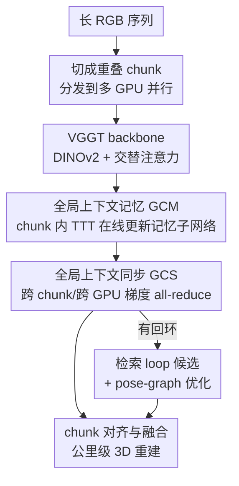

# Scal3R: Scalable Test-Time Training for Large-Scale 3D Reconstruction

**会议**: CVPR 2026  
**论文**: [CVF Open Access](https://openaccess.thecvf.com/content/CVPR2026/html/Xie_Scal3R_Scalable_Test-Time_Training_for_Large-Scale_3D_Reconstruction_CVPR_2026_paper.html)  
**代码**: https://zju3dv.github.io/scal3r （项目页，含代码）  
**领域**: 3D视觉  
**关键词**: 大规模三维重建, 前馈重建, 测试时训练, 全局上下文记忆, VGGT

## 一句话总结
Scal3R 在前馈重建模型 VGGT 内部插入一组「测试时在线自适应」的轻量记忆子网络（GCM），并用跨 chunk/跨 GPU 的梯度同步（GCS）让分块处理的长序列共享同一份全局上下文，从而在公里级 RGB 序列上同时拿到 SOTA 位姿精度和重建精度，还能保持单卡可跑的效率。

## 研究背景与动机

**领域现状**：公里级大场景的三维重建（自动驾驶建图、机器人导航、数字孪生）传统上靠 SfM/SLAM，要么假设已知相机内参，要么依赖 IMU/LiDAR 等额外传感器和复杂多阶段流水线。近两年的前馈重建模型（DUSt3R、MASt3R、VGGT 等）改变了打法：直接用 Transformer 从多视角 RGB 回归出相机参数、深度图和点云，无需显式 3D 先验，其中 VGGT 用统一架构一次前向就出全套几何量，精度高、可扩展。

**现有痛点**：前馈模型的核心瓶颈是注意力的二次复杂度，序列一长（几千帧）就跑不动。两条补救路线各有硬伤：FastVGGT 用 token merging 砍冗余，但激进压缩会丢掉细粒度空间线索、削弱长程依赖，破坏全局结构一致性；VGGT-Long 用「分而治之」把长序列切成重叠 chunk 各自重建再对齐，缓解了算力问题，但**每个 chunk 是独立处理、看不到全局上下文**，一旦某段观测稀疏或场景复杂，局部预测误差会直接污染后续对齐。

**核心矛盾**：长序列的「全局一致性」和「单次前向的算力/显存预算」之间存在硬冲突——要全局上下文就得让所有帧互相看到（二次注意力，跑不动）；要效率就得分块独立处理（丢全局）。现有方法把这两件事当成二选一。RNN 类线性注意力（Mamba/RWKV）虽然把历史压成固定大小隐状态来换效率，但固定容量在大规模 3D 感知这种长程任务上会信息退化。

**本文目标**：在不放弃 VGGT 分块可扩展性的前提下，给分块重建注入一份「能压缩、能保留、能跨块共享」的长程全局上下文。

**切入角度**：作者类比人类感知——人会先建立对整个场景的全局理解，再用它指导局部判断。对应到模型，就是要一个容量远大于固定隐状态、又不带来显著算力开销的记忆机制。测试时训练（TTT）正好提供了这种思路：把上下文当成无标签数据集、把隐状态当成一个小网络的权重，在推理时用自监督目标在线更新这组「快权重」，从而把记忆容量从一个定长向量扩成一个可学习网络。

**核心 idea**：把 TTT 式的在线自适应记忆子网络嵌进 VGGT 的注意力层，让它在 chunk 内积累全局上下文（GCM）；再把分块跨 GPU 的并行视作「上下文并行」，用梯度 all-reduce 把各 chunk 的记忆更新同步成一份共享全局上下文（GCS）。

## 方法详解

### 整体框架
Scal3R 要解决的事是：一条几千帧、跨公里的 RGB 序列，怎么在一次统一推理里重建出全局一致的 3D 场景。整体流程沿用 VGGT-Long 的分块骨架——输入长序列先切成带重叠的 chunk，分发到多张 GPU 上**并行**处理；每个 chunk 走 Scal3R backbone（DINOv2 编码器 + 交替注意力 + 多个输出头，本质是 VGGT），但在 backbone 的全局注意力层后挂上本文的 **Global Context Memory（GCM）** 模块；各 GPU 在更新自己的记忆子网络后，通过 **Global Context Synchronization（GCS）** 把梯度求和广播，实现跨 chunk 的全局上下文共享；最后各 chunk 预测出的相机位姿和深度图，按 VGGT-Long 的方式利用重叠区域算相似变换对齐、融合成最终点云（有回环的轨迹再加检索式 loop 候选 + pose-graph 优化降漂移）。

### 关键设计

**1. 全局上下文记忆 GCM：用一组测试时在线自适应的子网络，把「定长隐状态」换成「可学习记忆网络」**

痛点直指 RNN 式固定隐状态容量不够、长程信息退化。GCM 把每个 chunk 的上下文编码进一组轻量神经子网络——Adaptive Memory Units（AMU，实现为紧凑 MLP），它的权重 $W$ 不是静态的，而是在推理时被自监督目标快速更新的「快权重」。具体地，输入 token $\mathcal{X}_k \in \mathbb{R}^{M\times d}$ 先投影成 key/value 矩阵 $K,V$，然后用 TTT 的两步操作把当前上下文写进 AMU：update 阶段做

$$W \leftarrow W - \nabla_W \sum_{i=1}^{M} \eta_i \mathcal{L}\big(f_W(k_i), v_i\big),$$

其中自监督损失取标准点积形式 $\mathcal{L}(f_W(K),V) = \sum_i -f_W(k_i)^\top v_i$，$\eta_i$ 是从输入 token 预测出的逐 token 学习率；写完之后 apply 阶段把 query $Q$ 经更新后的 $W$ 变换得到输出 $f_W(Q)$。GCM 模块挂在全局注意力层之后（实验里全网共挂 4 个），并用一个可学习门控向量 $\alpha$ 把记忆输出和原 token 自适应融合：$\text{gate}(\mathrm{GCM},\mathcal{X}_k^i;\alpha)=\alpha\otimes\mathrm{GCM}(\mathcal{X}_k^i)+\mathcal{X}_k^i$，整体注意力公式从 VGGT 的「帧内注意力 fattn → 帧间注意力 gattn + 残差」扩成在 gattn 之后再插一道门控 GCM。它有效是因为：AMU 是一个网络而非一个向量，表达容量远大于固定隐状态，能把长程上下文压得更紧又不丢；而门控让模型自己决定每层吸收多少全局记忆，不破坏 VGGT 原本的几何推理能力。

**2. Chunk 级大粒度 TTT 更新：把一整个 chunk 当作一个更新单元，换来可扩展性与 GPU 利用率**

即便 AMU 比定长隐状态强，传统 TTT 仍难扩到长上下文——根因是小 batch 频繁细粒度更新拖垮吞吐、GPU 利用率低，限制了最大可处理序列长度。受 LaCT 启发，本文把 chunk 内**所有** token $\mathcal{X}_k$ 当成**单个**更新单元一次性写进 AMU，而不是逐 token 更新。这样每次 update 是对整块做一次大粒度梯度步（式 8 里对 $i=1..M$ 一次性求和回传），并行度和显存利用率都大幅提升，从而让非线性 AMU 在训练和推理时都能扩到很长的序列。这是把「记忆容量」和「计算效率」同时拉高的关键工程取舍：粒度变粗换吞吐，但因为 AMU 容量足够，粗粒度更新仍能保住上下文精度。

**3. 全局上下文同步 GCS：把跨 GPU 分块视作「上下文并行」，用梯度 all-reduce 让全序列共享同一份记忆**

GCM 只能积累 chunk 内上下文，跨 chunk 仍是各看各的，这正是 VGGT-Long「丢全局」的病根。GCS 的做法是把「图像集切到不同 GPU」重新理解成一种 context parallelism：每张 GPU 先算自己局部 AMU 的更新梯度，然后**把各 chunk 的梯度求和再广播回所有 GPU**，得到同步后的梯度

$$g = \nabla_W \sum_{j=1}^{K}\sum_{i=1}^{M} \eta_i \mathcal{L}_i = \sum_{j=1}^{K}\nabla_W\sum_{i=1}^{M}\eta_i\mathcal{L}_i,$$

再用这份聚合梯度统一更新所有 GPU 上的 AMU $W$。工程上用 PyTorch 的 all-reduce 原语实现，通信开销极小。效果是每个局部 chunk 都被「全序列的观测」灌注，局部精度更高、跨 chunk 一致性更强——这也解释了为什么 Scal3R 在长序列上比独立分块的 VGGT-Long 稳得多。

**4. 训练/推理一致的全局上下文流通，并兼容单卡退化运行**

GCM+GCS 在训练和推理时是同一套机制：推理时同样先分块上多卡、GCS 跨设备通信全局上下文、再按 VGGT-Long 用重叠区域算相似变换对齐融合。训练上有两个值得记的细节：一是为提升长度泛化，每次迭代会把 32 张 GPU 随机切成若干组，组内才做 GCS，使得「有效序列长度」在 1~32 个 chunk 间随机变化，逼模型见过各种长度；二是方法可退化为单卡顺序处理 chunk（牺牲推理时间换显存），保证不是只能在大集群上跑的方案。

### 损失函数 / 训练策略
端到端联合训练 GCM 模块和 VGGT backbone，沿用 VGGT 的多任务损失 $\mathcal{L} = \lambda\mathcal{L}_{cam} + \mathcal{L}_{dpt} + \mathcal{L}_{xyz}$：$\mathcal{L}_{cam}$ 是监督相机头的 L1 损失，$\mathcal{L}_{dpt}$ 和 $\mathcal{L}_{xyz}$ 把置信度加权项与基于梯度的正则结合起来监督深度头和点云头。优化器 AdamW，GCM 峰值学习率 $1\times10^{-4}$、backbone $1\times10^{-5}$，cosine 衰减 + 2k 迭代线性 warm-up，梯度裁剪 max norm 1.0。在 32 张 A800 上训 60k 迭代，约 3 天。训练数据横跨 18 个数据集（Co3Dv2、BlendedMVS、DL3DV、ScanNet++、Virtual KITTI、MatrixCity 等），覆盖室内/室外、合成/真实、不同尺度；顺序数据集直接采连续序列，无序数据集随机采同场景图像打乱输入。

## 实验关键数据

### 主实验
位姿精度在 Virtual KITTI（域内合成）、KITTI Odometry、Oxford Spires（域外真实）上评测，报告 Sim(3) 对齐后的 RRE(°/100m)、RTE(m/100m)、ATE(m)。Scal3R 在最具挑战的真实大场景上全面领先。

| 数据集 | 指标 | Scal3R(本文) | VGGT-Long(最强前馈基线) | TTT3R | CUT3R |
|--------|------|------|----------|-------|-------|
| KITTI Odometry | ATE ↓ | **14.55** | 25.94 | 177.73 | 209.78 |
| KITTI Odometry | RTE ↓ | **4.61** | 9.67 | 68.55 | 73.65 |
| Oxford Spires | ATE ↓ | **4.45** | 15.46 | 31.57 | 28.01 |
| Oxford Spires | RRE ↓ | **7.87** | 30.91 | 62.68 | 54.69 |

三维重建精度在 ETH3D、Oxford Spires、Virtual KITTI 上报告 Chamfer Distance(CD) 与 F1：

| 数据集 | 指标 | Scal3R | VGGT-Long | FastVGGT |
|--------|------|--------|-----------|----------|
| ETH3D | CD ↓ / F1 ↑ | **0.11 / 0.91** | 0.24 / 0.84 | 0.50 / 0.70 |
| Oxford Spires | CD ↓ / F1 ↑ | **0.96 / 0.96** | 3.41 / 0.80 | 2.76 / 0.76 |
| VKITTI2 | CD ↓ / F1 ↑ | **0.40 / 0.91** | 1.78 / 0.70 | 1.73 / 0.67 |

资源对比（KITTI 03/04/10，平均 758 帧，除 FastVGGT 用 A800 外均跑单卡 RTX 4090）：Scal3R 峰值显存 10.32 GB、总推理时间 300.76s、FPS 2.53。相比 FastVGGT 直接 OOM/需 A800，Scal3R 单卡可跑、显存适中；轻量在线系统 DPVO++/CUT3R 吞吐更高但长序列精度远不及本文；COLMAP 精度尚可但慢 20 倍以上。

### 消融实验

| 配置 | RRE ↓ | RTE ↓ | ATE ↓ | 说明 |
|------|-------|-------|-------|------|
| 1M 子网络状态 | 1.01 | 1.01 | 0.99 | 记忆容量最小 |
| 2M 子网络状态 | 0.95 | 0.91 | 0.93 | 容量加大 |
| 4M 子网络状态 | **0.87** | **0.84** | **0.85** | 容量越大长程上下文保留越好 |
| w/o GCM | 1.30 | 7.03 | 19.00 | 去掉全局记忆，ATE 大幅恶化 |
| w/o GCS | 1.28 | 7.01 | 15.80 | 去掉跨块同步，ATE 明显恶化 |
| Full model | **1.17** | **5.99** | **13.70** | 完整模型 |

> 注：State Size 与 Global Context 两个 block 在不同长序列设置上跑、不可直接横比大小。

### 关键发现
- **GCM 是长程上下文的主载体**：去掉 GCM 比去掉 GCS 掉点更狠（ATE 19.00 vs 15.80），说明记忆子网络承担主要的长程信息存储，而 GCS 负责把它跨 chunk 传播；两者去掉任一都明显变差，证明「存」与「共享」缺一不可。
- **记忆容量直接换精度**：子网络状态从 1M 加到 4M，RRE/RTE/ATE 单调改善，印证「定长隐状态容量不够」的出发点——更大的可学习记忆确实能保住更多长程上下文。
- **长序列稳健性**：在几千帧的 KITTI Odometry 00（4542 帧）等序列上，多数基线 OOM 或丢跟踪发散，Scal3R 仍保持低漂移、保住全局结构。

## 亮点与洞察
- **把「上下文并行」嫁接成「全局记忆共享」**：GCS 复用了多 GPU 分块并行这个本来只为省显存的工程结构，靠一行 all-reduce 把它变成跨 chunk 共享全局上下文的通道——同一套并行既省算力又涨精度，这个视角转换很巧。
- **TTT 当记忆 + LaCT 大粒度更新的组合拳**：单用 TTT 容量够但慢，单看 LaCT 是 NLP 里的加速技巧；本文把「chunk 整块当更新单元」搬到 3D 重建，同时解决容量和吞吐，是跨领域迁移的漂亮案例。
- **可即插即用、不动 VGGT 主体**：GCM 以门控残差形式挂在全局注意力后，$\alpha$ 让模型自适应吸收，几乎不破坏预训练几何推理能力——这种「在强 backbone 上挂记忆模块」的思路可迁移到其他前馈几何/视频模型。
- **训练时随机分组造可变序列长度**：把 32 卡随机切组、组内才同步，等于免费制造 1~32 chunk 的长度多样性，是提升长度泛化的低成本 trick。

## 局限与展望
- **强依赖多 GPU 并行的设计**：虽说能单卡顺序退化，但 GCS 的全局上下文共享本质是为多卡 context parallelism 设计的，单卡退化要牺牲推理时间，真正「公里级一次推理」仍需多卡。
- **对齐融合仍沿用 VGGT-Long 的相似变换**：chunk 间对齐依赖重叠区域算 Sim 变换，全局上下文虽提升了局部精度，但最终融合环节的对齐误差/回环处理（检索 loop + pose-graph）仍是独立后处理，端到端程度有限。
- **记忆容量-显存的权衡未做穷尽分析**：状态大小从 1M 到 4M 单调变好，但更大状态对显存/速度的边际代价、最优容量上限论文未深入；逐 token 学习率 $\eta_i$ 的设计也只一笔带过。
- **改进方向**：把 chunk 对齐融合也纳入可学习/可微环节，或让 GCS 的同步频率/分组在推理时自适应轨迹复杂度，可能进一步降漂移。

## 相关工作与启发
- **vs VGGT-Long**: 同样分块处理长序列，但 VGGT-Long 每块独立、无全局上下文，对齐高度依赖局部精度，复杂场景误差会传染；Scal3R 用 GCM+GCS 给每块灌全局上下文，长序列稳健性和跨数据集泛化显著更好（Oxford Spires ATE 4.45 vs 15.46）。
- **vs FastVGGT**: FastVGGT 用 token merging 压缩注意力换吞吐，但激进压缩丢细粒度线索、削长程依赖且易 OOM；Scal3R 不压缩 token，而是外挂可学习记忆扩容量，单卡可跑且精度更高。
- **vs TTT3R / CUT3R 等记忆型前馈模型**: 它们用固定大小的 memory token 或因果结构在线更新，但固定容量/有限因果视野在长序列上仍会漂移累积；Scal3R 的 AMU 是可学习子网络（更大容量）+ chunk 大粒度更新（更高效），从根上扩了记忆容量。
- **vs Mamba/RWKV/DeltaNet 等线性注意力**: 它们把历史压成固定隐状态，效率高但容量受限、长程依赖捕获弱；Scal3R 沿 TTT 路线把隐状态升级成在线自适应网络，针对大规模 3D 感知这类长程任务更合适。

## 评分
- 新颖性: ⭐⭐⭐⭐⭐ 把 TTT 记忆 + LaCT 大粒度更新 + 上下文并行同步三件事缝成一套可扩展全局上下文机制，思路清晰且跨领域迁移到位。
- 实验充分度: ⭐⭐⭐⭐ 位姿+重建双任务、域内域外多基准、资源对比和消融齐全；但部分扩展结果（ScanNet++/TUM/Waymo）和运行时缩放放在补充材料。
- 写作质量: ⭐⭐⭐⭐ 动机—方法—实验逻辑顺畅，GCM/GCS 公式清楚；个别记忆容量-效率权衡的分析略浅。
- 价值: ⭐⭐⭐⭐⭐ 公里级 RGB-only 重建做到 SOTA 且单卡可跑，对自动驾驶建图/数字孪生有直接实用价值。

<!-- RELATED:START -->

## 相关论文

- [\[CVPR 2026\] ZipMap: Linear-Time Stateful 3D Reconstruction via Test-Time Training](zipmap_linear-time_stateful_3d_reconstruction_via_test-time_training.md)
- [\[CVPR 2026\] tttLRM: Test-Time Training for Long Context and Autoregressive 3D Reconstruction](tttlrm_test-time_training_for_long_context_and_autoregressive_3d_reconstruction.md)
- [\[CVPR 2026\] Low-Rank Test-Time Training for Pre-Trained Point Cloud Models](low-rank_test-time_training_for_pre-trained_point_cloud_models.md)
- [\[CVPR 2026\] Learning 3D Reconstruction with Priors in Test Time](tco_learning_3d_reconstruction_with_priors_in_test_time.md)
- [\[CVPR 2026\] OLATverse: A Large-scale Real-world Object Dataset with Precise Lighting Control](olatverse_a_large-scale_real-world_object_dataset_with_precise_lighting_control.md)

<!-- RELATED:END -->
