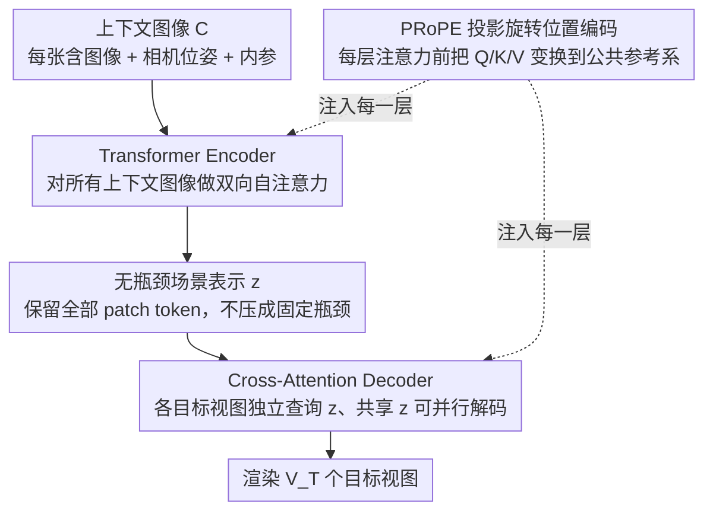

# Scaling View Synthesis Transformers (SVSM)

**会议**: CVPR 2026  
**arXiv**: [2602.21341](https://arxiv.org/abs/2602.21341)  
**代码**: [https://www.evn.kim/research/svsm](https://www.evn.kim/research/svsm)  
**领域**: 3D视觉 / 新视角合成 / 缩放定律  
**关键词**: 新视角合成, 缩放定律, Transformer, encoder-decoder, 计算效率, PRoPE  

## 一句话总结

首次为无几何先验的 NVS Transformer 建立缩放定律：提出有效批量大小假设（B_eff = B·V_T）揭示 encoder-decoder 被低估的根因，设计单向 encoder-decoder 架构 SVSM，在 RealEstate10K 上以不到一半训练 FLOPs 达到新 SOTA（30.01 PSNR），Pareto 前沿比 LVSM decoder-only 左移 3×。

## 研究背景与动机

**NVS 缺少缩放分析**：NLP（Chinchilla、Kaplan）和 2D 视觉（DiT）已有系统缩放定律，但 3D 视觉/NVS 领域完全空白——模型设计、训练配置缺乏计算最优的原则性指导

**Decoder-only 架构冗余严重**：LVSM decoder-only 渲染每张目标视图都要重新走完全部上下文 token，FLOPs 的 MLP 部分 ∝ V_T×(V_C+1)，注意力部分 ∝ V_T×(V_C+1)²，随目标视图数线性增长

**Encoder-decoder 被不公平否定**：LVSM 原文中 encoder-decoder 变体显著弱于 decoder-only，但本文发现根因是：(a) 使用了固定大小场景潜表示引入瓶颈，(b) 在不等计算预算下对比，并非架构本身劣势

**目标视图与批量大小的交互效应未知**：NVS 训练标准做法是每个场景重建多个目标视图，但增加 V_T vs 增加 B 对训练动态的影响从未被形式化分析

**多视图（V_C>2）缩放是否保持**：将 encoder-decoder 扩展到多视图时，场景表示瓶颈是否会导致缩放退化是开放问题

## 方法详解

### 整体框架

这篇论文想回答的不是「怎么把 NVS 渲染做得更准」，而是「在固定计算预算下，NVS Transformer 该怎么设计和训练才最划算」——这是 3D 视觉里此前空白的缩放定律问题。它的载体是一个单向 encoder-decoder 架构 SVSM：上下文图像 $C=\{(I_i, g_i, K_i)\}$ 先过 Transformer Encoder 做双向自注意力，得到保留全部 patch token 的场景表示 $z=E[C]$（不压成固定瓶颈），再由 Cross-Attention Decoder 单向地从 $z$ 中并行渲染 $V_T$ 个目标视图 $\tilde{I}=D[z, g_T, K_T]$。一句话概括就是「编码一次、解码多次，目标视图之间互不交互但能并行」，而论文真正的贡献是用这套架构把 encoder-decoder 被低估的原因讲清楚，并给出计算最优的训练配方。

### 关键设计

**1. SVSM 架构：用无瓶颈的场景表示摊销多目标视图渲染**

LVSM 的 decoder-only 每渲染一张目标视图都要重走全部上下文 token，FLOPs 随目标视图数线性涨；而 LVSM 此前的 enc-dec 变体之所以表现差，根因是把场景压成了固定数量的 learnable token，引入信息瓶颈。SVSM 的 Encoder 是标准 ViT，对所有上下文图像做双向自注意力后输出全部 patch token 当场景表示，Decoder 再用 cross-attention 从 $z$ 里取信息、各目标视图独立解码但共享 $z$ 可并行。计算上 $\chi_\text{MLP}(\text{SVSM})\propto V_T+V_C$、$\chi_\text{Attn}(\text{SVSM})\propto V_C\times(V_T+V_C)$，当 $V_T\gg V_C$ 时降到 $O(V_T)$，远优于 LVSM 的 $O(V_T\cdot V_C+V_T)$。代价是 encoder 没法主动丢弃与目标无关的信息，同参数同步数时 SVSM 弱于 LVSM——但渲染省下的算力可以拿去加大模型和训练步数，于是在等计算预算下反而显著更优。

**2. 有效批量大小假设：B 和 V_T 怎么拆不重要，乘积才重要**

NVS 训练惯例是每个场景重建多个目标视图，但「增大 $V_T$」和「增大 $B$」对训练动态到底等不等价，此前无人形式化。本文提出有效批量大小 $B_\text{eff}\equiv B\cdot V_T$（$B$ 为场景数、$V_T$ 为每场景目标视图数），并在 DL3DV（$V_C=8$）和 RE10K（$V_C=2$）上固定 $B_\text{eff}$ 换不同 $(B, V_T)$ 组合：最终 PSNR 只差 $\pm0.1\sim0.2$、损失曲线几乎重合。这个假设一举解释了两件事——对 LVSM，$\chi\propto B\cdot V_T\cdot(V_C+1)=B_\text{eff}\cdot(V_C+1)$，与拆分方式无关，调 $V_T$ 省不了算力；对 SVSM，$\chi\propto B\cdot(V_C+V_T)=B_\text{eff}+B\cdot V_C$，于是减小 $B$、增大 $V_T$ 就能在保持 $B_\text{eff}$（即保持性能）的同时压低总 FLOPs，这正是 enc-dec 效率优势的来源。也由此点破：LVSM 原文里 enc-dec 输给 decoder-only，是因为在等迭代次数而非等 FLOPs 下对比。

**3. 立体（stereo）缩放定律：同性能只需 1/3 计算**

在 $V_C=2$ 的 RE10K 上（$V_T=6$、batch size=256、patch size=16），扫 7M~300M 参数 × 3-4 种训练样本数，总计算跨 $10^3$ 量级（100 petaflops 到 100 exaflops），并用 $1/\sqrt{L}$ 残差缩放（depth-μP）保证不同深度模型公平对比。结果在 log-log 图上两族 Pareto 前沿斜率相同，但 SVSM 整体左移 $3\times$——同性能只要 1/3 FLOPs。按 Chinchilla 方式对每个预算 $\chi$ 拟合 $N_\text{opt}\propto\chi^a$、$D_\text{opt}\propto\chi^b$，SVSM 得 $a=0.52, b=0.47$（$a\approx b$，与 Chinchilla 一致，预算翻倍应 $\sqrt{k}$ 给模型、$\sqrt{k}$ 给数据），LVSM 则 $a=0.65, b=0.33$ 更偏模型侧。最终 SVSM-416M（Pareto 最优）和 SVSM-740M（迭代匹配）在约 0.77 zflops（LVSM 一半）下双双超过 LVSM-171M。

**4. 多视图缩放定律与 PRoPE：把位姿打进每一层救回缩放**

直接把 SVSM 扩到 $V_C=4$ 时，Pareto 前沿很快饱和、缩放行为消失，原因是 encoder-decoder 里固定流向的场景表示成了信息瓶颈、位姿信息在深层被丢。解法是投影旋转位置编码 PRoPE：每层注意力前把 Q/K/V 通过相机位姿变换到公共参考坐标系再做注意力，算完逆变换回各自坐标系，等于把位姿直接嵌进每一层而非只在初始嵌入。加上 PRoPE 后 SVSM 重新恢复理想缩放趋势，且 Pareto 前沿仍优于 LVSM+PRoPE。

**5. 固定潜表示对照实验：瓶颈才是缩放的真凶**

为了把「解码方向」和「是否有瓶颈」两个因素分开，作者在 Objaverse（$V_C=8$）上对比 SVSM-fixed（固定潜表示 + 单向解码）与 LVSM enc-dec（固定潜表示 + 双向解码）：两者缩放行为类似，SVSM-fixed 仍有 $5\times$ 计算优势（前沿左移 $5\times$），但二者都明显差于无瓶颈设计。这说明限制缩放的主因不是解码器是否单向，而是固定大小的场景表示本身。

## 实验结果

### 表1：Stereo NVS (V_C=2) 最大模型

| 模型 | 参数量 | 训练FLOPs | PSNR↑ | SSIM↑ | LPIPS↓ | FPS(V_C=4) |
|------|:---:|:---:|:---:|:---:|:---:|:---:|
| LVSM Enc-Dec | 173M | 2.53 zflops | 28.58 | 0.893 | 0.114 | 52.9 |
| LVSM Dec-Only | 171M | 1.60 zflops | 29.67 | 0.906 | 0.098 | 19.5 |
| SVSM (Iter-matched) | 740M | 0.74 zflops | 29.80 | 0.907 | 0.098 | 42.7 |
| **SVSM (Pareto)** | **416M** | **0.77 zflops** | **30.01** | **0.910** | **0.096** | **61.8** |

### 表2：与显式几何方法对比（RealEstate10K）

| 方法 | PSNR↑ | SSIM↑ | LPIPS↓ |
|------|:---:|:---:|:---:|
| pixelNeRF | 20.43 | 0.589 | 0.550 |
| pixelSplat | 26.09 | 0.863 | 0.136 |
| MVSplat | 26.39 | 0.869 | 0.128 |
| GS-LRM | 28.10 | 0.892 | 0.114 |
| **SVSM** | **30.01** | **0.910** | **0.096** |

### 表3：多视图 NVS (V_C>2)

| 模型 | 参数量 | 训练FLOPs | PSNR↑ | LPIPS↓ | FPS(V_C=4) | FPS(V_C=16) |
|------|:---:|:---:|:---:|:---:|:---:|:---:|
| LVSM+PRoPE | 171M | 43 eflops | 26.19 | 0.145 | 104.7 | 23.8 |
| SVSM (Iter) | 711M | 32 eflops | 26.29 | 0.141 | 280.4 | 230.4 |
| **SVSM (Pareto)** | **400M** | **44 eflops** | **26.87** | **0.129** | **411.1** | **333** |

## 核心发现

1. **3× 计算效率**：SVSM Pareto 前沿与 LVSM 斜率相同但左移 3×——同性能只需 1/3 训练计算
2. **Chinchilla 规律跨模态复现**：SVSM 的 a≈0.52, b≈0.47 (a≈b) 与 NLP 发现一致——计算预算加倍应等分给模型和数据
3. **B_eff 决定一切**：有效批量大小 B·V_T 是决定最终性能的唯一因素，(B, V_T) 的具体拆分方式差异 ≤0.2 PSNR
4. **PRoPE 解锁多视图缩放**：无 PRoPE 时 SVSM 在 V_C>2 快速饱和；加 PRoPE 后恢复缩放且前沿仍优于 LVSM
5. **固定潜表示是缩放瓶颈**：无论解码器方向性如何，固定大小场景表示都严重限制缩放能力
6. **推理速度**：SVSM 在 V_C=4 时渲染速度达 LVSM 的 4×，外推到 V_C=16 达 14×

## 亮点与局限

**亮点**：
- 有效批量大小假设概念简洁洞察深刻，一举解释了 enc-dec 被低估的根因并提供利用方法
- 首次在 3D 视觉领域建立 Chinchilla 式计算最优训练配方
- 10³ 量级 FLOPs 的系统扫描、3 个数据集、多种 V_C 设置，实验设计极其严谨

**局限**：
- 训练数据受限：仅使用 RE10K、DL3DV 等小型带位姿数据集并重复采样，与标准 <1 epoch 缩放实践不同
- V_C 大时 encoder 二次复杂度使渲染速度低于 LVSM enc-dec（V_C=8 时）
- 仅覆盖稀疏到中等视图场景，V_C≫16 时线性注意力模型可能更有优势
- 限于确定性渲染，未研究缩放定律对扩散模型式 NVS 的适用性

## 评分

- 新颖性: ⭐⭐⭐⭐⭐ 有效批量大小假设 + NVS 缩放定律填补 3D 视觉空白
- 实验充分度: ⭐⭐⭐⭐⭐ 10³ FLOPs 系统分析、stereo+multiview+fixed latent 三场景全覆盖
- 写作质量: ⭐⭐⭐⭐⭐ Chinchilla 式严谨呈现，图表专业清晰
- 价值: ⭐⭐⭐⭐⭐ 计算最优训练配方 + 架构指导原则可直接迁移到其他 3D 视觉任务

<!-- RELATED:START -->

## 相关论文

- [\[CVPR 2026\] FreeScale: Scaling 3D Scenes via Certainty-Aware Free-View Generation](freescale_scaling_3d_scenes.md)
- [\[CVPR 2026\] Emergent Outlier View Rejection in Visual Geometry Grounded Transformers](emergent_outlier_view_rejection_in_visual_geometry_grounded_transformers.md)
- [\[CVPR 2026\] Cross-View Splatter: Feed-Forward View Synthesis with Georeferenced Images](cross-view_splatter_feed-forward_view_synthesis_with_georeferenced_images.md)
- [\[CVPR 2026\] Block-Sparse Global Attention for Efficient Multi-View Geometry Transformers](block-sparse_global_attention_for_efficient_multi-view_geometry_transformers.md)
- [\[CVPR 2026\] SmokeSVD: Smoke Reconstruction from A Single View via Progressive Novel View Synthesis and Refinement with Diffusion Models](smokesvd_smoke_reconstruction_from_a_single_view_via_progressive_novel_view_synt.md)

<!-- RELATED:END -->
