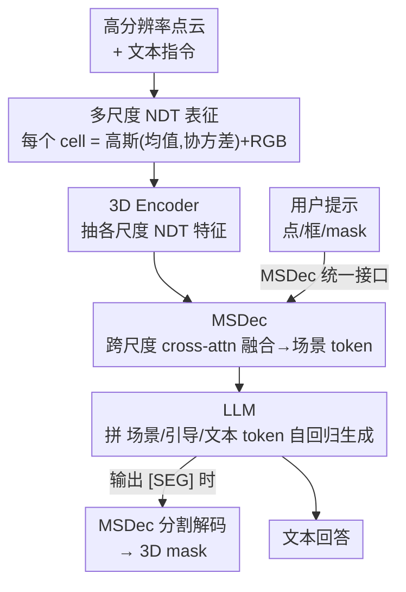

# Scenes as Tokens: Multi-Scale Normal Distributions Transform Tokenizer for General 3D Vision-Language Understanding

**会议**: CVPR 2026  
**论文**: [CVF Open Access](https://openaccess.thecvf.com/content/CVPR2026/html/Tang_Scenes_as_Tokens_Multi-Scale_Normal_Distributions_Transform_Tokenizer_for_General_CVPR_2026_paper.html)  
**代码**: https://github.com/snldmt/NDTokenizer3D  
**领域**: 3D视觉 / 多模态VLM  
**关键词**: 3D VLM, 场景 tokenizer, Normal Distributions Transform, 多尺度, 指代分割

## 一句话总结
NDTokenizer3D 用一套基于多尺度 Normal Distributions Transform（NDT）的三阶段场景 tokenizer，把高分辨率点云压成信息丰富的「场景 token」喂给 LLM，并让同一个解码器（MSDec）兼当用户交互接口和分割 mask 解码器，从而用一个统一模型同时做 3D 指代分割、视觉问答和密集描述，且在分割、QA、抗幻觉等任务上刷新通用型 3D VLM 的成绩。

## 研究背景与动机
**领域现状**：把视觉语言模型从 2D 扩到 3D（自动驾驶、具身智能、AR/VR）的关键，是要有一套有效的 3D 场景 tokenization，把动辄几十万点的高分辨率点云压成长度有界的 token 序列，再交给 LLM 推理。

**现有痛点**：之前的点云 tokenizer 几乎都靠**下采样**来降点数（如 superpoint pooling + token selection），这会直接丢掉细粒度几何细节，又没有专门机制去捕捉抽象的全局结构。另一类方法要么把整个场景当成**单一尺度**实体，要么拆成一串**物体实例**序列，二者都忽略了真实空间推理所依赖的「物体—环境」和「物体—物体」跨尺度关系——物体本来就出现在不同空间分辨率上，既要看清局部细节又要把握全局上下文。

**核心矛盾**：信息保真（保留原始点的几何细节）与序列长度有界（LLM 只能吃定长 token）之间的矛盾；下采样虽然解决了长度，却以牺牲细节为代价。同时多数 3D VLM 还是任务专用、对人类交互（点/框/mask 提示）支持很弱，难以泛化到多种场景理解任务。

**本文目标**：(1) 设计一种不靠下采样、能同时保住局部细节与全局上下文的多尺度 3D 表征与 tokenizer；(2) 用一个统一架构同时支持文本生成类任务（QA、描述）和点级理解任务（分割），并原生支持人类交互提示。

**切入角度**：作者借用了 SLAM 里的 Normal Distributions Transform——它把点云切成规则网格，每个 cell 用一个高斯分布（均值+协方差）建模局部曲面。这个基于网格的形式天然支持多分辨率：细网格 cell 保留局部几何，粗网格 cell 编码全局结构；而且高斯统计量「无损」地概括了 cell 内原始点，不像下采样那样直接扔点。

**核心 idea**：用「多尺度 NDT 高斯 cell」代替「下采样点」作为 3D 表征，再用一个跨尺度融合的解码器 MSDec 把它压成全息场景 token，并把这个 MSDec 复用成交互提示和分割解码的统一接口。

## 方法详解

### 整体框架
NDTokenizer3D 是一个通用型 3D VLM。输入是高分辨率原始点云（外加文本指令、可选的用户提示），输出是文本回答或 3D 分割 mask。整条管线分两块：先用**三阶段 tokenization** 把场景变成 token，再让 LLM 拿这些 token 做各种任务，其中分割与交互都复用同一个解码器 MSDec。

三阶段 tokenization：① 从原始点云构造**多尺度 NDT 表征**（每个 cell 是高斯统计量 + RGB）；② 用一个 transformer 式 **3D Encoder** 抽出各尺度的 NDT 特征；③ **MSDec** 用一组可学习 query 跨尺度（粗→细）做 cross-attention，逐层融合成全息「场景 token」$E_V$，投影进 LLM 输入空间。除了产 token，MSDec 还兼两职：把用户提示（点/框/mask）编码成引导 token $E_P$，以及在 LLM 吐出 `[SEG]` 时把它解码成 3D mask。LLM 把场景 token、引导 token、文本 token 拼起来，自回归生成回答，必要时触发分割。

### 关键设计

**1. 多尺度 NDT 表征：用高斯 cell 代替下采样点，无损保留几何**

针对「下采样丢细节」这个核心痛点，作者直接在高分辨率点云上构造 NDT 表征而不降点。给定点云 $X=\{x_i\}_{i=1}^{N_p}\in\mathbb{R}^{N_p\times3}$，把空间切成规则网格，每个 cell $C_r^j$ 用落在其中的点拟合一个高斯：

$$\mu_r^j=\frac{1}{n}\sum_{i=1}^n x_i,\quad \Sigma_r^j=\frac{1}{n-1}\sum_{i=1}^n (x_i-\mu_r^j)(x_i-\mu_r^j)^T$$

其中 $r=1,\dots,R$，$r{=}1$ 是最粗尺度、$r{=}R$ 最细。粗尺度 cell 把大片区域聚合成抽象的全局上下文，细尺度 cell 保留局部曲面细节——同一套网格机制天然给出多分辨率。为补上视觉外观，每个 cell 还通过多视图投影从 2D 图像取 RGB：$c_r^j=\frac{1}{N_I}\sum_{k=1}^{N_I}I_k(u_k,v_k)$，投影坐标 $[u_k,v_k]^T=P(\mu_r^j\mid k)$。最终每个 cell 是 15 维描述子 $C_r^j=[\mu_r^j;\Sigma_r^j;c_r^j]$（3 维均值 + 9 维协方差 + 3 维 RGB）。关键在于：高斯的均值+协方差**隐式概括了 cell 内全部原始点的结构与几何**，这正是它优于「随机扔点」的下采样之处。随后一个 transformer 式 3D Encoder $\Phi$ 把各尺度 cell 编码成特征 $F_r=\Phi(C_r)\in\mathbb{R}^{N_r\times d_f}$。

**2. 多尺度 NDT 解码器 MSDec：跨尺度 cross-attention 融合成全息场景 token**

光有多尺度特征还不够，得把它们融成 LLM 能消化的定长 token。MSDec 由 $R$ 层 transformer decoder 组成，每层把多尺度 NDT 特征 $F_r$ 当作 Key/Value，一组可学习 query 当 Query。第一层用最细尺度特征下采样后的子集初始化 query：$Q_1=W_1^Q(\downarrow F_R)$；之后每层做 cross-attention → self-attention → FFN 更新 query：

$$\tilde{Q}_r=\mathrm{CrossAttn}(Q_r,K_r,V_r),\ \hat{Q}_r=\mathrm{SelfAttn}(\tilde{Q}_r),\ Q_{r+1}=\mathrm{FFN}(\hat{Q}_r)$$

其中 $K_r=W_r^K F_r,\ V_r=W_r^V F_r$。逐层从粗到细注入各尺度信息，最终输出 $Q_R$ 就是融合了所有尺度的全息场景表征，再过多模态对齐头 $f_{mm}$ 投到 LLM 空间得到场景 token $E_V=f_{mm}(Q_R)$。这种分层解码让全局语义与细粒度细节在同一组 token 里共存，是它在指代分割上压过单尺度的 3D-LLaVA 的关键。

**3. MSDec 复用为统一接口：交互提示 + 分割解码共用一个解码器**

为了既支持人类交互又能输出 mask，又不想堆一堆任务专用模块，作者把 MSDec 直接复用成多功能接口。**用户提示**（点/框/mask）先转成最细尺度特征上的二值 mask $m_u$，对被选区域做平均池化得到提示特征 $F_R^P$，用它初始化一个额外 query $Q_1^P$，与原始 query 拼接后一起过所有 MSDec 层，输出经同一个 $f_{mm}$ 投成引导 token $E_P$，和场景 token 一起进 LLM——把用户意图在解码器层面就和多尺度 3D 上下文对齐。**分割解码**则走 `[SEG]` 触发：LLM 生成特殊 token `[SEG]` 时，取其隐状态 $H^S$ 过分割头 $f_s$ 得到 query $Q_1^S$，同样用 MSDec 解码出分割感知表征 $Q_R^S$，再过 mask 头 $f_m$ 变成一个 kernel，与最细尺度特征做点积预测 3D mask $M\in\mathbb{R}^{N_R\times1}$。妙在分割是从语言推理里**自然涌现**的（`[SEG]` 嵌在文本回答中），而不是另起一条预测分支或后处理，保持了架构一致性。

**4. 两阶段训练：先用实例分割+CLIP 蒸馏给 NDT 表征找好初始化，再指令微调**

因为没有现成的 NDT 预训练权重，作者分两阶段训。**Stage 1（预训练 3D Encoder + MSDec）**：在 3D 实例分割任务上联合训，MSDec 后接分类头和 mask 头，用分类交叉熵 $\mathcal{L}_{cls}$ + 分割损失 $\mathcal{L}_m$（BCE + Dice）。同时引入 2D 视觉语言监督——把 CLIP 图像特征按 Eq.(2) 的投影提升到 3D 得 $F_r^C$，对 $F_r^C$ 与 $F_r$ 加余弦相似度损失 $\mathcal{L}_s$，让 3D 特征语义对齐；总损失 $\mathcal{L}=\mathcal{L}_{cls}+\lambda_1\mathcal{L}_m+\lambda_2\mathcal{L}_s$。**Stage 2（指令微调）**：冻结 3D Encoder 和 MSDec，只训投影层 $f_{mm}$、$f_s$ 和 LLM（LoRA），在指代分割/QA/密集描述的混合数据上多任务训，损失为下一 token 交叉熵 $\mathcal{L}_t$ + mask 损失 $\mathcal{L}_m$ + 答案隐状态与 CLIP 文本嵌入间的余弦损失 $\mathcal{L}_s$：$\mathcal{L}=\mathcal{L}_t+\lambda_3\mathcal{L}_m+\lambda_4\mathcal{L}_s$。

## 实验关键数据

数据集与设置：ScanNet（1201 训练 / 312 验证场景）。Stage 1 用 ScanNet200 的实例 mask 预训练；Stage 2 用约 295k 指令-回答对多任务微调（指代分割 ScanRefer/Nr3D/Multi3DRefer，QA 用 ScanQA/SQA3D，密集描述用 Nr3D/Scan2Cap）。3D Encoder 用 Point Transformer v3，LLM 用 LLaVA-1.5-7B，MSDec 用 850 个初始 query，4×A100 + LoRA 微调一个 epoch。

### 主实验
与通用型 3D VLM 对比（部分指标）：

| 任务 / 指标 | 之前最好 | NDTokenizer3D | 提升 |
|------|------|------|------|
| Multi3DRefer mIoU（指代分割） | 42.7 (3D-LLaVA) | **46.0** | +3.3 |
| ScanQA CiDEr | 92.6 (3D-LLaVA) | **98.6** | +6.0 |
| ScanQA METEOR | 18.4 | **19.4** | +1.0 |
| SQA3D EM / EM-R | 54.6 / 57.5 (Chat-Scene) | 54.4 / 57.1 | 持平 |
| Scan2Cap C@0.5 | 78.8 (3D-LLaVA) | **79.0** | +0.2 |

亮点是它和 3D-LLaVA 是仅有的两个能同时做语言中心任务和点级分割的通用模型，而 NDTokenizer3D 在分割（+3.3 mIoU）和 QA（+6.0 CiDEr）上明显领先；Scan2Cap 把 Mask3D 物体提议当作视觉提示喂给 MSDec，验证了交互接口的实用性。

抗幻觉（3D-POPE，越高越好）：

| 设置 | 3D-LLaVA Acc | Ours Acc |
|------|------|------|
| Random | 80.32 | **84.12** |
| Popular | 74.11 | **75.51** |
| Adversarial | 69.88 | **72.03** |

三种采样设置下幻觉率都最低，说明更保真的场景 token 让 LLM 的预测更贴合真实几何。

### 消融实验
NDT vs 下采样基线（同点数的体素下采样点 $P_r^j=[p_r^j;c_r^j]$ 走同一管线）：

| 配置 | Multi3DRefer mIoU | ScanQA C | SQA3D EM | Scan2Cap C@0.5 |
|------|------|------|------|------|
| 下采样 Baseline | 45.3 | 94.7 | 53.9 | 78.1 |
| NDT（Ours） | **46.0** | **98.6** | **54.4** | **79.0** |

尺度数消融（$r$ 取哪些尺度）：

| 尺度 | Multi3DRefer mIoU | ScanQA C | SQA3D EM-R | Scan2Cap C@0.5 |
|------|------|------|------|------|
| $r{=}3$（单尺度） | 40.1 | 91.8 | 53.7 | 77.0 |
| $r{=}4$（单尺度） | 44.9 | 96.6 | 56.9 | 76.6 |
| $r{=}\{3,4\}$ | 46.2 | 94.4 | 56.5 | 77.4 |
| $r{=}\{2,3,4\}$（三尺度） | 46.0 | **98.6** | **57.1** | **79.0** |
| $r{=}\{1,2,3,4\}$（四尺度） | 44.2 | 94.7 | 57.3 | 77.1 |

### 关键发现
- **NDT 比下采样在所有任务都更好**，ScanQA 上掉点最明显——下采样会扔掉正确推理所需的细粒度几何线索；有意思的是下采样基线本身在指代分割上就已超过 3D-LLaVA，说明「多尺度融合」对点级理解贡献巨大，即便没有 NDT 统计量。
- **三尺度是甜点**：单/双尺度缺跨尺度上下文；加到四尺度则引入过细划分带来噪声和轻微过拟合，还更贵。三尺度在细节保真与稳定推理间取得平衡。
- **query 数量**：100→850 总体上升，约 400–850 饱和（850 的 ScanQA CiDEr 98.6 最高），说明 MSDec 在这个区间已能聚合足够的场景信息。

## 亮点与洞察
- **把 SLAM 里的 NDT 搬到 3D VLM tokenization**：用高斯统计量（均值+协方差）作为「无损」的局部概括，从根上绕开了「下采样 vs 信息保真」的死结——这是最让人「啊哈」的迁移，旧 idea 在新场景里恰好补上了痛点。
- **一个解码器三用**（场景 token 生成 / 用户提示编码 / 分割 mask 解码），靠的是 query 初始化方式不同而结构共享，避免堆任务专用模块，是「统一架构」很干净的实现。
- **分割从语言里涌现**：`[SEG]` 嵌在文本回答中触发 mask 解码，把空间预测自然接到语言推理后面，这套 `[SEG]`-token 范式可迁移到任意「文本驱动的结构化输出」任务（如 3D 检测框、关键点）。
- 多尺度 NDT 的网格分辨率天然可控，给「计算预算 vs 细节」提供了一个干净的旋钮（尺度数消融即体现）。

## 局限与展望
- **依赖规则网格 + 多视图 RGB**：cell 的 RGB 来自 2D 图像投影，没有配套多视图图像或相机位姿时表征会退化；网格切分对非均匀密度点云可能不够自适应。
- **尺度数固定且敏感**：三尺度是经验最优，换数据集/场景尺度分布时可能要重调，四尺度反而过拟合说明它对划分粒度较敏感。
- **评测局限在 ScanNet 系**：均为室内场景，户外/大尺度（自动驾驶那种稀疏 LiDAR）下 NDT 高斯拟合是否仍稳健未验证。
- SQA3D 上只是持平而非领先，situated reasoning（需要推断自身位置/朝向）这类强空间推理任务上多尺度几何 token 的增益有限，提示纯几何表征对「视角/情境」建模还不够。

## 相关工作与启发
- **vs 3D-LLaVA**：同是能做分割的通用 3D VLM，但 3D-LLaVA 靠 superpoint pooling + token selection（本质是下采样）且单尺度；本文用无损的多尺度 NDT + 跨尺度 MSDec，故在分割（+3.3 mIoU）、QA（+6.0 CiDEr）、抗幻觉上全面领先。
- **vs Scene-LLM / LSceneLLM 等单尺度场景方法**：它们把场景当单一尺度实体，忽略跨尺度的物体-环境关系；本文显式建多尺度并融合。
- **vs Chat-Scene / Grounded 3D-LLM 等实例序列方法**：把场景拆成物体实例序列，丢了 cell 级别的细粒度几何与连续空间结构；NDT 网格保留了连续的局部曲面统计。
- **vs Q-Former 类跨模态查询（如 Grounded 3D-LLM）**：MSDec 的可学习 query 思路类似，但 query 是跨**多尺度 NDT 特征**逐层细化，且同一解码器还兼交互与分割，复用度更高。

## 评分
- 新颖性: ⭐⭐⭐⭐ 把 SLAM 的 NDT 引入 3D VLM tokenization 是巧妙的跨域迁移，统一解码器接口也干净；但各组件（多尺度、cross-attn 解码、`[SEG]`）多为已有思路的组合。
- 实验充分度: ⭐⭐⭐⭐ 四类任务 + 抗幻觉 + 下采样/尺度数/query 数三组消融，验证扎实；不足是只在 ScanNet 系室内数据上评。
- 写作质量: ⭐⭐⭐⭐ 三阶段管线和统一接口讲得清晰，公式与图配合到位。
- 价值: ⭐⭐⭐⭐ 提供了一个「无损保真 + 统一交互」的通用 3D VLM 范式，NDT tokenizer 和 `[SEG]` 涌现式分割都有复用价值。

<!-- RELATED:START -->

## 相关论文

- [\[CVPR 2026\] Copy-Transform-Paste: Zero-Shot Object-Object Alignment Guided by Vision-Language and Geometric Constraints](copy-transform-paste_zero-shot_object-object_alignment_guided_by_vision-language.md)
- [\[CVPR 2026\] Random Wins All: Rethinking Grouping Strategies for Vision Tokens](random_wins_all_rethinking_grouping_strategies_for_vision_tokens.md)
- [\[CVPR 2026\] Fast SceneScript: Fast and Accurate Language-Based 3D Scene Understanding via Multi-Token Prediction](fast_scenescript_fast_and_accurate_language-based_3d_scene_understanding_via_mul.md)
- [\[CVPR 2026\] LocateAnything3D: Vision-Language 3D Detection with Chain-of-Sight](locateanything3d_vision-language_3d_detection_with_chain-of-sight.md)
- [\[CVPR 2026\] MonoVLM: Monocular 3D Visual Grounding with Vision Language Models](monovlm_monocular_3d_visual_grounding_with_vision_language_models.md)

<!-- RELATED:END -->
