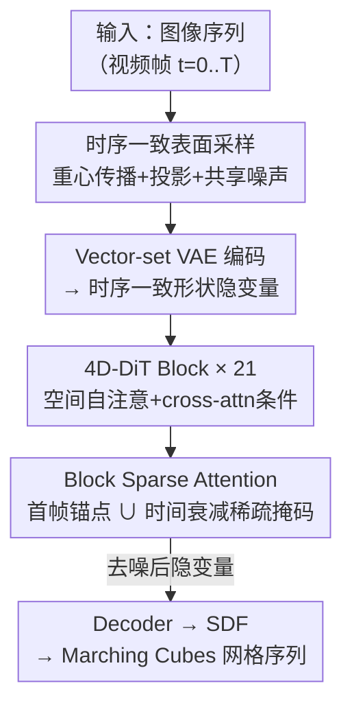

# Sculpt4D: Generating 4D Shapes via Sparse-Attention Diffusion Transformers

**会议**: CVPR 2026  
**论文**: [CVF Open Access](https://openaccess.thecvf.com/content/CVPR2026/html/Yin_Sculpt4D_Generating_4D_Shapes_via_Sparse-Attention_Diffusion_Transformers_CVPR_2026_paper.html)  
**代码**: 项目页 https://visual-ai.github.io/sculpt4d （代码未明确开源）  
**领域**: 3D视觉 / 4D生成 / 扩散模型  
**关键词**: 4D形状生成、稀疏注意力、扩散Transformer、时序一致性、Hunyuan3D

## 一句话总结
Sculpt4D 把一个预训练的 3D 扩散 Transformer（Hunyuan3D 2.1）原生扩展成 4D 生成模型：在 DiT 里插入时序注意力模块，并用一套「首帧锚点 + 时间衰减稀疏掩码」的 Block Sparse Attention 取代昂贵的全时空注意力，在保持几何质量和时序一致性的同时把网络总计算量砍掉 56%，从视频生成出时间连贯的 4D 网格序列。

## 研究背景与动机

**领域现状**：静态 3D 生成已经相当成熟，大规模扩散 Transformer（如 Hunyuan3D）能从单张图高保真地生成复杂几何与纹理。但「4D 生成」——即从视频生成随时间变形的动态 3D 网格序列——仍然是个难题。

**现有痛点**：现有 4D 方法各有硬伤。早期的 SDS（Score Distillation Sampling）路线逐实例优化，慢且不稳定，还容易出现 Janus 多面问题；「先生成多视角视频、再重建 4D」的两阶段路线会累积误差，视频阶段的不一致直接导致几何抖动；前馈方法如 L4GM 基于图像表示、几何保真度和泛化性都受限；逐帧生成再后处理的 V2M4 需要复杂的非端到端平滑优化；基于参考帧形变规范形状的 GVFD 只看单帧、抓不住后续帧的几何变化。这些方法的共同点是把预训练 3D 模型当成一个**冻结的黑盒**去「管理」，而不是从架构层面**扩展**它。

**核心矛盾**：最有前景的方向是把时序建模直接做进 DiT 架构里、端到端学 4D 依赖（并发工作 ShapeGen4D 也走这条路）。但它立刻撞上一堵计算墙：对 $T$ 帧、每帧 $P$ 个空间 token 做完整时空注意力，复杂度是 $O((T\times P)^2)$，平方级膨胀，根本没法 scale 到长序列或高保真 4D。于是「原生时序建模」和「计算可承受」之间形成根本矛盾。

**本文目标**：在不牺牲生成保真度和时序一致性的前提下，把原生 4D DiT 的计算复杂度压到可承受范围；同时缓解 4D 训练数据稀缺。

**切入角度**：作者观察到两个可借用的先验——大模型里的「attention sink / anchor」概念（用一个全局锚点稳住身份），以及 Radial Attention / FramePack 里的「时空能量随时间距离衰减」原理（远帧之间相关性低、可以稀疏化）。把这两条原理**针对 4D 运动建模重新定制**，就能在注意力矩阵层面做结构化稀疏。

**核心 idea**：用一套 Block Sparse Attention 替代全时空注意力——所有帧都锚定到第一帧（保身份），其余帧间用「随时间距离衰减的对角稀疏掩码」（保运动对应、剪掉无关 token 对），把网络计算量降 56% 而几乎不掉点。

## 方法详解

### 整体框架
Sculpt4D 的输入是一段图像序列（视频帧），输出是一段时间连贯的 4D 网格序列。整条管线分四步：先用**时序一致表面采样**把每帧的变形网格转成时间上一一对应的点云，经 vector-set VAE 编码成形状隐变量；这些隐变量喂进 21 个 **4D-DiT block**，每个 block 内用 cross-attention 注入图像条件、用 **Block Sparse Attention** 在帧间建模运动；最后 decoder 从去噪后的隐变量解码出每帧网格。关键在于：VAE 端要保证隐变量序列本身不抖（否则时序学不动），DiT 端要保证时序注意力既能抓运动又算得起。

### 关键设计

**1. 时序一致表面采样：让 VAE 隐变量序列从源头就不抖**

要让 DiT 学到平滑的时序动态，前提是输入给它的隐变量序列本身在时间上连贯。但直接把 Hunyuan3D 的静态 3D VAE 套到每一帧会产生**抖动的隐变量**，作者把抖动拆成两个独立来源并逐个修掉。第一是**输入点云在变形表面上的采样不一致**：原始变形网格 $\{M_t\}$ 虽然共享拓扑，但常常不是水密（watertight）的；为了稳健训练要先用 UDF 网格 + Marching Cubes 生成水密网格 $M'_t$，可这一步会**摧毁原拓扑**，导致 $M'_t$ 和 $M'_{t+1}$ 的面/顶点结构完全无关，第 $i$ 个采样点在相邻帧之间没有任何空间对应。作者的解法是先在规范静止位姿 $M_{rest}$ 上密集采样并存下每个点的持久映射——面索引 $f_i$ 加重心坐标 $b_i$；对任意变形帧 $t$，把这套静态映射 $\{(f_i,b_i)\}$ 作用到共享拓扑的原始变形网格 $M_t$ 上，得到时间一致的引导点集 $P_{guide,t}$；最后再把这套引导点投影到干净的水密网格 $M'_t$ 表面（k-NN 找最近面心、取其表面位置和法向）。这样得到的 $P'_t$ 既时间连贯（靠传播）又落在高质量水密面上（靠投影）。

第二是 **VAE 重参数化的随机性**。即便输入点云一致，标准重参数化 $z_t = \mu_t + \sigma_t \cdot \epsilon_t$ 每帧独立采噪声 $\epsilon_t$，仍会打断时序连续性。作者改成采**单个噪声向量 $\epsilon_{seq}$ 并广播到所有帧**：$z_t = \mu_t + \sigma_t \cdot \epsilon_{seq}$。共享噪声后，隐变量序列的动态完全由确定性的 $\mu_t, \sigma_t$ 变化驱动，时序随机性被消除，得到一个适合 4D 建模的连贯隐空间。此外稀疏查询点 $Q_t$ 也只在首帧做 FPS 得到 $Q_1$，后续帧通过传播追踪取对应点，保证 query 集也时序一致。

**2. 4D-DiT block：在预训练 3D DiT 上「空间-时序解耦」地长出时序能力**

直接把静态 DiT 当黑盒用学不到运动，作者把原始 DiT block 改造成 **4D-DiT block**，显式把空间建模和时序建模分开。block 内先用原有的自注意力 + cross-attention **逐帧独立**处理（抓帧内空间关系、注入图像条件），再插入一个新的**时序自注意力模块跨帧操作**（建模运动和时序依赖）。为了给网络明确的时间顺序信号，时序模块里对 query/key 沿帧维加 1D 旋转位置编码（RoPE）。为保证训练稳定，这个新增时序模块的输出投影**零初始化**——让网络从零开始平滑地学时序关系，而不破坏预训练的强空间权重。整个网络堆 21 个这样的 block，并用 MoE 和 RMSNorm 提效稳态、用基于 concat 的跳连保证特征传播。之所以选 Hunyuan3D 当底座，正是因为它在大规模数据上训出的空间先验，对 4D 数据稀缺下的泛化至关重要。

**3. Block Sparse Attention：首帧锚点 ∪ 时间衰减对角稀疏掩码，砍 56% 计算**

时序模块的代价就是上面那堵 $O((T\times P)^2)$ 的计算墙，本文的核心贡献就是把它拆成两条原理设计的块级稀疏掩码。先把序列结构化：时序注意力的总长 $N_{total}=T\times P$，每帧 $P$ 个空间 token 按固定块大小 $S_B=128$ 切成 $N_B=P/S_B$ 个块，$(T, N_B)$ 摊平成长度 $N_{blocks}=T\times N_B$ 的块序列，注意力定义在块级掩码 $M\in\{0,1\}^{N_{blocks}\times N_{blocks}}$ 上。把 1D 块索引映回 2D 时空坐标：query $q=i\cdot N_B+u$（帧 $i$、块 $u$），key $k=j\cdot N_B+v$（帧 $j$、块 $v$）。

第一条是**首帧锚点**：把第一帧 $j=0$ 设成全局锚，所有帧的所有 token 永远能注意到首帧的全部 token，提供一个稳定参照防止长序列里身份/外观漂移。第二条是**时间衰减稀疏掩码**：对 $j>0$ 引入一个「距离→步长」函数，给定时间距离 $d=|i-j|$，从预定义调度 $S=[1,1,2,4,8,16]$ 查步长

$$s(d) = S[\min(d, \mathrm{len}(S)-1)]$$

该步长定义一个相对的对角注意力模式：query 块 $u$ 只在 $(u \bmod s(d)) = (v \bmod s(d))$ 时才被允许注意 key 块 $v$。两条原理合起来，最终块掩码为

$$M_{i\cdot N_B+u,\; j\cdot N_B+v} = \begin{cases} 1, & j=0 \\ 1, & (u \bmod s_d) = (v \bmod s_d) \\ 0, & \text{otherwise} \end{cases}$$

这个相对取模模式比简单的「每隔 $s$ 个 token 取一个」（即 $v \bmod s(d)=0$）更聪明：它保证块 $u$ 在远帧里**总能注意到对应的 $v=u$**（$u \bmod s = u \bmod s$ 恒真），从而维持跨时间的 1-to-1 空间对应、追踪连贯运动；同时允许 $u+1$ 注意 $v+1$ 这类相对对齐，捕捉相对局部运动，跳过大量不相关空间对，把计算密度压到 $1/s$。直观效果是：近帧（$d$ 小、$s=1$）取模恒真 → 稠密注意抓细粒度局部运动；远帧（$d$ 大、$s>1$）只有 $1/s$ 的块对相连 → 稀疏的对角带状注意，既省又保对应。整套用 Block Sparse Attention 库高效执行，per layer 只用全注意力 35% 的 PFLOPs，且优势随序列变长继续放大。

### 损失函数 / 训练策略
训练集为从 Objaverse 过滤出的 13k 个 4D 动画物体。数据预处理沿用 Hunyuan3D-2.1 框架：每帧渲染 24 个视角（512×512，Hammersley 序列采相机位姿）作 2D 视觉条件；几何侧在静止位姿网格上各采 124,928 个均匀点和 124,928 个锐边点，靠重心坐标传播保证点对点一致，再投影到 flood-fill UDF 生成的水密面上，最后用整段动画的全局 bounding box 归一化到 $[-1,1]^3$。图像特征用 DINOv2（518×518 输入）提取，先去背景、跨序列对齐尺度和中心、再贴白底。网络堆 21 个 4D-DiT block，$S_B=128$，训练 24K 步、batch 32（每序列 16 帧），loss 在 FPS 选出的 4,096 个 query 点上计算，约 3 天 / 8×96GB GPU。

## 实验关键数据

### 主实验
在 Objaverse 的 50 个 4D 模型 holdout 测试集上评测，指标为 Chamfer Distance（CD，越低越好）、IoU（占据体素网格上算，越高越好）、F-Score（越高越好）。对比 L4GM、V2M4、GVFD，并设两个参考基线 Hunyuan3D（逐帧 3D 生成）和 Hunyuan3D\*（逐帧 + 共享噪声）。评测协议follow ShapeGen4D（但因其代码未放、略去其结果）。

| 方法 | 表示 | Chamfer↓ | IoU↑ | F-Score↑ |
|------|------|----------|------|----------|
| Hunyuan3D | SDF | 0.1220 | 0.3125 | 0.2820 |
| Hunyuan3D\* | SDF | 0.1231 | 0.3176 | 0.2883 |
| L4GM | MV-3D GS | 0.1655 | - | 0.2033 |
| V2M4 | mesh+deform | 0.1268 | 0.3071 | 0.2909 |
| GVFD | 3D GS+deform | 0.4235 | - | 0.0717 |
| **Ours** | SDF | **0.1052** | **0.3381** | **0.3137** |

（L4GM、GVFD 因高斯输出难转水密网格，IoU 略去。）Sculpt4D 在三项指标上全面领先。此外在 DAVIS 真实视频上做泛化测试，能稳健处理未见动态；纹理上借鉴 ShapeGen4D 的拓扑一致策略（全局刚性配准 + 局部 ARAP 优化对齐到规范拓扑），首帧纹理可无缝传播到整段序列。

### 消融实验
16 帧设置，PFLOPs 为 16 帧计算复杂度。

| 配置 | Chamfer↓ | IoU↑ | F-Score↑ | PFLOPs |
|------|----------|------|----------|--------|
| w/o consistent sampling | 0.1128 | 0.3375 | 0.3380 | 186.3 |
| w/o shared noise | 0.1051 | 0.3396 | 0.3342 | 186.3 |
| w/o sharp edge sampling | 0.1005 | 0.3408 | 0.3369 | 186.3 |
| w/o attention sink（去首帧锚） | 0.0986 | 0.3442 | 0.3375 | 169.8 |
| Temporal attention（仅时序注意力） | 0.2071 | 0.1972 | 0.1833 | 60.2 |
| Fixed stride（均匀稀疏） | 0.1124 | 0.3298 | 0.3306 | 167.1 |
| Full attention（稠密） | 0.0958 | 0.3466 | 0.3402 | 425.7 |
| **Ours** | 0.0972 | 0.3451 | 0.3383 | **186.3** |

### 关键发现
- **稀疏 vs 稠密几乎不掉点，但省一半多算力**：Ours（186.3 PFLOPs）和 Full attention（425.7 PFLOPs）三项指标几乎持平（CD 0.0972 vs 0.0958），per layer 只用全注意力 35% 的 PFLOPs，验证了 Block Sparse Attention 的有效性，且优势随序列变长放大。
- **空间-时序解耦不可省**：把整套时空机制换成「仅时序注意力」直接崩盘（CD 0.2071、IoU 0.1972），说明逐帧空间建模必须保留。
- **稀疏结构要「相对对角」而非「固定均匀」**：Fixed stride（CD 0.1124）明显差于本文的相对取模设计，印证了维持 1-to-1 空间对应对运动追踪的重要性。
- **首帧锚点稳身份**：去掉 attention sink 后 CD 略升（0.0986），锚点对长序列身份一致性有帮助。
- **VAE 端的时序一致同样关键**：去掉 consistent sampling（CD 0.1128）是几何质量最大的退化项之一，证明「源头不抖」的前置处理是 4D 学习的必要条件。

## 亮点与洞察
- **把 LLM/视频里的稀疏注意力原理「翻译」到 4D 几何生成**：attention sink（保身份）来自 StreamingLLM/Radial Attention，时间衰减密度来自 FramePack，但本文的创新是用**相对对角取模掩码**实现衰减——直接作用在注意力矩阵上「下采样连接」而非压缩/丢弃 token，从而保住跨时间的空间对应。这是把别处的 trick 真正吃透并重新发明的范例。
- **「源头治抖」的工程洞察**：4D 生成最隐蔽的坑是 VAE 隐变量序列本身抖动，作者精准定位到两个独立来源（采样不一致 + 重参数化随机），并各给一个低成本解法（重心传播 + 共享噪声），这种把问题拆干净再逐个修的思路很值得迁移。
- **零初始化 + 解耦 block** 让「在预训练 3D DiT 上长出 4D 能力」既稳又省数据，是「扩展而非冻结黑盒」哲学的具体落地，可迁移到其他「2D/3D 预训练模型 → 时序/动态扩展」的任务。

## 局限与展望
- **依赖底座模型**：整个方法建立在 Hunyuan3D 2.1 之上，几何上限和泛化范围很大程度被底座决定。
- **训练数据规模有限**：仅 13k 个 Objaverse 4D 物体，对超出训练分布的复杂拓扑变化、强非刚性运动的覆盖度存疑（虽在 DAVIS 上展示了泛化，但缺定量评估）。
- **评测集偏小**：主结果在 50 个 holdout 模型上算，且因 ShapeGen4D 代码未放无法与最直接的并发对手定量对比，横向结论需谨慎。
- **纹理是后接管线而非端到端**：纹理靠外部 ARAP 配准 + 首帧传播，没和几何生成联合优化。
- 可改进方向：把稀疏调度 $S$ 做成可学习/自适应（当前是手工预定义），以及把时序步长与真实运动幅度耦合，对剧烈运动段动态加密。

## 相关工作与启发
- **vs ShapeGen4D（并发工作）**：两者都走「给 3D DiT 注入时空注意力做端到端 4D」的路线，区别在 ShapeGen4D 用**完整时空注意力**、撞 $O((T\times P)^2)$ 计算墙；本文用 Block Sparse Attention 把复杂度压到 $1/s$ 密度，是对同一思路的效率化。
- **vs V2M4**：V2M4 把 3D 模型当**逐帧生成器**、靠复杂非端到端后处理强行平滑；本文端到端原生建模时序，CD（0.1052 vs 0.1268）和时序一致性都更好。
- **vs GVFD**：GVFD 生成规范形状再预测**形变场**，只看参考帧、抓不住后续几何变化（CD 高达 0.4235）；本文直接在隐空间建模每帧几何演化。
- **vs L4GM**：L4GM 前馈快但基于**图像表示**、几何保真度受限（F-Score 0.2033）；本文 SDF 表示几何质量明显更高。
- **vs SDS 路线**：SDS 不用 4D 数据但逐实例优化、慢且易出 Janus 伪影；本文用预训练 3D 先验 + 13k 4D 数据做前馈生成，又快又稳。

## 评分
- 新颖性: ⭐⭐⭐⭐ 把 LLM/视频稀疏注意力原理重新发明为 4D 的相对对角掩码，是扎实的迁移创新而非全新范式
- 实验充分度: ⭐⭐⭐⭐ 主结果 + 七项消融 + 真实视频泛化都齐，但测试集偏小、缺与最直接并发对手 ShapeGen4D 的定量对比
- 写作质量: ⭐⭐⭐⭐ 把「为什么稀疏、怎么稀疏、稀疏到什么程度」讲得很清楚，公式和直觉都到位
- 价值: ⭐⭐⭐⭐ 给「数据稀缺下高效原生 4D 生成」提供了一条可 scale 的实用路线，56% 算力下降有实际意义

<!-- RELATED:START -->

## 相关论文

- [\[CVPR 2026\] Block-Sparse Global Attention for Efficient Multi-View Geometry Transformers](block-sparse_global_attention_for_efficient_multi-view_geometry_transformers.md)
- [\[CVPR 2026\] FlashVGGT: Efficient and Scalable Visual Geometry Transformers with Compressed Descriptor Attention](flashvggt_efficient_and_scalable_visual_geometry_transformers_with_compressed_descr.md)
- [\[CVPR 2026\] Scaling View Synthesis Transformers (SVSM)](scaling_view_synthesis_transformers.md)
- [\[CVPR 2026\] UniTEX: Universal High Fidelity Generative Texturing for 3D Shapes](unitex_universal_high_fidelity_generative_texturing_for_3d_shapes.md)
- [\[CVPR 2025\] MeshArt: Generating Articulated Meshes with Structure-Guided Transformers](../../CVPR2025/3d_vision/meshart_generating_articulated_meshes_with_structure-guided_transformers.md)

<!-- RELATED:END -->
