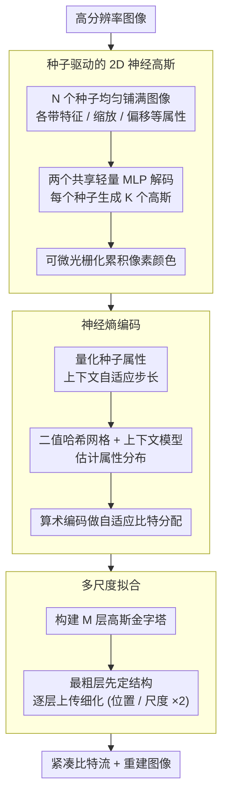

# SGI: Structured 2D Gaussians for Efficient and Compact Large Image Representation

**会议**: CVPR 2026  
**arXiv**: [2603.07789](https://arxiv.org/abs/2603.07789)  
**代码**: 无  
**领域**: 3D视觉  
**关键词**: 2D Gaussian Splatting, image representation, neural compression, entropy coding, multi-scale optimization  

## 一句话总结

SGI 提出基于种子点(seed)的结构化 2D 高斯表示框架，通过将无结构高斯原语组织为种子驱动的神经高斯、结合上下文引导的熵编码和多尺度拟合策略，在高分辨率图像表示中实现最高 7.5× 压缩比和 6.5× 优化加速，同时保持甚至提升重建保真度。

## 背景与动机

**问题背景**：2D Gaussian Splatting 作为一种新兴的图像表示技术，能在低端设备上实现高效渲染。然而，将其扩展到高分辨率图像时需要独立优化和存储数百万个无结构高斯原语，导致两大核心瓶颈：

1. **参数冗余**：现有方法（如 GaussianImage、LIG）将每个高斯独立优化，未利用空间局部性（spatial locality）——相邻像素往往共享相似颜色、纹理和结构，导致相邻原语之间存在大量冗余参数
2. **优化开销**：高分辨率下百万级高斯原语的独立优化收敛缓慢，尤其当引入量化感知微调进行压缩时，开销更加显著

**已有尝试的局限**：
- INR 方法（SIREN、I-NGP）需大量 MLP 前向传播，计算量大
- 3D anchor-based 方法（Scaffold-GS、HAC）直接应用于 2D 图像建模无法获得同等压缩收益，因为 2D 高斯已去掉了 opacity 等参数，存储节省空间有限
- LIG 的 Level-of-Gaussian 仅用部分高斯做残差拟合，非全局优化

## 方法详解

### 整体框架

SGI 要解决的是 2D Gaussian Splatting 表示高分辨率图像时的两大痛点——百万级无结构高斯各自独立优化/存储带来的参数冗余和优化开销。它的整体思路是把「无结构高斯原语」重新组织成「种子驱动的结构化高斯」，再叠两层压缩与提速：种子驱动的 2D 神经高斯（Seed-based 2D Neural Gaussians）把图像分解成多尺度局部空间、每个种子用轻量 MLP 预测一组高斯；神经熵编码（Neural Entropy Coding）用二值哈希网格和上下文模型估计种子属性分布、做自适应比特分配；多尺度拟合（Multi-scale Fitting）用高斯金字塔从粗到细优化加速收敛。

### 关键设计

**1. 种子驱动的 2D 神经高斯：用少量种子 + 共享 MLP 隐式编码空间冗余**

相邻像素往往颜色纹理结构相似，可现有方法逐个独立优化高斯、完全没利用这种空间局部性。SGI 预定义 $N$ 个种子均匀铺满图像，每个种子在位置 $\boldsymbol{x_a} \in \mathbb{R}^2$ 关联一组属性 $\mathcal{A} = \{\boldsymbol{f_a} \in \mathbb{R}^D, \boldsymbol{s_o} \in \mathbb{R}^2, \boldsymbol{s_a} \in \mathbb{R}^2, \boldsymbol{\delta} \in \mathbb{R}^{K \times 2}\}$：

| 符号 | 维度 | 含义 |
|------|------|------|
| $\boldsymbol{f_a}$ | $\mathbb{R}^D$ | 种子特征向量，编码局部区域信息 |
| $\boldsymbol{s_o}$ | $\mathbb{R}^2$ | 偏移缩放因子，控制关联高斯的空间分布范围 |
| $\boldsymbol{s_a}$ | $\mathbb{R}^2$ | 尺度缩放因子，调整高斯的最终尺度 |
| $\boldsymbol{\delta}$ | $\mathbb{R}^{K \times 2}$ | $K$ 个关联高斯的学习偏移量 |

每个种子的 $K$ 个高斯位置由种子位置加缩放后的偏移得到 $\{\boldsymbol{\mu}^{(k)}\}_{k=0}^{K-1} = \boldsymbol{x_a} + \{\boldsymbol{\delta}^{(k)}\}_{k=0}^{K-1} \cdot \boldsymbol{s_o}$；属性则由两个共享轻量 MLP 从 $\boldsymbol{f_a}$ 解码——$\text{MLP}_c$ 出 opacity 加权颜色系数 $\mathbf{c'} \in \mathbb{R}^3$，$\text{MLP}_\Sigma$ 出基础尺度 $\boldsymbol{s_{\text{base}}}$ 和旋转角 $\theta$，最终尺度 $\boldsymbol{s} = \boldsymbol{s_{\text{base}}} \cdot \boldsymbol{s_a}$，协方差按 $\boldsymbol{\Sigma} = \mathbf{R}\mathbf{S}\mathbf{S}^\top\mathbf{R}^\top$ 正定分解构造（$\mathbf{R}(\theta)$ 为 2D 旋转矩阵、$\mathbf{S}$ 为对角尺度矩阵）。像素颜色是所有贡献高斯的累积 $\boldsymbol{C} = \sum_{i \in I} \mathbf{c'}_i G_i(\mathbf{x})$，$G(\mathbf{x}) = \exp\left(-\frac{1}{2}(\mathbf{x}-\boldsymbol{\mu})^\top \boldsymbol{\Sigma}^{-1}(\mathbf{x}-\boldsymbol{\mu})\right)$。如此一来每个高斯只需 8 个参数（位置 2 + 协方差 3 + 加权颜色 3），大量空间冗余被种子特征和共享 MLP 隐式吸收，独立参数量大幅下降。

**2. 神经熵编码：把种子带来的结构正则性榨成比特节省**

光靠种子结构相比纯 2D 高斯（如 LIG）只能省约 3% 存储，增益有限，所以 SGI 的压缩核心是在种子结构之上再做熵编码。量化上训练时注噪、推理时取整：

$$\hat{\boldsymbol{f}}_j^{(i)} = \begin{cases} \boldsymbol{f}_j^{(i)} + \mathcal{U}(-\frac{1}{2}, \frac{1}{2}) \cdot q_j^{(i)} & \text{训练} \\ \text{Round}(\boldsymbol{f}_j^{(i)} / q_j^{(i)}) \cdot q_j^{(i)} & \text{推理} \end{cases}$$

量化步长 $q_j^{(i)} = Q_j \times (1 + \tanh(r_j^{(i)}))$ 由上下文模型自适应预测。概率建模上引入可学习二值哈希网格 $\mathcal{H}$ 捕获种子的空间一致性，上下文模型 $\text{MLP}_p$ 估计每个属性分量的高斯参数 $\{\mu_j^{(i)}, \sigma_j^{(i)}, r_j^{(i)}\}_{j=0}^{3} = \text{MLP}_p(\mathcal{H}(\boldsymbol{x}_a^{(i)}))$，再把高斯分布在量化区间上积分得到属性概率，驱动算术编码做自适应比特分配。消融显示这一步才是压缩的真正主力（$\lambda=0$ 时 FGF2 存 104.08MB，$\lambda=0.001$ 时降到 16.33MB）。

**3. 多尺度拟合策略：用高斯金字塔从粗到细加速收敛**

直接在高分辨率上优化种子参数又慢又难收敛。SGI 构建 $M$ 层高斯金字塔 $\{I_0=I, I_1, \ldots, I_{M-1}\}$（每层下采样 2 倍），从最粗层 $l=M-1$ 开始优化种子和 MLP，再把结果传到下一层（位置和尺度乘 2 适配分辨率加倍），逐层迭代到最细层 $l=0$。粗层先把大致结构定下来，细层只需局部微调，于是优化时间和收敛速度都明显改善。

### 损失函数 / 训练策略

总损失把重建保真度和比特消耗正则化合在一起：

$$L = L_{\text{img}} + \frac{\lambda}{N \cdot d_\mathcal{A}}(L_{\text{entropy}} + L_{\text{hash}})$$

其中 $L_{\text{img}}$ 是渲染图与目标图的 L1 损失，$L_{\text{entropy}}$ 是种子属性的信息熵损失（驱动概率模型学紧凑分布），$L_{\text{hash}}$ 是二值哈希网格的比特消耗上界，率失真权衡 $\lambda = 0.001$，$d_\mathcal{A} = D + 4 + 2K$ 为每个种子的属性总维度。

## 实验

### 实验设置

- **数据集**：FGF2（4 张卫星图，~51MP）、ICB（2 张自然图，27.7/39.1MP）、STimage（3 张病理图，~76MP）
- **评估指标**：PSNR、SSIM、LPIPS、优化时间（分钟）、模型大小（MB）
- **SGI 设置**：低码率（3.5M 高斯）和高码率（10M 高斯）

### 主实验结果

| 方法 | FGF2 PSNR↑ | FGF2 Size(MB)↓ | FGF2 Time(min)↓ | ICB PSNR↑ | ICB Size(MB)↓ | ICB Time(min)↓ |
|------|-----------|----------------|-----------------|----------|--------------|----------------|
| SIREN | 22.05 | 15.79 | 649.71 | 27.62 | 15.79 | 363.34 |
| I-NGP | 28.55 | 21.07 | 72.32 | 33.09 | 21.07 | 48.11 |
| HAC | 25.15 | 16.78 | 261.69 | 34.47 | 13.52 | 270.57 |
| GaussianImage | 27.30 | 23.37 | 322.17 | 31.09 | 23.37 | 282.61 |
| **SGI (low)** | **31.24** | **16.33** | **48.43** | **35.27** | **12.30** | **44.75** |
| 3DGS | 34.93 | 787.73 | 642.85 | 37.52 | 787.73 | 515.99 |
| Scaffold-GS | 28.25 | 112.61 | 248.83 | 35.76 | 105.81 | 162.11 |
| LIG | 32.10 | 106.81 | 87.56 | 36.40 | 106.81 | 68.73 |
| **SGI (high)** | **36.27** | **41.74** | **97.75** | **39.09** | **32.15** | **86.11** |

### 消融实验

**每个种子的高斯数量 $K$ 消融**：

| $K$ | FGF2 PSNR↑ | FGF2 Size(MB)↓ | ICB PSNR↑ | ICB Size(MB)↓ |
|-----|-----------|----------------|----------|--------------|
| 5 | 31.29 | 18.48 | 35.03 | 13.64 |
| **10** | **31.24** | **16.33** | **35.27** | **12.30** |
| 15 | 30.61 | 15.32 | 34.88 | 11.48 |
| 20 | 30.62 | 14.83 | 34.57 | 10.87 |

$K$ 越大模型越紧凑但保真度略降，$K=10$ 为最佳折中。

**关键发现**：

1. **熵编码是压缩核心**：$\lambda=0$ 时（无熵编码），FGF2 存储为 104.08MB；$\lambda=0.001$ 时降至 16.33MB，压缩 6.4 倍。种子结构本身仅减 3%，熵编码贡献了绝大部分压缩增益
2. **多尺度拟合显著加速**：金字塔层数 $M=3$ 时优化时间从 $M=1$ 的 71.59 分钟降至 48.43 分钟（加速 32%），同时 PSNR 从 30.58 提升至 31.24 dB
3. **存储分解**：种子特征 $\boldsymbol{f_a}$ 占总存储的 48%，偏移 $\boldsymbol{\delta}$ 占 35%，哈希网格和 MLP 仅占 ~1%，开销极小
4. **低码率优势**：在低 bpp 区域，SGI 显著超越 JPEG（ICB 上 0.245 bpp 达 26.09 dB vs JPEG 0.296 bpp 仅 22.77 dB）

## 亮点

- **首个结构化 2D 高斯表示**：将 3D 领域的 anchor-based 思想适配到 2D 图像，并通过熵编码弥补了 2D 场景压缩增益有限的问题
- **压缩效率突出**：相比 LIG 实现 7.5× 压缩，相比量化后的 GaussianImage 实现 1.6× 压缩
- **优化效率高**：多尺度拟合策略实现 1.6~6.5× 加速，且不牺牲重建质量
- **低端设备友好**：基于可微光栅化的快速渲染，24GB A10 GPU 即可处理 76MP 图像

## 局限性

- 大型图像仍需数十分钟优化（per-image optimization 范式），不适合实时编码场景
- 每张图像需独立优化一个模型，缺乏跨图像的泛化能力
- 当前仅在静态图像上验证，未扩展到视频或动态场景
- 高码率设置下存储仍在 30~40MB 级别，与学习型图像编解码器（如 VVC/AV1）相比并无绝对优势

## 评分 ⭐⭐⭐⭐

扎实的系统性工作，将种子结构+熵编码+多尺度优化三者有机结合，在大规模图像表示任务上取得了存储、速度、质量三方面的显著改进。实验全面，消融充分。但 per-image 优化范式和泛化能力是固有局限。

<!-- RELATED:START -->

## 相关论文

- [\[CVPR 2026\] Native and Compact Structured Latents for 3D Generation](native_and_compact_structured_latents_for_3d_generation.md)
- [\[AAAI 2026\] GaussianImage++: Boosted Image Representation and Compression with 2D Gaussian Splatting](../../AAAI2026/3d_vision/gaussianimage_boosted_image_representation_and_compression_with_2d_gaussian_spla.md)
- [\[CVPR 2026\] SwiftTailor: Efficient 3D Garment Generation with Geometry Image Representation](swifttailor_efficient_3d_garment_generation_with_geometry_image_representation.md)
- [\[CVPR 2026\] TokenHand: Discrete Token Representation for Efficient Hand Mesh Reconstruction](tokenhand_discrete_token_representation_for_efficient_hand_mesh_reconstruction.md)
- [\[ECCV 2024\] GaussianImage: 1000 FPS Image Representation and Compression by 2D Gaussian Splatting](../../ECCV2024/3d_vision/gaussianimage_1000_fps_image_representation_and_compression_by_2d_gaussian_splat.md)

<!-- RELATED:END -->
