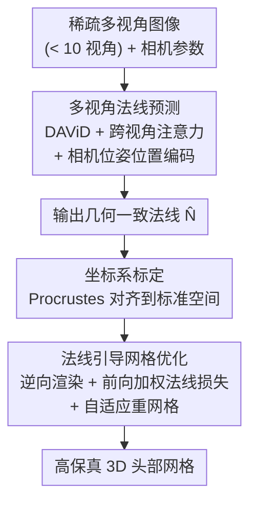

# Skullptor: High Fidelity 3D Head Reconstruction in Seconds with Multi-View Normal Prediction

**会议**: CVPR 2026  
**论文**: [CVF Open Access](https://openaccess.thecvf.com/content/CVPR2026/html/Artru_Skullptor_High_Fidelity_3D_Head_Reconstruction_in_Seconds_with_Multi-View_CVPR_2026_paper.html)  
**代码**: 项目页 https://skullptor.github.io （论文称将开源代码与模型）  
**领域**: 3D视觉  
**关键词**: 3D头部重建, 多视角法线预测, 逆向渲染, 跨视角注意力, 稀疏视角

## 一句话总结
Skullptor 把"数据驱动的多视角法线预测"和"逆向渲染网格优化"拼成一条两阶段管线：先用带跨视角注意力的法线估计模型从不到 10 张稀疏图像预测几何一致的表面法线，再把法线当作强几何先验去优化网格，从而在 30 秒内、仅 10 个相机下重建出可媲美几十到上百视角传统摄影测量(photogrammetry)质量、且能恢复皱纹与皮肤褶皱等高频细节的 3D 人头。

## 研究背景与动机

**领域现状**：从图像重建高保真 3D 人头几何，目前有三条路线。传统摄影测量(photogrammetry，如 COLMAP/Meshroom)是工业 VFX/游戏的金标准，靠 25–200+ 同步相机做密集三角化，细节极好；数据驱动基础模型(foundation model)能单图前馈出几何，采集极简但细节糊；基于优化的方法(2DGS/SuGaR 等)显式地强制多视角一致性、保真度高于基础模型，但仍要密集视角 + 昂贵的逐场景优化。

**现有痛点**：三条路线没有一条能同时满足"高几何精度 + 稀疏视角采集 + 计算高效"这三个诉求。摄影测量需要海量相机、巨大算力，4D 序列存储甚至到 TB 级，还在镜面反射、毛发等区域出 artifact 要人工修补；单图基础模型靠的是学到的、常常含糊的 3D 形状先验而非真正的多视角几何约束，丢失了人物特有的高频细节；纯优化法因为缺强先验，必须靠密集视角喂几何约束，稀疏时直接崩。

**核心矛盾**：本质是"先验"与"几何约束"之间的取舍——数据驱动法有先验但没有显式多视角约束，所以细节是"脑补"的不准；优化法有多视角约束但没强先验，所以稀疏视角下约束不够、必须靠堆相机补。两者恰好互补。

**本文目标**：在相机数 <10 的稀疏设置下，拿到密集视角摄影测量级别的细节，同时把重建压到秒级。拆成两个子问题：(1) 怎么从稀疏图像得到几何上跨视角一致、且保留高频细节的法线；(2) 怎么把这种法线当先验、稳定地优化出带细节的网格。

**切入角度**：作者的观察是——单目法线基础模型(DAViD)已经能预测高分辨率法线，缺的只是"跨视角一致性"；而逆向渲染优化缺的只是"强几何先验"。那就把前者的输出直接喂给后者：用法线把"数据先验"翻译成"优化器能消费的几何监督"。

**核心 idea**：用"多视角一致的法线预测"替单图法线，再把法线当几何先验喂进逆向渲染优化，从而用稀疏视角换到摄影测量级保真。

## 方法详解

### 整体框架
Skullptor 把 3D 人头网格重建拆成两个串行阶段。**阶段一(Sec 3.1)** 输入 $m$ 张多视角彩色图 $I=\{I_1,\dots,I_m\}$ 及各自相机参数 $(R_i,T_i,K_i)$，用一个多视角 Transformer 把跨视角信息融合，输出一组**几何一致的法线图** $N=\Psi(I,\{(R_i,T_i)\})$。**阶段二(Sec 3.2)** 把这组预测法线当作几何先验，在逆向渲染框架里从一个单位球网格出发、迭代调整顶点位置，让渲染出的网格法线去匹配预测法线，最终长出带皱纹/褶皱等高频细节的网格。这条管线绕开了摄影测量的密集采集与重算力开销，10 个相机、30 秒即可出片。

### 关键设计

**1. 跨视角注意力让单目法线模型"会看其他视角"**

痛点很直白：单目法线模型(这里基座是 DAViD，一个建在 Dense Prediction Transformer 上、ViT+CNN 的合成数据预训练模型)逐张独立预测，跨视角之间法线互相矛盾，无法直接拼成一个连贯的 3D 网格。作者的做法是在 DAViD 每个 Transformer encoder block 与全连接层之间插入一层 **view-aware cross-attention**：把第 $i$ 张图编码出的特征序列 $F_i\in\mathbb{R}^{L\times D}$($L=577$ 个 token，$D=1024$)作为 query，让它去 attend 所有视角拼起来的 key/value——

$$Q_i = F_i W_Q,\quad K=[F_1 W_K;\dots;F_m W_K],\quad V=[F_1 W_V;\dots;F_m W_V]$$

$$\text{Attention}(Q_i,K,V)=\text{softmax}\!\left(\frac{Q_i K^\top}{\sqrt{D}}\right)V$$

这样每张图预测自己法线时都能吸收其它视角的高频几何线索，跨视角一致性是直接被注意力机制"显式拉齐"的。关键是它只在原 DAViD 上加一层轻量注意力、用预训练权重初始化再微调，所以相对 DAViD 只多 0.4 秒推理(1.5s vs 1.1s)，却比单目预测明显更准。

**2. 相机位姿位置编码，让 token 知道自己来自哪个视角**

只做跨视角注意力还不够——拼在一起的 token 没有"身份"，模型分不清哪些 token 来自哪个相机，注意力会糊。作者把每个相机外参编码成位置嵌入：先把旋转矩阵 $R_i$ 转成单位四元数 $q_i=(q_w,q_x,q_y,q_z)$，与平移 $T_i$ 拼成 7 维位姿向量 $p_i=[q_i;T_i]\in\mathbb{R}^7$，投影到特征维后加到 $F_i$ 的每个 token 上，再算 cross-attention。这相当于给跨视角注意力提供了"几何坐标系"，让模型能更有效区分不同视角来源的 token，是一致性预测能成立的前提。

**3. 法线引导的逆向渲染网格优化(带前向加权 + 自适应重网格)**

有了跨视角一致法线，怎么变成带细节的网格?作者从单位球网格 $M$ 出发，用可微渲染 $\bar N_i=F(M,R_i^*,T_i^*,K_i)$ 渲出当前网格法线,优化顶点使其逼近预测法线 $\hat N^*$。这里有两个工程要点。其一是**坐标系标定**：预测法线在各自相机局部坐标系里,必须先统一到一个标准空间——作者检测 2D 面部关键点、跨视角最小重投影误差三角化成 3D 点 $X$,与模板关键点 $Y$ 做 Procrustes 分析(SVD)求相似变换 $G$,用 $G^{-1}$ 校正相机外参、用 $R_g^{-1}$ 把法线旋到标准空间。其二是损失里的**前向加权法线损失**:

$$L_{normal}=1-\frac{1}{m}\sum_{i=1}^{m}\hat W_i\cdot(\hat N_i^*\cdot \bar N_i)$$

逐像素权重 $\hat W_i(u,v)=\dfrac{\exp[\alpha(\hat N_i^*(u,v)\cdot d_i)]-1}{\exp(\alpha)-1}$ 用相机视向 $d_i$ 给"正对相机"的区域更高权重($\alpha$ 控制强弱),因为这些区域的法线预测更可靠、掠射角(grazing angle)区域不可信就压低。总损失再加一个 Laplacian 平滑正则 $L=L_{normal}+\lambda_{lap}L_{lap}$。每步优化后施加 **Continuous Remeshing** 的自适应重网格(边分裂/塌缩/翻转),按局部几何复杂度动态调网格分辨率,同时防止自交、塌陷面等退化——这是能稳定刻出高频细节、又不让网格炸掉的关键。

### 损失函数 / 训练策略
阶段一法线预测用余弦相似度损失 $L_{cos}=1-\frac{1}{m}\sum_i \hat N_i\cdot N_i$ 训练，DAViD 部分用预训练权重初始化后整体微调。训练数据来自 Triplegangers 高质量 3D 头扫描：50 个受试者 × 20 个静态表情 × 55 个 lightstage 相机，留 5 人做验证。关键 trick 是**不用固定 lightstage 视角训练，而是从随机采样的虚拟相机渲染 GT 几何(带纹理)得到训练图像与法线**——这既让模型见过多样相机配置、泛化到任意多视角系统(后续在 NPHM/Multiface 不同相机配置上验证)，又无需额外物理采集就增加了数据多样性。阶段二是逐场景优化，无需训练。

## 实验关键数据

### 主实验

法线估计(Multiface / NPHM，与单目基线比，越低越好的角误差与法线梯度误差)：

| 数据集 | 方法 | 平均角误差↓ | 法线梯度误差↓ | <10°(%)↑ | 时间(s)↓ |
|--------|------|------|------|------|------|
| Multiface | DAViD | 9.16 | 0.250 | 69.7 | 1.1 |
| Multiface | Sapiens 2B | 9.23 | 0.257 | 69.3 | 41.3 |
| Multiface | **Skullptor** | **9.13** | **0.234** | 69.2 | 1.5 |
| NPHM | DAViD | 7.86 | 0.190 | 73.8 | 1.1 |
| NPHM | Sapiens 2B | 6.86 | 0.185 | 80.0 | 43.7 |
| NPHM | **Skullptor** | 7.29 | **0.166** | 76.8 | 1.5 |

亮点在**法线梯度误差**(衡量高频细节保留的自定义指标)上全面最优，且推理仅 1.5s，比 Sapiens 2B 快一个数量级。角误差与各基线接近——作者点明角误差对细粒度几何不敏感，所以更应看梯度误差。

网格重建(与摄影测量/Gaussian splatting 比)：

| 数据集 | 方法 | 深度误差(mm)↓ | 法线梯度误差↓ | <10°(%)↑ | 运行(min)↓ | 视角数 |
|--------|------|------|------|------|------|------|
| Multiface | Meshroom(摄影测量) | 0.467 | 0.143 | 85.1 | 7.8 | 26 |
| Multiface | 2DGS | 5.73 | 0.206 | 68.6 | 50 | 26 |
| Multiface | SuGaR | 5.54 | 0.324 | 66.1 | 42 | 26 |
| Multiface | **Skullptor** | 2.43 | 0.156 | **91.5** | **0.67** | 26 |
| Multiface | **Skullptor(10 视角)** | 2.99 | 0.157 | 86.8 | **0.48** | 10 |
| NPHM | Meshroom(摄影测量) | 2.54 | 0.114 | 88.3 | 9.5 | 23 |
| NPHM | SuGaR | 3.23 | 0.232 | 77.9 | 50 | 23 |
| NPHM | **Skullptor(10 视角)** | **2.36** | 0.117 | 87.3 | **0.50** | 10 |

Skullptor 在所有指标上大幅碾压 2DGS/SuGaR，且快一个数量级；对比 Meshroom，在 NPHM 上仅用不到一半视角(10 vs 23)就做到几何质量持平、并快一个数量级。Multiface 上 Meshroom 深度误差极低(0.467mm)是因为它的 GT 本身也是摄影测量产的、存在相关偏置(broken nose artifact 反而惩罚了 Skullptor 的正确重建)，NPHM 用主动结构光扫描无此偏置，结论更公允。

### 消融实验

| 数据集 | 配置 | 法线角误差↓ | 法线梯度↓ | 网格深度↓ | 说明 |
|------|------|------|------|------|------|
| NPHM | DAViD | 7.80 | 0.188 | 2.68 | 原始基线 |
| NPHM | DAViD ft mono | 8.43 | 0.174 | 3.53 | 仅单视角微调，反而退化 |
| NPHM | DAViD ft multi | 7.13 | 0.176 | 2.87 | 多视角输入但无跨视角注意力 |
| NPHM | **Skullptor** | **7.05** | **0.167** | **2.44** | 完整(含 cross-attention) |
| Multiface | DAViD ft mono | 8.88 | 0.228 | 4.32 | 同样单视角微调退化 |
| Multiface | **Skullptor** | **8.54** | **0.226** | **3.29** | 完整模型最佳 |

### 关键发现
- **单纯域适应微调不是涨点来源**：DAViD ft mono(只在本文数据上单视角微调)不升反降，证明提升来自多视角结构而非数据集 domain shift。
- **多视角训练 + 跨视角注意力是真正的贡献**：DAViD ft multi(多视角训练但无 cross-attention)已优于单视角，加上 cross-attention 的完整 Skullptor 在所有 benchmark 上最佳，说明"显式拉齐跨视角一致性"是解决几何歧义的核心。
- **学到的几何先验能补偿稀疏视角**：在 NPHM 上用 3/6/10/16/23 视角对比 Meshroom——Skullptor 即便只用 3 个相机仍能高保真重建，而 Meshroom 在 <16 视角时迅速退化、3 视角几乎完全失败。

## 亮点与洞察
- **把"数据先验"翻译成"优化监督"的桥梁是法线**：法线既是基础模型能高质量预测的量、又是逆向渲染能直接消费的几何监督，选它当中间表示让两个范式无缝拼接，这个表示选择很巧。
- **轻量改造而非重训**：只在 DAViD 每个 block 插一层跨视角注意力 + 复用预训练权重，0.4 秒额外开销换来一致性，工程上"小改动大收益"。
- **前向加权法线损失**：用相机视向给正对相机的可靠区域加权、压低掠射角不可信区域，这个 trick 可迁移到任何多视角法线/深度融合任务。
- **虚拟相机渲染做数据增广**：不绑死物理 lightstage 视角，从随机虚拟相机渲 GT，直接换来对任意采集系统的泛化——对法线/深度类前馈模型是很实用的泛化手段。
- **自定义法线梯度误差指标**：用 Sobel 滤波后算 L1，专门抓高频细节，揭示了"角误差低但几何过平滑"的方法会在这个指标上现形，是评估细节保真的好补充。

## 局限与展望
- 作者承认：方法面向**受控光照 + 同步相机**的采集设置；强视向反射、噪声图像、面部道具会让法线预测出错并传播到几何。
- 自己发现的局限：阶段二是逐场景优化(虽然只要 30s–0.7min)，并非纯前馈；只重建几何、不含外观/材质，且在摄影测量 GT 上存在 GT 自身偏置导致的指标失真(Multiface broken nose 案例，深度误差被放大到 20×)。
- 改进思路：作者提出未来联合预测法线与反照率(albedo)做完整外观捕获，并引入材质与光照估计支持重打光(relighting)。

## 相关工作与启发
- **vs 摄影测量(Meshroom/COLMAP)**：它们靠 25–200+ 密集相机三角化、细节金标准但慢且稀疏视角崩；本文用学到的法线先验补偿视角，<10 相机即达持平质量、快一个数量级。
- **vs 单图基础模型(Sapiens/DAViD/MeshLRM)**：它们采集极简但靠"脑补"先验、细节糊、跨视角不一致；本文用 cross-attention 强制多视角一致并保留高频细节。
- **vs 优化法(2DGS/SuGaR)**：它们显式强制多视角光度一致但缺强先验、需密集视角与昂贵优化；本文以法线先验大幅减少视角与算力、各指标全面领先。

## 评分
- 新颖性: ⭐⭐⭐⭐ "数据先验 + 逆向渲染"的拼法不算全新，但用跨视角注意力法线当桥、做到稀疏视角摄影测量级保真，组合很扎实。
- 实验充分度: ⭐⭐⭐⭐⭐ 两数据集、法线与网格双层级对比、视角数扫描 + 四配置消融，并诚实讨论 GT 偏置。
- 写作质量: ⭐⭐⭐⭐⭐ 痛点-矛盾-方案逻辑链清晰，自定义指标有定义，图表完整。
- 价值: ⭐⭐⭐⭐ 直击 VFX/游戏生产痛点，30 秒、10 相机出高保真人头，工程落地价值高。

<!-- RELATED:START -->

## 相关论文

- [\[CVPR 2026\] FHAvatar: Fast and High-Fidelity Reconstruction of Face-and-Hair Composable 3D Head Avatar from Few Casual Captures](fhavatar_fast_and_high-fidelity_reconstruction_of_face-and-hair_composable_3d_he.md)
- [\[CVPR 2026\] Multi-view Consistent 3D Gaussian Head Avatars 'without' Multi-view Generation](multi-view_consistent_3d_gaussian_head_avatars_without_multi-view_generation.md)
- [\[CVPR 2026\] Intrinsic Image Fusion for Multi-View 3D Material Reconstruction](intrinsic_image_fusion_for_multi-view_3d_material_reconstruction.md)
- [\[CVPR 2026\] CustomTex: High-fidelity Indoor Scene Texturing via Multi-Reference Customization](customtex_high-fidelity_indoor_scene_texturing_via_multi-reference_customization.md)
- [\[CVPR 2026\] 3D Gaussian Splatting with Self-Constrained Priors for High Fidelity Surface Reconstruction](3d_gaussian_splatting_with_self-constrained_priors_for_high_fidelity_surface_rec.md)

<!-- RELATED:END -->
