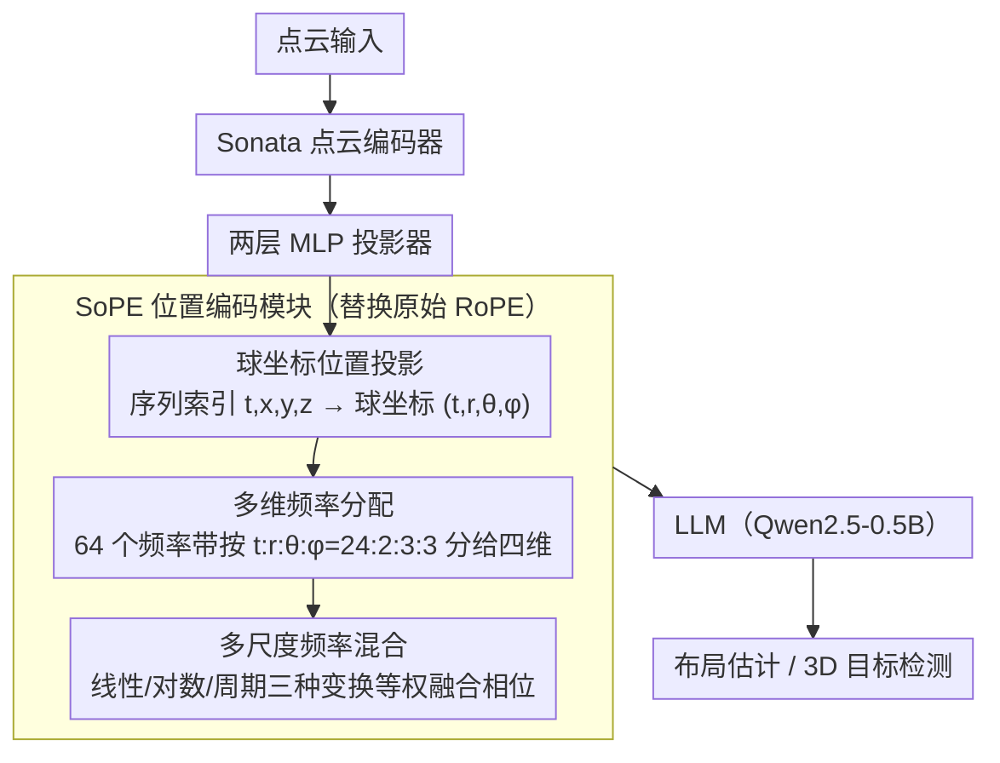

# SoPE: Spherical Coordinate-Based Positional Embedding for Enhancing Spatial Perception of 3D LVLMs

**会议**: CVPR2026  
**arXiv**: [2602.22716](https://arxiv.org/abs/2602.22716)  
**代码**: 无  
**领域**: 3D Vision / 3D Scene Understanding  
**关键词**: positional embedding, 3D LVLM, spherical coordinates, RoPE, point cloud, spatial perception

## 一句话总结

提出球坐标位置编码 SoPE，将点云 token 从一维序列索引重映射到球坐标 $(t,r,\theta,\phi)$ 空间，并配合多维频率分配与多尺度频率混合策略，显著增强 3D 大视觉-语言模型的空间感知能力。

## 研究背景与动机

当前 3D 大视觉-语言模型 (3D LVLMs) 广泛采用从 LLM 继承的旋转位置编码 (RoPE) 来建模 token 间的位置关系。然而，RoPE 在 3D 场景下存在两个根本性缺陷：

**三维空间结构丢失**：RoPE 将点云 token 按光栅扫描顺序展平为一维序列，按序列位置分配索引。这种做法完全忽略了点云 token 的真实三维空间位置，导致空间上相邻的 token 被分配到不相邻的位置索引，破坏了三维邻域连续性。

**方向感知缺失**：RoPE 的相对距离计算 $\Delta t = t_1 - t_2$ 仅能捕捉序列中的时序变化，无法感知 token 之间的角度和方向差异。这意味着模型对视觉表示中至关重要的方向变化视而不见。

作者通过注意力可视化发现了"空间感知偏差"现象：跨模态注意力集中在少数热点区域，大量位置和方向明显不同的 3D token 获得几乎相同的注意力权重，场景中的大片区域被有效忽略。小物体和结构边界在大型室内场景中尤其容易被抑制。

虽然已有一些将 RoPE 扩展到多模态的工作（如针对图像/视频的变体），但它们仍将位置索引视为序列或网格坐标，并未显式编码点云 token 的 3D 几何结构。这一核心差距构成了本文的设计动机。

## 方法详解

### 整体框架

SoPE 要解决的是 3D 大视觉-语言模型（3D LVLM）直接沿用 LLM 的 RoPE 所带来的空间感知缺陷：RoPE 把点云 token 按光栅顺序拍平成一维序列，既丢了真实三维结构、又感知不到方向。SoPE 是一个连接器级别的位置编码模块，以即插即用方式替换 SpatialLM 里的原始 RoPE——整体框架 SpatialSoPE 由点云编码器（Sonata）、两层 MLP 投影器、LLM（Qwen2.5-0.5B）组成，SoPE 就插在投影器与 LLM 之间对位置编码重新参数化，内部含球坐标位置投影、多维频率分配、多尺度频率混合三件套。

### 关键设计

**1. 球坐标位置投影：把一维序列索引换成几何感知的四维位置**

RoPE 的相对距离只算 $\Delta t = t_1 - t_2$，捕捉的是序列时序，根本看不到 token 间的角度和方向差异，空间相邻的 token 还常被分到不相邻的索引。SoPE 分两步重映射：先做位置索引重分配，提取点云 token 的笛卡尔坐标 $(x,y,z)$ 并保留原始序列索引 $t$，得到 $(t,x,y,z)$；再做球坐标映射，把笛卡尔坐标转成半径 $r = \sqrt{x^2+y^2+z^2}$（编码深度/距离）、极角 $\theta = \arccos(z/r)$（俯仰方向）、方位角 $\phi = \text{atan2}(y,x)$（水平朝向）。最终位置索引为 $(t,r,\theta,\phi)$、相对位置拓成 $(\Delta t, \Delta r, \Delta \theta, \Delta \phi)$ 四个分量，模型由此能同时捕捉空间位置和方向角度变化，从根上补齐了 RoPE 只靠一维时序索引的短板。

**2. 多维频率分配：把频率带按重要性分给四个维度**

四个分量该用什么频率并不等价：球坐标分量要捕捉细粒度几何、时序分量要保长程连续性。SoPE 把 RoPE 的 $d/2=64$ 个频率带按比例分给四维——球坐标 $(r,\theta,\phi)$ 走高频子带（前端）抓细粒度空间和角度变化，时序 $t$ 走低频子带（后端）保长程时序动态，再把四部分旋转矩阵求和得到最终相对旋转矩阵。经大量消融，最优比例定为 $t:r:\theta:\phi = 24:2:3:3$（共 32 个频率带对），均匀分配反而最差。

**3. 多尺度频率混合策略：用三种坐标变换同时罩住细节与全局**

单一尺度的位置编码难以同时兼顾细粒度几何和大尺度建筑布局。SoPE 对每个坐标分量 $u \in \{t,r,\theta,\phi\}$ 构建三种互补变换——线性尺度 $g^{\text{lin}}(u)$ 保绝对位置精度、对数压缩尺度 $g^{\text{log}}(u)$ 强调局部邻域、周期尺度 $g^{\text{per}}(u)$ 捕捉全局模式和长程依赖，最终相位三者等权融合 $\varphi_k(u) = \frac{1}{3}(\omega_k^{\text{lin}}g^{\text{lin}}(u) + \omega_k^{\text{log}}g^{\text{log}}(u) + \omega_k^{\text{per}}g^{\text{per}}(u))$。不引入额外可学习参数，保持轻量；消融显示多尺度对球坐标参数化的增益明显大于对 RoPE-3D 的增益，二者有协同效应。

### 训练策略

基于 SpatialLM 框架，用 Sonata 点云编码器联合训练，4 张 NVIDIA H20 GPU 单阶段训练，支持从零训练和预训练-微调两种配置。

## 实验关键数据

### 主实验：布局估计（Structured3D）

| 方法 | IoU2D@0.25 ↑ | IoU2D@0.5 ↑ |
|------|-------------|------------|
| RoomFormer | 70.4 | 67.2 |
| SceneScript | 83.1 | 80.8 |
| SpatialLM (ft. SpatialLM→S3D) | 86.5 | 84.6 |
| **SpatialSoPE (ft. SpatialLM→S3D)** | **88.7** | **86.2** |

### 主实验：3D 目标检测（ARKitScenes）

| 方法 | IoU3D@0.25 ↑ | IoU3D@0.5 ↑ |
|------|-------------|------------|
| VoteNet | 53.9 | 45.4 |
| H3DNet | 55.7 | 46.3 |
| NeRF-Det | 60.3 | 34.7 |
| UniDet3D | 62.8 | 48.3 |
| SpatialLM | 63.9 | 60.7 |
| **SpatialSoPE** | **66.1** | **63.2** |

### 不同位置编码方案对比（ARKitScenes + SpatialLM Dataset）

| 方法 | ARKit@0.25 ↑ | ARKit@0.5 ↑ | SpatialLM@0.25 ↑ | SpatialLM@0.5 ↑ |
|------|-------------|------------|------------------|-----------------|
| SpatialLM (baseline) | 63.9 | 60.7 | 69.7 | 62.0 |
| +MCA | 63.7 | 60.2 | 70.1 | 61.6 |
| +CCA | 64.1 | 60.5 | 69.8 | 62.5 |
| +RoPE-3D | 64.2 | 61.4 | 69.7 | 62.4 |
| **SpatialSoPE** | **66.1** | **63.2** | **71.4** | **63.4** |

### 消融实验：频率分配比例（ARKitScenes）

| 配置 | $t:r:\theta:\phi$ | IoU3D@0.25 ↑ | IoU3D@0.5 ↑ |
|------|-------------------|-------------|------------|
| Angular-Biased | 8:6:9:9 | 65.5 | 62.7 |
| Uniform | 1:1:1:1 | 63.0 | 59.0 |
| Temporal-Biased | 5:1:1:1 | 65.0 | 62.7 |
| **SpatialSoPE** | **24:2:3:3** | **66.1** | **63.2** |

### 消融实验：多尺度频率混合效果

| 方法 | 多尺度 | ARKit@0.25 | ARKit@0.5 | SpatialLM@0.25 | SpatialLM@0.5 |
|------|--------|-----------|----------|----------------|---------------|
| RoPE-3D | ✗ | 64.2 | 61.7 | 69.4 | 62.3 |
| RoPE-3D | ✓ | 64.8 | 62.1 | 70.3 | 62.9 |
| SoPE | ✗ | 65.4 | 61.4 | 71.0 | 62.5 |
| **SoPE** | **✓** | **66.1** | **63.2** | **71.4** | **63.4** |

### 关键发现

1. SoPE 在所有三个 benchmark（ARKitScenes、SpatialLM Dataset、Structured3D）上均一致超越 SpatialLM baseline，布局估计提升 +2.2/+1.6，目标检测提升 +2.2/+2.5。
2. 与 CCA、MCA 等二维投影方案对比，直接三维编码（RoPE-3D）就已优于二维投影，球坐标编码（SoPE）进一步拉开差距。
3. 频率分配比例影响显著：均匀分配最差（IoU3D@0.5 仅 59.0），时序偏重 24 + 球坐标 8 的方案最优。
4. 多尺度频率混合对 SoPE 的增益明显大于对 RoPE-3D 的增益（+1.8 vs +0.4 在 IoU@0.5），表明球坐标参数化与多尺度策略有良好的协同效应。
5. 跨模态注意力可视化显示 SoPE 产生更均衡的全局注意力模式，有效缓解空间感知偏差。

## 亮点与洞察

1. **问题定位精准**：从位置编码角度切入 3D LVLM 性能提升，是一个被忽视但非常基础的问题。通过注意力流可视化揭示"空间感知偏差"现象，动机很有说服力。
2. **球坐标是自然选择**：点云数据本质上具有方向性和距离属性，球坐标 $(r,\theta,\phi)$ 相比笛卡尔坐标能天然地分离距离和角度信息，与 RoPE 的旋转机制有更好的数学对齐。
3. **即插即用设计**：SoPE 作为 drop-in replacement 不改变模型架构，不引入可学习参数，实用性强。
4. **完整的工程验证**：不仅有 benchmark 实验，还在真实机器人系统上进行了端到端部署验证（点云重建 → 场景理解 → 导航规划），展现了实际应用潜力。

## 局限与展望

1. **仅验证 Qwen2.5-0.5B**：实验仅使用 0.5B 级别的 LLM，未验证在更大模型（7B/13B+）上是否同样有效，可扩展性存疑。
2. **频率分配比例靠经验搜索**：最优比例 24:2:3:3 通过消融实验确定，缺乏理论指导。可否根据数据特性自适应分配？
3. **球坐标原点选择**：论文使用坐标原点计算球坐标，但不同场景的原点位置可能影响编码效果，尤其在多房间场景中。
4. **多尺度权重固定**：三种尺度等权重混合，可能不同场景、不同物体大小需要不同权重。
5. **室内场景为主**：实验集中在室内场景（ARKitScenes、Structured3D），对室外大规模场景（如自动驾驶）的效果未知。

## 相关工作与启发

- **SpatialLM**：本文的基础框架，提供 3D 空间推理的数据/架构/训练设计
- **RoPE 变体**（VideoRoPE, M-RoPE, ComRoPE, DRoPE）：在时序/多视角维度扩展 RoPE，但未针对点云几何
- **Circle-RoPE**：用锥形投影解耦跨模态位置编码，思路相关但方法不同
- **启发**：球坐标编码的思想可推广到其他需要方向感知的 3D 任务（如 3D 目标跟踪、场景流估计），以及 3D Gaussian Splatting 等新兴表示中的位置建模

## 评分

- **新颖性**: ⭐⭐⭐⭐ — 球坐标 + 多尺度频率混合改进 RoPE 的方案新颖实用，但核心思想（用空间坐标替代序列索引）在 2D 领域已有先例
- **实验充分度**: ⭐⭐⭐⭐ — 多 benchmark、多 baseline 对比、多角度消融完整，但仅用 0.5B 模型，缺少大模型验证
- **写作质量**: ⭐⭐⭐⭐ — 动机分析深入，数学推导清晰，可视化有说服力
- **价值**: ⭐⭐⭐⭐ — drop-in replacement 实用性强，对 3D LVLM 社区有直接参考价值
- **价值**: ⭐⭐⭐⭐ — drop-in replacement 实用性强，对 3D LVLM 社区有直接参考价值

<!-- RELATED:START -->

## 相关论文

- [\[CVPR 2025\] SphereUFormer: A U-Shaped Transformer for Spherical 360 Perception](../../CVPR2025/3d_vision/sphereuformer_a_u-shaped_transformer_for_spherical_360_perception.md)
- [\[CVPR 2026\] 3D-Object Perception Transformer (3PT)](3d-object_perception_transformer_3pt.md)
- [\[CVPR 2026\] PE3R: Perception-Efficient 3D Reconstruction](pe3r_perception-efficient_3d_reconstruction.md)
- [\[CVPR 2026\] DMAligner: Enhancing Image Alignment via Diffusion Model Based View Synthesis](dmaligner_enhancing_image_alignment_via_diffusion_model_based_view_synthesis.md)
- [\[CVPR 2026\] Spatial Matters: Position-Guided 3D Referring Expression Segmentation](spatial_matters_position-guided_3d_referring_expression_segmentation.md)

<!-- RELATED:END -->
