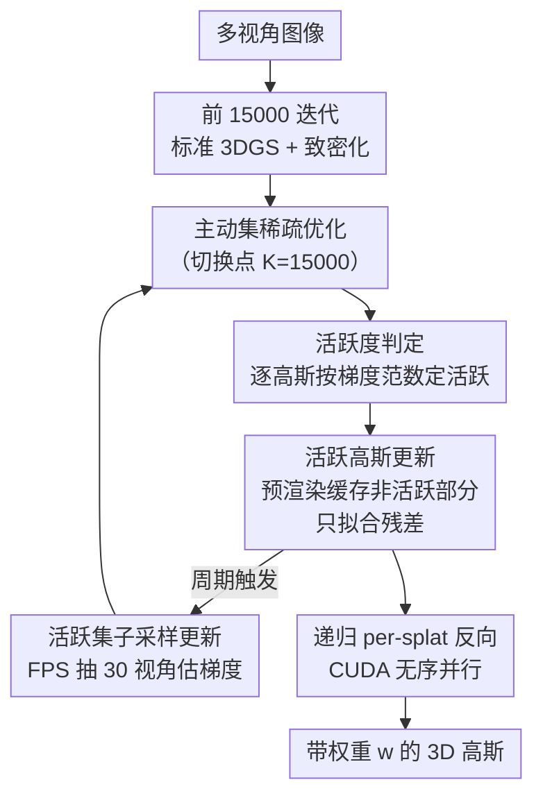

# SparseOIT: Improving Order-Independent Transparency 3DGS via Active Set Method

**会议**: CVPR 2026  
**论文**: [CVF Open Access](https://openaccess.thecvf.com/content/CVPR2026/html/Yang_SparseOIT_Improving_Order-Independent_Transparency_3DGS_via_Active_Set_Method_CVPR_2026_paper.html)  
**代码**: https://wentaoyang19.github.io/SparseOIT.github.io/ （项目主页）  
**领域**: 3D视觉  
**关键词**: 3D高斯泼溅, 顺序无关透明, 主动集方法, 训练加速, 稀疏优化

## 一句话总结
本文发现 Order-Independent Transparency（OIT）渲染方程去掉深度排序后，高斯泼溅之间的依赖大幅解耦、变得高度稀疏，于是用「主动集（active set）方法」只优化少量真正在更新的高斯，配合一套 CUDA 反向传播改造，把 OIT 类方法的训练速度提升 4–6×，质量逼近 3DGS / Taming-3DGS。

## 研究背景与动机

**领域现状**：3D Gaussian Splatting（3DGS）凭借照片级真实感成为主流的新视角合成方法，它沿用 NeRF 的体渲染方程——把高斯按到相机的距离排序，再做前后遮挡的 alpha 合成。

**现有痛点**：体渲染里的**深度排序**是麻烦之源。优化过程中高斯不断被更新，一旦排序顺序变化，梯度就会出现非光滑跳变；切换到新视角时还会产生 popping（爆闪）伪影，对非朗伯/透明材质尤其不友好。为绕开排序，一族 OIT（顺序无关透明）方法（如 SortFree）把排序步骤换成一个与顺序无关的加权合成方程。但 OIT 方法一直没火起来，因为：① 训练时间远慢于体渲染 3DGS（SortFree 比 3DGS 慢约 3×）；② 新视角渲染质量明显偏低。

**核心矛盾**：OIT 去掉排序换来了「顺序无关」，但代价是优化变慢、质量变差，潜力没被挖出来。作者注意到一个被忽视的副产品：**排序步骤一旦移除，渲染方程中各高斯之间的耦合也随之消失**。在标准 3DGS 里，透射率 $T_i=\prod_{j<i}(1-\alpha_j)$ 让每个高斯的贡献都依赖它前面所有高斯的排序结果；而 OIT 的加权求和形式让每个高斯近似独立贡献。

**本文目标**：把「OIT 带来的解耦」从一个被动副作用，变成主动可利用的加速杠杆，同时补齐 GPU 实现层面的效率短板。

**切入角度**：作者观察到 3DGS 优化存在「80/20」式的稀疏性——简单结构（墙、桌面）用了大量高斯却很快收敛，复杂小物体只占少量高斯却要迭代很久。也就是说，**任一时刻只有一小部分高斯在真正更新，大部分可以被「冻结」**。在耦合的 3DGS 里冻结部分高斯会污染其余高斯的合成结果，做不到；但在解耦的 OIT 里，冻结的高斯可以被预渲染缓存下来，剩下的优化只盯着活跃高斯做。

**核心 idea**：用数值优化里的「主动集方法」管理一组活跃高斯，只对活跃集做优化，加速比正比于场景的潜在稀疏度；再把 Taming-3DGS 一类 GPU 加速技巧重写进 OIT 的无序特性里，补齐与体渲染方法的效率差距。

## 方法详解

### 整体框架

SparseOIT 的输入是多视角图像，输出是一组带权重项 $w_i$ 的 3D 高斯。整条流程分两段：**前 15,000 次迭代完全照搬标准 3DGS 的优化（含致密化 densification）**，让高斯数量和粗结构先长出来；**第 15,000 次迭代之后切换到主动集稀疏优化**。切换的理由很直接——优化早期几乎所有高斯都在剧烈更新，活跃集近乎全集，主动集方法无利可图；到了后期才出现大面积「已收敛、可冻结」的高斯。

切换后，整个训练被切成一段段「stage」，stage 之间插入「活跃集更新」。每个 stage 开始前先更新活跃集 $\mathcal{A}$，并取出上一步算好的「非活跃集预渲染图」$I^{pre}$（即被冻结那批高斯的渲染结果）；stage 内只渲染当前活跃集，让它去拟合「输入图像 − 预渲染图」的残差，同时顺手生成一张新的预渲染图供下一 stage 使用。这一切之所以成立，全靠 OIT 渲染方程的解耦性——非活跃高斯的贡献可以提前算好、缓存复用，不会因为活跃高斯被更新而失效。

整个系统由三层构成：**活跃度判定 → 活跃高斯更新（预渲染残差）→ 活跃集周期更新（子采样估计）**，外加一层独立的 **CUDA 反向传播改造**贯穿始终。

### 关键设计

**1. 把 OIT 的解耦性转成「主动集」加速：只优化在动的高斯**

这是全文的核心。标准 3DGS 的渲染方程 $\mathbf{C}=\sum_i T_i\alpha_i\mathbf{c}_i,\ T_i=\prod_{j<i}(1-\alpha_j)$ 里，每个高斯的贡献都被前面所有高斯的排序与透射率绑死，没法单独冻结。OIT 改用 SortFree 的加权合成形式：

$$\mathbf{C}=T\,\mathbf{c}_0+(1-T)\,\frac{\sum_{i=1}^N \mathbf{c}_i\,\alpha_i\,w_i}{\sum_{i=1}^N \alpha_i\,w_i},\quad T=\prod_{i=1}^N(1-\alpha_i)$$

其中 $w_i=\max(0,1-\frac{d}{\sigma})v(\mathbf{r})$ 是依赖深度 $d$ 和视角方向 $\mathbf{r}$ 的可学习权重，$v(\mathbf{r})$ 是三阶球谐补偿视角相关外观。这个分式形式里，每个高斯通过分子分母的独立累加项贡献，去掉了 $\prod_{j<i}$ 的级联耦合，于是「冻结一部分高斯、只优化另一部分」在数学上是自洽的。作者据此引入主动集方法：不在全集上做梯度下降，只对活跃集 $\mathcal{A}$ 优化，加速比正比于潜在稀疏度。主动集方法成败取决于三件事——活跃度怎么定义、活跃高斯怎么高效更新、活跃集怎么低成本周期刷新——下面三点逐一对应。

**2. 活跃度判定：高斯级、按梯度范数整体冻结**

高斯是多属性变量（位置 $\mu$、四元数 $q$、尺度 $s$、不透明度 $o$、球谐 $h$、权重 $w$），这些属性强相关，所以作者不拆开看，而是把同一个高斯的所有属性当作不可分的一组，只判定「高斯级活跃度」：

$$\mathbf{1}_{\text{active}}(i)=\exists\, v\in\{\mu_i,q_i,s_i,o_i,h_i,w_i\},\ (\|\nabla_v\|>\epsilon_v)$$

即只要任一属性的梯度范数超过阈值 $\epsilon_v$，这个高斯就算活跃；全部属性梯度都接近零，才冻结。阈值 $\epsilon_v$ 按经验设定，用来在效率和质量之间取平衡——阈值越激进、冻结越多、越快，但质量风险越大。这种「整组判定」避免了同一高斯部分属性更新、部分冻结造成的状态不一致。

**3. 活跃高斯更新：预渲染缓存非活跃集，只拟合残差**

确定活跃集 $\mathcal{A}$ 和其补集（非活跃集 $\bar{\mathcal{A}}$）后，关键是不要在每次迭代都重渲染所有高斯。由于 OIT 方程不耦合高斯，作者对每个训练视角维护一张**预渲染图**：把非活跃高斯的渲染结果提前算好缓存。两次活跃集更新之间，训练就退化成——让活跃高斯去拟合「输入图像 − 预渲染图」这个残差，非活跃部分的算力被整段省掉。

实现上有个 GPU 并行的坑：活跃集更新后非活跃集变了，预渲染图本该重算，但这种更新在图像上太稀疏（只有少数像素受影响），直接更新会让 GPU 并行度很差。作者的处理是**延迟更新**——把预渲染图的刷新推迟到它真正要被用于训练时，再把预渲染图和训练图一起送进 GPU，给每个高斯打上「活跃/非活跃」两类标签，分两路处理。

**4. 活跃集周期更新：子采样视角估梯度，把更新成本压到亚线性**

活跃集本身需要周期性重新评估——最朴素的做法是重算所有高斯的梯度，但那等于做一次全变量更新，加速全被抵消。作者的关键观察是：**活跃度只是把梯度和零向量比大小，这个判定天然容忍一定的近似误差**，于是可以用子采样来省。具体做法是在更新活跃集时，对训练视角用**最远点采样（FPS，带随机初始化）抽出一个子集（实验用 30 个视角）**来估计高斯梯度，复杂度从线性降到亚线性。实验表明即便子采样，活跃度的估计依旧可靠。整套主动集流程见 Alg.1：采样训练视角→用活跃集+预渲染图光栅化→算残差损失→更新活跃高斯；逢更新轮次时再对子采样视角重算损失、刷新活跃集。

**5. 递归 per-splat 反向传播：用 OIT 的无序性消掉 Taming-3DGS 的冗余计算**

这是另一条独立的加速线，针对 CUDA 反向传播。原始 3DGS 反向时梯度从像素流向高斯，多个线程对同一 splat 的累加器做原子写，争用严重，线程大量时间卡在原子写上。Taming-3DGS 改成 splat 级并行缓解争用，但它的前向需要深度排序、每 32 个 splat 做一次 per-pixel 状态检查点，反向时被迫严格按深度序遍历——固定 warp 大小 32 导致每个 tile 多达 31 次冗余计算。SparseOIT 抓住 OIT「渲染对高斯处理顺序没有任何约束」的特性：把每个 tile（256 像素）分成 8 组、每组 32 像素匹配 warp 大小，warp 内每条 lane 各取自己像素的状态（每组只取一次），再在 warp 内循环轮转这些 per-pixel 状态，依次喂给每个 splat 32 个像素状态并累加梯度，重复 8 次完成整个 tile。这样多 lane 可同时取数、减少停顿，且**可证明不产生任何冗余算术**。此外还沿用 SpeedySplat 的 culling 策略削减前后向工作量。

> 框架↔关键设计对应：框架图里「活跃度判定 / 活跃高斯更新 / 活跃集子采样更新 / 递归 per-splat 反向」四个贡献节点，分别对应关键设计 2/3/4/5；设计 1 是贯穿这一切的解耦前提。前 15000 迭代标准 3DGS 与最终高斯输出为脚手架节点。

### 损失函数 / 训练策略
损失函数与原始 3DGS 完全一致（L1 + SSIM，$\lambda_{ssim}$ 沿用 3DGS）。用 Adam 优化，学习率 $o$ 设 0.01、$\sigma$ 设 0.1、$v$ 设 0.005，其余沿用 3DGS；权重 $v$ 用单通道三阶球谐表示。致密化策略与 3DGS 一致，但为防显存溢出按场景设经验随机采样概率限制高斯数量。致密化在 15,000 迭代终止，主动集加速也从此开启。由于方法存在明显的 run 间方差（如 Bicycle/Room 等场景 PSNR 可差 0.6 dB），表中数值取多次平均。

## 实验关键数据

数据集：Mip-NeRF 360、Deep-Blending、Tanks & Temples（Mip-NeRF 360 用 1/4 分辨率防显存溢出）。基线：3DGS、Taming-3DGS、SortFree（OIT 方法，用第三方实现）。指标：PSNR / SSIM / LPIPS + 训练时间(秒) + 高斯数 N(k)。单张 NVIDIA 4090（24GB）。三个变体：**SparseOIT-A**=只用 CUDA 加速、**SparseOIT-B**=CUDA 加速 + 主动集、**SparseOIT-C**=CUDA 加速 + Taming 致密化（无主动集）。

### 主实验

| 数据集 | 方法 | PSNR↑ | SSIM↑ | LPIPS↓ | 训练时间↓ | N(k) |
|--------|------|-------|-------|--------|----------|------|
| Tanks&Temples | SortFree | 22.97 | 0.8299 | 0.1814 | 2159 | 3765 |
| Tanks&Temples | 3DGS | 23.78 | 0.8494 | 0.1704 | 705 | 1569 |
| Tanks&Temples | **SparseOIT-B** | 23.68 | 0.8429 | 0.1798 | **445** | 2052 |
| DeepBlending | SortFree | 29.76 | 0.9016 | 0.2399 | 2065 | 2843 |
| DeepBlending | 3DGS | 29.70 | 0.9027 | 0.2409 | 1213 | 2459 |
| DeepBlending | **SparseOIT-B** | **29.80** | **0.9043** | 0.2486 | **309** | 1251 |
| Mip-NeRF 360 | SortFree | 27.33 | 0.8067 | 0.1792 | 2302 | 4314 |
| Mip-NeRF 360 | 3DGS | 27.68 | 0.8214 | 0.1771 | 909 | 2679 |
| Mip-NeRF 360 | **SparseOIT-B** | 27.21 | 0.8027 | 0.2040 | **408** | 2121 |

要点：SparseOIT-B 相对 SortFree 训练加速约 **4–6×**、相对 3DGS 约 **2–4×**，质量与 3DGS/Taming 可比，在 DeepBlending 上 PSNR/SSIM 甚至略超 3DGS。SparseOIT-C（接 Taming 致密化）则把训练时间压到 ~160s 量级、与 Taming 相当。OIT 类方法在反光物体/复杂室内光照场景上反而优于 3DGS，因为 OIT 把权重作为独立变量优化，而 3DGS 的权重与不透明度、深度强耦合。

### 消融实验

反向传播并行方式（playroom 场景）：

| 反向实现 | PSNR↑ | SSIM↑ | LPIPS↓ | 时间↓ | N(k) |
|----------|-------|-------|--------|-------|------|
| Per-pixel [3DGS] | 30.04 | 0.9024 | 0.2474 | 981 | 1383 |
| Per-splat [Taming] | 29.93 | 0.9024 | 0.2477 | 415 | 1377 |
| **Ours（递归 per-splat）** | 29.93 | 0.9020 | 0.2483 | **396** | 1380 |

递归 per-splat 反向比原始 3DGS 约 **2× 提速**，比 Taming 再省近 20 秒，质量几乎无损。主动集消融见 Tab.1 的 A vs B：开启主动集（B）相对仅 CUDA 加速（A）训练更快、质量仅可忽略下降，且**高斯数越多、加速越显著**——印证了「稀疏度越高、主动集收益越大」。

### 关键发现
- 加速主要来自两条正交的线：**主动集（A→B）**和 **CUDA 反向改造（per-pixel→Ours）**，二者叠加才达到与 Taming 可比的速度。
- 主动集的收益随高斯规模放大，说明大场景里「可冻结的高斯占比」更高，稀疏假设更成立。
- OIT 在反光场景质量反超 3DGS，是「权重解耦」带来的意外正向收益，而不仅是加速。

## 亮点与洞察
- **把渲染方程的数学性质（解耦）翻译成系统级加速（主动集 + 预渲染缓存）**：这是最巧妙的一步——别人把 OIT 当成「绕开排序」的渲染技巧，本文看出它顺带把变量依赖图变稀疏了，于是数值优化里的经典 active set 方法第一次能用在 3DGS 上。
- **子采样估梯度 + 容错判定**：活跃度只是和零比大小，天然容忍噪声，所以可以用 FPS 子采样把活跃集更新成本压到亚线性——这个「判定容错→可近似→可加速」的链条很值得迁移到其他需要周期性重估重要性的训练场景（如稀疏化、剪枝、课程采样）。
- **顺序无关性反过来解锁 GPU 并行**：Taming 的冗余计算源于深度序约束，OIT 没这个约束，于是 warp 内可以无冗余地循环轮转像素状态——「去掉一个约束，下游实现连带变快」的典型案例。

## 局限与展望
- 作者承认 OIT 类 3DGS 的**剪枝（pruning）几乎没被研究**，缺剪枝会拖累高斯优化、影响最终高斯数和训练效率。
- 权重项 $w$ 引入额外计算与存储开销，还会影响新视角合成质量，部分场景渲染偏弱与此有关；未来需探索更高效的 $w$ 参数化。
- 方法 run 间方差明显（部分场景 PSNR 差到 0.6 dB），需多次平均才稳定，说明优化稳定性仍有提升空间。
- 与 Taming 仍有残余差距，来自场景表示差异、渲染截断，以及多出的权重系数让参数量略大于标准 3DGS。

## 相关工作与启发
- **vs SortFree（OIT 鼻祖）**: 同样用加权无序合成方程，但 SortFree 只解决了「去排序」、没动优化算法，训练慢到 ~2000s+；本文在它的渲染方程之上加主动集 + CUDA 改造，速度提升 4–6× 且质量更好。
- **vs Taming-3DGS**: Taming 靠 splat 级并行 + 资源调度加速，但受深度序约束有冗余；本文借 OIT 无序性做无冗余的递归 per-splat 反向，单场景再省 20s，并直接复用 Taming 的致密化（变体 C）做到速度可比。
- **vs 3DGS-LM / 3DGS²（二阶优化加速）**: 它们换优化器（LM / 局部牛顿）来加速收敛，正交于本文——本文不换优化器，而是减少每次迭代要优化的变量数（主动集），两条路线原则上可叠加。

## 评分
- 新颖性: ⭐⭐⭐⭐⭐ 把「OIT 去排序→变量解耦→稀疏→主动集」这条因果链打通，视角新颖且非显然。
- 实验充分度: ⭐⭐⭐⭐ 三数据集 + 三变体 + 两项消融较完整，但缺 run 间方差的定量报告和更大规模场景。
- 写作质量: ⭐⭐⭐⭐ 动机与方法逻辑清晰，个别公式 OCR 噪声较大、$w$ 的细节略简。
- 价值: ⭐⭐⭐⭐ 让 OIT 类 3DGS 从「慢且弱」变成「快且可比」，对透明/反光材质重建是实用推进。

<!-- RELATED:START -->

## 相关论文

- [\[CVPR 2026\] Faster-GS: Analyzing and Improving Gaussian Splatting Optimization](faster-gs_analyzing_and_improving_gaussian_splatting_optimization.md)
- [\[CVPR 2026\] GLINT: Modeling Scene-Scale Transparency via Gaussian Radiance Transport](glint_modeling_scene-scale_transparency_via_gaussian_radiance_transport.md)
- [\[CVPR 2026\] GAI-GS：用几何代数注意力把光线-物体交互注入 3DGS 的无线信道预测框架](a_geometric_algebra-informed_3dgs_framework_for_wireless_channel_prediction.md)
- [\[CVPR 2026\] EDGS: Eliminating Densification for Efficient Convergence of 3DGS](edgs_eliminating_densification_for_efficient_convergence_of_3dgs.md)
- [\[CVPR 2026\] Z-Order Transformer for Feed-Forward Gaussian Splatting](z-order_transformer_for_feed-forward_gaussian_splatting.md)

<!-- RELATED:END -->
