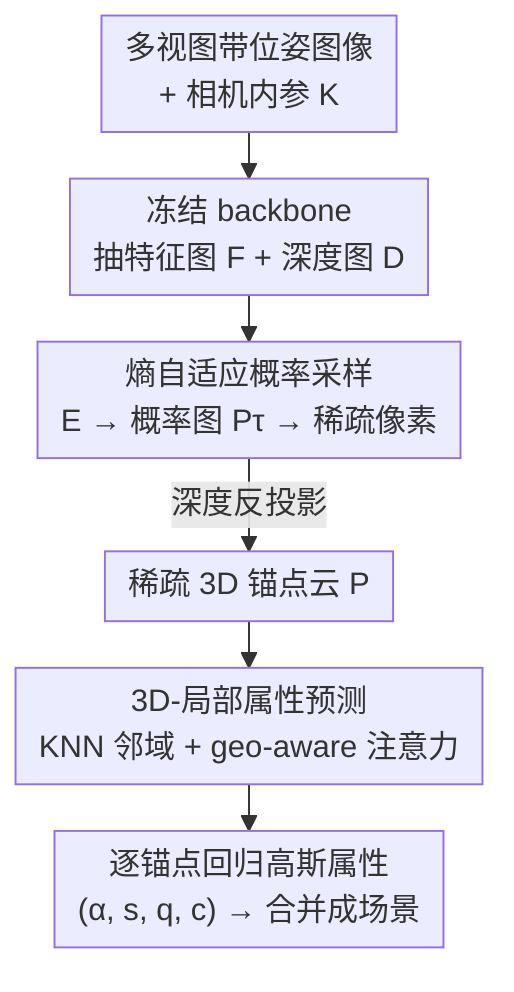

# SparseSplat: Towards Applicable Feed-Forward 3D Gaussian Splatting with Pixel-Unaligned Prediction

**会议**: CVPR 2026  
**论文**: [CVF Open Access](https://openaccess.thecvf.com/content/CVPR2026/html/Zhang_SparseSplat_Towards_Applicable_Feed-Forward_3D_Gaussian_Splatting_with_Pixel-Unaligned_Prediction_CVPR_2026_paper.html)  
**代码**: [项目页](https://victkk.github.io/SparseSplat-page/)（暂未见公开 GitHub）  
**领域**: 3D视觉  
**关键词**: 前馈式3DGS, 新视图合成, 自适应采样, 信息熵, 点云网络

## 一句话总结
SparseSplat 是首个能根据场景结构和局部信息丰富度**自适应分配高斯密度**的前馈式 3DGS 模型：用基于香农熵的概率采样替代"每像素一个高斯"的范式生成稀疏锚点，再用一个工作在 3D 局部邻域上的 KNN 预测头回归高斯属性，最终用 DepthSplat 22% 的高斯数（150k vs 688k）达到同等渲染质量，并能用单一模型在 10k~150k 高斯间无缝调节稀疏度。

## 研究背景与动机

**领域现状**：前馈式 3D Gaussian Splatting（feed-forward 3DGS）是近期的热点——训练一个网络，从若干带位姿的 RGB 图像一次前向就吐出完整的 3DGS 场景表示，省掉了原版 3DGS 几分钟的逐场景优化，非常适合 SLAM、AR/VR、机器人等"即时重建"下游任务。PixelSplat、MVSplat、DepthSplat 等代表作把渲染质量推到了新高度。

**现有痛点**：这些方法生成的 3DGS 地图**又密又冗余**。早期前馈方法普遍是"pixel-aligned"：对输入视图的每个像素都预测一个高斯，于是哪怕是天空、白墙这种纹理贫乏区域也被塞满了均匀分布的高斯。DepthSplat 一个场景动辄 688k 个高斯，内存和算力开销对车载、无人机、AR 眼镜这类边缘设备是不可接受的，直接挡住了前馈 3DGS 落地 SLAM 等真实应用。

**核心矛盾**：这种冗余的根子在于**结构与分布的错配**。原版优化式 3DGS 天然是内容自适应的——纹理少的地方用稀疏的大高斯、纹理丰富的地方用密集的小高斯；而 pixel-aligned（乃至后来 AnySplat/VolSplat 改成的 voxel-aligned）都是把高斯钉死在一个**刚性、与场景无关的均匀网格**上，和 3DGS 想要的非均匀分布从根上就不兼容。后处理类方法（GGN、Long-LRM）只是事后合并/剪枝，是"清理冗余"而非"不产生冗余"，治标不治本。

**本文目标**：作者把失败归因为两个根本性设计缺陷，并各个击破：① **分布错配**（刚性网格 vs 内容自适应分布）；② **感受野错配**——他们观察到 3DGS 优化本质是个**局部过程**（一个高斯的属性主要由它在 2D/3D 空间的近邻决定），但现有方法却用大感受野 backbone 抽全局上下文、再从**单个像素特征**回归高斯属性，这种"全局感知、单点预测"违背了预测任务的局部性。

**核心 idea**：彻底抛弃 pixel-aligned 范式，用"按信息丰富度自适应采样 + 在 3D 局部邻域上预测属性"两步，让前馈网络模仿优化式 3DGS 的自适应高效分布。

## 方法详解

### 整体框架
SparseSplat 要解决的是"如何前馈地生成一张稀疏、高效、高保真的 3DGS 地图"。整条流水线分三个阶段串行：先用一个**冻结的 backbone** 从多视图带位姿图像抽出特征图和深度图；再在**自适应采样**阶段把每张图的局部熵转成概率图、按概率随机采样出稀疏 2D 像素，并用深度反投影成稀疏 3D 锚点云；最后在 **3D 局部属性预测**阶段，对每个锚点 KNN 查近邻、把局部邻域特征喂进一个轻量预测头回归出完整高斯属性 $(\alpha, s, q, c)$，所有高斯合并即得最终场景。SparseSplat 自身**不贡献新 backbone**——它直接复用并冻结 DepthSplat 的多视图深度估计网络，创新点全在"如何利用 $F$ 和 $D$ 去生成稀疏表示"。

### 关键设计

**1. 熵自适应概率采样：用信息熵决定高斯该往哪堆**

这一步直击"分布错配"的痛点：既然 3DGS 想要的是"纹理少→稀疏大高斯、纹理多→密集小高斯"，那就让采样密度正比于局部信息复杂度。作者借用图像处理里成熟的"熵衡量纹理复杂度"原理：对每张输入图的灰度版，在每个像素的 $N\times N$ 局部窗口内算香农熵，得到信息密度图 $E\in\mathbb{R}^{H\times W}$：

$$E(u,v) = -\sum_{i=0}^{L-1} p_i \log p_i$$

其中 $L$ 是灰度级数（如 256），$p_i$ 是窗口 $W_{u,v}$ 内灰度级 $i$ 的归一化直方图概率。$E$ 高的地方对应高频纹理区，低的地方对应平坦区。接着把熵图归一化到理论最大值 $\log L$ 并乘上一个温度系数 $\tau$，转成每像素的独立采样概率：

$$P_\tau(u,v) = \mathrm{clip}\!\left(\tau\cdot\frac{E(u,v)}{\log L},\,0,\,1\right)$$

然后对每个像素生成随机数 $r\sim U(0,1)$，若 $r<P_\tau(u,v)$ 就把该像素选入稀疏集 $S$，再用深度 $D$ 和相机参数把 $S$ 反投影成 3D 锚点云 $P$。这个设计的妙处在于 $\tau$ 是一个**直观的稀疏度旋钮**：$\tau$ 越大整体采样概率越高、点云越密，越小越稀疏——于是**单一模型**就能在 150k/100k/40k/10k 等不同高斯量级间切换，直接用一个超参换取"内存 vs 渲染质量"的 trade-off，去适配 AR/VR（要小内存）或 SLAM（要极致稀疏快速更新）等不同下游需求。这和 voxel 化方法被网格分辨率锁死、后处理方法只能事后补救都不同，是"sparse-by-design"。

**2. 3D-局部属性预测器：把感受野对齐到 3DGS 优化的局部性**

这一步针对"感受野错配"。作者先做了一段理论论证（Fig.3）：原版 3DGS 优化里，一个 3D 高斯被泼溅到 2D 像面只覆盖一小片像素，渲染 loss 的梯度也只从这一小片局部邻域回流到该高斯的属性；而与它在投影后有重叠的邻近高斯会调制这片像素的渲染、进而影响梯度流向。结论是：**一个高斯的属性主要由它自己和它在 2D/3D 空间的近邻决定，3DGS 优化本质是局部过程**。因此用全局 backbone + 单像素回归是矛盾的设计。

SparseSplat 的预测器严格遵守这一局部性原则：对每个锚点 $p_i$，用高效的 FAISS 在 3D 空间查 K 近邻 $\{p_{n1},...,p_{nK}\}$。对每个点（中心或近邻），采用**双投影策略**——把几何特征 $g\in\mathbb{R}^{d_g}$（xyz 坐标、表面法线、视线方向）和高维图像特征 $v\in\mathbb{R}^{d_v}$（取自 backbone 特征图）分别过两个可学习投影 $\phi_g,\phi_v$ 再拼接：

$$f = [\phi_g(g);\phi_v(v)]\in\mathbb{R}^{2d_h}$$

得到局部邻域特征集 $\mathcal{F}_i=\{f_i\}\cup\{f_{nj}\}_{j=1}^K$。作者试过 DGCNN 边卷积、PointNet max-pooling、简单 MLP 和 geo-aware attention，消融发现 **geo-aware 注意力**最好——它让网络按需自适应地加权不同近邻的贡献：$\tilde f_i=\mathrm{Attention}(f_i,\mathcal{F}_i)$，聚合特征再过一个轻量 MLP 回归出全部高斯属性 $\{\alpha,s,q,c\}=\mathrm{MLP}_\theta(\tilde f_i)$（不透明度、3D 尺度、四元数旋转、球谐系数）。这个设计一举两得：预测器的感受野（3D 局部邻域）和任务本质（局部优化）完美对齐，同时保持轻量高效。一个意外收益是它对深度误差更鲁棒——在天空-建筑边界等 backbone 深度估计出错的区域，处理 3D 邻域比单像素更能识别局部几何不一致，并通过预测更小更局部的高斯抑制伪影扩散。

### 损失函数 / 训练策略
全程端到端、**只用 RGB 监督**。预测出的高斯集 $G$ 经标准可微高斯渲染器 $\mathcal{R}$ 渲到训练视图，得 $I_{render}$。由于深度图由冻结 backbone 提供，训练目标只关注渲染质量，用 MSE 加感知 LPIPS 组合：

$$L = (1-\lambda)L_{MSE}(I_{render},I_{gt}) + \lambda L_{LPIPS}(I_{render},I_{gt})$$

实现细节：4×A100(80GB) 训练约 48 小时，Adam + cosine 调度，batch size 2，学习率 $2\times10^{-4}$，熵窗口 $N=7$，KNN 默认 $K=20$，DL3DV 用 256×448 分辨率。训练时**冻结提供深度/特征的 backbone**，以与主基线 DepthSplat 做公平对比。

## 实验关键数据

### 主实验
在 DL3DV（6000 场景训练 / 140 场景测试）上，SparseSplat 用单一模型通过调 $\tau$ 给出不同高斯量级的工作点：

| 方法 | 类别 | PSNR ↑ | SSIM ↑ | LPIPS ↓ | 高斯数 ↓ | 时间(s) ↓ |
|------|------|--------|--------|---------|----------|-----------|
| MVSplat | pixel-aligned | 22.95 | 0.774 | 0.192 | 688k | 0.260 |
| DepthSplat | pixel-aligned | 24.17 | 0.816 | 0.152 | 688k | 0.128 |
| GGN | 后处理 | 20.23 | 0.570 | 0.268 | 162k | 0.320 |
| Long-LRM | 后处理 | 20.92 | 0.627 | 0.265 | 200k | 0.115 |
| AnySplat | voxel化 | 17.45 | 0.471 | 0.320 | 608k | 0.378 |
| **Ours-150k** | 自适应 | **24.20** | 0.817 | 0.168 | **150k** | 0.398 |
| Ours-100k | 自适应 | 23.95 | 0.786 | 0.189 | 100k | 0.192 |
| Ours-40k | 自适应 | 22.65 | 0.737 | 0.251 | 40k | 0.111 |
| Ours-10k | 自适应 | 21.29 | 0.665 | 0.321 | 10k | 0.105 |

关键结论：Ours-150k 用 **22% 的高斯数**（150k vs 688k）达到与 DepthSplat 持平的 24.20 PSNR；代价是单次重建时间略慢（398ms vs 128ms，主要花在 KNN）。而稀疏端的 10k/40k 模型既比 DepthSplat 更快（105/111ms vs 128ms）又能维持 21.29/22.65 的稳健质量——这种"优雅降级"能力是 AnySplat（稀疏时质量崩塌）所不具备的。

跨数据集泛化（在 DL3DV 训、直接测未见过的 Replica）：

| 方法 | PSNR ↑ | SSIM ↑ | LPIPS ↓ |
|------|--------|--------|---------|
| MVSplat | 19.13 | 0.628 | 0.423 |
| DepthSplat | 26.47 | 0.836 | 0.175 |
| Ours-150k | **26.64** | **0.846** | 0.180 |

PSNR 反超 DepthSplat，说明无需重训也能迁移到完全不同域；DepthSplat 仅在 LPIPS 上略占优。

### 消融实验
（均训练 30k 步、按 40k 高斯量评估）

| 配置 | PSNR ↑ | SSIM ↑ | LPIPS ↓ | 说明 |
|------|--------|--------|---------|------|
| 熵采样 (Ours) | **22.36** | 0.718 | 0.262 | 完整采样策略 |
| 随机采样 | 21.50 | 0.696 | 0.288 | 掉 0.86 PSNR |
| Laplacian 边缘采样 | 21.95 | 0.705 | 0.267 | 掉 0.41 PSNR |
| K=0（退化为单点 MLP） | 21.53 | 0.683 | 0.291 | 掉 0.83 PSNR |
| K=20（默认） | 22.36 | 0.718 | 0.262 | 局部邻域聚合 |
| 预测头: Graph-Conv | 20.78 | 0.664 | 0.329 | |
| 预测头: MLP | 21.47 | 0.683 | 0.299 | |
| 预测头: Max Pooling | Fail | Fail | Fail | 训练直接发散 |
| 预测头: Geo-aware Attn | 22.36 | 0.718 | 0.263 | 最佳 |

### 关键发现
- **熵确实比边缘/随机更会分配高斯**：熵采样 22.36 PSNR > Laplacian 21.95 > 随机 21.50，验证"信息丰富度"比简单边缘检测更适合指导稀疏高斯分配，直接对症"分布错配"。
- **局部邻域是感受野错配假设的硬证据**：K=0 退化成单点 MLP 只有 21.53，加到 K=20 涨到 22.36；K>20 收益递减（K=30 仅 22.38），故默认 K=20 平衡性能与算力。
- **聚合头选型很关键**：geo-aware 注意力（22.36）显著优于 MLP（21.47）和 Graph-Conv（20.78），而 PointNet 式 max-pooling 训练直接失败——说明对局部 3D 邻域要"自适应加权"而非粗暴池化。

## 亮点与洞察
- **把"冗余"问题溯源到两个 mismatch**：作者没有停在"高斯太多"的表象，而是拆成"分布错配"和"感受野错配"两个根因，并各配一个组件精准对应，问题分析本身就是论文最大的贡献之一。
- **$\tau$ 一个旋钮统一全谱稀疏度**：单一训练模型靠改温度系数就能在 10k~150k 高斯间任意切换、且渲染质量优雅降级，这对"同一个模型既服务 AR/VR 又服务 SLAM"非常实用，比训多个固定容量模型省事得多。
- **从 3DGS 优化的梯度流推导出"局部性"再据此设计网络**：用 Fig.3 的梯度回传分析论证 3DGS 是局部过程，进而否定"全局感知-单点预测"，这种"从优化本质反推架构"的思路可迁移到其他前馈重建任务。
- **backbone-agnostic 解耦**：稀疏化逻辑与深度/特征 backbone 完全解耦（冻结复用 DepthSplat），未来多视图深度估计进步可直接白嫖。

## 局限与展望
- **作者承认**：3D KNN 在严重深度误差下不是最优的上下文聚合方式——若某点被错误投影到另一视图前景、完全遮挡了背后场景，KNN 拿不到那些"本该提示该点位置错误"的被遮挡点；作者认为基于 2D 共视性的聚合会更有效，列为未来工作。
- **KNN 计算低效**：150k 模型重建 398ms，明显慢于 DepthSplat 的 128ms，瓶颈在 KNN，限制了它在真正实时高密度场景的吞吐。
- **自己发现的**：实验只在 DL3DV 训练、Replica 测泛化，场景类型（室内外真实场景）较单一；稀疏端（10k）虽优雅降级但 PSNR 已跌到 21.29、LPIPS 0.321，纹理细节损失在某些高保真需求下未必够用；熵是在灰度图上算的，对颜色丰富但灰度平坦的区域可能低估信息量。

## 相关工作与启发
- **vs DepthSplat / MVSplat（pixel-aligned）**：它们每像素一个高斯、均匀冗余（688k），SparseSplat 用熵采样按内容自适应分配；本文用 22% 高斯达到同等 PSNR，且共用同一冻结 backbone，纯靠稀疏化逻辑取胜，对深度误差还更鲁棒。
- **vs AnySplat / VolSplat（voxel化）**：它们把网格从 2D 像素换成 3D voxel，但仍是刚性、场景无关的均匀网格；SparseSplat 干脆不用任何网格，靠概率采样实现真正的非均匀分布，且稀疏时不像 AnySplat 那样质量崩塌。
- **vs GGN / Long-LRM（后处理）**：它们在 pixel-aligned 预测后再合并/剪枝，是"事后清理冗余"；SparseSplat 是"从设计上就不产生冗余"（sparse-by-design），从根上避免而非补救。
- **点云网络的启发**：预测头借鉴了 Point Transformer 的 geo-aware 局部自注意力，验证了"局部邻域自注意力 + 位置编码"在前馈 3DGS 属性回归上优于 DGCNN/PointNet 系。

## 评分
- 新颖性: ⭐⭐⭐⭐⭐ 首个内容自适应的前馈 3DGS，抛弃 pixel/voxel-aligned 范式，两个 mismatch 的分析有洞见
- 实验充分度: ⭐⭐⭐⭐ 主实验+跨数据集+采样策略/K/预测头三组消融到位，但训练数据集偏单一、缺真实 SLAM 下游任务的端到端验证
- 写作质量: ⭐⭐⭐⭐⭐ 动机层层递进、把冗余问题拆成两个根因再各个击破，逻辑非常清晰
- 价值: ⭐⭐⭐⭐⭐ 用单一旋钮统一稀疏度 + 大幅压缩高斯数，真正推动前馈 3DGS 落地边缘设备和 SLAM

<!-- RELATED:START -->

## 相关论文

- [\[CVPR 2026\] Z-Order Transformer for Feed-Forward Gaussian Splatting](z-order_transformer_for_feed-forward_gaussian_splatting.md)
- [\[CVPR 2026\] EcoSplat: Efficiency-controllable Feed-forward 3D Gaussian Splatting from Multi-view Images](ecosplat_efficiency-controllable_feed-forward_3d_gaussian_splatting_from_multi-v.md)
- [\[CVPR 2026\] AnchorSplat: Feed-Forward 3D Gaussian Splatting with 3D Geometric Priors](anchorsplat_feed-forward_3d_gaussian_splatting_with_3d_geometric_priors.md)
- [\[CVPR 2026\] Off The Grid: Detection of Primitives for Feed-Forward 3D Gaussian Splatting](off_the_grid_detection_of_primitives_for_feed-forward_3d_gaussian_splatting.md)
- [\[CVPR 2026\] TokenSplat: Token-aligned 3D Gaussian Splatting for Feed-forward Pose-free Reconstruction](tokensplat_token-aligned_3d_gaussian_splatting_for_feed-forward_pose-free_recons.md)

<!-- RELATED:END -->
