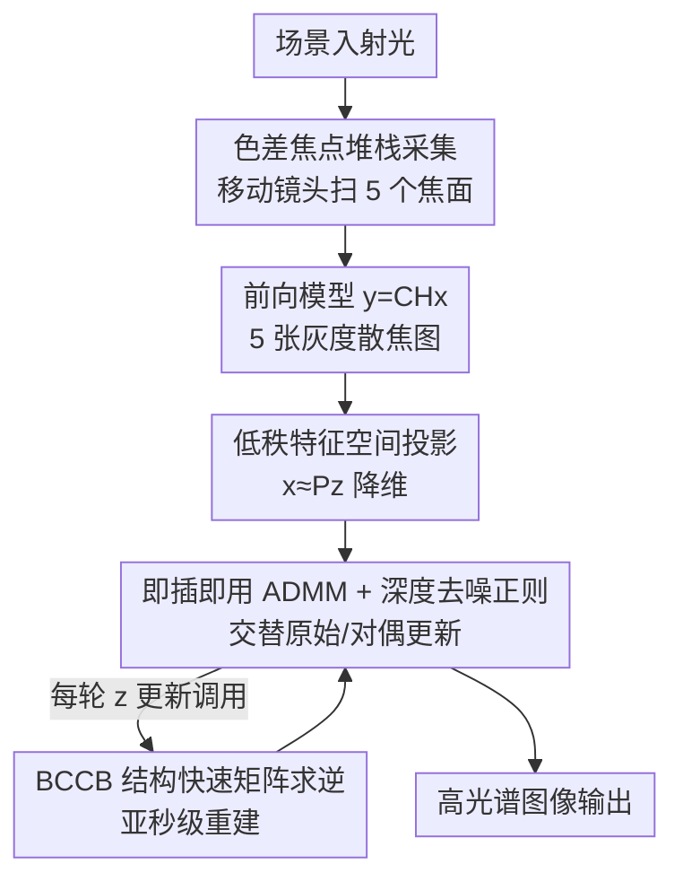

# Spectrum from Defocus: Fast Spectral Imaging with Chromatic Focal Stack

**会议**: CVPR 2026  
**论文**: [CVF Open Access](https://openaccess.thecvf.com/content/CVPR2026/html/Aydin_Spectrum_from_Defocus_Fast_Spectral_Imaging_with_Chromatic_Focal_Stack_CVPR_2026_paper.html)  
**代码**: https://nubivlab.github.io/spectrum_from_defocus  
**领域**: 计算成像 / 图像重建  
**关键词**: 高光谱成像、色差、焦点堆栈、即插即用 ADMM、压缩感知

## 一句话总结
用两片现成镜头加一个灰度传感器，靠镜头**色差**让不同波长在不同焦面对焦，拍 5 张散焦灰度图组成"色差焦点堆栈"，再用一个物理驱动的快速迭代算法在 1 秒内重建出高光谱图像，质量达到 SOTA（PSNR 30.81 dB），却只用了 4 个光学元件、几乎不损失入射光。

## 研究背景与动机

**领域现状**：高光谱成像（HSI）把传统 RGB 三通道扩展到几十个窄波段，能捕捉材质间的细微光谱差异，在遥感、医疗诊断、食品质检、工业检测里都很关键。为了在快照式或短曝光下拿到光谱立方体，主流走压缩感知路线：用编码孔径、色散棱镜、衍射光学元件（DOE）等把光谱信息编码进空间测量，再用计算重建还原。

**现有痛点**：这条路有三个绕不开的代价。其一是**光子效率低**——光谱滤片、色散元件、编码孔径本质都在"挡光 / 分光"，每个通道分到的光子本就少，再被光学元件削一刀，低光或动态场景下信噪比极差；编码快照孔径成像（CASSI）这类系统往往体积大、机械敏感，装不进紧凑平台。其二是**计算重，速度慢**——经典优化求解器要做大矩阵运算或迭代，动辄 15 分钟以上；想提速换成逆滤波又会牺牲重建质量。其三是**幻觉**——纯数据驱动的学习方法虽快，但会"脑补"出并不存在的光谱内容，在材质分析、食品检测这类对光谱精度敏感的任务里不可靠。

**核心矛盾**：高光谱成像天生要在**空间分辨率、光谱分辨率、时间分辨率**三者之间，且都受困于"低光子"这个底层约束做权衡。要么光学简单但算得久（如 KRISM 把算力压进硬件），要么算得快但光学复杂、损光严重。光效率、光学简洁、计算速度、物理可解释性，很难同时拿到。

**切入角度**：作者注意到普通折射镜头本身就有**纵向色差**——不同波长的焦点天然落在光轴上不同位置。与其花钱定制 DOE 或超表面去人工编码光谱，不如把这个"缺陷"当成免费的波长编码器：移动镜头扫过一串焦面，每个焦面让某一个波长清晰、其它波长按偏离程度逐渐模糊，光谱信息就被自然地编进了一组散焦图里，而且**全程不挡光**。

**核心 idea**：用现成镜头的色差当波长编码，拍一组散焦灰度焦点堆栈（光子几乎无损），配一个物理驱动、带深度去噪正则的快速迭代算法重建高光谱——把"光效率 + 光学简洁 + 速度 + 可解释 + 抗幻觉"一次性拿下。

## 方法详解

### 整体框架

SfD 要解决的核心问题：给定一组散焦的灰度焦点堆栈 $\mathbf{Y} \in \mathbb{R}^{HW \times N}$（$N=5$ 张），重建出高光谱图像 $\mathbf{X} \in \mathbb{R}^{HW \times C}$（$C=29$ 个波段）。整体分两步走——**光学采集**端用移动镜头扫焦把光谱编进散焦模式，**算法重建**端用物理前向模型加迭代优化把光谱解出来。

采集端：物镜和传感器固定，第二片镜头沿光轴平移到 $z_1,\dots,z_5$ 五个位置，每个位置 $z_i$ 标定为让某个波长 $\lambda_i$ 对焦，于是拍到的图 $I_i$ 在 $\lambda_i$ 处结构清晰、其它波长越偏越糊。五张图合成色差焦点堆栈。前向成像模型写成线性形式：

$$\mathbf{y} = \mathbf{C}\mathbf{H}\mathbf{x}$$

其中 $\mathbf{x}=\text{vec}(\mathbf{X})$、$\mathbf{y}=\text{vec}(\mathbf{Y})$，$\mathbf{H}$ 是由各波长各焦面点扩散函数（PSF）$K(z_i,\lambda_j)$ 生成的分块 2D 卷积矩阵，$\mathbf{C}$ 是裁剪卷积边缘的二值矩阵。PSF 在标定阶段用窄带可调滤片逐波段实测得到，部署时灰度传感器只测各波长加权求和的总光强。

重建端：在前向模型基础上求逆，但直接解病态又巨大。作者把求逆问题搬进**低秩特征空间**，再用**即插即用 ADMM** 交替做"物理求逆 + 深度去噪"，其中关键的大矩阵求逆靠 **BCCB 结构**做到亚秒级。下图给出整条管线：

### 关键设计

**1. 色差焦点堆栈采集：把镜头"缺陷"变成免费的波长编码器**

传统压缩光谱系统要么挡光、要么靠定制光学元件，光子损失大、硬件复杂。SfD 直接利用普通折射镜头的纵向色差——不同波长焦点天然分布在不同轴向位置。作者选了两片现成 50 mm 镜头，使纵向色差成为系统主导像差，在可见光范围内有约 0.7 mm 的轴向色焦移、34 cm（2.64–2.98 m）的景深。移动镜头到五个位置，每个 $z_i$ 标定为对焦某个波长 $\lambda_i$，从而 $I_i$ 在该波长清晰、其余波长随偏离量逐步模糊。这套光学**全程不挡光**，几乎保留所有入射光子，因此在低曝光、暗场景下信噪比远好于滤片式或色散式系统。一个直接结论是：哪里色焦移强，光谱分离就好、重建就准——实测中长波段色焦移变平，红/黑通道精度也随之下降，正好印证了这条工作原理。

**2. 低秩特征空间投影：用自然光谱的低维统计稳住病态求逆**

直接在 $C=29$ 维光谱上求逆既病态又昂贵。作者利用一个先验：自然可见光谱主要落在一个低维子空间里，于是把重建变量投影到 $v$ 维特征空间，$\mathbf{x} \approx \mathbf{P}\mathbf{z}$，其中 $\mathbf{P}=\mathbf{B}^T \otimes \mathbf{I}_{HW}$，$\mathbf{B}$ 的行是从 Harvard 数据集上算出的光谱特征向量（PCA 基），$\otimes$ 为 Kronecker 积。优化目标因此改写在特征空间里求解：

$$\min_{\mathbf{z}} \frac{1}{2}\|\mathbf{y}-\mathbf{C}\mathbf{H}\mathbf{P}\mathbf{z}\|_2^2 + \Phi_{\boldsymbol{\theta}}(\mathbf{P}\mathbf{z})$$

降维既压低了未知量规模、加速计算，又把解约束在"像自然光谱"的子空间内、抑制噪声放大。代价是光谱被低秩表示后会略微过平滑（论文承认重建光谱有轻度 oversmooth）。

**3. 即插即用 ADMM + 深度去噪正则：用物理求逆抗幻觉，用现成去噪器补质量**

为兼顾物理可解释与重建质量，作者把目标拆成可分变量、引入松弛变量 $\mathbf{v},\mathbf{u}$（并令 $\hat{\mathbf{H}}:=\mathbf{H}\mathbf{P}$）做 plug-and-play ADMM，交替更新原始变量 $(\mathbf{v},\mathbf{z},\mathbf{u})$ 与对偶变量 $(\boldsymbol{\xi},\boldsymbol{\eta})$。其中 $\mathbf{v}$ 是从真实测量 $\mathbf{y}$ 与当前估计推出的伪测量；$\mathbf{z}$ 用一个类 Wiener 滤波 $(\mu_1\hat{\mathbf{H}}^T\hat{\mathbf{H}}+\mu_2\mathbf{I})^{-1}$ 估出；$\mathbf{u}$ 这一步先把 $\mathbf{z}$ 转回图像域，套一个**现成的深度去噪网络** $\phi_{\boldsymbol{\theta}}$ 压噪声，再投影回特征空间，即 $\mathbf{u}\leftarrow \mathbf{P}^T\phi_{\boldsymbol{\theta}}(\mathbf{P}(\mathbf{z}+\boldsymbol{\eta}))$。关键在于：去噪器只当**正则项**用、主体仍是物理前向求逆，所以相比纯数据驱动方法（如 MST）大幅缓解了"脑补光谱"的幻觉问题；论文也给了对比，证明这个深度去噪器优于传统 $\ell_1$ 正则。步长低于阈值或回升时判定收敛。

**4. BCCB 结构快速矩阵求逆：把分钟级迭代压到亚秒级**

ADMM 里更新 $\mathbf{z}$ 需要对一个巨大的非对角矩阵求逆，直接算不现实。作者发现 $\mathbf{H}$ 的子矩阵具有 **BCCB（块循环且块内循环，Block Circulant with Circulant Blocks）** 结构——这是卷积算子在傅里叶域可对角化的代数体现。利用这一点推导出快速求逆公式，把空间域与频率域计算分离，使每轮迭代的大矩阵求逆退化为频域逐点除法。正是这一步让完整算法跑出亚秒级重建（0.64 s），在保持物理可解释的同时把经典迭代求解器常见的"分钟级"成本砍掉。

## 实验关键数据

### 主实验

仿真在 Harvard / KAIST / CAVE 三个公开高光谱数据集上进行（Table 1 基于 Harvard 30 张图、5 秒总曝光、明亮条件），所有方法按**相同总曝光时间和总光子预算**对齐，含泊松噪声、计入各光学元件透光率；计时基于 NVIDIA RTX A6000。光学元件数统计镜头、孔径、棱镜、致动器、SLM、传感器。

| 方法 | 类别 | PSNR↑ | SSIM↑ | SAM(°)↓ | 计算时间 | 光学元件数 |
|------|------|-------|-------|---------|---------|-----------|
| Tunable Filter | 光谱滤片 | 4.78 | 0.08 | 70.10 | 0 | 3 |
| S.DiffuserCam | 光谱滤片 | 15.59 | 0.46 | 34.98 | >15 min | 3 |
| S.DefocusCam | 光谱滤片 | 21.17 | 0.61 | 25.11 | 39 s | 4 |
| Choi et al. | 色散元件 | 23.97 | 0.68 | 14.85 | >15 min | 9 |
| MST（纯数据驱动） | 色散元件 | 30.62 | 0.92 | 9.33 | 1.19 s | 9 |
| KRISM | 色散元件 | 29.40 | 0.91 | **6.91** | 0 | 20 |
| 2in1 Cameras | DOE | 29.11 | 0.87 | 8.72 | 1.74 s | 4 |
| Zhan et al. | 色差 | 14.11 | 0.07 | 23.95 | 0.24 s | 5 |
| **SfD（本文）** | 色差 | **30.81** | **0.92** | 7.35 | 0.64 s | 4 |

SfD 在 9 个方法里拿到**最佳 PSNR（30.81）和最佳 SSIM（0.92）、第二好的 SAM（7.35°）**，仅次于 KRISM——但 KRISM 用了 20 个光学元件做逐场景 SVD，硬件复杂度高出一个量级。SfD 只用 4 个光学元件、0.64 s，就压过了用最多 20 个元件的系统。同为色差路线的 Zhan et al. 虽光效率高、速度快（0.24 s），但用朴素逆滤波，轻微噪声下就崩（PSNR 仅 14.11、SSIM 0.07），凸显出鲁棒重建算法的价值。

### 真实原型与鲁棒性

原型用灰度传感器 + 两片 50 mm 现成镜头（聚焦镜装在线性平移台上），标定时用钨卤灯 + 100 µm 针孔 + 液晶可调滤片（LCTF），覆盖 440–720 nm、10 nm 步进共 29 个波段，逐波段实测 PSF 灌进前向模型 $\mathbf{H}$。

| 评测 | PSNR(dB)↑ | SAM(°)↓ | 说明 |
|------|-----------|---------|------|
| 仿真（Harvard, Tab.1） | 30.81 | 7.35 | 自然纹理场景 |
| 真实 Macbeth 色卡 | 29.54 | 7.42 | 色卡缺自然纹理，长波段误差偏高 |

真实数据与仿真高度一致，验证了方法的可迁移性。鲁棒性上：增加测量帧数可稳定重建，且 RGB 重建比光谱重建更早饱和（因维度更低）；在预测工作范围 264–298 cm 内质量高，超出后才缓慢下降——色差低频伪影直到物体逼近 2.35 m（比理论范围外推约 29 cm）才出现，说明实际容差比理论更宽。

### 关键发现
- **光子效率是性能根源**：滤片式方法 SAM 显著更差，主因就是光效率低导致噪声大或高频丢失；曝光越短，SfD 的优势越夸张（低曝光下纯数据驱动的 MST 会严重幻觉，黄/红辣椒被脑补出假光谱）。
- **物理 + 数据混合抗幻觉**：SfD 以物理前向求逆为主、深度去噪只作正则，因此低光下仍"少幻觉"，而纯数据驱动方法在 photon-starved 设定崩得最厉害。
- **色焦移强度决定光谱可分性**：长波段色焦移变平，红/黑通道精度随之下降，这是 SfD 工作原理的直接体现，也是其主要失效来源。
- **失效案例**：风车靶标 700 nm 通道难以恢复全分辨率/对比度——被邻近白像素散焦光提亮的真黑区，难与灰区区分；可用更高动态范围传感器、更多测量帧或加 TV 先验缓解。

## 亮点与洞察
- **把像差当资源而非缺陷**：纵向色差通常是要被矫正掉的成像缺陷，作者反过来当成免费的、无损光的波长编码器，省掉了定制 DOE/超表面，这个视角的反转是全文最"啊哈"的地方。
- **"全程不挡光"是性能护城河**：不靠滤片/编码孔径分光，几乎保留全部光子，使得低曝光、暗场景成为优势区而非软肋——这正是高光谱成像最痛的低信噪场景。
- **低秩 + BCCB 双加速可迁移**：把光谱投到 PCA 低维子空间稳住病态求逆，再用卷积矩阵的 BCCB 频域可对角化把大矩阵求逆变成逐点除法——这套"先降维再频域快速求逆"的组合可迁移到其它基于卷积前向模型的压缩感知重建。
- **物理主体 + 深度去噪正则的折中**：既不像纯优化那样慢、也不像纯网络那样爱幻觉，PnP-ADMM 的这种"物理算骨架、网络补皮肤"分工很有借鉴价值。

## 局限与展望
- **工作范围窄**：假设场景落在 34 cm 景深和近轴小视场内（实测有一定外推容差，但仍是限制）；扩大工作体积需要光学与算法联合设计。
- **红/黑色精度偏低**：长波段色焦移变平、系统动态范围有限，黑区易因传感器饱和与邻域亮像素光泄漏被误染成灰或假色；可换更色散的玻璃或更高动态范围传感器改善。
- **多帧依赖**：因重建要建模所有波长入射光子，即便只想要 RGB 也得拍满 5 帧才能高质量出图，对动态场景不友好；引入连拍摄影（burst photography）工具与更多数据驱动成分是重要方向。
- **低光优势尚未充分挖掘**：低曝光下已显现显著优势，但要坐实需要更高保真的低光噪声模型。

## 相关工作与启发
- **vs CASSI（Choi et al. / MST）**：CASSI 用编码孔径 + 色散棱镜把光谱编进空间，系统大、机械敏感、损光多；MST 靠光谱自注意力虽 PSNR 高但纯数据驱动、低光幻觉严重。SfD 只用 2 片现成镜头靠色差扫焦编码，硬件简单且不挡光，低光更稳。
- **vs Spectral DefocusCam**：两者都用散焦编码信息，但 DefocusCam 用消色差镜头 + 分箱超像素、把模糊用于空间超分；SfD 用灰度传感器、专门靠**色差**引起的空间变模糊来编码光谱，路线相反。
- **vs KRISM**：KRISM 用复杂光学（20 元件）直接测光谱奇异值、把算力压进硬件，逐场景 SVD 拿到最佳 SAM 但会引入场景特定的光谱偏置（过/欠饱和）。SfD 用极简光学 + 轻量物理算法在两个极端间取平衡。
- **vs Zhan et al.（同为色差路线）**：都用色差焦点堆栈、光效率高，但 Zhan 用朴素逆滤波，轻噪声即不稳；SfD 的鲁棒迭代算法在显著噪声下仍能高保真重建。
- **vs 2in1 Cameras（DOE）**：都依赖光谱编码的 PSF，但 2in1 靠双像素 + DOE，RGB 滤片损光、数据驱动模型引入雾化/欠饱和；SfD 用普通折射镜头天然色差实现 PSF 编码，免去定制光学。

## 评分
- 新颖性: ⭐⭐⭐⭐⭐ 把"色差缺陷"反转成免费无损的波长编码器，光学极简却达 SOTA，视角新颖。
- 实验充分度: ⭐⭐⭐⭐ 三数据集仿真 + 真实原型一致性验证 + 鲁棒性分析齐全，消融多放在补充材料。
- 写作质量: ⭐⭐⭐⭐⭐ 动机、前向模型、算法推导层层递进，物理直觉与公式衔接清晰。
- 价值: ⭐⭐⭐⭐⭐ 紧凑、低成本、快速、抗幻觉、可解释的高光谱方案，落地潜力大。

<!-- RELATED:START -->

## 相关论文

- [\[CVPR 2026\] NeAR: Coupled Neural Asset–Renderer Stack](near_coupled_neural_asset-renderer_stack.md)
- [\[CVPR 2026\] Kaleidoscopic Scintillation Event Imaging](kaleidoscopic_scintillation_event_imaging.md)
- [\[CVPR 2026\] SpiderCam: Low-Power Snapshot Depth from Differential Defocus](spidercam_low-power_snapshot_depth_from_differential_defocus.md)
- [\[CVPR 2026\] DynamicTree: Interactive Real Tree Animation via Sparse Voxel Spectrum](dynamictree_interactive_real_tree_animation_via_sparse_voxel_spectrum.md)
- [\[CVPR 2026\] Generalizable Radio-Frequency Radiance Fields for Spatial Spectrum Synthesis](generalizable_radio-frequency_radiance_fields_for_spatial_spectrum_synthesis.md)

<!-- RELATED:END -->
