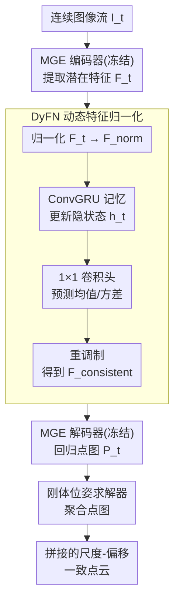

# Stabilizing Streaming Video Geometry via Dynamic Feature Normalization

**会议**: CVPR 2026  
**论文**: [CVF Open Access](https://openaccess.thecvf.com/content/CVPR2026/html/Lyu_Stabilizing_Streaming_Video_Geometry_via_Dynamic_Feature_Normalization_CVPR_2026_paper.html)  
**代码**: https://shawlyu.github.io/DyFN (项目页)  
**领域**: 3D视觉 / 在线几何重建  
**关键词**: 流式视频深度, 单目几何估计, 尺度-偏移漂移, 特征归一化, 参数高效微调

## 一句话总结
作者发现单目几何基础模型（如 MoGe）在视频流上抖动的根因不是几何错误、而是逐帧"尺度-偏移"漂移，而这种漂移又由潜在特征的均值/方差波动直接决定；于是提出一个只占 2% 参数、冻结主干只训它的轻量循环模块 **DyFN（Dynamic Feature Normalization）**，用 ConvGRU 记忆动态预测并替换特征统计量，在四个基准上取得 SOTA 时序稳定性，同时完全不损失单帧精度。

## 研究背景与动机

**领域现状**：单目几何估计（Monocular Geometry Estimation, MGE）和单目深度估计（MDE）随着大规模基础模型（MiDaS、Depth Anything、MoGe 等）的出现进展飞快，单张图的精度和零样本泛化都很强。但这些模型几乎都是为"单图推理"设计的，而机器人、自动驾驶、AR 等真实场景里，输入天然是连续的视频流。

**现有痛点**：把单图 MGE 模型逐帧套到视频流上，会出现严重的时序不一致——几何预测在帧间剧烈波动，重建出来的场景出现分层断裂（layering breaks）和位置抖动（positional jitter）。已有的缓解办法（时序注意力、循环记忆模块）有两个硬伤：① 通常要在大规模标注视频上做**全网络微调**，算力和数据成本高；② 全网络微调常常会让骨干过拟合到特定视频域，**反而损害**预训练模型本来很强的单帧精度和零样本泛化。

**核心矛盾**：想要"时序一致"和想要"保住单帧精度/泛化"之间被现有做法摆成了一个 trade-off——你越是为视频去重训骨干，越是把基础模型原本的好东西训坏。

**切入角度与关键观察**：作者做了一个关键的实证分析（见下）。他们发现，预训练 MGE 模型其实**已经**编码了足够强的几何结构：当对每帧单独用一对仿射参数（scale + shift）对齐到真值时，重建几何高度准确（$\delta_1$ 达 99.8）；但若整段序列共用一对 scale/shift，精度暴跌到 62.5。这说明时序不一致**不是几何退化，而是逐帧的尺度-偏移漂移**。进一步地，作者发现这种 scale/shift 的漂移又与编码器输出潜在特征的**通道均值与方差**强耦合，却与相对几何精度基本解耦。

**核心 idea**：既然根因是特征统计量的波动，那就不要去重训整个网络，而是**直接在线调控潜在特征的均值和方差**，让 scale/shift 跨帧保持稳定——这就是 Dynamic Feature Normalization。

## 方法详解

### 整体框架

DyFN 把一个"单图几何估计器"改造成"流式视频几何估计器"，整条在线推理管线是：连续图像流 $I_t$ 逐帧进入**冻结**的 MGE 编码器 $E$ 得到潜在特征 $F_t = E(I_t)$；$F_t$ 进入 **DyFN 模块**——先做实例归一化得到 $F_t^{norm}$，再喂进一个 ConvGRU 维护跨帧隐状态 $h_t$（聚合所有历史帧的上下文），由两个 $1\times1$ 卷积头预测出"时序感知"的均值 $\hat{\mu}_t$ 和标准差 $\hat{\sigma}_t$，用它们替换掉原来每帧各自漂移的统计量、重新调制出一致特征 $F_t^{consistent}$；该特征再送进**冻结**的 MGE 解码器 $D$ 回归点图 $P_t$；最后一个基于对应关系的刚体位姿求解器（估计旋转+平移）把各帧点图聚合成连贯的 3D 重建。

整个改造只训练 DyFN（约占总参数 2%），编码器和解码器全程冻结，因此既"借"到了基础模型的单帧几何先验，又"加"上了序列级稳定性。

### 关键设计

**1. DyFN 动态特征归一化：用循环记忆在线预测均值/方差，替换掉逐帧漂移的统计量**

这是全文的核心。痛点在于：MGE 编码器对每帧独立编码，潜在特征的通道统计量（均值、方差）会随帧波动，而这两个量直接决定了预测深度的全局 scale 和 shift，于是表现为重建的非刚性扭曲与漂移。DyFN 的做法是把"特征统计量"从"每帧各自算"改成"由历史上下文动态预测"。具体分四步：首先对当前特征 $F_t$ 做通道级归一化，$F_t^{norm} = \frac{F_t - \mu_{F_t}}{\sigma_{F_t} + \epsilon}$，把每帧自带的不稳定统计量先剥掉；然后用一个 ConvGRU 维护隐状态，$h_t = \mathrm{ConvGRU}(F_t, h_{t-1})$（首帧 $h_0$ 置零），让它把过去所有帧的观测压缩进 $h_t$；接着两个 $1\times1$ 卷积头从 $h_t$ 预测出时序感知的统计量 $\hat{\sigma}_t = \mathrm{Conv}^{\sigma}_{1\times1}(h_t)$、$\hat{\mu}_t = \mathrm{Conv}^{\mu}_{1\times1}(h_t)$；最后把它们重新打回归一化特征，$F_t^{consistent} = \hat{\sigma}_t \cdot F_t^{norm} + \hat{\mu}_t$，作为一致特征送进解码器。

它有效的原因正是第 3 节实证支撑的：scale/shift 与特征均值/方差强耦合、却与几何形状解耦——所以"只调统计量"既能拉住尺度漂移、又不会破坏几何细节。用 ConvGRU 而不是普通 GRU，是因为均值/方差是有空间结构的统计量，卷积循环单元能更好地捕捉"空间结构化的时序统计"。这是一个**因果（causal）循环**模块，只看历史不看未来，因此天然适合在线流式、可处理任意长度序列。

**2. 冻结骨干、只训 2% 参数的稳定器：把"时序一致"和"单帧精度"从 trade-off 变成两全**

痛点是已有视频方法全网络微调会把基础模型训坏。作者据此采用极致的参数高效微调：编码器 $E$ 和解码器 $D$ 的权重全部冻结，只训练 DyFN，而 DyFN 仅占总参数约 2%。这样做的直接好处在 Table 2 体现得很干净——因为骨干没动，模型的单帧深度精度与基模型 MoGe v1 **逐数据集完全一致**；相比之下 FlashDepth（基于 Depth Anything v2 微调）在 KITTI 上 $\delta_1$ 从基模型的 95.3 掉到 92.6。换句话说，DyFN 是在基础模型"之上"加了一层时序调控，而不是去"改写"基础模型本身，从而绕开了"为视频牺牲单帧"的老 trade-off。

**3. 全局对齐损失 + 跨帧时序损失：显式监督尺度-偏移在整段序列上保持一致**

只有结构还不够，得有损失把"序列级稳定"教进去。除了沿用骨干自带的基础损失 $\mathcal{L}_{MoGe}$，作者加了两项。第一项是**全局对齐损失** $\mathcal{L}_{align}$：对长度为 $L$ 的一段预测点图 $\{\hat{P}_j\}_{j=1}^{L}$，只解出**一对**全局仿射参数 $(s_g, t_g)$ 同时对齐所有帧的所有点到真值，再用这一对统一参数度量误差，$\mathcal{L}_{align} = \sum_{j=1}^{L}\sum_{i\in M}\frac{1}{z_i}\lVert s_g\hat{p}^i_j + t_g - p^i_j\rVert_1$。任何一帧只要偏离"序列共用的最优 scale/shift"就被惩罚，从而逼着特征表示产出本身就时序稳定的输出。第二项是**跨帧时序损失** $\mathcal{L}_{temp}$，针对长程漂移：要求预测的帧间变化幅度匹配真值的变化幅度，并在多个窗口 $k\in\{1,2,4\}$ 上计算以兼顾短/长程动态，$\mathcal{L}_{temp} = \sum_{k\in K}\sum_{j=1}^{L-k}\sum_{i\in M}\frac{1}{z_i}\lVert s_g\hat{\delta}^i_{j,k} - \delta^i_{j,k}\rVert_1$，其中 $\hat{\delta}^i_{j,k}$、$\delta^i_{j,k}$ 分别是预测/真值在 $k$ 帧间隔上的点位移幅度，乘上全局 scale $s_g$ 是为了把预测位移搬到与真值同一度量空间再比。最终目标为 $\mathcal{L}_{final} = \mathcal{L}_{MoGe} + \alpha\mathcal{L}_{align} + \beta\mathcal{L}_{temp}$，取 $\alpha=1$、$\beta=0.1$。消融显示去掉 $\mathcal{L}_{align}$ 会让精度甚至跌破基线，说明全局对齐监督是这套损失里的命脉。

### 损失函数 / 训练策略

只微调 DyFN 模块，编码器/解码器冻结。训练语料是约 100 万帧的大规模混合数据；默认采样固定长度的连续 12 帧片段。损失即上面的 $\mathcal{L}_{final}$（$\alpha=1$、$\beta=0.1$）。值得注意：$\mathcal{L}_{align}$ 里全局仿射的解法选择很关键——作者比较了"首帧对齐"（基于第一帧预测与真值解 $s_g,t_g$）与"全序列对齐"（用整段序列解），最终采用**首帧对齐**，因为整段序列对齐会因早期预测不稳而把优化复杂化、还显著增加训练开销。

## 实验关键数据

### 主实验

在 Sintel(50帧)/ScanNet(90帧)/KITTI(110帧)/Bonn(110帧) 四个基准上做视频深度评测（AbsRel↓、$\delta_1$=$\delta<1.25$↑），统一用"整段序列一对 scale/shift"的严格视频协议。DyFN 在所有数据集所有指标上都拿到 SOTA：

| 方法 | 类别 | Sintel AbsRel↓ | Sintel δ1↑ | ScanNet AbsRel↓ | ScanNet δ1↑ | KITTI AbsRel↓ | KITTI δ1↑ | Bonn AbsRel↓ | Bonn δ1↑ |
|------|------|------|------|------|------|------|------|------|------|
| MoGe v1 | 相对深度 | 0.216 | 65.3 | 0.117 | 84.7 | 0.076 | 96.0 | 0.074 | 95.5 |
| VGGT | 多帧几何 | 0.287 | 66.1 | 0.031* | 98.5* | 0.070 | 96.5 | 0.055 | 97.1 |
| DepthCrafter | 视频深度 | 0.270 | 69.7 | 0.123 | 85.6 | 0.104 | 89.6 | 0.071 | 97.2 |
| VDA | 视频深度 | 0.300 | 63.3 | 0.075 | 95.4 | 0.079 | 95.0 | 0.051 | 98.1 |
| FlashDepth | 流式深度 | 0.265 | 64.2 | 0.101 | 90.3 | 0.103 | 89.5 | 0.053 | 98.0 |
| **Ours (DyFN)** | 流式深度 | **0.180** | **73.0** | **0.073** | **96.6** | **0.062** | **97.3** | **0.044** | **98.4** |

> *VGGT 在 ScanNet 上的 0.031/98.5 是因为它在该数据集上训练过（原文灰字标注），不代表泛化能力；在动态场景 Sintel 上 VGGT 仅 0.287，远逊于 DyFN 的 0.180。

几个对比要点：① 相比同为流式的 FlashDepth，ScanNet $\delta_1$ 从 90.3 提到 96.6；② 相比基模型 MoGe v1，ScanNet $\delta_1$ 84.7→96.6（原文称约 +11.9%）；③ 即便对手是用了双向注意力的离线视频方法（DepthCrafter、VDA），DyFN 这个只看历史的因果流式模型也更好。摘要里"较已有流式方法最高提升 14%"即来自这类对比。

### 单帧精度（验证"不掉点"）

| 方法 | Sintel AbsRel↓/δ1↑ | ScanNet | KITTI | Bonn |
|------|------|------|------|------|
| MoGe v1（基模型） | 0.124 / 83.7 | 0.027 / 98.6 | 0.044 / 98.0 | 0.028 / 98.8 |
| FlashDepth | 0.174 / 75.6 | 0.056 / 96.3 | 0.085 / 92.6 | 0.043 / 98.7 |
| **Ours (DyFN)** | **0.124 / 83.7** | **0.027 / 98.6** | **0.044 / 98.0** | **0.028 / 98.8** |

DyFN 的单帧成绩与 MoGe v1 **逐项完全相同**——因为骨干被冻结，单帧能力被原样继承；而 FlashDepth 这类全网络微调方法在 KITTI 上单帧 $\delta_1$ 从基模型 95.3 掉到 92.6，正是 DyFN 想规避的"为视频牺牲单帧"。

### 消融实验

| 配置 | Sintel AbsRel↓/δ1↑ | ScanNet AbsRel↓/δ1↑ | 说明 |
|------|------|------|------|
| MoGe（基线） | 0.216 / 65.3 | 0.117 / 84.7 | 无时序调控 |
| **Ours†（完整）** | **0.180 / 73.0** | **0.073 / 96.6** | DyFN + 双损失 + 首帧对齐 |
| w/o $\mathcal{L}_{align}$ | 0.245 / 61.8 | 0.124 / 83.1 | 去全局对齐损失，甚至**跌破基线** |
| w/o $\mathcal{L}_{temp}$ | 0.183 / 72.7 | 0.069 / 96.4 | 去时序损失，仅小幅退化 |
| DyFN (GRU) | 0.187 / 72.5 | 0.078 / 94.9 | 普通 GRU 替换 ConvGRU |
| $\mathcal{L}_{align}$‡（全序列对齐） | 0.189 / 72.1 | 0.066 / 96.4 | 全序列对齐劣于首帧对齐 |

### 关键发现
- **$\mathcal{L}_{align}$ 是命脉**：去掉它精度甚至比 MoGe 基线还差（Sintel 0.245 vs 0.216），说明若没有全局对齐监督，DyFN 学不到正确的统一尺度，反而把相对深度也带偏。
- **$\mathcal{L}_{temp}$ 是锦上添花**：去掉它只小幅退化，主要作用是抑制长程漂移、细化时序一致性。
- **ConvGRU > GRU**：卷积循环单元能更好捕捉"空间结构化的时序统计"（稳定的均值/方差场），普通 GRU 在 ScanNet $\delta_1$ 上从 96.6 掉到 94.9。
- **首帧对齐 > 全序列对齐**：用整段序列解全局仿射会因早期预测不稳而使优化变难、训练开销大增，故最终采用首帧对齐。
- **长序列鲁棒**：在 ScanNet 100 个场景 × 500 帧、每 100 帧重算一次序列级对齐的设定下，DyFN 的 AbsRel/$\delta_1$ 衰减速度明显慢于 FlashDepth 与 VDA，到 500 帧仍明显领先，验证了对尺度漂移的长程抑制能力。

## 亮点与洞察
- **把问题"诊断"清楚再开药**：先用对照实验把"时序抖动"拆成"几何是好的、只是 scale/shift 在漂"（per-frame 对齐 99.8 vs sequential 对齐 62.5），再进一步定位到"scale/shift 由特征均值/方差决定"。这条因果链让方法不必动骨干、只调统计量，思路非常干净，是全文最"啊哈"的地方。
- **2% 参数撬动 SOTA**：冻结主干、只训一个轻量循环归一化器，既省算力又天然保住单帧精度与零样本泛化，把"时序一致 vs 单帧精度"的老 trade-off 直接消解。
- **统计量调制是可迁移的视角**："scale/shift 与特征统计量耦合、与几何解耦"这一观察可迁移到其他需要跨帧/跨域稳定的稠密回归任务（如法向、光流、表面重建），思路是去调控特征分布而非重训模型。
- **因果流式**：ConvGRU 只用历史、可处理任意长序列、低延迟，比窗口式双向注意力更贴合自动驾驶/具身这类真实在线场景。

## 局限与展望
- **依赖刚体位姿求解器拼接**：最终全局重建用的是 correspondence-based 刚体位姿求解（估 R、t），细节放在补充材料，对强动态/非刚体场景的拼接鲁棒性正文未充分展开。
- **统计量调制的能力上界**：DyFN 只调全局均值/方差来纠正 scale/shift，若帧间出现的是局部几何错误（而非全局尺度漂移），该机制原理上无能为力——方法的有效性建立在"几何对、只是尺度飘"这个前提上。
- **训练用 12 帧短片段**：训练时采样固定 12 帧片段，长序列能力靠 ConvGRU 的递归外推，超长序列（>500 帧）行为正文未给出。
- **$\mathcal{L}_{MoGe}$ 细节与训练数据构成**放在补充材料，正文披露有限，复现需参考附录。⚠️ 部分公式符号（如 $\delta$ 与位移幅度记号）以原文为准。

## 相关工作与启发
- **vs 视频深度方法（DepthCrafter / VideoDepthAnything）**：它们靠双向时序注意力 + 固定长度 clip 重叠推理来强制时序一致，但延迟高、显存冗余、且为视频域微调骨干会损单帧；DyFN 是因果流式、不动骨干，反而在多数指标上反超这些更重的离线方法。
- **vs 流式深度方法（FlashDepth）**：同样维护循环隐状态做在线推理，但 FlashDepth 全网络微调，单帧精度有损（KITTI 95.3→92.6）；DyFN 冻结骨干、只调特征统计量，单帧与基模型完全一致且时序更稳。
- **vs 多帧几何方法（VGGT / MonST3R / CUT3R / TTT3R）**：这类方法直接回归稠密点图、靠多视图重叠与几何约束，计算开销大、依赖静态场景假设，在纯单目或强动态场景里易失效；DyFN 走的是"单目基础模型 + 轻量时序稳定器"的另一条路。
- **vs 度量深度方法（Metric3D / UniDepth / MoGe v2）**：它们试图直接预测绝对尺度来消歧，但仍逐帧处理、缺显式时序融合，跨数据集表现不稳（MoGe v2 在 KITTI AbsRel 0.183 vs DyFN 0.062）。

## 评分
- 新颖性: ⭐⭐⭐⭐⭐ 把"时序抖动"重新归因到"特征统计量→scale/shift 漂移"，并据此只调统计量、不动骨干，视角新且解释力强。
- 实验充分度: ⭐⭐⭐⭐ 四基准 × 六类方法对比 + 单帧/消融/500 帧长序列齐全；不足是位姿求解器与训练数据细节压在补充。
- 写作质量: ⭐⭐⭐⭐⭐ 先实证诊断再开方，因果链清晰，图表把"几何对、尺度飘"讲得很直观。
- 价值: ⭐⭐⭐⭐⭐ 给"把静态基础模型搬到在线视频流"提供了简单高效、即插即用且不掉单帧精度的范式，工程落地友好。

<!-- RELATED:START -->

## 相关论文

- [\[CVPR 2026\] Point4Cast: Streaming Dynamic Scene Reconstruction and Forecasting](point4cast_streaming_dynamic_scene_reconstruction_and_forecasting.md)
- [\[CVPR 2026\] LongStream: Long-Sequence Streaming Autoregressive Visual Geometry](longstream_long-sequence_streaming_autoregressive_visual_geometry.md)
- [\[CVPR 2026\] DetAny4D: Detect Anything 4D Temporally in a Streaming RGB Video](detany4d_detect_anything_4d_temporally_in_a_streaming_rgb_video.md)
- [\[CVPR 2026\] SLARM: Streaming and Language-Aligned Reconstruction Model for Dynamic Scenes](slarm_streaming_and_language-aligned_reconstruction_model_for_dynamic_scenes.md)
- [\[CVPR 2026\] V-DPM: 4D Video Reconstruction with Dynamic Point Maps](v-dpm_4d_video_reconstruction_with_dynamic_point_maps.md)

<!-- RELATED:END -->
