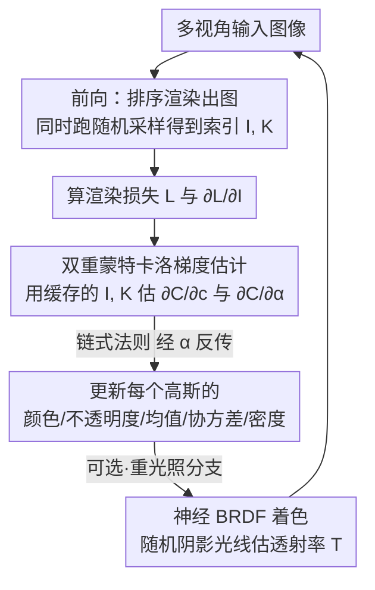

# Stochastic Ray Tracing for the Reconstruction of 3D Gaussian Splatting

**会议**: CVPR 2026  
**论文**: [CVF Open Access](https://openaccess.thecvf.com/content/CVPR2026/html/Xu_Stochastic_Ray_Tracing_for_the_Reconstruction_of_3D_Gaussian_Splatting_CVPR_2026_paper.html)  
**代码**: 待确认  
**领域**: 3D视觉  
**关键词**: 3D高斯泼溅, 光线追踪, 随机估计, 可微渲染, 重光照

## 一句话总结
把"光线追踪 3DGS 必须沿每条光线对所有相交高斯排序"这件昂贵的事，换成一个**无偏、无需排序的蒙特卡洛梯度估计器**，每条光线只采样极少数高斯就能反传梯度，从而在标准 3DGS 上追平光栅化的速度与质量、远超已有的排序式光线追踪，并把同一个估计器无缝扩展到带真实阴影光线的重光照 3DGS 重建。

## 研究背景与动机

**领域现状**：3DGS 用一堆各向异性的半透明高斯表示场景，主流走的是**光栅化（rasterization）**路线——把每个高斯投影（splat）到屏幕上做 alpha 混合，硬件加速下又快又好，已成新视角合成的标准做法。另一条路线是**光线追踪（ray tracing）**，直接把相机光线打进场景与高斯求交，它的好处是天然支持阴影、反射/折射、以及鱼眼等非针孔相机模型，绕开了光栅化的各种近似补丁。

**现有痛点**：光线追踪 3DGS（如 3DGRT）虽然功能更全，却有两个硬伤。其一是**慢**——为了正确做 alpha 混合，必须把每条光线上所有相交的高斯**按深度排序**，这一步随相交高斯数 $n$ 增大代价急剧上升。其二是**不彻底**——做重光照场景时，现有光线追踪方法在阴影上又退回到光栅化味的近似（shadow mapping、deferred shading）来估计遮挡，等于丢掉了光线追踪本该带来的那份"物理正确"的通用性。

**核心矛盾**：排序是为了精确计算"前面的高斯挡住后面多少"，但它正是性能瓶颈。Sun 等人此前提出过一个**无偏、无需排序**的随机渲染算法，能高效地**前向渲染** 3DGS，可惜它**不可微**，因此没法用来做场景重建；也没碰重光照。换句话说，"无需排序的前向"已经有了，缺的是"无需排序的反向梯度"。

**本文目标**：(1) 设计一个无偏、无需排序的随机算法，估计像素颜色对**所有**高斯参数的梯度，让可微光线追踪真正跑起来；(2) 把同一套随机机制扩展到重光照 3DGS，用真实阴影光线替换掉 shadow mapping。

**切入角度**：既然前向的随机混合能用"按混合权重概率采样一个高斯"来无偏估计像素颜色，那么**梯度**里出现的也是同一个 $\alpha_i\prod_{j\prec i}(1-\alpha_j)$ 乘积项，理应能用**同一套采样**把它消掉。沿着这个观察，作者把前向采样直接复用到反向，并对梯度里多出来的"后方高斯求和"项再做**第二次蒙特卡洛采样**。

**核心 idea**：用一个"采两个高斯（前景 $g_I$ + 它后面的 $g_K$）就够"的无偏蒙特卡洛估计器替代"排序后精确求和"，让反传也不必排序；这套估计器对重光照尤其划算——因为重光照下每个高斯的着色（追阴影光线）极贵，能"只算被采中的那个"就能省下海量计算。

## 方法详解

### 整体框架

输入是多视角图像，输出是重建好的 3DGS 场景（标准的或可重光照的）。方法不改 3DGS 的表示和优化器，只**替换反向求导模块**：把"排序后按公式精确求梯度"换成"采样几个高斯做无偏估计"。

回到前向公式。一条光线打中 $n$ 个高斯，像素颜色是 alpha 混合 $C=\sum_{i=1}^{n} c_i\,\alpha_i\prod_{j\prec i}(1-\alpha_j)$，其中 $j\prec i$ 表示深度比 $g_i$ 浅的高斯。**随机混合**的做法是：以概率 $p_I=\alpha_I\prod_{j\prec I}(1-\alpha_j)$ 抽一个索引 $I$，定义随机变量 $\langle C\rangle=\frac{1}{p_I}c_I\alpha_I\prod_{j\prec I}(1-\alpha_j)$，恰好约掉乘积项得到极简的 $\langle C\rangle=c_I$，且 $\mathbb{E}[\langle C\rangle]=C$ 无偏。这个采样可以**乱序**遍历光线上的高斯实现（维护一个"当前选中"，遇到更近且 $\xi<\alpha_i$ 的就替换），完全不需要排序。

本文要解决的是反向。整条重建管线是一个标准两遍流程：

注意一个工程巧思：当前向用**排序式**渲染时（如简单场景），反向所需的采样索引 $I,K$ 可以**几乎零成本**地顺手收集下来，省去单独再跑一遍随机采样。

### 关键设计

**1. 双重蒙特卡洛梯度估计：采"前景 + 它后面一个"两个高斯就无偏地估出全部梯度**

反传 3DGS 只需两类梯度——颜色梯度 $\partial C/\partial c_i$ 与不透明度梯度 $\partial C/\partial \alpha_i$，其余参数（$\mu_i,\Sigma_i,\sigma_i$）的梯度都能由它俩经 $\alpha_i$ 的链式法则推出。难点在于：随机混合里 $\alpha_i$ 控制着分支判断 $\xi<\alpha_i$，朴素自动微分会把这个分支当成固定值、**算不对** $\partial C/\partial\alpha_i$；而能正确穿过这种离散分支的编译器技术在 CUDA/OptiX 这类通用 GPU 框架里又难落地。

作者的解法是手写一个无偏估计器。对公式求导得到 $\frac{\partial C}{\partial c_i}=\alpha_i\prod_{j\prec i}(1-\alpha_j)$ 和 $\frac{\partial C}{\partial \alpha_i}=\big(\prod_{j\prec i}(1-\alpha_j)\big)\big(c_i-\sum_{k\succ i}c_k\alpha_k\prod_{i\prec t\prec k}(1-\alpha_t)\big)$。关键观察是：两式里都含 $\alpha_i\prod_{j\prec i}(1-\alpha_j)$，正好是前向采样概率 $p_I$。于是复用前向那次采样抽出 $I$，乘积项被概率一约就没了，得到 $\langle\partial_c C\rangle_I=1$，而 $\langle\partial_\alpha C\rangle_I=\frac{1}{\alpha_I}\big(c_I-\sum_{k\succ I}c_k\alpha_k\prod_{I\prec t\prec k}(1-\alpha_t)\big)$，其余分量全 0。直觉上 $\partial_\alpha C$ 在度量"被选中高斯 $g_I$ 的颜色"与"它**身后**所有高斯混合出的颜色"之差——即把 $g_I$ 从混合里抽走的效果。

但那个"身后求和"仍需对 $g_I$ 后方的高斯排序。于是**第二次**蒙特卡洛上场：以概率 $p_{K|I}=\alpha_K\prod_{I\prec t\prec K}(1-\alpha_t)$ 抽一个**位于 $g_I$ 后面**的索引 $K$——它和 $p_I$ 同形，只是限定在 $g_I$ 之后，可用同一套乱序采样实现。求和被一约，整个不透明度梯度坍缩成一个**颜色差** $\langle\partial_\alpha C\rangle_I=\frac{1}{\alpha_I}(c_I-c_K)$。这样每条光线只要采到"前景 $g_I$ + 后景 $g_K$"两个高斯、各算一次颜色 $c^{+},c^{-}$，就能无偏地估出梯度（作者在附录证明无偏性）。整个反向同样不排序、只维护极少的 per-ray 状态（$I,K$ 及其深度），重复 $M_b$ 轮降方差。

**2. 复用前向采样的两遍重建管线：把"采样"和"算颜色"解耦，索引在前向顺手攒好**

光有无偏估计器还不够，要把它塞进可微重建的两遍流程里且不重复算。前向 pass 用 Moenne-Loccoz 等人的排序式算法正常渲一张（mini-batch）图，**同时**跑一遍随机采样算法——但**只采索引、不算颜色**，把每条光线的 $I,K$ 存下来。反向 pass 先比对渲染图与输入视角算损失 $L$ 与逐像素梯度 $\partial L/\partial I$，再拿**预存的索引**跑梯度估计，把梯度反传到每个高斯的 $c_i,\alpha_i$ 以及经 $\alpha_i$ 推出的 $\mu_i,\Sigma_i,\sigma_i$，最后照搬 3DGRT 的优化方案更新参数。

这个"采样/着色解耦"之所以重要：重光照下算一次高斯颜色要追阴影光线、极贵，把"先确定采哪两个、再只给这两个算颜色"分开，就把昂贵的着色次数压到每条光线常数级；而在简单场景里直接搭排序前向的便车收集索引，几乎不增加额外开销。

**3. 重光照扩展：神经 BRDF 着色 + 随机阴影光线估透射率，彻底甩掉 shadow mapping**

标准 3DGS 里每个高斯存固定颜色 $c_i$（相当于自发光）；重光照下颜色必须依赖入射光照（高斯是在**反射**光）。作者按渲染方程把颜色写成半球积分 $c_i(\omega_{out})=\int_{S^2} f_r(z_i,\omega_{in},\omega_{out})\,L_{in}(\omega_{in})\,d\omega_{in}$，并用一个所有高斯共享的轻量神经解码器 $\Theta$（follow RNG）近似 $\Theta(z_i,\omega_{in},\omega_{out},L_e,T)\approx f_r\cdot L_{in}$。除方向和 per-高斯隐特征 $z_i$ 外，$\Theta$ 还吃两个量帮网络学到 interreflection 等全局光效：光源直接出射 $L_e$、以及光到该高斯的**透射率** $T=1-\sum_{i'} \alpha^{shadow}_{i'}\prod_{j'\prec i'}(1-\alpha^{shadow}_{j'})$（沿阴影光线上未排序高斯的遮挡量），$L_e\,T$ 即衰减后的直接光照。

关键在 $T$ 怎么算得又快又准。重光照下积分维度变高，排序式前向直接变得"算不起"，于是前向颜色改用随机算法（Algorithm 1）；点光/方向光下半球积分退化为对各光源方向求和，环境光则用蒙特卡洛积分估。透射率 $T$ 用改版的随机采样估：沿阴影光线遍历完所有高斯后，**若没采中任何高斯**（采样深度 $z=\infty$，即未遮挡）就把 $T$ 记为 1、否则记为 0。训练仍走同一套两遍管线，只是颜色由 $\Theta$ 产出——$\langle\partial_c C\rangle$ 反传去更新网络权重与隐特征 $z_i$，$\langle\partial_\alpha C\rangle$ 反传去更新形状参数。和那些用 shadow mapping 或专门 shadow-prediction 网络的旧方法相比，这套追**真实阴影光线**的做法天然支持复杂环境光照，且着色模型 $f_r$ 可换（能接 GS3、Relightable-3DGS、GS-IR 等）。⚠️ 公式细节以原文为准。

### 损失函数 / 训练策略

标准重建沿用 3DGS/3DGRT 的优化方案，反向样本数 $M_b=8$。由于随机算法倾向生成更多高斯，新视角合成里把致密化（densification）间隔放宽到 400 以做公平对比；前向多样本在一次 BVH 遍历内做独立试验，重光照用 $M_f=15$ 个前向样本。重光照走两阶段：Stage 1 当标准 3DGS（视角相关 SH）优化 15,000 步初始化几何，Stage 2 切到神经外观模型微调 85,000 步（网络 4 层、宽 64，每高斯 16 维隐特征；densification/pruning/density-reset 间隔设 3,000/1,000/12,000）。实现基于 3DGRT 代码库，用 OptiX 做硬件光追，采样放在 any-hit program，神经网络评估走 OptiX Cooperative Vector，实验在 RTX 5880 Ada GPU 上跑。

## 实验关键数据

### 主实验

标准新视角合成（NVS）上与光栅化 3DGS、排序式光追 3DGRT 对比。本文作为光追方法，速度追平光栅化、质量基本持平，且远快于 3DGRT。

| 数据集 | 指标 | 3DGS | 3DGRT | Ours |
|--------|------|------|-------|------|
| MipNeRF360 | PSNR↑ | 28.69 | 28.40 | 28.31 |
| MipNeRF360 | SSIM↑ | 0.867 | 0.862 | 0.857 |
| MipNeRF360 | 时间↓ | 24m | 69m | 33m |
| Tanks & Temples | PSNR↑ | 23.14 | 22.95 | 22.57 |
| Tanks & Temples | 时间↓ | 14m | 41m | 20m |
| Deep Blending | PSNR↑ | 29.41 | 29.69 | 29.87 |
| Deep Blending | 时间↓ | 20m | 54m | 25m |

重光照基准 NRHints 上与 RNG、GS3 对比（PSNR↑ | SSIM↑），因为追的是真实阴影光线，几何与阴影质量明显更好：

| 场景 | Ours | RNG | GS3 |
|------|------|-----|-----|
| Lego | 30.40 \| 0.949 | 26.72 \| 0.924 | 26.62 \| 0.923 |
| Basket | 28.02 \| 0.956 | 19.97 \| 0.853 | 23.22 \| 0.936 |
| Pixiu | 30.89 \| 0.936 | 30.35 \| 0.941 | 30.38 \| 0.937 |
| Hotdog | 31.88 \| 0.955 | 30.38 \| 0.960 | 25.40 \| 0.949 |
| FurBall | 33.69 \| 0.949 | 27.82 \| 0.926 | 26.36 \| 0.931 |
| Cat | 28.42 \| 0.870 | 28.39 \| 0.888 | 26.09 \| 0.882 |

### 消融实验

MipNeRF360 上的逐迭代耗时拆解，说明加速来自**反向**——本文反向比 3DGRT 砍掉一半还多，总耗时接近 3DGS：

| 配置 | 总耗时(ms)↓ | 反向(ms)↓ | 说明 |
|------|------------|-----------|------|
| 3DGS（光栅化） | 31.4 | 20.6 | 速度上限参照 |
| 3DGRT（排序光追） | 87.5 | 50.5 | 排序反向是大头 |
| Ours（随机光追） | 39.8 | 17.9 | 反向降至 3DGRT 的约 1/3 |

### 关键发现

- **瓶颈被精准打掉**：相对 3DGRT，本文反向从 50.5ms 降到 17.9ms，是总耗时从 87.5ms 压到 39.8ms 的主因；相对 3DGS 的主要额外开销只剩 BVH 构建。
- **质量几乎不损**：去掉排序、改成只采两三个高斯的无偏估计，三套 NVS 基准 PSNR 都在 3DGRT/3DGS 的 ±0.4 内，Deep Blending 上甚至略高（29.87）。NVS 取 30 spp 前向样本作速度-质量最佳折中。
- **重光照才是主场**：Basket（28.02 vs RNG 19.97）、FurBall（33.69 vs 27.82）这类强阴影场景上对 RNG/GS3 的 PSNR 优势可达 6–8 dB，源自真实阴影光线带来的准确遮挡；且仅用点光训练却能在新环境光下重光照、全光追管线对环境光照"零额外开销"。

## 亮点与洞察
- **同一个采样概率两头用**：前向那个让 alpha 混合无偏的采样概率 $p_I$，恰好就是颜色/不透明度梯度公式里要约掉的乘积项——作者把前向采样直接搬到反向，一个观察省掉整个排序，思路极干净。
- **"梯度=两个高斯的颜色差"**：把看似要对后方所有高斯求和的 $\partial_\alpha C$，通过第二次采样坍缩成 $\frac{1}{\alpha_I}(c_I-c_K)$，既无偏又只需算两个颜色，这是把昂贵着色摊薄的关键。
- **采样与着色解耦可迁移**：当"算一次外观"很贵时（神经 BRDF、追阴影光线、甚至任何昂贵 shader），"先随机定哪几个 primitive 参与、再只给它们算"这套结构能直接搬去别的可微渲染场景。
- **不动主干、只换反向模块**：方法和压缩、致密化等加速手段正交，落地成本低，等于给光追 3DGS 提供了一个即插即用的快速反传后端。

## 局限与展望
- 作者承认：随机估计给梯度引入了**方差**，会影响高斯致密化里 split/prune 启发式的行为；致密化方案如何与这种方差相互作用，留作未来工作（这也是 NVS 里要把 densification 间隔调到 400 的原因）。
- 自己看：NVS 质量是"持平略低"而非超越光栅化（多数指标比 3DGS 稍逊），它的卖点是**在光追框架内**追平速度、并解锁阴影/反射，而非刷点；纯做针孔相机的标准 NVS 用户未必需要它。
- 重光照对比只在 NRHints 单一数据集、且对 StochasticSplats 的定量对比放在附录（正文只给定性图），完整性上略保守；与 StochasticSplats 的差距（其梯度估计因近奇异不透明项方差过高）主要靠分析与可视化说明。⚠️ 细节以原文为准。

## 相关工作与启发
- **vs 3DGRT（排序式光追）**：两者都靠光线追踪解锁阴影/反射/非针孔相机，但 3DGRT 每条光线要对相交高斯排序，反向尤其慢；本文用无偏随机估计去掉排序，反向耗时降到约 1/3，质量基本持平。
- **vs Sun 等人的随机渲染**：他们给出了无偏、无需排序的**前向**随机算法，但不可微、不能重建、不碰重光照；本文正是补上"可微反向"并扩展到重光照。
- **vs StochasticSplats**：同样随机估计 alpha 混合颜色的梯度，但它在**光栅化**框架内，且梯度估计器因近奇异不透明项方差过大、不适合端到端重建；本文在光追框架内给出方差更可控的估计器，重建质量更好。
- **vs RNG / GS3（重光照 3DGS）**：旧方法用 shadow mapping、baked visibility 或 shadow-prediction 网络近似遮挡；本文用同一个 per-ray 可见性估计器直接追真实阴影光线与环境光积分，几何/阴影更准，强阴影场景 PSNR 大幅领先。

## 评分
- 新颖性: ⭐⭐⭐⭐⭐ 首个用随机光追同时做标准与重光照 3DGS 重建，无偏无排序梯度估计器是真正的新机制
- 实验充分度: ⭐⭐⭐⭐ NVS+重光照双线、耗时拆解到位；但重光照数据集偏单一、对 StochasticSplats 的定量对比藏附录
- 写作质量: ⭐⭐⭐⭐⭐ 从前向随机混合推到反向梯度、再坍缩成颜色差，逻辑链非常清楚
- 价值: ⭐⭐⭐⭐ 给光追 3DGS 提供即插即用的快速可微后端，重光照场景提升显著、可迁移性强

<!-- RELATED:START -->

## 相关论文

- [\[CVPR 2026\] Geometric-Photometric Event-based 3D Gaussian Ray Tracing](geometric-photometric_event-based_3d_gaussian_ray_tracing.md)
- [\[CVPR 2026\] Lens Component Deletion based on Differentiable Ray Tracing](lens_component_deletion_based_on_differentiable_ray_tracing.md)
- [\[CVPR 2026\] Exact-GS: Mathematically Rigorous and Accurate 3D Gaussian Splatting for 3D X-ray Reconstruction](exact-gs_mathematically_rigorous_and_accurate_3d_gaussian_splatting_for_3d_x-ray.md)
- [\[CVPR 2025\] IRGS: Inter-Reflective Gaussian Splatting with 2D Gaussian Ray Tracing](../../CVPR2025/3d_vision/irgs_inter-reflective_gaussian_splatting_with_2d_gaussian_ray_tracing.md)
- [\[ICCV 2025\] Radiant Foam: Real-Time Differentiable Ray Tracing](../../ICCV2025/3d_vision/radiant_foam_real-time_differentiable_ray_tracing.md)

<!-- RELATED:END -->
