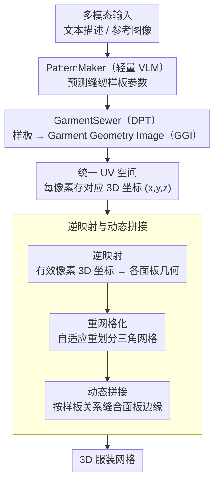

# SwiftTailor: Efficient 3D Garment Generation with Geometry Image Representation

**会议**: CVPR2026  
**arXiv**: [2603.19053](https://arxiv.org/abs/2603.19053)  
**作者**: Phuc Pham, Uy Dieu Tran, Binh-Son Hua, Phong Nguyen
**代码**: 待确认  
**领域**: 3D视觉 / 服装生成  
**关键词**: 3D服装生成, 几何图像, 缝纫样板, VLM, Dense Prediction Transformer

## 一句话总结

提出两阶段轻量框架SwiftTailor，通过PatternMaker预测缝纫样板 + GarmentSewer将其转换为统一UV空间的Garment Geometry Image，结合逆映射与动态拼接直接生成3D服装网格，推理速度比现有方法快数十倍且达到SOTA质量。

## 研究背景与动机

3D服装生成是计算机视觉和数字时尚领域的长期难题。现有方法的典型流程是：使用大型视觉-语言模型（VLM）生成2D缝纫样板的序列化表示，再通过GarmentCode等服装建模框架将其转换为可模拟的3D网格。这类方法虽然质量高，但存在明显瓶颈：

**推理效率低**：依赖物理模拟引擎（如GarmentCode）将2D样板转为3D网格，单件服装推理需30-60秒，难以满足实时或大规模生成需求

**VLM冗余**：使用大型VLM做缝纫样板预测存在参数浪费，轻量化模型即可胜任该任务

**表示不统一**：2D样板到3D网格的转换依赖复杂的模拟流程，中间环节多、不可微分、难以端到端优化

核心问题：如何在保持生成质量的同时大幅提升3D服装生成的推理效率？

## 方法详解

### 整体框架

现有3D服装生成走的是「大VLM 预测2D缝纫样板 → GarmentCode 等物理模拟引擎转3D网格」的路子，质量高但单件要 30-60 秒、中间环节多还不可微。SwiftTailor 把这条链路换成两阶段可学习级联：阶段一 PatternMaker 用一个轻量 VLM 从文本/图像等多模态输入预测缝纫样板参数；阶段二 GarmentSewer 用一个 Dense Prediction Transformer 把样板转成 Garment Geometry Image（GGI），把所有面板的 3D 表面编码进统一 UV 空间；最后用逆映射 + 重网格化 + 动态拼接直接拼出 3D 网格。核心是用学到的几何图像表示替掉物理模拟，把昂贵的模拟成本摊销到训练阶段，推理时一秒内出结果。

### 关键设计

**1. PatternMaker：缝纫样板预测不必动用大VLM**

现有方法（如 AIpparel、ChatGarment）拿 LLaVA-1.5V-7B 这类大 VLM 去预测样板，参数严重浪费。PatternMaker 的判断是：缝纫样板预测本质是个结构化预测任务，不需要通用大模型的全部能力。它因此大幅精简规模，只保留预测样板所需的部分，支持文本描述、参考图像等多模态输入，直接输出各面板的形状、尺寸和拼接关系的参数化表示（省掉复杂的序列解码），并在 Multimodal GarmentCodeData 上联合学习视觉和语言到样板参数的映射，用更小的模型拿到更好的性价比。

**2. GarmentSewer 与 GGI：把不规则3D网格变成规则2D图像预测**

样板转3D之所以慢，是因为依赖物理模拟、不可微、难端到端。GarmentSewer 引入 Garment Geometry Image（GGI）绕开这一步：把服装所有面板的 3D 表面信息编码进统一的 2D UV 空间，每个像素存对应的 3D 坐标 $(x,y,z)$——不规则的 3D 网格问题就被转化成规则的 2D 图像预测问题。GarmentSewer 用高效 DPT 架构、以缝纫样板参数为条件直接预测 GGI，Transformer 的全局注意力天然适合捕捉面板间的空间关系；UV 映射方案则把不同形状大小的面板紧凑排进统一图像空间，在最大化信息密度的同时保持面板间几何一致。

**3. 逆映射与动态拼接：把GGI拼回可用的3D服装**

从 GGI 重建最终网格分三步：逆映射把每个有效像素的 3D 坐标映回原始面板空间、恢复各面板几何；重网格化（Remeshing）对恢复的面板自适应重新划分三角网格、保证网格质量；动态拼接（Dynamic Stitching）按样板里定义的拼接关系自动缝合各面板对应边缘，并能处理面板边缘长度不一致这类实际问题。整条流程完全替代了传统物理模拟，把单件服装的组装时间从数十秒压到亚秒级。

## 实验关键数据

实验在Multimodal GarmentCodeData数据集上进行评估。

### 表1：与现有方法的定量对比

| 方法 | 样板精度 | 3D几何误差↓ | 视觉保真度↑ | 推理时间 |
|------|---------|------------|------------|---------|
| GarmentCode + 大VLM | 较高 | 较低 | 高 | 30-60秒 |
| 基于序列化的方法 | 中等 | 中等 | 中等 | ~30秒 |
| **SwiftTailor** | **最高** | **最低** | **最高** | **<数秒** |

SwiftTailor在保持SOTA精度的同时，推理速度提升一个数量级以上。

### 表2：消融实验

| 配置 | 几何误差↓ | 推理时间 | 说明 |
|------|---------|---------|------|
| 完整SwiftTailor | 最低 | 最快 | 完整两阶段框架 |
| w/o GGI（用物理模拟） | 相当 | 30-60秒 | 验证GGI替代模拟的有效性 |
| w/o 动态拼接 | 较高 | 较快 | 拼接质量下降 |
| w/o 重网格化 | 中等 | 最快 | 网格质量降低 |
| 大VLM替代PatternMaker | 相当 | 更慢 | 验证轻量VLM的合理性 |

消融实验证明了GGI表示、动态拼接和重网格化各组件的必要性。

## 关键发现

1. **几何图像是3D服装的高效表示**：GGI将不规则3D网格统一到规则2D图像空间，使得标准图像预测架构可以直接应用于服装生成
2. **物理模拟可以被学习替代**：通过在训练阶段摊销模拟成本，推理时完全不需要物理引擎，大幅降低推理延迟
3. **轻量VLM足以完成样板预测**：缝纫样板预测是一个相对结构化的任务，不需要超大规模VLM
4. **速度与质量可以兼得**：SwiftTailor证明在3D服装生成中，效率提升与质量提升不是矛盾的

## 亮点与洞察

- **表示创新**：Garment Geometry Image是一个很有启发性的表示设计。将3D服装的所有面板统一编码到2D图像空间，这种思路可以推广到其他多组件3D物体的生成
- **摊销优化思想**：将物理模拟的成本从推理阶段转移到训练阶段，是一种通用的加速策略。类似思想在neural physics、neural rendering等领域也有应用
- **模块化设计**：两阶段解耦设计使得PatternMaker和GarmentSewer可以独立优化和替换，灵活性高
- **实用导向**：10倍以上的加速使得该方法具备实际部署价值，可用于实时3D虚拟试衣、游戏角色穿搭等场景
- **可解释性**：保留了缝纫样板这一中间表示，用户可以检查和编辑样板参数，提供了良好的人机交互接口

## 局限性

1. **数据集依赖**：仅在Multimodal GarmentCodeData上验证，该数据集的多样性可能不足以覆盖所有真实世界服装类型（如极复杂礼服、民族服饰等）
2. **GGI分辨率限制**：几何图像的分辨率决定了3D网格的细节上限，对于褶皱、刺绣等精细结构可能还不够
3. **拓扑约束**：GGI假设服装面板可以平展到2D UV空间，对于拓扑复杂的服装（如有孔洞、多层叠加）可能难以处理
4. **物理真实性**：虽然摊销了模拟成本，但学习得到的几何是否完全符合物理规律（如重力下垂、布料厚度）还需进一步验证
5. **泛化能力**：对训练数据之外的全新服装类型的泛化能力有待考察

## 相关工作与启发

- **GarmentCode**：服装建模框架，通过程序化方式从缝纫样板生成3D网格，是SwiftTailor的主要替代对象
- **SewFormer / DressCode**：基于Transformer的缝纫样板预测方法，使用序列化表示，推理较慢
- **Geometry Images (Gu et al., 2002)**：经典的将3D网格编码为2D图像的方法，SwiftTailor将此思想扩展到多面板服装场景
- **Neural Garment Rendering**：神经辐射场/高斯方法用于服装渲染，但不直接生成可操作的3D网格
- **DPT (Dense Prediction Transformer)**：用于稠密预测的Transformer架构，被SwiftTailor用作GGI生成的骨干网络

**启发**：GGI表示可以推广到其他多部件3D物体生成（如家具、机械零件）。"摊销模拟"的思想对所有依赖物理引擎的3D内容生成管线都有参考价值。

## 评分

- **新颖性**: 8/10 — GGI表示和两阶段摊销框架均有创新，将经典geometry image思想巧妙应用于服装生成
- **实验充分度**: 7/10 — 在标准数据集上达SOTA且有消融，但缺少跨数据集泛化和真实场景部署的验证
- **写作质量**: 8/10 — 框架描述清晰，两阶段设计逻辑流畅，动机论述充分
- **价值**: 8/10 — 10倍加速具有明确应用价值，GGI表示对领域有推动作用

<!-- RELATED:START -->

## 相关论文

- [\[CVPR 2026\] NI-Tex: Non-isometric Image-based Garment Texture Generation](ni-tex_non-isometric_image-based_garment_texture_generation.md)
- [\[CVPR 2026\] SGI: Structured 2D Gaussians for Efficient and Compact Large Image Representation](sgi_structured_2d_gaussians_for_efficient_and_compact_large_image_representation.md)
- [\[CVPR 2026\] FACE: A Face-based Autoregressive Representation for High-Fidelity and Efficient Mesh Generation](face_a_face-based_autoregressive_representation_for_high-fidelity_and_efficient_.md)
- [\[CVPR 2026\] ReWeaver: Towards Simulation-Ready and Topology-Accurate Garment Reconstruction](reweaver_towards_simulation-ready_and_topology-accurate_garment_reconstruction.md)
- [\[CVPR 2026\] FlashVGGT: Efficient and Scalable Visual Geometry Transformers with Compressed Descriptor Attention](flashvggt_efficient_and_scalable_visual_geometry_transformers_with_compressed_descr.md)

<!-- RELATED:END -->
