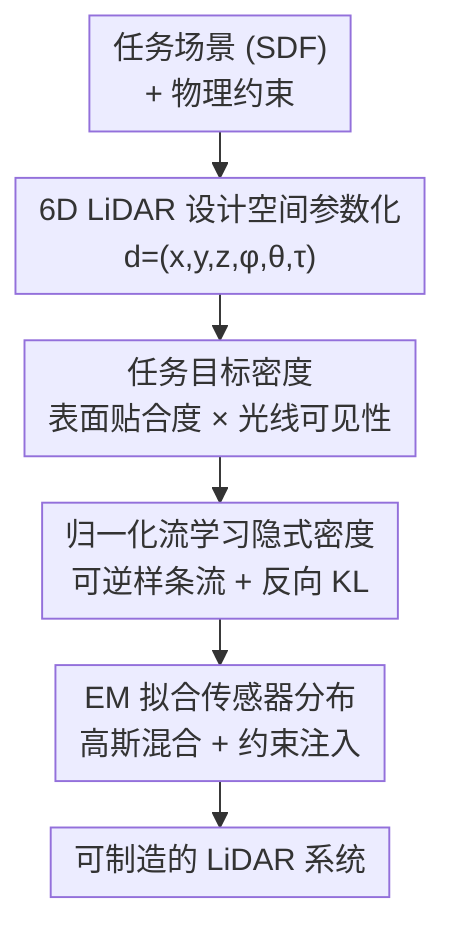

# Task-Driven Implicit Representations for Automated Design of LiDAR Systems

**会议**: CVPR 2026  
**论文**: [CVF Open Access](https://openaccess.thecvf.com/content/CVPR2026/html/Behari_Task-Driven_Implicit_Representations_for_Automated_Design_of_LiDAR_Systems_CVPR_2026_paper.html)  
**代码**: [项目页 nikhilbehari.github.io/implicitlidar](https://nikhilbehari.github.io/implicitlidar)  
**领域**: 3D视觉 / 计算成像 / 传感器系统设计  
**关键词**: LiDAR 系统设计、隐式密度、归一化流、期望最大化、计算成像

## 一句话总结
把 LiDAR 传感器配置编码成连续 6D 设计空间里的点，用归一化流学习"哪些设计对某个 3D 任务最有用"的隐式密度，再用 EM 把高斯混合"传感器"拟合到这个密度上，从而在任意物理约束下**自动生成**面向人脸扫描/机械臂跟踪/仓储检测等任务的 LiDAR 系统，并把带宽最高压到约 1/10。

## 研究背景与动机

**领域现状**：成像系统设计（光学、传感器、照明的选型与摆位）至今仍是高度手工、迭代式的工程过程。LiDAR（直接飞行时间 dToF）在手机、机器人、自动驾驶里无处不在，但它比普通相机多出一堆独有的设计自由度——扫描图案、时间门（time gate）、发射功率、数据吞吐量等，使得设计空间更复杂。

**现有痛点**：现有 LiDAR 优化方法大多只盯着**摆位**这一个维度（如 AV 上扫描式 LiDAR 该放哪），假设硬件和任务固定；而联合传感器-感知设计方法只能微调**预定义**的相机参数，一旦约束变了就得重新训练。没有方法能在连续空间里统一表达 flash / gated / 运动自适应等多种形态的 LiDAR，并支持事后任意调约束。

**核心矛盾**：LiDAR 设计要同时满足三件互相拉扯的事——① 在高维**混合离散-连续**空间（传感器数量、扫描图案、摆位、朝向、视场、时间门）里搜索；② 配置要**贴合具体任务**（手机 LiDAR 要抓人脸细几何，分布式机器人跟踪系统要服从机械臂工作空间和运动学约束）；③ 还要满足尺寸/重量/功耗/量程等**物理约束**与用户偏好，且要能快速重算。把这三件事塞进一个可微、可采样、可加约束的框架里，是核心难点。

**本文目标**：在任意约束下，对任意 3D 视觉任务，自动提出"好用且可制造"的 LiDAR 系统。

**切入角度**：作者从隐式神经表示（INR / NeRF）的范式里借灵感——NeRF 在连续 5D 子空间上学一个隐式体密度、并通过策略性采样实现新视角合成；那么能不能在连续 **6D LiDAR 设计空间**上学一个隐式**设计密度**，再通过"约束感知采样"把高密度区域变成真正能造出来的传感器？

**核心 idea**：用"6D 设计空间 + 任务驱动隐式密度 + 流模型学密度 + EM 拟合传感器"四步，把"设计一个 LiDAR 系统"变成"在隐式密度上做最大似然采样"。

## 方法详解

### 整体框架

整套方法是一条四阶段的串行管线：**先把任何 LiDAR 测量统一参数化成 6D 设计空间里的一个点；再为某个任务定义一个目标密度，刻画"这个设计点对该任务有多好"；然后用归一化流把这个难以直接采样的目标密度学成一个可逆变换（隐式密度）；最后把"一个传感器"建模成 6D 空间里的参数分布，用 EM 把它拟合到学好的隐式密度上，同时把物理约束注入进去，输出可制造的 LiDAR 系统。**

输入是某个任务的一批仿真场景（用 SDF 表示）+ 用户给的物理约束；输出是一组传感器配置（每个传感器的摆位、视场、朝向、时间门、光线分配）。四个阶段分别对应论文 Sec 3 / 4.1 / 4.3 / 5。

### 关键设计

**1. 6D LiDAR 设计空间参数化：把"一台传感器"拆成连续坐标里的一团采样**

痛点是 LiDAR 设计变量混合了离散（几个传感器、扫多少线）和连续（角度、时间门），现有方法没法统一表达。作者的做法是把**每一次 LiDAR 测量**都看成一条带无穷小飞行时间的射线，并用 6 个连续坐标完整描述：空间原点 $x=(x,y,z)\in\mathbb{R}^3$、射线方向（方位角 $\phi$ 与俯仰角 $\theta$）$a=(\phi,\theta)$、以及时间坐标 $\tau\in\mathbb{R}^+$（飞行时间，等价于深度）。于是一个设计点写成

$$d = (x,y,z,\phi,\theta,\tau)^\top \in \mathcal{D} = \mathcal{X}\times\mathcal{A}\times\mathcal{T}.$$

每条射线观测到的场景点由前向映射 $s=M(d)=x+\tau\,v(\phi,\theta)$ 给出，其中 $v(\phi,\theta)=(\cos\theta\cos\phi,\ \cos\theta\sin\phi,\ \sin\theta)^\top$ 是单位方向。一次完整回波由发射射线 $d_e$ 与探测射线 $d_d$ 配对、满足 $M(d_e)=M(d_d)=s$；本文主要聚焦发射器-探测器同位（$d_e=d_d$）的情形，但框架也支持双站（bi-static）设计。这个参数化的妙处在于：**所有现成 LiDAR（单点/多点 dToF、flash、gated、扫描式）都变成 6D 空间里的离散采样体**，从而把"设计 LiDAR"统一成"在连续 6D 空间里选点"。

**2. 任务目标密度：用"表面贴合度 × 光线可见性"量化一个设计点值不值得**

要在 6D 空间里学密度，先得有一把尺子衡量"设计点 $d$ 好不好"。作者提出的目标密度 $p^\ast(d)$ 把"好"拆成两个物理因子，对一类任务场景 $\{i\}$ 求和。第一是**表面贴合度**：设计 $d$ 观测到的场景点 $s=M(d)$ 应当平均落在物体表面附近，才能多采到有效回波。用每个场景的有符号距离函数 $\mathrm{SDF}_i(s)$（表面处为 0）定义能量

$$S_i(d)=\exp\!\Big(-\frac{\mathrm{SDF}_i(s)^2}{2\sigma^2}\Big),$$

它在高斯噪声 $\sigma$ 下表示 $s$ 落在表面附近的似然。第二是**光线可见性**：从原点 $x$ 到 $s$ 的光路要无遮挡，借用体渲染的透射率公式

$$T_i(d)=\exp\!\Big(-\!\int_0^\tau \kappa\,\mathrm{sigmoid}\big(-\mathrm{SDF}_i(x+t\,v(\phi,\theta))\big)\,dt\Big),$$

$\kappa>0$ 控制衰减强度。最终目标密度是二者在场景集合上求和：

$$p^\ast(d)=\sum_i \underbrace{S_i(d)}_{\text{表面贴合}}\ \underbrace{T_i(d)}_{\text{光线可见}}.$$

这把尺子的关键贡献有两点：一是**把任务的场景多样性投影进设计空间**——若某场景点 $s$ 在 $I$ 个场景里都在表面上，则在全可见时 $p^\ast(d)\!\approx\!|I|$，正比于该表面点跨场景出现的频率；二是**显式建模遮挡**，可见性项让被遮挡的等价射线密度降低，得到物理上站得住的投影。注意表面贴合项会带来设计歧义（同一个 $s$ 有无穷多几何等价的 $d$，构成设计空间里的曲线），这恰好反映了真实 LiDAR 设计的内在多解性。

**3. 归一化流学习隐式密度：把难采样的目标密度变成可逆变换**

有了 $p^\ast(d)$，但直接在 6D 空间里找高密度区域不可解。作者的核心 trick 是用**归一化流**学一个从易采样基分布到目标密度的可逆映射，于是每个任务的 LiDAR 设计密度就被"隐式"编码成对基分布的变换。具体从 6D 均匀基分布 $\pi=U([0,1]^6)$ 采样 $z$，学一个可逆映射 $f:\mathbb{R}^6\to\mathbb{R}^6$ 得到 $d=f(z)$，密度由换元公式

$$p(d)=\pi\big(f^{-1}(d)\big)\,\big|\det \nabla f^{-1}(d)\big|$$

给出。$f$ 由 $K$ 个**自回归样条流层**复合而成，每个坐标更新 $d_i=h_{\psi_i}(z_i;z_{1:i-1})$ 用一个 MLP 条件化的有理二次样条（样条的结点宽高与端点斜率都由 MLP 预测）。训练目标是最小化学到密度 $p(d;\Phi)$ 与目标 $p^\ast(d)$ 的**反向 KL 散度**，损失里同时含基分布对数密度、流的对数雅可比、以及 LiDAR 目标对数密度三项，外加一个熵正则 $\lambda_{\text{ent}}$ 促进采样多样性。可逆+可微的性质带来闭式雅可比行列式和精确似然，正是后续 EM 采样能跑通的前提。

**4. EM 拟合高斯混合 = 把隐式密度变成可制造、可加约束的传感器**

最后一步要把"连续密度"落地成"几台真实传感器"。作者把一个新传感器建模为 6D 空间上的参数分布 $q(d\mid\eta)=q_x(x\mid\eta_x)\,q_a(a\mid\eta_a)\,q_\tau(\tau\mid\eta_\tau)$，于是合成传感器 = 最大似然估计 $\eta^\ast=\arg\max_\eta \mathbb{E}_{d\sim p(d)}[\log q(d\mid\eta)]$，即让传感器分布在隐式密度的高密度区域取最大似然。实现上 $q$ 取 $G$ 分量**高斯混合** $q(d\mid\eta)=\sum_{g=1}^G \pi_g\,\mathcal{N}(d;\mu_g,\Sigma_g)$，用 **EM** 迭代拟合：E 步算混合分量后验 $q(g\mid d;\eta^{(t)})$，M 步更新 $\eta^{(t+1)}$ 最大化对数似然的 Jensen 下界。每个高斯就是一台学出来的"传感器"，物理参数（角度、时间门、以及分布式系统的原点）由其 95% 置信区间读出；需要按线采样时，按混合权重 $\pi_g$ 把射线预算分给各传感器，让空间采样对齐传感器重要性。这一步最大的价值是**约束注入极其廉价**：把密度支撑限制到容许区域 $\mathcal{C}$（$d\notin\mathcal{C}$ 时令 $p(d)=0$）再重拟合即可施加空间/角度/时间约束；视场和时间门约束变成协方差对角元的简单界 $\Sigma_{a,ii}\in[\sigma_{\min}^2,\sigma_{\max}^2]$；传感器个数由混合阶数 $G$ 控制；固定某些参数（如 $\mu_x,\Sigma_x$）即可强加摆位/运动约束——**改约束完全不需要重训流模型**。

### 一个完整示例：人脸扫描如何被自动设计

以 Expt. A 的手机 flash-LiDAR 人脸扫描为例走一遍：① 从 Basel 人脸模型采 50 张人脸网格（转成 SDF）作为任务场景；② 对每个候选设计点 $d$ 算表面贴合度 $S_i$ 与可见性 $T_i$，求和得目标密度——鼻子、眼窝等高频几何区域天然密度更高；③ 用样条流把这个密度学成可逆映射；④ 在"传感器数=10、总射线数=576"的约束下跑 EM，得到 10 个高斯传感器——结果里**自动冒出一个专门对准鼻子的传感器**，并在固定射线预算下重新分配每个传感器的采样。最终在 50 张测试人脸上模拟射线-网格相交、Delaunay 三角化重建、用 Chamfer 距离评估：重建保真度一致更高，且带宽比均匀基线降到约 1/6。

## 实验关键数据

作者在三类 3D 视觉任务上验证：**人脸扫描**（Chamfer 距离）、**机械臂末端跟踪**（Fréchet 距离）、**仓储物体检测**（漏检率 miss rate），统一对比两个基线：均匀采样（origin+angle 均匀、固定时间门）与随机采样。下表汇总各任务在固定刷新率/位宽下的**数据带宽**对比（@10Hz, 40-bit bins，数字取自论文 Fig. 6）。结论是：在精度一致更优的同时，本文设计因更聪明的时间门把带宽大幅压低。

### 主实验：带宽对比（越低越好）

| 任务（射线数档位） | 基线 Random/Uniform | 本文（2 传感器） | 本文（4 传感器） | 本文（更多传感器） |
|---|---|---|---|---|
| 人脸扫描 196/361/576 线 | 5.2 / 9.5 / 15.2 Mbps | 0.9 / 1.6 / 2.5 | 0.9 / 1.7 / 2.7 | 0.8 / 1.5 / 2.3（10 传感器） |
| 跟踪/检测 400/1000/1200 线 | 10.7 / 26.8 / 32.2 Mbps | 6.9 / 17.3 / 20.8 | 5.4 / 13.4 / 16.1 | 4.7 / 11.7 / 14.0（8 传感器） |
| 单档 6/12/18 线 | 1.9 / 3.8 / 5.8 Mbps | 0.3 / 0.4 / 0.6（Ours） | — | — |

> 跨档位整体上：人脸扫描带宽约降 **6×**，跟踪约降 **2×**，运动自适应检测约降 **≈10×**（均相对均匀基线，且任务精度不降反升）。⚠️ Chamfer / Fréchet / miss-rate 的具体数值在正文未给出表格（曲线做了 w=3 平滑、详细数据在补充材料），此处只引用论文明确给出的带宽数字。

### 消融实验：光线可见性项的作用

| 配置 | 关键指标 | 说明 |
|---|---|---|
| Full（含可见性项，遮挡感知） | Fréchet 距离基准 | 完整目标密度 |
| w/o 可见性项（遮挡无视） | 需 **2× 射线**才追平 | 去掉 $T_i(d)$ 后采样质量下降 |

在机械臂末端跟踪上对比"完整密度"与"去掉光线可见性项"的密度：从两者各采分布式 LiDAR 配置、在不同射线预算下评 Fréchet 距离，**遮挡感知设计只用 1/2 的射线就能追平遮挡无视设计的精度**，说明显式建模遮挡（可见性项）对鲁棒 LiDAR 设计至关重要。论文另在补充材料里与占据栅格建模、端到端优化、强化学习、进化搜索等基线做了对比。

### 关键发现
- **带宽红利来自更聪明的时间门**：本文设计在精度更高的同时把带宽压到基线的 1/2～1/10，红利主要来自学到的时间门把无效时间区间裁掉，而非单纯减少射线。
- **可见性项是鲁棒性的核心**：去掉它要多花一倍射线才追平，说明遮挡建模不是锦上添花而是刚需。
- **设计会自适应几何与运动**：人脸扫描自动分配出"专攻鼻子"的传感器；检测任务把设计条件化在机器人位置上，得到空间自适应的扫描策略。
- **真实硬件验证**：用单光子雪崩二极管 + 皮秒脉冲激光 + 双轴振镜（±20°/轴、共 40° FoV）复现 2/4/10 传感器配置（各 576 线），相比均匀扫描基线得到更密的表面覆盖、更细的人脸细节、对深度离群点更鲁棒。

## 亮点与洞察
- **把 INR/NeRF 范式迁到"硬件设计"本身**：NeRF 在连续空间学场景密度，本文在连续空间学**设计密度**——同样是"隐式表示 + 策略性采样"，但采的对象从像素变成了传感器配置，这是个很漂亮的范式平移。
- **"传感器即分布、设计即 MLE"的抽象**：把一台传感器看成 6D 空间里的参数分布、把合成看成在隐式密度上做最大似然，这层抽象让多形态 LiDAR（固定/双站/分布式/可动）和约束都能统一处理。
- **约束注入零重训**：改视场/时间门只是改协方差的界，改传感器数只是改混合阶数 $G$，固定参数即可加摆位约束——对工程 R&D 里频繁变约束的场景极其友好，这是相对端到端联合优化方法最实用的优势。
- **可迁移思路**：这套"目标密度（物理度量）→ 流模型隐式化 → EM 落地成参数化原语"的流程，原则上能迁到相机阵列、超声、麦克风阵列等其他传感器系统的自动设计。

## 局限与展望
- **强依赖仿真保真度**：方法靠任务场景仿真来学设计密度，当仿真无法覆盖真实变化、或测试场景落在仿真分布之外时性能会退化。
- **难直接用现成数据集评测**：流模型需要主动查询连续 6D 设计空间，因此无法直接在 KITTI 这类预采集数据集上评测——大规模真实验证仍是待补的关键一步。
- **目前限于室内/中近程**：实验集中在人脸、机械臂、仓储等室内中近程（量程 2～5m）场景，向室外大规模与自动驾驶设定的扩展只在补充材料讨论、未实测。
- **可改进方向**：把仿真换成可微渲染/真实回波先验以缩小 sim-to-real gap；或把目标密度从"表面贴合×可见性"扩展到含语义/任务损失的可学习度量，让设计更贴合下游网络。

## 相关工作与启发
- **vs LiDAR 摆位优化（AV 方向 [16,25,26,28]）**：他们只优化扫描式 LiDAR 的**摆位**、假设硬件固定；本文建模连续设计空间，覆盖 flash/gated/运动自适应等多种形态，且支持事后任意调约束。
- **vs 联合传感器-感知设计 [12,21,47,48]**：他们微调**预定义**相机参数、约束一变就要重训；本文提出新的 LiDAR 表示，支持事后约束调整而**无需重训**。
- **vs Next-best-view 方法 [7,8,13,14,…]**：他们做基于规则/学习的视点选择以提升重建保真度，但假设相机硬件与任务固定；本文直接设计硬件本身。
- **vs NeRF / 隐式神经表示 [31,32,37,50]**：INR 此前主要表示视觉信号（辐射场、占据、隐式曲面），本文把 INR 范式**扩展到表示成像硬件的设计**，是 INR 应用面的一次拓展。

## 评分
- 新颖性: ⭐⭐⭐⭐⭐ 首个面向任务的连续隐式 LiDAR 设计表示，把 INR 范式迁到硬件设计，方向很新。
- 实验充分度: ⭐⭐⭐⭐ 三任务 + 真实单光子硬件验证 + 多种约束/形态，但精度指标多放补充材料、正文表格偏少。
- 写作质量: ⭐⭐⭐⭐⭐ 从 6D 参数化到 EM 落地的逻辑链非常清晰，图示充分。
- 价值: ⭐⭐⭐⭐⭐ 为"生成式计算传感器设计"开了个有说服力的口子，对机器人/移动设备 R&D 有实际意义。

<!-- RELATED:START -->

## 相关论文

- [\[CVPR 2026\] Content-Aware Frequency Encoding for Implicit Neural Representations with Fourier-Chebyshev Features](content-aware_frequency_encoding_for_implicit_neural_representations_with_fourie.md)
- [\[CVPR 2025\] SiNR: Sparsity Driven Compressed Implicit Neural Representations](../../CVPR2025/3d_vision/sinr_sparsity_driven_compressed_implicit_neural_representations.md)
- [\[CVPR 2026\] Ghosts in the Point Clouds: De-glaring LiDAR in the Transient Domain](ghosts_in_the_point_clouds_de-glaring_lidar_in_the_transient_domain.md)
- [\[CVPR 2026\] LiDAR Prompted Spatio-Temporal Multi-View Stereo for Autonomous Driving](lidar_prompted_spatio-temporal_multi-view_stereo_for_autonomous_driving.md)
- [\[CVPR 2026\] NTK-Guided Implicit Neural Teaching](ntk-guided_implicit_neural_teaching.md)

<!-- RELATED:END -->
