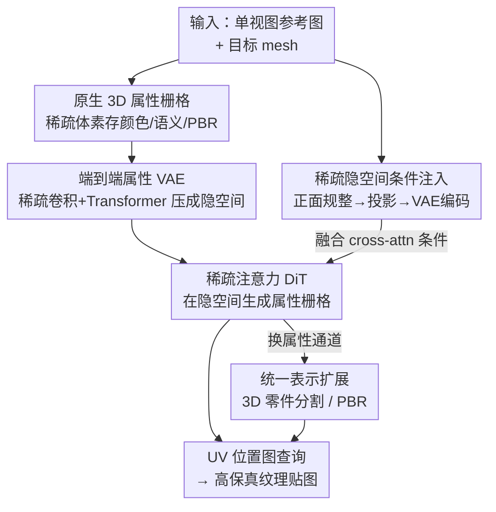

# TEXTRIX: Latent Attribute Grid for Native Texture Generation and Beyond

**会议**: CVPR 2026  
**论文**: [CVF Open Access](https://openaccess.thecvf.com/content/CVPR2026/html/Zeng_TEXTRIX_Latent_Attribute_Grid_for_Native_Texture_Generation_and_Beyond_CVPR_2026_paper.html)  
**代码**: 待确认  
**领域**: 3D视觉  
**关键词**: 3D纹理生成, 原生3D表示, 稀疏体素, 扩散Transformer, 3D零件分割

## 一句话总结
TEXTRIX 把 3D 纹理表示成一张"原生 3D 属性栅格"（稀疏体素场，每个体素存颜色/语义/PBR），用带稀疏注意力的扩散 Transformer 直接在体素空间里给模型上色，从根上绕开了多视图融合的接缝和 UV 展开的碎片化问题；同一套架构换个预测目标就能做高精度 3D 零件分割，两项任务都拿到 SOTA。

## 研究背景与动机
**领域现状**：给定一个 3D 网格（mesh），如何为它生成高保真、风格一致的纹理，是 3D 内容生成里最卡脖子的一环。当前主流做法都"借力"成熟的 2D 扩散模型：要么用 score distillation 优化一个 3D 表示，要么先生成多视图图像再重建/投影回 mesh（multi-view fusion），近期变体把多视图投影直接贴到网格表面。

**现有痛点**：这条 2D 中心的路线有两个绕不开的硬伤。其一是**多视图融合**——不同视角各自生成、再拼到一起，视角之间天然不一致，于是出现接缝、模糊、光照不连贯，复杂或被遮挡的区域常常根本没有合理覆盖（论文 Figure 2 里嘴唇、脖子处的接缝就是典型）。其二是**UV 参数化空间生成**——直接在 2D UV 图上画纹理虽然避开了逐物体优化，但 UV 展开会把连续的 3D 曲面"剪"成一堆互不相连的 2D 岛屿，切断了原本相邻的测地邻域，导致 UV 缝边出现伪影、学到的纹理花纹和它要描述的 3D 几何脱节。

**核心矛盾**：根子在于纹理是 3D 表面上的属性，却被硬塞进 2D 表示（多视图图像 / UV 图）里去生成。只要表示不是"原生 3D"的，3D 全局一致性就无法被结构性地保证，接缝和不一致就是表示本身带来的、而非可以靠后处理消掉的问题。

**本文目标**：(1) 找一种真正原生于 3D 的纹理表示与生成范式，从源头消除多视图不一致与 UV 碎片化；(2) 保证生成结果对用户输入图像的高保真对齐，并能合理补全遮挡区域；(3) 让这套表示足够通用，能从"生成颜色"自然扩展到"预测语义/材质"等感知与生成任务。

**切入角度**：既然问题出在"非原生表示"，那就直接在 3D 空间里表示和生成纹理——用一个**稀疏体素属性场**存储纹理，每个体素装的不只是颜色，还可以是语义标签、PBR 材质等任意属性，再用扩散 Transformer 学习这种 3D 栅格的分布。

**核心 idea**：用一张**原生 3D 属性栅格 + 稀疏注意力 DiT** 取代"多视图融合 / UV 生成"，把纹理生成变成直接在体素空间里的着色，并让同一架构通过换属性通道统一纹理生成与 3D 分割。

## 方法详解

### 整体框架
TEXTRIX 要解决的是"给定单视图条件图 + 目标网格，原生地在 3D 空间生成纹理（以及分割/PBR）"。整条管线分四步：**先把 3D 属性统一编码成一张稀疏体素属性栅格（表示层）**；**再用端到端的属性 VAE 把高分辨率栅格压成紧凑连续的隐空间**；**然后训练一个图像条件的扩散 Transformer（DiT），在 VAE 隐空间里生成属性，并用一套"稀疏隐空间条件"把输入图像强对齐进来**；**最后通过 UV 位置图查询生成的栅格，得到贴图，并把同一架构换成预测语义/材质来扩展到分割与 PBR**。

输入是单张（或多张）参考图 + 待上色的 mesh；中间得到一张体素属性栅格；输出是几何对齐的高分辨率纹理贴图（或零件分割图）。表示层之所以放第一位，是因为后面 VAE、DiT、下游扩展全都建立在"属性栅格"这一统一容器上——这也是论文反复强调的"native 3D"卖点。

### 关键设计

**1. 原生 3D 属性栅格：用稀疏体素场把纹理表示成真正的 3D 属性**

这一步直接针对"非原生表示导致 3D 不一致"的痛点。论文把一个物体的 3D 属性 $A$ 表示为贴近表面区域的一组稀疏体素属性向量 $A=\{a_i \mid a_i\in\mathbb{R}^k\}_{i=1}^{M}$，其中 $M$ 是稀疏体素总数，每个体素向量的通道维度 $k=k_{color}+k_{semantic}+k_{PBR}+\cdots+k_e$ 可以同时容纳颜色、语义、PBR 等多种属性——这正是"换个通道就能换任务"的物理基础。与 TRELLIS 用 DINOv2 多视图特征投到体素不同，TEXTRIX 直接存高分辨率的原始属性，既避免了 DINOv2 特征丢高频信息、又因为通道维度低而能扩到 $1024^3$ 这样的高分辨率。

查询机制是它"好用"的关键：为了在表面任意点取属性，先预计算一张 **UV 位置图**——一张高分辨率 2D 图，每个像素 $(u,v)$ 存对应的 3D 世界坐标 $p=(x,y,z)$，相当于一张 UV↔3D 的查找表。拿到查询点 $p\in[-0.5,0.5]^3$ 后，按栅格分辨率 $R$ 缩放定位到所在体素，取原点角索引 $v_0=\lfloor p\cdot R\rfloor$，再对该体素 8 个角的属性做三线性插值：$A(p)=\sum_{i,j,k\in\{0,1\}}(1-\alpha_i)(1-\alpha_j)(1-\alpha_k)\,a_{ijk}$，权重 $\alpha=(p\cdot R)-v_0$。这种自适应插值让稀疏表示也能学到非线性的连续属性场，从而在稀疏存储下仍保持高生成保真度和分割精度。

**2. 端到端属性 VAE：把高分辨率栅格压成可扩散的紧凑隐空间**

直接在 $1024^3$ 栅格上跑扩散不现实，所以需要一个 VAE 把它压到隐空间。但 TRELLIS 那类非原生表示要把 DINOv2 特征解码成 FlexiCubes 或 3D Gaussian 才能监督外观，训练低效且被限制在 $256^3$ 分辨率。TEXTRIX 利用原生属性栅格的灵活高效，设计了一个**全端到端、对称结构的属性 VAE**：编码器先用一连串稀疏卷积逐级下采样、抽多尺度局部特征，再把粗特征栅格序列化成 token 喂进稀疏 Transformer 建模长程依赖，最终映射成紧凑隐分布；解码器对称地先用稀疏 Transformer 解读采样到的隐码，再用稀疏转置卷积逐级上采样重建出高分辨率属性栅格。实现上它把 $1024^3$ 的输入压成 $128^3$、隐通道 16 的隐栅格。

训练目标里有两个值得注意的设计。一是**剪枝（pruning）**：解码出的栅格既有有效区也有冗余区，于是在每级上采样后按是否对应有效表面区域选择性删除体素（下采样因子依次 2、4、8），剪枝用二元交叉熵 $L_{prune}$ 监督。二是**在线渲染监督**：不直接拿输入栅格做监督，而是用视角相关的渲染结果来提供属性监督，以提升重建保真。最终损失是 $L_{total}=\lambda_1 L_1+\lambda_{prune}L_{prune}+\lambda_{kl}L_{kl}+\lambda_{lpips}L_{lpips}+\lambda_{adv}L_{adv}$，把 L1、剪枝 BCE、KL 正则、LPIPS 感知损失和 GAN 对抗损失加权组合，兼顾几何正确与视觉真实。

**3. 稀疏隐空间条件注入：让生成结果牢牢锚定到输入图像**

生成式纹理最大的隐患是输出跟用户给的条件图对不上。以往用 CLIP/DINO 抽全局图像特征作条件，但这些 embedding 和 VAE 隐表示之间存在域差（domain gap），导致生成属性与输入图错位。TEXTRIX 提出**稀疏隐空间条件**来消这个 gap：先把任意未知视角的参考图 $I'$ 规整化——用一个以目标正面位置图为条件、微调过的扩散模型，合成出对齐的正面图 $I_{front}$；再用同一张正面位置图把 $I_{front}$ 的像素投影成一个 3D 体素栅格，作为条件;这个稀疏体素条件被喂进**预训练好的属性 VAE 编码器**，于是条件被嵌入到和隐 token $z$ 完全相同的隐空间里，天然没有域差。

为增强稳定性，它还额外接入 DINOv3 抽的全局语义特征，形成**混合 cross-attention**，把"空间显式的稀疏隐条件"和"全局语义条件"两路信息一起注入扩散过程：$\hat z=\text{CrossAttn}\big(z,\text{PE}(E_{VAE}(A(I)))\big)+\text{CrossAttn}\big(z,E_{DINOv3}(I)\big)$，其中 $\text{PE}$ 是位置编码、$E_{VAE}$ 是属性 VAE 编码器、$A(I)$ 是输入图投影出的稀疏体积、$E_{DINOv3}$ 是 DINOv3 编码器。DiT 本身还借鉴 Direct3D-S2 的空间稀疏注意力提升自注意力效率，并用 rectified flow（流匹配）目标训练。这套设计保证生成纹理既能高保真还原可见视图细节，又能利用该信息合理补全遮挡区域。

**4. 统一表示扩展：同一架构换属性通道即可做 3D 分割与 PBR**

属性栅格不止能存颜色——这是论文"and Beyond"的落点。把同一套架构训练成预测**语义标签**而非颜色，就能做高精度 3D 零件分割：训练时用每个零件被赋予唯一随机 RGB 的 ground-truth UV 图作为离散标签，把分割当成生成任务来学。推理时先用现成 2D 分割方法从渲染视图得到一组（往往过分割的）初始掩码，再用 DINO 特征对相邻分段对算相似度、把相似的合并，得到语义上有意义的部件；以此为条件让模型生成最终的彩色编码属性栅格，查询栅格得到对应 3D 分割的 UV 图，最后对标签值做聚类得到分割结果。因为是在高分辨率体素栅格上操作，它能在面数极高、拓扑复杂的网格上产生异常锐利、精确的分割边界。同理，把预测目标换成 roughness/metallic/normal 等就能做 PBR 材质生成（细节见原文补充材料）。

## 实验关键数据

### 主实验：纹理生成保真度
在前视重建与新视图生成两组指标上，TEXTRIX（Ours）相对 Paint3D、TexGen、TRELLIS 全面领先（Table 1）：

| 方法 | SSIM ↑ | PSNR ↑ | LPIPS ↓ | CLIP Score ↑ | CLIP FID ↓ |
|------|--------|--------|---------|--------------|------------|
| Paint3D | 0.8903 | 21.5729 | 0.1051 | 0.8013 | 23.1599 |
| TexGen | 0.8976 | 22.4177 | 0.1005 | 0.8206 | 22.1541 |
| TRELLIS | 0.9150 | 25.5405 | 0.0856 | 0.8346 | 21.3961 |
| **Ours** | **0.9421** | **30.0985** | **0.0627** | **0.8545** | **19.8543** |

前视 PSNR 从次优的 25.54 提升到 30.10（+4.56），LPIPS 从 0.0856 降到 0.0627，说明稀疏隐空间条件确实把生成结果牢牢钉在了输入视图上；新视图的 CLIP Score / CLIP-FID 也最优，说明对遮挡区域的补全质量同样领先。论文还报告了把它与 MVAdapter 结合（MVAdapter+Ours）后在多视图新视图指标上超过所有基线（CLIP 0.8357、CLIP-FID 21.7571），证明它能反过来增强已有多视图方案。

### 3D 零件分割（mIoU ↑）
在两个各 100 个 mesh 的 Objaverse 子集上对比 SOTA 分割方法（Table 3）：

| 数据集 | SAMesh | SAMPart3D | PartField | Ours |
|--------|--------|-----------|-----------|------|
| Objaverse (Random) | 44.84 | 46.34 | **74.63** | 72.26 |
| Objaverse (Complex) | 31.07 | 36.67 | 51.79 | **60.82** |

在随机子集上与最强的 PartField 基本持平（72.26 vs 74.63，略低）；论文解释 general 子集里有很多跨多个体素的大而简单的面，栅格查询会引入轻微不一致。但在 **Complex 子集**（超过 1 万条锐边、用 DORA 筛出的复杂网格）上，TEXTRIX 大幅领先（60.82 vs PartField 51.79，+9.03），正好印证高分辨率体素栅格在保留高频几何细节、画出锐利边界上的优势。

### 消融实验
去掉稀疏隐空间条件后，前视一致性显著崩塌（Table 4）：

| 配置 | SSIM ↑ | PSNR ↑ | LPIPS ↓ | 说明 |
|------|--------|--------|---------|------|
| Ours (Single View) | 0.9421 | 30.0985 | 0.0627 | 完整模型 |
| w/o Sparse Latent Condition | 0.9052 | 24.3984 | 0.0942 | 去掉稀疏隐条件 |

PSNR 直接从 30.10 掉到 24.40（−5.70），SSIM/LPIPS 同步恶化，证明"把条件投影到 3D 体素、再用同一 VAE 编码器嵌进同一隐空间"这套设计是高保真对齐的关键——它正面回答了"为什么不直接用 CLIP 全局特征"。

### 关键发现
- 贡献最大的模块是**稀疏隐空间条件**：去掉它前视 PSNR 掉 5.7，说明纹理对齐主要靠它而非全局 CLIP/DINO 特征。
- 原生 3D 表示的优势在"难样本"上才真正拉开差距：分割在简单网格上仅持平，在复杂高面数网格上大幅领先，与论文"高分辨率体素保留高频几何"的论点一致。
- 框架的可扩展性是实打实的：同一架构换属性通道即可从纹理切到分割（再到 PBR），且都在各自任务上达到或接近 SOTA。

## 亮点与洞察
- **"native 3D"不是口号而是结构性收益**：把纹理表示成 3D 体素属性场，从表示层就消除了多视图融合的接缝与 UV 展开的碎片化——这是后处理永远补不回来的一致性，比"借 2D 模型再修补"更治本。
- **用 VAE 编码器当条件编码器，巧妙消除域差**：把输入图投影成 3D 体素后，直接复用属性 VAE 的编码器把条件嵌进同一隐空间，让条件与隐 token 同源，这是它对齐保真度碾压 baseline 的核心 trick，可迁移到任何"条件 vs 隐空间存在域差"的生成任务。
- **统一属性容器解锁任务复用**：体素向量通道 $k=k_{color}+k_{semantic}+k_{PBR}+\cdots$ 的设计让"生成"和"感知"共用一套架构，只换预测目标——这种把感知当生成来做的思路对统一 3D 框架很有启发。

## 局限与展望
- **依赖高质量 UV 位置图与 mesh**：整套查询机制建立在预计算 UV 位置图之上，对没有良好 UV 展开或拓扑退化的资产可能受限。
- **大而简单的面是软肋**：作者承认在 Objaverse(Random) 上，跨多个体素的大平面会让栅格查询引入轻微不一致，分割略逊于 PartField——这是体素离散化的固有代价。
- **推理流程偏重**：纹理生成要先用微调扩散模型合成对齐正面图、再投影编码；分割要先 2D 过分割再 DINO 特征合并再聚类，链路较长，端到端程度不如标题暗示的那么"一步到位"。
- **PBR 仅在补充材料**：正文未给 PBR 定量结果，扩展性的"and Beyond"部分证据相对单薄。⚠️ PBR 细节以原文补充材料为准。
- 训练成本不低（32×A100、batch 16/GPU、约 3 万步），复现门槛较高。

## 相关工作与启发
- **vs TRELLIS**：同样是原生体素 3D 生成，但 TRELLIS 用 DINOv2 多视图特征投到体素、需解码成 FlexiCubes/3DGS 监督外观，丢高频且卡在 $256^3$；TEXTRIX 直接存原始属性、端到端 VAE，能扩到 $1024^3$，纹理保真度（PSNR 30.1 vs 25.5）明显更高。
- **vs 多视图融合（Paint3D / TexGen / Hunyuan3D）**：它们在 2D 视图生成再投影/拼接，受困于视角不一致、接缝、遮挡缺失；TEXTRIX 在体素空间直接着色，结构性地消除这些伪影，并能与 MVAdapter 结合反向增强多视图方案。
- **vs UV 空间生成**：UV 展开切断测地邻域、缝边出伪影；TEXTRIX 用 3D 坐标查询体素场，绕开 UV 碎片化。
- **vs SAMPart3D / PartField（3D 分割）**：它们学连续部件感知特征场；TEXTRIX 在高分辨率体素栅格上把分割当生成做，在复杂高面数网格上边界更锐（Complex 子集 mIoU 60.82 vs 51.79）。

## 评分
- 新颖性: ⭐⭐⭐⭐⭐ 用原生 3D 属性栅格统一纹理生成与感知，并以"VAE 编码器作条件编码器"消除域差，范式层面有真正的转变。
- 实验充分度: ⭐⭐⭐⭐ 纹理与分割两任务都有定量对比+消融，证据扎实；但 PBR 仅在补充材料、缺更多消融（如剪枝/在线渲染/DINOv3 各自贡献）。
- 写作质量: ⭐⭐⭐⭐ 动机清晰、图示到位，公式与方法链路完整；个别实现细节（合并/聚类步骤）略简。
- 价值: ⭐⭐⭐⭐⭐ 给 3D 纹理与统一 3D 表示提供了治本的方向，工程与研究价值都高。

<!-- RELATED:START -->

## 相关论文

- [\[CVPR 2026\] NaTex: Seamless Texture Generation as Latent Color Diffusion](natex_seamless_texture_generation_as_latent_color_diffusion.md)
- [\[CVPR 2026\] MatLat: Material Latent Space for PBR Texture Generation](matlat_material_latent_space_for_pbr_texture_generation.md)
- [\[CVPR 2026\] Lafite: A Generative Latent Field for 3D Native Texturing](lafite_a_generative_latent_field_for_3d_native_texturing.md)
- [\[CVPR 2026\] CaliTex: Geometry-Calibrated Attention for View-Coherent 3D Texture Generation](calitex_geometry-calibrated_attention_for_view-coherent_3d_texture_generation.md)
- [\[CVPR 2026\] Native and Compact Structured Latents for 3D Generation](native_and_compact_structured_latents_for_3d_generation.md)

<!-- RELATED:END -->
