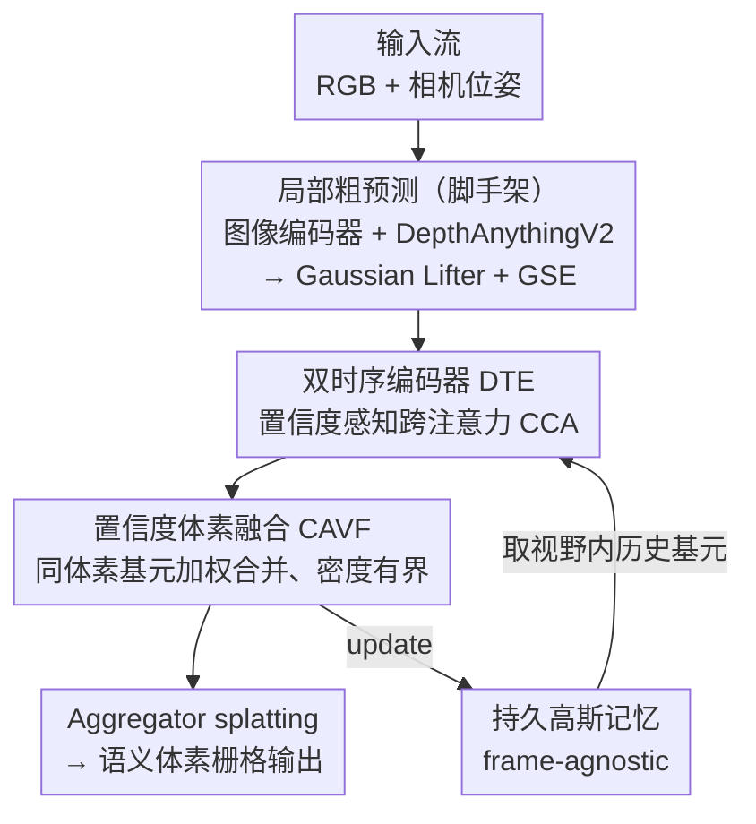

# TGSFormer: Scalable Temporal Gaussian Splatting for Embodied Semantic Scene Completion

**会议**: CVPR 2026  
**论文**: [CVF Open Access](https://openaccess.thecvf.com/content/CVPR2026/html/Qian_TGSFormer_Scalable_Temporal_Gaussian_Splatting_for_Embodied_Semantic_Scene_Completion_CVPR_2026_paper.html)  
**代码**: https://github.com/Made-Gpt/TGSFormer （论文标注 "Code will be released"，发稿时未必可用）  
**领域**: 3D视觉  
**关键词**: 语义场景补全, 3D高斯, 具身感知, 时序融合, 在线建图

## 一句话总结
TGSFormer 用一块持久的高斯记忆 + 置信度感知的时序融合，把具身语义场景补全（embodied SSC）做成了「随探索无限扩张、但基元数量始终有界」的前馈框架，在 monocular 和 embodied 两类 benchmark 上都刷到 SOTA，且用的高斯基元比对手少 20% 以上。

## 研究背景与动机
**领域现状**：3D 语义场景补全（SSC）要从 2D 观测推断出稠密的几何 + 语义体素。主流分两类：稠密 voxel 方法（如 MonoScene、SurroundOcc）几何表达强但立方级开销大；object-centric 的稀疏方法（如 GaussianFormer）用 3D 高斯基元当元素，效率高、可微，逐渐成为新基座。具身（embodied）场景进一步要求模型沿着第一视角的视频流**在线**更新对环境的理解，因此既要几何表达力，又要时序稳定 + 可扩展 + 高效。

**现有痛点**：要做长程具身预测，关键是维护一块"已探索区域的预测记忆"，让每一帧的输出能和历史交互。但现有 embodied SSC 方法（EmbodiedOcc 等）几乎都在一个**预先设定的有界体积**里随机初始化稠密高斯基元来覆盖探索区——这既冗余又低效，而且一旦不知道边界先验就直接失效，没法扩展到真实无界场景。近期 depth-guided 的初始化方案（SplatSSC）缓解了冗余，但它只做局部预测、没有长程记忆机制，观测一多就噪声累积、显存爆炸。另一类时空方法（ST-Occ、ST-GS）短程时序融合不错，但依赖帧间连贯性（frame-to-frame coherence），关键帧缺失或不一致时预测就崩。

**核心矛盾**：长程具身探索下，"保留可靠历史预测"和"保持表示紧凑/有界"之间存在根本冲突——要记得多就基元爆炸，要省内存就丢历史；同时依赖帧间连贯又让系统对缺帧脆弱。

**本文目标**：在一个统一的高斯表示里同时解决三件事——基元的初始化、时序融合、记忆有界，做到无边界全局补全、且不依赖图像连贯性。

**切入角度**：作者观察到，与其缓存帧（frame cache）做对齐，不如维护一块**通过特征关联更新的持久高斯记忆**——记忆里存的是高斯基元本身，靠"当前基元 ↔ 历史基元"的跨注意力来融合，从而摆脱对连续图像流的依赖（frame-agnostic）。

**核心 idea**：用一块持久、紧凑的高斯记忆替代"有界体积随机初始化 + 帧缓存"，再用置信度感知的时序融合（DTE）和体素融合（CAVF）来保证融合可靠、基元有界，把局部 depth-guided SSC 接到大规模具身感知上。

## 方法详解

### 整体框架
TGSFormer 是一个前馈架构，处理连续的第一视角观测流 $X=\{x_1, x_2, \dots\}$，每个 $x_t=\{I^t_{rgb}, P_t\}$ 含当前 RGB 图和相机位姿，目标是维护一块表示已探索区语义的全局高斯记忆 $M_t$。整条流水线分两阶段：**(1) 单目局部预测**——并行的图像编码器 + DepthAnythingV2 抽外观特征和几何先验，喂给 Gaussian Lifter 生成当前帧高斯基元，再过若干 Gaussian Encoder（GSE）块得到局部粗表示 $\{G_t, Q_t\}$；**(2) 高斯记忆维护**（本文核心）——从历史记忆 $M_{t-1}$ 里取出落在当前视野内的历史基元 $\{\hat G, \hat Q\}$，双时序编码器（DTE）对当前/历史两组基元做置信度感知的跨注意力融合，输出精修后的两组基元，再由置信度体素融合（CAVF）模块合并落在同一体素的基元、控制密度，最后由 aggregator 把合并后的高斯 splat 进语义体素栅格并更新全局记忆。

记忆更新写成 $M_t = \mathrm{MTGSFormer}(x_t, M_{t-1})$，$t=1$ 时局部预测直接当作初始记忆 $M_1=\{G_1, Q_1\}$。当退化到单目自精修模式时，查询操作 $\{\hat G, \hat Q\}=\{G_t, Q_t\}$，整套机制自然变成单帧自精修。

### 关键设计

**1. 持久高斯记忆：用特征关联替代帧缓存，做到无边界且有界**

针对"有界体积随机初始化不可扩展、帧缓存依赖连贯性"的双重痛点，TGSFormer 不再在预设体积里铺满随机高斯，也不缓存历史帧，而是维护一块**累积式的高斯记忆** $M_t$，存的是高斯基元及其嵌入 $\{G, Q\}$。每来一帧，它只检索记忆里**落在当前视野（field-of-view）内**的历史基元参与融合，而非全量对齐整个场景；融合结果再写回记忆。这样一来，场景可以随探索无限向外扩张（borderless），无需任何边界先验；同时因为更新是"在已有基元上做特征关联 + 体素合并"而不是不断 append 新基元，记忆的基元总数被约束在有界范围。这正是它"frame-agnostic"的来源——预测不再脆弱地绑在帧间连贯性上，缺帧也不影响记忆里已经稳定下来的几何语义。消融里那个简单 baseline TGSFormer-C（直接拼接加载进来的历史高斯）在具身场景明显掉点，反衬出这套有原则的记忆维护机制的必要性。

**2. 双时序编码器 DTE + 置信度估计：让可靠的基元主导融合**

把当前局部基元和历史记忆基元放一起融合时，两边都可能有不可靠的预测，直接对称融合会让噪声互相污染。DTE 用两个**权重共享**的时序编码器做双流交叉：一支以当前基元 $\{G_t, Q_t\}$ 查询历史 $\{\hat G, \hat Q\}$，另一支反过来，分别产出更新特征 $Q^c_t = \mathrm{CCA}(Q_t, \hat Q, C_t, \hat C)$ 和 $\hat Q^c = \mathrm{CCA}(\hat Q, Q_t, \hat C, C_t)$；单目模式则退化成只对单帧做自注意力 $Q^c_t=\mathrm{CCA}(Q_t,Q_t,C_t,C_t)$。

关键在于每个基元都带一个**置信度分数** $C_i\in[0,1]$ 来调制信息流，它联合评估语义不确定性和几何稳定性。语义侧用 softmax 后概率 $\tilde c_i$ 的 Shannon 熵 $H(\tilde c_i)=-\sum_k \tilde c^k_i \log \tilde c^k_i$ 度量——熵越高越不确定；几何侧直接用基元不透明度 $a_i$ 表示几何确定性。最终

$$C_i = \underbrace{\left(1-\min(H(\tilde c_i)/H_{max},\,1)\right)^p}_{C_{sem}} \cdot\, a_i,$$

其中 $H_{max}$ 是最大熵超参、$p$ 控制幂变换的锐度。这个置信度在 CCA 里做**两处调制**（消融证明这是最优组合）：历史 value 投影后乘以历史置信度 $V'=V\odot\hat C$，注意力聚合输出再乘当前置信度 $C_t$ 后才过输出投影：

$$\mathrm{CCA}(Q_t,\hat Q,C_t,\hat C)=\big(\mathrm{Concat}(\mathrm{MHA}(Q,K,V'))\odot C_t\big)W_o.$$

双重调制确保高置信基元的信息被信任并传播、低置信/不确定基元在时序融合中被抑制——这就是它比对称融合稳的原因。

**3. 置信度体素融合 CAVF：免训练地把基元数量压回有界**

具身探索越久，高斯基元越容易指数膨胀。CAVF 是一个**免训练的可微体素融合模块**：把当前局部基元和历史基元按其 3D 均值 $\mu_i$ 体素化、映射到体素索引 $s$（体素化只作分组用），凡落在**同一体素**的基元合并成一个新基元。合并权重来自该体素内基元置信度的 softmax：

$$w_{i\to s}=\frac{\exp(C_i/T)}{\sum_{j:V_j=s}\exp(C_j/T)},$$

$T$ 是温度超参。新基元的所有属性（$\mu, s, q, c$）和特征用置信度加权求和得到 $G_s=\sum_{i:V_i=s} w_{i\to s}G_i$、$Q_s=\sum w_{i\to s}Q_i$。这一步在不引入额外训练参数的前提下显著减少基元总数——消融里换不同体素粒度（0.08m→0.14m）可以在精度和显存间权衡，0.12m 时每帧显存仅 859 MiB（不用 CAVF 是 4086 MiB），mIoU 反而更高。本质上 CAVF 把"记忆有界"这件事落到了体素分辨率上：分辨率决定了同一区域最多保留多少个基元。

**4. 多阶段监督 + 两阶段训练：先建单帧先验，再学时序融合**

直接端到端训练具身预测会收敛不稳——模型得同时学单帧感知和时序融合两件难事。作者拆成两阶段：**Stage 1 单目预训练**用跨场景随机采样的帧（去掉时序相关性）建立一个 scene-agnostic 的感知先验，SSC 损失是 focal + Lovász + geometry scale loss 的精简组合 $L_{ssc}=\lambda_1 L_{focal}+\lambda_2 L_{lovasz}+L^{geo}_{scale}$；同时对 GSE 和 DTE 的输出都做监督，并给第 $j$ 层输出加衰减权重 $w_j=\frac{2^j}{2^n-1}$（高层预测更重要），总目标 $L_{total}=\sum_j w_j L^j_{ssc}$。**Stage 2 具身微调**按场景分组以保留时序连续性，并且**只更新 DTE、冻结其余组件**——这逼着 DTE 专心学"对齐当前/历史的几何与语义"，不破坏已经练好的单帧表示。多阶段监督还顺带让中间层高斯特征向最终编码器空间对齐（PCA 可视化显示分布更各向同性、更语义有序）；消融表明监督加在 Stage 1+2 最好，全程都加反而过约束、掉点。

### 损失函数 / 训练策略
见上方第 4 点：Stage 1 用 $L_{total}=\sum_{j=1}^n w_j L^j_{ssc}$ 做多层衰减加权监督，$L_{ssc}$ 为 focal + Lovász + geometry scale loss；Stage 2 仅微调 DTE，其余冻结。

## 实验关键数据

数据集：monocular 在 Occ-ScanNet / Occ-ScanNet-mini，embodied 在 EmbodiedOcc-ScanNet / -mini。指标为几何 IoU 和语义 mIoU。

### 主实验

| 任务 / 数据集 | 指标 | 本文 TGSFormer | 之前 SOTA | 提升 |
|--------------|------|------|----------|------|
| Monocular / Occ-ScanNet | IoU / mIoU | 64.42 / 54.73 | SplatSSC 62.83 / 51.83 | +1.59 / +2.90 |
| Monocular / Occ-ScanNet-mini | IoU / mIoU | 66.19 / 55.82 | SplatSSC 61.47 / 48.87 | +4.72 / +6.95 |
| Embodied / EmbodiedOcc-ScanNet | IoU / mIoU | 54.42 / 45.29 | RoboOcc 53.30 / 44.05 | +1.10 / +1.20 |

embodied 上不仅刷到 SOTA，还**少用 20%+ 的高斯基元**（Fig.1），且在 11 类里 7 类最优（少数大块均匀区域因特征平滑略掉点）。对照 baseline TGSFormer-C（直接拼接历史高斯）在 embodied 只有 37.40 IoU / 37.40-ish 表现，单目强但具身崩，凸显"有原则的记忆维护"不可省。

### 消融实验

| 配置 | 每帧显存(MiB) | IoU↑ | mIoU↑ | 说明 |
|------|------|------|------|------|
| w/o CAVF | 4086.0 | 60.48 | 41.84 | 不融合，基元爆炸 |
| CAVF, 0.12m, w/o Conf | 876.1 | 59.76 | 45.76 | 体素融合但不用置信度 |
| CAVF, 0.10m, w/ Conf | 1124.3 | 64.35 | 50.38 | — |
| **CAVF, 0.12m, w/ Conf（本文）** | **859.0** | **64.16** | **50.55** | 精度↑显存↓最优权衡 |
| CAVF, 0.14m, w/ Conf | 671.0 | 63.45 | 49.88 | 体素更粗，略掉点 |

时序编码器消融（embodied）：无时序 49.35 mIoU；单流 ca 反而掉到 48.52；双流 dual ca 无置信度 48.29；**dual ca + 置信度调制 49.70**（IoU +1.67）——双流 + 置信度缺一不可。CCA 调制位置消融：仅 $C_v+C_a$ 两处调制最优（mIoU 54.41），单独调 query/output 都不如。监督策略：Stage 1+2 监督最好（embodied 49.70 mIoU），只在 Stage 2 或全程监督都更差。

### 关键发现
- CAVF 是显存与精度的双赢点：去掉它显存 4086→859 MiB（降 79%），mIoU 反而从 41.84 升到 50.55——融合不仅省内存，还消除了冗余基元带来的噪声。
- 置信度调制是时序融合的命门：双流交叉若不带置信度（dual ca w/o conf）IoU 仅 +1.13 但 mIoU 掉 1.06，加上置信度才同时把几何和语义拉正。
- 增益不只来自 DepthAnythingV2 的强深度：Gaussian 初始化消融里，把深度估计器换成更弱的模型，TGSFormer 仍稳居最优，说明记忆维护机制本身在贡献。

## 亮点与洞察
- **"记忆存基元、按视野检索"这条路线很巧**：相比缓存帧再对齐，存高斯基元让系统天然 frame-agnostic，缺帧不崩；只取视野内历史基元又把每帧的融合代价控制住——这套思路可迁移到任何需要在线增量建图的任务（SLAM 语义层、长视频 3D 重建）。
- **置信度用"熵×不透明度"统一了语义和几何两种不确定性**，且只在 value 和输出两处调制就够，设计很克制；这种"用可解释标量门控 attention"的做法可复用到其他多源融合场景。
- **CAVF 把"记忆有界"落到体素分辨率上**——一个免训练、可微的合并算子就同时解决了基元爆炸和噪声累积，思路干净，几乎零额外开销。
- **"冻结主干只调 DTE"的两阶段训练**是个朴素但有效的工程洞察：把单帧感知和时序融合解耦学习，避免互相干扰。

## 局限与展望
- 作者承认在**大块均匀区域**（如大片墙面）因特征平滑会略掉点，11 类里有 4 类不是最优。
- CAVF 的"记忆有界"依赖体素分辨率超参 $T$、voxel size 的选择，太粗会掉精度（0.14m 已可见下降）；置信度公式里 $H_{max}, p$ 也是需调的超参，论文未给敏感性曲线。
- 评测全在 ScanNet 系室内数据上，对室外/大尺度无界场景的真实可扩展性、以及动态物体的处理（当前假设静态场景）尚未验证。
- 详细 dataset/实现/指标定义都被放进了 supplementary，正文对部分细节（如 confidence 的幂变换标定）交代偏简，复现需查附录。⚠️ 部分超参与定义以原文及附录为准。

## 相关工作与启发
- **vs EmbodiedOcc / RoboOcc**：它们在预设有界体积里随机初始化稠密高斯做在线 refine，需要边界先验且基元冗余；TGSFormer 用持久记忆 + depth-guided 初始化做到无边界、更少基元，embodied 上 IoU/mIoU 双超且省 20%+ 基元。
- **vs SplatSSC**：SplatSSC 把 depth-guided 初始化用在局部 SSC、效果强但无长程记忆，观测一多就噪声累积；TGSFormer 直接把它当作"局部粗预测"组件接上记忆维护，monocular 也反超它（+2.90 mIoU on Occ-ScanNet）。
- **vs ST-Occ / ST-GS**：这些时空方法靠帧间连贯做短程融合，缺帧脆弱；TGSFormer 的 frame-agnostic 记忆不依赖连贯性，更适合真实具身探索。

## 评分
- 新颖性: ⭐⭐⭐⭐ 把"持久高斯记忆 + 置信度时序/体素融合"统一进 embodied SSC，frame-agnostic 路线有辨识度，但各组件多在已有范式上改良。
- 实验充分度: ⭐⭐⭐⭐⭐ monocular/embodied 双任务 + 显存维度，消融覆盖 CAVF/DTE/CCA 调制位置/监督策略/初始化，相当扎实。
- 写作质量: ⭐⭐⭐⭐ 结构清晰、公式完整，但关键细节（数据集/指标定义）下放附录，正文略紧凑。
- 价值: ⭐⭐⭐⭐ 为大规模、记忆驱动的在线 3D 感知给了一个紧凑高效的可扩展基座，工程落地价值高。

<!-- RELATED:START -->

## 相关论文

- [\[CVPR 2026\] Learning Spatial-Temporal Consistency for 3D Semantic Scene Completion](learning_spatial-temporal_consistency_for_3d_semantic_scene_completion.md)
- [\[AAAI 2026\] Towards Temporal Fusion Beyond the Field of View for Camera-based Semantic Scene Completion](../../AAAI2026/3d_vision/towards_temporal_fusion_beyond_the_field_of_view_for_camera-based_semantic_scene.md)
- [\[AAAI 2026\] SplatSSC: Decoupled Depth-Guided Gaussian Splatting for Semantic Scene Completion](../../AAAI2026/3d_vision/splatssc_decoupled_depth-guided_gaussian_splatting_for_semantic_scene_completion.md)
- [\[CVPR 2026\] Multi-modal Frequency Decomposition Network for Semantic Scene Completion](multi-modal_frequency_decomposition_network_for_semantic_scene_completion.md)
- [\[CVPR 2026\] SAGE: Scalable Agentic 3D Scene Generation for Embodied AI](sage_scalable_agentic_3d_scene_generation_for_embodied_ai.md)

<!-- RELATED:END -->
