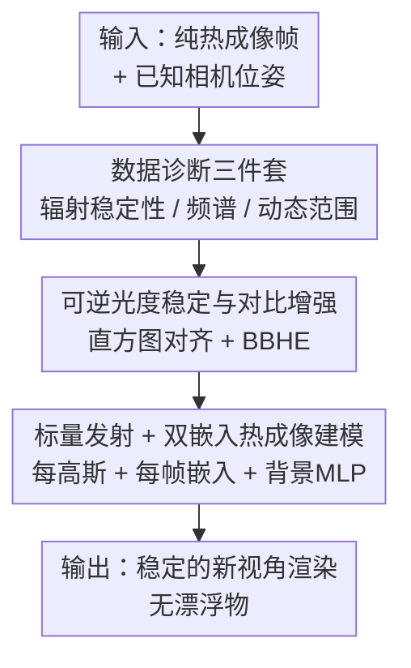

# Thermal is Always Wild: Characterizing and Addressing Challenges in Thermal-Only Novel View Synthesis

**会议**: CVPR 2026  
**论文**: [CVF Open Access](https://openaccess.thecvf.com/content/CVPR2026/html/Aydin_Thermal_is_Always_Wild_Characterizing_and_Addressing_Challenges_in_Thermal-Only_CVPR_2026_paper.html)  
**代码**: [项目主页 nubivlab.github.io/wild_thermal](https://nubivlab.github.io/wild_thermal)  
**领域**: 3D视觉  
**关键词**: 热成像, 新视角合成, 3D高斯泼溅, in-the-wild外观建模, 光度稳定

## 一句话总结
针对"只用热成像、没有 RGB 引导"的新视角合成（NVS）这个老大难问题，本文先系统刻画了便宜微测辐射热计（microbolometer）传感器带来的三类退化——超低动态范围、帧间光度抖动 + 缓慢辐射漂移、纹理匮乏，再据此设计了一条轻量"可逆光度稳定 + 热成像专用 3DGS"流水线：前端用可逆的直方图对齐 + 双直方图均衡把动态范围撑开并消除漂移，后端把每个高斯简化成单通道标量发射、再用「每高斯 + 每帧」双嵌入吸收残余抖动，在六个纯热成像数据集上无需逐数据集调参就拿到 SOTA（平均 PSNR 从 baseline 3DGS 的 22.25 dB 提到 26.14 dB）。

## 研究背景与动机

**领域现状**：新视角合成（NeRF / 3D Gaussian Splatting）在 RGB 上已经非常成熟，能从一组带位姿的图像里重建出几何与外观，广泛用于机器人、自动驾驶、AR/VR。它之所以好用，靠的是 RGB 图像天然具备的丰富纹理、稳定光度和跨视角一致的观测。

**现有痛点**：把这套 RGB 管线直接搬到热成像上会崩。热成像的价值恰恰在黑夜、烟雾、火灾这些 RGB 失效的场景，但便宜的微测辐射热计传感器有一堆"野性"退化：① 帧间光度不一致（传感器自身发热导致整帧亮度漂移）；② 微测辐射热计的"软化"让冷热过渡糊成一片；③ 渐晕（vignetting）造成视角相关的亮度衰减；④ 固定模式噪声（fixed-pattern noise）。这些都破坏多视角一致性，让对应点估计失稳、合成时长出高频"漂浮物"（floater）。

**核心矛盾**：正因为热成像难，过去绝大多数工作都依赖**配对的 RGB–热成像**输入——用 RGB 恢复几何、把热成像当成附加通道往几何上"刷颜色"。但这等于要求在 RGB 还能用的条件下采集，直接背离了热成像"在 RGB 失效时才最有用"的初衷。于是真正需要的是**纯热成像（thermal-only）NVS**，可一旦抽掉 RGB 分支，这些跨模态方法的几何监督就塌了。

**本文目标**：（1）严格刻画真实多视角热成像数据到底"野"在哪、哪些退化最伤 NVS；（2）造一条不依赖 RGB、不需要逐数据集调参的纯热成像 NVS 流水线。

**切入角度**：作者先做数据分析——用三个诊断量（辐射稳定性、空间频谱、有效动态范围）量化热成像与 RGB 的差距，发现"低动态范围 + 光度漂移"是最致命且可被预处理缓解的两个因素。既然问题出在输入信号本身不稳，那就先把信号"喂顺"，再用一个表达力更强、对帧间波动更宽容的渲染表示去吸收残余抖动。

**核心 idea**：用**可逆的光度稳定/对比增强**把输入"洗干净"，再用**标量发射 + 双嵌入的 in-the-wild 3DGS**把残余的帧相关波动建模进去，而不是像 Thermal3D-GS 那样只用基于衰减的大气模型去硬套——后者表达力不够，遇到异常亮帧就会漏拟合并喷出漂浮物。

## 方法详解

### 整体框架
整篇方法回答一个问题：给定一批纯热成像帧 + 已知相机位姿（位姿假设已知，因为从热成像本身估位姿同样很难，通常还得靠 RGB 或 IMU），怎么稳定地合成新视角。流水线分两段串行：**前端预处理**把每帧的辐射对齐到一个时间平滑的参考分布、并撑开动态范围，输出稳定且高对比的训练帧；**后端热成像专用 3DGS** 用单通道标量发射 + 双嵌入 + 背景 MLP 来建模外观，把预处理之后还残留的帧相关波动（自发热、轻微渐晕、固定模式噪声）吸收掉，从而既保住几何又稳住辐射。这两段都由前面对数据的诊断分析驱动——先量出"野"在哪，再对症下药。

### 关键设计

**1. 数据诊断三件套：量化热成像到底"野"在哪，为预处理对症下药**

作者没有上来就改网络，而是先对六个公开多视角热成像数据集（Lin et al.、Ye et al.、MVTV、MSX、ThermalMix、TI-NSD，覆盖非制冷微测辐射热计与制冷探测器、室内外、静态与移动采集）做诊断，定义三个量。第一个是**相对均值强度变化** $\Delta I_t = \frac{\mu_t - \bar{\mu}}{\bar{\mu}}$，其中 $\mu_t$ 是第 $t$ 帧的均值、$\bar{\mu}$ 是整段序列的平均强度；$\Delta I_t$ 波动大说明有曝光漂移或传感器发热，会破坏亮度恒定假设、催生漂浮物——实测热成像序列的 $\Delta I_t$ 标准差显著高于 RGB。第二个是**径向平均功率谱** $S_t(f) = \frac{1}{N_f}\sum_{\|(u,v)\|\approx f}|\mathcal{F}(I_t)(u,v)|^2$，刻画能量在频率上的分布；热成像因微测辐射热计的平滑特性，高频能量普遍被压低，意味着纹理和锐边这类 NVS 赖以对齐的线索变弱。第三个是**像素强度直方图**，用来看有效动态范围——热成像往往只占很窄一段强度空间，对比度低、优化梯度弱。三个诊断共同把"低动态范围 + 光度漂移"锁定为最该先处理的两个因素，直接决定了后面预处理模块的形态。这一刻画本身就是论文标题"Characterizing"那一半的贡献。

**2. 可逆光度稳定与对比增强：先把信号洗顺，且能无损还原回原始辐射尺度**

针对诊断出的帧间漂移 + 低动态范围，作者设计了一个**两步、单调、可解析求逆**的变换。第一步是序列直方图对齐：维护一个指数平滑的参考累积分布函数（CDF） $F_t^{*}(x) = (1-\alpha)F_{t-1}^{*}(x) + \alpha F_t(x)$，再把当前帧映射过去 $I_t'(x) = (1-\beta)x + \beta F_t^{*-1}(F_t(x))$，其中 $\alpha$ 控制时间平滑、$\beta\in[0,1]$ 在"保持原样"与"完全对齐"之间权衡——这一步在抑制光度漂移的同时还能平滑跟随场景的真实缓变。第二步对 $I_t'$ 做**保亮度双直方图均衡（BBHE）**：在均值 $T_t^{\mu}$ 处把直方图劈成两半、上下子区间各自独立均衡，$\hat{I}_t(x)=T_t^{L}(x)$ 当 $x\le T_t^{\mu}$、否则 $T_t^{U}(x)$，从而撑开动态范围、增强对比却不整体抬亮。关键点在于两步都是单调一一映射，整体变换**解析可逆**，可以用一张查找表（LUT）把增强后的强度无损映射回原始辐射尺度——这保证预处理不会破坏后续做辐射测量/温度恢复的可能性，区别于普通直方图均衡那种不可逆、会丢辐射信息的处理。

**3. 标量发射 + 双嵌入的 in-the-wild 热成像建模：用表达力换稳定，吸收残余抖动而不扭曲几何**

预处理之后还有残余的帧相关波动，作者把 3D Gaussian Splatting 改造成热成像版来吸收它。首先**简化发射模型**：热成像的发射近似各向同性、单通道，所以不再像 RGB 那样用球谐（SH）预测彩色，每个高斯只存一个**标量发射值**——既贴合热成像物理、又降低了颜色建模复杂度，但代价是对帧相关波动更敏感。为此引入 **in-the-wild 外观嵌入**：给每个高斯一个可学习嵌入 $\mathbf{e}_i^{(g)}$（编码空间外观）、给每帧一个嵌入 $\mathbf{e}_t^{(f)}$（捕获残余时间伪影），用一个轻量 MLP 映射成发射值 $c_i(t) = f_\theta(\mathbf{e}_i^{(g)}, \mathbf{e}_t^{(f)})$，再代入标准 3DGS 透射率合成 $\hat{I}_t(\mathbf{r}) = \sum_i T_i\,\alpha_i\,c_i(t)$。这样自发热、轻微渐晕、固定模式噪声这类平滑的帧相关变化都被每帧嵌入"吸"掉，不会扭曲底层几何；推理时**固定帧嵌入**即可得到时间稳定的重建而不影响空间细节。此外用一个**背景 MLP** $b_\phi$ 处理远景，渲染强度按残余透射率 $m(\mathbf{r})=\exp(-\sum_i \alpha_i)$ 混合前景与背景 $\tilde{I}_t(\mathbf{r}) = (1-m(\mathbf{r}))\hat{I}_t(\mathbf{r}) + m(\mathbf{r})\,b_\phi(\mathbf{d}, \mathbf{e}_t^{(f)})$。与现有 SOTA Thermal3D-GS 的本质区别在于：后者的 ATF 模块源自大气衰减建模，只能表达强度衰减，遇到异常亮帧会漏拟合、把它当漂浮物喷到各个新视角；本文不去建模大气散射，而是用"稳定输入 + 表达力更强的嵌入条件发射"在一个一致的辐射空间里同时容纳亮帧和暗帧，从根上避免漂浮物。

### 损失函数 / 训练策略
训练目标是三项加权和 $\mathcal{L} = \lambda_1\mathcal{L}_{\text{L1}} + \lambda_2\mathcal{L}_{\text{HSSIM}} + \lambda_3\mathcal{L}_{\alpha}$：L1 像素误差、热感知结构相似度（heat-aware SSIM，强调热成像对比与结构）、以及背景正则项 $\mathcal{L}_\alpha$（抑制把背景区域当成漂浮物）。实现基于 GSplat 可微光栅化后端，改成单通道热成像；发射 MLP 为 3 层隐藏、宽度 128、ReLU + 线性输出。用 Adam + 权重衰减，对几何/不透明度/外观参数用不同学习率，不做学习率调度，训练 30k 次迭代（单张 RTX A6000）。高斯中心由稀疏 COLMAP 重建初始化（热成像下 COLMAP 几何稳定但稀疏）。所有场景以 1080p 渲染，定量评估时裁剪缩放到原始传感器分辨率以与 GT 像素对齐。

## 实验关键数据

### 主实验
在六个公开多视角热成像数据集上做纯热成像 NVS 对比（报告各场景平均 PSNR / SSIM）。对比方法包括通用 NeRF、3DGS，热成像专用的 ThermalMix-TS（基于 InstantNGP），两个跨模态方法 Lin et al. 的 ThermalNeRF 与 ThermoNeRF（关掉 RGB 分支与跨模态正则做纯热成像评测），以及当前 SOTA 的 Thermal3D-GS。所有方法在相同数据划分、迭代数、硬件下训练。结论是本文在各数据集取得**最佳或次佳**的 PSNR/SSIM，并在最难的序列上仍保持稳定（无漂浮物）。

下表为消融表（Tab. 2）中可直接读到的「3DGS baseline vs. 本文完整模型」逐数据集对比，能直观看到本文相对标准 3DGS 的增益：

| 数据集场景 | 指标 | 3DGS Baseline | 本文 Ours |
|------|------|------|------|
| MSX-Ebike | PSNR / SSIM | 20.45 / 0.86 | 25.97 / 0.92 |
| T.Mix-Lion | PSNR / SSIM | 19.25 / 0.71 | 24.25 / 0.81 |
| MVTV-Human | PSNR / SSIM | 21.21 / 0.81 | 26.18 / 0.90 |
| Lin et al.-Sink | PSNR / SSIM | 20.81 / 0.74 | 24.27 / 0.88 |
| Ye et al.-Seq.1 | PSNR / SSIM | 28.24 / 0.83 | 33.32 / 0.90 |
| TINSD-Sitting | PSNR / SSIM | 29.51 / 0.88 | 30.01 / 0.87 |
| **平均** | PSNR / SSIM | **22.25 / 0.81** | **26.14 / 0.88** |

> ⚠️ Tab. 1（各对比方法在六个数据集上的逐方法数值）原文以表格给出，本缓存仅给出文字结论（本文最佳/次佳），具体每方法数字以原文为准。

效率方面：本文每场景训练约 11 min，略慢于 3DGS（5 min）与 Thermal3D-GS（9 min），但换来重建保真度与时间稳定性的明显提升，作者认为是划算的质量–效率折中。

### 消融实验
Tab. 2 验证预处理与发射建模是两个独立且互补的增益来源（六场景平均）：

| 配置 | 平均 PSNR (dB) | 平均 SSIM | 说明 |
|------|---------|---------|------|
| 3DGS (Baseline) | 22.25 | 0.81 | 标准 3DGS 直接用 |
| 3DGS + 预处理 | 23.01 | 0.83 | 仅加可逆光度稳定/增强 |
| 3DGS + 发射 MLP | 24.93 | 0.87 | 仅加双嵌入 in-the-wild 发射建模 |
| Ours（两者合一） | 26.14 | 0.88 | 完整模型 |

### 关键发现
- **发射建模（in-the-wild 双嵌入）贡献最大**：单加它就把平均 PSNR 从 22.25 抬到 24.93 dB，因为固定高斯颜色无法表达残余时间伪影，而每帧嵌入能吸收它。
- **预处理单独增益温和但稳定**：22.25 → 23.01 dB，主要靠稳住帧间辐射波动；更重要的是它为发射模型提供了更强的梯度，所以**两者合一（26.14 dB）优于各自之和**，存在协同效应。
- **增益场景相关**：Human、Ebike、Lion、Seq.1 这些原本较难的场景提升明显；Sitting 因为 baseline 重建已经很好，增益较小（30.01 vs baseline 29.51）。
- **对抗漂浮物是核心优势**：定性上（Fig. 7）单个光度异常帧会让 Thermal3D-GS 长出逐帧漂移、最终拼成整张训练视角的亮色漂浮物，而本文因输入稳定 + 嵌入条件发射保持几何稳定，长相机轨迹下尤其明显。

## 亮点与洞察
- **"先刻画再设计"的方法论**：用三个可量化诊断（$\Delta I_t$、功率谱、动态范围直方图）把热成像的"野"拆成可处理的具体退化，再针对性地造模块——比直接堆网络更有说服力，也解释清了"为什么 RGB 管线会崩"。
- **可逆预处理是个被忽视的巧设计**：用 LUT 保证直方图对齐 + BBHE 整体解析可逆，既撑开动态范围又不丢辐射信息——这一点对后续要做温度/辐射测量的下游任务很关键，普通直方图均衡做不到。
- **"用表达力换稳定"对比"用物理模型硬套"**：本文不去精细建模大气散射，而是承认热成像波动是"野"的、用每帧嵌入去吸收它，反而比 Thermal3D-GS 的 ATF 衰减模型更稳。这个"与其建模不如吸收"的思路可迁移到任何传感器噪声不可精确建模的 in-the-wild 重建。
- **单通道标量发射 + 去掉球谐**：贴合热成像各向同性单通道物理，顺手降低了建模复杂度——把领域先验写进表示而非靠数据学，是个干净的简化。

## 局限与展望
- **依赖已知相机位姿**：作者明确假设所有方法位姿已知，而纯热成像估位姿本身极难（往往仍需 RGB 或 IMU），所以这条流水线还没真正做到"端到端纯热成像"。
- **几何初始化仍靠 COLMAP**：高斯中心来自稀疏 COLMAP 重建，热成像下几何稀疏，若 COLMAP 在极弱纹理场景失败，整条流水线会受影响。
- **训练略慢**：每场景约 11 min，比 3DGS / Thermal3D-GS 慢，移动/实时场景需进一步提效。
- **预处理对"真实场景剧变"的鲁棒性**：指数平滑参考 CDF 在场景真实快速变化时如何不把真实变化也"抹平"，$\alpha/\beta$ 的设置敏感性原文主要在补充材料讨论，值得进一步验证。

## 相关工作与启发
- **vs RGB–热成像跨模态方法（ThermalNeRF、ThermoNeRF）**：它们用 RGB 驱动几何、热成像刷辐射，几何质量好但要求配对采集，背离热成像在 RGB 失效场景的价值；抽掉 RGB 后几何就塌、纹理糊。本文从头为纯热成像设计，不依赖任何 RGB 引导（除位姿外）。
- **vs Thermal3D-GS（当前 SOTA）**：它用 ATF（大气衰减）+ TCM（温度一致性）模块改进 3DGS，但 ATF 只建模强度衰减，遇异常亮帧漏拟合、喷漂浮物。本文不建大气模型，改用稳定输入 + 表达力更强的嵌入条件发射，在统一辐射空间容纳亮暗帧，从根上消除漂浮物。
- **vs 标准 3DGS / NeRF**：它们假设丰富纹理 + 稳定光度 + 跨视角一致，这些在热成像上都不成立，故 NeRF 普遍最差、3DGS 在 ThermalMix/MVTV 上 PSNR 明显下降甚至不收敛。本文把领域先验（单通道、可逆增强、帧嵌入）写进表示来补这些假设缺口。
- **承自 in-the-wild NVS**：把"每帧嵌入吸收外观变化"这一 RGB 端 in-the-wild 范式迁到热成像域，针对低对比、辐射漂移、位姿不精确做了领域适配。

## 评分
- 新颖性: ⭐⭐⭐⭐ 把 in-the-wild 范式迁到纯热成像并配可逆预处理，组合新颖、问题定义清晰，单个组件偏工程整合。
- 实验充分度: ⭐⭐⭐⭐ 六数据集 + 完整消融 + 漂浮物定性分析，但主表逐方法数值在缓存中未展开。
- 写作质量: ⭐⭐⭐⭐⭐ "先诊断再设计"的叙事顺，公式与动机咬合紧，可逆性等关键点交代到位。
- 价值: ⭐⭐⭐⭐ 纯热成像 NVS 在黑夜/烟雾/救援等场景实用价值高，且无需逐数据集调参。

<!-- RELATED:START -->

## 相关论文

- [\[CVPR 2026\] PhysIR-Splat: Physically Consistent Thermal Infrared Radiative Transfer in 3D Gaussian Splatting](physir-splat_physically_consistent_thermal_infrared_radiative_transfer_in_3d_gau.md)
- [\[ECCV 2024\] Thermal3D-GS: Physics-induced 3D Gaussians for Thermal Infrared Novel-view Synthesis](../../ECCV2024/3d_vision/thermal3d-gs_physics-induced_3d_gaussians_for_thermal_infrared_novel-view_synthe.md)
- [\[CVPR 2026\] Splatent: Splatting Diffusion Latents for Novel View Synthesis](splatent_splatting_diffusion_latents_for_novel_view_synthesis.md)
- [\[CVPR 2026\] CoRoGS: Contextual Gaussian Splatting for Robust Large-Deviation View Synthesis](corogs_contextual_gaussian_splatting_for_robust_large-deviation_view_synthesis.md)
- [\[CVPR 2026\] GeodesicNVS: Probability Density Geodesic Flow Matching for Novel View Synthesis](geodesicnvs_probability_density_geodesic_flow_matching_for_novel_view_synthesis.md)

<!-- RELATED:END -->
