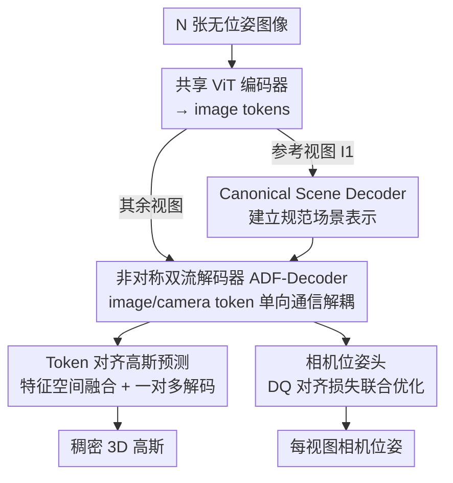

# TokenSplat: Token-aligned 3D Gaussian Splatting for Feed-forward Pose-free Reconstruction

**会议**: CVPR 2026  
**论文**: [CVF Open Access](https://openaccess.thecvf.com/content/CVPR2026/html/Li_TokenSplat_Token-aligned_3D_Gaussian_Splatting_for_Feed-forward_Pose-free_Reconstruction_CVPR_2026_paper.html)  
**代码**: https://kidleyh.github.io/tokensplat/ (项目页)  
**领域**: 3D视觉  
**关键词**: 3D高斯泼溅, 前馈重建, 无位姿, 多视图融合, 相机位姿估计

## 一句话总结
TokenSplat 是一个前馈框架，从任意张无位姿多视图图像中一次性联合预测稠密 3D 高斯和相机位姿：核心是在**特征空间**而非像素/3D空间做 token 级跨视图融合（Token-aligned Gaussian Prediction），并用一个**非对称双流解码器**把相机位姿线索和场景语义解耦，无需迭代优化即可在无位姿设定下取得更高重建保真度和更准的位姿。

## 研究背景与动机

**领域现状**：3D Gaussian Splatting（3DGS）以远快于 NeRF 的速度实现高质量渲染，已成为新视图合成的主流表示。为了摆脱"每个场景单独优化"的低效，近年出现了**前馈（feed-forward）**变体——直接从输入图像预测 3D 高斯，能泛化到未见场景。

**现有痛点**：前馈方法大多依赖**精确的相机位姿**作为输入，而位姿要靠 SfM/COLMAP 跑出来，既慢又在弱纹理、稀疏视角等困难场景容易失败。为绕开这一点出现了"无位姿（pose-free）"框架，但它们普遍有两个硬伤：

- **位姿与场景纠缠**：把场景内容和视角线索塞进同一套特征嵌入里，导致相机参数难以从场景内容中分离，位姿误差会直接传染到 3D 重建。
- **像素对齐高斯的冗余**：沿用 pixel-aligned 3DGS 头，逐像素生成高斯。视图一多就产生大量重叠冗余高斯，造成几何模糊、颜色不一致。已有工作（FreeSplat / AnySplat）试图在 3D 空间做高斯属性融合压冗余，但融合范围是**局部**的，缺乏全局上下文推理，重建出来常是碎裂、不连贯的。

**核心矛盾**：要在**单次前馈**里同时干好两件事——既要把位姿和场景解耦（否则位姿误差污染重建），又要把多视图信息全局对齐去冗余（否则视图越多越糊）；而像素级、3D空间局部融合这两套传统做法，恰恰在"多视图、稠密、长序列"时同时失效。

**切入角度**：作者的观察是——**冗余和纠缠这两个问题的根都在"在哪里融合/在哪里建模"**。与其在像素或 3D 高斯空间事后融合，不如把跨视图对齐挪到**特征 token 空间**做，让语义对应的信息先在特征层面长程对齐；与其用对称注意力让相机和图像特征双向乱混，不如**强制信息单向流动**，把位姿和场景从一开始就分开建模。

**核心 idea**：用 **token 级特征融合** 替代像素/3D 空间融合来去冗余，用 **非对称双流解码** 替代对称注意力来解耦位姿与场景，从而在前馈一次过里同时得到连贯重建和稳定位姿。

## 方法详解

### 整体框架
TokenSplat 接收 $N$ 张无位姿图像 $\{I_i\}_{i=1}^N$，输出一组规范空间（canonical space）下的 3D 高斯 $\{(\mu_g,\sigma_g,r_g,s_g,c_g)\}$ 和每视图相对参考视图 $I_1$ 的相机外参 $P_i$。整条流水线是纯 Transformer、无迭代精修：先用**权值共享的 ViT 编码器**把每张图独立编码成 image token；参考视图 $I_1$ 走 **Canonical Scene Decoder**（cross-attention 吸收其它视图信息，建立规范场景表示）；其余视图走 **ADF-Decoder**，在这里 image token 和可学习的 camera token 通过方向受限的通信被同时精修、并把位姿和场景特征解耦。之后兵分两路：**Camera Pose Head** 从 camera token 回归每视图位姿；**Token-aligned Gaussian Prediction** 在特征空间融合多视图 token 再解码出稠密高斯。

### 关键设计

**1. 非对称双流解码器（ADF-Decoder）：让位姿和场景在单次前馈里就解耦**

针对"位姿与场景纠缠、误差互相传染"这个痛点。传统做法要么用对称注意力让所有特征双向混合（视角线索污染场景语义），要么靠迭代精修循环慢慢把位姿和几何掰开。ADF-Decoder 引入一组**可学习的 camera token**（每个非参考视图复制一份，专门承载该视图位姿），并对 image token 与 camera token 施加**方向受限的非对称更新**：image token 主要聚合场景上下文，camera token 只从 image token 抽取几何线索、且**只把稳定化的低频位姿对齐信号回传**给 image token。具体在 12 个 decoder block 里分三步通信——
- **分离自注意力**：image token 做视图内自注意力捕捉局部场景结构 $\hat t^I_i \leftarrow \mathrm{Softmax}(Q^I_i {K^I_i}^\top/\sqrt d)V^I_i$；camera token 则以图像 token 为 key/value 抽几何线索 $\hat t^c_i \leftarrow \mathrm{Softmax}(Q^c_i {K^I_i}^\top/\sqrt d)V^I_i$。
- **image token 跨视图注意力**：每个视图只对**其它视图**的 token 做 cross-attention（显式排除自身，防信息泄漏），key/value 沿空间维拼接 $[K^I_j]_{j\neq i}$；并用超参 $p_{nv}$ 把注意力限制到 $p_{nv}-1$ 个近邻，平衡上下文与算力。
- **camera token 跨注意力**：单靠相机 token 之间或单靠图像 token 都不足以捕捉全局几何，所以让每个 camera token 同时吸收**其它视图的图像 token 和相机 token**，做法是把复制后的相机 key/value 与图像 key/value 相加 $K^c_{cross_i}=[K^I_j]_{j\neq i}+[\mathrm{repeat}(K^c_j)]_{j\neq i}$ 再注意力。

此外因为 image token 和 camera token 数量、信息量差异大，对 image token 在注意力前后各做一次**相机 token 调制（pre/post-modulation）**稳定更新。这套"单向、非对称"的设计让位姿推理和场景重建互不污染又互相增益，是不靠迭代就能干净解耦的关键。

**2. Token 对齐高斯预测：在特征空间融合多视图，用一对多映射解绑高斯密度和像素分辨率**

针对"像素对齐高斯冗余 + 3D 空间局部融合碎裂"的痛点。该模块由 **Token Fusion** 和 **Gaussian Prediction Head** 两部分组成。Token Fusion 先为每个 token 预测**粗略位置**和**融合置信度**，再按空间邻近性以网格尺寸 $\epsilon$ 把 token 分组，用 softmax 归一化的置信度加权融合成一组合并 token——这一步等于在**特征层面**把多视图里语义对应、空间重叠的信息提前对齐合并，从源头压掉重叠冗余（融合网络采用 DPT 架构）。融合后的 Gaussian Prediction Head 做**一对多映射**：每个融合 token 解码出**多个**高斯（相对 token 的位置偏移 + 高斯属性），这就把"高斯数量"从"像素分辨率"中解耦出来，既能产生比逐像素更稠密、更有表现力的高斯，又保持结构完整与语义连贯。预测时还会把 Transformer 不同层的多尺度特征 $\{F_i\}$ 先投影对齐通道 $\hat F_i=\mathrm{Proj}_i(F_i)$，再从深到浅用残差融合模块逐级上采样融合 $F^{fusion}_i=\mathrm{RF}_i(\hat F_i,F^{fusion}_{i+1})$，让细粒度细节和高层语义结合后再出高斯。这种"特征空间融合 + 一对多"正是 TokenSplat 在长序列、高密度场景下不退化的根本原因——对比方法在 3D 高斯空间做局部融合，视图越多累积的不一致和冗余越严重。

**3. 相机位姿头 + 双四元数对齐损失：联合优化逼网络学几何一致特征**

针对"位姿要外部 SfM、且位姿与重建脱节"的问题。Camera Pose Head 直接吃 ADF-Decoder 产出的逐视图 camera token，用线性投影回归每个非参考视图相对 $I_1$ 的外参 $P_i$，完全不需要 COLMAP/RANSAC 这类外部位姿初始化。训练上把位姿和高斯重建**联合端到端优化**：渲染损失 $L_{render}=L_2(I,\hat I)+\lambda_{lpips}L_{lpips}(I,\hat I)$ 监督图像质量；位姿损失则用 MSE 加上**单位双四元数（Unit Dual Quaternion, DQ）对齐损失** $L_{align}=\|p\bar I-p\hat p^*\|+\|p I-\hat p p^*\|$——DQ 把旋转和平移**统一表示**，避免旋转、平移分开预测带来的不一致；总损失 $L=L_{render}+\lambda_c L_{pose}$。联合优化的意义在于：位姿监督会逼着网络学习几何一致的 3D 特征，从而**位姿和重建互相提升**，而不是各算各的再拼接。

> ⚠️ DQ 对齐损失公式中各项的精确写法（$p\bar I$ / $pI$ 等记号）以原文 Eq.(15) 为准。

### 损失函数 / 训练策略
端到端训练，总损失 $L=L_{render}+\lambda_c L_{pose}$。编码器用 ViT-Large（patch size 16），encoder-decoder 与高斯中心头用 MASt3R 权重初始化，ADF-Decoder 及其余头随机初始化。在 RE10K 上按 4-view / 8-view 参考设定训练，并跨数据集泛化到 ScanNet（3/10/28-view）。所有定量结果统一在 $256\times256$ 分辨率下报告。

## 实验关键数据

### 主实验

新视图合成（NVS，RE10K 与跨数据集 ScanNet，节选自 Tab.1）：

| 数据集/设定 | 指标 | TokenSplat | 次优 | 说明 |
|--------|------|------|----------|------|
| RE10K 8 views | PSNR↑ | **26.15** | 25.20 (FreeSplat) | 稠密视角下甚至超过需位姿的 FreeSplat 0.95 dB |
| RE10K 8 views | SSIM↑ | **0.858** | 0.832 (NoPoSplat) | — |
| ScanNet 4 views | PSNR↑ | **28.15** | 27.23 (FreeSplat) | 跨数据集零样本泛化 |
| ScanNet 28 views | PSNR↑ | **26.87** | 24.30 (FreeSplat) | 长序列不退化，对手明显掉点 |

位姿估计（仅与无位姿方法比，越低越好，节选自 Tab.3/4）：

| 数据集/设定 | 指标 | TokenSplat | 次优 | 说明 |
|--------|------|------|----------|------|
| RE10K 8 views | RPE-r↓ | **0.458** | 0.578 (AnySplat) | 比 VicaSplat/AnySplat 各降 0.335/0.147 |
| RE10K 8 views | ATE↓ | **0.012** | 0.020 (AnySplat\*) | — |
| ScanNet 28 views | ATE↓ | **0.080** | 0.097 (AnySplat) | 多视图下仍稳 |

### 消融实验（RE10K 8 views，Tab.5）

| 配置 | PSNR↑ | SSIM↑ | RPE-r↓ | 说明 |
|------|------|------|------|------|
| (a) Full model | 26.15 | 0.858 | 0.458 | 完整模型 |
| (b) w Pixel Head | 25.33 | 0.832 | 0.496 | 换回像素对齐高斯头：SSIM↓0.026、RPE-r↑0.038 |
| (c) w AnySplat Fusion | 25.77 | 0.847 | 0.489 | 改用 AnySplat 式 3D 高斯融合：PSNR 仍低 0.38 dB |
| (d) w/o ADF-Decoder | 25.88 | 0.845 | 0.504 | 换成标准 ViT decoder：RPE-r↑0.046、位姿/场景纠缠加重 |
| (e) w/o intrinsic emb. | 25.54 | 0.835 | 0.471 | 去掉相机内参 token：尺度捕捉受损，位姿仍有竞争力 |

### 关键发现
- **Token 级特征融合 > 像素对齐 > 3D 空间融合**：(b)→(c)→(a) 一路递进，证明把融合挪到特征 token 空间既去冗余又保连贯，是重建质量的最大贡献来源；且它直接受益于"视图越多越稳"——28-view 下对手退化、本文不退化。
- **ADF-Decoder 主要管位姿解耦**：去掉它 (d) 主要是 RPE-r 暴涨 0.046、LPIPS 升 0.011，印证方向受限通信对分离位姿/场景特征的作用。
- **内参嵌入主要帮尺度**：去掉 (e) 主要伤 NVS（尺度模糊），位姿退化相对温和。

## 亮点与洞察
- **"在哪里融合"是 insight 的核心**：把跨视图对齐从像素/3D 高斯空间挪到特征 token 空间，一招同时解决冗余和碎裂，且天然随视图数 scale——这是比"加更强 backbone"更结构性的思路，可迁移到任何多视图前馈重建。
- **非对称单向注意力做解耦很巧**：用"camera token 只回传低频稳定信号、image token 主吸场景上下文"的方向约束，替代昂贵的迭代精修来分离位姿与几何，是把"解耦"这件事写进注意力结构里的优雅做法。
- **一对多 token→高斯 解绑了密度与分辨率**：让高斯数量不再被像素数绑死，可迁移到任何 pixel-aligned 表示嫌冗余的场景。
- **DQ 统一旋转+平移**：用单位双四元数避免旋转/平移分开预测的不一致，是位姿回归里值得复用的小 trick。

## 局限与展望
- **依赖预训练几何先验**：编码器/高斯中心头用 MASt3R 初始化，方法对该先验的依赖程度、从零训练能否成立未充分讨论。
- **超参敏感性**：跨视图近邻数 $p_{nv}$、token 分组尺寸 $\epsilon$ 直接影响融合粒度与算力，论文未给出系统敏感性分析。
- **评测分辨率偏低**：所有结果在 $256\times256$ 下报告，高分辨率/室外大场景下 token 级融合的效果和开销待验证。
- **可学习 camera token 的可解释性**：camera token 究竟学到了什么几何量、在极端基线/纯旋转下是否稳定，值得进一步探查。

## 相关工作与启发
- **vs NoPoSplat / SPFSplat / VicaSplat（无位姿前馈）**: 它们仍用 pixel-aligned 3D 高斯、把场景与视角塞进同一嵌入；TokenSplat 改在特征空间做 token 融合 + 非对称解耦，重建保真和位姿精度全面更优。
- **vs FreeSplat / AnySplat（3D 空间高斯融合）**: 它们在 3D 高斯属性上做局部融合压冗余，缺全局上下文、视图越多越碎；本文在 token 特征层面长程对齐，28-view 仍稳，对手退化。
- **vs MVSplat / FreeSplat（需位姿前馈）**: 这些方法要外部 SfM 位姿；TokenSplat 无需位姿即可联合估计位姿，且稠密视角下 NVS 甚至反超需位姿的 FreeSplat。

## 评分
- 新颖性: ⭐⭐⭐⭐ 把多视图融合从像素/3D空间搬到特征token空间 + 非对称双流解耦，组合新颖且针对性强。
- 实验充分度: ⭐⭐⭐⭐ 两数据集、稀疏到 28-view、NVS+位姿+跨数据集+消融齐全；分辨率偏低、超参敏感性略缺。
- 写作质量: ⭐⭐⭐⭐ 动机—矛盾—方法链条清晰，公式完整，图表支撑到位。
- 价值: ⭐⭐⭐⭐ 无位姿前馈重建是实用刚需，长序列可扩展性是亮点。

<!-- RELATED:START -->

## 相关论文

- [\[CVPR 2026\] AnchorSplat: Feed-Forward 3D Gaussian Splatting with 3D Geometric Priors](anchorsplat_feed-forward_3d_gaussian_splatting_with_3d_geometric_priors.md)
- [\[CVPR 2026\] Off The Grid: Detection of Primitives for Feed-Forward 3D Gaussian Splatting](off_the_grid_detection_of_primitives_for_feed-forward_3d_gaussian_splatting.md)
- [\[CVPR 2026\] Learning Compact 3D Representations from Feed-Forward Novel View Synthesis](learning_compact_3d_representations_from_feed-forward_novel_view_synthesis.md)
- [\[CVPR 2026\] E2EGS: Event-to-Edge Gaussian Splatting for Pose-Free 3D Reconstruction](e2egs_event-to-edge_gaussian_splatting_for_pose-free_3d_reconstruction.md)
- [\[CVPR 2026\] SR3R: Rethinking Super-Resolution 3D Reconstruction With Feed-Forward Gaussian Splatting](sr3r_rethinking_super-resolution_3d_reconstruction_with_feed-forward_gaussian_sp.md)

<!-- RELATED:END -->
