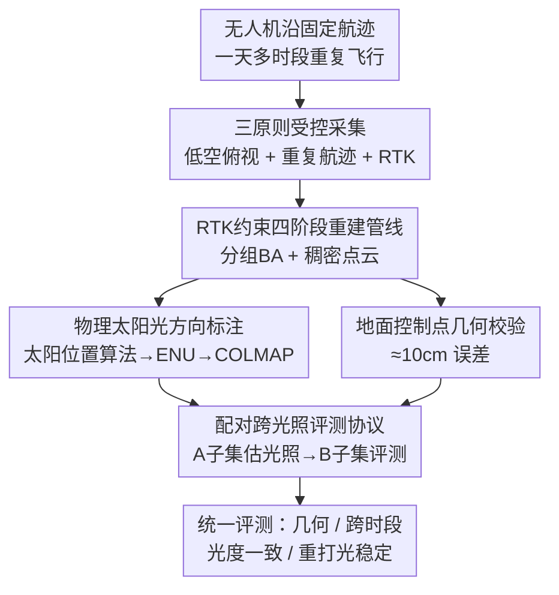

# UAVLight: A Benchmark for Illumination-Robust 3D Reconstruction in Unmanned Aerial Vehicle (UAV) Scenes

**会议**: CVPR 2026  
**论文**: [CVF Open Access](https://openaccess.thecvf.com/content/CVPR2026/html/Du_UAVLight_A_Benchmark_for_Illumination-Robust_3D_Reconstruction_in_Unmanned_Aerial_CVPR_2026_paper.html)  
**代码**: 项目页 https://uavlight.github.io/ （数据集 / benchmark）  
**领域**: 3D视觉  
**关键词**: 无人机重建、光照鲁棒、神经渲染、3D Benchmark、逆渲染

## 一句话总结
UAVLight 构建了首个面向无人机场景、专门隔离"自然光照变化"这一单一变量的多视角 3D 重建 benchmark：18 个真实户外场景沿固定航迹在一天多个时刻重复飞行采集，几何/视角/标定保持一致而只有阳光在变，并配上 RTK 标定的厘米级地面真值点云与物理太阳方向标注，从而第一次能公平地量化"隐式 vs 显式光照建模"在跨光照条件下谁更鲁棒。

## 研究背景与动机
**领域现状**：从经典 SfM/MVS 到 NeRF、3D Gaussian Splatting，多视角 3D 重建已经能从随手拍的图像里恢复出逼真渲染和精确几何。但几乎所有常用 benchmark（MipNeRF-360、Tanks&Temples、NeRF Synthetic 等）都隐含了一个假设：**场景在几分钟内、近乎固定的光照下被拍完**，也就是"光照恒定假设"。

**现有痛点**：无人机重建恰恰打破这个假设——一次飞行往往持续数小时、或在一天不同时段进行，期间太阳位置、强度、云层都在显著变化。非恒定的户外光照会导致几何漂移（geometry drift）、随视角变化的颜色偏移、阴影被"烙印"进反照率（shadow imprinting），以及不稳定的重打光。现有应对方法分两类：(1) **隐式外观建模**给神经场加 per-view/per-ray 隐变量去吸收曝光、白平衡、阴影、天气变化，鲁棒但物理可解释性差、重打光不可靠；(2) **显式光照估计**用逆渲染把外观分解成反照率和光照，物理可信、能重打光，但依赖强先验（如 sun–sky 模型）、需要精确标定、在自动曝光下很脆弱。

**核心矛盾**：要公平比较这两类方法谁更"光照鲁棒"，需要一个**只让光照变、其余都不变**的数据集。但现有数据集要么把采集压在很短时间窗内（光照几乎不变，没有研究价值），要么跨越数月乃至数年（NeRF-OSR），期间几何、植被、瞬变物体都跟着变，**把光照效应和其他变化搅在一起**，无法隔离。结果是隐式与显式方法的优劣始终"测不准、说不清"。

**本文目标**：造一个"受控但真实"（controlled-yet-real）的 benchmark，在保留真实无人机采集复杂度的同时，把光照变化从其他现实因素中**解耦**出来，支持对几何精度、跨时段光度一致性、重打光稳定性的统一量化评测。

**切入角度**：作者提出三条采集原则来"锁住其他变量、只放光照动"——(i) 聚焦以阳光为主光源的户外低空场景，避开室内/多光源干扰；(ii) 在连续几天的相同时间段采集，压住布局、植被、人类活动等非光照变化；(iii) 沿相同 waypoint 航迹重复飞行，保证可比的视角与覆盖。再加上俯视（nadir）航线大幅减少天空像素，降低 HDR 天空歧义。

**核心 idea**：用"重复航迹 + 多时段 + RTK 厘米级标定"把几何和视角钉死，让自然阳光成为**唯一受控变量**，从而把"光照鲁棒性"从一个模糊感受变成可测量的指标。

## 方法详解

### 整体框架
UAVLight 本质是一套**数据采集 + 重建 + 标注 + 评测协议**的组合，而非一个新的重建算法。它的输入是无人机沿固定航迹在一天不同时刻重复拍摄的多组 RGB 影像（带 RTK 位姿），输出是：每个场景的多光照影像序列 + 厘米级地理参考点云（几何真值）+ 每个时段的物理太阳方向标注 + 标准化的训练/验证/测试划分与跨光照评测脚本。整套数据由一条标准化的**四阶段管线**产出：数据采集 → 帧采样与重建 → 后处理 → 太阳光估计。

### 关键设计

**1. 三原则受控采集：把"光照"从其他现实变量里隔离出来**

benchmark 能不能用，关键在于"是否只有光照在变"。作者用三条采集原则把其余变量按死。其一是**低空俯视成像**：在低高度做 nadir 视角飞行，此时直射阳光主导、漫反射分量可忽略，光照变化由太阳位置物理地决定，便于解释；同时俯视航线让画面里几乎没有天空像素，避开了 HDR 天空的高动态歧义，提升跨方法可比性。其二是**重复航迹**：每个场景沿完全相同的 waypoint 路径、在一天若干固定时刻重复采集，保证不同飞行之间视角覆盖和视差一致；并且在大尺度户外场景里，单个时间段内的光照可视为均匀——短暂飞行间隔内太阳位置、投影阴影方向、环境光贡献都保持稳定。其三是**RTK 配准**：所有相机用 RTK 定位提供米制尺度先验，喂给 SfM/MVS 减少漂移，并把不同时段的重建对齐到同一个世界坐标系。三者合力，使"几何/视角不变、只有阳光在变"成为可保证的实验前提，这正是过去跨月跨季数据集做不到的。

**2. RTK 约束的四阶段重建管线：产出米制尺度的几何真值点云**

光要想成为唯一变量，几何参考必须足够准且跨时段对齐。管线四阶段为：数据采集（DJI 平台 + RTK + 全局快门 RGB 相机，1280×960、30 fps、自动曝光；RTK 记录每帧时间戳、经纬度、高度，达厘米级位姿精度）；帧采样与重建（按 1 fps 均匀采样并关联 RTK-GNSS 位置）；后处理（手动剔除运动模糊、极端曝光、弱纹理如水面等坏帧，再用标准 SfM 去畸变）；以及太阳光估计。核心是把地理先验通过**带 RTK 约束的分组捆绑调整**注入重建，总能量为

$$E_{\text{total}} = E_{\text{group}} + \sum_i \kappa_i \left\| \mathbf{c}_i - \mathbf{t}_{\text{RTK}_i} \right\|_2^2,$$

其中分组重投影误差

$$E_{\text{group}} = \sum_j \rho_j \left( \left\| \pi_g(\mathbf{G}_r, \mathbf{P}_c, \mathbf{X}_k) - \mathbf{x}_{jk} \right\|_2^2 \right),$$

第二项把相机中心 $\mathbf{c}_i$ 软约束到 RTK 测量值 $\mathbf{t}_{\text{RTK}_i}$（$\kappa_i$ 为权重）。这样既提升位姿精度又保证尺度一致，使 MVS 稠密重建在跨飞行间保持几何一致。最终点云的可靠性还通过**地面控制点 + 检查点测量**独立校验，平均垂直/平面误差约 10.31 cm / 11.83 cm，符合标准无人机摄影测量精度——这意味着评测可以做到绝对、米制尺度。

**3. 物理太阳光方向标注：给光照估计提供可信监督**

要评测"重打光/光照分解"，光照本身得有真值。UAVLight 不去现场拍环境贴图（对所有时段都拍代价太高），而是假设全局方向光源，**直接用太阳位置算法从时间戳 + GPS 解析出太阳方向**。给定时间 $t$、经度 $\lambda$、纬度 $\phi$，算出太阳高度角 $\alpha_{\text{sun}}$ 和方位角 $\gamma_{\text{sun}}$，天顶角 $\theta_{\text{sun}} = 90^\circ - \alpha_{\text{sun}}$；本地 ENU 坐标系下的单位太阳方向为

$$s_{\text{E}} = \sin(\gamma_{\text{sun}}),\quad s_{\text{N}} = \cos(\gamma_{\text{sun}}),\quad s_{\text{U}} = \sin(\alpha_{\text{sun}}) = \cos(\theta_{\text{sun}}),$$

再经旋转矩阵变换到 COLMAP 坐标系 $\mathbf{s}_{\text{Colmap}} = \mathbf{R}\,\mathbf{s}_{\text{ENU}}$。这种物理 grounded 的太阳标注，可以直接作为光照估计、逆渲染、可重打光重建的监督信号，比"靠隐变量瞎学"靠谱得多。

**4. 配对跨光照评测协议：让光照成为评测里唯一变化的因素**

有了数据还要有公平的打分规则。已有协议各有缺陷：NeRF-W 式的"半分割"用一半视角估光照、另一半评测，但只用一半视角光照线索不全，容易让 embedding 过拟合视角特定外观；NeRF-OSR 式用标定环境贴图物理可信，但对所有时段都标定代价高、难以覆盖大面积户外。作者折中提出**配对跨光照（paired cross-illumination）协议**：对每个测试时段，把相机视角划成在高度和视角上匹配的两个子集 $A_t$、$B_t$，从一个子集估计光照、在同一时段的另一个子集上评测。这样几何保持一致、只有光照在变，配合 PSNR/SSIM/LPIPS 在图像空间评估外观一致性，同时由米制几何参考兜底。为可复现，作者公开了固定随机种子、A/B 视角索引、曝光归一化参数和官方评测脚本。

## 实验关键数据

### 与现有数据集对比（Table 1 节选）
作者沿内容、任务、序列内同光照、光源、光照数、场景数六个维度做分类对比，UAVLight 是唯一"户外 + 多视角 + 序列内同光照 + 自然光"且场景规模可观的 UAV 数据集。

| 数据集 | 内容 | 任务 | 序列内同光照 | 光源 | 光照条件数 | 场景数 |
|--------|------|------|--------------|------|-----------|--------|
| NeRF Synthetic | 物体 | 多视角 | - | 合成 | - | 8 |
| OpenIllumination | 物体 | 多视角 | - | 灯光台 | 13+142 OLAT | 64 |
| Phototourism | 户外 | 多视角 | 否 | 自然 | - | 13 |
| NeRF-OSR | 户外 | 多视角 | 是 | 自然 | 5+ | 9 |
| **UAVLight (本文)** | **UAV** | **多视角** | **是** | **自然** | **3–11** | **18** |

### 主实验：5 个代表性 baseline 跨光照重建（Table 3/4 节选，PSNR↑ / SSIM↑ / LPIPS↓）
在 12 个代表性场景上评测 5 个 baseline。下表摘取 Town、Residential、Footbridge 三个场景的 PSNR：

| 方法 | 类型 | Town | Residential | Footbridge |
|------|------|------|-------------|-----------|
| NeRF-W | 隐式 | 19.63 | 20.74 | 17.25 |
| NeRF-OSR | 显式 | 18.95 | 20.77 | 17.13 |
| GS-W | 隐式 | 22.27 | 25.66 | 17.85 |
| WildGaussians | 隐式 | 23.95 | 23.62 | 17.45 |
| LumiGauss | 显式 | 23.59 | 25.14 | **20.89** |

具体看 Town 场景的 SSIM/LPIPS：LumiGauss 取得 0.841 / 0.128，GS-W 为 0.787 / 0.161，WildGaussians 为 0.792 / 0.175，NeRF-W 仅 0.653 / 0.410——可见基于高斯的方法在标准指标上整体领先 NeRF 类。

### 数据集与几何精度统计（Table 5 / Table 6）

| 维度 | 数值 |
|------|------|
| 场景总数 | 18（如 Residential 37044 m²/3 光照、Grove 11 光照、Park 49920 m²） |
| 每场景光照时段数 | 3–11 |
| 每场景图像数 | 约 126–336 |
| 检查点几何精度 | 垂直误差 10.31 cm，平面误差 11.83 cm（飞行高度 80–100 m，全 nadir，每场景约 10 个检查点） |

### 关键发现
- **显式 > 隐式（跨光照场景）**：在不同光照时段评测时，显式光照模型 LumiGauss 持续优于隐式的 GS-W / WildGaussians / NeRF-W。原因是把光照和颜色"纠缠"在一起的隐式方法，在光照变化下难以维持几何-材质一致性，会把阴影烙印进反照率或扭曲几何；显式分解提供了更可靠的监督。这正是 UAVLight 想暴露的核心难点。
- **高斯类 > NeRF 类（标准指标）**：Gaussian-based 方法（GS-W、WildGaussians、LumiGauss）在 PSNR/SSIM/LPIPS 上普遍强于 NeRF-W/NeRF-OSR，验证其多视角重建稳定性。
- **定性观察**：隐式方法在阴影边界等高频区域有时更锐利，但跨时段会把阴影印进 albedo；显式方法（如 Town 16:55 时段的 LumiGauss）产生更接近真值的柔和阴影与一致着色。⚠️ 表 3/4 表头每个方法行前标注的"353 hr/179 hr/42 hr…"为时间相关数值，原文未明确其含义，以原文为准。

## 亮点与洞察
- **"受控但真实"的折中很聪明**：以往要么完全合成（可控但不真实）、要么纯野外（真实但不可控），UAVLight 用"重复航迹 + 同时段 + RTK"在真实采集里造出实验室级别的变量控制，第一次让"光照鲁棒性"成为可隔离、可量化的研究对象。
- **用太阳位置算法替代环境贴图标定**：从时间戳 + GPS 算太阳方向，几乎零额外采集成本就拿到物理可信的光照真值，这个 trick 可迁移到任何户外、阳光主导的重建/逆渲染数据集。
- **配对跨光照协议是核心评测贡献**：把"估光照"和"评外观"放在同一时段的两个匹配视角子集上，既避开半分割的视角过拟合，又免去逐时段标定环境贴图的高成本，是个实用且可复现的评测设计。
- **暴露了真问题**：benchmark 不只是堆数据，而是清晰揭示了"隐式光照建模在跨光照下会纠缠出伪影"这一本质 trade-off，给后续光照鲁棒重建方法指明了攻坚方向。

## 局限与展望
- **静态场景假设**：当前数据集刻意压住了动态物体、植被、人类活动等变化以隔离光照，因此不含结构化动态目标；作者也将"在多光照下引入动态物体"列为未来方向。
- **光源单一**：方法建立在"阳光主导、漫反射可忽略、可视为全局方向光"的低空 nadir 假设上，对多光源、强漫反射、阴天弥散光等场景的适用性有限。
- **太阳方向是解析估计而非实测**：太阳方向由太阳位置算法从时间/GPS 推出，是物理模型给出的理论值，未经现场光度计实测校验，云层遮挡下的实际入射光与之可能有偏差。
- **评测仍以图像空间指标为主**：PSNR/SSIM/LPIPS 衡量外观一致性，几何由点云兜底，但对"重打光稳定性"这类目标缺乏单独的标准化指标；作者也提到后续将引入 feedforward 方法做更高效的光照感知评测。

## 相关工作与启发
- **vs NeRF-OSR**：同样是户外、多视角、自然光、序列内同光照，但 NeRF-OSR 跨越数月到数年采集，几何/语义随光照一起变，无法隔离光照；UAVLight 用连续几天同时段 + 重复航迹把非光照变量按死，且场景数（18 vs 9）和光照时段（3–11 vs 5+）更丰富。
- **vs 物体中心数据集（OWL、OpenIllumination）**：它们支持重打光和材质分析但几何复杂度低（单物体/灯光台），UAVLight 提供场景级、大空间、复杂几何的户外真实场景。
- **vs 室内单视角数据集（LSMI、Multi-Illumination in the Wild）**：后者关注单图光照估计、缺乏多视角一致性和稳定几何，无法用于重建或跨视角评测。
- **vs MipNeRF-360 / Tanks&Temples / Phototourism**：这些户外重建数据集要么短时窗（光照几乎不变）、要么网络图像光照完全不可控；UAVLight 在两者之间找到"自然光照变化但其余受控"的甜点。

## 评分
- 新颖性: ⭐⭐⭐⭐⭐ 首个 UAV 多光照 3D 重建 benchmark，"受控但真实"的隔离设计填补了明确空白
- 实验充分度: ⭐⭐⭐⭐ 18 场景、5 个代表性 baseline、跨光照协议齐备，但评测主要落在图像空间指标，重打光稳定性缺独立度量
- 写作质量: ⭐⭐⭐⭐ 动机、原则、管线、评测协议讲得清晰，部分表头标注（如"353 hr")含义未交代
- 价值: ⭐⭐⭐⭐⭐ 为光照鲁棒重建提供可复现、可量化的统一评测底座，并清晰暴露隐式 vs 显式的本质 trade-off

<!-- RELATED:START -->

## 相关论文

- [\[CVPR 2026\] AeroGS: Scale-Aware Gaussian Splatting for Pose-Free Dynamic UAV Scene Reconstruction](aerogs_scale-aware_gaussian_splatting_for_pose-free_dynamic_uav_scene_reconstruc.md)
- [\[CVPR 2026\] SunFaded: Illumination-Aware Gaussian Splatting for Dark Scenes with Camera-Mounted Active Lighting](sunfaded_illumination-aware_gaussian_splatting_for_dark_scenes_with_camera-mount.md)
- [\[AAAI 2026\] Griffin: Aerial-Ground Cooperative Detection and Tracking Dataset and Benchmark](../../AAAI2026/3d_vision/griffin_aerial-ground_cooperative_detection_and_tracking_dataset_and_benchmark.md)
- [\[CVPR 2026\] Illumination-Consistent Human-Scene Reconstruction from Monocular Video](illumination-consistent_human-scene_reconstruction_from_monocular_video.md)
- [\[CVPR 2026\] Color-Encoded Illumination for High-Speed Volumetric Scene Reconstruction](color-encoded_illumination_for_high-speed_volumetric_scene_reconstruction.md)

<!-- RELATED:END -->
