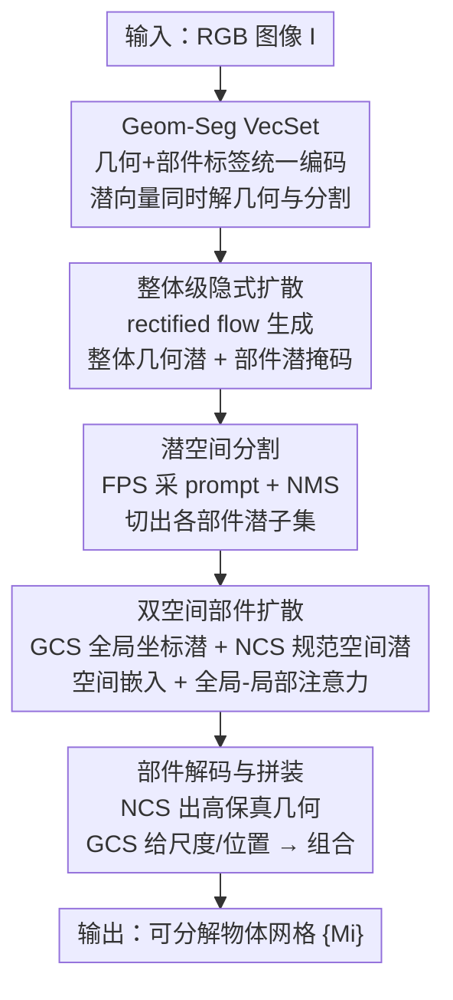

# UniPart: Part-Level 3D Generation with Unified 3D Geom-Seg Latents

**会议**: CVPR 2026  
**论文**: [CVF Open Access](https://openaccess.thecvf.com/content/CVPR2026/html/He_UniPart_Part-Level_3D_Generation_with_Unified_3D_Geom-Seg_Latents_CVPR_2026_paper.html)  
**代码**: 未公开  
**领域**: 3D视觉 / 3D生成 / 扩散模型  
**关键词**: 部件级3D生成、几何-分割联合潜空间、VecSet、双空间扩散、隐式分割

## 一句话总结
UniPart 提出 Geom-Seg VecSet——一种把整体几何和部件分割统一编码进同一潜空间的表示，并基于它搭了一个两阶段隐式扩散框架：第一阶段联合生成整体几何 + 部件潜分割，第二阶段用「全局坐标空间 + 归一化规范空间」双空间扩散逐部件生成高保真网格，在部件几何质量和分割可控性上超过 X-Part、OmniPart 等一众方法。

## 研究背景与动机

**领域现状**：3D 内容生成正从「只生成一坨整体网格」走向「生成可分解、带语义结构的部件级物体」，因为部件编辑、物理仿真、机器人抓取、模块化设计这些下游应用都需要知道物体由哪些部件构成、彼此什么关系。主流 native 3D 生成（CLAY、Hunyuan3D、Trellis）都是整体几何，缺乏部件分解能力。

**现有痛点**：部件级生成现有两条路都不顺。一是**隐式分割**（按潜向量聚类分组），分割粒度难控、部件保真度有限；二是**先生成后分割**（generate-then-segment），先生成整体显式表示（多视图图、密集点、低分辨率体素、网格面），再用一个外部分割器切——这个分割器要在大规模部件标注数据上训练，代价高，而且显式表示的「解码-再编码」循环会损坏几何（比如解码成 SDF、marching cube 抽网格、再采样点重编码，一路掉精度），小而薄的部件尤其容易退化。

**核心矛盾**：部件分割的「粒度」和「鲁棒性」是一对 trade-off——密集点法粒度细但脆弱，低分辨率体素法稳但糙；同时整体几何质量和细部件保真度也难两全。现有 pipeline 把「分割」和「生成」割裂成两段，无法复用整体几何生成里其实已经隐含的部件先验。

**切入角度**：作者做了一个关键观察——**部件意识在整体几何学习中会自然涌现**。他们可视化 Hunyuan3D-2.1 DiT 推理时自注意力的潜向量相关性图（Fig.1），发现同一语义部件内的潜向量（点）彼此相关性显著更强，说明纯整体几何生成器里部件结构其实已经成形了。既然如此，何必再训一个外部分割器？

**核心 idea**：把分割能力直接「焊」进几何潜空间——构建统一的几何-分割潜空间 Geom-Seg VecSet，让一个潜向量同时解码出几何贡献和部件标签；并且把「分割」当成扩散采样任务（而非确定性回归），天然契合部件分解本身的多义性。

## 方法详解

### 整体框架
UniPart 要解决的是：给一张 RGB 图 $I$，生成一个可分解的网格 $O=\{M_i\}_{i=1}^N$，其中每个部件是一个独立网格、部件数 $N$ 不定。整条流水线是「一个统一表示 + 两阶段扩散」：先由 **Geom-Seg VAE** 把物体的几何和部件分割统一编码成 Geom-Seg VecSet 潜表示；再用 **整体级 DiT** 在这个潜空间生成带部件分割信息的整体几何潜，并解码出部件潜掩码、切出各部件的潜子集；最后 **部件级 DiT** 以「整体潜 + 各部件潜 + 输入图」为条件，用双空间扩散逐部件生成高分辨率几何，再拼装成最终物体。

### 关键设计

**1. Geom-Seg VecSet：把部件分割塞进几何潜空间，让一个潜向量同时解几何和部件标签**

这是全文的表示基石，针对「分割要么靠外部分割器、要么靠脆弱的潜聚类」这个痛点。经典 VecSet 把网格表面采的密集点 $P\in\mathbb{R}^{C\times 6}$（位置+法向）经交叉注意力压成定长潜集 $Z\in\mathbb{R}^{L\times d}$，再用解码器 $D$ 解成占据场/SDF 重建网格，训练目标是 $\mathcal{L}_\text{vecset}=\mathcal{L}_\text{recon}+\lambda_\text{kl}\cdot\mathcal{L}_\text{kl}$。UniPart 的改法是：先按几何+语义把物体网格切成 $N$ 个部件，采点时多带一维部件标签 $P\in\mathbb{R}^{C\times 7}$，编码得 $Z=E(P)$；几何解码器 $D_\text{geom}$ 照旧重建几何，**额外**加一个分割解码器 $D_\text{seg}$，仿 SAM2 的可提示分割范式——吃潜集 $Z$ 和潜索引 prompt $q$，输出对应的部件掩码。VAE 训练目标加上分割项 $\mathcal{L}_\text{vecset}=\mathcal{L}_\text{recon}+\mathcal{L}_\text{seg}+\lambda_\text{kl}\cdot\mathcal{L}_\text{kl}$。

之所以有效，是因为几何线索本身就勾勒语义边界，几何特征和部件分割模式天然耦合，把它们放进同一潜空间互相促进。更妙的是实践上不用从头训：只要在一个纯几何 VecSet VAE 上**微调**，潜空间规模（$L$、$d$）保持不变就能同时表达分割与几何，重建质量几乎不掉（Tab.2 验证）——也就是说部件理解几乎是「白嫖」整体几何生成器里已有的先验。

**2. 整体级隐式扩散 + 潜空间分割：联合生成几何与部件掩码，把分割当采样任务**

针对「先生成后分割」割裂、且分割器要重标注的痛点。整体级 DiT 用 rectified flow，前向用线性插值 $Z_t=(1-t)Z_0+t\epsilon$ 把干净 Geom-Seg 潜 $Z_0$ 加噪到 $Z_t$，反向学习速度场 $v(Z_t,t)$，在条件流匹配目标下优化：

$$\mathcal{L}_\text{cfm}(\theta)=\mathbb{E}_{t,Z_0,\epsilon}\|v_\theta(Z_t,t\mid I)-(\epsilon-Z_0)\|_2^2.$$

推理时从噪声迭代去噪得整体潜 $\hat{Z}_0$。拿到 $\hat{Z}_0$ 后，冻结的 $D_\text{seg}$ 吃 $\hat{Z}_0$ 和密集 prompt $r=[1,2,\dots,L]$ 预测每个潜向量的部件标签；同时一个小解码器 $D_\text{pos}$ 从潜向量恢复锚点位置 $p_i^\text{latent}=D_\text{pos}(\hat{z}_i)$（编码阶段降采样点的位置，只为定位、不影响潜空间构建）。有了掩码集和锚点位置后，用最远点采样（FPS）采 prompt、再用非极大抑制（NMS）后处理掩码，得到最终 $N$ 个部件掩码 $\{m_i\}_{i=1}^N$，据此把 $\hat{Z}_0$ 切成各部件潜子集 $\{X_i\}_{i=1}^N$。

这样做的好处：几何生成和部件分割**联合**完成，复用了几何生成器隐含的部件先验，比单独训分割器高效；而且在潜空间分割恰好在「密集点法的粒度」和「低分辨率体素法的鲁棒性」之间取了平衡。作者还强调把分割解成扩散采样而非回归更合理——回归强迫单一确定输出，扩散采样能刻画部件分解本身的歧义与多模态（同一物体可有多种合理切法）。

**3. 双空间部件扩散：在全局坐标空间和归一化规范空间各生成一份潜，专治小部件几何退化**

针对「整体分辨率有限、小薄部件细节丢失」以及「显式条件解码-编码掉精度」两个痛点。部件级 DiT 不再依赖显式表示，而是**直接用潜条件**：整体潜 $\hat{Z}_0$ 提供全局几何与部件-整体关系，部件潜 $X_i$ 提供局部信息，避免了解码-再编码的几何损失、且条件信号与潜扩散域对齐。核心创新是为第 $i$ 个部件同时生成双空间潜 $X_i^*:=(X_i^\text{gcs},X_i^\text{ncs})\in\mathbb{R}^{L\times 2d}$：$X_i^\text{gcs}$ 在**全局坐标空间**，编码部件相对整体的尺度、位置、组合关系；$X_i^\text{ncs}$ 在**归一化规范空间** $[0,1]^3$，捕捉部件自身的高保真几何，且分辨率与整体潜相同——等于把每个小部件「放大」到满分辨率单独刻画细节。

为让 transformer 区分两个空间的 token，注入可学习的空间嵌入 $e_s\in\mathbb{R}^{1\times d}$（$s\in\{\text{gcs},\text{ncs}\}$），广播加到对应潜上；并采用全局-局部注意力：

$$\text{Attn}_\text{local}=\text{Softmax}\!\Big(\tfrac{\sigma_q(X_i^s)^\top\sigma_k(X_i^s)}{\sqrt{h}}\Big)\sigma_v(X_i^s),\quad \text{Attn}_\text{global}=\text{Softmax}\!\Big(\tfrac{\sigma_q(X_i^*)^\top\sigma_k(X_i^*)}{\sqrt{h}}\Big)\sigma_v(X_i^*).$$

局部注意力管单空间内部、全局注意力让两空间联合关注整体与局部几何。之所以有效：$X_i^\text{gcs}$ 与条件潜共享坐标系，可看作 $X_i$ 的几何补全、更易预测；而 $X_i^\text{gcs}$ 与 $X_i^\text{ncs}$ 高度相关、共享部件几何信息，于是耦合双空间扩散能更高效地在规范空间学到高质量部件几何。推理时对两份噪声分别去噪得 $X_i^\text{gcs}$、$X_i^\text{ncs}$，共享几何解码器解成 $M_i^\text{gcs}$、$M_i^\text{ncs}$；从 $M_i^\text{gcs}$ 算出部件尺度与位置，把高质量的 $M_i^\text{ncs}$ 变换回全局坐标系完成无缝拼装。

### 损失函数 / 训练策略
- **VAE**：$\mathcal{L}_\text{recon}+\mathcal{L}_\text{seg}+\lambda_\text{kl}\mathcal{L}_\text{kl}$，分割项 $\mathcal{L}_\text{seg}$ 沿用 SAM2；在纯几何 VecSet VAE 上微调而非从头训。
- **两级扩散**：均为 rectified flow + 条件流匹配目标 $\mathcal{L}_\text{cfm}$；部件级 DiT 在整体潜 $Z_0$（推理换 $\hat{Z}_0$）、部件潜 $X_i$（padding 到长度 $L$）、输入图 $I$ 条件下预测 $X_i^*$。
- **数据**：整合多公开源构建 30 万带部件分割的物体数据集；部件标签先由网格连通性提取、爆炸视图渲染人工筛、winding number 重网格补洞封口保证 watertight、再按最近面标签回填。
- **实现**：基于 Hunyuan3D-2.1，CFG dropout 0.1，AdamW（weight decay 0.01）；8× A800(80GB)，batch size 32。

## 实验关键数据

评估时把所有生成部件拼成单一网格做整体几何保真度评估（因为生成部件与 GT 部件无可靠对应），指标用 Chamfer Distance、F-Score、IoU，网格归一化到 $[-1,1]$ 并在 0°/90°/180°/270° 旋转中取最优分以保证位姿无关比较。

### 主实验

部件级生成几何质量对比（5 个 baseline，前三接单图、后两接网格用 Hunyuan3D-2.1 生成整体网格以公平对比）：

| 方法 | CD↓ (×10²) | F1@0.1↑ (×10²) | IoU↑ (×10²) |
|------|-----------|----------------|-------------|
| HoloPart | 2.86 | 82.33 | 23.40 |
| PartPacker | 2.18 | 74.35 | 13.97 |
| PartCrafter | 1.03 | 46.08 | 5.63 |
| OmniPart | 1.99 | 85.04 | 27.94 |
| XPart | 0.82 | 88.90 | **31.95** |
| **UniPart (Ours)** | **0.72** | **92.21** | 21.99 |

UniPart 在 CD 和 F-Score 上一致领先（CD 0.72 vs X-Part 0.82，F1@0.1 92.21 vs 88.90），说明生成物体几何质量更高、与 GT 对齐更好。IoU 上 X-Part 略高（31.95 vs 21.99），整体几何保真度仍是 UniPart 的明显优势项。

### 消融实验

Geom-Seg VAE 重建质量（验证加分割信息几乎不损几何，CD 单位 ×10⁴）：

| 方法 | CD↓ (×10⁴) | F1@0.01↑ (×10²) |
|------|-----------|------------------|
| TRELLIS | 1.32 | 80.59 |
| Dora | 1.45 | 78.54 |
| Craftsman | 1.51 | 77.47 |
| XCubes | 1.42 | 77.57 |
| Hunyuan3D-2.1 | 1.29 | 80.85 |
| **UniPart (Ours)** | 1.30 | **80.89** |

UniPart 重建质量与原始 Hunyuan3D-2.1 VAE 几乎持平（CD 1.30 vs 1.29，F1 80.89 vs 80.85），证明往潜空间塞分割信息几乎不掉几何质量。

部件级 DiT 三个关键设计的消融（Fig.7 定性，作者未给数值表，下表为定性结论汇总）：

| 配置 | 现象 | 说明 |
|------|------|------|
| Full model | 部件几何保真、拼装无缝 | 完整模型 |
| w/o NCS Generation | 小而细部件保真度下降 | 去掉归一化规范空间，等于直接在全局坐标生成 |
| w/o Local Attn. | 部件内聚性变差、空间排布不和谐 | 去掉局部注意力 |
| w/o Space Embed. | 频繁混淆部件所属空间，拼装灾难性失败 | 去掉空间嵌入注入 |

### 关键发现
- **空间嵌入是「保命」组件**：去掉后模型经常分不清每个部件该属哪个空间，导致拼装阶段灾难性失败——说明双空间设计必须配显式空间标识才能稳。
- **NCS 生成专攻小部件**：在归一化规范空间生成对小而带细节的部件保真度提升最明显，印证了「把小部件放大到满分辨率单独刻画」的动机。
- **局部注意力管内聚**：促进部件内部协调，带来更和谐的空间排布和更好的全局几何一致性。
- **失败案例**：对结构高度复杂的输入，联合生成几何与分割可能失败，产出几何无效或语义不一致的结果。

## 亮点与洞察
- **「部件意识自涌现」的观察很扎实**：用现成 Hunyuan3D-2.1 DiT 的注意力相关性图直接证明整体几何生成器里已隐含部件结构，把「无需外部分割器」从口号落成了实证依据，是全文最有说服力的一步。
- **把分割当扩散采样而非回归**：这是个思路迁移点——部件分解本身多义，回归强迫单一答案，扩散采样天然刻画歧义；这套「任务转成采样」的视角可迁到其他有歧义的结构预测任务。
- **双空间解耦「外形」与「摆放」**：NCS 管部件本体高保真几何、GCS 管尺度位置，解码后用 GCS 算变换把 NCS 网格放回去——干净地把「长什么样」和「放哪儿多大」拆开，规避了小部件因整体分辨率受限而退化。
- **潜条件代替显式条件**：直接用潜做条件，绕开「解码成 SDF→抽网格→再编码」的有损循环，同时给的是域对齐信号、还自带部件-整体关系线索，是 latent diffusion 框架里很自然但常被忽略的优化。

## 局限与展望
- 作者承认：对结构高度复杂的物体，几何与分割的联合生成会失败，产出几何无效/语义不一致结果。
- 部件标签依赖网格连通性 + 人工爬爆炸视图筛 + winding number 重网格的预处理 pipeline，扫描数据上连通性不可靠，数据构建成本和噪声值得注意。
- 评估为绕开「生成部件 vs GT 部件无对应」，把部件拼回整体网格再算 CD/F-Score/IoU——这衡量的是整体几何保真度，**对部件分割本身的准确性**只在附录给（正文未展开），部件级语义正确性的量化证据相对薄。
- 改进思路：引入更强的结构先验或层次化部件建模应对复杂物体；探索无需人工筛选的自动部件标注以扩大训练规模。

## 相关工作与启发
- **vs X-Part / HoloPart（先生成后分割、显式条件）**：它们在显式表示（网格/点/体素）上做分割并以此条件部件扩散，需经解码-编码循环损几何；UniPart 全程在潜空间做分割和条件，避免几何退化、给域对齐信号、且保留部件-整体关系。整体几何 IoU 上 X-Part 仍略胜，但 UniPart 在 CD/F-Score 全面领先。
- **vs PartCrafter / PartPacker（隐式分割、潜聚类）**：它们靠分组潜向量隐式分割，粒度难控、部件保真有限；UniPart 产出显式部件潜掩码，分割粒度更灵活、部件级可控性更高。
- **vs SAMPart3D / P3-SAM / GeoSAM2（外部 3D 分割器）**：这些要么蒸馏 2D SAM 先验、要么在大规模部件标注网格上训练再做掩码提示；UniPart 直接让分割能力从整体几何生成中涌现，不依赖独立训练的硬分割掩码，端到端完成生成+分割。

## 评分
- 新颖性: ⭐⭐⭐⭐⭐ 「部件意识自涌现」观察 + 几何-分割统一潜空间 + 双空间部件扩散，三连贯穿，视角新颖且自洽。
- 实验充分度: ⭐⭐⭐⭐ 主对比 5 个 baseline、两张定量表 + 消融，但部件分割本身的量化只放附录，正文消融偏定性。
- 写作质量: ⭐⭐⭐⭐⭐ 动机推导清晰、Fig.1 实证支撑有力、方法三段层层递进。
- 价值: ⭐⭐⭐⭐⭐ 摆脱外部分割器、潜空间端到端部件生成，对可编辑 3D 内容创作和部件感知生成建模有实际推动。

<!-- RELATED:START -->

## 相关论文

- [\[ICCV 2025\] From One to More: Contextual Part Latents for 3D Generation](../../ICCV2025/3d_vision/from_one_to_more_contextual_part_latents_for_3d_generation.md)
- [\[CVPR 2026\] Native and Compact Structured Latents for 3D Generation](native_and_compact_structured_latents_for_3d_generation.md)
- [\[CVPR 2026\] PartDiffuser: Part-wise 3D Mesh Generation via Discrete Diffusion](partdiffuser_part-wise_3d_mesh_generation_via_discrete_diffusion.md)
- [\[CVPR 2026\] Grounded Latents for Entity-Centric 4D Scene Generation](grounded_latents_for_entity-centric_4d_scene_generation.md)
- [\[CVPR 2026\] SPARK: Sim-ready Part-level Articulated Reconstruction with VLM Knowledge](spark_sim-ready_part-level_articulated_reconstruction_with_vlm_knowledge.md)

<!-- RELATED:END -->
