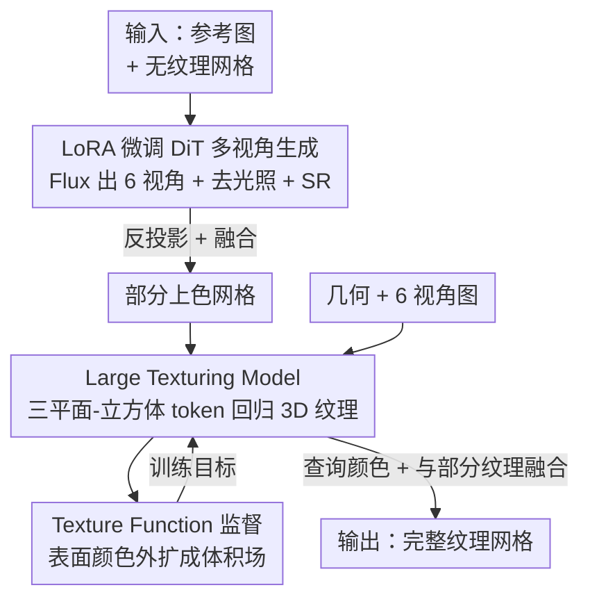

# UniTEX: Universal High Fidelity Generative Texturing for 3D Shapes

**会议**: CVPR 2026  
**论文**: [CVF Open Access](https://openaccess.thecvf.com/content/CVPR2026/html/Liang_UniTEX_Universal_High_Fidelity_Generative_Texturing_for_3D_Shapes_CVPR_2026_paper.html)  
**代码**: https://github.com/HKUST-SAIL/UniTEX  
**领域**: 3D视觉  
**关键词**: 3D纹理生成, 纹理函数, UV无关, 扩散Transformer, LoRA微调

## 一句话总结
UniTEX 用一个两阶段框架给任意 3D 网格"上色"：第一阶段用 LoRA 高效微调大规模 2D 扩散 Transformer（Flux）生成六视角无光照贴图，第二阶段抛弃传统 UV 贴图、改用一个直接在 3D 空间回归纹理的 Large Texturing Model（LTM），配合把表面颜色外扩成体积场的"纹理函数（Texture Function）"作监督，从而在艺术家网格和 AI 生成网格上都拿到更完整、更高保真的纹理。

## 研究背景与动机

**领域现状**：高质量纹理生成是 3D 资产制作的关键环节，直接决定渲染模型的视觉真实感和语义保真度。主流做法借鉴图像/视频扩散模型的成功，把 2D 生成先验用到 3D 上——先用 2D 扩散模型生成多视角纹理图，再把这些视角投影回 3D 网格表面。

**现有痛点**：多视角投影出来的纹理常常有自遮挡（self-occlusion）和多视角不一致的问题，导致 3D 表面纹理残缺、碎裂。为了补全这些缺口，早期工作（Paint3D、Meta 3D TextureGen 等）加了一个**第二阶段的 UV 修补（UV-based inpainting）**：把网格展开成 UV 图，在 UV 空间里把零散视角融成一张完整贴图。这套方案在艺术家手工建模、UV 布局规整的网格上效果尚可，但一旦碰到 AI 生成管线（Craftsman、Hunyuan3D 等用 Marching Cubes 抽出来）的网格就明显失效。

**核心矛盾**：作者把这个泛化瓶颈归因为 UV 贴图的一个根本缺陷——**拓扑歧义（topological ambiguity）**。同一个 3D 网格可以对应多种合法的 UV 布局，UV 展开结果不仅由几何决定，还高度依赖顶点/面的分布和具体的 UV 展开算法。这意味着推理时用的 UV 参数化无法保证和训练时一致，UV 修补模型一旦遇到训练时没见过的碎片化 UV 布局（生成网格尤其如此）就会崩。换句话说，**UV 空间本身就是一个不稳定、不可控的中间表示**，把纹理补全建立在它之上注定泛化受限。

**本文目标**：让第二阶段的纹理补全/预测摆脱 UV 依赖，做到对任意拓扑的网格都能稳定地补出完整、高保真的纹理。

**切入角度**：既然 UV 是问题根源，那就干脆不在 UV 空间里做。作者把纹理修补/预测**重新表述为一个原生 3D 回归任务**——输入图像 + 几何，直接在统一的 3D 函数空间里回归颜色。同时借鉴几何生成里 SDF/UDF 这类"稠密体积监督优于稀疏渲染监督"的经验，把只定义在表面的纹理信号外扩成一个连续体积场来当训练目标。

**核心 idea**：用"在 3D 函数空间直接回归纹理（LTM）"代替"UV 修补"来绕开拓扑歧义，并用"把表面颜色外扩成体积场的 Texture Function"代替稀疏的渲染监督，从而获得一个可泛化、可扩展的第二阶段；前面再配一个 LoRA 高效微调的 2D 扩散 Transformer 负责生成多视角图。

## 方法详解

### 整体框架
UniTEX 是一个**两阶段**纹理生成管线，输入是一张参考图像 + 一个无纹理 3D 网格，输出是贴好完整纹理的网格。

第一阶段（多视角生成）：用 LoRA 高效微调两个大规模扩散 Transformer（Flux）。第一个 Flux 接收参考图 + 无纹理网格渲染出的法线图和 CCM（canonical coordinate map，每个像素编码该表面点的 3D 坐标），生成六个正交视角的着色图；第二个 Flux 负责去光照（delight）、生成漫反射（diffuse）颜色。生成的图可选地再过一遍超分（SR）。这些视角图经过反投影、融合后，得到一个**部分上色的网格**。

第二阶段（纹理补全/精修）：把第一阶段生成的图像 + 部分上色几何一起喂给 Large Texturing Model（LTM）。LTM 在一个统一的 3D 函数空间里回归出**完整的纹理函数**，最终纹理由"预测的纹理函数"与"初始部分上色几何"融合（blend）得到。训练 LTM 时用的是把表面颜色外扩成体积场的 Texture Function 作为监督信号。

下面这张图刻画了两阶段从输入到输出的主流向，节点名对应后面"关键设计"里的四个设计点：

### 关键设计

**1. Large Texturing Model（LTM）：在统一 3D 函数空间直接回归纹理，绕开 UV 拓扑歧义**

这是全文最核心的设计，直接针对前面说的 UV 拓扑歧义痛点。LTM 不在 UV 空间补图，而是把纹理预测当成一个**以 3D 坐标为自变量的颜色回归**。具体架构（见原文 Fig. 4）：先用一组可学习 token 初始化一个**三平面-立方体（triplane-cube）**表示，包含高分辨率三平面 $T \in \mathbb{R}^{3\times32\times32}$ 和低分辨率立方体 $C \in \mathbb{R}^{8\times8\times8}$（论文指出三平面+立方体的混合表示优于纯三平面）。把 6 个正交视角图、CCM、alpha 图按 CRM 的方式编码进三平面并相加进初始 token；几何信息则按 Shape2VecSet 的思路编码——从部分上色几何里采样彩色点云，用三平面-立方体 token 通过 **cross-attention** 去查询它们。融合 2D 图像与 3D 几何信息后，用一个带 **self-attention** 的 Transformer 处理这些展平特征，输出再 reshape 回三平面和立方体，分别用 2D/3D 反卷积上采样。

最终采样纹理时用一个轻量 MLP 从三平面-立方体特征 $\mathcal{TC}$ 里预测颜色。给定查询点 $x$，预测颜色为：

$$\hat{\mathbf{c}}(x, \mathcal{TC}) = \text{MLP}_\theta(\mathit{gridsample}(x, \mathcal{TC}))$$

其中 $\hat{\mathbf{c}} \in \mathbb{R}^3$ 是点 $x$ 的 RGB。训练完成后，对任意空间点查询颜色就能完成纹理预测/修补。这样做的关键好处是：纹理被建模成一个**完整的空间场**而非依赖某种 UV 展开，从而对不同拓扑的网格（尤其是 AI 生成的碎片化网格）天然鲁棒。

**2. Texture Function（TF）：把表面颜色外扩成连续体积场，提供稠密完整的监督**

这个设计解决"怎么训好 LTM"的问题。传统纹理只定义在物体表面，过去工作只能靠表面渲染/体渲染做 2D 投影监督，这种监督**稀疏且覆盖不全**，远不如几何任务里 SDF/UDF 那种稠密体积监督。作者类比 UDF，把纹理也外扩成定义在整个 3D 空间的连续函数：对空间中任意坐标 $x \in \mathbb{R}^3$，找到网格表面 $\Omega$ 上离它最近的点，取该点颜色作为 $x$ 的纹理值。这样表面纹理就变成了一个平滑连续的体积场，可以和体积几何表示统一学习。

LTM 的训练目标定义为：

$$\mathcal{L}_{\text{texture}} = \mathbb{E}_{x \sim \Omega}\left[\|\hat{\mathbf{c}}(x, \mathcal{TC}) - \mathbf{c}(x)^*\|^2\right] + \lambda \mathcal{L}_{tv}(\mathcal{T})$$

其中 $\mathbf{c}(x)^*$ 是从纹理函数导出的真值颜色，$\mathcal{L}_{tv}$ 是对网格 3D 表示做的全变分（total-variance）正则，权重 $\lambda = 0.0005$。和截断 SDF 类似，作者用**截断纹理函数**，阈值设为 $0.025$，超出截断范围的点用背景色当真值——也就是把上色区域扩成几何周围的一层薄壳。这层薄壳带来三个好处：一是迫使模型形成对 3D 物体的体积理解；二是降低对精确网格建模的依赖（即便几何不精确也能查到正确颜色）；三是完整监督有助于学一个结构良好的隐空间、提升泛化。作者强调，类似的纹理外扩此前虽有人讨论过，但**首次证明这种表示可以当作增强纹理生成的强训练目标**是本文的关键贡献之一。

**3. Drop Training：随机丢弃部分 token 来高效微调多视角扩散 Transformer**

这是第一阶段的核心提效设计，针对"把 2D 扩散模型适配到 3D 纹理任务时条件信号太多、token 太长导致训练慢、显存爆"的痛点。生成 6 个 $512\times512$ 视角需要为每个视角提供参考图和几何信息（法线、CCM），而 DiT 依赖 in-context learning（所有输入和条件一起编码成 token），token 量暴增。作者从 Long-LoRA（训练时截断注意力窗口、推理时恢复全注意力）和 MVDiffusion++（训练时用更少视角、推理时用更多视角）得到启发，指出微调真正要让模型学的模式是"多视角一致性 + 符合条件"，而**这并不需要同时看到所有输入 token**。于是 drop training 在每个训练步只保留所有 token 的一个子集，扩散 Transformer 只基于这些被选中的 token 做条件和生成。实验显示丢弃 50% token 后，能在相同迭代数下拿到与全输入微调相当的质量，同时显著加速训练、降低显存——是个即插即用的微调技巧。

> ⚠️ 原文在不同处分别称其为 "drop training" 和 "patch dropout strategy"，指同一方法，以原文为准。

### 损失函数 / 训练策略
LTM 的核心损失就是上面的 $\mathcal{L}_{\text{texture}}$：表面采样点的 RGB L2 重建损失 + 全变分正则（$\lambda=0.0005$），并采用阈值 $0.025$ 的截断纹理函数、截断外用背景色监督。第一阶段两个 Flux 用 LoRA + in-context learning 微调，配合 drop training（丢 50% token）加速；多视角生成在 A800、batch size 4 上训练。

## 实验关键数据

### 主实验：纹理生成对比（艺术家网格 + 生成网格）
作者建了两套互补 benchmark：艺术家手工网格（按 MetaTexGen 评测标准）和 AI 生成网格（用 Craftsman、HY2.0 合成）。指标包括 CMMD（细粒度保真）、FIDCLIP（语义相似）、CLIP-Score（与提示对齐）、LPIPS（感知相似）、User-perf.（用户研究偏好率）。

| 方法 | 艺术家网格 CMMD↓ | 艺术家网格 FIDCLIP↓ | 艺术家网格 CLIP-Score↑ | 生成网格 LPIPS↓ | 生成网格 CLIP-Score↑ | User-perf.↑ |
|------|------|------|------|------|------|------|
| Paint3D | 1.196 | 20.52 | 0.840 | 0.107 | 0.720 | 6.82% |
| TexPainter | 1.632 | 27.13 | 0.804 | 0.112 | 0.709 | 1.36% |
| TexGaussians | 1.290 | 21.08 | 0.836 | 0.095 | 0.681 | 4.55% |
| Hunyuan3D-Paint | 0.909 | 20.38 | 0.824 | 0.091 | 0.800 | 21.36% |
| **Ours (UniTEX)** | **0.826** | **16.03** | **0.844** | **0.090** | **0.807** | **65.91%** |

UniTEX 在两套 benchmark 的几乎所有指标上都领先：艺术家网格 FIDCLIP 从次优的 20.38 降到 16.03，用户研究偏好率高达 65.91%（次优 Hunyuan3D-Paint 仅 21.36%）。值得注意的是单阶段原生 3D 模型 TexGaussians 在生成网格上表现差（CLIP-Score 仅 0.681），印证了"原生 3D 监督必要、但原生 3D 方法更适合做精修/补全而非独立生成（受限于 3D 数据稀缺），仍需 2D 扩散先验"的结论。

### 精修阶段对比（在 3D 空间 vs UV 空间）
为支撑核心论点"精修应在 3D 空间而非 UV 空间做"，作者拿第一阶段生成图作输入，对比不同精修方法对自遮挡区域的补全质量。其中 PSNRuv 在采样 UV 点的预测表面上算 PSNR，PSNRuv* 只在不可见区域算。

| 方法 | PSNRuv↑ | PSNRuv*↑ | PSNR↑ | SSIM↑ | LPIPS↓ |
|------|------|------|------|------|------|
| Paint3D-UVpaint | 18.61 | 15.22 | 23.90 | 0.971 | 0.042 |
| TexGEN | 20.47 | 17.07 | 25.19 | 0.977 | 0.040 |
| **Ours** | **23.01** | **19.89** | **30.45** | **0.989** | **0.023** |

UniTEX 在所有指标全面领先，尤其 PSNR 从 25.19 提到 30.45、不可见区域 PSNRuv* 从 17.07 提到 19.89——说明在 3D 函数空间精修对自遮挡/不可见区域的补全显著更好。

### 消融实验

**Drop Training（DT）消融**（多视角纹理生成，A800 / batch size 4）：

| 配置 | CMMD↓ | FIDCLIP↓ | CLIP-Score↑ | LPIPS↓ | 显存↓ | 速度↓ |
|------|------|------|------|------|------|------|
| w/o DT | 0.912 | 17.49 | 0.839 | 0.087 | 69.2GB | 38.76 s/it |
| **w/ DT** | **0.826** | **16.03** | **0.844** | 0.090 | **53.6GB** | **21.50 s/it** |

丢 50% token 后质量不降反略升（CMMD/FIDCLIP/CLIP-Score 都更好），同时显存降 22.5%、速度快约 44.5%。

**Texture Function Supervision（TFS）消融**（直接用 LTM 查询点给整模型上色，不与部分纹理融合）：

| 配置 | PSNRuv↑ | PSNR↑ |
|------|------|------|
| w/o Texture Function Supervision | 20.31 | 25.81 |
| **w Texture Function Supervision** | **20.99** | **27.01** |

用 TF 监督在相同迭代下 PSNR 从 25.81 提到 27.01、PSNRuv 从 20.31 提到 20.99，表明体积场监督带来更高保真和更完整的纹理。

### 关键发现
- **Drop training 是"免费午餐"**：丢一半 token 不仅省显存、提速近一半，质量还略升——印证了"微调真正要学的是多视角一致性+符合条件，不必看全部 token"的洞察。
- **3D 函数空间精修 >> UV 空间精修**：在自遮挡/不可见区域（PSNRuv*）的优势最明显，直接支撑了全文"绕开 UV"的主张。
- **原生 3D 适合精修而非独立生成**：TexGaussians 单阶段方案在生成网格上崩盘，说明 3D 数据稀缺下仍离不开 2D 扩散先验，UniTEX 的"2D 生成 + 3D 精修"分工是合理的折中。

## 亮点与洞察
- **把 UV 拓扑歧义点破为泛化瓶颈的根因**：很多工作只是经验性地发现 UV 修补在生成网格上不行，UniTEX 给出了清晰的归因（同一网格多种合法 UV、训练/推理 UV 不匹配），并据此设计了"完全不进 UV 空间"的解法，逻辑闭环很干净。
- **Texture Function 借鉴 SDF/UDF 的稠密监督思路**：把"几何用体积场监督优于稀疏渲染"的成功经验迁移到纹理上，是个漂亮的类比；薄壳监督还顺带降低了对精确几何的依赖，这个副作用对 AI 生成的不精确网格特别有用。
- **Drop training 可迁移**：作为即插即用的 DiT 微调提效技巧，它的洞察（微调时不必保留完整前向 token）可迁移到其它"条件多、token 长"的扩散微调场景（如多视角法线估计，原文提到在 Supp. 里验证过）。

## 局限与展望
- **依赖第一阶段 2D 扩散质量**：整个管线"2D 生成 + 3D 精修"，若第一阶段多视角生成本身偏差大，第二阶段精修能补全但难以无中生有地纠正语义错误。
- **三平面-立方体分辨率受限**：高分辨率三平面 $32\times32$ + 低分辨率立方体 $8\times8\times8$ 对极精细纹理（超高频细节）的表达上限可能受限，论文未深入探讨极端细节场景。
- **部分消融用较少迭代**：作者坦言因算力限制，某些消融实验用了比全模型更少的训练迭代，结论的绝对数值需谨慎看待（⚠️ 以原文为准）。
- **评测仍偏单参考图条件**：主要在单图 + 网格设定下评估，对多图/复杂文本条件下的鲁棒性着墨不多。

## 相关工作与启发
- **vs Paint3D / TexGen（UV 修补类）**：它们在艺术家网格、规整 UV 上有效，但对生成网格的碎片化 UV 布局失效；UniTEX 完全在 UV 空间之外操作，精修阶段 PSNR 30.45 vs Paint3D 23.90，泛化明显更好。
- **vs Hunyuan3D-Paint（多视角扩散类）**：HY2.0/2.1 用基于规则的修补处理遮挡区，残留明显伪影；UniTEX 的 LTM 能学习性地恢复缺失部分（如被遮挡的腿），用户研究偏好率 65.91% vs 21.36%。
- **vs TexGaussians（单阶段原生 3D）**：纯原生 3D 生成受 3D 数据稀缺所限，在生成网格上泛化差（CLIP-Score 0.681）；UniTEX 把原生 3D 重新定位为第二阶段精修模块，再借 2D 基础模型拿多视角条件，在有限数据下更鲁棒。
- **vs FlashTex / SDS 优化类**：SDS 类靠单视角扩散迭代优化，有 Janus 问题且优化昂贵；UniTEX 用前馈式多视角生成 + 一次性 3D 回归，可扩展性更好。

## 评分
- 新颖性: ⭐⭐⭐⭐⭐ 把纹理补全从 UV 空间彻底搬到 3D 函数空间，并首次把"纹理外扩成体积场"用作强训练目标，问题归因和解法都很有想法。
- 实验充分度: ⭐⭐⭐⭐ 双 benchmark（艺术家+生成网格）、主对比+精修对比+两组消融+用户研究齐全，唯部分消融因算力用了较少迭代。
- 写作质量: ⭐⭐⭐⭐ 动机推导（拓扑歧义→3D 回归→体积监督）逻辑清晰，图文配合好；个别术语命名（drop training / patch dropout）前后不完全统一。
- 价值: ⭐⭐⭐⭐⭐ 给 AI 生成网格这类碎片化拓扑提供了可泛化、可扩展的高保真纹理方案，对游戏/VR/数字内容制作有直接落地价值，且 drop training 可迁移到其它 DiT 微调。

<!-- RELATED:START -->

## 相关论文

- [\[CVPR 2026\] Lafite: A Generative Latent Field for 3D Native Texturing](lafite_a_generative_latent_field_for_3d_native_texturing.md)
- [\[CVPR 2026\] CustomTex: High-fidelity Indoor Scene Texturing via Multi-Reference Customization](customtex_high-fidelity_indoor_scene_texturing_via_multi-reference_customization.md)
- [\[CVPR 2026\] CraftMesh: High-Fidelity Generative Mesh Manipulation via Poisson Seamless Fusion](craftmesh_high-fidelity_generative_mesh_manipulation_via_poisson_seamless_fusion.md)
- [\[CVPR 2026\] LATTICE: Democratize High-Fidelity 3D Generation at Scale](lattice_democratize_high-fidelity_3d_generation_at_scale.md)
- [\[CVPR 2026\] HyperGaussians: High-Dimensional Gaussian Splatting for High-Fidelity Animatable Face Avatars](hypergaussians_high-dimensional_gaussian_splatting_for_high-fidelity_animatable_.md)

<!-- RELATED:END -->
