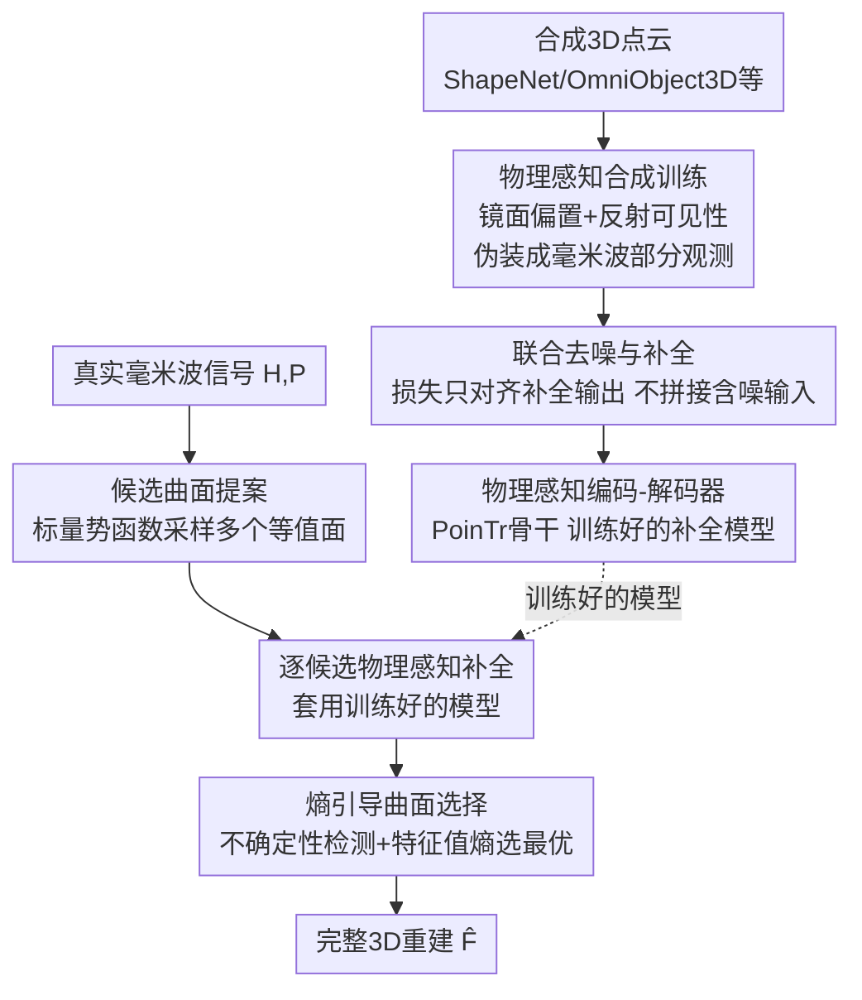

# Wave-Former: Through-Occlusion 3D Reconstruction via Wireless Shape Completion

**会议**: CVPR 2026  
**论文**: [CVF Open Access](https://openaccess.thecvf.com/content/CVPR2026/html/Dodds_Wave-Former_Through-Occlusion_3D_Reconstruction_via_Wireless_Shape_Completion_CVPR_2026_paper.html)  
**代码**: 无  
**领域**: 3D视觉  
**关键词**: 毫米波感知, 遮挡穿透重建, 形状补全, 镜面反射, 物理感知学习  

## 一句话总结
Wave-Former 用毫米波（mmWave）无线信号穿透纸箱、杂物等遮挡物，把"只能看到雷达正对面"的稀疏点云补全成隐藏物体的完整 3D 形状——靠的是一套把毫米波物理特性（镜面反射、各向异性可见性、强噪声）直接编进训练数据与损失的"物理感知形状补全"框架，从而**完全用合成点云训练**就能泛化到真实测量，在真实遮挡数据集上把召回率从 54% 提到 72%、精度保持 85%。

## 研究背景与动机

**领域现状**：重建被完全遮挡物体（盒子里、杂物下）的 3D 几何，是计算机视觉里一个悬而未决的问题，对机器人抓取、AR、物流分拣都有价值。相机和 LiDAR 这类光学传感器穿不透遮挡物，而毫米波信号能穿过常见遮挡物并从隐藏物体表面反射回来，于是近年有工作（Backprojection、mmNorm）尝试用这种反射做隐藏物体的**部分**重建。

**现有痛点**：毫米波只能重建"雷达正对面"那一小块表面，拿不到完整形状。根因是毫米波的反射方式和可见光根本不同——可见光在大多数表面上是**漫反射**（向各个方向散射），而毫米波主要是**镜面反射**（镜子式定向反射）。结果是物体表面的大部分会把信号反射到别处、对传感器"隐形"，覆盖率极低；再叠加毫米波点云比深度相机噪声大约 5 倍、空间分辨率又低，完整重建难上加难。

**核心矛盾**：一个看似自然的补救是"把现成的视觉形状补全模型（如 PoinTr）接到毫米波部分点云后面"，但这条路走不通。因为视觉补全模型是为高覆盖、低噪声、漫反射的相机/LiDAR 点云设计的，它们隐式假设"输入部分点云是均匀、可信的、可以直接拼接保留的"——这些假设对毫米波统统不成立，于是直接套用会产出噪声极大、几何错乱的重建。说到底，缺的是一个**显式建模毫米波物理特性**的补全框架。

**核心 idea**：把毫米波物理（镜面性、反射依赖的可见性、强噪声）**直接嵌进学习过程**——既改训练数据的生成方式（让合成的部分点云长得像真实毫米波观测），又改损失（允许模型去噪而非保留含噪输入），再配一套真实信号的推理流程（先提一批候选曲面、逐一补全、再用熵选最优）。这让模型**完全用现成合成 3D 数据集训练**，却能泛化到真实毫米波信号，重建出多样物体的完整 3D 形状。

## 方法详解

### 整体框架

Wave-Former 把问题拆成两条互补的线：**训练侧**（图 a，全合成）负责教会一个 transformer 形状补全网络"毫米波视角下的部分观测长什么样、该怎么补"；**推理侧**（图 b，真实信号）负责把一串原始毫米波测量变成单个高保真 3D 重建。

形式化地，输入是 $N$ 个已知传感器位置 $P\in\mathbb{R}^{N\times3}$ 上采集的复值时域测量 $H\in\mathbb{C}^{N\times T}$，目标学一个映射 $f_p:(H,P)\mapsto\hat F$ 输出完整点云 $\hat F$。训练侧靠三个物理技巧（镜面偏置、反射可见性、联合去噪补全）把合成点云"伪装"成毫米波部分观测来训练补全网络；推理侧则是三阶段串行：① 把原始反射变成一**组**候选部分曲面，② 对每个候选跑物理感知补全得到一组候选完整重建，③ 用熵引导从中选出最优那个。

### 关键设计

**1. 物理感知合成训练：把毫米波"镜面+各向异性"可见性写进训练部分点云**

视觉补全模型的部分点云是"相机式"的——假设漫反射、覆盖广而均匀，这种归纳偏置和毫米波完全冲突，所以直接拿来训练只会让网络去补一个它从没见过分布的输入。Wave-Former 的做法是重新定义"部分观测"的生成规则，让合成出来的部分点云像真实毫米波那样稀疏、镜面、各向异性。具体分两步叠加：

**镜面感知归纳偏置（Specularity-Aware Inductive Bias）**：对一个完整合成点云 $F$，只保留同时满足"能产生镜面回波"且"位于雷达正对面（没被物体自身二次遮挡）"的点，构成部分观测
$$O=\{\,s_i\in F\mid \theta_P(s_i)<\tau \;\cap\; V(s_i)=1\,\}$$
其中 $\theta_P(s_i)=\min_{k\in P}|\arccos(n_i\cdot u_{k,i})|$ 是点 $s_i$ 的法向 $n_i$ 与"指向各传感器方向 $u_{k,i}$"的最小夹角（夹角小才镜面可见），$V(s_i)$ 标记该点是否在雷达正对面（用 Open3D 的隐藏点剔除算出）。直观上就是只留下"镜面会把信号反射回传感器、且没被挡住"的那些点，模拟毫米波真实覆盖。

**反射依赖的可见性（Reflection-Dependent Visibility）**：仅靠镜面还不够——毫米波可见性是强各向异性的，同样几何、不同材质会有截然不同的可见区域。于是在 $O$ 上再加一层水平/垂直方向的角度约束，生成各向异性部分点云
$$O_A=\{\,s_i\in O\mid \theta_H(n_i)<\tau_H \;\cap\; \theta_V(n_i)<\tau_V\,\}$$
其中 $\theta_H,\theta_V$ 是该点镜面回波在水平、垂直方向的角度，$\tau_H,\tau_V$ 是可调阈值、用来模拟不同材质属性。训练时在一段阈值范围里采样，让模型对各种材质的可见性都鲁棒。这两步合起来，等于把"毫米波到底能看见物体的哪些点"这件物理规律塞进了训练数据本身，从而**只用合成数据**就能让模型学会面对真实毫米波部分观测。

**2. 联合去噪与补全：让模型重写含噪点，而不是把噪声拼进结果**

视觉补全模型默认输入部分点云足够干净，于是补全时直接把输入点和新生成点**拼接**保留。但毫米波噪声高出深度相机约 5 倍、分辨率又低，照搬拼接策略会把严重畸变直接带进最终重建。Wave-Former 改成"联合去噪与补全"：训练时主动往输入注入噪声以贴近真实毫米波行为，并重写损失——让模型输出**完整 3D 形状但不拼接输入**，于是它可以"重新解读"那些不可靠的点而非死保它们。损失用补全去噪输出 $\hat F$ 与真值 $F$ 之间的**双向 Chamfer 距离**：
$$L=\frac{1}{|\hat F|}\sum_{s_i\in\hat F}\min_{g\in F}\|s_i-g\|+\frac{1}{|F|}\sum_{g\in F}\min_{s_i\in\hat F}\|g-s_i\|$$
关键在于损失只衡量"输出 vs 真值"、完全不要求保留输入点，这就给了网络一个"丢掉/修正坏点"的自由度，从而显著提升对真实含噪测量的泛化。以上三招（镜面偏置、反射可见性、联合去噪补全）共同集成进一个基于 PoinTr 骨干的 transformer 编码-解码器 $\hat F=f_p(O)$，构成毫米波专用的物理感知补全网络。

**3. 候选曲面提案：用标量势函数采样一组等值面，而不是先验地猜一个曲面**

真实推理的第一难点是：原始毫米波反射怎么变成可信的部分点云？传统做法是对 3D 功率图（式 1）做阈值，但会引入大量错点（Backprojection 基线就吃了这个亏）。Wave-Former 借用 mmNorm 的思路，把原始反射转成一个与毫米波法向场一致的**标量势函数**
$$f(v)=\sum_{r\in R}N(v_r)\cdot d_r$$
其中 $N(v_r)$ 是估计的毫米波法向量场，$f(v_0)=0$ 取在参考体素，$R$ 是连接 $v_0$ 到 $v$ 的离散路径，$d_r$ 是路径方向——$f(v)$ 即沿路径的场积分。它的每个**等值面**都对应一个可能的部分曲面。与"直接估计唯一最佳曲面"的旧法不同，Wave-Former 不急着拍板，而是在这个标量函数里采样一**整组**候选曲面来概括整个"物理上可能的部分曲面空间"：
$$C_{p,i}=\{v\mid |f(v)-I(i)|<\delta\}$$
$I(i)$ 是第 $i$ 个采样等值面的值，$\delta$ 是数值容差。这么做保留了反射里全部可用的几何信息，避免"过早选错曲面"造成不可逆的关键错误——把"选哪个曲面"的决策推迟到看过补全结果之后。

**4. 熵引导曲面选择：用局部几何熵在候选重建里挑出最平滑、最自洽的那个**

Phase 1 给了一组候选部分曲面，Phase 2 把训练好的模型套到每个候选上得到一组候选完整重建 $C_{F,i}=f_p(C_{p,i})$，于是 Phase 3 要解决"选哪个"。信噪比高时沿用旧法（比对每个候选的模拟毫米波响应与实测信号）即可；但反射弱、法向场噪声大时，旧法常选错。Wave-Former 为这些困难情形加了熵引导策略。先做**高不确定性检测**：噪声会让标量场产生"竖直堆叠的不规则体素"而非光滑等值面，于是用体素的垂直离散度当不确定性代理，当投影去重后的 2D 点占比 $\frac{|C^{xy}_{p,i}|}{|C_{p,i}|}<0.6$ 时判为高不确定性。再对高不确定性候选**用局部熵选最优**：物理自洽的输入会补出连续、局部近平面的重建，而错误/含噪输入补出的点云高熵、弥散在更大体积里。具体在每个局部邻域（k=30 的 kNN）算协方差特征值 $\lambda_1\ge\lambda_2\ge\lambda_3$——平面区两个特征值占主导、高熵区三个量级相近——定义熵分 $\lambda_3/\lambda_1$，取所有邻域熵分 75 分位最小的那个候选：
$$i^\star=\arg\min_i\Big\{\,\mathrm{pcntl}\big(\tfrac{\lambda_{3,p}}{\lambda_{1,p}}\;\forall p\in C_{F,i}\big),\,75\Big\}$$
最终输出 $\hat F=C_{F,i^\star}$。这一招把"选曲面"从"比对信号"升级为"比几何自洽性"，在弱反射场景下尤其救场。

### 一个完整示例

以盒子里一把电钻为例走一遍推理：原始毫米波信号先在 Phase 1 转成标量势函数，沿不同等值面采样出比如 5 个候选部分曲面（各自代表"物体表面可能在哪"的一种假设，避免一上来就选错）；Phase 2 把训练好的物理感知补全网络分别套到这 5 个候选上，得到 5 个候选完整电钻重建；Phase 3 先看哪些候选属于高不确定性（标量场体素竖直堆叠、2D 占比 <0.6），对它们计算每个重建的局部特征值熵分 $\lambda_3/\lambda_1$，电钻把手和钻头都连续近平面的那个候选熵最低，被选为最终 $\hat F$——而那些把手糊成一团、点云弥散的候选因为高熵被淘汰。

### 损失函数 / 训练策略

训练完全用合成 3D 数据（OmniObject3D、Toys4K-3D、Objaverse 的 Thingiverse 子集，共 25K+ 物体），各数据集按 80%/20% 切训练/测试。核心损失即上面式 (4) 的双向 Chamfer 距离，配合训练时注入噪声 + 在 $\tau_H,\tau_V$ 一段范围内采样可见性参数，骨干为 PoinTr。真实评估时直接把原始毫米波雷达数据喂进模型，不做额外 masking 或增强，仅按惯例做一次与真值的垂直平移对齐。

## 实验关键数据

### 主实验

在真实毫米波数据集 **MITO**（YCB 的 61 个物体，含视距与完全遮挡两种设置，材质/几何多样）上，对比 4 个 SOTA 毫米波重建基线：

| 方法 | CD ↓ | F-Score ↑ | Precision ↑ | Recall ↑ |
|------|------|-----------|-------------|----------|
| Backprojection | 0.180 | 40% | 43% | 45% |
| mmNorm | 0.214 | 45% | **89%** | 34% |
| R-Map | 0.273 | 23% | 40% | 17% |
| R-Map (Finetuned) | 0.330 | 62% | 81% | 54% |
| **Wave-Former** | **0.069** | **75%** | 85% | **72%** |

召回率从最佳基线的 54% 提到 **72%**（+18%），精度保持 **85%**，Chamfer 距离 0.069 远低于最佳基线的 0.18。mmNorm 精度略高（89%）是因为它作为第一性原理方法只重建可见面、不推断完整几何，所以召回极低（34%）。

再对比"mmNorm 部分点云 + 视觉补全模型"组合（全部用同样合成数据微调）：

| 方法 | CD ↓ | F-Score ↑ | Precision ↑ | Recall ↑ |
|------|------|-----------|-------------|----------|
| mmNorm + PoinTr | 0.104 | 62% | 81% | 53% |
| mmNorm + SnowFlakeNet | 0.097 | 66% | 80% | 60% |
| mmNorm + SeedFormer | 0.095 | 66% | 83% | 59% |
| mmNorm + PCN | 0.138 | 58% | 70% | 56% |
| **Wave-Former** | **0.069** | **75%** | **85%** | **72%** |

Wave-Former 全指标领先，召回从最佳的 60% 提到 72%、精度最高 85%——直接证明"把物理特性编进补全模型"比"现成视觉模型套毫米波部分点云"更有效。

### 消融实验

逐步移除三大组件（CD 越低越好，%Inc. 为相对上一行的边际恶化）：

| 配置 | 物理偏置 | 联合去噪补全 | 熵选择 | 平均CD | 75分位CD |
|------|:---:|:---:|:---:|------|---------|
| Wave-Former（完整） | ✓ | ✓ | ✓ | 0.069 | 0.072 |
| A：去掉物理偏置 | | ✓ | ✓ | 0.105（+52%） | 0.120（+67%） |
| B：再去掉联合去噪补全 | | | ✓ | 0.115（+10%） | 0.122（+2%） |
| C：再去掉熵选择 | | | | 0.116（+1%） | 0.145（+19%） |

> ⚠️ 论文表 3 的勾选列与正文叙述的移除顺序在抽取文本中略有出入，这里按正文"先移物理偏置→再移联合去噪补全→再移熵选择"的逻辑整理，**具体以原文表格为准**。

### 关键发现

- **物理偏置（镜面 + 反射可见性）贡献最大**：去掉后平均 CD 暴涨 52%、75 分位涨 67%，说明"让训练部分点云像真实毫米波"是整套方法的地基。
- **联合去噪补全主要救平均质量**：再去掉它平均 CD 又涨 10%，印证毫米波高噪声下"允许重写含噪点"的必要性。
- **熵引导选择专治尾部困难样本**：它对平均 CD 影响小（+1%），但对 **75 分位** CD 影响大（+19%）——即它救的是那些弱反射、最难的物体，定性例子里某些物体的重建因它而戏剧性改善。
- **遮挡鲁棒性**：微基准里 R-Map(Finetuned) 等基线从视距到完全遮挡掉点剧烈（如 CD 0.091→0.581），而 Wave-Former 的设计本就面向遮挡场景。

## 亮点与洞察

- **"物理当数据增强"**：把镜面反射、各向异性可见性、噪声这些物理规律编进合成部分点云的生成规则，等于用物理先验绕过了"真实毫米波数据极度稀缺"这个死结——纯合成训练却能泛化真实信号，这个思路可迁移到其他难采数据的传感模态（声呐、ToF、事件相机）。
- **延迟决策 + 几何自洽选择**：Phase 1 不急着选唯一曲面、而是采一组候选，把"选哪个"推迟到补全之后用局部特征值熵 $\lambda_3/\lambda_1$ 来挑，这种"先撒网、后用下游一致性选优"的范式在任何"前端估计不可靠、易选错"的 pipeline 里都值得借鉴。
- **损失层面松绑"保输入"约束**：不拼接含噪输入、让网络自由重写坏点，是一个很轻但很关键的改动，直击毫米波 vs 视觉点云的噪声鸿沟。

## 局限与展望

- **依赖 mmNorm 式法向场估计**：Phase 1 的标量势函数建立在估计法向量场上，法向场本身噪声大时（弱反射）会拖累整条链路，熵选择只是事后补救而非根治。
- **对齐用了真值垂直平移**：评估时把重建与真值做了一次垂直平移对齐（作者称可由毫米波深度推断），但这一步多少引入了真值信息，真正端到端无对齐的表现未充分展示。
- **物理可见性靠可调阈值近似**：$\tau_H,\tau_V$ 模拟材质属性是经验性的、在一段范围采样，对训练分布外的极端材质（强吸波/强多次反射）泛化未知。
- **未给运行时/采集成本**：完整 3D 重建需要 $N$ 个传感器位置的测量，实际采集时长、硬件成本、实时性都没讨论，离机器人在线抓取还有距离。

## 相关工作与启发

- **vs Backprojection / mmNorm（第一性原理毫米波成像）**：它们只能重建雷达正对面，覆盖受限、召回极低（34–45%）；Wave-Former 在它们（尤其 mmNorm 的法向场）之上接物理感知补全，把"半张脸"补成完整 3D，召回翻到 72%。
- **vs 视觉形状补全（PoinTr / SeedFormer / SnowFlakeNet / PCN）**：它们假设漫反射、高覆盖、低噪声，直接套毫米波部分点云会噪声爆炸；Wave-Former 用同一 PoinTr 骨干但改了训练数据生成、损失和推理流程，全指标超越——差距不在网络容量而在物理建模。
- **vs RMap（学习式毫米波重建）**：RMap 面向场景级理解、即便在同数据微调也只到召回 54%；Wave-Former 面向物体级完整形状、用合成数据 + 物理偏置达到 72%。
- **vs 其他穿透模态（X 光 / 超声 / 热成像 / 绕角激光）**：X 光有电离辐射、超声有空气-纸板阻抗失配、热成像只适合有体温的活物、绕角激光穿不透不透明障碍——毫米波兼顾穿透性与人体安全，是穿透感知里更实用的模态。

## 评分
- 新颖性: ⭐⭐⭐⭐⭐ 首个面向多样物体的穿透式毫米波完整 3D 补全框架，"物理当数据"+延迟选曲面两个思路都很漂亮
- 实验充分度: ⭐⭐⭐⭐ 真实 MITO 数据集对比 8 个基线 + 消融 + 遮挡微基准，但缺运行时/成本分析、对齐用了真值平移
- 写作质量: ⭐⭐⭐⭐⭐ 物理动机讲得清楚、图 1/图 3 一目了然，三阶段逻辑顺
- 价值: ⭐⭐⭐⭐ 穿透感知对机器人/物流/AR 有实打实价值，纯合成训练降低了落地门槛

<!-- RELATED:START -->

## 相关论文

- [\[CVPR 2026\] Unified Primitive Proxies for Structured Shape Completion](unified_primitive_proxies_for_structured_shape_completion.md)
- [\[CVPR 2026\] TouchDream: 3D Object Completion through Imagined Touch](touchdream_3d_object_completion_through_imagined_touch.md)
- [\[CVPR 2026\] X-Part: High Fidelity And Structure Coherent Shape Decomposition And Completion](x-part_high_fidelity_and_structure_coherent_shape_decomposition_and_completion.md)
- [\[CVPR 2026\] NVGS: Neural Visibility for Occlusion Culling in 3D Gaussian Splatting](nvgs_neural_visibility_for_occlusion_culling_in_3d_gaussian_splatting.md)
- [\[CVPR 2026\] Seeing through boxes: Non-Line-of-Sight 3D Reconstruction from Radar Signals](seeing_through_boxes_non-line-of-sight_3d_reconstruction_from_radar_signals.md)

<!-- RELATED:END -->
