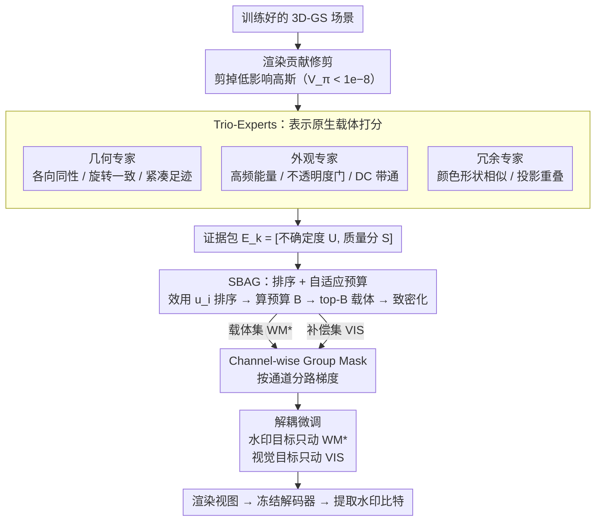

# Where, What, Why: Toward Explainable 3D-GS Watermarking

**会议**: CVPR2026  
**arXiv**: [2603.08809](https://arxiv.org/abs/2603.08809)  
**作者**: Mingshu Cai (Waseda University), Jiajun Li (Southeast University), Osamu Yoshie, Yuya Ieiri, Yixuan Li (NTU)
**代码**: 未开源  
**领域**: 3D视觉  
**关键词**: 3D Gaussian Splatting, 数字水印, 版权保护, 可解释性, 鲁棒嵌入

## 一句话总结

提出一种表示原生的 3D-GS 水印框架，通过 Trio-Experts 选载体（where）、Channel-wise Group Mask 控梯度（what）、解耦微调实现可审计归因（why），在渲染质量（PSNR +0.83 dB）和比特精度（+1.24%）上均超越 SOTA。

## 背景与动机

3D-GS 凭借显式参数化、实时渲染和高保真度，已成为 3D 内容创建的主流范式，广泛应用于影视、游戏、自动驾驶、数字人等领域。然而其核心优势——可直接编辑的高斯参数——也带来严重的安全风险：攻击者可轻松复制模型、篡改内容、剥离作者信息并非法再分发。

现有辐射场水印方法（WateRF、3DGSW、GuardSplat）在显式离散化高斯表示上存在两个核心缺口：

1. **载体选择问题**：如何从大规模异质高斯基元中，综合多视角可见性、频域线索、几何/外观稳定性来选择水印载体
2. **鲁棒隐蔽嵌入问题**：如何在不降低视觉/渲染质量的前提下嵌入鲁棒水印，并在裁剪、压缩、格式转换等常见扰动后仍可提取

## 核心问题

统一回答三个关键问题：**Where**（在哪些高斯上写水印）、**What**（写什么、如何控制更新幅度）、**Why**（为何选这些载体，可解释归因）。

## 方法详解

### 整体框架

3D-GS 把场景显式编码成一堆可直接编辑的高斯，方便归方便，但也让攻击者能轻松复制、篡改、剥离作者信息——水印因此要回答三件事：**Where**（在哪些高斯上写）、**What**（写什么、更新幅度怎么控）、**Why**（凭什么选这些载体，能否审计归因）。整个框架分三段跑：初始化阶段先按渲染贡献修剪冗余高斯，再用 Trio-Experts 提取载体先验、SBAG 选定载体并致密化；解耦微调阶段用 Channel-wise Group Mask 把水印载体和视觉补偿器的梯度分路，各自独立优化；推理阶段从渲染视图经冻结解码器提取水印比特。修剪沿用 3D-GSW 的策略：引入临时颜色参数 $C'$，用辅助 loss 的梯度 $V_\pi = \partial L_\pi^{aux}/\partial C'$ 当贡献分数，剪掉 $V_\pi < 10^{-8}$ 的低影响高斯。

### 关键设计

**1. Trio-Experts：在 3D 参数空间里给每个高斯打"能不能当载体"的分**

先前方法靠图像域梯度/高频启发式选载体，换个视角分数就变、视角不一致。Trio-Experts 改成**表示原生**——证据完全锚在 3D-GS 参数空间，先把高斯参数按语义分成 $\mathcal{C}_{geo}=\{\mathbf{x}, \mathbf{s}, \mathbf{q}\}$、$\mathcal{C}_{app}=\{\alpha, \mathbf{h}^{(0)}, \mathbf{h}^{(\geq 1)}\}$、$\mathcal{C}_{red}=\{\mathbf{x}, \mathbf{s}, \mathbf{q}, \mathbf{h}^{(0)}\}$，在 3D 位置空间建 $k$-NN 邻域 $\mathcal{N}_k(i)$ 后由三个专家分别评估：**几何专家**算尺度各向同性 $\text{Iso}_i=\min(\mathbf{s}_i)/\max(\mathbf{s}_i)$、邻域四元数一致性 $\text{RotCons}_i$ 和紧凑足迹 $\overline{fp}_i$，高各向同性+高旋转一致+小足迹=几何稳定的好载体；**外观专家**用 AC 高频能量比 $\rho_i^{hf}$（越低越好）、双侧不透明度门 $g(\alpha_i)$（中等不透明度最佳）、DC 强度带通 $c_i$ 衡量跨视角外观一致；**冗余专家**用结合颜色形状相似的 $r_{ij}$ 和近似投影重叠的 $w_{ij}$ 估计可替代性，冗余高的高斯即使被扰动也有邻居补偿。

每个专家把特征 $z_k(i)$ 映成**证据包** $E_k(i)=[U_k(i), S_k(i)]$，$U_k\in[0,1]$ 是来自邻域离散度+专家惩罚的不确定度、$S_k\in[0,1]$ 是质量分数。这种质量-置信度解耦让后续门控能感知置信度，而不是只看分数高低。

**2. SBAG：把"排序"和"预算"拆开，自适应决定用多少载体**

选载体不能拍脑袋定个固定比例，否则消息长就不够、消息短又浪费。SBAG 先**排序**：把证据包映成代理分数 $R_k(i)=\text{clip}(S_k(i)-\beta U_k(i), 0, 1)$（分别是几何稳定性、外观安全性、冗余确定性），再取几何均值得点级效用 $u_i=(R_1(i)\cdot R_2(i)\cdot R_3(i))^{1/3}$。然后**单次渲染**用 DC+不透明度渲染所有训练视图一遍，拿到视角修正可见性 $v_i$ 和拥挤因子 $\eta$，据此**自适应算预算**：给定消息长度 $M$，$\kappa_{eff}=\kappa_0\cdot\bar{v}\cdot\eta,\ B=\lceil M/\kappa_{eff}\rceil$。最后在分位数约束的可行集 $\mathcal{F}$（几何/外观/冗余/可见性四维门限）里按 $u_i$ 取 top-$B$ 得初始载体集 $\mathcal{WM}_0$，再用紧凑证据向量 $\mathbf{e}_i$ 算 $\mathcal{WM}_0$ 原型均值 $\boldsymbol{\mu}$、按余弦相似度招募近邻补视角覆盖间隙扩成 $\mathcal{WM}_{parent}$。每个父高斯再致密化分裂成 $N_s$ 个视觉等价子高斯，一个走水印分支、其余当视觉补偿器，最终得载体集 $\mathcal{WM}_\star$ 和补偿集 $\mathcal{VIS}$。

**3. Channel-wise Group Mask：按通道分路梯度，彻底隔开水印与画质**

载体和补偿器若共用一套更新，水印优化和画质优化会互相打架。Group Mask 给五个参数通道组 $g\in\{\boldsymbol{\delta}_{dc}, \boldsymbol{\rho}_{rest}, \boldsymbol{\omega}_{opa}, \boldsymbol{\theta}_{rot}, \boldsymbol{\sigma}_{sca}\}$ 各算两套掩码：**VIS 掩码** $m_g^{vis}$ 取补偿器上通道权重均值并 clip、保最低更新下限 $\text{floor}_g$；**WM 掩码** $m_g^{wm}$ 取载体上通道权重中位数并 clip。梯度据此路由：

$$\nabla_{\theta_i^g} \mathcal{L} = \begin{cases} m_g^{wm}(i) \nabla_{\theta_i^g} \mathcal{L}_{wm}, & i \in \mathcal{WM}_\star \\ m_g^{vis}(i) \nabla_{\theta_i^g} \mathcal{L}_{vis}, & i \in \mathcal{VIS} \end{cases}$$

配合两遍前向/反向，$\mathcal{WM}_\star$ 和 $\mathcal{VIS}$ 以正交方式各收各的梯度，优化干扰被彻底消掉。

### 损失函数 / 训练策略

解耦微调把视觉和水印两个目标分别只作用在对应集合上。**视觉目标**（只动 VIS）$\mathcal{L}_{vis}=\lambda_{rec}\mathcal{L}_{rec}+\lambda_{lpips}\mathcal{L}_{lpips}+\lambda_{wav}^{high}\mathcal{L}_{wav}^{high}$，其中 $\mathcal{L}_{wav}^{high}$ 惩罚多级 DWT 高频子带（LH/HL/HH）。**水印目标**（只动 $\mathcal{WM}_\star$）$\mathcal{L}_{wm}=\lambda_{wm}^{clean}\mathcal{L}_{wm}^{clean}+\lambda_{wm}^{eot}\mathcal{L}_{wm}^{eot}+\lambda_{wav}^{low}\mathcal{L}_{wav}^{low}$，采用 EOT（Expectation Over Transformation）在干净和变换后渲染上同时优化，变换族涵盖模糊、旋转、缩放、裁剪、噪声、JPEG 压缩等；水印仅嵌入 DWT 低频（LL）子带，$\mathcal{L}_{wav}^{low}$ 正则化低频失真。关键是 VIS 点完全排除在水印 loss 之外——一旦把 VIS 耦进水印 loss，它们会反过来对抗 WM 的更新，既掉画质又毁提取稳定性。

## 实验关键数据

### 数据集与设置

在 Blender、LLFF、Mip-NeRF 360 三个标准基准的 25 个场景上评估。使用单张 NVIDIA A800 GPU 训练 2-10 个 epoch，解码器为冻结的 HiDDeN（32/48/64 bits）。

### 渲染质量与比特精度

| 方法 | 32-bit Acc↑ | PSNR↑ | SSIM↑ | 48-bit Acc↑ | PSNR↑ | 64-bit Acc↑ | PSNR↑ |
|---|---|---|---|---|---|---|---|
| WateRF+3D-GS | 93.28 | 30.57 | 0.954 | 84.39 | 30.06 | 74.92 | 25.73 |
| GuardSplat | 95.58 | 35.32 | 0.978 | 93.29 | 33.36 | 90.14 | 32.25 |
| 3D-GSW | 97.22 | 35.15 | 0.977 | 93.59 | 33.26 | 91.31 | 32.52 |
| **Ours** | **98.46** | **35.98** | **0.982** | **94.29** | **33.45** | **91.65** | **32.71** |

32-bit 下 PSNR +0.83 dB（vs 3D-GSW），比特精度 +1.24%。随消息长度增加优势更明显。

### 图像级扰动鲁棒性（32-bit）

| 攻击类型 | WateRF | GuardSplat | 3D-GSW | **Ours** |
|---|---|---|---|---|
| 无扰动 | 93.28 | 95.58 | 97.22 | **98.46** |
| 高斯噪声 | 78.12 | 90.11 | 83.71 | **91.22** |
| 旋转 | 81.47 | 95.87 | 88.05 | **96.18** |
| 缩放 75% | 84.63 | 94.93 | 94.58 | **95.06** |
| 高斯模糊 | 87.09 | 97.16 | 95.94 | **97.75** |
| 裁剪 40% | 84.58 | 95.05 | 92.73 | **95.88** |
| JPEG 50% | 82.03 | 89.92 | 92.54 | **92.95** |
| 组合攻击 | 64.73 | 88.64 | 90.96 | **91.30** |

在所有攻击类型下均达到最佳，尤其在高斯噪声和旋转攻击下优势显著。

### 模型级扰动鲁棒性

对 3D-GS 表示进行恶意篡改（参数加噪 σ=0.1、随机移除/克隆 20% 高斯），本方法在所有扰动下均一致领先，说明水印信息并非依赖脆弱子集。

### 消融实验

SBAG、Group Mask、Decoupled Finetuning 三组件缺一不可。全部移除时比特精度降至 94.70%、PSNR 降至 30.00 dB；全部开启时达 97.80%/35.20 dB。自适应预算（vs 固定 1%/10%）在精度和存储间取得最优平衡（98.46%/178MB）。

## 亮点

1. **表示原生设计**：决策完全在 3D-GS 参数空间进行，不依赖像素域梯度，确保视角一致性
2. **三层解耦架构**：专家评估 → 门控选择 → 梯度路由，每一层都有明确的可解释性
3. **可审计归因**：per-Gaussian 归因揭示水印嵌在哪里及为何选中这些载体
4. **自适应预算机制**：场景感知的载体数量估计（$\kappa_{eff}$），避免过多/过少载体
5. **渲染质量几乎无损**：32-bit 下 PSNR 35.98 dB，SSIM 0.982，接近未水印模型

## 局限与展望

1. **超参敏感**：频域解耦训练需仔细调节 loss 权重以平衡质量和鲁棒性
2. **解码器依赖**：依赖预训练 HiDDeN 解码器，其鲁棒性上界限制了整体系统性能
3. **计算开销未详述**：Trio-Experts 的 k-NN 计算和两遍反向传播的额外开销未量化
4. **动态场景**：结论中提到可扩展到动态场景，但未提供任何实验验证
5. **对抗性攻击**：仅考虑常规图像扰动，未评估针对性对抗攻击的鲁棒性

## 与相关工作的对比

- **WateRF**：NeRF 频域水印迁移到 3D-GS，但缺乏 EOT 对抗训练，在扰动下精度大幅下降（组合攻击仅 64.73%）
- **GuardSplat**：CLIP 引导 + SH 空间嵌入，引入 EOT 但重度依赖 CLIP 解码器，复杂扰动下效果受限
- **3D-GSW**：频域正则化 + 渲染贡献约束，比较全面但缺乏载体-补偿器解耦
- **本文**：唯一在 3D 参数空间做载体选择 + 梯度路由解耦的方法，系统性解决 where/what/why

## 启发与关联

- 三专家打分 + 不确定度加权融合的思路可迁移到其他 3D-GS 编辑任务（如风格化区域选择）
- 解耦微调消除梯度冲突的策略对多目标 3D-GS 优化（如同时做几何精修 + 语义编辑）有启发
- 自适应预算机制（$\kappa_{eff} = \kappa_0 \cdot \bar{v} \cdot \eta$）的场景感知设计值得借鉴

## 评分

- 新颖性: ⭐⭐⭐⭐ — 表示原生三专家系统和梯度解耦路由是新颖设计，where/what/why 框架清晰
- 实验充分度: ⭐⭐⭐⭐ — 三个数据集、三种消息长度、图像级+模型级攻击、完整消融，但缺动态场景和对抗攻击评估
- 写作质量: ⭐⭐⭐⭐ — 结构清晰，数学表述严谨，图表丰富
- 价值: ⭐⭐⭐⭐ — 3D-GS 版权保护的重要工作，可解释性是关键卖点

<!-- RELATED:START -->

## 相关论文

- [\[CVPR 2026\] Write Where It Matters: Policy-Guided Watermarks for 3D Gaussian Splatting](write_where_it_matters_policy-guided_watermarks_for_3d_gaussian_splatting.md)
- [\[CVPR 2026\] Robust3DGSW: Toward Robust Watermarking for Quantization-Aware 3D Gaussian Splatting](robust3dgsw_toward_robust_watermarking_for_quantization-aware_3d_gaussian_splatt.md)
- [\[CVPR 2026\] Mark4D: Temporally-Consistent Watermarking for 4D Gaussian Splatting](mark4d_temporally-consistent_watermarking_for_4d_gaussian_splatting.md)
- [\[CVPR 2026\] What Makes Good Synthetic Training Data for Zero-Shot Stereo Matching?](what_makes_good_synthetic_training_data_for_zero-shot_stereo_matching.md)
- [\[AAAI 2026\] Can Protective Watermarking Safeguard the Copyright of 3D Gaussian Splatting?](../../AAAI2026/3d_vision/can_protective_watermarking_safeguard_the_copyright_of_3d_gaussian_splatting.md)

<!-- RELATED:END -->
