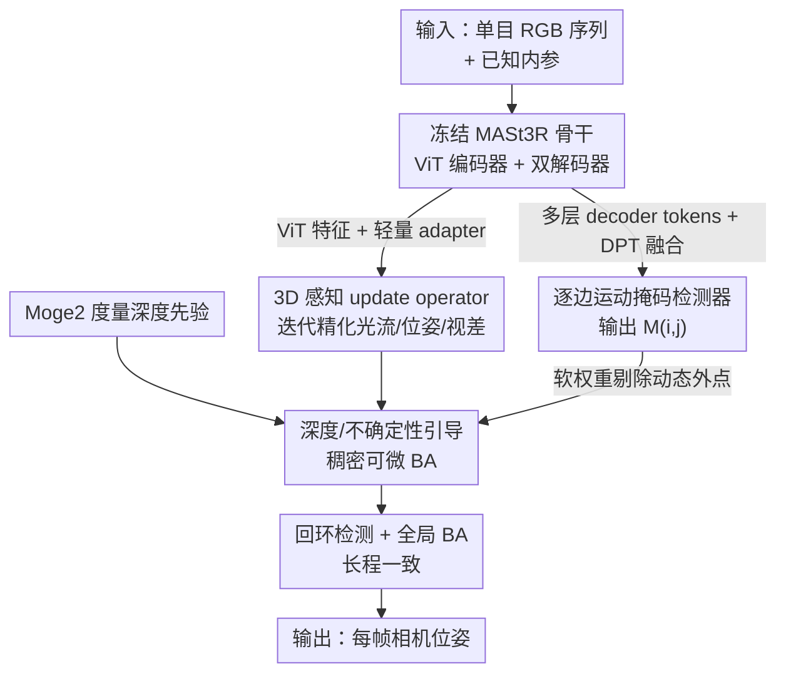

# WildPose: A Unified Framework for Robust Pose Estimation in the Wild

**会议**: CVPR 2026  
**论文**: [CVF Open Access](https://openaccess.thecvf.com/content/CVPR2026/html/Zheng_WildPose_A_Unified_Framework_for_Robust_Pose_Estimation_in_the_CVPR_2026_paper.html)  
**代码**: https://wildpose.github.io （项目页，代码链接见项目页）  
**领域**: 3D视觉 / 视觉SLAM / 相机位姿估计  
**关键词**: 单目SLAM, 可微BA, 动态场景, MASt3R特征, 运动掩码

## 一句话总结
WildPose 把前馈式 3D 重建模型 MASt3R 的强感知前端嫁接进 DROID-SLAM 的可微分束调整（BA）优化后端，再配一个高容量的"逐边"运动掩码检测器剔除动态干扰，做出一个在动态、静态、低位移短序列上都稳的统一单目相机位姿估计框架。

## 研究背景与动机

**领域现状**：单目相机位姿估计（SfM / SLAM）当前由两条深度学习路线主导——一条是前馈式重建模型（DUSt3R、MASt3R、VGGT、π³），单次前向就回归 3D 点图和相机参数；另一条是可微优化框架（DROID-SLAM），用一个可学习的 update operator 喂给可微分 BA 层端到端优化位姿和几何。

**现有痛点**：这两条路线几乎都假设"静态世界"，一旦场景里有运动物体，性能就崩。已有的动态感知方法又各有短板：基于语义分割的方法（MASK-SLAM、ViPE）很脆——受限于预定义类别、检不到新类动态物、且对分割质量敏感（比如有人推桌子走，桌子被当静态，于是 ViPE 在这种序列上误差暴涨）；WildGS-SLAM 靠在线训一个逐序列的 3DGS 渲染不一致 MLP，序列太短、视角覆盖不够就失效；MegaSaM 训了个更通用的运动网络，但它是从光流 ConvGRU 的隐状态里"顺手"解码运动——这个低容量表征本是为传播光流设计的，不是为分割设计的，加上合成训练语料多样性有限，长真实轨迹上有域差。

**核心矛盾**：几乎没有一个方法能"动态稳 + 静态也不掉点"。专攻动态的方法（MegaSaM、ViPE）一到纯静态基准就明显退化，而真实应用必然混合两种场景。

**本文目标**：做一个统一框架，在高动态环境鲁棒，同时在静态、短序列、低位移场景保持 SOTA。

**切入角度**：作者的关键洞察是——把现代 3D 视觉两条强范式连起来：前馈模型的**丰富感知前端** + 可微 BA 的**端到端优化后端**。

**核心 idea**：以 DROID-SLAM 的可微 BA 管线为骨架，从两处增强它——(1) 用冻结的预训练 MASt3R 特征替换原来从零训的简单 CNN 编码器，造一个"3D 感知"的 update operator；(2) 用同一冻结骨干的多层特征喂一个专用的高容量运动掩码检测器，把动态区域当软权重塞进 BA。

## 方法详解

### 整体框架
输入是已知内参的单目 RGB 序列 $\{I_i\}_{i=1}^N$，输出是每帧位姿 $\{\omega_i\}_{i=1}^N \in SE(3)$。整套系统沿用 DROID-SLAM 的"关键帧图 + update operator 迭代精化 + 可微 BA 联合优化"骨架，但在两个关键位置接入冻结的 MASt3R 骨干：一处把它的 **ViT encoder 特征**（经轻量 adapter）送进 update operator 充当 3D 感知前端；另一处把它的**多层 decoder correspondence tokens**（经 DPT 式融合 + CNN 运动头）变成逐边运动掩码。两路输出再加上 Moge2 提供的度量深度先验，一起进入一个"深度与不确定性引导的稠密 BA"层，在剔除动态外点的同时优化轨迹。在线推理时以滑动窗口做局部 BA，并辅以回环检测和全局 BA 保证长程一致性。

### 关键设计

**1. 3D 感知 update operator：把从零训的 CNN 前端换成冻结的 MASt3R ViT 特征**

DROID-SLAM 的 update operator 前端是一个从零训练的简单 CNN，只能抽到弱的辅助特征喂给 ConvGRU，缺乏几何先验，因此对 in-the-wild 输入不够鲁棒。本文第一次把这个 CNN 换成预训练好的 MASt3R 骨干，引入强 3D 几何先验。但直接接是不行的——MASt3R 由一个 ViT encoder 和两个交织的 decoder（DecBlk1/DecBlk2）组成，输出的是复杂多层 correspondence tokens，和 DROID 的 update operator 输入不兼容；而且把 decoder tokens 直接和 ConvGRU 融合在训练和推理上都算不动。作者于是只取 **ViT encoder 的 patch 特征**，再加一个由两层卷积残差构成的轻量 adapter，把它转成 ConvGRU 需要的局部特征图和全局上下文。update operator $F$ 仍按 DROID 的方式迭代精化中间量：

$$(\hat{f}^{t+1}_{i,j},\ \hat{w}^{t+1}_{i,j},\ \hat{\eta}^{t+1},\ \hat{u}^{t+1}) = F(I_i, I_j, \tilde{f}^{t}_{i,j}, r^{t}_{i,j})$$

其中 $\hat{f}$ 是预测光流、$\hat{w}$ 是光流置信度、$\hat{\eta}$ 是稳定 BA 的阻尼因子、$\hat{u}$ 是视差上采样掩码，$r$ 是预测流与几何诱导流 $\tilde{f}$ 的残差。作者实测在 MASt3R / VGGT / π³ 几个前馈骨干里 MASt3R 特征效果最好，推测是因为 MASt3R 的点图精度 + 2D 像素对应预训练目标和 update operator"估光流"的任务最对口，给出的特征比更"全能"的模型更干净、更相关。

**2. 逐边运动掩码检测器：用同一骨干的多层 decoder 特征做高容量动态分割**

静态场景下 BA 目标只由自我运动 $\tilde{f}_{ij}$ 决定，但动态场景里一个运动点的真实光流是相机运动和物体自运动的叠加 $\tilde{f}^{\star}_{i,j} = \Pi_c(\hat{\omega}_j^{-1}\hat{\omega}_i\Pi_c^{-1}(p_i,\hat{d}_i)) + X_{i,j}(p_i)$，其中 $X_{i,j}$ 是物体 3D 位移。若直接最小化 BA 目标，优化器会被动态像素的大残差"带偏"，错误地调整位姿和视差去补偿。针对这点，作者设计了一个专用检测器输出下采样运动图 $\hat{M}_{i,j}\in\mathbb{R}^{\frac{H}{8}\times\frac{W}{8}}$，用来给 BA 残差按动态程度降权。和 MegaSaM 从弱 ConvGRU 隐状态解码不同，这个检测器是**独立、高容量**的模块：它通过 DPT 式融合层聚合 MASt3R **transformer decoder 的多层 correspondence tokens**，再过一个 CNN 运动头回归出参考帧 $i$ 上的运动图。

这里最巧的是"**逐边（pairwise）**"而非"逐帧/全局"的掩码设计。一个物体可能只是短暂运动、在序列其余部分是静止的，给它打一个单帧"动态"标签并不可靠（如一个被挪过的箱子，在多数视角里是静的，全局一致性方法 WildGS-SLAM 反而漏检它）。WildPose 的掩码是针对帧对 $(I_i, I_j)$ 的：只有物体在这一对之间确实动了才会被掩掉，若它在这一对里是静的就被保留为有效约束。这样既解决了时间歧义，又能无缝塞进每条 BA 图边的优化里。

### 损失函数 / 训练策略
两个可学习模块（update operator 和运动检测器）用**多阶段课程**分三步训：

- **阶段一（纯静态）**：仅用静态数据端到端训 update operator，学纯自我运动诱导的成对光流，损失为 $\mathcal{L}_1 = w_{cam}\mathcal{L}_{cam} + w_{flow}\mathcal{L}_{flow} + w_{res}\mathcal{L}_{res}$（位姿损失 + 几何诱导流对 GT 流的损失 + 几何流对预测流的残差损失）。
- **阶段二（静态+动态混合）**：在混合数据上 finetune operator，把标注运动掩码 $M$ 直接注入 BA 权重矩阵 $\bar{\Sigma}^{-1}_{ij} = \mathrm{diag}(\hat{w}_{i,j} M_i)$，让 operator 学会适配被掩的输入、泛化到动态外点。
- **阶段三（训检测器）**：冻结 operator 和可微 BA，用检测器**预测**的掩码替换 GT 掩码，去掉 flow/residual 损失只留位姿和掩码质量，$\mathcal{L}_2 = w_{cam}\mathcal{L}_{cam} + w_{mask}\mathcal{L}_{BCE}$。

训练数据混合了合成静态（TartanAir V2、TartanGround）与动态（Dynamic Replica、OmniWorld-Game），并用 Kubric 模拟器补了三类公共数据中欠表征的相机运动——纯平移、纯旋转、target-locked（注视点固定相机移动）。整套课程在 8× A100 上约两周。推理时新关键帧用 Moge2 度量深度初始化视差，并在 BA 目标里加一项视差正则 $\lambda\sum_i\|\hat{d}_i - 1/D_i\|^2$；但在最终全局 BA 里去掉这项深度正则——因为度量深度做初始化好，但当估计已高度精化时其固有噪声反而有害。

## 实验关键数据

### 主实验
在多个 SLAM 基准上以 ATE RMSE（绝对轨迹误差均方根，越低越好）评测，轨迹用 Sim(3) Umeyama 对齐 GT 后计算。

| 数据集（类型） | 指标 | WildPose | 次优基线 | 说明 |
|--------|------|------|----------|------|
| Wild-SLAM MoCap（动态，cm） | ATE Avg. | **0.39** | 0.46 (WildGS-SLAM) | 全序列均最佳 |
| Bonn RGB-D（动态，cm） | ATE Avg. | 2.36 | **2.31** (WildGS-SLAM) | 第二，差距很小 |
| TUM Dynamic（动态，cm） | ATE Avg. | **1.57** | 1.58 (WildGS-SLAM/MegaSaM) | 最佳 |
| Sintel（低位移，归一化） | ATE Avg. | **0.017** | 0.018 (MegaSaM) | 最佳 |
| TUM（静态，m） | ATE Avg. | **0.027** | 0.030 (MASt3R-SLAM) | 全轨迹估计器中最佳 |
| 7-Scenes（静态，m） | ATE Avg. | 0.049 | 0.047 (MASt3R-SLAM*) | 全轨迹估计器中最佳 |

关键对比：动态专项的 ViPE 在 Table1/Table2（人推桌子）序列误差暴涨——桌子被语义当静态而漏检；MegaSaM/ViPE 在动态上不错但一到静态基准就明显退化，而 WildPose 两边都稳，这正是"统一"的价值。下游应用上，把 MegaSaM 的深度优化管线换成 WildPose 的位姿 + 运动掩码，在 Bonn 长视频深度估计上 Abs.Rel. 0.12 / δ1.25 96.3，全指标超过所有基线（含 MegaSaM 0.13 / 94.5），印证更准的位姿能反哺深度。

### 消融实验
在 Wild-SLAM / Bonn / TUM 上消融三个设计（ATE RMSE ↓ cm）：

| Mix.Ft. | Mot.Mask | GBA Dep.Off | Wild-SLAM | Bonn | TUM |
|:---:|:---:|:---:|:---:|:---:|:---:|
| ✗ | ✗ | ✓ | 2.16 | 5.58 | 2.10 |
| ✓ | ✗ | ✓ | 0.76 | 2.61 | 1.58 |
| ✗ | ✓ | ✓ | 0.61 | 2.55 | 1.66 |
| ✓ | ✓ | ✗ | 2.34 | 2.60 | 2.13 |
| ✓ | ✓ | ✓ (Full) | **0.39** | **2.50** | **1.54** |

- **Mix.Ft.**：用静态+动态混合 finetune update operator；
- **Mot.Mask**：运动掩码检测器降权动态区域；
- **GBA Dep.Off**：最终全局 BA 里移除深度正则项。

### 关键发现
- 单看 Wild-SLAM，去掉混合 finetune（2.16）或去掉运动掩码（从 0.39 退化）都明显掉点，二者协同时才到 0.39，说明"3D 感知 operator + 动态掩码"是互补的而非冗余。
- **最反直觉的一行**：保留最终全局 BA 的深度正则（GBA Dep.Off=✗）反而把 Wild-SLAM 从 0.39 拉到 2.34、TUM 从 1.54 拉到 2.13——验证了"深度先验只适合做初始化、精化后期其噪声有害"的判断。
- WildGS-SLAM 在长动态序列上很强，但在 Sintel 短序列上反而比一些静态方法还差——因为短序列建不出高质量 3DGS 图来训它的不确定性 MLP，恰好暴露了逐序列在线优化方法的软肋。

## 亮点与洞察
- **"嫁接"而非"重造"**：核心是把前馈大模型（MASt3R）的预训练特征插进可微优化管线，而不是端到端从头训一个新系统。ViT encoder 特征喂 operator、decoder tokens 喂掩码检测器——同一冻结骨干一鱼两吃，省算力还涨点。
- **逐边运动掩码**是最"啊哈"的设计：把"这个物体是不是动态的"从一个全局/单帧的绝对判断，改成针对每条 BA 图边的相对判断，干净地化解了"短暂运动物体"的时间歧义，且天然契合 BA 的图结构。
- **诚实的负结果**：作者把"全局 BA 阶段深度正则反而有害"这条做进消融并保留，给后来者一个明确信号——度量深度先验该在哪个阶段用、用到什么程度。
- 可迁移："取前馈骨干的不同层特征分别服务不同子任务（编码层给 operator、对应层给分割）"这一思路，可推广到任何"想给优化式管线注入预训练感知先验"的几何视觉任务。

## 局限与展望
- 依赖冻结的 MASt3R 骨干和 Moge2 深度先验，系统性能上限部分被这些外部模型锁定；作者也提到度量深度噪声需要靠"分阶段开关正则"来规避，说明先验融合还不够优雅。
- 训练成本高（8×A100 两周、多阶段课程、还要 Kubric 合成补数据），复现门槛不低。
- 在 Bonn 上略逊于 WildGS-SLAM，作者归因于后者显式处理了光照变化——说明 WildPose 对跨帧光照变化的鲁棒性仍有提升空间。
- 论文把详细局限和未来工作放在补充材料，正文未充分展开；逐边掩码在极端长程、重复运动模式下的稳定性也有待更多验证。

## 相关工作与启发
- **vs DROID-SLAM**：同样是可微 BA + update operator 骨架，但 DROID 的前端是从零训的简单 CNN、且纯静态训练；WildPose 换上冻结 MASt3R 特征 + 混合动态课程，从"只在静态稳"升级到"动静态都稳"。
- **vs MASt3R-SLAM**：两者都用 MASt3R，但 MASt3R-SLAM 是完全 training-free、自底向上直接用它的 3D 点图输出，主要面向静态；WildPose 把 MASt3R 的内部特征接进可学习的优化管线，能处理显著动态。
- **vs MegaSaM**：都训通用运动估计器，但 MegaSaM 从光流 ConvGRU 的低容量隐状态解码运动、且合成语料多样性有限；WildPose 用独立高容量检测器 + 3D 感知特征 + 逐边掩码，动态检测更准、长序列泛化更好。
- **vs WildGS-SLAM**：后者靠在线训逐序列 3DGS 不确定性 MLP，强依赖建图质量和宽视角覆盖、管线慢、短序列失效；WildPose 是离线训好的前馈检测器，短序列同样稳、且无在线建图开销。

## 评分
- 新颖性: ⭐⭐⭐⭐ 把前馈感知前端与可微 BA 后端的"嫁接"做实，逐边运动掩码是有辨识度的新设计，但整体仍是在 DROID-SLAM 框架上的增强。
- 实验充分度: ⭐⭐⭐⭐⭐ 覆盖动态/静态/低位移多类基准 + 下游深度估计，消融把三个设计和反直觉的深度正则都验证清楚。
- 写作质量: ⭐⭐⭐⭐ 动机层层递进、把每个对比方法的短板讲得很清楚；部分关键细节（架构、限制）压进了补充材料。
- 价值: ⭐⭐⭐⭐⭐ "动静态统一鲁棒"切中真实应用痛点，SOTA 且能反哺深度估计等下游任务，实用价值高。

<!-- RELATED:START -->

## 相关论文

- [\[CVPR 2026\] ComPose: A Unified Completion-Pose Framework for Robust Category-Level Object Pose Estimation](compose_a_unified_completion-pose_framework_for_robust_category-level_object_pos.md)
- [\[CVPR 2026\] PoseMaster: A Unified 3D Native Framework for Stylized Pose Generation](posemaster_a_unified_3d_native_framework_for_stylized_pose_generation.md)
- [\[CVPR 2026\] PoseGAM: Robust Unseen Object Pose Estimation via Geometry-Aware Multi-View Reasoning](posegam_robust_unseen_object_pose_estimation_via_geometry-aware_multi-view_reaso.md)
- [\[CVPR 2026\] Event Structural Valley: A Unified Theoretical and Practical Framework for Event Camera Autofocus](event_structural_valley_a_unified_theoretical_and_practical_framework_for_event_.md)
- [\[CVPR 2026\] Seele: A Unified Acceleration Framework for Real-Time Gaussian Splatting on Mobile Devices](seele_a_unified_acceleration_framework_for_real-time_gaussian_splatting_on_mobil.md)

<!-- RELATED:END -->
