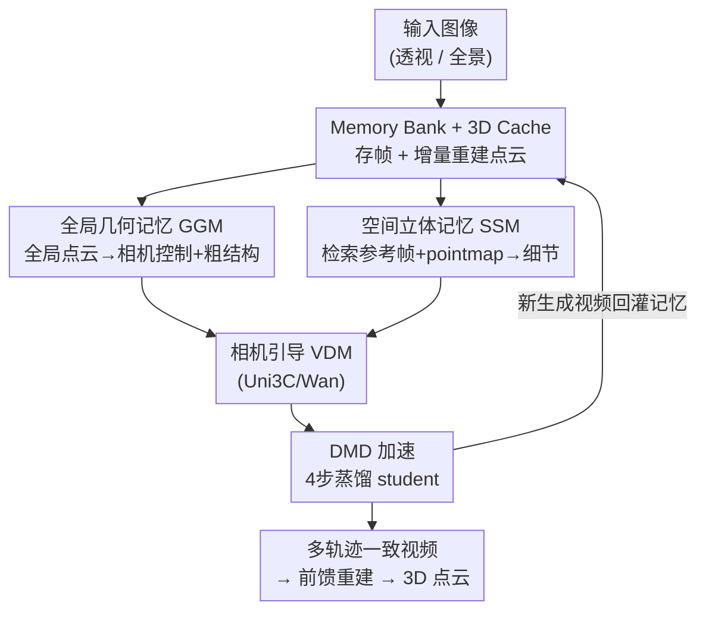

# WorldStereo: Bridging Camera-Guided Video Generation and Scene Reconstruction via 3D Geometric Memories

**会议**: CVPR 2026  
**论文**: [CVF Open Access](https://openaccess.thecvf.com/content/CVPR2026/html/Zhang_WorldStereo_Bridging_Camera-Guided_Video_Generation_and_Scene_Reconstruction_via_3D_CVPR_2026_paper.html)  
**代码**: https://github.com/FuchengSu/WorldStereo (待开源)  
**领域**: 3D视觉  
**关键词**: 相机引导视频生成、3D场景重建、世界模型、几何记忆、视频扩散模型

## 一句话总结
WorldStereo 在现成视频扩散模型（VDM）上挂两个互补的"几何记忆"ControlNet 分支——全局几何记忆（GGM）用增量更新的点云保结构、保相机精度，空间立体记忆（SSM）用检索参考帧 + pointmap 约束注意力保细节——从而沿多条相机轨迹生成彼此一致的视频，喂给前馈 3D 重建后得到高保真点云；再用蒸馏（DMD）把推理压到 4 步、20× 加速。

## 研究背景与动机

**领域现状**：从"先生成、再重建"（generate first, then reconstruct）的范式出发，用相机可控的视频扩散模型（camera-guided VDM）沿指定轨迹生成视频，再用前馈 3D 重建（如 DUSt3R 系、WorldMirror）把视频变成点云/3DGS，是当下做单图→3D 场景生成最流行的路线之一。相机控制信号也已经从 Plücker ray 一路扩展到点云、网格、光流、tracking points 等显式几何引导。

**现有痛点**：尽管生成视频"看起来"很真，但拿去重建 3D 却常常糊、常常崩。根因是单条视频轨迹覆盖的视角不够多、不够全，而把视频拉长来覆盖更多视角又会同时带来三个问题：① 长序列推理与微调成本爆炸；② 视频质量下降；③ 自回归（AR）VDM 虽然提效但相机精度差、误差累积。更要命的是，跨不同相机轨迹生成的内容互相打架（memoryless visual conflicts）——同一个场景从不同方向看居然长得不一样，重建自然崩。

**核心矛盾**：「视角覆盖广」与「跨轨迹一致 + 高画质 + 精确相机控制」之间存在张力。单轨迹长视频想要广覆盖就牺牲质量/算力；多轨迹短视频质量好但彼此不一致。同时，纯点云条件给 VDM 当引导时，VDM 为了保住自己的泛化能力会"忽略"点云带来的几何结构（哪怕点云本身重建得很完美），导致结构约束失效。

**本文目标**：让现成 VDM 沿**多条互补的中等长度轨迹**生成视频，而每条轨迹之间在粗结构和细节上都保持一致，从而既绕开长序列生成的代价、又保住预训练 VDM 的泛化与可用性，最终重建出高质量 3D。

**切入角度**：作者把"跨轨迹一致性"问题重述为一个**记忆**问题——模型每生成一段新视频，就把它的视觉内容和重建出的点云存进记忆，后续轨迹生成时主动调取这份记忆做约束。粗结构靠全局点云记忆，细节靠类比传统立体匹配（stereo matching）的参考帧 + 3D 对应（pointmap）记忆。

**核心 idea**：在冻结的相机引导 VDM（Uni3C）上加两个互补的几何记忆 ControlNet 分支——**GGM 管"骨架"、SSM 管"皮肤"**——用增量点云 + 检索式立体注意力把多条轨迹的生成钉死在同一份几何上；再因为所有条件都是 pixel-wise 对齐、走 ControlNet 注入，整套东西天然兼容 DMD 蒸馏，无需联合训练即可 4 步加速。

## 方法详解

### 整体框架
WorldStereo 基于相机引导 VDM **Uni3C**（构建在冻结的 Wan2.1-14B-I2V 之上，挂一个轻量 ControlNet 相机分支），扩展出"记忆生成"能力。给定一张图，整体按"生成→重建→记忆→再生成"的循环跑：

1. **基础设施（Memory Bank + 3D Cache）**：生成的视频帧时序降采样后存入 2D 记忆库 $\{I_{mem}\}_{m=0}^{M}$（初始条件图、从 360° 全景切出的透视图也都进库）；记忆库里的图用前馈重建 WorldMirror 增量重建成全局点云集 $X_{cache}$ 存入 3D 缓存，长序列下不同缓存用 Umeyama 变换对齐重叠视角后合并。
2. **GGM 分支（相机 ControlNet）**：把 Uni3C 原本只有参考帧点云的引导，升级成增量更新的**全局**点云 $X^g_{pcd}$，既给精确相机控制、又注入粗几何先验。
3. **SSM 分支（新增 ControlNet，从头训 20 层 DiT）**：从记忆库检索与目标视角空间重叠最大的参考帧，与目标视角水平拼接、叠加 pointmap，用受限注意力让每个目标帧只盯住自己检索到的那张参考，恢复细粒度细节。
4. **DMD 加速**：因为两条控制分支都 pixel-wise 对齐，可把 VDM 主干蒸成 4 步 student，记忆/控制分支无需联合微调即可迁移。

两条 ControlNet 分支的输出都通过 zero-linear 逐元素加回主 VDM block。生成的新视频回灌记忆库/3D 缓存，支撑下一条轨迹——这就是"记忆"循环。

### 关键设计

**1. Memory Bank + 3D Cache：把"生成历史"沉淀成可调取的 2D/3D 记忆**

这是支撑后两个设计的地基，专门解决"多条轨迹各生成各的、互不知情导致打架"的痛点。生成的视频帧先时序降采样存进 **2D 记忆库** $\{I_{mem}\}_{m=0}^{M}$，用来给 SSM 检索空间上相似的参考视角；初始条件图、从 360° 全景切出的透视图也一并入库。**3D 缓存** $X_{cache}$ 则用前馈重建 WorldMirror 把记忆库里的图增量重建成全局点云——每生成一段新视频就增量重建一次。面对长序列，不同时段的 3D 缓存通过 **Umeyama 变换**对齐重叠视角的点云后合并到统一坐标系。这套"边生成边记忆"的设计让后续轨迹不再从零开始幻想，而是有一份持续生长的几何账本可查，是整套一致性的物理载体。

**2. 全局几何记忆 GGM：用增量点云逼 VDM 真正"听"几何，而不是只拿点云当相机提示**

针对"VDM 为保泛化而忽略点云几何结构"这个痛点。原始 Uni3C 里点云只起相机引导作用、不强迫 VDM 拟合 3D 表示——这虽然保住了泛化（不被劣质单目深度带歪），却让模型把点云带来的几何结构基本无视掉。GGM 的做法是**微调相机控制分支**，把条件从参考帧点云 $X_{pcd}$（式 1，由单目深度 MoGe 反投影：$X_{pcd}(x) \simeq R_{c\rightarrow w} D(x) K^{-1}\hat{x}$）升级为拼接了其他视角点云的全局点云：

$$X^g_{pcd} = [X_{pcd}, \hat{X}_{pcd}]$$

其中 $\hat{X}_{pcd}$ 是其他视角的点云，推理时直接用增量更新的 3D 缓存充当、并经 Umeyama 与 $X_{pcd}$ 对齐。为避免训练时过拟合到新视角点云，引入**点云掩码策略**：随机丢弃目标视角的一部分点，逼模型对"部分几何缺失"鲁棒（这恰好匹配真实推理时点云不完整的情况）。GGM 因此能稳住粗结构、提升大幅视角变化下的相机精度；而且天然兼容全景——用 MoGe 全景深度估计构造 360° 点云当初始 3D 缓存即可。

**3. 空间立体记忆 SSM：借立体匹配的思路，用受限注意力把目标帧钉在检索到的参考帧上找回细节**

GGM 只保住了粗结构，细节仍然糊（图 5）。以往做法是检索历史参考帧后用 full-attention 联合建模所有帧，但这需要大量后训练去适配长序列，且无法保证检索帧的连续性（如全景场景里参考帧是离散、无序的），反而拖累 VDM 学习。SSM 借鉴传统**立体匹配**和参考式 inpainting：给定 $N$ 个目标位姿，先均匀采 $F = N/4$ 个，从记忆库检索其最近邻帧当参考——检索准则从 2D 平面扩到 3D 空间，选**目标与参考相机视锥体的体积重叠 FoV 最大**的视角。每个参考帧单独经 3D-VAE 编码成 $\{z_{ref}\}$，与目标 latent **水平拼接** $z_{stitch}=[z_{tar}; z_{ref}] \in \mathbb{R}^{F\times 2HW\times C}$；再叠加 pointmap（记录该 target-reference 对在 3D 世界坐标里的点云位置，归一化上色成 RGB 后编码为 $\hat{z}_{pm}=[\hat{z}_{tar};\hat{z}_{ref}]$），最终 SSM 分支输入 $z_{ssm}=z_{stitch}+\hat{z}_{pm}$。关键的"立体"约束在注意力上：把特征 rearrange 成 $[BF, H{*}2W, C]$，**限制注意力只沿 $H{*}2W$ 维度做**，即每个 target-reference 对只关注自己、不和别的对纠缠，算完只把 target 特征加回主 VDM block。消融证明 pointmap 提供的 3D 对应信息对 SSM 至关重要——它让注意力聚焦到正确的匹配区域。训练用的多视角 target-reference 对靠对现有多视角数据做**时序错位采样**合成（参考/目标视频时序重叠控制在 30%–90%），再随机打乱、加掩码模拟真实检索的无序与离散。

**4. DMD 加速：靠 pixel-wise 对齐的控制分支天然解耦，无需联合训练就能 4 步推理**

要把 14B VDM 落地推理就得提速，但常规做法是把控制和加速一起联合训练，代价高且易破坏泛化。WorldStereo 的巧处在于：所有 pixel-wise 对齐的条件都走 ControlNet 注入，于是可以**纯用相机引导视频生成（不带任何记忆训练）来做 DMD**。DMD 沿用变分得分蒸馏思路，用冻结真实得分 $s_{real}$ 与可训练假得分 $s_{fake}$ 的差近似 KL 散度蒸馏 student $G_\theta$：

$$\nabla \mathcal{L}_{\text{DMD}} = -\mathbb{E}_t\left(\int \left(s_{\text{real}}(x_t,t) - s_{\text{fake}}(x_t,t)\right)\frac{dx_t}{d\theta}\,dz\right)$$

$G_\theta$、$s_{real}$、$s_{fake}$ 都从 Uni3C 初始化，$s_{real}$ 冻结，每更新一次 generator 训 5 次 $s_{fake}$；用随机梯度截断稳训练、去掉 GAN loss（影响小却拖慢训练）。为解耦"控制"与"少步生成"，**冻结 generator 的相机控制分支、只训主干**。这样相机分支和记忆分支都能直接迁到蒸馏后的 $G_\theta$ 上、**无需任何联合微调**。作者还发现保留高质量、相对简单的轨迹对 DMD 稳训关键（student 容易学到 teacher 在困难轨迹下的过饱和/幻觉伪影）；这个数据过滤不会损相机可控性（表 2 验证）。最终把 40 步降到 4 步、CFG 5.0 的真实得分换来 CFG-free generator，整体提速约 20×。

### 损失函数 / 训练策略
分三阶段 + DMD 蒸馏：① 相机 ControlNet 按 Uni3C 设定重训 8,000 步（batch 32）；② GGM 阶段用全局点云增广微调相机 ControlNet 4,000 步；③ SSM 阶段从头训新分支 6,000 步（用定制的记忆-检索数据）。两个记忆机制训练耗 60 小时 / 64×H20。DMD 训 1,000 步 / 13 小时；所有训练数据 480p、可变长宽比，验证可泛化到 720p。

## 实验关键数据

### 主实验：OOD 相机控制 + 视觉质量（表 2）
从 WorldScore 静态子集选 100 张高质量图（真实/风格化/室内/室外）当首帧，随机组合平移、旋转、平移构造复杂轨迹；用 WorldMirror 从生成视频反解相机，对比旋转误差 RotErr、平移误差 TransErr、绝对轨迹误差 ATE，以及 Q-Align、CLIP-IQA+ 等质量指标。Uni3C 与 WorldStereo 系列统一 512p、81 帧公平比较。

| 方法 | RotErr↓ | TransErr↓ | ATE↓ | Q-Align-V↑ | CLIP-IQA+↑ | Time(s) |
|------|---------|-----------|------|-----------|-----------|---------|
| Voyager | 0.678 | 0.630 | 1.343 | 0.664 | 0.414 | 343 |
| SEVA | 0.171 | 0.540 | 1.023 | 0.782 | 0.514 | 90 |
| Gen3C | 0.220 | 0.275 | 1.071 | 0.820 | 0.518 | 158 |
| Uni3C (base) | 0.155 | 0.192 | 0.572 | 0.846 | 0.549 | 162 |
| WorldStereo* | 0.132 | 0.178 | 0.542 | 0.860 | 0.559 | 162 |
| WorldStereo-GGM | **0.129** | **0.162** | 0.706 | **0.875** | **0.572** | 162 |
| WorldStereo-Full | 0.145 | 0.253 | 0.667 | 0.866 | 0.561 | 173 |
| WorldStereo-DMD | 0.146 | 0.203 | **0.504** | 0.874 | 0.573 | **9** |

不带任何记忆的基础版 WorldStereo* 已在相机精度与画质上全面超过竞品（RotErr 0.132 vs Uni3C 0.155）。这里记忆库/3D 缓存只存首帧信息——单图条件下记忆机制对相机控制没增益，但说明记忆训练**没有损坏**泛化与质量；GGM 还把画质拉高（Q-Align-V 0.875），SSM 在该设置下略降指标但带来强细粒度细节恢复（图 5d）。DMD 版把推理从 162s 压到 **9s**，相机控制与质量几乎不掉。

### 单图重建基准（表 3）
作者自建 3D 重建基准：Tanks-and-Temples（有 GT 点云）+ MipNeRF360（MVS 重建并裁前景当伪 GT），每个场景只给单张首帧。沿 up/left/right 旋转 + orbit 四条预定义轨迹生成视频→WorldMirror 重建→对齐 GT，报告点云 F1、AUC 及相机误差。

| 数据集 | 方法 | F1↑ | AUC↑ | RotErr↓ | TransErr↓ | ATE↓ |
|--------|------|-----|------|---------|-----------|------|
| Tanks&Temples | Uni3C | 0.424 | 0.378 | 0.362 | 0.1017 | 0.1572 |
| | Gen3C | 0.416 | 0.380 | 0.342 | 0.0949 | 0.1704 |
| | VMem | 0.386 | 0.375 | 0.533 | 0.1510 | 0.1922 |
| | WorldStereo* | 0.447 | 0.389 | 0.377 | 0.0990 | 0.1545 |
| | WorldStereo-GGM | 0.485 | 0.411 | **0.224** | **0.0885** | **0.1350** |
| | **WorldStereo-Full** | **0.578** | **0.437** | 0.247 | 0.0927 | 0.1501 |
| | WorldStereo-DMD | 0.534 | 0.410 | 0.291 | 0.1001 | 0.1547 |
| MipNeRF360 | Uni3C | 0.352 | 0.347 | 0.112 | 0.0086 | 0.0104 |
| | Gen3C | 0.356 | 0.340 | 0.349 | 0.0220 | 0.0318 |
| | WorldStereo* | 0.350 | 0.342 | 0.097 | 0.0076 | **0.0099** |
| | **WorldStereo-Full** | **0.406** | **0.402** | 0.114 | 0.0080 | 0.0132 |
| | WorldStereo-DMD | 0.390 | 0.387 | 0.159 | 0.0106 | 0.0267 |

完整模型在 Tanks&Temples 上把 F1 从基础版 0.447 拉到 **0.578**（vs Uni3C 0.424、Gen3C 0.416），MipNeRF360 上 F1 0.406、AUC 0.402 同样领先。DMD 版重建仍很强（T&T F1 0.534），证明大幅加速下一致性几乎不丢。

### 消融与关键发现（表 2/3 + 图 5）

| 配置 | T&T F1 | 说明 |
|------|--------|------|
| Baseline（无记忆） | 0.447 | 新视角会随机幻想出新物体 |
| + GGM | 0.485 | 保住粗结构、改善大视角变化下相机精度 |
| + GGM + SSM（Full） | **0.578** | 在粗结构上补回细粒度细节 |
| GGM+SSM w/o Pointmap | （图 5c，明显变差） | 去掉 3D 对应，注意力聚焦错区域 |

- **GGM 管粗、SSM 管细，且互补**：去掉记忆模型会在新视角凭空幻想物体；GGM 增量 3D 缓存稳住骨架；SSM 靠受限注意力 + pointmap 把细节钉回参考帧。重建分数的最大跃升来自二者叠加（0.447→0.578）。
- **pointmap 是 SSM 的命门**：去掉 pointmap（图 5c）注意力会聚焦到错误匹配区域，细节恢复明显退化——3D 对应信息比单纯检索参考帧重要得多。
- **记忆训练不伤泛化**：单图设置下记忆机制对相机控制无增益但也不掉点，说明加记忆没有破坏 VDM 原有能力。
- **DMD 数据过滤**：保留高质量、相对简单轨迹对稳训关键，否则 student 会学到 teacher 的过饱和/幻觉伪影；该过滤不损相机可控性。
- **全景扩展**：把全景切成 27 帧（FoV 90×120）当初始记忆库、MoGe 全景深度建 3D 缓存，即可在 576p 下做高分辨率 3D 全景生成（图 6）。

## 亮点与洞察
- **把"跨轨迹一致性"重述为记忆问题**：不去硬扛长序列，而是让模型边生成边把视觉/几何沉淀进 2D 记忆库 + 3D 缓存，后续轨迹主动查记忆——绕开了长视频的算力墙，又保住了现成 VDM 的泛化，这个 framing 很巧。
- **GGM 戳破"点云引导失效"的隐疾**：作者点出 VDM 为保泛化会忽略点云几何结构（哪怕点云完美），并用全局点云增广 + 点云掩码逼模型真正"听"几何，这是别人没明说的痛点。
- **SSM 把立体匹配搬进注意力**：水平拼接 target-reference + 受限注意力（只沿 $H{*}2W$ 维），等价于让每个目标帧和参考帧做"软立体匹配"，pointmap 提供显式 3D 对应——这套设计可迁移到任何需要"检索式细节一致"的生成任务（如长视频续写、参考式编辑）。
- **ControlNet 对齐 → DMD 解耦**：因为条件都 pixel-wise 对齐，记忆/控制分支能零成本迁到蒸馏 student，4 步 20× 加速且重建几乎不掉——"为可蒸馏而设计架构"的思路值得借鉴。

## 局限与展望
- **依赖前馈重建质量**：3D 缓存由 WorldMirror 增量重建，单目深度（MoGe）与 WorldMirror 的误差会顺着记忆循环传递、可能累积；作者用 Umeyama/ICP 对齐缓解，但底层重建器的上限就是 WorldStereo 的上限。
- **多轨迹覆盖仍靠预定义/启发式轨迹**：重建基准用 up/left/right + orbit 四条预设轨迹、全景用"启发式 wonder 轨迹"，轨迹设计偏人工，复杂场景下未必最优覆盖。
- **SSM 单图无增益**：表 2 单图设置下 SSM 略降指标，其价值要在多轨迹/多视角检索时才体现——意味着方法的收益高度依赖记忆库已有足够多样的历史视角。
- **训练成本不低**：两个记忆机制 60 小时 / 64×H20，14B 主干，复现门槛较高。
- ⚠️ 训练具体采样/掩码细节、全景轨迹设计等放在 supplementary，正文未完全展开，以原文为准。

## 相关工作与启发
- **vs Uni3C（base）**：Uni3C 用 Plücker ray + 参考帧点云做单轨迹相机控制；WorldStereo 把点云升级为增量全局点云（GGM）并新增检索式立体记忆（SSM），从"单轨迹可控"走到"多轨迹一致 + 可重建"，重建 F1 在 T&T 上 0.424→0.578。
- **vs Gen3C / SEVA（generate-first 重建路线）**：它们也走"先生成再重建"，但生成视频不够长/跨轨迹不一致，重建模糊残缺；WorldStereo 靠记忆机制保住跨轨迹一致，点云完整度与精度明显更高。
- **vs 长上下文 / AR 记忆视频生成**：扩展上下文长度或把历史帧压进窗口/注意力的做法要么算力贵、要么信息损失伤 3D 一致；WorldStereo 用 3D 对应建模 + 受限注意力同时保 3D 一致与细节。
- **vs 端到端"生成即重建"（联合建模 depth/3DGS/pointmap）**：这类方法数据饥渴、需大量训练、易伤基础模型泛化；WorldStereo 保留 VDM 原始输出形式与泛化，仅靠记忆机制补一致性，更轻量、更通用。

## 评分
- 新颖性: ⭐⭐⭐⭐⭐ 把跨轨迹一致性重述为 2D+3D 几何记忆问题，GGM/SSM 互补设计 + 立体匹配式受限注意力都很有想法。
- 实验充分度: ⭐⭐⭐⭐⭐ OOD 相机控制 + 自建单图重建基准双线评测，含完整记忆/pointmap/DMD 消融，结论自洽。
- 写作质量: ⭐⭐⭐⭐ 动机层层递进、图 2/3 把 pipeline 讲清；部分采样/轨迹细节压到 supplementary。
- 价值: ⭐⭐⭐⭐⭐ 在现成 VDM 上即插即用、4 步 20× 加速且重建不掉点，对"VDM 当世界模型做 3D 生成"很实用。

<!-- RELATED:START -->

## 相关论文

- [\[CVPR 2026\] Image-Guided Geometric Stylization of 3D Meshes](image-guided_geometric_stylization_of_3d_meshes.md)
- [\[CVPR 2026\] Illumination-Consistent Human-Scene Reconstruction from Monocular Video](illumination-consistent_human-scene_reconstruction_from_monocular_video.md)
- [\[ICCV 2025\] Geo4D: Leveraging Video Generators for Geometric 4D Scene Reconstruction](../../ICCV2025/3d_vision/geo4d_leveraging_video_generators_for_geometric_4d_scene_reconstruction.md)
- [\[CVPR 2026\] Gen3R: 3D Scene Generation Meets Feed-Forward Reconstruction](gen3r_3d_scene_generation_meets_feed-forward_reconstruction.md)
- [\[CVPR 2026\] Complet4R: Geometric Complete 4D Reconstruction](complet4r_geometric_complete_4d_reconstruction.md)

<!-- RELATED:END -->
