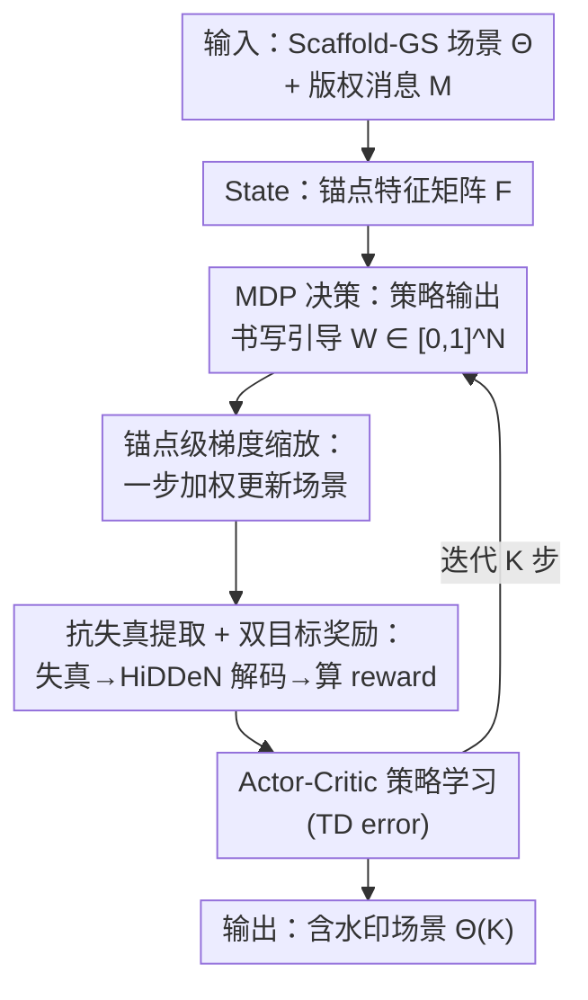

# Write Where It Matters: Policy-Guided Watermarks for 3D Gaussian Splatting

**会议**: CVPR 2026  
**论文**: [CVF Open Access](https://openaccess.thecvf.com/content/CVPR2026/html/Li_Write_Where_It_Matters_Policy-Guided_Watermarks_for_3D_Gaussian_Splatting_CVPR_2026_paper.html)  
**代码**: 待确认  
**领域**: 3D视觉  
**关键词**: 3D高斯泼溅、数字水印、强化学习、版权保护、Scaffold-GS

## 一句话总结
把"往 3D 高斯场景里嵌入版权水印"重新建模成一个马尔可夫决策过程，用一个轻量策略网络逐锚点（per-anchor）地决定"写在哪、写多重"，再由不可见性 + 抗失真解码的联合奖励来训练策略，在 Blender / LLFF / Mip-NeRF 360 三个数据集上以约 9 分钟/场景的代价拿到 SOTA 的比特准确率和渲染保真度。

## 研究背景与动机

**领域现状**：3D Gaussian Splatting（3DGS）凭借可微光栅化能做到照片级实时渲染，已经成了 3D 数字资产交换的事实标准。资产一旦能被高保真复制、转发，盗用与篡改的版权风险随之而来，于是出现了 3DGS 水印——在保持视觉保真的前提下把秘密比特串嵌进高斯场景，用于所有权验证与溯源。

**现有痛点**：作者把已有 3DGS 水印归成三类——① 先验引导的参数更新（用 3DGS 先验找"可写区域"，约束地改 SH 等外观参数）；② 解码器监督的微调（按结构显著性/频域先重排高斯，再在预训练解码器下用显著性/频率加权目标精调）；③ 单次前向的编码-解码管线（训一个通用嵌入-提取网络，一遍跑完）。它们都依赖**全局固定的启发式阈值或预训练映射**，"写在哪、写多重"是事先定死的，对每个场景的特性不敏感——嵌入行为是静态、场景无关的。

**核心矛盾**：水印要同时满足两个互相拉扯的目标——**不可见性**（含水印渲染和原图同视角下几乎无差）与**鲁棒性**（图像级和模型级失真后仍能解码出比特）。固定启发式没法根据每个场景的几何/纹理特性自适应地把"水印能量"分配到既稳又不显眼的地方，于是在不可见性-鲁棒性的权衡上吃亏。

**本文目标**：让"水印往哪写（空间选择）、写多重（更新幅度）"由场景特定的、数据驱动的反馈来决定，而不是静态启发式。

**切入角度**：作者主张应该把 3DGS 水印当成一个**目标导向的决策过程**——一个 agent 观察当前渲染反馈，做出局部修改决定，更新 3DGS 参数去最大化一个同时反映保真和解码成功的联合奖励。这天然就是马尔可夫决策过程（MDP）+ 强化学习（RL）的形态。

**核心 idea**：用 RL 学一个逐锚点的"书写引导"策略，把水印能量精确地分配到对联合奖励最有用的地方——即论文标题 "Write Where It Matters"。由于现代 3DGS 动辄几十万到上百万个高斯、逐高斯控制太贵，作者改在 **Scaffold-GS 的稀疏可学习锚点**上做策略引导的**锚点级梯度缩放**，用更低成本拿到等效控制力。这也是据作者所知第一个面向 3DGS 水印的 RL 框架。

## 方法详解

### 整体框架

W2M（Write Where It Matters）把水印嵌入写成一个**逐步迭代的决策过程**：在 Scaffold-GS 这个以稀疏锚点（anchor）组织高斯的骨干上，每一步由一个 actor-critic 策略观察当前场景、输出每个锚点的"书写引导"权重，环境据此对场景做一步加权更新，把更新后的渲染图经过随机失真再用解码器解出比特，最后用"不可见性 + 抗失真解码 + 尺度正则"聚合成奖励来训练策略。推理时只需要渲染 + 解码，不再跑策略循环。

具体而言，设版权消息为比特串 $M \in \{0,1\}^B$。Scaffold-GS 用一个可微映射把锚点特征 $\mathbf{f}_i \in \mathbb{R}^d$ 转成高斯属性 $\theta_i = \mathcal{F}(\mathbf{f}_i) = \{\mathbf{R}_i, \mathbf{S}_i, c_i, \alpha_i\}$，整场景参数记作 $\Theta = \mathcal{F}(\mathbf{F})$，其中 $\mathbf{F} = [\mathbf{f}_1^\top, \dots, \mathbf{f}_N^\top]^\top \in \mathbb{R}^{N\times d}$ 是把 $N$ 个锚点逐行堆叠的特征矩阵。整个 RL 循环就在这个 $\mathbf{F}$ 上做文章。

### 关键设计

**1. 把 3DGS 水印形式化成 MDP：让策略学"写在哪、写多重"**

针对"嵌入行为静态、场景无关"这个痛点，W2M 不再用固定阈值，而是把嵌入建成一个序列决策。**State**：第 $k$ 步场景由锚点特征矩阵 $\mathbf{F}^{(k)} \in \mathbb{R}^{N\times d}$ 表示，因为每个锚点组织了一簇局部相关高斯，$\mathbf{F}^{(k)}$ 就是当前 3D 场的紧凑可微描述，作为 agent 的观测。**Action**：策略网络 $\pi_\phi$ 吃进 $\mathbf{F}^{(k)}$，输出一个逐锚点的"书写引导"向量 $\mathbf{W}^{(k)} = [w_1^{(k)}, \dots, w_N^{(k)}]^\top$，其中 $w_i^{(k)} \in [0,1]$ 缩放第 $i$ 个锚点的更新梯度——值越大允许越强的编辑，值越小（甚至为 0）则抑制不必要的扰动。这样"写在哪个锚点/区域"和"写多重"两件事就被同一个动作向量统一表达，且完全由奖励反馈学出来，而不是预先写死。

**2. 锚点级梯度缩放：把策略动作翻译成对高斯场的定向一阶编辑**

理想情况应该让策略逐高斯出更新决定，但把奖励反馈绑到上百万个高斯上既低效又冗余（相邻 splat 高度空间冗余）。作者改用 Scaffold-GS 的稀疏锚点做等效但更便宜的控制。环境转移是一步**加权更新**：先采样并缓存一对视角-失真 $(\Pi^{(k)}, T^{(k)})$，渲染同视角干净参考 $\mathbf{I}^{(k)}_{\mathrm{clean}}$，然后

$$\mathbf{f}_i^{(k+1)} = \mathbf{f}_i^{(k)} - w_i^{(k)}\, \mathbf{g}_i^{(k)}, \quad i=1,\dots,N$$

其中 $\mathbf{g}_i^{(k)} = \nabla_{\mathbf{f}_i^{(k)}} \mathcal{L}^{(k)}_{\mathrm{embed}}$ 是局部 **Imprint 目标** 对锚点特征的梯度。这个 Imprint 目标同时平衡鲁棒性、保真和几何稳定：

$$\mathcal{L}^{(k)}_{\mathrm{embed}} = \lambda_{\mathrm{rob}}\,\mathcal{L}_{\mathrm{rob}}(\hat{\mathbf{M}}^{(k)}, \mathbf{M}) + \lambda_{\mathrm{inv}}\,\mathcal{L}_{\mathrm{inv}}(\mathbf{I}^{(k)}_{\mathrm{embed}}, \mathbf{I}^{(k)}_{\mathrm{clean}}) + \sigma\,\mathcal{R}_{\mathrm{scale}}(\Theta^{(k)})$$

这里 $\mathcal{L}_{\mathrm{rob}}$ 是解码比特概率上的二元交叉熵（BCE），$\mathcal{L}_{\mathrm{inv}}$ 是 L1 + SSIM 的感知偏差，$\mathcal{R}_{\mathrm{scale}}$ 正则化高斯尺度。由于 $\Theta = \mathcal{F}(\mathbf{F})$ 可微，一阶近似给出 $\Delta\Theta^{(k)} \approx -\sum_i w_i^{(k)}(J_{\theta\leftarrow\mathbf{f}_i}\,\mathbf{g}_i^{(k)})$——给锚点特征梯度加权，等价于对高斯场做一次**定向一阶修改**。因为 $\mathcal{L}_{\mathrm{embed}}$ 是以目标消息 $M$ 为条件的，其梯度天然编码了消息特定信息，于是参数位移 $\Delta\Theta^{(k)}$ 就以可微、分布式的方式把水印写进了高斯场。

**3. 抗失真提取 + 双目标奖励：让不可见性与鲁棒性直接进入 RL 反馈**

针对"鲁棒性目标如何进入学习信号"，W2M 在每个 RL 步内都嵌入一次**抗失真提取**。它用一个预训练的 HiDDeN 解码器 $D_\chi$，从失真集合 $\mathcal{T}$ 中采样失真 $T^{(k)}$：图像级攻击直接对渲染图加扰再解码；模型级攻击则先扰动高斯参数再渲染解码。同一步内 Imprint 目标和奖励复用同一个缓存的 $T^{(k)}$ 以保证优化一致。做完一步场景更新后，奖励在**更新后**的场 $\Theta^{(k+1)}$、同一视角-失真对、同一干净参考上评估：

$$r^{(k)} = -\lambda_{\mathrm{rob}}\,\mathcal{L}_{\mathrm{rob}}(\hat{\mathbf{M}}^{(k+1)}, \mathbf{M}) - \lambda_{\mathrm{inv}}\,\mathcal{L}_{\mathrm{inv}}(\mathbf{I}^{(k+1)}_{\mathrm{reward}}, \mathbf{I}^{(k)}_{\mathrm{clean}}) - \sigma\,\mathcal{R}_{\mathrm{scale}}(\Theta^{(k+1)})$$

奖励同时奖励同视角保真（不可见性）、惩罚失真后 BCE 解码误差（鲁棒性），并约束高斯尺度增长。关键点在于：失真和解码是不可微/长时程的，传统梯度法很难直接优化，而 RL 奖励能把"失真后还能不能解出来"这种非可微目标直接灌进策略学习——这正是把 RL 引进 3DGS 水印的根本理由。

**4. Actor-Critic 在线策略学习**

策略用在线（on-policy）Actor-Critic（A2C）训练：Actor 网络 $\pi_\phi$ 出书写引导 $\mathbf{W}^{(k)}$，Critic 网络 $V_\psi$ 预测状态值 $V_\psi(\mathbf{F}^{(k)})$，两者都只是两层 MLP，所以策略开销很轻。做完一步更新并算出 $r^{(k)}$ 后，用一步 TD 误差

$$\delta^{(k)} = r^{(k)} + \gamma\,V_\psi(\mathbf{F}^{(k+1)}) - V_\psi(\mathbf{F}^{(k)})$$

来更新：Actor 沿 $\delta^{(k)}$ 加权的策略梯度上升，Critic 最小化 $(\delta^{(k)})^2$。折扣 $\gamma = 0.99$，迭代若干轮直到把消息稳定地写进整个场景（Algorithm 1）。

### 损失函数 / 训练策略
权重设为 $\lambda_{\mathrm{inv}}=10$、$\lambda_{\mathrm{rob}}=1$、$\sigma=0.01$。骨干用 Scaffold-GS，每个场景先训 3000 次迭代（Adam），水印阶段固定相机内外参、开启标准不透明度过滤、关掉锚点的 growing/pruning。消息解码器直接用 GaussianMarker 发布的预训练 HiDDeN，不做逐场景微调。Actor-Critic 训练 1~5 个 epoch、每 epoch 1000 步、每步采样一个视角。全部在单张 RTX 3090 上完成。失真按前作设置：图像级有高斯噪声、旋转、缩放、模糊、裁剪、JPEG 及其组合；模型级有移除 20% 高斯、克隆 20% 高斯、加参数噪声。

## 实验关键数据

数据集：Blender（合成）、LLFF（真实前向场景）、Mip-NeRF 360（大规模真实环境）。基线为三个代表性 3DGS 水印方法 GaussianMarker（NIPS'24）、3D-GSW（CVPR'25）、GuardSplat（CVPR'25）。评估三方面：不可见性（PSNR/SSIM/LPIPS）、鲁棒性（各种失真下比特准确率）、容量（32/48/64 bit）。

### 主实验

三数据集平均的比特准确率与渲染质量（**加粗为最优**）：

| 比特长度 | 方法 | Bit Acc↑ | PSNR↑ | SSIM↑ | LPIPS↓ |
|---------|------|---------|-------|-------|--------|
| 32 bits | GaussianMarker | 97.89 | 32.93 | 0.951 | 0.053 |
| 32 bits | 3D-GSW | 97.37 | 35.08 | 0.978 | 0.043 |
| 32 bits | GuardSplat | 94.10 | 36.03 | 0.973 | **0.014** |
| 32 bits | **W2M (Ours)** | **98.34** | **36.16** | **0.979** | 0.023 |
| 48 bits | GuardSplat | 93.53 | 35.12 | 0.970 | **0.035** |
| 48 bits | **W2M (Ours)** | **97.80** | **35.93** | **0.973** | **0.032** |
| 64 bits | 3D-GSW | 90.45 | 32.47 | 0.967 | 0.049 |
| 64 bits | **W2M (Ours)** | **91.17** | **32.79** | **0.970** | **0.040** |

W2M 在三种比特长度下都拿到最高比特准确率，同时渲染保真持平或更优；随着比特数增大，准确率与画质按预期权衡下降，但 W2M 的平衡点始终更靠前。LPIPS 上 GuardSplat 在 32 bit 略优（0.014），但其比特准确率明显落后（94.10）。

### 鲁棒性（图像级 + 模型级失真，32-bit 三数据集平均）

| 攻击 | GaussianMarker | 3D-GSW | GuardSplat | **W2M** |
|------|---------------|--------|-----------|--------|
| None | 97.89 | 97.37 | 94.10 | **98.34** |
| 噪声 σ=0.1 | 96.24 | 83.84 | 89.89 | **97.20** |
| 旋转 ±π/6 | 79.76 | 87.94 | 88.89 | **91.86** |
| 缩放 75% | 97.07 | 94.64 | 93.51 | **97.34** |
| 模糊 σ=0.1 | 92.51 | 96.01 | 91.16 | **97.81** |
| 裁剪 40% | 89.18 | 92.86 | 85.83 | **95.80** |
| JPEG 50% | 92.51 | 92.65 | 87.63 | **92.77** |
| 组合 | 90.06 | 90.84 | 87.92 | **94.49** |
| 模型级·噪声 | 87.12 | 89.11 | 84.19 | **91.57** |
| 模型级·移除 20% | 97.48 | 96.87 | 94.43 | **98.07** |
| 模型级·克隆 20% | 97.45 | 95.99 | 93.04 | **97.89** |

W2M 在几乎所有失真下都最优，增益在几何变化（旋转、裁剪）和组合管线上尤其明显，说明学到的策略把水印能量放在了对结构编辑不敏感的锚点上。

### 消融实验

锚点级 vs 逐高斯（GS-RL，Blender，48 bit）——验证效率：

| 方法 | Bit Acc↑ | PSNR↑ | SSIM↑ | LPIPS↓ | 时间↓ | 显存↓ |
|------|---------|-------|-------|--------|------|------|
| GS-RL（逐高斯） | 98.97 | 35.53 | 0.979 | 0.021 | 42 min | 16.04 GB |
| W2M（锚点级） | 96.76 | 34.05 | 0.977 | 0.042 | **9 min** | **9.52 GB** |

逐高斯控制（用 Point Transformer 提取逐高斯特征当 state、逐高斯参数更新当 action）能拿到更高比特准确率，但训一个 Blender 场景要 42 分钟、16 GB 显存，不实用；锚点级把高斯聚成空间连贯的锚点，准确率有竞争力的同时把时间压到 9 分钟、显存压到 9.52 GB。

奖励项消融（LLFF，48 bit）：

| $\mathcal{L}_{\mathrm{inv}}$ | $\mathcal{L}_{\mathrm{rob}}$ | $\mathcal{R}_{\mathrm{scale}}$ | Bit Acc↑ | PSNR↑ | SSIM↑ | LPIPS↓ |
|:---:|:---:|:---:|---------|-------|-------|--------|
| ✓ |  |  | 54.17 | 46.10 | 0.998 | 0.002 |
| ✓ | ✓ |  | 99.17 | 36.02 | 0.9766 | 0.0258 |
| ✓ | ✓ | ✓ | 98.75 | 38.10 | 0.985 | 0.016 |

只用 $\mathcal{L}_{\mathrm{inv}}$ 保真极好（46.10 dB）但完全嵌不进去，比特准确率掉到 54.17%；加 $\mathcal{L}_{\mathrm{rob}}$ 把准确率拉到 99.17% 却明显伤了不可见性（过度激进编辑、高斯尺度失控）；再加 $\mathcal{R}_{\mathrm{scale}}$ 恢复平衡（98.75% / 38.10 dB / 0.985 / 0.016）。三项各司其职、不可互相替代。

### 关键发现
- **逐锚点比逐高斯划算**：逐高斯虽更准（98.97 vs 96.76）但训练贵约 5×（42 vs 9 min）、显存约 1.7×，锚点级是效率-效果的甜点。
- **鲁棒性最大短板是几何攻击**：旋转上 W2M 91.86% 仍最高，但相比 None（98.34%）掉得最多，说明几何形变是 3DGS 水印共同的难点。
- **奖励三项缺一不可**：$\mathcal{L}_{\mathrm{rob}}$ 决定能否解码，$\mathcal{R}_{\mathrm{scale}}$ 决定能否在拿到高准确率的同时守住画质。
- **锚点数有饱和点**（Fig. 4，LLFF，48 bit）：锚点从少量增多时比特准确率和 PSNR 快速上升，过了中等阈值后两者饱和、再加锚点只徒增算力，作者取饱和点附近的配置（约 98.75% / 38.10 dB）。

## 亮点与洞察
- **把"写在哪"从启发式变成可学的决策**：用 $w_i \in [0,1]$ 的锚点权重同时编码"空间选择"和"更新幅度"两件事，这个把动作向量直接当梯度缩放器的设计很巧——它让 RL 动作和可微 3DGS 更新无缝接上，$\Delta\Theta \approx -\sum_i w_i J\mathbf{g}_i$ 一阶展开既可解释又便宜。
- **用 RL 绕过不可微/长时程目标**：失真后能否解码本质上不可微，作者不去硬造可微代理，而是把它塞进奖励，让策略从"解码成功/失败"的反馈里学分配——这是 RL 在水印里的正确用法，可迁移到 LLM/代码水印之外的更多模态。
- **在 Scaffold-GS 上做控制是关键工程取舍**：锚点天然把上百万高斯聚成几百 k 个可控单元，把"逐高斯 RL 不可行"变成"逐锚点 RL 可行"，这种"在压缩表示上做策略控制"的思路对其他大规模可微资产编辑都有借鉴意义。

## 局限与展望
- **作者承认**：依赖预训练消息解码器 + 固定失真集合，简化了部署但限制了端到端自适应性；未来打算把解码器也放进 RL 循环，让两者随场景统计和攻击模式交替更新、协同进化。
- **几何攻击仍是软肋**：旋转下准确率（91.86%）明显低于无攻击（98.34%），对强几何形变的鲁棒性还有提升空间。
- **效率-准确率仍有缺口**：逐高斯能到 98.97%、锚点级 96.76%（Blender 48 bit），说明锚点聚合在牺牲一点峰值准确率换效率，自适应锚点粒度（局部细化）也许能补这个差。
- **奖励权重是手调的**（$\lambda_{\mathrm{inv}}=10$ 等），跨数据集是否需要重调、能否自适应未充分讨论。

## 相关工作与启发
- **vs GaussianMarker / GuardSplat（先验引导参数更新）**：它们用 3DGS 先验找可写区域、约束地改 SH 等外观参数，"写哪"靠固定启发式；W2M 把"写哪、写多重"交给 RL 策略按场景反馈自适应学习，因此在几何攻击和组合攻击上增益最明显。
- **vs 3D-GSW（解码器监督微调）**：它先按频域显著性重排高斯再在预训练解码器下加权精调，决策仍是预先定死的；W2M 不重排场景，而是每步用奖励驱动逐锚点定向编辑。
- **vs 单次前向编码-解码管线**：那类方法训通用嵌入-提取网络换部署速度，但缺逐资产策略；W2M 用逐场景 RL 优化换更强的场景自适应（代价是 9 min/场景的嵌入开销）。
- **vs LLM / 代码 RL 水印**：已有工作用 RL 在文本/代码 token 上做多目标权衡，但据作者所知 W2M 是首个把 RL 搬到 3DGS 水印的——难点在于渲染级与模型级失真紧耦合、动作空间高维且场景相关，作者用锚点级控制化解了维度问题。

## 评分
- 新颖性: ⭐⭐⭐⭐⭐ 首个 RL/MDP 形式化的 3DGS 水印框架，锚点级梯度缩放把"逐高斯不可行"变可行。
- 实验充分度: ⭐⭐⭐⭐ 三数据集 × 三比特长度 × 图像/模型级失真 + 逐高斯/奖励项/锚点数消融，较完整；几何攻击与跨场景权重敏感性可再深挖。
- 写作质量: ⭐⭐⭐⭐ MDP→锚点级→奖励→Actor-Critic 逻辑清晰，公式与 Algorithm 1 完整；个别记号（如 Eq. 6 权重）需对照原文。
- 价值: ⭐⭐⭐⭐ 给 3DGS 版权保护提供了自适应、可解释的新范式，且 9 min/场景的代价实用。

<!-- RELATED:START -->

## 相关论文

- [\[CVPR 2026\] Spatial Matters: Position-Guided 3D Referring Expression Segmentation](spatial_matters_position-guided_3d_referring_expression_segmentation.md)
- [\[CVPR 2026\] Where, What, Why: Toward Explainable 3D-GS Watermarking](where_what_why_toward_explainable_3d-gs_watermarking.md)
- [\[CVPR 2026\] LangRef3DGS: Natural Language-Guided 3D Referential Segmentation from Partial Observations via 3D Gaussian Splatting](langref3dgs_natural_language-guided_3d_referential_segmentation_from_partial_obs.md)
- [\[CVPR 2026\] Robust3DGSW: Toward Robust Watermarking for Quantization-Aware 3D Gaussian Splatting](robust3dgsw_toward_robust_watermarking_for_quantization-aware_3d_gaussian_splatt.md)
- [\[CVPR 2026\] Confidence-Guided Multi-Scale Aggregation for Sparse-View High-Resolution 3D Gaussian Splatting](confidence-guided_multi-scale_aggregation_for_sparse-view_high-resolution_3d_gau.md)

<!-- RELATED:END -->
