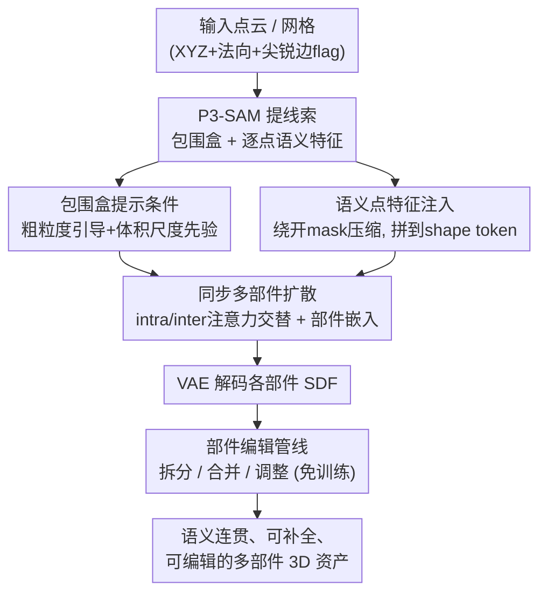

# X-Part: High Fidelity And Structure Coherent Shape Decomposition And Completion

**会议**: CVPR 2026  
**论文**: [CVF Open Access](https://openaccess.thecvf.com/content/CVPR2026/html/Yan_X-Part_High_Fidelity_And_Structure_Coherent_Shape_Decomposition_And_Completion_CVPR_2026_paper.html)  
**代码**: 待开源（论文称将公开，Project Page: https://yanxinhao.github.io/Projects/X-Part/）  
**领域**: 3D视觉  
**关键词**: 部件级3D生成, 形状分解与补全, 多部件扩散, 包围盒提示, 语义点特征  

## 一句话总结
X-Part 把一个完整 3D 物体分解成语义合理、结构连贯、且能补全被遮挡内部几何的多个部件——核心是用「包围盒」当部件提示、注入逐点语义特征当语义引导，在一个同步的多部件扩散框架里一次性生成所有部件，在部件分解和整体生成两项任务上都刷到 SOTA。

## 研究背景与动机
**领域现状**：3D 内容创作里，能把一个整体网格拆成"有意义的部件"非常关键——网格重拓扑、UV 展开、3D 打印、仿真都依赖部件级结构。当前主流的部件生成走的是 latent vecset 扩散路线（3DShape2VecSet 那一脉）：每个部件用一组独立的 latent code 表示，要么逐部件独立生成（如 HoloPart），要么所有部件同步生成（如 PartCrafter、PartPacker）。

**现有痛点**：这两类方法各有硬伤。① 依赖分割的方法（HoloPart 等把 2D/3D 分割结果直接当输入）对分割误差极其敏感——分割一旦不准，生成的部件几何就跟着崩；而且分割只给"语义划分线索"，并不负责补全被遮挡区域的完整几何。② 不依赖分割的方法（PartCrafter、PartPacker）靠多实例 DiT 自动冒出部件，但**可控性差**、部件边界模糊，用户没法指定"我要这里分成几块、分多大"。还有些方法（CoPart 最多 8 个部件、OmniPart 无法补全遮挡几何）在部件数和补全能力上受限。

**核心矛盾**：可控性 vs 鲁棒性之间的撕扯。想可控就得喂细粒度分割（点级 mask），但细粒度信号一旦有噪声，模型会**过拟合到错误的分割边界**；想鲁棒就丢掉显式分割，但又失去了用户控制部件划分的能力。

**本文目标**：在一个框架里同时拿下三件事——(1) 部件语义有意义、(2) 被遮挡/内部区域几何能合理补全、(3) 用户可控可编辑。

**切入角度**：作者的两个关键观察。其一，**包围盒**比点级分割粗，恰恰这个"粗"是优点——它不会让模型死记输入 mask 的精确边界（缓解过拟合），还额外提供了部件的体积/尺度先验，对只露出一部分的遮挡部件尤其有用。其二，P3-SAM 输出的**高维逐点语义特征**比它最终预测的 mask 更鲁棒，因为 mask 预测头会把高维信息压缩掉，而直接用语义特征绕开了这层信息瓶颈。

**核心 idea**：不喂分割 mask，改喂「包围盒 + 逐点语义特征」作为条件，在同步多部件扩散里完成可控、鲁棒、可补全的部件级分解。

## 方法详解

### 整体框架
输入是一个物体的点云（或先用 image-to-3D 模型从图片生成水密网格再采点云），输出是若干个几何完整、语义合理的部件 mesh。整条管线是：先用现成的原生 3D 分割器 **P3-SAM** 从输入点云自动抽出"初始部件分割 + 各部件包围盒 + 逐点语义特征"，这一步只当**线索提取器**，不直接把它的分割当答案；然后进入核心的**同步多部件扩散**——把全局物体条件 $f_o'$ 和每个部件的条件 $f_p'$（都拼上了语义特征）注入一个 DiT，模型一次性为所有 $K$ 个部件生成 latent token，经过微调过的 VAE 解码成各部件的 SDF/几何；最后再挂一个**免训练的部件编辑管线**支持拆分/合并/调整。

整个方法建立在预训练的 vecset 3D 扩散模型之上：VAE 把点云（含 XYZ、法向、是否在尖锐边的 flag，共 7 维）编码成 latent token，扩散模型用 flow matching 在 latent 空间建模。作者额外在部件形状数据上微调 VAE，并给每个部件分配**更少的 token**（因为单个部件的几何复杂度远低于整体物体）。

### 关键设计

**1. 包围盒提示替代分割 mask：用"粗"换可控与抗过拟合**

最直接的做法是把 P3-SAM 的分割结果直接当输入，但作者偏不——分割是点级、细粒度的，模型会过拟合到这些精确（而往往有噪）的边界上。X-Part 改用**包围盒**作为部件提示：在指定的盒子内从物体点云采样得到 $X_{inbox}$，再用一个可学习的部件编码器 $E_p$ 编码成部件条件 $f_p = E_p(X_{inbox})$。包围盒是一种粗粒度引导，天然不会逼模型死记分割边界；更妙的是盒子还携带**体积/尺度信息**——对于只露出局部、大部分被遮挡的部件，盒子告诉模型"这个部件实际有多大"，直接服务于几何补全和可控性。训练时还对包围盒做随机平移和适度缩放增广，让推理期对盒子扰动更鲁棒。注意一个部件的盒子可能框进相邻部件的点，但靠下面的语义特征 + 部件间注意力，模型能在生成时把无关点互相排除。

**2. 高维语义点特征注入：绕开 mask 压缩瓶颈换鲁棒性**

第二个观察是：P3-SAM 预测出来的 mask 不如它**中间的高维逐点语义特征**鲁棒，因为 mask 预测头会把信息压缩进低维标签，语义特征则保留了完整信息。X-Part 直接把语义编码器 $E_{sem}$ 的逐点特征插值后拼到 shape token 上，构成增强条件：

$$f_o' = \mathrm{Concat}(f_o, \mathrm{Interp}(E_{sem}(X), X)), \quad f_p' = \mathrm{Concat}(f_p, \mathrm{Interp}(E_{sem}(X), X_{inbox}))$$

其中 $f_o = E_o(X)$ 是冻结的形状 VAE 编码器给出的全局物体条件，$f_p$ 是部件条件。语义特征要先按形状编码器输出的降采样 XYZ 位置做插值，以便和 shape token 在数量上对齐。为了不让模型过度依赖这个高维特征，训练时对语义特征做随机 dropout。正是这层鲁棒的语义引导，让分解既语义有意义、又结构连贯。

**3. 同步多部件扩散 + 部件嵌入：intra/inter 注意力交替，破解部件数上限**

X-Part 用**多部件扩散**同步生成所有部件的 latent：物体由 $K$ 个部件组成，拼成 $O = \mathrm{Concat}(\{z_i\}_1^K) \in \mathbb{R}^{nK \times C}$，每个部件 $n$ 个 token。扩散块重复 $N$ 次，每块是"一个 self-attention + 两个 cross-attention"。关键在 self-attention 的**奇偶交替**：偶数块在每个部件**内部**做 self-attention（intra-part，保证单部件几何自洽），奇数块在**所有部件之间**做 self-attention（inter-part，交换部件间信息、协调整体结构）：

$$\mathrm{Attn}_{intra} = \mathrm{softmax}\!\Big(\tfrac{\sigma_q(z_i)\sigma_k(z_i)^T}{\sqrt{d}}\Big)\sigma_v(z_i), \quad \mathrm{Attn}_{inter} = \mathrm{softmax}\!\Big(\tfrac{\sigma_q(z_i)\sigma_k(O)^T}{\sqrt{d}}\Big)\sigma_v(O)$$

两个 cross-attention 负责把全局条件 $f_o'$ 和部件条件 $f_p'$ 注入。此外引入**可学习的部件嵌入 codebook** $E \in \mathbb{R}^{l \times C}$，给每个部件分配唯一 embedding（重复 $n$ 次加到该部件 token 上），增强部件间的区分度。一个巧设计是：为了能分解出比训练集单物体最大部件数还多的物体，训练时把 $l$ 设得**远大于**实际需要，并随机给每个部件分配唯一 embedding——这样推理时不受训练部件数上限约束，实际可支持多达 **50 个**部件。训练用 flow matching 目标：前向加噪 $z_t = t z_0 + (1-t)\varepsilon$，模型预测速度场 $v = \varepsilon - z_0$，

$$\mathcal{L} = \mathbb{E}_{z,t,\varepsilon}\big\|(\varepsilon - z_0) - v_\theta(z_t, t, f_o', f_p')\big\|^2$$

**4. 免训练的部件编辑管线：拆分/合并/调整都靠"局部重采样"**

X-Part 把生成框架顺手接成一个交互式编辑管线，借鉴 Repaint 思路，**完全免训练**实现三种编辑：part split（拆分包围盒、相应生成多个部件）、part merge（合并）、part adjust（调整某个盒子，让该部件及相邻部件重新生成）。机制统一：对包围盒指定的目标部件，把它们的 latent token 重新采样、重新去噪，而**其余部件的 token 保持不变**——这样只局部改动、其它部件不受影响，给用户提供了直观的盒子级控制。这也是论文强调的"可编辑、production-ready"卖点。

## 实验关键数据

评测在 **ObjaversePart-Tiny** 数据集的 200 个样本上做，指标为 Chamfer Distance（CD↓）和两个阈值 [0.1, 0.05] 的 F-Score↑。物体归一化到 [−1, 1]，并按 [0, 90, 180, 270] 度旋转取最好分数做位姿无关评测。

### 主实验

**部件分解（Table 1）**：输入为真值水密网格，自动生成分解后的部件，和真值部件比。对比分割类方法（SAMPart3D、PartField，它们只能在表面切分点、补不出完整部件几何）和生成类方法（HoloPart、OmniPart，并把它们的分割统一替换成 P3-SAM、给 OmniPart 喂真值 2D mask 以排除分割质量干扰）。

| 方法 | CD↓ | Fscore-0.1↑ | Fscore-0.05↑ |
|------|------|------------|-------------|
| SAMPart3D | 0.15 | 0.73 | 0.63 |
| PartField | 0.17 | 0.68 | 0.57 |
| HoloPart | 0.26 | 0.59 | 0.43 |
| OmniPart | 0.23 | 0.63 | 0.46 |
| **X-Part (Ours)** | **0.11** | **0.80** | **0.71** |

即便 OmniPart 被喂了真值 2D mask，X-Part 仍全面领先。

**整体形状生成（Table 2）**：扩展到 image-to-3D 部件生成——先用现成 image-to-3D 模型生成水密网格再喂进管线分解。因不同方法部件划分不同、难和真值部件一一对应，这里只比所有部件拼起来的**整体几何**。

| 方法 | CD↓ | Fscore-0.1↑ | Fscore-0.05↑ |
|------|------|------------|-------------|
| Part123 | 0.42 | 0.36 | 0.20 |
| HoloPart | 0.09 | 0.88 | 0.73 |
| PartCrafter | 0.20 | 0.66 | 0.45 |
| PartPacker | 0.11 | 0.85 | 0.65 |
| OmniPart | 0.08 | 0.91 | 0.77 |
| **X-Part (Ours)** | **0.08** | **0.92** | **0.78** |

整体几何质量也达到/超过最强基线，且分解更精细、常能生成更多语义合理的部件。

### 消融实验

基于真值包围盒，在 ObjaversePart-Tiny 上分别测部件级（Part-level）和整体级（Overall-level）指标（CD↓ / F1-0.1↑ / F1-0.05↑）：

| 配置 | Part CD↓ | Part F1-0.1↑ | Part F1-0.05↑ | 说明 |
|------|---------|-------------|--------------|------|
| Full (Ours) | **0.11** | **0.80** | **0.71** | 完整模型 |
| w/o part embedding | 0.13 | 0.78 | 0.68 | 去部件嵌入，区分度下降 |
| w/o object-cond | 0.12 | 0.79 | 0.70 | 去全局条件，缺整体先验 |
| **w/o part-cond** | **0.27** | **0.57** | **0.47** | 去部件条件，**掉点最狠** |
| w/o semantic-feat | 0.12 | 0.78 | 0.69 | 去语义特征，连贯性下降 |
| w/o inter-part self-attn | 0.12 | 0.79 | 0.70 | 去部件间注意力，缺全局协调 |

### 关键发现
- **部件条件（包围盒提示）贡献最大**：去掉后 Part-level CD 从 0.11 暴涨到 0.27、F1-0.1 从 0.80 跌到 0.57——印证了"用包围盒指明部件位置与尺度"是可控分解的核心，没有它模型几乎不知道该往哪儿分。
- 其余组件（部件嵌入、全局条件、语义特征、部件间注意力）各自掉点温和但一致，说明它们是协同的：语义特征管"语义连贯"、inter-part 注意力管"整体协调"、part embedding 管"部件区分"。
- 整体级（Overall-level）指标对各组件都不太敏感（基本都在 0.97/0.98 附近），说明这些设计主要改善的是**部件划分的正确性**而非整体外形——这正是部件级任务的难点所在。

## 亮点与洞察
- **"用粗信号反而更好"的反直觉设计**：包围盒比分割 mask 粗，但正因为粗才不会让模型过拟合到有噪的分割边界，还顺带提供体积尺度先验。这个"降低条件精度换鲁棒与可控"的思路，可迁移到其它"分割引导生成"任务（如 2D 部件编辑、布局生成）。
- **绕开 mask 预测头取中间特征**：用 P3-SAM 的高维逐点语义特征而非它的最终 mask，本质是"别用被压缩过的下游输出，去用上游富信息表征"。这是个通用 trick——凡是用现成感知模型当条件时，中间特征往往比最终离散预测更鲁棒。
- **codebook 超额初始化破部件数上限**：训练时把部件嵌入 codebook 设得远大于实际、随机分配，从而推理支持多达 50 个部件、不被训练分布卡死。这种"训练期故意过参数化以泛化到更多实例"的做法很巧。
- **免训练编辑全靠局部重采样**：拆分/合并/调整统一成"只重采样目标部件 token、冻结其余"，零额外训练就拿到交互可编辑性，工程上极友好。

## 局限与展望
- 作者承认：方法**纯靠几何线索**分解，缺乏物理原理引导，某些需要物理意义的分解需求（如按可动关节、受力结构拆）满足不了。
- 所有部件的 latent 同步过扩散，**推理时间随部件数增长**，部件多时难以实时——对高部件数物体是个瓶颈。
- 自己发现的局限：强依赖 P3-SAM 的质量——虽然用包围盒和语义特征缓解了分割噪声，但初始线索仍来自 P3-SAM，若它在某类物体上彻底失效，包围盒和语义特征也会带偏；且评测仅在 ObjaversePart-Tiny 200 样本上，跨域/真实扫描数据的泛化未充分验证。
- 改进思路：引入物理/可动性先验做物理感知分解；用稀疏化或层级化部件 token 缓解部件数与推理时间的线性关系。

## 相关工作与启发
- **vs HoloPart**：HoloPart 逐部件独立从 3D 分割补全几何，对分割误差敏感；X-Part 改用包围盒+语义特征做同步多部件生成，部件分解质量（CD 0.11 vs 0.26）明显更高、对分割噪声更鲁棒。
- **vs PartCrafter / PartPacker**：它们不依赖显式分割、靠多实例 DiT 自动冒部件，但可控性差、边界模糊；X-Part 用包围盒提示拿回了用户控制权，且能补全遮挡几何。
- **vs OmniPart**：OmniPart 也用包围盒提示、走 Trellis 式显式表示，但无法补全被遮挡几何、且需要先生成粗几何；X-Part 直接对已有 3D 形状做分解+补全，即便 OmniPart 被喂真值 mask 仍领先。
- **vs CoPart / BANG / AutoPartGen**：CoPart 最多 8 部件且不能分解已有形状；BANG 用爆炸式分解但易丢细几何；AutoPartGen 自回归生成部件、计算贵且控制弱。X-Part 在部件数（达 50）、可控性、补全能力上综合占优。

## 评分
- 新颖性: ⭐⭐⭐⭐ "包围盒提示 + 中间语义特征"这套条件设计有反直觉的巧思，虽然多部件同步扩散框架沿用 PartCrafter 路线。
- 实验充分度: ⭐⭐⭐⭐ 分解+整体生成双任务、和多类强基线对比、消融清晰定位了部件条件是核心；但仅在一个 200 样本数据集评测。
- 写作质量: ⭐⭐⭐⭐ 动机推导和条件设计讲得清楚，三组实验表格自洽。
- 价值: ⭐⭐⭐⭐ 直接服务 3D 资产生产管线（重拓扑、UV、编辑），可控+可补全+可编辑的部件级分解有很强实用价值。

<!-- RELATED:START -->

## 相关论文

- [\[CVPR 2026\] EI-Part: Explode for Completion and Implode for Refinement](ei-partexplode_for_completion_and_implode_for_refinement.md)
- [\[CVPR 2026\] Multi-modal Frequency Decomposition Network for Semantic Scene Completion](multi-modal_frequency_decomposition_network_for_semantic_scene_completion.md)
- [\[CVPR 2026\] Unified Primitive Proxies for Structured Shape Completion](unified_primitive_proxies_for_structured_shape_completion.md)
- [\[CVPR 2026\] Learning 3D Shape Fidelity Metric from Real-world Distortions](learning_3d_shape_fidelity_metric_from_real-world_distortions.md)
- [\[CVPR 2026\] HyperGaussians: High-Dimensional Gaussian Splatting for High-Fidelity Animatable Face Avatars](hypergaussians_high-dimensional_gaussian_splatting_for_high-fidelity_animatable_.md)

<!-- RELATED:END -->
